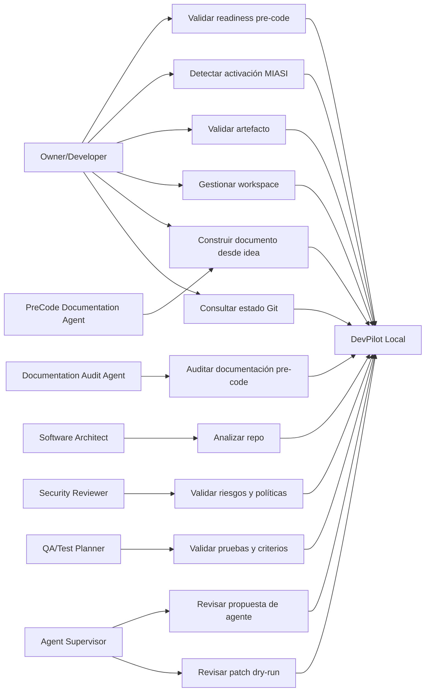

# Use Cases — DevPilot Local

## 1. Propósito

Este documento define los casos de uso baseline de DevPilot Local para MVP, MVP+ y post-MVP. La expresión “casos de uso iniciales” no significa incompletitud del documento; significa que el documento cubre los casos necesarios para aprobar la fase pre-code y preparar arquitectura, dejando casos avanzados sujetos a refinamiento cuando se diseñen desktop, web, CI/CD remoto o agentes multirol complejos.

## 2. Diagrama de casos de uso — visión textual



## 3. Casos de uso MVP

### UC-MVP-001 — Ejecutar readiness pre-code

| Campo | Descripción |
|---|---|
| Actor principal | Owner/Developer |
| Objetivo | Determinar si el proyecto tiene artefactos mínimos para avanzar. |
| Precondición | Existe un workspace o repo con carpeta `docs/`. |
| Comando esperado | `python -m devpilot_core readiness-check` |
| Requisitos | FR-MVP-003, FR-MVP-008, FR-MVP-015 |

**Flujo principal**

1. El usuario ejecuta `readiness-check`.
2. DevPilot identifica la raíz del proyecto.
3. DevPilot revisa artefactos obligatorios.
4. DevPilot genera resultado PASS/FAIL/WARN/BLOCK.
5. DevPilot escribe reporte JSON/Markdown en `outputs/reports/`.

**Salida esperada:** `outputs/reports/readiness_check.json` y, posteriormente, `readiness_check.md`.

### UC-MVP-002 — Determinar activación MIASI

| Campo | Descripción |
|---|---|
| Actor principal | Owner/Developer |
| Objetivo | Determinar si el proyecto debe aplicar MIASI. |
| Comando esperado | `python -m devpilot_core miasi-required` |
| Requisitos | FR-MVP-007, FR-MVP-009, FR-MVP-010 |

**Flujo principal**

1. El usuario ejecuta `miasi-required`.
2. DevPilot analiza metadata del proyecto o reglas configuradas.
3. DevPilot determina si hay IA, agentes, LLMs, RAG, tool calling o automatización inteligente.
4. DevPilot devuelve decisión y artefactos MIASI requeridos.

### UC-MVP-003 — Validar artefacto documental

| Campo | Descripción |
|---|---|
| Actor principal | Requirements Reviewer |
| Objetivo | Validar un `.md` contra reglas MIPSoftware. |
| Comando futuro | `python -m devpilot_core validate-artifact <path>` |
| Requisitos | FR-MVP-004, FR-MVP-005, FR-MVP-011 |

**Flujo principal**

1. El usuario indica el archivo a validar.
2. DevPilot lee frontmatter.
3. DevPilot valida campos obligatorios.
4. DevPilot valida secciones mínimas.
5. DevPilot produce PASS/FAIL con mensajes accionables.

### UC-MVP-004 — Validar checklist pre-code

| Campo | Descripción |
|---|---|
| Actor principal | Owner/Developer |
| Objetivo | Determinar si el proyecto puede pasar de planeación a implementación. |
| Comando futuro | `python -m devpilot_core checklist pre-code` |
| Requisitos | FR-MVP-006, FR-MVP-012 |

**Flujo principal**

1. DevPilot carga checklist pre-code.
2. Verifica evidencias requeridas.
3. Marca PASS/FAIL/WARN/BLOCK.
4. Genera reporte de bloqueo si falta evidencia crítica.

### UC-MVP-005 — Crear borrador documental desde idea

| Campo | Descripción |
|---|---|
| Actor principal | Owner/Developer |
| Agente | PreCode Documentation Agent |
| Objetivo | Generar borradores documentales iniciales a partir de una idea de proyecto. |
| Comando futuro | `python -m devpilot_core draft-doc --type product_vision --idea <texto>` |
| Requisitos | FR-MVP-013, FR-MVP-016 |

**Flujo principal**

1. El usuario entrega una idea de proyecto.
2. DevPilot selecciona la plantilla MIPSoftware aplicable.
3. El agente genera un borrador en dry-run.
4. El usuario revisa, edita y aprueba manualmente.
5. DevPilot registra evidencia de la generación.

**Restricciones**

- No usa API externa obligatoria.
- No aprueba documentos automáticamente.
- No sobrescribe archivos sin confirmación.

### UC-MVP-006 — Auditar documentación pre-code con agente controlado

| Campo | Descripción |
|---|---|
| Actor principal | Agent Supervisor |
| Agente | Documentation Audit Agent |
| Objetivo | Detectar brechas, contradicciones y debilidades en documentos pre-code. |
| Comando futuro | `python -m devpilot_core audit-docs --phase pre-code` |
| Requisitos | FR-MVP-014, FR-MVP-016 |

**Flujo principal**

1. DevPilot inventaría documentos pre-code.
2. Valida reglas determinísticas.
3. El agente produce observaciones semánticas.
4. DevPilot separa hallazgos determinísticos de recomendaciones agentic.
5. El humano decide si aplica ajustes.

## 4. Casos de uso MVP+

| ID | Caso de uso | Actor | Requisitos | Resultado esperado |
|---|---|---|---|---|
| UC-PLUS-001 | Registrar workspace persistente | Owner/Developer | FR-PLUS-001 | `.devpilot/project.yaml` válido. |
| UC-PLUS-002 | Consultar estado Git | Owner/Developer | FR-PLUS-002 | Reporte read-only de branch, commit y cambios. |
| UC-PLUS-003 | Analizar repo | Software Architect | FR-PLUS-003 | Reporte de estructura, docs, tests y riesgos. |
| UC-PLUS-004 | Validar entorno virtual | Owner/Developer | FR-PLUS-004 | Reporte de Python, venv y dependencias. |
| UC-PLUS-005 | Revisar patch dry-run | Agent Supervisor | FR-PLUS-005, FR-PLUS-010 | Impacto, riesgos, tests sugeridos y aprobación requerida. |
| UC-PLUS-006 | Code review asistido | Code Reviewer | FR-PLUS-006, FR-PLUS-008 | Hallazgos con evidencia y severidad. |
| UC-PLUS-007 | Proponer refactor seguro | Developer | FR-PLUS-007 | Plan con pruebas, rollback y riesgos. |
| UC-PLUS-008 | Ejecutar agente especializado | Agent Supervisor | FR-PLUS-008, FR-PLUS-010 | Ejecución con cards, policy gate, eval y trazas. |

## 5. Casos de uso post-MVP

| ID | Caso de uso | Interfaz | Resultado esperado |
|---|---|---|---|
| UC-POST-001 | Navegar workspaces desde escritorio | Desktop | Vista de documentos, gates, reportes, riesgos y trazas. |
| UC-POST-002 | Visualizar dashboard web | Web | Estado multi-proyecto, readiness, riesgos y evolución. |
| UC-POST-003 | Orquestar agentes multirol | Desktop/Web | Multiagentes controlados por MIASI. |
| UC-POST-004 | Preparar release y despliegue | CLI/Desktop/Web | Checklist, rollback, evidencia y gates. |

## 6. Estado

```yaml
use_cases_status: approved
coverage: "MVP complete; MVP+ baseline; post-MVP directional"
ready_for_architecture_sprint: true
```
