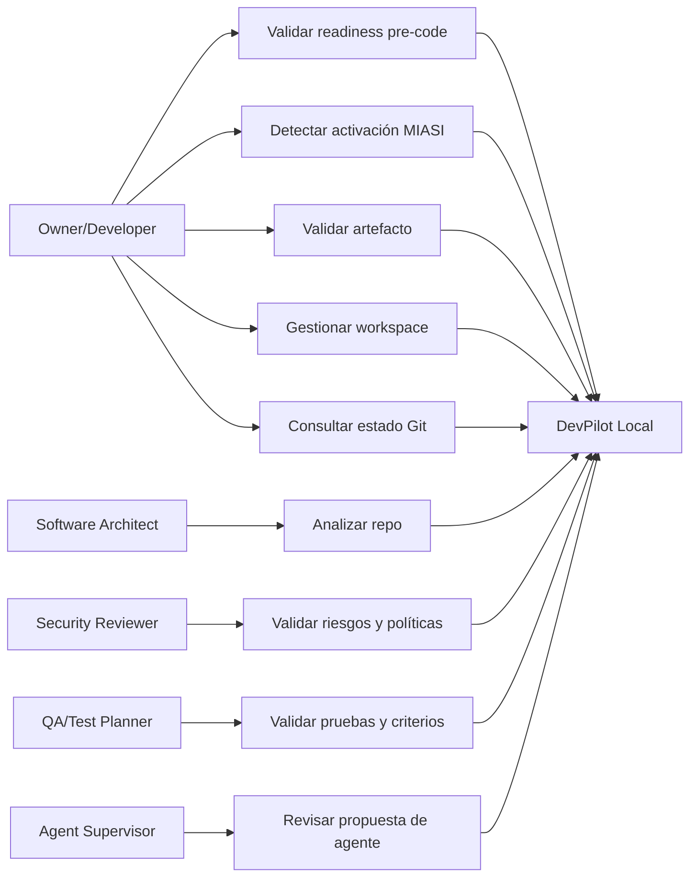

# Use Cases — DevPilot Local

## 1. Propósito

Este documento define los casos de uso iniciales de DevPilot Local. Cada caso conecta actores, precondiciones, flujo principal, flujos alternos, salidas y relación con requerimientos. La prioridad inicial es el MVP CLI + validadores, pero se documentan también casos MVP+ para Git, repos, patches, refactor y agentes controlados.

## 2. Diagrama de casos de uso — visión textual



## 3. Casos de uso MVP

### UC-MVP-001 — Ejecutar readiness pre-code

| Campo | Descripción |
|---|---|
| Actor principal | Owner/Developer |
| Objetivo | Determinar si el proyecto tiene artefactos mínimos para avanzar. |
| Precondición | Existe un workspace o repo con carpeta `docs/`. |
| Comando esperado | `python -m devpilot_core readiness-check` |
| Requisitos | FR-MVP-002, FR-MVP-003, FR-MVP-012, FR-MVP-014 |

**Flujo principal**

1. El usuario ejecuta `readiness-check`.
2. DevPilot identifica la raíz del proyecto.
3. DevPilot revisa artefactos obligatorios.
4. DevPilot genera resultado PASS/FAIL/WARN.
5. DevPilot escribe reporte JSON/Markdown en `outputs/reports/`.

**Flujos alternos**

- Si falta un artefacto obligatorio, el resultado es `blocked`.
- Si un artefacto existe pero es débil, el resultado es `needs_review`.
- Si todos los artefactos cumplen, el resultado es `ready`.

**Salida esperada**

`outputs/reports/readiness_check.json` con estado, checks, fallos y evidencia.

### UC-MVP-002 — Determinar activación MIASI

| Campo | Descripción |
|---|---|
| Actor principal | Owner/Developer |
| Objetivo | Determinar si el proyecto debe aplicar MIASI. |
| Comando esperado | `python -m devpilot_core miasi-required` |
| Requisitos | FR-MVP-004, FR-MVP-008, FR-MVP-009 |

**Flujo principal**

1. El usuario ejecuta `miasi-required`.
2. DevPilot analiza metadata del proyecto o reglas configuradas.
3. DevPilot determina si hay IA, agentes, LLMs, RAG, tool calling o automatización inteligente.
4. DevPilot devuelve decisión y artefactos MIASI requeridos.

**Salida esperada**

JSON con `miasi_required`, razón y lista de artefactos obligatorios.

### UC-MVP-003 — Validar artefacto documental

| Campo | Descripción |
|---|---|
| Actor principal | Requirements Reviewer |
| Objetivo | Validar un `.md` contra reglas MIPSoftware. |
| Comando futuro | `python -m devpilot_core validate-artifact <path>` |
| Requisitos | FR-MVP-005, FR-MVP-006, FR-MVP-011 |

**Flujo principal**

1. El usuario indica el archivo a validar.
2. DevPilot lee frontmatter.
3. DevPilot valida campos obligatorios.
4. DevPilot valida secciones mínimas.
5. DevPilot produce PASS/FAIL con mensajes accionables.

**Salida esperada**

Reporte por artefacto con campos faltantes, secciones faltantes y severidad.

### UC-MVP-004 — Validar checklist pre-code

| Campo | Descripción |
|---|---|
| Actor principal | Owner/Developer |
| Objetivo | Determinar si el proyecto puede pasar de planeación a implementación. |
| Comando futuro | `python -m devpilot_core checklist pre-code` |
| Requisitos | FR-MVP-007, FR-MVP-014, FR-MVP-015 |

**Flujo principal**

1. El usuario ejecuta checklist pre-code.
2. DevPilot revisa criterios obligatorios.
3. DevPilot cruza documentos, requisitos y evidencia.
4. DevPilot emite PASS/FAIL/BLOCK.

**Salida esperada**

Checklist evaluado con evidencia y decisión de avance.

## 4. Casos de uso MVP+

### UC-PLUS-001 — Registrar workspace DevPilot

| Campo | Descripción |
|---|---|
| Actor principal | Owner/Developer |
| Objetivo | Convertir un proyecto/repo local en workspace gobernado por DevPilot. |
| Comando futuro | `devpilot workspace init` |
| Requisitos | FR-PLUS-001 |

**Flujo principal**

1. El usuario ejecuta inicialización de workspace.
2. DevPilot crea o valida `.devpilot/`.
3. DevPilot registra estándares aplicables.
4. DevPilot genera estado inicial del workspace.

**Salida esperada**

`.devpilot/project.yaml`, `workspace_state.json` y reportes iniciales.

### UC-PLUS-002 — Consultar estado Git

| Campo | Descripción |
|---|---|
| Actor principal | Owner/Developer |
| Objetivo | Conocer estado del repo antes de validar, aplicar patches o proponer refactors. |
| Comando futuro | `devpilot git-status` |
| Requisitos | FR-PLUS-002 |

**Flujo principal**

1. DevPilot detecta si el workspace es repo Git.
2. Lee branch, estado, archivos modificados y último commit.
3. Produce reporte sin modificar el repo.

**Salida esperada**

Reporte Git read-only.

### UC-PLUS-003 — Analizar repositorio

| Campo | Descripción |
|---|---|
| Actor principal | Software Architect |
| Objetivo | Evaluar estructura, documentación, pruebas y riesgos del repo. |
| Comando futuro | `devpilot repo-scan` |
| Requisitos | FR-PLUS-003 |

**Flujo principal**

1. DevPilot escanea archivos permitidos por política.
2. Clasifica módulos, docs, tests, configuración y outputs.
3. Detecta brechas y genera reporte.

### UC-PLUS-004 — Validar patch en dry-run

| Campo | Descripción |
|---|---|
| Actor principal | Code Reviewer |
| Objetivo | Evaluar un patch antes de aplicarlo. |
| Comando futuro | `devpilot patch-review <patch>` |
| Requisitos | FR-PLUS-004, FR-PLUS-005, FR-PLUS-006 |

**Flujo principal**

1. El usuario entrega patch o diff.
2. DevPilot analiza alcance, archivos tocados, riesgos y tests afectados.
3. DevPilot emite PASS/FAIL/WARN.
4. DevPilot no modifica archivos.

### UC-PLUS-005 — Revisar propuesta de refactor seguro

| Campo | Descripción |
|---|---|
| Actor principal | Software Architect / Code Reviewer |
| Objetivo | Generar un plan de refactor reversible y testeable. |
| Comando futuro | `devpilot refactor-plan` |
| Requisitos | FR-PLUS-007 |

**Flujo principal**

1. El usuario solicita análisis de refactor.
2. DevPilot identifica deuda, archivos y riesgos.
3. DevPilot propone secuencia segura.
4. DevPilot exige pruebas y rollback.

### UC-PLUS-006 — Revisar propuesta de agente

| Campo | Descripción |
|---|---|
| Actor principal | Agent Supervisor |
| Objetivo | Revisar una recomendación generada por agente antes de aceptarla. |
| Comando/interfaz futura | `devpilot agent-review` / UI desktop |
| Requisitos | FR-PLUS-010, FR-POST-004 |

**Flujo principal**

1. Un agente produce recomendación.
2. DevPilot registra trazas y evidencia.
3. El supervisor humano revisa.
4. El sistema aprueba, rechaza o solicita cambios.

## 5. Criterios de uso seguro

| Regla | Aplicación |
|---|---|
| Dry-run por defecto | Todo patch, refactor o cambio de repo inicia sin modificar archivos. |
| Read-only antes de write | Git y repo analysis empiezan solo lectura. |
| Human approval | Toda acción sensible requiere aprobación humana. |
| Evidencia obligatoria | Todo gate produce reporte. |
| MIASI obligatorio | Toda función agentic requiere cards, policy, eval y trazas. |

## 6. Estado

```yaml
use_cases_status: reviewed
ready_for_owner_approval: true
```
