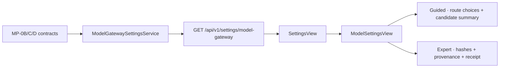
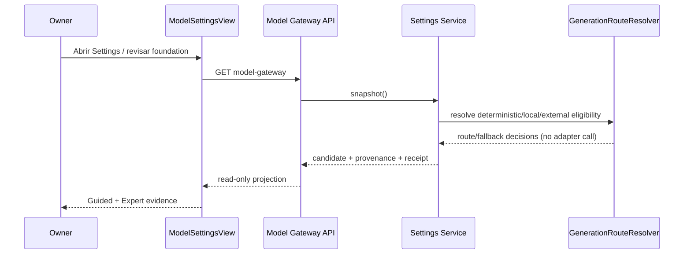

# MP-0E — Provider/Provenance Guided-Expert UX

## 1. Propósito

MP-0E hace visible en DevPilot la foundation Multiprovider ya implementada en MP-0B..D sin ejecutar ningún modelo. La superficie extendida es la existente `Settings → AI Control Center → Model Gateway`; no se crea una página paralela ni una segunda API de provider runtime.

## 2. Vertical slice

La misma respuesta de Model Gateway agrega `multiprovider_foundation`, una proyección read-only. No modifica provider configuration ni runtime state.

## 3. Datos reales, no ejecución simulada

`multiprovider_foundation` se construye con:

- `GenerationRequest`;
- `GenerationProviderRegistryView`;
- `GenerationRouteResolver`;
- `ProviderSelectionPolicy`;
- `ArtifactCandidateEnvelope`;
- `GenerationProvenanceEnvelope`;
- `ProviderExecutionReceipt`.

El candidate mostrado es **deterministic-only/no-inference**. Su objetivo es demostrar identidad, lifecycle, lineage y provenance contract; no pretende representar contenido generado por LocalModel/ExternalModel.

Invariantes visibles:

- `foundation_preview=true`;
- `model_call_performed=false`;
- `network_used=false`;
- `external_api_used=false`;
- Local/External se muestran como choices gobernadas, no como ejecuciones;
- una ruta disabled no presenta CTA de ejecución.

## 4. Guided UX

Guided prioriza:

1. qué rutas existen;
2. cuál es ejecutable en MP-0;
3. por qué Local/External están disabled/fallback/blocked;
4. requested route vs resolved route;
5. candidate ID/version/status/origin/lineage;
6. costo y clasificación de red;
7. siguiente acción: revisión únicamente.

No expone JSON completo como contenido primario.

## 5. Expert UX

Expert usa progressive disclosure para mostrar:

- route hash;
- provenance hash;
- receipt hash;
- profile/dependency profile;
- fallback reason;
- authority boundary;
- Model Gateway summary JSON;
- catálogo completo de provider routes y controles runtime existentes.

## 6. ContextPack vs Agentic RAG

MP-0E formaliza visualmente:

- **ContextPack grounding**: contexto bounded/hashable asociado al candidate/request;
- **Agentic RAG**: capability separada de retrieval/review/runtime.

La foundation preview no ejecuta retrieval ni Agentic RAG. El label `RAG` no se usa como sinónimo de ContextPack.

## 7. Settings information architecture

MP-0E absorbe de forma bounded, en la superficie que ya estaba abierta:

- `UX-P1-02-B01-004`: reduce densidad mediante Guided summary + Expert disclosure;
- `UX-P1-02-B01-006`: diferencia explícitamente Scope, Persistencia, Authority y Efecto para consulta, diagnóstico y controles runtime.

`CAP-13B01-SETTINGS-001` no queda resuelto: sigue siendo una evolución mayor de gobierno unificado de configuración persistente.

`UX-P1-02-C02-004` tampoco se corrige aquí porque pertenece a Pre-code; MP-0E únicamente evita reproducir esa ambigüedad en Settings.

## 8. Authority y seguridad

No se concede a provider/model/agent autoridad de source write, apply, approval, freeze, Quality, Git, tool execution o shell.

## 9. Testing y browser acceptance

Sandbox:

- focal backend/API-contract/UI-source tests;
- MP-0D runtime compatibility;
- GSDLC-06-E settings regression;
- web Settings regression;
- static Model Settings smoke.

Windows:

- Vite build con runtime frontend aislado del worktree Multiprovider;
- API/UI start desde el worktree Multiprovider;
- selective browser acceptance en Settings;
- screenshots Guided y Expert;
- observación manual de disabled routes/no fake execution;
- evidencia de `model_call_performed=false`, network/external=false;
- focal/impact/docs PASS;
- Full Regression=0.

## 10. Performance budget successor

El gate histórico UOC-011 conserva sus presupuestos originales como evidencia histórica. Antes de MP-0E, el successor MP-0D ya excedía tanto el budget absoluto como el `currentUiSourceBaselineBytes` heredado de `repo435`; por tanto, reutilizar ese baseline como si siguiera siendo current produciría un BLOCK heredado y no atribuible a este sprint.

MP-0E adopta un successor contract explícito y no silencioso:

- predecessor source baseline: `1,065,168` bytes, medido semánticamente sobre MP-0D `45c75db8...`;
- predecessor largest source: `98,283` bytes;
- MP-0E allowed total growth: `10,240` bytes;
- MP-0E allowed largest-file growth: `0` bytes;
- MP-0E actual total growth: `8,987` bytes (`+0.84%`);
- MP-0E actual largest-file growth: `0` bytes.

La política es `predecessor-baseline-plus-bounded-delta`. No reescribe UOC-011, no toma el current size como baseline y no permite widening implícito. El smoke reporta predecessor, allowance y crecimiento real por separado.

## 11. STOP

MP-0E no autoriza MP-0F antes de su adjudicación Windows.
