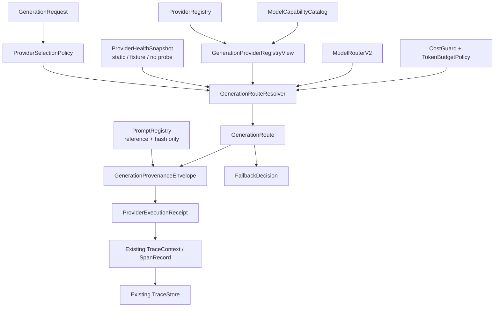
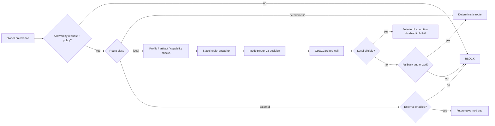
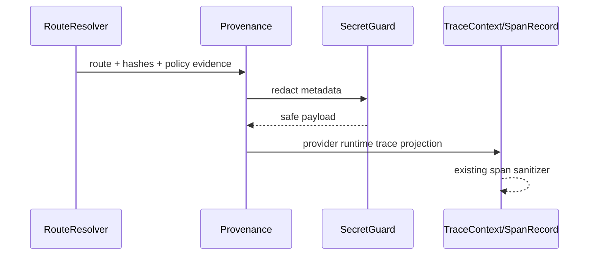

# MP-0D — Provider Runtime Governance Foundation

## 1. Propósito

> **Guía no técnica.** Esta capa decide qué ruta de generación es elegible, por qué una alternativa queda bloqueada, si un fallback está permitido y qué evidencia debe quedar. En MP-0D todavía no se ejecuta ningún modelo real.

MP-0D implementa el contrato transversal de runtime Multiprovider sobre las capacidades ya existentes de DevPilot. No crea un segundo Model Gateway, un segundo Provider Registry, un segundo CostGuard ni un segundo Trace Store.

## 2. Decisión de reutilización

| Necesidad | Authority existente | Acción MP-0D |
|---|---|---|
| model/provider capabilities | `ModelCapabilityCatalog` | REUSE |
| ordered model routing | `ModelRouterV2` | REUSE |
| model execution boundary | `ModelAdapterRouter` | REUSE-AS-BOUNDARY; no model calls in MP-0D |
| provider configuration | `ProviderRegistry` | REUSE |
| local static discovery | `LocalProviderDiscoveryService` | REUSE + configured-semantics correction |
| prompts | `PromptRegistry` | REUSE; reference/hash only |
| cost policy | `CostGuard` + TokenBudgetPolicy | REUSE |
| credentials | `ProviderCredentialReference` / auth adapters | REUSE; reference-only |
| redaction | `SecretGuard` | REUSE |
| tracing | `TraceContext` / `SpanRecord` / `TraceStore` | REUSE |

New contracts are adaptation/evidence contracts needed specifically by candidate generation: `GenerationRoute`, `GenerationRouteResolver`, `ProviderSelectionPolicy`, `ProviderHealthSnapshot`, `FallbackDecision`, `GenerationProvenanceEnvelope` and `ProviderExecutionReceipt`.

## 3. Arquitectura runtime

El resolver no llama a `ModelAdapterRouter.generate/classify/embed`. En MP-0D su trabajo termina en una decisión gobernada y evidencia serializable.

## 4. Matriz de rutas MP-0D

| Ruta | Elegibilidad | Ejecución en MP-0D | Network | Fallback |
|---|---|---:|---:|---|
| Deterministic | policy + request | sí, como provider no-modelo | DENY | n/a |
| Local Model | config/capability/profile/health/cost | **no model call** | DENY | local→deterministic solo si policy |
| External Model | disabled/fail-closed | **no** | DENY | nunca implícito |

Un Local Model puede resultar `selected` como ruta semánticamente elegible, pero `execution_allowed=false` durante MP-0. Esto separa correctamente **selección de ruta** de **ejecución de provider**.

## 5. Resolución y fallback

`FallbackDecision` siempre registra requested class, used class, reason, policy id, `explicit=true` y `owner_visible=true`.

External nunca se convierte silenciosamente en deterministic/local.

## 6. Health snapshot contract

`ProviderHealthSnapshot` representa evidencia, no una sonda.

Campos relevantes:

- access route / provider / model identity;
- provider class;
- availability;
- configured/enabled;
- structured-output support;
- locality;
- check/source/version/model identity;
- benchmark score;
- approval state;
- `network_used=false`;
- `external_api_used=false`;
- stable SHA-256.

MP-0D puede usar fixtures o proyecciones estáticas del registry/catalog. No requiere daemon Ollama/LM Studio.

## 7. Provider configuration semantics

El versioned `.devpilot/providers.yaml.example` declara contratos seguros, pero **no significa que el operador haya configurado un provider local**.

Por ello `LocalProviderDiscoveryService` ahora reporta `configured=true` únicamente cuando la authority proviene de una configuración local real (`.devpilot/providers.yaml`) y existe endpoint. Esto resuelve `TEST-MP0A-001` sin eliminar la declaración versionada de `openai-compatible-local`.

## 8. Cost, resource and network governance

El resolver reutiliza `CostGuard` antes de conceder una ruta model-based elegible.

En MP-0D:

- deterministic cost = 0;
- local path puede ser evaluado, pero no se ejecuta;
- external API permanece disabled;
- provider network policy = `DENY`;
- no auto-download;
- no retries/autonomous loops;
- no real usage receipt porque no existe model call.

La futura ejecución real deberá reconciliar estimate/actual usage sin cambiar la autoridad de esta capa.

## 9. Provenance y receipt

`GenerationProvenanceEnvelope` registra:

- request/artifact/profile/dependency versions;
- canonical input hash;
- provider class/id/model;
- route hash;
- context/input hashes;
- prompt reference/hash;
- fallback;
- validation refs;
- agent review IDs;
- human edit IDs;
- tokens/cost/latency/network metadata;
- redacted metadata.

`ProviderExecutionReceipt` registra la adjudicación de ruta y deja explícito:

- `execution_attempted=false`;
- `model_call_performed=false`;
- network/external=false;
- outcome/denial/fallback;
- route/provenance hashes;
- authority boundary.

Ambos contratos generan hashes estables sobre contenido redacted.

## 10. Secrets y observabilidad

No se persisten raw prompts, API keys, bearer tokens ni credential values. `PromptRegistry` aporta únicamente identity/version/template hash/path redacted. Las credenciales continúan siendo reference-only y se resolverán, si alguna vez corresponde, únicamente en la execution boundary autorizada.

## 11. Authority boundary

Provider/model/agent **no recibe**:

- source write/apply authority;
- approval/freeze authority;
- Quality PASS/BLOCK authority;
- Git stage/commit/push authority;
- tool execution authority;
- arbitrary shell authority.

La serialización de `GenerationRoute` y `ProviderExecutionReceipt` publica esta frontera con todos esos flags en `false`.

## 12. Pruebas y aceptación

MP-0D exige:

- deterministic route allowed;
- local unavailable fixture;
- explicit policy-authorized local→deterministic fallback;
- external disabled fail-closed;
- external no implicit fallback;
- CostGuard denial before provider execution;
- network DENY evidence;
- secret redaction;
- stable provenance/receipt hashes;
- unsupported profile/capability rejection;
- no source/apply/freeze/Git/tool/shell authority;
- inherited `TEST-MP0A-001` resolved using the original test;
- impact on ProviderRegistry, ModelRouterV2, PromptRegistry, CostGuard, TraceStore and SecretGuard.

Full Regression remains `0`; MP-0F owns backlog-closing Full Regression.

## 13. Limitaciones y siguiente ola

MP-0D no:

- invokes Ollama/LM Studio;
- probes real inference endpoints;
- enables external APIs;
- downloads models;
- implements final provider UX;
- creates Product Definition providers.

MP-0E owns final Guided/Expert provider/provenance UX foundation. MP-0D must stop after Windows evidence/adjudication.
