# Architecture Document — DevPilot Local

## 1. Propósito

Este documento define la **arquitectura de referencia inicial** de DevPilot Local antes de avanzar a implementación funcional fuerte. La frase "arquitectura mínima" no debe interpretarse como una arquitectura limitada solo al primer MVP documental. Significa que este documento fija el **baseline arquitectónico común** que guiará la evolución completa del producto:

1. **MVP**: CLI local, workspaces mínimos, validadores documentales estrictos, gates MIPSoftware/MIASI, reportes y agentes documentales controlados.
2. **MVP+**: integración Git, análisis de repos reales, validación de entorno, revisión de patches, code review dry-run, refactor seguro, persistencia local, trazas JSONL y agentes especializados.
3. **Post-MVP / plataforma madura**: aplicación de escritorio, interfaz web, dashboards, orquestación multiagente, RAG/memoria, evaluación agentic, observabilidad industrial, CI/CD y operación controlada.

La arquitectura debe evitar dos extremos: una herramienta débil que solo revise si existen archivos, y una plataforma de agentes que modifique repositorios sin controles. DevPilot Local debe crecer como una plataforma **local-first, híbrida, agent-assisted, trazable y gobernada por MIPSoftware + MIASI**.

## 2. Alcance de la arquitectura

| Alcance | Decisión |
|---|---|
| Cobija MVP | Sí. Define componentes implementables de inmediato. |
| Cobija MVP+ | Sí. Define módulos y contratos esperados, aunque su implementación se hará por sprints posteriores. |
| Cobija post-MVP | Sí a nivel de dirección arquitectónica, no a nivel de diseño detallado final. |
| Autoriza agentes industriales | Sí, siempre bajo MIASI, policies, evaluaciones, trazas y aprobación humana. |
| Autoriza APIs externas | Sí, opcionales y gobernadas por ModelAdapter, secret management y cost guard. |
| Autoriza acciones destructivas | No por defecto. Solo mediante policy gate, dry-run previo, aprobación humana y rollback documentado. |

## 3. Drivers arquitectónicos

| Driver | Implicación arquitectónica |
|---|---|
| Local-first | El sistema debe funcionar con datos locales, repos locales y sin nube obligatoria. |
| Híbrido controlado | Puede usar modelos locales y APIs externas cuando mejoren calidad, siempre con API keys opcionales, cost guard, redacción de secretos y evaluación. |
| MIPSoftware como estándar ejecutable | Documentos, checklists, schemas y ADRs deben convertirse en validadores y gates. |
| MIASI obligatorio | Todo agente debe tener Agent Card, Tool Card, Policy Card, Eval Card, Human Approval Card y Observability Card. |
| Inteligencia donde aporte valor | La plataforma debe incorporar agentes IA profesionales para asistir documentación, requerimientos, arquitectura, seguridad, código, patches, refactor, pruebas y release. |
| CLI como primer canal | El CLI será el primer consumidor del core, pero no será el producto final único. |
| Desktop y Web comprometidos | La evolución a escritorio y web es compromiso de roadmap, no posibilidad opcional. |
| Workspaces | Cada proyecto gestionado se modela como workspace con estado, políticas, reportes, trazas y gates. |
| Persistencia local | El sistema debe persistir estado operativo, ejecuciones, gates, aprobaciones, trazas, costos y hallazgos. |
| Dry-run por defecto | Toda acción de escritura, patch, refactor, commit, instalación o despliegue inicia en dry-run. |
| Git como eje de trazabilidad | Git Adapter inicia read-only y evoluciona hacia flujos write con aprobación. |
| Seguridad por diseño | Policies, boundaries, secret redaction, least privilege, audit logs y human approval desde el diseño. |
| Testabilidad | Cada componente core debe probarse con `pytest` y pruebas herméticas. |

## 4. Requisitos de calidad arquitectónica

| Atributo | Decisión arquitectónica | Criterio verificable |
|---|---|---|
| Seguridad | Policy Engine, Secret Guard, path sandbox, approvals, no overwrite. | Acciones sensibles bloqueadas sin aprobación. |
| Trazabilidad | Reportes JSON/Markdown, JSONL, SQLite local, correlación por workspace/run. | Cada gate produce evidencia. |
| Mantenibilidad | Separación CLI/Core/Workspace/Validation/Agents/Policies/Adapters/Persistence. | Cambios localizados por capa. |
| Extensibilidad | Desktop/Web consumen el mismo DevPilot Core. | No duplicar reglas en UI. |
| Portabilidad | Windows-first, diseño portable, rutas normalizadas. | Funciona en `D:\Projects` y evita rutas rígidas internas. |
| Evaluabilidad | Gates determinísticos + evaluaciones MIASI para agentes. | PASS/FAIL separado de recomendaciones agentic. |
| Confiabilidad | Pruebas herméticas, fallos accionables, reportes reproducibles. | `pytest -q` y validadores PASS. |
| Costo controlado | Cost Guard por proveedor/modelo/workspace. | Presupuesto, límites y reporte de uso. |
| Calidad agentic | ModelAdapter, Tool Registry, Memory/RAG, Eval Harness, guardrails y observabilidad. | Agente sin cards/evals/policies no puede operar. |

## 5. Local-first e hibridación controlada

DevPilot Local será **local-first**, no **local-only**. Esto implica:

- debe funcionar sin red, sin nube y sin API keys obligatorias;
- debe usar archivos locales, repos Git locales y persistencia local como fuente primaria;
- debe permitir modelos locales mediante adaptadores, por ejemplo Ollama o LM Studio en fases posteriores;
- debe permitir APIs externas, por ejemplo OpenAI, Gemini, Mistral o Hugging Face, solo cuando el owner las configure explícitamente;
- debe aplicar `CostGuard`, `SecretGuard`, `ProviderPolicy`, evaluación y trazas a toda llamada externa;
- debe degradar a modo mock/local si no hay proveedor configurado.

El costo cero es deseable en MVP, pero no debe degradar la calidad del producto maduro. La regla correcta es: **costo externo cero por defecto; costo externo permitido bajo presupuesto, consentimiento, trazabilidad y evaluación de valor**.

## 6. Arquitectura por etapa

| Etapa | Capacidades arquitectónicas |
|---|---|
| MVP | CLI, Core, Workspace Detector, Artifact Validator, Frontmatter Validator, Checklist Engine, Traceability Validator, MIASI Detector, PreCode Documentation Agent, Documentation Audit Agent, Policy Engine, Report Engine, CostGuard básico en modo cero externo. |
| MVP+ | Workspace Manager persistente, SQLite Store, Git Adapter read-only, Repo Analyzer, Environment Validator, Patch Review Engine, Code Review Assistant, Safe Refactor Planner, Agent Runtime controlado, Tool Registry, JSONL Trace Writer, CostGuard real, SecretGuard, Approval Queue. |
| Post-MVP | Desktop UI, Web UI, dashboards, multiagentes especializados, RAG/memoria, conectores MCP/API, integración CI/CD, release/deploy assist, observabilidad ampliada y operación multi-workspace. |

## 7. Arquitectura lógica general

```mermaid
flowchart TD
  CLI[DevPilot CLI] --> Core[DevPilot Core]
  Desktop[Desktop UI futura] -.-> Core
  Web[Web UI futura] -.-> Core

  Core --> Workspace[Workspace Manager]
  Core --> Standards[Standards Registry
MIPSoftware + MIASI]
  Core --> Validators[Validation Engine]
  Core --> Agents[Industrial Agent Runtime]
  Core --> Policies[Policy Engine]
  Core --> Reports[Report Engine]
  Core --> Persistence[Persistence Layer]
  Core --> Adapters[Adapters]
  Core --> Obs[Observability Layer]

  Validators --> ArtifactValidator[Artifact Validator]
  Validators --> FrontmatterValidator[Frontmatter Validator]
  Validators --> ChecklistEngine[Checklist Engine]
  Validators --> TraceabilityValidator[Traceability Validator]
  Validators --> SchemaValidator[Schema Validator]

  Agents --> Orchestrator[Agent Orchestrator]
  Agents --> ModelAdapter[ModelAdapter
Mock / Local LLM / API]
  Agents --> ToolRegistry[Tool Registry]
  Agents --> EvalHarness[Eval Harness]
  Agents --> MemoryRAG[Memory + RAG Layer futura]
  Agents --> DocAgent[PreCodeDocumentationAgent]
  Agents --> AuditAgent[DocumentationAuditAgent]
  Agents -. MVP+ .-> ReqAgent[RequirementsAgent]
  Agents -. MVP+ .-> ArchAgent[ArchitectureAgent]
  Agents -. MVP+ .-> SecAgent[SecurityAgent]
  Agents -. MVP+ .-> CodeReviewAgent[CodeReviewAgent]
  Agents -. MVP+ .-> RefactorAgent[SafeRefactorAgent]

  Policies --> CostGuard[CostGuard]
  Policies --> SecretGuard[SecretGuard]
  Policies --> Approval[Human Approval]
  Policies --> FSGuard[Filesystem Policy]
  Policies --> GitPolicy[Git Policy]

  Persistence --> Files[(docs/ + outputs/)]
  Persistence --> SQLite[(SQLite devpilot_state.db)]
  Persistence --> JSONL[(traces/events.jsonl)]
  Persistence --> WorkspaceMeta[(.devpilot/)]

  Adapters -. MVP+ .-> GitAdapter[Git Adapter]
  Adapters -. MVP+ .-> RepoAnalyzer[Repo Analyzer]
  Adapters -. MVP+ .-> EnvValidator[Environment Adapter]
  Adapters -. MVP+ .-> PatchReviewer[Patch Review Engine]
  Adapters -. Post-MVP .-> MCPAdapter[MCP/API Connectors]

  Obs --> Logs[Structured Logs]
  Obs --> Metrics[Metrics]
  Obs --> Traces[GenAI/Agent Traces]
```



## 8. Componentes principales

| Componente | Etapa | Responsabilidad | Riesgo principal | Control |
|---|---|---|---|---|
| CLI | MVP | Exponer comandos locales y automatizables. | Acoplar lógica a interfaz. | CLI delgado, Core central. |
| DevPilot Core | MVP | Coordinar casos de uso, políticas, validaciones y reportes. | Monolito desordenado. | Servicios internos por capa. |
| Workspace Detector | MVP | Identificar raíz y estructura mínima del proyecto. | Rutas incorrectas. | Path normalization y boundaries. |
| Workspace Manager | MVP+ | Persistir `.devpilot/project.yaml`, estado, gates y configuración. | Estado inconsistente. | Schema + migraciones + backup. |
| Standards Registry | MVP | Declarar artefactos, campos y reglas MIPSoftware/MIASI. | Reglas dispersas. | Registro central versionado. |
| Validation Engine | MVP | Validar frontmatter, estructura, checklists, schemas y trazabilidad. | Validación superficial. | Strict mode progresivo. |
| Industrial Agent Runtime | MVP/MVP+ | Ejecutar agentes bajo MIASI, ModelAdapter, policies, evals y trazas. | Acciones inseguras o alucinación. | Dry-run, evals, approval, guardrails. |
| ModelAdapter | MVP/MVP+ | Abstraer mock, modelo local y API externa. | Lock-in de proveedor. | Interfaz común y configuración explícita. |
| Tool Registry | MVP/MVP+ | Registrar herramientas, permisos, esquemas y efectos laterales. | Tools peligrosas. | Tool Card + policy gate. |
| Policy Engine | MVP/MVP+ | Aplicar dry-run, filesystem, Git, costos, secretos y approvals. | Bypass de controles. | Deny by default. |
| CostGuard | MVP/MVP+ | Controlar presupuesto, proveedor, modelo, tokens/llamadas y evidencia. | Costos no controlados. | Presupuesto por workspace y proveedor. |
| SecretGuard | MVP/MVP+ | Evitar exposición de API keys, tokens y secretos. | Secret leakage. | Redacción y escaneo. |
| Report Engine | MVP | Escribir JSON, Markdown y reportes reproducibles. | Reportes ambiguos. | Schemas estables. |
| Persistence Layer | MVP/MVP+ | Persistir documentos, estado, eventos, gates, aprobaciones y costos. | Datos corruptos o sensibles. | SQLite + filesystem + retención. |
| Git Adapter | MVP+ | Leer estado Git y luego preparar acciones controladas. | Mutaciones accidentales. | Read-only inicial, write con approval. |
| Patch Review Engine | MVP+ | Evaluar patches sin aplicarlos. | Aplicación no aprobada. | Dry-run + human approval. |
| Desktop/Web UI | Post-MVP | Experiencia visual sobre core común. | Duplicar reglas. | Core como única fuente lógica. |

## 9. Capas de referencia

| Capa | Responsabilidad |
|---|---|
| Interface Layer | CLI actual, desktop/web futuros. |
| Application/Core Layer | Orquestación de casos de uso y workflow SDLC. |
| Workspace Layer | Raíz de proyecto, `.devpilot/`, configuración, estado y boundaries. |
| Standards Layer | MIPSoftware, MIASI, plantillas, schemas, checklists y ADRs. |
| Validation Layer | Validadores determinísticos y quality gates. |
| Agent Layer | Agentes IA profesionales bajo MIASI. |
| Model Layer | ModelAdapter para mock/local/API externa. |
| Tool Layer | Tool Registry, Tool Cards, permisos y side effects. |
| Knowledge Layer | RAG, indexación y recuperación documental futura. |
| Memory Layer | Memoria local de sesiones, decisiones, contexto y preferencias del workspace. |
| Policy/Security Layer | Dry-run, approvals, filesystem, Git, secrets, cost guard, provider policy. |
| Adapter Layer | Git, repo, environment, filesystem, patches, MCP/API futuros. |
| Persistence Layer | Markdown, JSON, YAML, SQLite, JSONL y artefactos versionables/no versionables. |
| Observability Layer | Logs, JSON/Markdown reports, JSONL, métricas y trazas GenAI. |

## 10. Agentes inteligentes previstos

| Agente | Etapa | Propósito | Entradas | Salidas | Controles |
|---|---|---|---|---|---|
| PreCodeDocumentationAgent | MVP | Construir borradores pre-code desde una idea. | Idea, plantillas, MIPSoftware. | Drafts Markdown. | Dry-run, owner review. |
| DocumentationAuditAgent | MVP | Auditar brechas documentales. | Docs, checklists, schemas. | Hallazgos. | No aprueba; recomienda. |
| RequirementsAgent | MVP+ | Refinar requisitos e historias. | Product baseline, user prompts. | Requisitos trazables. | Eval + review. |
| ArchitectureAgent | MVP+ | Proponer C4, ADRs y riesgos. | Requisitos, drivers. | Arquitectura draft. | Owner approval. |
| SecurityAgent | MVP+ | Threat model, riesgos, controles. | Repo/docs/policies. | Security findings. | Severity + policy. |
| TestPlannerAgent | MVP+ | Proponer pruebas y coverage. | Requisitos, código. | Test plan. | Evidence required. |
| CodeReviewAgent | MVP+ | Revisar cambios y diffs. | Git diff, repo scan. | Findings. | Read-only/dry-run. |
| SafeRefactorAgent | MVP+ | Proponer refactor reversible. | Código, tests, objetivo. | Plan de refactor. | No aplica cambios sin approval. |
| ReleaseAgent | Post-MVP | Asistir release y rollback. | Gates, changelog, CI. | Release checklist. | Human approval. |
| OperationsAgent | Post-MVP | Ayudar en incidentes/runbooks. | Logs, traces, reports. | Diagnóstico. | No acciones destructivas. |

Estos agentes deben implementar las capacidades estudiadas en AI_agents LAB-AI-001 a LAB-AI-080: tool calling controlado, ModelAdapter, memoria, RAG, evaluación, observabilidad, guardrails, policy-as-code, human approval, trazas, cost guard, CI/CD controlado y operación local-first.

## 11. Persistencia y bases de datos

DevPilot debe combinar filesystem versionable y base de datos local embebida.

### 11.1 Estrategia de persistencia

| Medio | Etapa | Uso | Versionable | Justificación |
|---|---|---|---|---|
| Markdown en `docs/` | MVP | Artefactos MIPSoftware/MIASI. | Sí | Revisable por humano y Git. |
| JSON/Markdown en `outputs/reports/` | MVP | Reportes de ejecución. | Caso a caso | Evidencia reproducible. |
| YAML/JSON en `.devpilot/` | MVP+ | Configuración, políticas, descriptor de workspace. | Sí si no hay secretos | Estado declarativo. |
| SQLite `devpilot_state.db` | MVP+ | Estado operativo, runs, gates, approvals, agent sessions, costos. | Normalmente no | Consultable, transaccional y local. |
| JSONL `outputs/traces/` | MVP+ | Eventos y trazas append-only. | Normalmente no | Auditoría temporal. |
| Vector store local | Post-MVP | RAG sobre documentación y repos. | No | Recuperación semántica. |

### 11.2 Modelo lógico inicial de SQLite

| Tabla | Propósito |
|---|---|
| `workspaces` | Registro de proyectos gestionados. |
| `artifacts` | Documentos, checklists, schemas y reportes conocidos. |
| `validation_runs` | Ejecuciones de validación y readiness. |
| `gate_results` | Resultados PASS/FAIL/WARN/BLOCK. |
| `findings` | Hallazgos documentales, técnicos, seguridad y agentic. |
| `approvals` | Solicitudes y decisiones humanas. |
| `agent_sessions` | Sesiones agentic controladas. |
| `tool_invocations` | Uso de herramientas con args redactados. |
| `cost_events` | Costos estimados/reales por proveedor/modelo. |
| `git_snapshots` | Estado Git en modo read-only. |
| `trace_events` | Índice de eventos JSONL relevantes. |

### 11.3 Reglas de persistencia

- No persistir secretos en claro.
- Redactar prompts, rutas o contenidos sensibles cuando corresponda.
- Separar configuración versionable de estado generado.
- Mantener migraciones de schema cuando la base local evolucione.
- Incluir política de retención para trazas y reportes.
- Permitir exportación JSON/Markdown para auditoría.

## 12. Seguridad arquitectónica

| Superficie | Riesgo | Control arquitectónico |
|---|---|---|
| Filesystem | Lectura/escritura fuera del workspace. | Path sandbox, allowlist, deny by default. |
| Git | Commit, checkout, reset o merge accidental. | Read-only en MVP+, write con approval. |
| Patches | Aplicación de cambios inseguros. | Patch review dry-run + rollback plan. |
| Agentes | Alucinaciones, tool misuse, autonomía excesiva. | MIASI, evals, policies, guardrails, human approval. |
| LLM APIs | Costos, filtración de datos, lock-in. | CostGuard, SecretGuard, ProviderPolicy, redaction. |
| Modelos locales | Calidad variable, recursos locales. | ModelAdapter + evaluación + fallback. |
| Persistencia | Datos corruptos o sensibles en traces. | Schemas, redacción, retención, backups. |
| Web futura | Auth, sesiones, exposición remota. | Threat model específico antes de Post-MVP. |
| MCP/API futuros | Herramientas externas inseguras. | Tool Registry, permissions, sandbox, audit. |

## 13. Tecnología prevista

| Área | MVP | MVP+ | Post-MVP |
|---|---|---|---|
| Lenguaje core | Python 3.12 | Python 3.12+ | Python backend + UI stack por decidir |
| CLI | `argparse`/stdlib o CLI ligero actual | CLI empaquetable | CLI estable como core automation |
| Testing | pytest | pytest + snapshot tests + security tests | CI local/remoto y eval suites |
| Configuración | `.env.example`, JSON/YAML local | profiles por workspace | perfiles multi-proyecto |
| Persistencia | Markdown + JSON reports | SQLite + JSONL + `.devpilot/` | DB local/servidor opcional |
| Agentes | Mock/rule/local agents controlados | ModelAdapter + local LLM/API opcional | orquestación multiagente |
| Agent frameworks | Sin dependencia obligatoria | Evaluar OpenAI Agents SDK / LangGraph / implementación propia | elección por ADR |
| Modelos locales | No obligatorio | Ollama/LM Studio opcional | local-first avanzado |
| APIs externas | No obligatorias | OpenAI/Gemini/Mistral/HF opcionales bajo CostGuard | proveedores configurables |
| RAG/memoria | No obligatorio | RAG local básico sobre docs/repos | vector store local / híbrido |
| Observabilidad | JSON/Markdown | JSONL + traces + métricas | OpenTelemetry GenAI compatible |
| Git | No requerido en MVP inicial | read-only | write flows con approval |
| Desktop | No incluido | diseño | app local |
| Web | No incluido | diseño | UI web con auth/seguridad |
| Integraciones | Filesystem local | Git, repo, env, patch | MCP/API/CI opcionales |

La tecnología exacta de agentes se decidirá mediante ADR cuando pase de diseño a implementación. La arquitectura ya reserva las interfaces: `ModelAdapter`, `AgentRuntime`, `ToolRegistry`, `PolicyEngine`, `EvalHarness`, `Memory/RAG` y `ObservabilityLayer`.

## 14. Decisiones técnicas iniciales

| Decisión | Estado | ADR |
|---|---|---|
| Adoptar MIPSoftware + MIASI como estándares rectores. | Aceptada | ADR-0001 |
| Mantener CLI como interfaz inicial y core reutilizable. | Propuesta | ADR-0002 |
| Adoptar workspaces como unidad operativa. | Propuesta | ADR-0003 |
| Incluir agentes documentales controlados desde MVP. | Propuesta | ADR-0004 |
| Git Adapter inicia read-only. | Propuesta | ADR-0005 |
| Adoptar estrategia híbrida local-first con ModelAdapter y CostGuard. | Propuesta | ADR-0006 |
| Adoptar persistencia local filesystem + SQLite + JSONL. | Propuesta | ADR-0007 |
| Diseñar Agent Runtime industrial bajo MIASI. | Propuesta | ADR-0008 |
| Endurecer seguridad por Policy Engine, approvals y observabilidad. | Propuesta | ADR-0009 |

## 15. Riesgos arquitectónicos

| Riesgo | Severidad | Mitigación |
|---|---:|---|
| Interpretar MVP como simple validador de existencia. | Alta | Strict validators + agentes documentales + gates. |
| Construir agentes antes de gates determinísticos. | Alta | Agentes recomiendan; gates deciden. |
| Reducir local-first a prohibición de APIs. | Media | Híbrido controlado con CostGuard. |
| API keys expuestas o costos no controlados. | Alta | SecretGuard + CostGuard + redaction. |
| Persistencia insuficiente para trazabilidad. | Alta | SQLite + JSONL + reports. |
| Duplicar lógica entre CLI, desktop y web. | Alta | Core compartido. |
| Escanear rutas fuera de workspace. | Alta | Workspace boundary + policy engine. |
| Aplicar patches sin aprobación. | Alta | Dry-run + human approval. |
| Agentes sin evaluación industrial. | Alta | Eval Harness + MIASI. |
| Sobredimensionar el MVP. | Media | MVP enfocado; MVP+ explícito. |

## 16. Criterios PASS del sprint de arquitectura

- Arquitectura define que el baseline cobija MVP, MVP+ y post-MVP a niveles adecuados.
- Local-first queda definido como local-first híbrido, no como prohibición de APIs.
- CostGuard queda definido como control obligatorio para proveedores externos.
- Persistencia local queda documentada con filesystem, SQLite y JSONL.
- Agent Runtime industrial queda proyectado con ModelAdapter, Tool Registry, Eval Harness, Policy Engine, Memory/RAG y Observability.
- Seguridad queda explícita para filesystem, Git, patches, agentes, LLM APIs, persistencia y web futura.
- C4 contexto y contenedores muestran límites, interacciones y tecnología suficiente.
- ADRs cubren decisiones críticas.

## 17. Estado

```yaml
architecture_status: reviewed
ready_for_owner_approval: true
approval_recommendation: "approve_after_owner_review_of_ADR_0006_to_ADR_0009"
```
