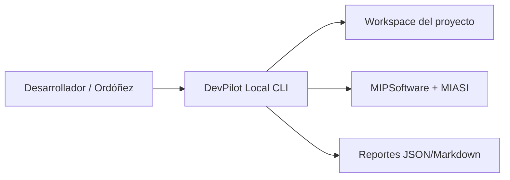
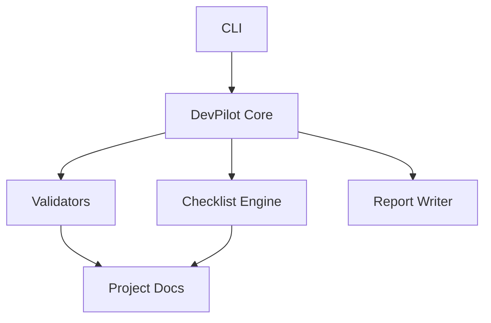

# Architecture Document

## Drivers arquitectónicos

- Local-first.
- Sin API keys en MVP.
- Dry-run por defecto.
- Validación documental antes que automatización autónoma.
- Preparado para agentes, pero controlado por MIASI.

## Vista C4 — Contexto

## Vista C4 — Contenedores

## Componentes iniciales

| Componente | Responsabilidad |
|---|---|
| CLI | Interfaz local de ejecución. |
| Artifact Validator | Validar existencia y contenido mínimo. |
| MIASI Detector | Determinar activación MIASI. |
| Readiness Evaluator | Emitir PASS/FAIL. |
| Report Writer | Guardar evidencia. |
