# C4 Component — DevPilot Core after Sprint 20

## 1. Propósito

Este documento implementa `FUNC-20-006`: una vista **C4 Nivel 3 — Componentes** del core real de DevPilot después del cierre `FUNC-SPRINT-19`. Su propósito es representar el estado actual sin sobredeclarar UI, agentes LLM-driven, APIs externas, sandbox, approval workflow ni ejecución destructiva.

## 2. Estado

| Campo | Valor |
|---|---|
| Vista C4 | Component |
| Sprint que crea la vista | `FUNC-SPRINT-20` |
| Baseline representada | `FUNC-SPRINT-00..FUNC-SPRINT-19` |
| Cambios de implementación | Ninguno |
| Tipo de vista | Documental, reconciliada y verificable |

## 3. Leyenda de estados

| Estado | Uso en esta vista |
|---|---|
| `implemented` | Componente funcional y probado para su alcance actual. |
| `implemented-initial` | Primera versión funcional, útil pero limitada. |
| `partial` | Base técnica existente con brechas claras. |
| `planned` | Diseñado en backlog, aún sin implementación. |
| `disabled` | Declarado pero bloqueado por política o seguridad. |
| `future` | Visión posterior, no disponible. |

## 4. Diagrama mermaid

```mermaid
flowchart TD
  CLI[CLI<br/>implemented] --> AppSvc[ApplicationService<br/>implemented-initial]
  CLI --> Validators[Validators<br/>implemented]
  CLI --> Standards[Standards Registry<br/>implemented]
  CLI --> Policy[Policy Engine + Guards<br/>implemented]
  CLI --> Reports[Report Engine<br/>implemented]
  CLI --> Obs[EventLogger JSONL<br/>implemented-initial]
  CLI --> Store[LocalStore SQLite v0<br/>implemented-initial]
  CLI --> MIASI[MIASI Registry Validator<br/>implemented]
  CLI --> Agents[AgentRuntime documental<br/>implemented-initial]
  CLI --> Evals[Eval Harness offline<br/>implemented-initial]
  CLI --> Repo[GitAdapter + RepoInventory<br/>implemented-initial]
  CLI --> Review[Patch/Code Review dry-run<br/>implemented-initial]
  CLI --> Refactor[Safe Refactor Planner<br/>implemented-initial]
  CLI --> Model[ModelAdapter Router<br/>partial]

  AppSvc --> DTOs[DTOs ApplicationRequest/Response<br/>implemented-initial]
  Validators --> Frontmatter[Frontmatter Validator<br/>implemented]
  Validators --> Artifact[Artifact Validator<br/>implemented]
  Validators --> Checklist[Checklist Validator<br/>implemented]
  Validators --> Readiness[Readiness Gate<br/>implemented]

  Policy --> PathGuard[PathGuard<br/>implemented]
  Policy --> SecretGuard[SecretGuard<br/>implemented]
  Policy --> CostGuard[CostGuard<br/>implemented]

  MIASI --> AgentRegistry[Agent Registry<br/>implemented]
  MIASI --> ToolRegistry[Tool Registry<br/>implemented]
  MIASI --> PolicyMatrix[Policy Matrix<br/>implemented]

  Model --> Mock[MockModelAdapter<br/>implemented]
  Model -.-> LocalProviders[Ollama/LM Studio clients<br/>planned]
  Model -.-> ExternalProviders[External APIs<br/>disabled]

  AppSvc -.-> Desktop[Desktop UI<br/>future]
  AppSvc -.-> Web[Web UI/API<br/>future]
  Review -.-> PatchApply[Patch apply sandbox<br/>planned]
  Refactor -.-> RefactorExec[Refactor execution<br/>planned]
  Store -.-> ApprovalWorkflow[Approval workflow<br/>planned]
```



## 5. Componentes y responsabilidades

| Componente | Ruta principal | Estado | Responsabilidad | Límite explícito |
|---|---|---|---|---|
| CLI | `src/devpilot_core/cli.py` | `implemented` | Orquestar comandos, JSON, reportes, eventos y store best-effort. | Debe reducirse gradualmente como orquestador grueso. |
| `cli_models` | `src/devpilot_core/cli_models.py` | `implemented` | Contrato transversal `CommandResult`/`Finding`. | Falta schema formal. |
| Validators | `src/devpilot_core/validators/` | `implemented` | Frontmatter, artifact, checklist y readiness. | Estructural/determinístico, no semántico. |
| Standards | `src/devpilot_core/standards/` | `implemented` | Registry MIPSoftware/MIASI. | No descarga catálogos externos. |
| Reports | `src/devpilot_core/reports/` | `implemented` | Evidencia JSON/Markdown. | Falta report index/viewer. |
| Observability | `src/devpilot_core/observability/` | `implemented-initial` | Eventos JSONL. | Falta trace report/spans/Otel. |
| Workspace | `src/devpilot_core/workspace/` | `implemented-initial` | `.devpilot/project.yaml` y rutas. | Falta migrate/repair/profiles. |
| Policy | `src/devpilot_core/policy/` | `implemented` | PathGuard, SecretGuard, CostGuard y decisiones. | No sustituye sandbox. |
| Store | `src/devpilot_core/store/` | `implemented-initial` | SQLite local para runs/findings/gates/events. | Approval/cost workflows incompletos. |
| MIASI | `src/devpilot_core/miasi/` | `implemented` | Validar registries agentic. | Muchos agentes están planned/future. |
| Agents | `src/devpilot_core/agents/` | `implemented-initial` | Ejecutar agentes documentales MVP. | No hay LLM-driven ni handoffs. |
| Evals | `src/devpilot_core/evals/` | `implemented-initial` | Evals offline determinísticas. | No juez LLM, no red teaming. |
| Repo | `src/devpilot_core/repo/` | `implemented-initial` | Git status read-only e inventory. | Falta git log/tags/branches/diff report dedicado. |
| Review | `src/devpilot_core/review/` | `implemented-initial` | Patch/code review dry-run. | No aplica cambios. |
| Refactor | `src/devpilot_core/refactor/` | `implemented-initial` | Planificación de refactor. | No ejecuta refactor. |
| Modeling | `src/devpilot_core/modeling/` | `partial` | Router y mock model adapter. | Clientes reales locales/API pendientes o disabled. |
| Application | `src/devpilot_core/application/` | `implemented-initial` | DTOs y frontera para UI futura. | No hay desktop/web/API/IPC. |

## 6. Funcionamiento de la vista

La vista no ejecuta lógica. Su función es representar componentes reales y sus límites. La implementación sigue usando CLI como canal principal, mientras `ApplicationService` prepara la frontera para futuras interfaces.

## 7. Integración y rol dentro de DevPilot

Este C4 Component complementa:

- `docs/02_architecture/c4_context.md`;
- `docs/02_architecture/c4_container.md`;
- `docs/07_interfaces/internal_application_contract.md`;
- `docs/audits/capability_status_matrix_after_sprint_18.md`.

Su rol es evitar que las futuras fases introduzcan UI/API/agentes sobre una visión ambigua del core.

## 8. Comandos de uso y verificación

```powershell
$env:PYTHONPATH="src"
python -m devpilot_core validate-frontmatter docs/02_architecture/c4_component.md --strict --json
python -m devpilot_core validate-artifact docs/02_architecture/c4_component.md --strict --json
python -m devpilot_core app contract --json
python -m pytest -q
```

## 9. Criterios PASS

- La vista distingue estados reales de aspiracionales.
- Desktop/Web aparecen como `future`, no como implementados.
- ModelAdapter aparece como `partial` con mock implementado y externos disabled.
- Patch apply/refactor execution/approval workflow aparecen como `planned`.

## 10. Criterios BLOCK

- Documentar servidor HTTP, UI, IPC, auth o RBAC como implementados.
- Documentar agentes LLM-driven o multiagente como implementados.
- Documentar ejecución destructiva como disponible.

## 11. Riesgos

Esta vista es manual y preliminar. En una versión industrial debería generarse o validarse contra un futuro Component Registry o Command Catalog para reducir drift.

## 12. Evolución recomendada

- Sprint 21–24: enlazar componentes con schemas y contratos versionados.
- Sprint 25–27: enlazar componentes con Traceability Engine.
- Fase F: convertir esta vista en insumo para UI/API real, previa ADR tecnológica.

## 13. Pruebas implementadas

`tests/test_sprint_20_documentation_reconciliation.py` valida existencia, frontmatter mínimo y presencia de estados `implemented`, `partial`, `planned`, `disabled` y `future` en las vistas C4 reconciliadas.
