# C4 Container — DevPilot Local

## 1. Propósito

Este documento representa la vista **C4 Nivel 2 — Contenedores** de DevPilot Local. Define los bloques ejecutables o desplegables principales, sus responsabilidades, tecnología prevista y comunicación.

El diagrama de contenedores debe mostrar suficientes decisiones tecnológicas para orientar implementación, sin bloquear decisiones posteriores que requieran ADR específico.

## 2. Diagrama C4 Container

```mermaid
flowchart TD
  User[Owner/Developer] --> CLI[Container: DevPilot CLI
Python]
  Desktop[Container futuro: Desktop UI] -.-> Core
  Web[Container futuro: Web UI] -.-> Core

  CLI --> Core[Container: DevPilot Core]
  Core --> Workspace[Workspace Manager]
  Core --> Standards[Standards Registry]
  Core --> Validation[Validation Engine]
  Core --> AgentRuntime[Industrial Agent Runtime]
  Core --> Policy[Policy Engine]
  Core --> Reports[Report Engine]
  Core --> Persistence[Persistence Layer]
  Core --> Adapters[Adapters]
  Core --> Observability[Observability Layer]

  Validation --> Frontmatter[Frontmatter Validator]
  Validation --> Artifacts[Artifact Validator]
  Validation --> Checklist[Checklist Engine]
  Validation --> Traceability[Traceability Validator]
  Validation --> Schemas[Schema Validator]

  AgentRuntime --> AgentOrchestrator[Agent Orchestrator]
  AgentRuntime --> ModelAdapter[ModelAdapter]
  AgentRuntime --> ToolRegistry[Tool Registry]
  AgentRuntime --> EvalHarness[Eval Harness]
  AgentRuntime --> MemoryRAG[Memory/RAG futura]
  AgentRuntime --> DocAgent[PreCodeDocumentationAgent]
  AgentRuntime --> AuditAgent[DocumentationAuditAgent]
  AgentRuntime -. MVP+ .-> CodeAgents[Requirements / Architecture / Security / CodeReview / Refactor Agents]

  Policy --> FSGuard[Filesystem Guard]
  Policy --> GitPolicy[Git Policy]
  Policy --> SecretGuard[Secret Guard]
  Policy --> CostGuard[Cost Guard]
  Policy --> Approval[Human Approval Queue]

  Adapters -. MVP+ .-> GitAdapter[Git Adapter]
  Adapters -. MVP+ .-> RepoAnalyzer[Repo Analyzer]
  Adapters -. MVP+ .-> EnvAdapter[Environment Adapter]
  Adapters -. MVP+ .-> PatchEngine[Patch Review Engine]
  Adapters -. Post-MVP .-> MCPAdapter[MCP/API Adapter]

  ModelAdapter --> MockModel[Mock/Rule Model]
  ModelAdapter -. MVP+ .-> LocalLLM[Local LLM Provider]
  ModelAdapter -. Opcional .-> ExternalLLM[External LLM API Provider]

  Persistence --> Docs[(docs/)]
  Persistence --> ReportsFS[(outputs/reports)]
  Persistence --> TracesFS[(outputs/traces JSONL)]
  Persistence --> DevpilotMeta[(.devpilot/)]
  Persistence --> SQLite[(SQLite state DB)]
```



## 3. Contenedores y responsabilidades

| Contenedor | Etapa | Tecnología prevista | Responsabilidad |
|---|---|---|---|
| DevPilot CLI | MVP | Python, stdlib CLI inicial | Ejecutar comandos locales y mostrar resultados. |
| DevPilot Core | MVP | Python | Coordinar casos de uso y reglas de negocio. |
| Workspace Manager | MVP/MVP+ | Python + filesystem + YAML/JSON | Detectar, registrar y persistir workspaces. |
| Standards Registry | MVP | JSON/YAML/Python | Registrar artefactos MIPSoftware/MIASI, campos y reglas. |
| Validation Engine | MVP | Python | Validar frontmatter, estructura, schemas, checklists y trazabilidad. |
| Industrial Agent Runtime | MVP/MVP+ | Python + ModelAdapter + policies | Ejecutar agentes bajo MIASI, evals, guardrails y trazas. |
| ModelAdapter | MVP/MVP+ | Interfaz Python | Abstraer mock, reglas, modelos locales y APIs externas. |
| Tool Registry | MVP/MVP+ | Python + Tool Cards | Registrar tools, permisos, inputs, outputs y side effects. |
| Eval Harness | MVP/MVP+ | Python + datasets locales | Evaluar agentes y tools offline antes de uso sensible. |
| Memory/RAG Layer | MVP+/Post-MVP | SQLite/vector store local futuro | Recuperar contexto de docs/repos y memoria de workspace. |
| Policy Engine | MVP/MVP+ | Python | Aplicar dry-run, rutas, permisos, costos, secretos y aprobaciones. |
| Report Engine | MVP | Python | Emitir JSON, Markdown y luego JSONL. |
| Persistence Layer | MVP/MVP+ | Filesystem + SQLite + JSONL | Persistir docs, reports, runs, gates, approvals, traces y costos. |
| Git Adapter | MVP+ | Git CLI / subprocess controlado | Consultar Git inicialmente read-only. |
| Repo Analyzer | MVP+ | Python | Analizar estructura, docs, tests, módulos, dependencias y riesgos. |
| Patch Review Engine | MVP+ | Python | Evaluar patches sin aplicar. |
| Environment Adapter | MVP+ | Python | Validar Python, venv, dependencias y comandos reproducibles. |
| Desktop UI | Post-MVP | Por ADR | Experiencia visual local sobre core. |
| Web UI | Post-MVP | Por ADR | Dashboard y colaboración futura. |

## 4. Reglas de comunicación

| Origen | Destino | Regla |
|---|---|---|
| CLI | Core | CLI no contiene lógica de negocio pesada. |
| Desktop/Web | Core | UI futura consume el mismo core. |
| Core | Validators | Validaciones determinísticas producen PASS/FAIL/WARN/BLOCK. |
| Core | Agents | Agentes producen borradores, hallazgos o planes; no aprueban por sí mismos. |
| Agents | ModelAdapter | Todo uso de modelo pasa por proveedor configurado y trazable. |
| Agents | Tool Registry | Ninguna tool se invoca si no está registrada y autorizada. |
| Agents | Policy Engine | Toda acción sensible pasa por policy gate. |
| Policy Engine | CostGuard | Toda llamada externa potencialmente costosa debe presupuestarse. |
| Persistence | SQLite/JSONL | Estado operativo y trazas se guardan localmente. |
| Adapters | Filesystem/Git | Read-only por defecto; escritura requiere aprobación. |

## 5. Persistencia local prevista

| Ruta / medio | Etapa | Propósito | Versionable |
|---|---|---|---|
| `docs/` | MVP | Documentos MIPSoftware/MIASI del proyecto. | Sí |
| `outputs/reports/` | MVP | Reportes generados. | Según política |
| `outputs/traces/` | MVP+ | Eventos JSONL. | Normalmente no |
| `.devpilot/project.yaml` | MVP+ | Descriptor del workspace. | Sí, si no contiene secretos |
| `.devpilot/policies/` | MVP+ | Políticas locales. | Sí |
| `.devpilot/approvals/` | MVP+ | Solicitudes/respuestas de aprobación. | Evaluar caso |
| `.devpilot/devpilot_state.db` | MVP+ | SQLite local para estado operativo. | No por defecto |
| `.devpilot/costs/` | MVP+ | Presupuestos y reportes de costo. | Según política |

## 6. Esquema lógico inicial de persistencia

| Entidad | Campos mínimos |
|---|---|
| Workspace | id, name, root_path, standard, miasi_enabled, created_at, updated_at. |
| Artifact | id, workspace_id, path, type, doc_id, status, version, checksum. |
| ValidationRun | id, workspace_id, command, started_at, finished_at, result. |
| GateResult | id, run_id, gate, status, severity, evidence_path. |
| Finding | id, run_id, source, severity, message, recommendation, artifact_path. |
| AgentSession | id, workspace_id, agent_name, model_provider, mode, result. |
| ToolInvocation | id, session_id, tool_name, dry_run, side_effect, result. |
| Approval | id, request_type, status, requested_by, decided_by, decision_at. |
| CostEvent | id, provider, model, estimated_cost, actual_cost, budget_id. |
| GitSnapshot | id, workspace_id, branch, commit, dirty, created_at. |

## 7. Tecnología de agentes prevista

| Elemento | MVP | MVP+ / Post-MVP |
|---|---|---|
| Agent Runtime | Implementación local controlada | Evaluar OpenAI Agents SDK, LangGraph o runtime propio por ADR. |
| ModelAdapter | Mock/rule-based | Ollama, LM Studio, OpenAI/Gemini/Mistral/HF opcionales. |
| Tool Calling | Tools internas controladas | Tool Registry + MCP/API adapter opcional. |
| Memoria | Estado local simple | SQLite + memoria semántica local. |
| RAG | No obligatorio | RAG local sobre docs/repos. |
| Evaluación | Tests offline básicos | Eval Harness MIASI y suites agentic. |
| Observabilidad | Reportes JSON/Markdown | JSONL + OpenTelemetry GenAI compatible. |
| Human approval | Manual/documental | Approval Queue integrada. |

## 8. Decisiones pendientes por ADR futuro

| Tema | ADR futuro |
|---|---|
| Framework específico de agentes | ADR de selección entre runtime propio, OpenAI Agents SDK, LangGraph u otros. |
| Desktop stack | ADR de selección entre Tauri, Electron, Qt, .NET MAUI u otro. |
| Web stack | ADR de backend/UI y auth. |
| Vector store local | ADR sobre FAISS/Chroma/SQLite-vector u opción simple. |
| MCP adapter | ADR específico de integración y hardening. |

## 9. Estado

```yaml
c4_container_status: reviewed
ready_for_owner_approval: true
approval_recommendation: "approve_after_owner_review"
```
