# C4 Container — DevPilot Local

## 1. Propósito

Este documento representa la vista **C4 Nivel 2 — Contenedores** de DevPilot Local. Define los bloques ejecutables o desplegables principales, sus responsabilidades, tecnología prevista y comunicación.

El diagrama de contenedores debe mostrar suficientes decisiones tecnológicas para orientar implementación, sin bloquear decisiones posteriores que requieran ADR específico.

## 2. Diagrama C4 Container

```mermaid
flowchart TD
  User[Owner/Developer] --> CLI[Container: DevPilot CLI
Python]
  WebLocal[Container futuro Fase F: Web UI local] -.-> APILocal[Container futuro Fase F: API local segura]
  WebReal[Container futuro posterior: Web UI real] -. futuro .-> APILocal
  Desktop[Container opcional diferido: Desktop shell] -. ADR posterior .-> APILocal

  CLI --> Core[Container: DevPilot Core]
  APILocal -.-> AppService[Container: ApplicationService]
  AppService -.-> Core
  Core --> Workspace[Workspace Manager]
  Core --> Standards[Standards Registry]
  Core --> Validation[Validation Engine]
  Core --> AgentRuntime[Industrial Agent Runtime]
  Core --> Policy[Policy Engine]
  Core --> Reports[Report Engine]
  Core --> Persistence[Persistence Layer]
  Core --> Adapters[Adapters]
  Core --> Observability[Observability Layer]

  Validation --> Frontmatter[Frontmatter Validator]
  Validation --> Artifacts[Artifact Validator]
  Validation --> Checklist[Checklist Engine]
  Validation --> Traceability[Traceability Validator]
  Validation --> Schemas[Schema Validator]

  AgentRuntime --> AgentOrchestrator[Agent Orchestrator]
  AgentRuntime --> ModelAdapter[ModelAdapter]
  AgentRuntime --> ToolRegistry[Tool Registry]
  AgentRuntime --> EvalHarness[Eval Harness]
  AgentRuntime --> MemoryRAG[Memory/RAG futura]
  AgentRuntime --> DocAgent[PreCodeDocumentationAgent]
  AgentRuntime --> AuditAgent[DocumentationAuditAgent]
  AgentRuntime -. MVP+ .-> CodeAgents[Requirements / Architecture / Security / CodeReview / Refactor Agents]

  Policy --> FSGuard[Filesystem Guard]
  Policy --> GitPolicy[Git Policy]
  Policy --> SecretGuard[Secret Guard]
  Policy --> CostGuard[Cost Guard]
  Policy --> Approval[Human Approval Queue]

  Adapters -. MVP+ .-> GitAdapter[Git Adapter]
  Adapters -. MVP+ .-> RepoAnalyzer[Repo Analyzer]
  Adapters -. MVP+ .-> EnvAdapter[Environment Adapter]
  Adapters -. MVP+ .-> PatchEngine[Patch Review Engine]
  Adapters -. Post-MVP .-> MCPAdapter[MCP/API Adapter]

  ModelAdapter --> MockModel[Mock/Rule Model]
  ModelAdapter -. MVP+ .-> LocalLLM[Local LLM Provider]
  ModelAdapter -. Opcional .-> ExternalLLM[External LLM API Provider]

  Persistence --> Docs[(docs/)]
  Persistence --> ReportsFS[(outputs/reports)]
  Persistence --> TracesFS[(outputs/traces JSONL)]
  Persistence --> DevpilotMeta[(.devpilot/)]
  Persistence --> SQLite[(SQLite state DB)]
```



## 3. Contenedores y responsabilidades

| Contenedor | Etapa | Tecnología prevista | Responsabilidad |
|---|---|---|---|
| DevPilot CLI | MVP | Python, stdlib CLI inicial | Ejecutar comandos locales y mostrar resultados. |
| DevPilot Core | MVP | Python | Coordinar casos de uso y reglas de negocio. |
| Workspace Manager | MVP/MVP+ | Python + filesystem + YAML/JSON | Detectar, registrar y persistir workspaces. |
| Standards Registry | MVP | JSON/YAML/Python | Registrar artefactos MIPSoftware/MIASI, campos y reglas. |
| Validation Engine | MVP | Python | Validar frontmatter, estructura, schemas, checklists y trazabilidad. |
| Industrial Agent Runtime | MVP/MVP+ | Python + ModelAdapter + policies | Ejecutar agentes bajo MIASI, evals, guardrails y trazas. |
| ModelAdapter | MVP/MVP+ | Interfaz Python | Abstraer mock, reglas, modelos locales y APIs externas. |
| Tool Registry | MVP/MVP+ | Python + Tool Cards | Registrar tools, permisos, inputs, outputs y side effects. |
| Eval Harness | MVP/MVP+ | Python + datasets locales | Evaluar agentes y tools offline antes de uso sensible. |
| Memory/RAG Layer | MVP+/Post-MVP | SQLite/vector store local futuro | Recuperar contexto de docs/repos y memoria de workspace. |
| Policy Engine | MVP/MVP+ | Python | Aplicar dry-run, rutas, permisos, costos, secretos y aprobaciones. |
| Report Engine | MVP | Python | Emitir JSON, Markdown y luego JSONL. |
| Persistence Layer | MVP/MVP+ | Filesystem + SQLite + JSONL | Persistir docs, reports, runs, gates, approvals, traces y costos. |
| Git Adapter | MVP+ | Git CLI / subprocess controlado | Consultar Git inicialmente read-only. |
| Repo Analyzer | MVP+ | Python | Analizar estructura, docs, tests, módulos, dependencias y riesgos. |
| Patch Review Engine | MVP+ | Python | Evaluar patches sin aplicar. |
| Environment Adapter | MVP+ | Python | Validar Python, venv, dependencias y comandos reproducibles. |
| API local segura | Fase F | FastAPI planned by ADR-0013/Sprint 64 | Frontera localhost/token hacia ApplicationService. |
| Web UI local | Fase F | FastAPI boundary + Web UI stack by ADR-0013 | Dashboard, reportes, trazas, approvals y settings locales. |
| Web UI real | Posterior a Fase F | Evolución web futura | Reutiliza contratos API y componentes web cuando seguridad/operación maduren. |
| Desktop shell | Futuro condicionado | ADR posterior | Opcional; no se implementa en Fase F. |

## 4. Reglas de comunicación

| Origen | Destino | Regla |
|---|---|---|
| CLI | Core | CLI no contiene lógica de negocio pesada. |
| Web UI local/API | ApplicationService/Core | UI futura consume API local y servicios de aplicación, no core directo. |
| Desktop opcional | API local | Solo si ADR posterior lo aprueba; nunca duplica lógica. |
| Core | Validators | Validaciones determinísticas producen PASS/FAIL/WARN/BLOCK. |
| Core | Agents | Agentes producen borradores, hallazgos o planes; no aprueban por sí mismos. |
| Agents | ModelAdapter | Todo uso de modelo pasa por proveedor configurado y trazable. |
| Agents | Tool Registry | Ninguna tool se invoca si no está registrada y autorizada. |
| Agents | Policy Engine | Toda acción sensible pasa por policy gate. |
| Policy Engine | CostGuard | Toda llamada externa potencialmente costosa debe presupuestarse. |
| Persistence | SQLite/JSONL | Estado operativo y trazas se guardan localmente. |
| Adapters | Filesystem/Git | Read-only por defecto; escritura requiere aprobación. |

## 5. Persistencia local prevista

| Ruta / medio | Etapa | Propósito | Versionable |
|---|---|---|---|
| `docs/` | MVP | Documentos MIPSoftware/MIASI del proyecto. | Sí |
| `outputs/reports/` | MVP | Reportes generados. | Según política |
| `outputs/traces/` | MVP+ | Eventos JSONL. | Normalmente no |
| `.devpilot/project.yaml` | MVP+ | Descriptor del workspace. | Sí, si no contiene secretos |
| `.devpilot/policies/` | MVP+ | Políticas locales. | Sí |
| `.devpilot/approvals/` | MVP+ | Solicitudes/respuestas de aprobación. | Evaluar caso |
| `.devpilot/devpilot_state.db` | MVP+ | SQLite local para estado operativo. | No por defecto |
| `.devpilot/costs/` | MVP+ | Presupuestos y reportes de costo. | Según política |

## 6. Esquema lógico inicial de persistencia

| Entidad | Campos mínimos |
|---|---|
| Workspace | id, name, root_path, standard, miasi_enabled, created_at, updated_at. |
| Artifact | id, workspace_id, path, type, doc_id, status, version, checksum. |
| ValidationRun | id, workspace_id, command, started_at, finished_at, result. |
| GateResult | id, run_id, gate, status, severity, evidence_path. |
| Finding | id, run_id, source, severity, message, recommendation, artifact_path. |
| AgentSession | id, workspace_id, agent_name, model_provider, mode, result. |
| ToolInvocation | id, session_id, tool_name, dry_run, side_effect, result. |
| Approval | id, request_type, status, requested_by, decided_by, decision_at. |
| CostEvent | id, provider, model, estimated_cost, actual_cost, budget_id. |
| GitSnapshot | id, workspace_id, branch, commit, dirty, created_at. |

## 7. Tecnología de agentes prevista

| Elemento | MVP | MVP+ / Post-MVP |
|---|---|---|
| Agent Runtime | Implementación local controlada | Evaluar OpenAI Agents SDK, LangGraph o runtime propio por ADR. |
| ModelAdapter | Mock/rule-based | Ollama, LM Studio, OpenAI/Gemini/Mistral/HF opcionales. |
| Tool Calling | Tools internas controladas | Tool Registry + MCP/API adapter opcional. |
| Memoria | Estado local simple | SQLite + memoria semántica local. |
| RAG | No obligatorio | RAG local sobre docs/repos. |
| Evaluación | Tests offline básicos | Eval Harness MIASI y suites agentic. |
| Observabilidad | Reportes JSON/Markdown | JSONL + OpenTelemetry GenAI compatible. |
| Human approval | Manual/documental | Approval Queue integrada. |

## 8. Decisiones pendientes por ADR futuro

| Tema | ADR futuro |
|---|---|
| Framework específico de agentes | ADR de selección entre runtime propio, OpenAI Agents SDK, LangGraph u otros. |
| Web/API stack | ADR-0013 y Sprint 64 deben formalizar API local segura, Web UI local y ruta a Web UI real. |
| Desktop stack | Diferido; ADR posterior solo si se justifica tras validar Web UI. |
| Vector store local | ADR sobre FAISS/Chroma/SQLite-vector u opción simple. |
| MCP adapter | ADR específico de integración y hardening. |

## 9. Estado

```yaml
c4_container_status: reviewed
ready_for_owner_approval: true
approval_recommendation: "approve_after_owner_review"
```


---

## 9. Reconciliación post-18 de contenedores

### 9.1 Propósito

Esta sección fue agregada por `FUNC-SPRINT-20` para distinguir contenedores reales, parciales y futuros. La vista Container conserva la intención de arquitectura, pero la operación actual se limita al core local-first y CLI.

### 9.2 Tabla de estados

| Contenedor | Estado reconciliado | Evidencia | Límite explícito |
|---|---|---|---|
| DevPilot CLI | `implemented` | `python -m devpilot_core --version`, comandos JSON | No hay binario empaquetado final. |
| DevPilot Core | `implemented` | Validadores, policy, reports, MIASI, evals, repo/review/refactor/modeling | Sigue siendo core local, no plataforma UI completa. |
| ApplicationService | `implemented-initial` | `python -m devpilot_core app contract --json` | Contract-only para UI futura. |
| Filesystem/docs | `implemented` | `docs/`, `.devpilot/`, `evals/fixtures/` | Outputs son runtime, no fuente de release. |
| SQLite LocalStore | `implemented-initial` | `state init/status/history list` | Approval/cost workflows incompletos. |
| Git local | `implemented-initial` | `git-status --json` | Sin commit/tag/push/branches/tags/log dedicados. |
| Model provider layer | `partial` | MockModelAdapter | Ollama/LM Studio/API reales no implementados. |
| External LLM APIs | `disabled` | CostGuard y ProviderRegistry | Bloqueadas por defecto. |
| API local segura | `planned-fase-f` | Sin servidor HTTP activo | Requiere ADR-0013/Sprint 64, token, localhost, CORS y threat model. |
| Web UI local | `planned-fase-f` | Sin frontend activo | Interfaz visual canónica de Fase F; consume API local. |
| Web UI real | `future-post-fase-f` | Sin despliegue web | Evolución posterior si contratos, auth y operación maduran. |
| Desktop shell | `deferred` | Sin shell | Fuera de Fase F; requiere ADR posterior. |
| MCP/API tools | `future` | Sin módulo | Requiere Tool Registry + policies + evals. |
| Approval workflow | `planned` | Policy Matrix + SQLite preparatorio | Falta request/list/approve/deny operativo. |

### 9.3 Funcionamiento e integración

La tabla se integra con `docs/02_architecture/c4_component.md` y evita que el diagrama histórico de contenedores se interprete como implementación final.

### 9.4 Criterios PASS/BLOCK

PASS: los contenedores futuros se leen como `future`, `planned-fase-f`, `deferred` o `contract-only`. BLOCK: usar esta vista para afirmar que existe API/Web UI productiva, Desktop implementado o proveedores LLM reales.

### 9.5 Riesgos

La vista sigue siendo documental y debe sincronizarse cuando Sprint 21–27 introduzcan Schema Registry, ValidationGateway y Traceability Engine.


## 10. Actualización FUNC-SPRINT-64 — Estrategia UI/API Web first

### 10.1 Propósito

Sincronizar la vista C4 con la decisión `ADR-0013 — Estrategia UI/API Web first`.

### 10.2 Decisión reflejada

- `API local segura`: contenedor `planned-fase-f`, objetivo FastAPI, sin servidor activo en Sprint 64.
- `Web UI local`: contenedor `planned-fase-f`, interfaz visual canónica de Fase F.
- `Web UI real`: contenedor `future-post-fase-f`, evolución posterior cuando existan auth/RBAC/deploy.
- `Desktop shell`: contenedor `deferred`, fuera de Fase F y sujeto a ADR posterior.

### 10.3 Criterio operativo

PASS: cualquier implementación futura de UI/API debe seguir `UI → API local → ApplicationService → Core`. BLOCK: UI que lea filesystem directamente, API que salte ApplicationService o Desktop implementado en Fase F.


## Sprint 65 — ApplicationService v2 como contenedor lógico de frontera

Estado: `implemented-initial`.

Aunque `ApplicationService` no es un contenedor desplegable, en Fase F actúa como frontera lógica obligatoria entre CLI/API/Web UI y el core. Sprint 65 agrega servicios por dominio para evitar que el futuro contenedor `API local segura` importe directamente validadores, MIASI, repo analyzers, ReviewEngine, RefactorPlanner, ModelAdapterRouter, LocalStore o AgentOps.

Vista lógica actualizada:

```text
[CLI]                 ┐
[API local futura]    ├─> [ApplicationService v2 / Domain Services] ─> [DevPilot Core]
[Web UI local futura] ┘
```

Dominio de responsabilidad:

- ApplicationService v2: orquestación de casos de uso reutilizables.
- Domain Services: fachada estable por área.
- DevPilot Core: reglas de negocio, políticas, validadores, stores y motores especializados.

No implementado todavía: servidor API, OpenAPI, frontend, autenticación, CORS, token local o Desktop shell.


## Actualización FUNC-SPRINT-66 — Contrato API v1 preliminar

Sprint 66 agrega la vista contractual de API local antes de implementar el contenedor de servidor. El contenedor `API local segura` sigue en estado `planned-fase-f`, pero ahora dispone de contrato estático en `docs/07_interfaces/openapi_v1.json` y mapping endpoint→`ApplicationService` en `docs/07_interfaces/api_service_mapping.md`.

La relación C4 queda:

```text
Web UI local futura → API local /api/v1 futura → ApplicationService v2 → DevPilot Core
```

Restricción: ningún contenedor visual o HTTP futuro debe saltarse `ApplicationService v2`; el contrato OpenAPI solo autoriza rutas read-only/dry-run/plan-only hasta implementar seguridad local en Sprint 68.

## Sprint 67 — Contenedor API local MVP

`FUNC-SPRINT-67` cambia el estado del contenedor `API local segura` de contrato planificado a `implemented-initial` para un MVP local read-only/dry-run.

Responsabilidades actuales:

- exponer `/api/v1` sobre FastAPI;
- escuchar por defecto en `127.0.0.1:8787`;
- delegar en `ApplicationService v2`;
- devolver `ApplicationResponse`;
- bloquear por ausencia de ruta cualquier operación crítica no modelada;
- mantener Web UI y Desktop fuera del alcance.

Responsabilidades diferidas:

- token local;
- CORS restringido;
- headers de seguridad;
- policy binding HTTP;
- auth/RBAC;
- despliegue web real.

El contenedor `Web UI local` continúa `planned-fase-f` para Sprint 69 y no debe importar el core Python directamente.
