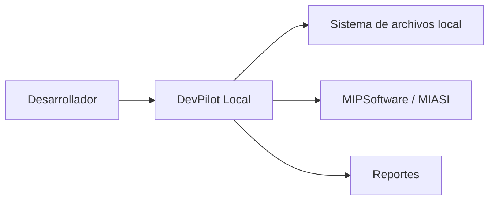

# C4 Context

```mermaid
flowchart LR
  Dev[Desarrollador] --> DevPilot[DevPilot Local]
  DevPilot --> FS[Sistema de archivos local]
  DevPilot --> Standards[MIPSoftware / MIASI]
  DevPilot --> Reports[Reportes]
```
