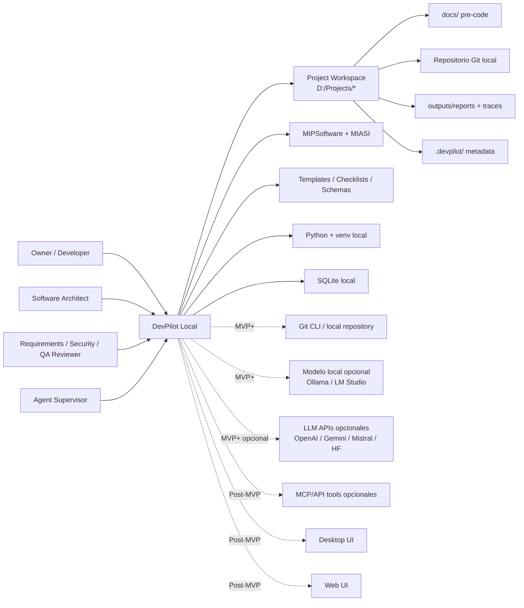

# C4 Context — DevPilot Local

## 1. Propósito

Este documento representa la vista **C4 Nivel 1 — Contexto** de DevPilot Local. Su objetivo es mostrar el sistema dentro de su entorno operativo: owner/developer, proyectos gestionados, estándares MIPSoftware/MIASI, repositorios, Git, modelos/agentes, persistencia local y futuras interfaces desktop/web.

El C4 Context no describe todos los componentes internos; muestra límites, actores, sistemas externos opcionales y dependencias principales.

## 2. Sistema bajo diseño

| Elemento | Descripción |
|---|---|
| Sistema | DevPilot Local |
| Tipo | Plataforma local-first híbrida agent-assisted SDLC personal |
| Usuario primario | Owner/Developer |
| Estándar general | MIPSoftware |
| Extensión inteligente | MIASI |
| Unidad operativa | Workspace |
| Interfaz inicial | CLI |
| Interfaces comprometidas | Desktop y Web |
| Modelos IA | Mock/local/API externa opcional bajo ModelAdapter y CostGuard |
| Persistencia | Markdown, JSON/YAML, SQLite, JSONL y vector store futuro |

## 3. Diagrama C4 Context

## 4. Límites del sistema

| Dentro de DevPilot | Fuera de DevPilot |
|---|---|
| Validar documentos, checklists, frontmatter, schemas y trazabilidad. | Reemplazar IDEs o herramientas profesionales completas. |
| Crear y auditar documentación pre-code con agentes controlados. | Aprobar automáticamente decisiones generadas por IA. |
| Generar reportes, hallazgos, recomendaciones y evidencias. | Hacer commits/despliegues automáticos sin aprobación. |
| Consultar Git inicialmente en modo read-only. | Administrar repos remotos como SaaS inicial. |
| Ejecutar modelos mock/local/API opcional bajo ModelAdapter. | Obligar a depender de un proveedor LLM único. |
| Persistir estado local, runs, gates, approvals, traces y costos. | Almacenar secretos en claro. |
| Preparar desktop/web futuros sobre core común. | Iniciar como plataforma cloud obligatoria. |

## 5. Actores y expectativas

| Actor | Expectativa |
|---|---|
| Owner/Developer | Gestionar proyectos propios con disciplina profesional, agentes asistidos y control local. |
| Software Architect | Obtener arquitectura, ADRs, riesgos y trazabilidad desde producto/requisitos. |
| Requirements Reviewer | Verificar requisitos, historias, casos de uso y criterios de aceptación. |
| Security Reviewer | Revisar threat model, políticas, secretos, agentes y herramientas. |
| Agent Supervisor | Aprobar o rechazar acciones agentic sensibles. |
| Future Operator | Consultar runbooks, reportes, trazas e incidentes. |

## 6. Sistemas externos opcionales

| Sistema externo | Etapa | Uso | Control obligatorio |
|---|---|---|---|
| Git local | MVP+ | Estado, diff, branch, commit, historial. | Read-only inicial. |
| Modelos locales | MVP+ | Agentes sin costo externo obligatorio. | ModelAdapter + evals. |
| LLM APIs externas | MVP+/Post-MVP | Mejorar calidad cuando se justifique. | API keys opcionales, CostGuard, SecretGuard. |
| MCP/API tools | Post-MVP | Integración con herramientas y fuentes externas. | Tool Registry + policy gate. |
| Desktop UI | Post-MVP | Experiencia visual local. | Core común. |
| Web UI | Post-MVP | Dashboard/control opcional. | Auth, threat model y controles propios. |

## 7. Decisión de contexto

DevPilot Local debe ser diseñado como una plataforma que funciona localmente desde el primer día, pero preparada para operar de forma híbrida cuando el owner configure modelos locales o APIs externas. La arquitectura debe mantener control de costos, seguridad, evaluación y trazabilidad sin convertir la nube o un proveedor LLM en dependencia obligatoria.
