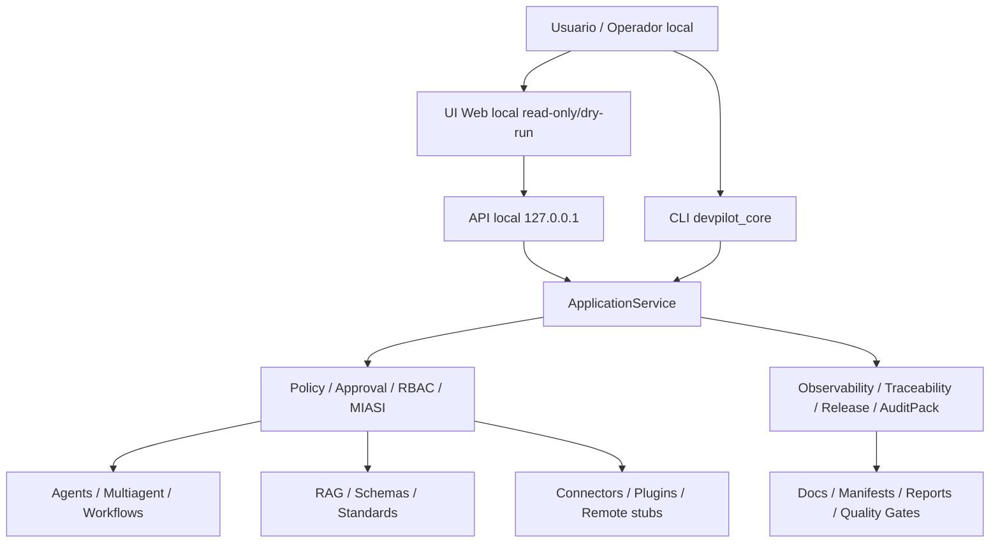

# Mapa arquitectónico actual DevPilot post-H

## 1. Resumen arquitectónico

Este documento implementa el micro-sprint `POST-H-EVAL-001-C — Mapa arquitectónico actual y puntos de acoplamiento` sobre el baseline `repo_DevPilot_Local_133_POST_H_EVAL_001_B.zip`.

El objetivo no es rediseñar DevPilot ni introducir nuevas capacidades runtime. El objetivo es **documentar la arquitectura real** del producto local-first después de Fase H, conectando la matriz de madurez de `POST-H-EVAL-001-B` con un mapa de capas, paquetes, interfaces, estado local, seguridad, testing, observabilidad, release, acoplamientos y riesgos de mantenibilidad.

Conclusión ejecutiva:

- DevPilot ya opera como **baseline industrial local-first**, no como prototipo simple.
- La arquitectura cubre CLI, API local, UI web, ApplicationService, Policy/MIASI, agentes, multiagente, RAG, conectores, plugins, observabilidad, release, compliance y enterprise reporting local.
- El principal riesgo de mantenibilidad es el **CLI monolítico**: `src/devpilot_core/cli.py` concentra 5628 líneas y actúa como punto de entrada dominante.
- Remote/enterprise existe como diseño/stub controlado y debe permanecer **experimental, disabled y dry-run/read-only** hasta nuevas ADRs, threat model y sandboxing.
- El dashboard de madurez `POST-H-002` debe consumir este mapa y la matriz B; no debe convertirse en un panel ornamental.

## 2. Vista por capas

La arquitectura real puede representarse por capas de responsabilidad. Esta vista es normativa para los siguientes sprints post-H, pero describe el estado existente, no un objetivo aspiracional.

```text
User Interfaces
 ├── CLI: src/devpilot_core/cli.py
 ├── API local: src/devpilot_core/interfaces/api
 └── UI web: ui/web

Core / Application Layer
 ├── Application services: src/devpilot_core/application
 ├── Command orchestration: src/devpilot_core/cli.py
 ├── Validation gateway: src/devpilot_core/validation, src/devpilot_core/validators
 └── Local store: src/devpilot_core/store

Governance Layer
 ├── PolicyEngine: src/devpilot_core/policy
 ├── Approval: src/devpilot_core/approval
 ├── RBAC / Identity: src/devpilot_core/identity
 ├── MIASI: src/devpilot_core/miasi + .devpilot/miasi
 └── Security guards: src/devpilot_core/security

Agentic Layer
 ├── Agent runtime: src/devpilot_core/agents
 ├── SDLC agents: src/devpilot_core/agents/sdlc_agents.py y relacionados
 ├── MultiAgentCoordinator: src/devpilot_core/multiagent
 ├── Workflows: .devpilot/workflows
 └── Evaluators: src/devpilot_core/evals + evals/fixtures

Knowledge Layer
 ├── RAG local: src/devpilot_core/rag
 ├── Document index: .devpilot/rag/docs_index.json
 ├── Schemas: src/devpilot_core/schemas + docs/schemas
 ├── Standards: src/devpilot_core/standards + docs/standards
 └── Prompts: src/devpilot_core/prompts + docs/prompts

Integration Layer
 ├── Connectors: src/devpilot_core/connectors + .devpilot/connectors
 ├── MCP MVP/read-only: conectores gobernados desde registry/policy
 ├── Plugins: src/devpilot_core/plugins + .devpilot/plugins
 └── Remote stubs: src/devpilot_core/remote + .devpilot/remote

Operations Layer
 ├── Observability: src/devpilot_core/observability
 ├── Traceability: src/devpilot_core/traceability
 ├── Audit packs: src/devpilot_core/auditpack
 ├── Compliance packs: src/devpilot_core/compliance + .devpilot/compliance
 ├── Release dry-run: src/devpilot_core/release
 └── Industrial readiness: src/devpilot_core/industrial
```

### Flujo lógico principal



## 3. Vista por paquetes Python

Inventario generado desde `src/devpilot_core` en el baseline `POST-H-EVAL-001-B`.

| Paquete | Archivos Python | Líneas aprox. |
|---|---:|---:|
| `src/devpilot_core/__pycache__` | 0 | 0 |
| `src/devpilot_core/agents` | 14 | 4126 |
| `src/devpilot_core/application` | 16 | 1610 |
| `src/devpilot_core/approval` | 5 | 1036 |
| `src/devpilot_core/auditpack` | 2 | 461 |
| `src/devpilot_core/changes` | 3 | 793 |
| `src/devpilot_core/compliance` | 3 | 384 |
| `src/devpilot_core/connectors` | 3 | 631 |
| `src/devpilot_core/enterprise` | 2 | 181 |
| `src/devpilot_core/evals` | 4 | 1216 |
| `src/devpilot_core/execution` | 4 | 611 |
| `src/devpilot_core/identity` | 3 | 408 |
| `src/devpilot_core/industrial` | 2 | 397 |
| `src/devpilot_core/interfaces` | 14 | 955 |
| `src/devpilot_core/miasi` | 2 | 522 |
| `src/devpilot_core/modeling` | 11 | 2819 |
| `src/devpilot_core/multiagent` | 4 | 805 |
| `src/devpilot_core/observability` | 9 | 2853 |
| `src/devpilot_core/plugins` | 2 | 548 |
| `src/devpilot_core/policy` | 8 | 984 |
| `src/devpilot_core/portfolio` | 2 | 126 |
| `src/devpilot_core/prompts` | 3 | 516 |
| `src/devpilot_core/quality` | 2 | 591 |
| `src/devpilot_core/rag` | 3 | 589 |
| `src/devpilot_core/refactor` | 3 | 1118 |
| `src/devpilot_core/release` | 9 | 3392 |
| `src/devpilot_core/remote` | 2 | 223 |
| `src/devpilot_core/repo` | 10 | 3315 |
| `src/devpilot_core/reports` | 3 | 330 |
| `src/devpilot_core/review` | 5 | 1075 |
| `src/devpilot_core/sandbox` | 2 | 811 |
| `src/devpilot_core/schemas` | 6 | 986 |
| `src/devpilot_core/security` | 3 | 540 |
| `src/devpilot_core/standards` | 3 | 414 |
| `src/devpilot_core/store` | 2 | 1280 |
| `src/devpilot_core/testing` | 5 | 770 |
| `src/devpilot_core/traceability` | 8 | 1222 |
| `src/devpilot_core/validation` | 3 | 343 |
| `src/devpilot_core/validators` | 6 | 1397 |
| `src/devpilot_core/workspace` | 3 | 962 |

### Archivos de mayor concentración

| Archivo | Líneas aprox. |
|---|---:|
| `src/devpilot_core/cli.py` | 5628 |
| `src/devpilot_core/store/local_store.py` | 1275 |
| `src/devpilot_core/observability/agentops.py` | 808 |
| `src/devpilot_core/sandbox/patch_sandbox.py` | 806 |
| `src/devpilot_core/repo/git_adapter.py` | 705 |
| `src/devpilot_core/agents/runtime.py` | 650 |
| `src/devpilot_core/refactor/executor.py` | 631 |
| `src/devpilot_core/repo/architecture_drift.py` | 604 |
| `src/devpilot_core/application/services.py` | 590 |
| `src/devpilot_core/quality/gate.py` | 588 |
| `src/devpilot_core/release/verification.py` | 565 |
| `src/devpilot_core/release/backup.py` | 548 |

Lectura arquitectónica:

- `src/devpilot_core/cli.py` es el punto de mayor concentración y debe entrar a una futura estrategia de `CommandRegistry`/handlers.
- `store/local_store.py`, `observability/agentops.py`, `sandbox/patch_sandbox.py`, `repo/git_adapter.py` y `agents/runtime.py` son componentes de alta centralidad operativa.
- La distribución de paquetes muestra una arquitectura modular en carpetas, pero la orquestación sigue excesivamente centrada en el CLI.

## 4. Vista CLI/API/UI

### CLI

El CLI es la interfaz más madura y extensa. Expone comandos para validación, quality gates, project-state, test-contracts, RAG, MIASI, readiness, industrial readiness, release, audit packs, workflows y otros dominios.

Riesgo: el CLI no es solo presentación; también concentra coordinación, imports y wiring. Esto aumenta el costo de mantenimiento al agregar nuevos comandos.

Decisión recomendada:

```text
POST-H-006 — CLI command registry y desacoplamiento de handlers
```

### API local

La API local vive en:

```text
src/devpilot_core/interfaces/api
```

Estructura observada:

```text
app.py
security.py
dependencies.py
models.py
routers/actions.py
routers/approvals.py
routers/reports.py
routers/settings.py
routers/status.py
routers/traces.py
routers/validation.py
```

La API debe permanecer local-first, con host local y sin exposición remota por defecto. Su rol industrial posterior debe ser servir al dashboard y UI local, no abrir una superficie enterprise prematura.

### UI web

La UI web vive en:

```text
ui/web
```

Componentes observados:

```text
Dashboard
ReportTraceView
ApprovalCenterView
SettingsView
DryRunActionForm
ProviderSettings
StatusCard
FindingList/FindingTable
```

Estado: `implemented-initial`. La UI es útil como producto local visual, pero todavía no sustituye al CLI como superficie operacional principal.

Riesgo: si `POST-H-002` consume datos de madurez sin una matriz estable, puede derivar en un dashboard ornamental.

## 5. Vista de estado local .devpilot

`.devpilot` funciona como plano de control local, no como runtime desechable completo. Contiene metadatos source-controlled y también, en entornos físicos, puede coexistir con runtime local no versionable.

Estado versionable observado:

```text
.devpilot/project_state.json
.devpilot/testing/test_contract_registry.json
.devpilot/miasi/*.json
.devpilot/rag/docs_index.json
.devpilot/evals/post_h_eval_001_decision_matrix.json
.devpilot/compliance/packs.json
.devpilot/connectors/connector_registry.json
.devpilot/plugins/plugin_registry.json
.devpilot/remote/runner_registry.json
.devpilot/workflows/*.json
.devpilot/workspaces/workspace_registry.json
```

Regla arquitectónica:

```text
El estado de configuración y control puede ser versionable.
El estado runtime generado no debe versionarse.
```

Deben permanecer fuera del ZIP/repo:

```text
.devpilot/devpilot.db
.devpilot/agent_sessions/
outputs/
.pytest_cache/
__pycache__/
```

## 6. Vista de seguridad

La seguridad está distribuida en varias capas:

| Capa | Componentes | Estado |
|---|---|---|
| Policy | `src/devpilot_core/policy`, `.devpilot/miasi/policy_matrix.json` | implemented |
| Approval | `src/devpilot_core/approval` | implemented-initial |
| Identity/RBAC | `src/devpilot_core/identity`, `.devpilot/identity/identity_registry.json` | implemented-initial |
| Guards | `PathGuard`, `SecretGuard`, `CostGuard`, injection guards | implemented |
| Remote | `src/devpilot_core/remote`, `.devpilot/remote/runner_registry.json` | experimental/disabled |
| Connectors | `.devpilot/connectors`, `src/devpilot_core/connectors` | read-only/implemented-initial |
| Plugins | metadata registry | metadata-only, no sandbox real de ejecución |

Principio vigente:

```text
Deny by default + dry-run + local-first + explicit approvals para acciones sensibles.
```

Riesgos de seguridad que deben pasar a `POST-H-EVAL-001-D`:

- Remote execution prematura.
- Connector write accidental.
- Plugin execution sin sandbox.
- Actor spoofing local.
- Retención indefinida de trazas/sesiones.
- Fuga de runtime artifacts en ZIP/audit packs.

## 7. Vista de testing y quality gates

La arquitectura de calidad se apoya en:

```text
.devpilot/testing/test_contract_registry.json
src/devpilot_core/testing
src/devpilot_core/quality/gate.py
tests/test_project_global_state.py
tests/test_test_contract_registry.py
tests/test_test_impact.py
tests/test_sprint_*_documentation.py
```

Señales del baseline:

- `test-contracts validate`: 84 contratos.
- Contratos históricos: 78.
- `quality-gate hardening`: 12/12 subgates, 0 blockers.
- `industrial-readiness`: score 84.18, explicit maturity boundaries.
- `POST-H-EVAL-001-B`: prueba documental/matriz dedicada con 5 tests.

Riesgo:

```text
Existe abundancia de tests históricos/documentales, pero el costo de regresión y el mapeo por impacto todavía requieren Test Contract Registry 2.0.
```

Decisión recomendada:

```text
POST-H-003 — Test Contract Registry 2.0 por dominio, criticidad, riesgo e impacto.
```

## 8. Vista de observabilidad

Componentes:

```text
src/devpilot_core/observability
src/devpilot_core/traceability
outputs/reports      # runtime, no versionable
outputs/traces       # runtime, no versionable
```

Estado: `implemented-initial`.

Capacidades existentes:

- AgentOps local.
- Reportes locales.
- Trazas consultables.
- Exporters dry-run.
- Evidencia operativa en quality gates.

Deuda:

- Política de retención.
- Compactación/rotación.
- Separación clara entre evidencia source-controlled y evidencia runtime.
- Integración futura con dashboard sin convertir outputs en fuente versionable.

## 9. Vista de release y auditoría

Componentes:

```text
src/devpilot_core/release
src/devpilot_core/auditpack
src/devpilot_core/compliance
docs/release/CHANGELOG.md
docs/audits/
.devpilot/compliance/packs.json
```

Estado: `implemented-initial` para release dry-run; audit/compliance local es útil pero no debe presentarse como certificación externa.

Regla:

```text
Audit packs son artefactos generados; pueden exportarse, pero no deben entrar al repo ni al ZIP fuente de verdad salvo que se diseñe explícitamente un paquete de evidencia separado.
```

## 10. Puntos de acoplamiento

| Acoplamiento | Evidencia | Riesgo | Acción recomendada |
|---|---|---|---|
| CLI como orquestador central | `src/devpilot_core/cli.py` con 5628 líneas | Alto | Extraer command handlers y registry. |
| Docs/manifest/tests | README, runbook, changelog, project_state, tests históricos | Medio-alto | Definir canonical sources y reducir drift. |
| Quality gate compuesto | `quality/gate.py` coordina múltiples subgates | Medio | Mantener contratos de subgate y evitar side effects. |
| MIASI/Policy/Tools | `.devpilot/miasi/*`, policy engine, registries | Medio | Validador semántico ampliado y tests de cobertura. |
| RAG index/docs | `.devpilot/rag/docs_index.json` depende de docs | Medio | Política clara de regeneración e impacto. |
| UI/API/ApplicationService | `ui/web`, `interfaces/api`, `application` | Medio | Contrato API estable para dashboard. |
| Remote/Enterprise | remote registry + enterprise reports | Crítico | Mantener disabled hasta ADR/threat model. |
| Runtime outputs/audit packs | outputs generados por gates/evals | Alto | Export hygiene y tests anti-tracking. |
| Test contracts/historical tests | 84 contratos, 78 históricos | Medio-alto | Registry 2.0 por criticidad/impacto. |

## 11. Riesgos arquitectónicos

| ID | Riesgo | Severidad | Estado actual | Mitigación propuesta |
|---|---|---:|---|---|
| ARCH-001 | CLI monolítico | Alta | Confirmado | POST-H-006 command registry. |
| ARCH-002 | Crecimiento acumulativo de comandos | Alta | Confirmado | Separar handlers por dominio. |
| ARCH-003 | Drift entre docs/manifests/backlogs | Media-alta | Histórico | Canonical sources y pruebas documentales por hito. |
| ARCH-004 | Testing histórico abundante pero costoso | Media-alta | Confirmado | Test Contract Registry 2.0. |
| ARCH-005 | Runtime artifacts en fuentes ZIP antiguas | Alta | Detectado en POST-H-EVAL-001-A | git archive + ignore + checks. |
| ARCH-006 | Remote runner como stub experimental | Crítica | Disabled | ADR, threat model y sandbox antes de activar. |
| ARCH-007 | Plugin ecosystem sin sandbox real | Alta | Metadata-only | Mantener sin ejecución arbitraria. |
| ARCH-008 | Connectors read-only, no write-safe | Alta | Read-only | Replay tests y approval gates antes de write. |
| ARCH-009 | UI/API implemented-initial | Media | MVP local | Endurecer contrato y auth local. |
| ARCH-010 | Observability sin retención formal | Media | implemented-initial | Retention policy. |

## 12. Recomendaciones de refactor

### P0/P1 antes de nuevas features enterprise

1. `POST-H-003 — Test Contract Registry 2.0`.
2. `POST-H-004 — Policy/MIASI semantic validator ampliado`.
3. `POST-H-005 — Architecture map executable / dependency ownership`.
4. `POST-H-006 — CLI command registry y desacoplamiento de handlers`.
5. `POST-H-008 — Runtime state lifecycle policy`.
6. `POST-H-009 — Documentation governance y canonical sources`.

### Refactor CLI recomendado

Patrón objetivo:

```text
src/devpilot_core/cli.py
 └── carga grupos/commands mínimos
src/devpilot_core/commands/
 ├── quality.py
 ├── project_state.py
 ├── test_contracts.py
 ├── rag.py
 ├── miasi.py
 ├── release.py
 ├── industrial.py
 └── post_h_eval.py
```

No ejecutar este refactor en POST-H-EVAL-001-C. Solo queda documentado como decisión de roadmap.


Regla de frontera: **Remote/enterprise sigue experimental**, no habilitada y sin ejecución remota activa.

## 13. Decisiones pendientes

| ID | Decisión | Estado | Micro-sprint recomendado |
|---|---|---|---|
| DEC-C-001 | Adoptar este mapa como base para `POST-H-002` | Propuesta | POST-H-002 |
| DEC-C-002 | Crear ownership por paquete/capacidad | Propuesta | POST-H-005 |
| DEC-C-003 | Diseñar `CommandRegistry` antes de seguir ampliando CLI | Propuesta | POST-H-006 |
| DEC-C-004 | Mantener remote execution disabled | Confirmada por B, reforzada aquí | POST-H-EVAL-001-D / ADR futura |
| DEC-C-005 | Separar audit packs exportables de fuente Git | Confirmada por A, reforzada aquí | POST-H-EVAL-001-D/E |

## 14. Relación con matriz de madurez B

La matriz B evaluó 28 dominios. Este mapa interpreta esos dominios como arquitectura operativa.

| Dominio | Madurez | Riesgo | Prioridad | Acción recomendada |
|---|---|---|---|---|
| Core CLI | implemented | medium-high | P1 | Planear command registry/command handlers en oleada de arquitectura interna; no agregar comandos complejos sin boundary explícito. |
| Application Services | implemented | medium | P1 | Incluir ApplicationService boundary hardening y ownership de dependencias en el roadmap post-H. |
| Schemas y contratos | production-ready-local | low | P0 | Mantener como núcleo de gobernanza; ampliar validadores semánticos sin relajar compatibilidad. |
| Project state | implemented | medium | P0 | Mantener POST-H-EVAL como hito diagnóstico sin mutar last_completed_sprint hasta cierre global; documentar cuándo se actualiza next_sprint. |
| Quality gates | implemented | medium | P0 | Usar hardening como gate base para POST-H-EVAL; preparar matriz por criticidad en POST-H-EVAL-001-E. |
| Testing contracts | implemented-initial | medium-high | P0 | Definir Test Contract Registry 2.0 y taxonomía P0/P1/P2/P3. |
| PolicyEngine | implemented | medium | P0 | Ampliar validador semántico Policy/MIASI y mantener deny-by-default para acciones críticas. |
| MIASI | implemented | medium | P0 | Implementar validator ampliado de cobertura agente-tool-policy y alertas por tool high-risk sin approval. |
| Approval | implemented-initial | medium-high | P1 | Endurecer modelo de aprobación con actor, scope, expiración y audit trail verificable. |
| RBAC / Identity | implemented-initial | high | P1 | Definir hardening local de sesiones/actores antes de enterprise o remote. |
| Security guards | implemented-initial | medium-high | P1 | Convertir guardrails en contratos P0 y ampliar pruebas de inyección/secret leakage. |
| Agent runtime | implemented-initial | medium | P2 | No ampliar autonomía abierta; priorizar evaluación de sesiones y trazabilidad. |
| SDLC agents | implemented-initial | medium | P2 | Vincular agentes SDLC a evals por tarea y a test contracts de cambios en prompts. |
| MultiAgentCoordinator | implemented-initial | medium-high | P2 | Definir métricas de handoff, límites de roles y replay deterministic antes de workflows más complejos. |
| Workflows multiagente | implemented-initial | medium | P2 | Agregar validación semántica de workflows y criterios de replay/auditoría. |
| RAG local | implemented-initial | medium | P1 | Definir evals de groundedness y métricas de recuperación antes de usarlo como evidencia crítica. |
| Connectors / MCP | implemented-initial | high | P2 | Mantener read-only; diseñar sandbox/replay y ADR antes de habilitar escrituras. |
| Plugin registry | implemented-initial | high | P2 | Mantener metadata-only y diseñar sandbox de plugin antes de ejecución. |
| Multiworkspace | implemented-initial | medium-high | P2 | Fortalecer portfolio/workspace antes de dashboard multi-proyecto o enterprise. |
| Observability / AgentOps | implemented-initial | medium-high | P1 | Definir runtime state lifecycle policy y retención de traces/agent_sessions. |
| Audit packs | implemented-initial | medium-high | P1 | Formalizar exclusión de outputs en fuentes Git y evaluar signing/checksums fuera de runtime source. |
| Compliance packs | implemented-initial | medium | P2 | Mantener etiquetas de no-certificación y ampliar mappings solo con evidencia documental. |
| Release dry-run | implemented-initial | medium | P1 | Definir release reproducibility pack y export desde git archive. |
| Remote runner stub | experimental | critical | P3 | Mantener disabled; planear solo ADR y threat model antes de cualquier implementación activa. |
| Enterprise reports | experimental | high | P3 | Mantener como reporte local; evitar claims enterprise hasta IAM, deployment y auditabilidad fuerte. |
| UI web | implemented-initial | medium | P1 | POST-H-002 debe consumir la matriz de madurez de B, no solo score industrial. |
| API local | implemented-initial | medium-high | P1 | Endurecer API local antes de acciones write o uso multiusuario. |
| Documentation governance | implemented-initial | medium-high | P1 | Definir canonical sources, política de actualización documental y estrategia de tests históricos menos frágil. |

## 15. Criterios PASS/BLOCK de este micro-sprint

### PASS

```text
PASS si el documento refleja arquitectura real, no aspiracional.
PASS si se identifican puntos de acoplamiento.
PASS si se registra riesgo de CLI monolítico.
PASS si se distinguen capas core, governance, agentic, knowledge, integration y operations.
PASS si se incluye UI/API.
PASS si se incluye seguridad.
PASS si se incluye testing.
PASS si se registran riesgos arquitectónicos.
```

### BLOCK

```text
BLOCK si el mapa ignora UI/API.
BLOCK si el mapa ignora seguridad.
BLOCK si el mapa ignora testing.
BLOCK si no se registran riesgos arquitectónicos.
BLOCK si se propone habilitar remote execution o conectores write.
BLOCK si se modifica código runtime.
```

## 16. Trazabilidad

- Fuente base: `repo_DevPilot_Local_133_POST_H_EVAL_001_B.zip`.
- Backlog normativo: `docs/POST-H-EVAL-001_backlog_ejecutable.md`.
- Matriz de madurez consumida: `.devpilot/evals/post_h_eval_001_decision_matrix.json`.
- Tipo de intervención: documentación/metadata/test documental.
- Mutaciones runtime: ninguna.
- Red/API externa: ninguna.
- Remote execution: no habilitada.
