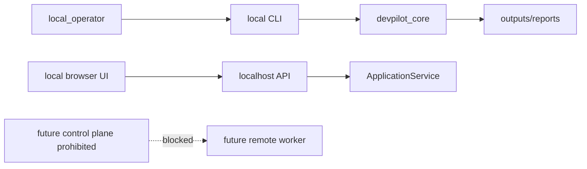

# Enterprise deployment threat model

## 1. Estado y alcance

POST-H-022-D consolida la version design-only del threat model enterprise con validator/report read-only y quality gate. POST-H-022-B amplía la primera version del threat model enterprise de DevPilot con un catalogo de amenazas STRIDE/LINDDUN, controles requeridos y riesgos residuales. El alcance sigue siendo diseño. No habilita despliegue enterprise, multiusuario productivo, control plane, remote workers, secure transport activo, SSO/SAML/OIDC, APIs externas, red ni certificacion compliance.

La regla operativa es explicita:

```text
enterprise report != enterprise readiness
enterprise threat model != enterprise deployment enabled
```

## 2. Invariantes de seguridad

```text
enterprise_deployment_enabled=false
production_multiuser_enabled=false
control_plane_enabled=false
remote_execution_enabled=false
secure_transport_implemented=false
compliance_certification_claim=false
network_used=false
external_api_used=false
secrets_read=false
connector_write_enabled=false
plugin_execution_enabled=false
```

## 3. Activos enterprise inventariados

| Asset | Categoria | Sensibilidad | Boundary actual | Riesgo enterprise futuro |
|---|---|---:|---|---|
| workspace | workspace | confidential | local_machine | sincronizacion remota o acceso multiusuario sin aislamiento |
| source_code | source_code | confidential | workspace_root | integridad, review, firma y supply-chain |
| local_store | state_store | restricted | .devpilot state | centralizacion sin cifrado, RBAC o auditoria |
| reports | reports | internal | outputs/reports | distribucion sin redaccion, firma o retencion |
| traces | traces | restricted | runtime local | exposicion de eventos, PII o datos sensibles |
| approvals | approvals | restricted | identity/approval | aprobaciones no trazables o privilegios excesivos |
| secrets | secrets | restricted | secrets boundary | lectura, introduccion o exfiltracion de credenciales |
| identity_registry | identity | restricted | identity registry | suplantacion y falta de separacion de funciones |
| policy_matrix | policy | internal | policy boundary | bypass de no-go gates y acciones sensibles |
| compliance_mappings | compliance | internal | compliance mapping | claims de certificacion no respaldados |
| audit_packs | audit | confidential | audit pack boundary | cadena de custodia incompleta |
| local_api | api | internal | localhost API | exposicion de red sin transport/auth |
| web_ui | ui | internal | browser localhost | sesiones, CSRF, CSP y auth enterprise ausentes |
| release_archives | release | confidential | local release | distribucion sin firma o attestations |
| remote_runner_design | remote_design | restricted | documentation boundary | confundir diseno ADR-2 con ejecucion remota habilitada |

## 4. Actores

| Actor | Tipo | Acceso actual | Riesgo futuro |
|---|---|---|---|
| owner | internal | Control local de decisiones y cierre | concentracion de privilegios |
| local_operator | internal | Ejecuta CLI, tests y validadores locales | operacion sensible sin RBAC granular |
| developer | internal | Modifica fuentes y tests | supply-chain interno o bypass de gates |
| auditor | external | Lee evidencias y manifests | acceso excesivo a datos sensibles |
| malicious_local_user | adversarial | Acceso local no autorizado si compromete workspace | tampering, exfiltracion o escalada |
| compromised_dependency | adversarial | Riesgo durante tooling/imports locales | ejecucion o exfiltracion si hubiese red |
| future_remote_worker | future | Sin acceso actual | remote execution, spoofing y tampering |
| future_enterprise_admin | future | Sin acceso actual | privilegios sin SoD, break-glass y auditoria |

## 5. Trust boundaries

| Boundary | Tipo | Estado actual | Estado futuro requerido |
|---|---|---|---|
| local_machine | current | Boundary primario local-first | Separacion de cualquier control plane remoto |
| workspace_root | current | Repo y artefactos fuente | Integridad, revision, aislamiento |
| devpilot_state_boundary | current | Registries y estado local | Cifrado, retention, RBAC y auditoria |
| outputs_reports_boundary | current | Evidencia regenerable local | Redaccion, integridad y distribucion controlada |
| api_localhost | current | Interfaz local | ADR futura si se expone por red |
| browser_localhost | current | UI local | Auth, sesiones, CSRF, CSP y audit |
| future_network_boundary | future | No implementado | POST-H-023 y ADR futura |
| future_control_plane_boundary | prohibited | No autorizado | Threat model completo y quality gate dedicado |
| third_party_audit_boundary | future | Sin exportacion automatica | Contratos de datos, redaccion y aprobacion |
| secrets_boundary | prohibited | Secretos no leidos ni introducidos | Vaulting, scopes, rotacion y tests anti-leak |

## 6. Threat catalog STRIDE/LINDDUN

POST-H-022-B usa STRIDE y LINDDUN como taxonomias complementarias. STRIDE cubre abuso tecnico de identidad, integridad, repudio, disclosure, disponibilidad y privilegios. LINDDUN cubre privacidad, trazabilidad indebida, detectabilidad, desconocimiento y no cumplimiento. El catalogo machine-readable vive en `.devpilot/enterprise/enterprise_threat_model.json`.

```text
methodologies=["STRIDE","LINDDUN"]
all_boundaries_have_threats=true
critical_threats_have_controls=true
enterprise_deployment_enabled=false
remote_execution_enabled=false
```

| Threat | Boundary | STRIDE | LINDDUN | Timing | Severidad | Controles requeridos |
|---|---|---|---|---|---:|---|
| ENT-T000 Local machine trust overextension | local_machine | elevation, tampering | unawareness, non_compliance | current | high | ENT-C002, ENT-C003, ENT-C008 |
| ENT-T001 Actor spoofing | identity_approval_boundary | spoofing, elevation | identifiability, non_repudiation | current | critical | ENT-C001, ENT-C002 |
| ENT-T002 Workspace/source tampering | workspace_root | tampering, elevation | non_repudiation, non_compliance | current | high | ENT-C002, ENT-C003 |
| ENT-T003 Local state tampering | devpilot_state_boundary | tampering, repudiation | non_repudiation, detectability | current | high | ENT-C003, ENT-C004 |
| ENT-T004 Audit evidence repudiation | outputs_reports_boundary | repudiation, tampering | non_repudiation, detectability | current | high | ENT-C004 |
| ENT-T005 Secret disclosure | secrets_boundary | information_disclosure, elevation | disclosure_of_information, non_compliance | future | critical | ENT-C001, ENT-C005 |
| ENT-T006 Localhost API promoted to network | api_localhost | spoofing, disclosure, elevation | identifiability, disclosure_of_information | future | critical | ENT-C002, ENT-C006 |
| ENT-T007 UI/session abuse | browser_localhost | denial_of_service, disclosure | detectability, unawareness | future | high | ENT-C004, ENT-C007 |
| ENT-T008 Future network endpoint spoofing | future_network_boundary | spoofing, disclosure, DoS | linkability, disclosure, detectability | future | critical | ENT-C001, ENT-C006, ENT-C008 |
| ENT-T009 Compliance/audit overclaiming | third_party_audit_boundary | repudiation, tampering | non_compliance, unawareness | future | critical | ENT-C004, ENT-C008, ENT-C009 |
| ENT-T010 Control plane command abuse | future_control_plane_boundary | elevation, tampering, disclosure | disclosure_of_information, non_compliance | future | critical | ENT-C005, ENT-C008, ENT-C010 |

## 7. Controles requeridos y riesgos residuales

```text
ENT-C001 identity and anti-spoofing
ENT-C002 RBAC and approval binding
ENT-C003 tamper-evident integrity
ENT-C004 audit retention/redaction/non-repudiation
ENT-C005 secret management and vaulting
ENT-C006 secure transport/session hardening
ENT-C007 DoS/resource controls
ENT-C008 enterprise quality gate no-go enforcement
ENT-C009 human compliance/legal review
ENT-C010 remote worker isolation and command sandboxing
```

```text
ENT-RR001 local identity is not enterprise identity
ENT-RR002 integrity and custody are incomplete for enterprise release/state
ENT-RR003 audit evidence remains local and non-certifying
ENT-RR004 secrets and remote worker credentials remain prohibited
ENT-RR005 network/transport/session model is absent
ENT-RR006 compliance overclaiming remains blocked
ENT-RR007 control plane remains prohibited
```

## 8. Data flows de diseno



Todos los flujos actuales son locales. El flujo `future_control_plane -> future_remote_worker` existe solo como amenaza futura bloqueada; no esta implementado ni autorizado.

## 9. No-go gates

POST-H-022-B se bloquea si ocurre cualquiera de estos eventos:

```text
enterprise_deployment_enabled=true
production_multiuser_enabled=true
control_plane_enabled=true
remote_execution_enabled=true
secure_transport_implemented=true
compliance_certification_claim=true
secrets_introduced=true
network_dependency_introduced=true
```

## 10. Fuentes machine-readable

La fuente estructurada de este documento es:

```text
.devpilot/enterprise/enterprise_threat_model.json
```

Su contrato estructural es:

```text
docs/schemas/enterprise_threat_model.schema.json
```

## 11. Pendiente

POST-H-022-D es una version preliminar `implemented-initial / design-only`. Queda para cierre:

```text
POST-H-022-C — Enterprise control matrix implementado como matriz design-only.
POST-H-022-D — Validator/report read-only y quality gate implementado como evidencia design-only.
POST-H-022-E — Runbook, disclaimers y cierre.
```

## 12. Validator/report read-only y quality gate

POST-H-022-D introduce `EnterpriseThreatModelValidator`, `EnterpriseThreatModelReporter` y `EnterpriseThreatModelQualityGate`. Estos componentes leen únicamente `.devpilot/enterprise/enterprise_threat_model.json` y `.devpilot/enterprise/enterprise_control_matrix.json`; no ejecutan despliegue, no usan red, no leen secretos y no escriben reportes cuando se invocan desde quality gate.

```text
quality_gate_subgate=enterprise-threat-model-design-only
decision_status=design-only
enterprise_deployment_enabled=false
remote_execution_enabled=false
secure_transport_implemented=false
compliance_certification_claim=false
enterprise_ready_claimed=false
required_not_implemented_total>0
```

El reporte es un artefacto preliminar de diseño. Enterprise report != enterprise readiness y no sustituye una ADR futura, una implementación de identidad/transport/secrets ni auditoría enterprise externa.
