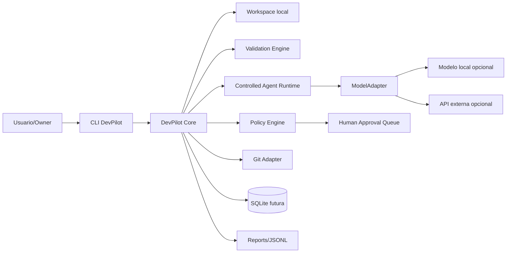

# Security Threat Model — DevPilot Local

## 1. Propósito

Este documento define el modelo inicial de amenazas de **DevPilot Local / Agent-assisted SDLC personal** antes de avanzar a implementación funcional fuerte. Su objetivo es establecer amenazas, activos, límites de confianza, controles, políticas de `dry-run`, gestión de secretos, protección del filesystem, riesgos agentic y criterios bloqueantes de seguridad.

El modelo se construye bajo **MIPSoftware** como estándar general de ingeniería profesional de software y **MIASI** como extensión obligatoria para sistemas con IA, agentes, LLMs, RAG, memoria, herramientas, evaluación, trazas y acciones asistidas por modelos.

## 2. Alcance

| Área | Incluida | Observación |
|---|---:|---|
| CLI local | Sí | Primer canal operativo del MVP. |
| Workspaces locales | Sí | Unidad central de gobierno. |
| Documentos pre-code | Sí | Artefactos MIPSoftware/MIASI. |
| Validadores documentales | Sí | Determinísticos y auditables. |
| Agentes documentales del MVP | Sí | Controlados, no autónomos destructivos. |
| Persistencia local | Sí | Markdown/JSON/YAML, SQLite futura y JSONL. |
| Git local | Sí | MVP+ inicialmente read-only. |
| Repos reales | Sí | MVP+, con políticas estrictas. |
| APIs externas LLM | Sí | No obligatorias; permitidas con ModelAdapter, CostGuard y SecretGuard. |
| Desktop/Web futura | Parcial | Riesgos identificados para diseño posterior. |
| CI/CD remoto | Futuro | No operativo en MVP. |

## 3. Principios de seguridad

| Principio | Regla aplicada |
|---|---|
| Deny by default | Toda acción no permitida explícitamente debe bloquearse. |
| Dry-run por defecto | Ninguna acción de escritura o modificación se ejecuta sin modo de simulación previo. |
| Least privilege | CLI, agentes y tools solo acceden a rutas, comandos y datos autorizados. |
| Human approval | Acciones sensibles requieren aprobación humana explícita. |
| Trazabilidad | Toda acción relevante debe generar evidencia local. |
| Secret-safe | Ningún secreto debe imprimirse, persistirse en logs o enviarse a modelos. |
| Local-first híbrido | El sistema funciona localmente, pero puede usar APIs externas controladas cuando aporten calidad. |
| Separación gate/agente | Un agente puede recomendar; un gate determinístico decide cumplimiento. |
| Reversibilidad | Cambios en repos reales deben ser revisables y revertibles. |
| Fail closed | Ante error, ambigüedad o violación de política, el sistema debe bloquear la acción. |

## 4. Activos protegidos

| Activo | Sensibilidad | Riesgo principal | Control esperado |
|---|---|---|---|
| Código fuente de proyectos | Alta | Modificación, exposición o corrupción | Path sandbox, Git diff, dry-run, approval |
| Documentos MIPSoftware/MIASI | Media/Alta | Inconsistencia normativa | Versionado, revisión, auditoría |
| Documentos pre-code de proyectos | Alta | Decisiones erróneas o incompletas | Validadores, audit agent, trazabilidad |
| `.env` y secretos | Crítica | Exposición en logs/modelos/reportes | SecretGuard, redacción, gitignore |
| Patches | Alta | Cambios inseguros o destructivos | PatchReview, tests, approval |
| Repos Git | Alta | Commits indebidos, ramas dañadas | Git Adapter controlado, snapshots |
| Reportes JSON/Markdown | Media | Falsa confianza o filtración | Redacción, schema, revisión |
| Trazas JSONL | Alta | Exposición de datos sensibles | Redacción, minimización, rotación futura |
| SQLite local futura | Alta | Corrupción o exposición de estado | Backups, permisos, migraciones |
| Configuración de proveedores LLM | Alta | Costos, filtración, uso no autorizado | ModelAdapter, CostGuard, SecretGuard |
| Memoria/RAG futura | Alta | Persistencia de datos sensibles | Data classification, retention, purge |

## 5. Límites de confianza



| Límite | Riesgo | Control |
|---|---|---|
| Usuario → CLI | Comando incorrecto o destructivo | Confirmaciones, help, dry-run |
| CLI → Core | Parámetros maliciosos | Validación de input |
| Core → Filesystem | Path traversal / overwrite | Path sandbox, allowlist |
| Core → Git | Cambios no deseados | Read-only inicial, diff, approval |
| Core → Agent Runtime | Excessive agency | Tool permissions, policy gate |
| Agent Runtime → ModelAdapter | Prompt injection / data leak | Prompt hygiene, redacción |
| ModelAdapter → API externa | Costos / secretos / privacidad | CostGuard, consent, budget |
| Core → SQLite/JSONL | Persistencia sensible | minimización, redacción, retention |
| Desktop/Web futura → Core | Auth/session risks | ASVS futuro, autorización |

## 6. Supuestos de seguridad

1. DevPilot Local será usado inicialmente por un único owner en entorno local.
2. El MVP no debe requerir API keys reales.
3. Los agentes del MVP no deben modificar archivos sin aprobación humana.
4. El Git Adapter en MVP+ inicia como read-only.
5. Los reportes pueden contener hallazgos sensibles; no deben publicarse sin revisión.
6. Las APIs externas pueden incorporarse después, pero nunca como requisito obligatorio.
7. Todo workspace debe poder operar sin enviar código ni documentos a proveedores externos.

## 7. Amenazas principales

| ID | Categoría | Amenaza | Escenario | Impacto | Prob. | Riesgo | Control obligatorio |
|---|---|---|---|---:|---:|---:|---|
| T-001 | Filesystem | Escritura fuera del workspace | Comando genera archivo fuera de ruta permitida | Alto | Media | Alto | Path sandbox + deny by default |
| T-002 | Filesystem | Overwrite accidental | Reporte o patch sobrescribe archivo fuente | Alto | Media | Alto | Dry-run + backup + approval |
| T-003 | Secretos | Exposición de `.env` | Se imprime API key en reporte o prompt | Crítico | Media | Crítico | SecretGuard + redacción |
| T-004 | Git | Commit indebido | Acción automatizada crea commit sin revisión | Alto | Baja | Medio | No commit automático en MVP/MVP+ |
| T-005 | Patch | Patch inseguro | Un patch modifica código crítico sin tests | Alto | Media | Alto | PatchReview + tests + approval |
| T-006 | Agentes | Excessive agency | Agente ejecuta tool fuera de intención del usuario | Crítico | Media | Crítico | Tool Registry + Policy Engine |
| T-007 | LLM | Prompt injection | Documento/repo contiene instrucciones maliciosas para el agente | Alto | Alta | Crítico | Separar datos/instrucciones + gates |
| T-008 | LLM | Insecure output handling | Se aplica código sugerido sin validación | Alto | Media | Alto | Nunca aplicar output sin validación |
| T-009 | LLM | Sensitive information disclosure | Modelo revela o procesa datos sensibles | Alto | Media | Alto | Redacción + minimización |
| T-010 | LLM | Cost runaway | Llamadas API excesivas generan costo no previsto | Medio | Media | Medio | CostGuard + budgets |
| T-011 | Persistencia | Corrupción de SQLite | Estado operativo queda inconsistente | Medio | Baja | Medio | Backups + migraciones + tests |
| T-012 | Trazas | Logs sensibles | JSONL contiene secretos o datos personales | Alto | Media | Alto | Redacción + clasificación |
| T-013 | Supply chain | Dependencia vulnerable | Librería externa introduce riesgo | Alto | Media | Alto | Dependency scanning futuro |
| T-014 | Standards | Desalineación MIPSoftware/MIASI | Docs dicen una cosa y validadores otra | Medio | Media | Medio | Standards Registry versionado |
| T-015 | Workspace | Workspace falso/malicioso | Proyecto externo simula `.devpilot` inseguro | Alto | Media | Alto | Firma futura / trust prompt |
| T-016 | Desktop/Web futura | Exposición por UI/API | Auth débil o sesión expuesta | Alto | Media | Alto | ASVS + auth + threat model futuro |
| T-017 | RAG/Memoria futura | Retención indebida | Memoria conserva datos sensibles | Alto | Media | Alto | Retention policy + purge |
| T-018 | MCP/API futura | Tool injection | Conector externo ejecuta acción peligrosa | Crítico | Media | Crítico | Tool sandbox + approval |

## 8. Controles de seguridad por capa

| Capa | Controles mínimos |
|---|---|
| CLI | Validación de argumentos, ayuda clara, exit codes, modo dry-run |
| Core | Separación de responsabilidades, errores seguros, policy hooks |
| Workspace Manager | Canonicalización de rutas, `.devpilot/`, allowlist |
| Validation Engine | Reglas determinísticas, reportes reproducibles |
| Agent Runtime | Tool allowlist, límites de iteración, no autonomía destructiva |
| ModelAdapter | Proveedores opcionales, redacción, budgets, no default cloud |
| Tool Registry | Permisos, side effects, riesgo, aprobación |
| Policy Engine | Deny by default, reglas por acción, bloqueo seguro |
| Git Adapter | Read-only inicial, diff, snapshot, no commit automático |
| Persistence Layer | SQLite con permisos locales, JSONL redactado, backups futuros |
| Report Engine | No secretos, hallazgos clasificados, Markdown/JSON |
| Observability | Logs estructurados, trace IDs, minimización de datos |
| Desktop/Web futura | AuthN/AuthZ, sesiones seguras, CSRF/CORS si aplica |

## 9. Política de `dry-run`

| Tipo de acción | MVP | MVP+ | Post-MVP |
|---|---|---|---|
| Validar documentos | Ejecutar | Ejecutar | Ejecutar |
| Generar reporte | Ejecutar | Ejecutar | Ejecutar |
| Crear borrador documental | Dry-run/preview | Ejecutar con aprobación | Ejecutar con política |
| Modificar documentos | Bloqueado por defecto | Approval requerido | Approval/policy requerido |
| Leer Git status | No requerido en MVP | Ejecutar read-only | Ejecutar |
| Aplicar patch | No disponible | Dry-run + approval | Policy + tests + approval |
| Refactor código | No disponible | Propuesta only | Approval + tests |
| Llamar API externa | No obligatorio | CostGuard + consent | CostGuard + policy |
| Ejecutar deploy | No disponible | No disponible o simulación | Approval + release gate |

## 10. Gestión de secretos

Reglas obligatorias:

1. `.env` real no debe versionarse.
2. `.env.example` debe contener placeholders, no secretos reales.
3. Secretos nunca deben aparecer en reportes, logs, trazas o prompts.
4. Todo proveedor LLM externo debe pasar por `SecretGuard`.
5. El sistema debe detectar patrones de riesgo: API keys, tokens, passwords, connection strings.
6. Si se detecta secreto, se reporta redactado.
7. No se permite copiar secretos al portapapeles ni imprimirlos por defecto.

Ejemplo de redacción:

```text
OPENAI_API_KEY=sk-...REDACTED
DATABASE_URL=postgres://...REDACTED
```

## 11. Riesgos agentic específicos

| Riesgo MIASI | Descripción | Control |
|---|---|---|
| Prompt injection | Entrada maliciosa intenta reprogramar al agente | Context isolation + policy gate |
| Excessive agency | Agente actúa más allá del permiso concedido | Tool scope + approval |
| Hallucinated compliance | Agente afirma PASS sin evidencia | Validadores determinísticos |
| Tool misuse | Agente usa tool incorrecta | Tool registry + evals |
| Memory leakage | Memoria conserva datos sensibles | Retention + redacción |
| RAG poisoning | Documentos maliciosos contaminan recuperación | Source trust + citations |
| Cost explosion | Llamadas iterativas consumen presupuesto | CostGuard + limits |
| Silent failure | Agente oculta fallo o incertidumbre | Trace + structured result |

## 12. Security gates

| Gate | Aplica desde | Criterio PASS | Criterio BLOCK |
|---|---|---|---|
| Pre-code security gate | MVP | Threat model existe y está reviewed | No hay threat model |
| Secret gate | MVP | No hay secretos reales en docs/reportes | Se detecta secreto sin redacción |
| Filesystem gate | MVP | Toda ruta se normaliza y limita al workspace | Escritura fuera del workspace |
| Agent gate | MVP | Agent Card/Policy Card existen | Agente sin política |
| Cost gate | MVP+ | Budget definido para APIs | API externa sin presupuesto |
| Patch gate | MVP+ | Patch tiene diff, tests, approval | Patch directo a fuente |
| Git gate | MVP+ | Operación read-only o approval | Commit automático no autorizado |
| Release gate | Post-MVP | Checklist release PASS | Deploy sin rollback |
| Privacy gate | MVP | Data classification mínima | Datos sensibles sin política |

## 13. Criterios de bloqueo

DevPilot debe bloquear avance si:

- se detecta secreto real sin redacción;
- una acción intenta escribir fuera del workspace;
- un agente solicita tool sin permiso;
- una API externa se usa sin consentimiento, budget o secret policy;
- un patch modifica código sin diff y sin tests;
- un reporte afirma cumplimiento sin evidencia;
- se intenta desplegar sin release gate;
- se activa MIASI pero faltan Agent/Tool/Policy/Eval/Human Approval/Observability Cards;
- se detecta dato sensible sin política de retención;
- se produce un error de seguridad y el sistema no puede determinar impacto.

## 14. Trazabilidad con producto, requerimientos y arquitectura

| Fuente | Relación |
|---|---|
| `00_product` | Define local-first híbrido, Git, workspaces, agentes, MVP/MVP+. |
| `01_requirements` | Define requerimientos de validación, agentes documentales, Git, patches y seguridad. |
| `02_architecture` | Define Policy Engine, CostGuard, SecretGuard, Agent Runtime y Persistence Layer. |
| `06_miasi` | Deberá concretar cards y controles específicos de agentes. |

## 15. Riesgo residual

Incluso con controles, DevPilot tendrá riesgo residual en:

- interpretación incorrecta de resultados de agentes;
- omisiones en documentos del usuario;
- datos sensibles no detectados por patrones;
- prompts maliciosos sofisticados;
- dependencias vulnerables;
- errores humanos al aprobar acciones.

La mitigación no será eliminar todo riesgo, sino hacerlo visible, trazable y gobernable.

## 16. Estado del documento

Este documento queda en `reviewed`. Puede promoverse a `approved` cuando:

- el owner acepte el threat model;
- `privacy_assessment.md` esté alineado;
- `06_miasi` concrete las cards agentic;
- `04_quality` incluya pruebas de seguridad mínimas;
- `05_operations` defina tratamiento de incidentes y trazas.
