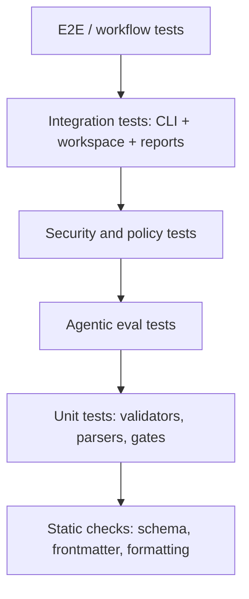

# Test Strategy — DevPilot Local

## 1. Propósito

Este documento define la estrategia de calidad, pruebas, quality gates y criterios de verificación de **DevPilot Local / Agent-assisted SDLC personal** antes de iniciar implementación funcional fuerte.

El objetivo no es solo ejecutar `pytest -q`; es establecer un modelo de calidad progresivo que permita validar:

- documentación pre-code;
- CLI local;
- workspaces;
- validadores MIPSoftware;
- activación MIASI;
- agentes documentales controlados;
- seguridad;
- privacidad;
- persistencia local;
- reportes;
- operación local;
- integración futura con Git, repos reales, patches, refactor seguro y modelos IA.

## 2. Alcance

| Área | MVP | MVP+ | Post-MVP |
|---|---:|---:|---:|
| Tests unitarios de validadores | Sí | Sí | Sí |
| Tests CLI | Sí | Sí | Sí |
| Validación frontmatter/documentos | Sí | Sí | Sí |
| Tests de reportes JSON/Markdown | Sí | Sí | Sí |
| Tests de workspace mínimo | Sí | Sí | Sí |
| Tests de seguridad documental | Sí | Sí | Sí |
| Tests de agentes documentales | Sí | Sí | Sí |
| Tests de Git Adapter | No | Sí | Sí |
| Tests de repo analysis | No | Sí | Sí |
| Tests de patch review/refactor | No | Sí | Sí |
| Tests de desktop/web | No | No | Sí |
| Tests con LLM API externa | No obligatorio | Opcional controlado | Opcional controlado |

## 3. Principios de calidad

| Principio | Regla aplicada |
|---|---|
| Calidad verificable | Todo requisito crítico debe tener prueba o gate asociado. |
| Local-first | Las pruebas deben correr sin red ni API keys reales por defecto. |
| Determinismo antes que IA | Los gates de cumplimiento deben ser determinísticos; los agentes sugieren, no aprueban. |
| Dry-run por defecto | Ninguna prueba debe modificar repos reales sin sandbox. |
| Seguridad integrada | Los controles de seguridad son parte del quality gate, no revisión tardía. |
| Trazabilidad | Todo test crítico debe mapear a requisito, caso de uso o riesgo. |
| Reproducibilidad | Los resultados deben producir reportes locales reproducibles. |
| Evolución incremental | MVP, MVP+ y post-MVP tienen niveles de prueba diferentes. |

## 4. Modelo de calidad

DevPilot usará un modelo de calidad alineado con características de calidad de producto software como adecuación funcional, confiabilidad, seguridad, mantenibilidad, portabilidad, eficiencia y usabilidad.

| Característica | Aplicación en DevPilot | Evidencia |
|---|---|---|
| Adecuación funcional | Validadores producen resultados correctos | Unit/integration tests |
| Confiabilidad | CLI maneja errores y artefactos faltantes | Tests de error y recuperación |
| Seguridad | No expone secretos ni modifica rutas no permitidas | Security tests |
| Mantenibilidad | Código modular, adapters y tests claros | Coverage + revisión |
| Portabilidad | Funciona localmente en Windows primero y luego multiplataforma | Tests de paths |
| Usabilidad | CLI comprensible; salida JSON/Markdown útil | Snapshot tests |
| Observabilidad | Reportes, logs y trazas locales | Tests de outputs |

## 5. Pirámide de testing



## 6. Tipos de pruebas

### 6.1 Unit tests

| Objetivo | Ejemplos |
|---|---|
| Validar funciones puras | parsing frontmatter, validación de campos, rutas permitidas |
| Detectar regresiones rápidas | validator output, gate status |
| Aislar errores | funciones sin filesystem cuando sea posible |

### 6.2 Integration tests

| Objetivo | Ejemplos |
|---|---|
| Validar comandos CLI | `readiness-check`, `miasi-required`, `validate-artifact` futuro |
| Validar interacción con docs | leer archivos reales de `docs/` |
| Validar outputs | JSON/Markdown generados en `outputs/reports/` |

### 6.3 Contract/schema tests

| Objetivo | Ejemplos |
|---|---|
| Validar estructura de reportes | `readiness_check.json` |
| Validar artifact cards futuras | Agent Card, Tool Card, Eval Card |
| Validar compatibilidad CLI | salida estable para automatización |

### 6.4 Snapshot tests

| Objetivo | Ejemplos |
|---|---|
| Evitar cambios no intencionales en reportes | Markdown report, JSON output |
| Revisar UX del CLI | mensajes de error, resumen PASS/FAIL |

### 6.5 Security tests

| Riesgo | Prueba mínima |
|---|---|
| Path traversal | rutas `../` deben bloquearse |
| Secret leakage | valores tipo token deben redactarse |
| Unsafe overwrite | escritura directa debe bloquearse por defecto |
| Tool injection | comandos no permitidos deben rechazarse |
| Workspace malicioso | metadata sospechosa debe producir warning/bloqueo |
| Cost runaway | llamadas externas requieren presupuesto y consentimiento |

### 6.6 Agentic tests

Los agentes no pueden evaluarse solo con unit tests. Se requiere evaluación específica MIASI.

| Agente | Prueba esperada |
|---|---|
| PreCodeDocumentationAgent | produce borrador estructurado, no aprueba por sí mismo |
| DocumentationAuditAgent | detecta brechas y las reporta con severidad |
| RequirementsAgent futuro | sugiere requisitos trazables |
| ArchitectureAgent futuro | propone ADRs, no las acepta automáticamente |
| CodeReviewAgent futuro | genera hallazgos, no aplica patches sin aprobación |

### 6.7 Performance tests

En MVP serán simples:

| Métrica | Umbral inicial |
|---|---:|
| `readiness-check` sobre docs pre-code | < 3 s |
| validación de 50 documentos Markdown | < 10 s |
| generación de reporte JSON/Markdown | < 5 s |

### 6.8 Persistence tests

| Persistencia | Prueba |
|---|---|
| Filesystem | outputs se generan en rutas esperadas |
| SQLite futura | migraciones, integridad y recuperación |
| JSONL | eventos append-only válidos |
| Vector store futuro | índices reproducibles y reconstruibles |

## 7. Quality gates

| Gate | Fase | Criterio PASS | Criterio BLOCK |
|---|---|---|---|
| Pre-code gate | Antes de desarrollo | docs mínimos reviewed/approved | falta producto/requisitos/arquitectura/seguridad |
| Test gate | Todo commit estable | `pytest -q` PASS | tests fallidos |
| Security gate | Antes de tools/agents | threat model y secretos controlados | acción sin policy |
| MIASI gate | Antes de agentes | Agent/Tool/Policy/Eval Cards | agente sin evaluación ni aprobación |
| Report gate | Antes de release | reportes JSON/Markdown válidos | output no reproducible |
| Git gate | MVP+ | cambios revisables y reversibles | cambios directos no trazables |
| Release gate | Futuro | pruebas, seguridad, rollback | sin rollback o fallos críticos |

## 8. Criterios PASS/FAIL/BLOCK

| Estado | Definición |
|---|---|
| PASS | La evidencia existe, es verificable y cumple umbral. |
| WARN | Hay hallazgo menor que no bloquea, pero debe registrarse. |
| FAIL | El criterio no se cumple, pero puede corregirse. |
| BLOCK | No se puede avanzar sin corrección explícita. |

## 9. Estrategia de datos de prueba

| Tipo de dato | Política |
|---|---|
| Documentos sintéticos | Permitidos y recomendados |
| Repos sandbox | Permitidos para MVP+ |
| Secretos reales | Prohibidos |
| API keys reales | Prohibidas en tests por defecto |
| Datos personales | Evitar; si aparecen, redactar |
| Repos productivos reales | Solo manual y con aprobación |

## 10. Cobertura

La cobertura no será el único criterio de calidad.

| Nivel | Umbral inicial |
|---|---:|
| MVP core validators | 80% recomendado |
| Security/policy critical code | 90% recomendado |
| CLI glue code | cobertura razonable + integration tests |
| Agentic behavior | evals + fixtures + trazas |

## 11. Trazabilidad requisito → prueba

| Requisito | Tipo de prueba | Evidencia |
|---|---|---|
| FR-MVP-001 CLI local | Integration | subprocess/CLI tests |
| FR-MVP-002 workspace mínimo | Unit + integration | workspace fixtures |
| FR-MVP-003 validación documental | Unit | artifact validator tests |
| FR-MVP-007 MIASI detection | Unit + integration | miasi-required tests |
| FR-MVP-013 agente documental | Agentic eval | dataset sintético |
| FR-MVP-014 auditoría documental | Agentic eval | findings esperados |
| FR-PLUS-002 Git Adapter | Integration sandbox | repo fixture |
| FR-PLUS-005 patch review | Security + integration | patch fixture |

## 12. Automatización esperada

Comandos futuros de calidad:

```powershell
python -m devpilot_core validate-artifact docs/00_product/product_vision.md
python -m devpilot_core validate-frontmatter docs/00_product/product_vision.md
python -m devpilot_core checklist pre-code
python -m devpilot_core readiness-check --strict
python -m devpilot_core test-report
python -m devpilot_core security-check
python -m devpilot_core miasi-eval
```

## 13. Riesgos de calidad

| Riesgo | Impacto | Mitigación |
|---|---|---|
| Validadores demasiado superficiales | Falso PASS | tests negativos y schemas |
| Agentes inventan contenido | Documentación débil | separación agente/gate |
| Tests dependen de APIs | fragilidad/costo | mocks y modelos locales |
| Reportes no reproducibles | mala trazabilidad | snapshot tests |
| Security tests tardíos | riesgos operativos | security gate desde MVP |
| UI futura duplica lógica | deuda técnica | core común |

## 14. Criterios de aprobación de este documento

| Criterio | Estado |
|---|---|
| Define tipos de pruebas | PASS |
| Define quality gates | PASS |
| Incluye MIASI | PASS |
| Incluye seguridad | PASS |
| Incluye persistencia | PASS |
| Incluye operación local | PASS |
| Define trazabilidad requisito-prueba | PASS |

## 15. Changelog

| Versión | Cambio |
|---|---|
| 0.1.0 | Borrador bootstrap inicial. |
| 0.5.0 | Estrategia completa de pruebas para SPRINT-PRECODE-05. |

## 16. Actualización FUNC-SPRINT-13 — Evaluation Harness

Sprint 13 materializa la primera capa de evaluación automática específica para validadores y agentes documentales mediante `EvalRunner`.

### Propósito

Complementar `pytest` con una suite de casos funcionales sintéticos que miden comportamiento esperado de componentes DevPilot, especialmente falsos positivos y falsos negativos.

### Comandos

```powershell
python -m devpilot_core eval run --json
python -m devpilot_core eval run --json --write-report
python -m devpilot_core eval run --case-id frontmatter-missing-doc-id --json
```

### Métricas iniciales

| Métrica | Interpretación |
|---|---|
| `pass_rate` | proporción de casos que coinciden con la expectativa |
| `false_positives` | casos limpios marcados como defectuosos |
| `false_negatives` | casos defectuosos que pasaron como limpios |
| `missing_expected_findings` | hallazgos esperados no emitidos |

### Riesgo residual

La suite es sintética y preliminar. Debe evolucionar hacia fixtures más amplios, golden outputs, red teaming y evaluación continua.


## 17. Actualización FUNC-SPRINT-14 — Pruebas de Git read-only y repo inventory

Sprint 14 agrega pruebas específicas para repositorios temporales y análisis local de inventario.

### Pruebas agregadas

- `GitAdapter` reporta status/diff stats en repo temporal.
- `GitAdapter` no modifica el resultado de `git status --short` antes/después de ejecutarse.
- `GitAdapter` maneja workspaces no Git sin excepción no controlada.
- `RepoInventory` detecta contenido sintético tipo secreto sin emitir el valor crudo.
- CLI `git-status` y `repo-inventory` producen JSON parseable y reportes opcionales.

### Riesgo residual

Las pruebas no cubren todavía submódulos, repos grandes, LFS, ramas remotas, permisos complejos ni secret scanning por entropía. Es una base de quality gate para el Sprint 15.


## FUNC-SPRINT-15 — Pruebas de patch-review y code-review

Se agregan pruebas automatizadas para asegurar que las nuevas capacidades operen en modo dry-run y sin regresión:

- patch seguro se analiza sin modificar el archivo destino;
- patch con secreto sintético se bloquea sin emitir el valor;
- patch contra ruta denegada se bloquea;
- CLI `patch-review --json --write-report` produce JSON parseable y evidencia;
- code review limpio pasa;
- code review con `shell=True` y secreto sintético produce hallazgos;
- CLI `code-review --json --write-report` produce JSON parseable y evidencia.

Criterio de éxito: `pytest -q` debe pasar completo y los comandos nuevos deben mantenerse sin dependencias externas ni mutación del workspace.


## FUNC-SPRINT-16 — Pruebas del Safe Refactor Planner

### Propósito

Garantizar que `RefactorPlanner` genere planes reproducibles sin modificar archivos.

### Pruebas implementadas

```text
test_refactor_planner_generates_plan_without_modifying_files
test_refactor_planner_blocks_secret_like_goal_without_emitting_secret
test_refactor_planner_blocks_target_outside_workspace
test_refactor_planner_conservative_plan_for_clean_small_file
test_refactor_plan_cli_json_and_report_are_parseable
test_refactor_planner_reports_python_syntax_error
```

### Criterios PASS

La suite debe confirmar que el planner es `plan-only`, no modifica archivos, bloquea secretos sintéticos, bloquea rutas fuera del workspace, genera reportes opcionales y produce JSON parseable.

### Criterios BLOCK

Cualquier modificación de archivos, fuga de secretos, path traversal, JSON inválido o plan sin pruebas/rollback bloquea el sprint.

### Riesgos

Cobertura inicial. Faltan pruebas con proyectos grandes, refactors multiarchivo, integración con linters/type-checkers y sandbox de aplicación futura.

## FUNC-SPRINT-17 — Pruebas de ModelAdapter híbrido

Sprint 17 incorpora pruebas offline para la capa `ModelAdapter`.

Pruebas agregadas:

```text
tests/test_model_adapter.py
```

Cobertura principal:

- carga segura de `.devpilot/providers.yaml.example` sin secretos crudos;
- generación determinística con `MockModelAdapter`;
- clasificación determinística por labels;
- embeddings determinísticos de 8 dimensiones;
- bloqueo de prompts con secretos sintéticos;
- bloqueo de API externa por CostGuard;
- CLI `model providers/generate/classify/embed` parseable;
- reportes opcionales bajo `outputs/reports`.

Criterios PASS: `pytest -q` en PASS, sin red, sin API keys y sin costo externo.

Criterios BLOCK: secreto crudo en evidencia, llamada real a proveedor local/API, proveedor externo permitido sin CostGuard, o resultado no determinístico en mock.

## FUNC-SPRINT-18 — Pruebas de Application Services para Desktop/Web futuro

Sprint 18 incorpora pruebas de servicios internos y DTOs serializables para preparar futuras interfaces sin implementar UI.

Pruebas agregadas:

```text
tests/test_application_services.py
```

Cobertura inicial:

```text
ApplicationService valida frontmatter sin CLI.
ApplicationService valida artefactos sin CLI.
ApplicationService puede rechazar paths fuera del workspace cuando se activa enforce_workspace_paths.
ApplicationRequest y ApplicationResponse son JSON serializables.
app contract emite JSON parseable y reportes opcionales.
```

Criterios PASS:

```text
pytest -q PASS.
No se agregan dependencias UI.
No se inicia servidor ni proceso externo.
No se altera CommandResult.
```

Criterios BLOCK:

```text
DTO con secretos.
Doble implementación de lógica de validadores.
Framework desktop/web sin ADR.
```

## Actualización FUNC-SPRINT-37 — Pruebas de RepoAnalyzer v2

`FUNC-SPRINT-37` agrega pruebas específicas para `RepoAnalyzer v2`, manteniendo la estrategia local-first y read-only de Fase C.

Cobertura mínima agregada:

- repo fixture con `src/`, `tests/` y `docs/` para verificar resumen de secciones;
- integración con `DependencyGraph` para validar nodos y métricas básicas;
- repositorio sin Git para confirmar análisis parcial controlado;
- secreto sintético para confirmar que no se emiten valores crudos;
- bloqueo de target fuera del workspace;
- CLI `repo analyze --json --write-report` con evidencia JSON/Markdown.

Criterio de calidad: el `health_score` se trata como señal heurística de revisión, no como certificación de calidad industrial. Las pruebas deben validar ausencia de mutaciones, ausencia de red/APIs/modelos y no filtración de secretos crudos.


## Actualización FUNC-SPRINT-38 — Pruebas de Architecture/code drift

`FUNC-SPRINT-38` agrega pruebas específicas para `ArchitectureDriftDetector`, manteniendo la estrategia local-first y read-only de Fase C.

Cobertura mínima agregada:

- fixture con componente documentado y módulo existente para validar `in_sync`;
- fixture con componente implementado documentado sin código para validar `code_missing`;
- fixture con módulo real no documentado para validar `doc_missing`;
- fixture con componente `future` sin código para confirmar que no se emite `BLOCK`;
- CLI `repo architecture-drift --json --write-report` con evidencia JSON/Markdown.

Criterio de calidad: el detector es heurístico y debe validar ausencia de mutaciones, ausencia de red/APIs/modelos, separación clara de drift types y presencia de confidence/rationale por fila.
