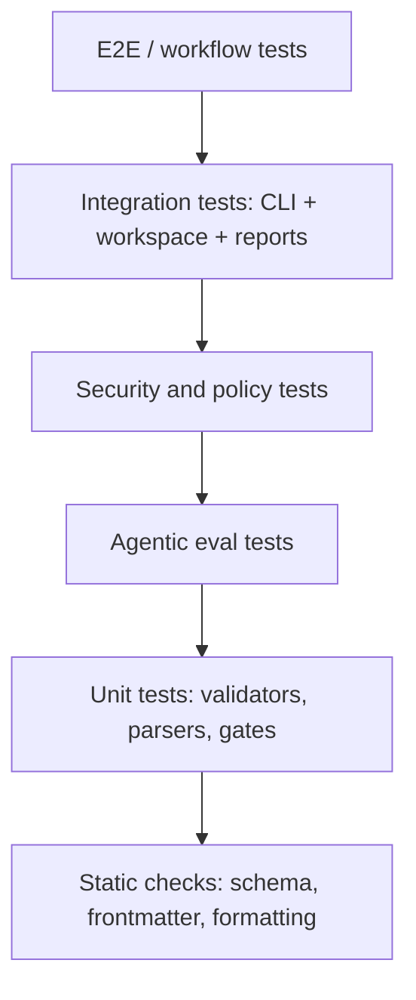

# Test Strategy — DevPilot Local

## 1. Propósito

Este documento define la estrategia de calidad, pruebas, quality gates y criterios de verificación de **DevPilot Local / Agent-assisted SDLC personal** antes de iniciar implementación funcional fuerte.

El objetivo no es solo ejecutar `pytest -q`; es establecer un modelo de calidad progresivo que permita validar:

- documentación pre-code;
- CLI local;
- workspaces;
- validadores MIPSoftware;
- activación MIASI;
- agentes documentales controlados;
- seguridad;
- privacidad;
- persistencia local;
- reportes;
- operación local;
- integración futura con Git, repos reales, patches, refactor seguro y modelos IA.

## 2. Alcance

| Área | MVP | MVP+ | Post-MVP |
|---|---:|---:|---:|
| Tests unitarios de validadores | Sí | Sí | Sí |
| Tests CLI | Sí | Sí | Sí |
| Validación frontmatter/documentos | Sí | Sí | Sí |
| Tests de reportes JSON/Markdown | Sí | Sí | Sí |
| Tests de workspace mínimo | Sí | Sí | Sí |
| Tests de seguridad documental | Sí | Sí | Sí |
| Tests de agentes documentales | Sí | Sí | Sí |
| Tests de Git Adapter | No | Sí | Sí |
| Tests de repo analysis | No | Sí | Sí |
| Tests de patch review/refactor | No | Sí | Sí |
| Tests de desktop/web | No | No | Sí |
| Tests con LLM API externa | No obligatorio | Opcional controlado | Opcional controlado |

## 3. Principios de calidad

| Principio | Regla aplicada |
|---|---|
| Calidad verificable | Todo requisito crítico debe tener prueba o gate asociado. |
| Local-first | Las pruebas deben correr sin red ni API keys reales por defecto. |
| Determinismo antes que IA | Los gates de cumplimiento deben ser determinísticos; los agentes sugieren, no aprueban. |
| Dry-run por defecto | Ninguna prueba debe modificar repos reales sin sandbox. |
| Seguridad integrada | Los controles de seguridad son parte del quality gate, no revisión tardía. |
| Trazabilidad | Todo test crítico debe mapear a requisito, caso de uso o riesgo. |
| Reproducibilidad | Los resultados deben producir reportes locales reproducibles. |
| Evolución incremental | MVP, MVP+ y post-MVP tienen niveles de prueba diferentes. |

## 4. Modelo de calidad

DevPilot usará un modelo de calidad alineado con características de calidad de producto software como adecuación funcional, confiabilidad, seguridad, mantenibilidad, portabilidad, eficiencia y usabilidad.

| Característica | Aplicación en DevPilot | Evidencia |
|---|---|---|
| Adecuación funcional | Validadores producen resultados correctos | Unit/integration tests |
| Confiabilidad | CLI maneja errores y artefactos faltantes | Tests de error y recuperación |
| Seguridad | No expone secretos ni modifica rutas no permitidas | Security tests |
| Mantenibilidad | Código modular, adapters y tests claros | Coverage + revisión |
| Portabilidad | Funciona localmente en Windows primero y luego multiplataforma | Tests de paths |
| Usabilidad | CLI comprensible; salida JSON/Markdown útil | Snapshot tests |
| Observabilidad | Reportes, logs y trazas locales | Tests de outputs |

## 5. Pirámide de testing


```mermaid
flowchart TD
  E2E[E2E / workflow tests]
  INT[Integration tests: CLI + workspace + reports]
  SEC[Security and policy tests]
  AG[Agentic eval tests]
  UNIT[Unit tests: validators, parsers, gates]
  STATIC[Static checks: schema, frontmatter, formatting]

  E2E --> INT
  INT --> SEC
  SEC --> AG
  AG --> UNIT
  UNIT --> STATIC
```

## 6. Tipos de pruebas

### 6.1 Unit tests

| Objetivo | Ejemplos |
|---|---|
| Validar funciones puras | parsing frontmatter, validación de campos, rutas permitidas |
| Detectar regresiones rápidas | validator output, gate status |
| Aislar errores | funciones sin filesystem cuando sea posible |

### 6.2 Integration tests

| Objetivo | Ejemplos |
|---|---|
| Validar comandos CLI | `readiness-check`, `miasi-required`, `validate-artifact` futuro |
| Validar interacción con docs | leer archivos reales de `docs/` |
| Validar outputs | JSON/Markdown generados en `outputs/reports/` |

### 6.3 Contract/schema tests

| Objetivo | Ejemplos |
|---|---|
| Validar estructura de reportes | `readiness_check.json` |
| Validar artifact cards futuras | Agent Card, Tool Card, Eval Card |
| Validar compatibilidad CLI | salida estable para automatización |

### 6.4 Snapshot tests

| Objetivo | Ejemplos |
|---|---|
| Evitar cambios no intencionales en reportes | Markdown report, JSON output |
| Revisar UX del CLI | mensajes de error, resumen PASS/FAIL |

### 6.5 Security tests

| Riesgo | Prueba mínima |
|---|---|
| Path traversal | rutas `../` deben bloquearse |
| Secret leakage | valores tipo token deben redactarse |
| Unsafe overwrite | escritura directa debe bloquearse por defecto |
| Tool injection | comandos no permitidos deben rechazarse |
| Workspace malicioso | metadata sospechosa debe producir warning/bloqueo |
| Cost runaway | llamadas externas requieren presupuesto y consentimiento |

### 6.6 Agentic tests

Los agentes no pueden evaluarse solo con unit tests. Se requiere evaluación específica MIASI.

| Agente | Prueba esperada |
|---|---|
| PreCodeDocumentationAgent | produce borrador estructurado, no aprueba por sí mismo |
| DocumentationAuditAgent | detecta brechas y las reporta con severidad |
| RequirementsAgent futuro | sugiere requisitos trazables |
| ArchitectureAgent futuro | propone ADRs, no las acepta automáticamente |
| CodeReviewAgent futuro | genera hallazgos, no aplica patches sin aprobación |

### 6.7 Performance tests

En MVP serán simples:

| Métrica | Umbral inicial |
|---|---:|
| `readiness-check` sobre docs pre-code | < 3 s |
| validación de 50 documentos Markdown | < 10 s |
| generación de reporte JSON/Markdown | < 5 s |

### 6.8 Persistence tests

| Persistencia | Prueba |
|---|---|
| Filesystem | outputs se generan en rutas esperadas |
| SQLite futura | migraciones, integridad y recuperación |
| JSONL | eventos append-only válidos |
| Vector store futuro | índices reproducibles y reconstruibles |

## 7. Quality gates

| Gate | Fase | Criterio PASS | Criterio BLOCK |
|---|---|---|---|
| Pre-code gate | Antes de desarrollo | docs mínimos reviewed/approved | falta producto/requisitos/arquitectura/seguridad |
| Test gate | Todo commit estable | `pytest -q` PASS | tests fallidos |
| Security gate | Antes de tools/agents | threat model y secretos controlados | acción sin policy |
| MIASI gate | Antes de agentes | Agent/Tool/Policy/Eval Cards | agente sin evaluación ni aprobación |
| Report gate | Antes de release | reportes JSON/Markdown válidos | output no reproducible |
| Git gate | MVP+ | cambios revisables y reversibles | cambios directos no trazables |
| Release gate | Futuro | pruebas, seguridad, rollback | sin rollback o fallos críticos |

## 8. Criterios PASS/FAIL/BLOCK

| Estado | Definición |
|---|---|
| PASS | La evidencia existe, es verificable y cumple umbral. |
| WARN | Hay hallazgo menor que no bloquea, pero debe registrarse. |
| FAIL | El criterio no se cumple, pero puede corregirse. |
| BLOCK | No se puede avanzar sin corrección explícita. |

## 9. Estrategia de datos de prueba

| Tipo de dato | Política |
|---|---|
| Documentos sintéticos | Permitidos y recomendados |
| Repos sandbox | Permitidos para MVP+ |
| Secretos reales | Prohibidos |
| API keys reales | Prohibidas en tests por defecto |
| Datos personales | Evitar; si aparecen, redactar |
| Repos productivos reales | Solo manual y con aprobación |

## 10. Cobertura

La cobertura no será el único criterio de calidad.

| Nivel | Umbral inicial |
|---|---:|
| MVP core validators | 80% recomendado |
| Security/policy critical code | 90% recomendado |
| CLI glue code | cobertura razonable + integration tests |
| Agentic behavior | evals + fixtures + trazas |

## 11. Trazabilidad requisito → prueba

| Requisito | Tipo de prueba | Evidencia |
|---|---|---|
| FR-MVP-001 CLI local | Integration | subprocess/CLI tests |
| FR-MVP-002 workspace mínimo | Unit + integration | workspace fixtures |
| FR-MVP-003 validación documental | Unit | artifact validator tests |
| FR-MVP-007 MIASI detection | Unit + integration | miasi-required tests |
| FR-MVP-013 agente documental | Agentic eval | dataset sintético |
| FR-MVP-014 auditoría documental | Agentic eval | findings esperados |
| FR-PLUS-002 Git Adapter | Integration sandbox | repo fixture |
| FR-PLUS-005 patch review | Security + integration | patch fixture |

## 12. Automatización esperada

Comandos futuros de calidad:

```powershell
python -m devpilot_core validate-artifact docs/00_product/product_vision.md
python -m devpilot_core validate-frontmatter docs/00_product/product_vision.md
python -m devpilot_core checklist pre-code
python -m devpilot_core readiness-check --strict
python -m devpilot_core test-report
python -m devpilot_core security-check
python -m devpilot_core miasi-eval
```

## 13. Riesgos de calidad

| Riesgo | Impacto | Mitigación |
|---|---|---|
| Validadores demasiado superficiales | Falso PASS | tests negativos y schemas |
| Agentes inventan contenido | Documentación débil | separación agente/gate |
| Tests dependen de APIs | fragilidad/costo | mocks y modelos locales |
| Reportes no reproducibles | mala trazabilidad | snapshot tests |
| Security tests tardíos | riesgos operativos | security gate desde MVP |
| UI futura duplica lógica | deuda técnica | core común |

## 14. Criterios de aprobación de este documento

| Criterio | Estado |
|---|---|
| Define tipos de pruebas | PASS |
| Define quality gates | PASS |
| Incluye MIASI | PASS |
| Incluye seguridad | PASS |
| Incluye persistencia | PASS |
| Incluye operación local | PASS |
| Define trazabilidad requisito-prueba | PASS |

## 15. Changelog

| Versión | Cambio |
|---|---|
| 0.1.0 | Borrador bootstrap inicial. |
| 0.5.0 | Estrategia completa de pruebas para SPRINT-PRECODE-05. |

## 16. Actualización FUNC-SPRINT-13 — Evaluation Harness

Sprint 13 materializa la primera capa de evaluación automática específica para validadores y agentes documentales mediante `EvalRunner`.

### Propósito

Complementar `pytest` con una suite de casos funcionales sintéticos que miden comportamiento esperado de componentes DevPilot, especialmente falsos positivos y falsos negativos.

### Comandos

```powershell
python -m devpilot_core eval run --json
python -m devpilot_core eval run --json --write-report
python -m devpilot_core eval run --case-id frontmatter-missing-doc-id --json
```

### Métricas iniciales

| Métrica | Interpretación |
|---|---|
| `pass_rate` | proporción de casos que coinciden con la expectativa |
| `false_positives` | casos limpios marcados como defectuosos |
| `false_negatives` | casos defectuosos que pasaron como limpios |
| `missing_expected_findings` | hallazgos esperados no emitidos |

### Riesgo residual

La suite es sintética y preliminar. Debe evolucionar hacia fixtures más amplios, golden outputs, red teaming y evaluación continua.


## 17. Actualización FUNC-SPRINT-14 — Pruebas de Git read-only y repo inventory

Sprint 14 agrega pruebas específicas para repositorios temporales y análisis local de inventario.

### Pruebas agregadas

- `GitAdapter` reporta status/diff stats en repo temporal.
- `GitAdapter` no modifica el resultado de `git status --short` antes/después de ejecutarse.
- `GitAdapter` maneja workspaces no Git sin excepción no controlada.
- `RepoInventory` detecta contenido sintético tipo secreto sin emitir el valor crudo.
- CLI `git-status` y `repo-inventory` producen JSON parseable y reportes opcionales.

### Riesgo residual

Las pruebas no cubren todavía submódulos, repos grandes, LFS, ramas remotas, permisos complejos ni secret scanning por entropía. Es una base de quality gate para el Sprint 15.


## FUNC-SPRINT-15 — Pruebas de patch-review y code-review

Se agregan pruebas automatizadas para asegurar que las nuevas capacidades operen en modo dry-run y sin regresión:

- patch seguro se analiza sin modificar el archivo destino;
- patch con secreto sintético se bloquea sin emitir el valor;
- patch contra ruta denegada se bloquea;
- CLI `patch-review --json --write-report` produce JSON parseable y evidencia;
- code review limpio pasa;
- code review con `shell=True` y secreto sintético produce hallazgos;
- CLI `code-review --json --write-report` produce JSON parseable y evidencia.

Criterio de éxito: `pytest -q` debe pasar completo y los comandos nuevos deben mantenerse sin dependencias externas ni mutación del workspace.


## FUNC-SPRINT-16 — Pruebas del Safe Refactor Planner

### Propósito

Garantizar que `RefactorPlanner` genere planes reproducibles sin modificar archivos.

### Pruebas implementadas

```text
test_refactor_planner_generates_plan_without_modifying_files
test_refactor_planner_blocks_secret_like_goal_without_emitting_secret
test_refactor_planner_blocks_target_outside_workspace
test_refactor_planner_conservative_plan_for_clean_small_file
test_refactor_plan_cli_json_and_report_are_parseable
test_refactor_planner_reports_python_syntax_error
```

### Criterios PASS

La suite debe confirmar que el planner es `plan-only`, no modifica archivos, bloquea secretos sintéticos, bloquea rutas fuera del workspace, genera reportes opcionales y produce JSON parseable.

### Criterios BLOCK

Cualquier modificación de archivos, fuga de secretos, path traversal, JSON inválido o plan sin pruebas/rollback bloquea el sprint.

### Riesgos

Cobertura inicial. Faltan pruebas con proyectos grandes, refactors multiarchivo, integración con linters/type-checkers y sandbox de aplicación futura.

## FUNC-SPRINT-17 — Pruebas de ModelAdapter híbrido

Sprint 17 incorpora pruebas offline para la capa `ModelAdapter`.

Pruebas agregadas:

```text
tests/test_model_adapter.py
```

Cobertura principal:

- carga segura de `.devpilot/providers.yaml.example` sin secretos crudos;
- generación determinística con `MockModelAdapter`;
- clasificación determinística por labels;
- embeddings determinísticos de 8 dimensiones;
- bloqueo de prompts con secretos sintéticos;
- bloqueo de API externa por CostGuard;
- CLI `model providers/generate/classify/embed` parseable;
- reportes opcionales bajo `outputs/reports`.

Criterios PASS: `pytest -q` en PASS, sin red, sin API keys y sin costo externo.

Criterios BLOCK: secreto crudo en evidencia, llamada real a proveedor local/API, proveedor externo permitido sin CostGuard, o resultado no determinístico en mock.

## FUNC-SPRINT-18 — Pruebas de Application Services para Desktop/Web futuro

Sprint 18 incorpora pruebas de servicios internos y DTOs serializables para preparar futuras interfaces sin implementar UI.

Pruebas agregadas:

```text
tests/test_application_services.py
```

Cobertura inicial:

```text
ApplicationService valida frontmatter sin CLI.
ApplicationService valida artefactos sin CLI.
ApplicationService puede rechazar paths fuera del workspace cuando se activa enforce_workspace_paths.
ApplicationRequest y ApplicationResponse son JSON serializables.
app contract emite JSON parseable y reportes opcionales.
```

Criterios PASS:

```text
pytest -q PASS.
No se agregan dependencias UI.
No se inicia servidor ni proceso externo.
No se altera CommandResult.
```

Criterios BLOCK:

```text
DTO con secretos.
Doble implementación de lógica de validadores.
Framework desktop/web sin ADR.
```

## Actualización FUNC-SPRINT-37 — Pruebas de RepoAnalyzer v2

`FUNC-SPRINT-37` agrega pruebas específicas para `RepoAnalyzer v2`, manteniendo la estrategia local-first y read-only de Fase C.

Cobertura mínima agregada:

- repo fixture con `src/`, `tests/` y `docs/` para verificar resumen de secciones;
- integración con `DependencyGraph` para validar nodos y métricas básicas;
- repositorio sin Git para confirmar análisis parcial controlado;
- secreto sintético para confirmar que no se emiten valores crudos;
- bloqueo de target fuera del workspace;
- CLI `repo analyze --json --write-report` con evidencia JSON/Markdown.

Criterio de calidad: el `health_score` se trata como señal heurística de revisión, no como certificación de calidad industrial. Las pruebas deben validar ausencia de mutaciones, ausencia de red/APIs/modelos y no filtración de secretos crudos.


## Actualización FUNC-SPRINT-38 — Pruebas de Architecture/code drift

`FUNC-SPRINT-38` agrega pruebas específicas para `ArchitectureDriftDetector`, manteniendo la estrategia local-first y read-only de Fase C.

Cobertura mínima agregada:

- fixture con componente documentado y módulo existente para validar `in_sync`;
- fixture con componente implementado documentado sin código para validar `code_missing`;
- fixture con módulo real no documentado para validar `doc_missing`;
- fixture con componente `future` sin código para confirmar que no se emite `BLOCK`;
- CLI `repo architecture-drift --json --write-report` con evidencia JSON/Markdown.

Criterio de calidad: el detector es heurístico y debe validar ausencia de mutaciones, ausencia de red/APIs/modelos, separación clara de drift types y presencia de confidence/rationale por fila.


## Actualización FUNC-SPRINT-39 — Pruebas de Repo Quality Gate dry-run

Sprint 39 agrega pruebas específicas para `ReviewRulePack` y `repo quality-gate`. La cobertura verifica serialización de rule packs, gate `PASS` con warnings asesoría, propagación `BLOCK` con secreto sintético, generación de reportes con `--write-report` y sincronización MIASI/documental. La capacidad es `implemented-initial` y no reemplaza SAST/SCA, coverage real ni revisión humana.

## Actualización FUNC-SPRINT-40 — Pruebas de Patch preflight seguro

Sprint 40 agrega pruebas específicas para `PatchPreflightEngine` y `patch check`. La cobertura verifica patch aplicable PASS, patch no aplicable FAIL sin modificar archivos, patch con secreto sintético BLOCK sin emitir valor crudo, bloqueo de patch file fuera del workspace y CLI `patch check --json --write-report` con evidencia JSON/Markdown.

Criterio de calidad: el preflight debe usar `SafeSubprocessRunner`, allowlist explícita para `git apply --check`, `PathGuard`/`PolicyEngine` y revisión previa de patch. La prueba de no mutación del working tree es obligatoria porque esta capacidad no es sandbox ni patch apply.


## Actualización FUNC-SPRINT-41 — Pruebas de PatchSandbox y ChangeSet

`FUNC-SPRINT-41` agrega pruebas específicas para validar sandbox y ChangeSet sin modificar el workspace productivo. La suite cubre:

- aplicación de `safe.patch` únicamente dentro de `outputs/sandbox`;
- generación de `ChangeSet` serializable con hashes y sin contenido crudo;
- limpieza explícita del sandbox runtime mediante `--cleanup`;
- bloqueo de `--run-tests` sin aprobación `tests.run`;
- CLI `patch sandbox --json --write-report`.

Comandos de verificación:

```powershell
$env:PYTHONPATH="src"
python -m pytest tests/test_patch_sandbox.py tests/test_sprint_41_documentation.py -q
python -m pytest -q
```

Criterio PASS: la prueba confirma que el archivo productivo referenciado por el patch conserva su contenido original y que los cambios existen solo en la copia del sandbox.

Criterio BLOCK: cualquier mutación productiva, falta de `ChangeSet`, emisión de contenido crudo, ejecución de pruebas sin aprobación o ausencia de exclusión `outputs/sandbox/`.


## Actualización FUNC-SPRINT-42 — Pruebas de RollbackManager y backup local

Las pruebas de `FUNC-SPRINT-42` cubren creación de rollback plan desde `ChangeSet`, generación de backup local controlado, comandos read-only `rollback list/show`, bloqueo de `rollback execute` sin aprobación y exclusión de `.devpilot/rollback/` como runtime no versionable.

Criterios mínimos: `tests/test_rollback_manager.py`, `tests/test_sprint_42_documentation.py`, `miasi validate`, validación de manifest y regresión completa con `pytest -q`.


## Actualización FUNC-SPRINT-43 — Pruebas de RefactorExecutor sandbox

Las pruebas de `FUNC-SPRINT-43` cubren bloqueo sin approval, validación de `plan_id`, ejecución de transformación mecánica solo en sandbox, workspace productivo intacto, generación de `ChangeSet`, creación de rollback plan, cleanup del sandbox, bloqueo de pruebas sin approval `tests.run` y ejecución aprobada del perfil smoke en sandbox.

La estrategia mantiene el alcance `implemented-initial`: se prueban transformaciones determinísticas de texto Python, no refactors semánticos ni restauración productiva.


## Actualización FUNC-SPRINT-44 — Pruebas de Repository Engineering Gate

Sprint 44 agrega pruebas específicas para `RepoEngineeringGate` y sincronización documental de cierre Fase C. La estrategia valida perfiles `quick` y `full`, CLI `repo engineering-gate`, emisión de reportes, MIASI, manifests y bloqueo por hallazgos severos.

Comandos mínimos:

```powershell
python -m pytest tests/test_repo_engineering_gate.py tests/test_sprint_44_documentation.py -q
python -m devpilot_core repo engineering-gate --profile full --json --write-report
python -m devpilot_core validate all --json
python -m devpilot_core miasi validate --json
```


## Actualización FUNC-SPRINT-45 — Pruebas de provider config local-first

`FUNC-SPRINT-45` agrega pruebas de contrato para proveedores locales gobernados. La suite cubre:

- validez de `.devpilot/providers.yaml.example` contra `provider_config.schema.json`;
- bloqueo de API keys crudas;
- bloqueo de endpoints locales no-localhost;
- bloqueo de API externa habilitada por defecto;
- `ProviderRegistry` con `semantic_valid`;
- `mock` generate/classify/embed sin red ni API externa;
- comando genérico `schema validate` sobre YAML controlado de providers.

Estas pruebas no requieren Ollama, LM Studio ni APIs externas.


## Actualización FUNC-SPRINT-46 — Pruebas de OllamaAdapter opcional

La estrategia de pruebas de `FUNC-SPRINT-46` mantiene la suite hermética: no requiere Ollama real, no usa red externa y valida el adapter con un fake server local.

Comandos mínimos:

```powershell
python -m pytest tests/test_ollama_adapter.py tests/test_sprint_46_documentation.py -q
python -m devpilot_core model health --provider ollama --json
python -m devpilot_core model generate --provider mock --prompt "test" --json
python -m devpilot_core validate all --json
python -m devpilot_core miasi validate --json
```

Criterios: unavailable controlado, provider disabled bloquea model calls, fake generate/classify/embed PASS, secretos bloqueados antes de contactar el provider y regresión general sin modelos locales reales.


## Actualización FUNC-SPRINT-47 — Pruebas de LMStudioAdapter local OpenAI-compatible

La estrategia de pruebas de `FUNC-SPRINT-47` mantiene la suite hermética: no requiere LM Studio real, no usa red externa y valida el adapter con un fake server local que emula `/v1/models`, `/v1/chat/completions` y `/v1/embeddings`.

Cobertura mínima: health unavailable controlado, fake completion PASS, fake embeddings PASS, provider disabled blocked, endpoint remoto blocked y SecretGuard antes de cualquier request local. Estas pruebas no habilitan OpenAI, no usan API keys y preservan `mock` como proveedor default para regresión.


## Actualización FUNC-SPRINT-48 — Pruebas de Model Governance

La estrategia de pruebas de `FUNC-SPRINT-48` valida gobierno operativo de modelos sin depender de Ollama, LM Studio ni APIs externas reales. La cobertura mínima incluye `ModelHealthService`, `CapabilityMatrix`, `BudgetLedger`, CLI `model health`, `model capabilities`, `model budget status`, fallback configurado a `mock` y verificación de que `cost_events` no almacena prompts, completions ni secretos crudos.

Comandos mínimos:

```powershell
python -m pytest tests/test_model_governance.py tests/test_sprint_48_documentation.py -q
python -m devpilot_core model health --json
python -m devpilot_core model capabilities --json
python -m devpilot_core model budget status --json
python -m devpilot_core validate all --json
python -m devpilot_core miasi validate --json
```

Criterios: health/capabilities reportan estados mock/local/external, budget ledger inicial cero o con eventos redacted, fallback a mock explícito, ningún provider externo habilitado y regresión general sin modelos locales reales.


## Actualización FUNC-SPRINT-49 — Pruebas de Prompt Registry y contratos de prompt seguro

La estrategia de pruebas de `FUNC-SPRINT-49` valida prompts como contratos versionados y reproducibles. La cobertura mínima incluye `PromptRegistry`, `PromptSafetyChecker`, `docs/schemas/prompt.schema.json`, CLI `prompt list`, `prompt validate`, `prompt show`, renderizado controlado desde `model generate --prompt-id` y verificación de que el `BudgetLedger` registra `prompt_id/version` sin almacenar prompts, completions ni secretos crudos.

Comandos mínimos:

```powershell
python -m pytest tests/test_prompt_registry.py tests/test_sprint_49_documentation.py -q
python -m devpilot_core prompt list --json
python -m devpilot_core prompt validate --json
python -m devpilot_core prompt show model.generate.default --json
python -m devpilot_core validate all --json
python -m devpilot_core miasi validate --json
```

Criterios: prompts válidos pasan schema/semántica, prompt sin `id/version` falla, SecretGuard/PromptInjectionGuard producen findings básicos, `prompt show` usa payload redacted, model calls registran referencia de prompt y no se requiere red, Ollama, LM Studio ni API externa.


## Actualización FUNC-SPRINT-50 — Pruebas de Model evaluation matrix local

La estrategia de pruebas de `FUNC-SPRINT-50` valida una matriz local de evaluación de modelos basada en fixtures determinísticos. La cobertura mínima incluye `ModelEvalRunner`, `evals/model_fixtures/model_eval_cases.json`, CLI `model eval run`, integración con `PromptRegistry`, `ModelAdapterRouter`, `BudgetLedger` y comportamiento skipped/controlado para providers locales deshabilitados o no disponibles.

Comandos mínimos:

```powershell
python -m pytest tests/test_model_eval_runner.py tests/test_sprint_50_documentation.py -q
python -m devpilot_core model eval run --provider mock --json
python -m devpilot_core model eval run --provider mock --json --write-report
python -m devpilot_core model eval run --provider lmstudio --json
```

Criterios de calidad: `mock` debe pasar la suite base sin modelos reales, los providers locales no disponibles no deben romper la baseline, y los reportes no deben contener prompts/completions/secretos crudos.


## Actualización FUNC-SPRINT-51 — Pruebas de AgentRuntime v2 model-aware

Sprint 51 agrega pruebas para validar que `AgentRuntime` conserva compatibilidad sin modelos y activa llamadas model-aware solo por configuración explícita. La suite cubre:

- agentes existentes sin provider: `model_calls_total=0`;
- `--provider mock` con `model_calls` redacted y trazables;
- bloqueo de secretos en inputs de prompt antes de provider execution;
- fallback controlado a `mock` para provider local habilitado pero no disponible;
- `eval run --json` con caso model-aware hermético.

Comandos:

```powershell
python -m pytest tests/test_agent_runtime.py tests/test_agent_runtime_v2.py tests/test_sprint_51_documentation.py -q
python -m devpilot_core agent run documentation-audit --target docs/01_requirements --provider mock --json
python -m devpilot_core eval run --json
```

La evaluación sigue siendo preliminar: no sustituye red teaming agentic ni evaluación semántica avanzada, pero bloquea regresiones de seguridad y acoplamiento directo a proveedores.


## Actualización FUNC-SPRINT-52 — Pruebas de RepoAnalysisAgent gobernado

Sprint 52 agrega pruebas para validar que `RepoAnalysisAgent` ejecuta análisis de repositorio en modo monoagente, read-only y gobernado por MIASI. La cobertura mínima incluye ejecución sin modelo, ejecución model-aware con `mock`, bloqueo de target fuera del workspace, CLI `agent run repo-analysis`, casos en `EvalRunner`, prompt `repo.analysis.agent` y sincronización documental.

Comandos:

```powershell
python -m pytest tests/test_repo_analysis_agent.py tests/test_sprint_52_documentation.py -q
python -m devpilot_core agent run repo-analysis --target . --provider mock --json
python -m devpilot_core eval run --json
python -m devpilot_core validate all --json
python -m devpilot_core miasi validate --json
```

La evaluación sigue siendo preliminar: valida arquitectura, trazabilidad y seguridad local-first; no sustituye análisis semántico avanzado ni juicio experto sobre deuda técnica.

## Actualización FUNC-SPRINT-53 — Pruebas de CodeReviewAgent y PatchReviewAgent gobernados

Sprint 53 agrega cobertura específica para agentes de revisión monoagente:

```powershell
python -m pytest tests/test_review_agents.py tests/test_sprint_53_documentation.py -q
python -m devpilot_core eval run --json
```

Cobertura mínima:

- `CodeReviewAgent` con código limpio y `provider=mock`.
- `CodeReviewAgent` detectando `eval()` y `os.system()`.
- `PatchReviewAgent` con patch seguro y preflight dry-run.
- `PatchReviewAgent` bloqueando patch con contenido secreto.
- Casos offline en `evals/fixtures/documentation_eval_cases.json`.

Criterio de salida: todos los casos deben pasar sin modelos locales reales, sin APIs externas, sin escritura de código y sin aplicación de patches.


## Actualización FUNC-SPRINT-54 — Pruebas de SafeRefactorAgent y TestPlannerAgent gobernados

Sprint 54 agrega pruebas específicas para agentes plan-only: `tests/test_refactor_testplanner_agents.py` valida planificación de refactor con `mock`, bloqueo de ejecución no dry-run, planificación trazable de pruebas y CLI/evals parseables.

Criterios específicos:

- `SafeRefactorAgent` debe producir plan, verification y rollback sin invocar `RefactorExecutor`.
- `TestPlannerAgent` debe producir plan trazable sin ejecutar `tests.run`.
- Los evals offline deben cubrir refactor plan-only, test-planner model-aware y test-planner dry-run.
- `prompt validate`, `miasi validate`, `eval run` y tests documentales deben permanecer en PASS.

Esta cobertura es `implemented-initial`: valida contratos, seguridad y trazabilidad básica; no sustituye pruebas industriales de refactor semántico ni ejecución real de pipelines.


## Actualización FUNC-SPRINT-55 — Pruebas de agentes SDLC y cierre Fase D

Sprint 55 agrega pruebas específicas para `RequirementsAgent`, `ArchitectureAgent` y `SecurityAgent`, además de evals offline para sus rutas model-aware con `mock`. La estrategia valida cuatro propiedades: ejecución monoagente, uso de motores determinísticos (`TraceabilityEngine`, `ArchitectureDriftDetector`, `SecretGuard`, `PolicySimulationSuite`), redacción de contenido sensible y cierre documental de Fase D.

Comandos mínimos:

```powershell
python -m pytest tests/test_sdlc_agents.py tests/test_sprint_55_documentation.py -q
python -m pytest tests/test_agent_runtime.py tests/test_agent_runtime_v2.py tests/test_eval_runner.py tests/test_sdlc_agents.py -q
python -m devpilot_core eval run --json
python -m devpilot_core prompt validate --json
python -m devpilot_core miasi validate --json
```

Criterio PASS: no hay mutaciones, no hay APIs externas, no se exponen secretos crudos y los evals pasan con `mock`.

## POST-H-029-A — Taxonomía de perfiles de prueba

La estrategia de pruebas incorpora una primera taxonomía operacional para separar pruebas rápidas, P0, seguridad, impacto, release, release-candidate-local, documentación histórica, full regression, manual y nightly-local.

La taxonomía no ejecuta pruebas. Sirve como contrato validable para que el operador reduzca costo de regresión con trazabilidad, preservando `pytest -q` completo para cierres, release candidate, cambios P0 no mapeados o drift transversal.

Perfiles mínimos versionados: `always-fast`, `p0-critical`, `security`, `impact`, `release`, `release-candidate-local`, `docs-historical`, `full`, `manual`, `nightly-local`. Los perfiles legacy `smoke`, `unit` y `all` se conservan como alias controlados.


## POST-H-029-B — Reglas declarativas de impacto TCR v2

`TestImpactRuleRegistry` introduce una capa declarativa para mapear cambios a dominios, perfiles, pruebas recomendadas y escalamiento. La finalidad es reducir costo de regresión sin crear falsa confianza.

Principios:

- un path P0/P1 no mapeado no reduce verificación; escala a revisión o regresión completa;
- comandos recomendados son datos allowlisted, no ejecución automática;
- la taxonomía POST-H-029-A sigue siendo la fuente de perfiles operacionales;
- `TestImpactAnalyzerV2` puede usar el registry de reglas y conserva heurísticas fallback hasta POST-H-029-C/D/E.

## POST-H-029-C — Recomendaciones CLI normalizadas de impacto

`test-impact analyze-v2` ahora emite un `TestImpactRecommendationReport` cuando se usa `--write-report`. El reporte consolida contratos y reglas matcheadas, perfiles recomendados, comandos permitidos, pruebas sugeridas, riesgo residual, necesidad de regresión completa y señal de waiver si el operador pretende omitir esa regresión.

La recomendación no ejecuta pruebas y no sustituye el criterio de cierre. Para cambios P0, paths sensibles o cierres de backlog/release candidate, el resultado puede requerir `full` antes del cierre.


## POST-H-029-D — Release candidate test profile

Estado: `implemented-initial/local-first`. DevPilot ahora expone `python -m devpilot_core tests release-candidate-profile --json --write-report` para validar el perfil formal `release-candidate-local` sin ejecutar pruebas desde JSON. El perfil vive en `.devpilot/testing/release_candidate_test_profile.json`, valida `ReleaseCandidateTestProfileReport`, mantiene `tests.run` approval-gated y enumera comandos required/recommended/optional para RC local, UI/API hardening, production-ready-local, TCR, schemas, docs governance y packaging.

Limitación explícita: este perfil reduce el costo operativo de selección, pero no reemplaza `pytest -q` completo cuando `full_regression_required_when` aplica. POST-H-029-E debe convertir esta política en guard histórico de cierre.

## POST-H-029-E — HistoricalRegressionGuardReport

`HistoricalRegressionGuardReport` formaliza la decisión de regresión para cierres. El guard distingue `micro-sprint`, `backlog-closure`, `release-candidate` y `major-hito`; bloquea cierres sin decisión explícita; conserva full regression como obligación contextual; y permite waivers solo si declaran owner, motivo, riesgo, pruebas ejecutadas y expiración. La primera versión es local-first y no ejecuta tests.


## POST-H-030-A — CLI command ownership matrix

POST-H-030 queda aprobado e inicia con `POST-H-030-A — CLI command ownership matrix`. Se agregan los contratos `CliCommandOwnershipMatrix` y `CliExtractionPlan`, la matriz `.devpilot/cli_registry/command_ownership_matrix.json`, el plan `.devpilot/cli_registry/cli_extraction_plan.json` y el módulo `src/devpilot_core/cli_registry/ownership.py`.

La capacidad es `implemented-initial/local-first`: cubre la superficie CLI registrada, asigna owner/dominio/target module/contrato de compatibilidad por comando y planifica extracciones por familias sin migrar handlers todavía. No cambia nombres de comandos, argumentos, JSON output, exit codes ni comportamiento operativo. No introduce router dinámico, red, APIs externas, remote execution, connector write ni plugin execution.

Siguiente micro-sprint: `POST-H-030-D — Workspace/onboarding command extraction`.


## POST-H-030-B — Industrial readiness command extraction

POST-H-030-B agrega pruebas focales de compatibilidad para la extracción de la familia `industrial-readiness`. La estrategia valida equivalencia entre handlers extraídos y CLI pública para JSON envelope, `decision`, claims production-ready-local, no-go gates, safety flags y metadata de registry.

Pruebas focales principales:

```powershell
python -m pytest -p no:ddtrace --assert=plain `
  tests/test_post_h_030_industrial_readiness_command_extraction.py `
  tests/test_industrial_readiness.py `
  tests/test_post_h_025_production_ready_declaration_gate.py `
  tests/test_post_h_025_production_ready_final_declaration.py `
  tests/test_application_cli_boundary_integration.py `
  tests/test_cli_core.py `
  -q
```

`pytest -q` completo queda reservado para cierre de backlog por costo operativo.


## POST-H-030-C — Release command extraction

POST-H-030-C agrega pruebas focales para la extracción de la familia release hacia `src/devpilot_core/cli_commands/release.py`. La estrategia verifica metadata de registry, matriz de ownership, plan de extracción, equivalencia JSON en comandos representativos, safety flags local-first y sincronización TCR/source_registry/project_state.

No reemplaza la futura suite de contratos snapshot de POST-H-030-E.


## POST-H-030-D — Workspace/onboarding command extraction

POST-H-030-D agrega pruebas focales para la extracción workspace/onboarding hacia `src/devpilot_core/cli_commands/workspace.py` y `src/devpilot_core/cli_commands/workspace_onboarding.py`. La estrategia verifica metadata de registry, matriz de ownership, plan de extracción, equivalencia JSON en comandos representativos, dry-run/pending classification, safety flags local-first y sincronización TCR/source_registry/project_state.

Prueba principal:

```powershell
python -m pytest -p no:ddtrace --assert=plain tests/test_post_h_030_workspace_onboarding_command_extraction.py -q
```

Regresión focal recomendada: incluir `tests/test_post_h_024_project_bootstrap.py`, `tests/test_post_h_024_onboarding_readiness_preview.py`, `tests/test_post_h_024_onboarding_quality_gate.py`, `tests/test_post_h_016_workspace_registry_v2.py` y los tests POST-H-030-A/B/C. No se requiere `pytest -q` completo para este micro-sprint; se preserva para cierre mayor del backlog o release candidate.

## 19. DEVPL-GSDLC — estrategia successor por capas

00-D formaliza una estrategia de pruebas para un producto guiado y no para una colección de comandos. La regla central es:

> la misma ola que introduce una capability introduce sus contratos, negative tests, observabilidad y evidence expectations.

| Layer | Tipo | Qué valida | Condición | Owner temporal |
|---|---|---|---|---|
| L1 | Deterministic unit | State transitions, workflow predicates, validators, policies, budget arithmetic | mock/local; no network | GSDLC-01+ |
| L2 | Schema/contract | Registries, typed operations, evidence schemas, frontmatter and machine-readable workflow definitions | deterministic | same wave as contract |
| L3 | ApplicationService integration | UI/API request → ApplicationService → domain service; no bypass | local | GSDLC-01+ |
| L4 | Security negative | Auth/RBAC/approval/path/import/injection/no-go bypass cases | fail-closed | same wave that introduces capability |
| L5 | Browser acceptance | Normal journey vertical slice, accessibility and operational state | real browser/Windows when required | each UI milestone |
| L6 | Restart/resume/reconciliation | App restart, Git branch change, external IDE edit, stale state/approval | local reproducible fixtures | GSDLC-01/GSDLC-11 |
| L7 | Model/provider | Adapter capability, structured output/tool call, local/API fallback | separate from deterministic gates | GSDLC-06/R01 |
| L8 | Cost/token | Budgets per request/artifact/story/sprint/project; retry/loop limits | mock billing + controlled providers | GSDLC-06 |
| L9 | Evidence integrity | Hash/provenance/freshness/tamper/correlation completeness | local | every mutating vertical |
| L10 | Pilot acceptance | inventory-sales-local genuine UI-first execution | independent evidence | GSDLC-13 |
| L11 | Industrial regression | Cross-domain regression, Windows/browser matrix, recovery and hardening | escalation + final hardening | GSDLC-12 and release gates |

### 19.1 Regla de determinismo

Los modelos y agentes pueden ser objeto de pruebas, pero **ningún benchmark/model-provider test sustituye**:

- state-machine tests;
- policy/RBAC tests;
- schema/contract tests;
- approval binding;
- deterministic quality/readiness gates.

### 19.2 Política Test Impact → focal → escalation

Para cada micro-sprint:

1. registrar manifest exacto de paths;
2. ejecutar Test Impact v2;
3. ejecutar primero el focal de contratos modificados;
4. ejecutar security negatives correspondientes;
5. ejecutar validators globales afectados;
6. escalar a full regression solo si el impacto real cruza boundaries/runtime o un gate focal detecta incertidumbre no acotada.

En `GSDLC-00 A→D`, cambios documentation/contracts-only no disparan full regression por rutina. `GSDLC-00-E` decide una única regresión de cierre si el delta acumulado lo exige. El hardening final del programa conserva una full regression/matrix obligatoria según roadmap.

### 19.3 Browser acceptance

Browser acceptance se exige **solo** en la ola que introduce o cierra una UX. Un sprint documental como 00-D no fabrica screenshots.

Cuando aplica, la evidencia debe ser real:

```text
route/state
actor/role
operation or next_action
expected result
observed result
screenshot/trace correlation
PASS/BLOCK
```

### 19.4 Restart/resume/reconciliation

Debe cubrir, como mínimo:

- restart con workflow en curso;
- branch checkout;
- external edit;
- Git revert;
- approval invalidado;
- missing runtime job;
- stale artifact hash;
- disagreement between source state / engineering state / runtime state.

### 19.5 Provider y costo

Provider tests se separan de gates determinísticos. Deben cubrir:

- mock mandatory route;
- local provider route;
- external provider route solo con autorización;
- unavailable provider;
- budget exceeded;
- token estimate drift;
- secret blocked before egress;
- fallback policy.

### 19.6 Evidence integrity

Toda transición crítica debe poder reconstruirse mediante:

```text
request/operation
→ policy decision
→ approval (if required)
→ job/execution
→ result
→ test/quality
→ trace/evidence
→ Git/release identity when applicable
```

### 19.7 Criterio de regresión

`pytest -q` completo no es un ritual por sprint. Es un gate de escalamiento/hardening. La ausencia de full regression debe quedar justificada por Test Impact y por focales que cubran las superficies mutadas.
