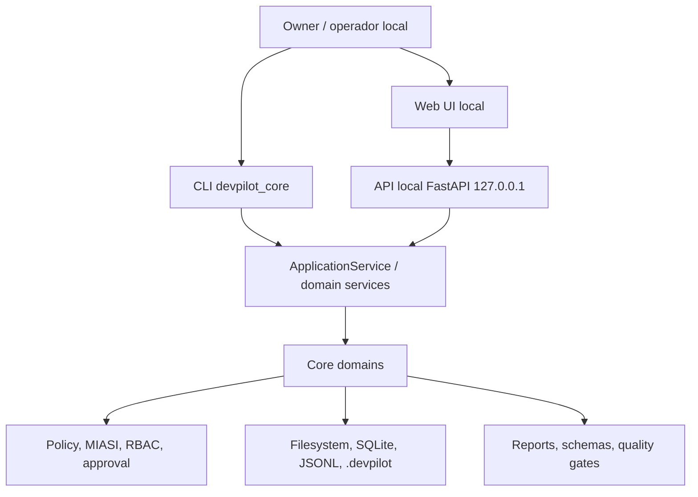
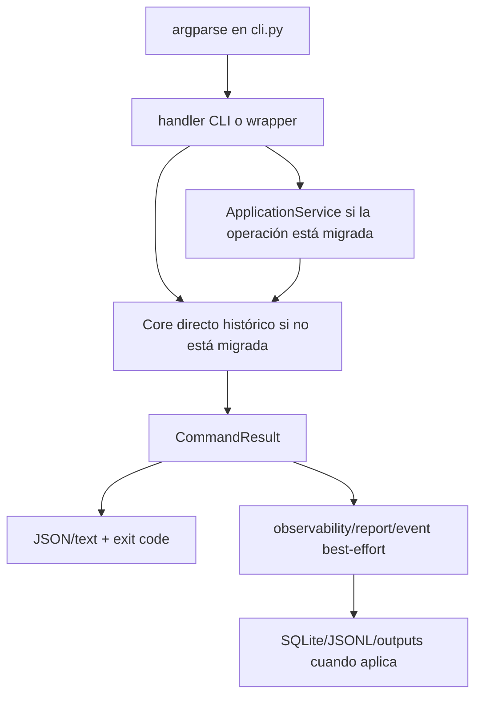
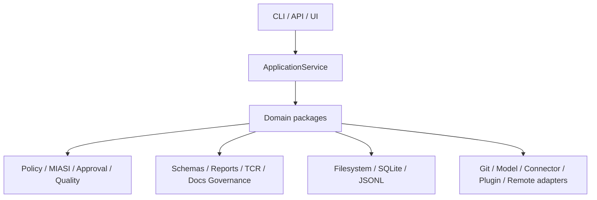
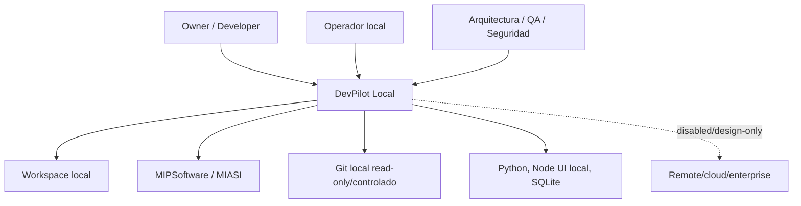
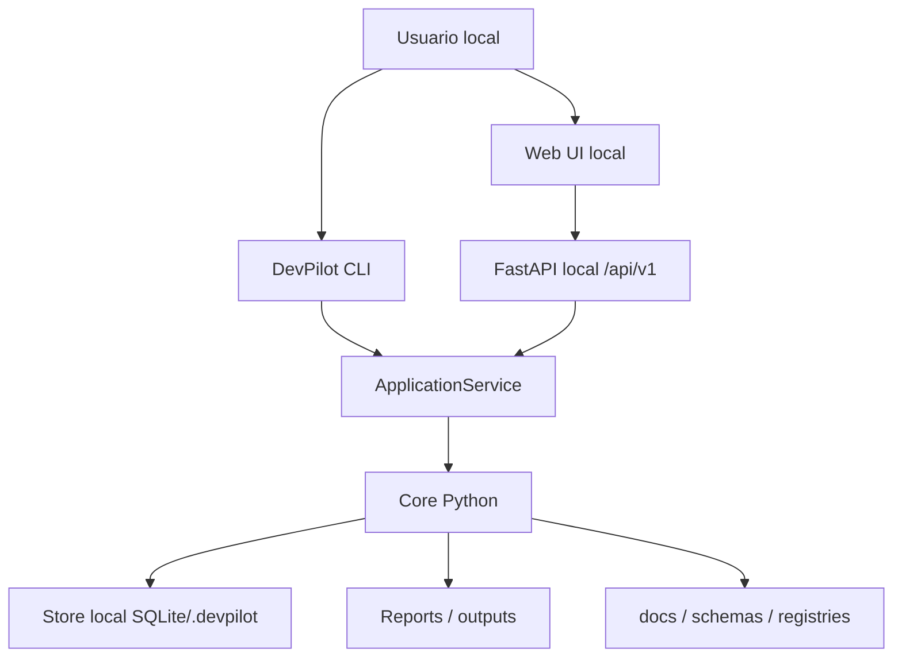
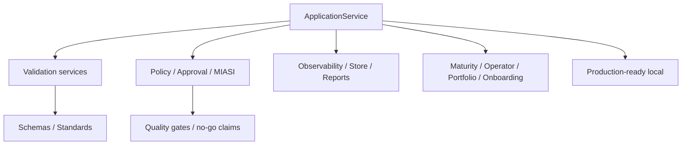
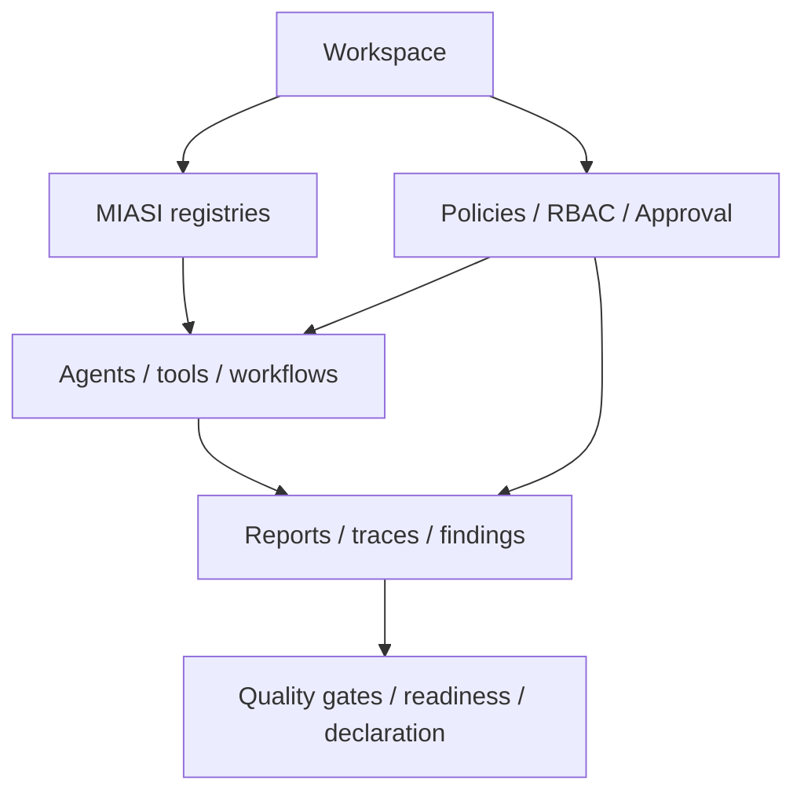

# DevPilot Local - Onboarding Report final compilado

## Control de compilacion

Este informe fue compilado desde los 18 archivos Markdown incluidos en `Onbording_report_por_boque_de_preguntas.zip` y siguiendo la recomendacion final del punto 23 de `onboarding_report_questionnaire_devpilot.md`.

### Fuentes usadas

| Fuente | Ruta local | SHA-256 |
|---|---|---|
| Cuestionario industrial | `/workspace/.cache/01-onboarding_report_questionnaire_devpilot.md` | `7667cf8e492c4ed2829d19e5c71ec3a1e2521bb305e7095b34bd9f24afdef134` |
| ZIP de respuestas por bloque | `/workspace/.cache/02-Onbording_report_por_boque_de_preguntas.zip` | `c1a162a990296661dcea1bb5f2729c8beff5fe630e4f05c552533252a222ada0` |

### Cobertura validada

| Control | Resultado |
|---|---|
| Archivos Markdown fuente | 18 |
| Preguntas esperadas | 1-260 |
| Preguntas cubiertas | 260 |
| Preguntas faltantes | ninguna |
| Preguntas duplicadas | ninguna |
| Huecos internos por bloque | ninguno |

### Recomendacion final aplicada

```text
1. Resumen ejecutivo.
2. Identidad y vision de producto.
3. Estado actual y declaracion production-ready-local.
4. Arquitectura real.
5. Arquitectura objetivo.
6. Modelo de dominio.
7. Runtime y flujos de ejecucion.
8. Workspace y onboarding.
9. Capacidades funcionales.
10. MIASI, agentes y politicas.
11. Seguridad y no-go gates.
12. Schemas, validators y evidence model.
13. Quality gates y testing.
14. UI/API local.
15. Observabilidad y operacion.
16. Release y reproducibilidad.
17. Gap analysis.
18. Roadmap recomendado.
19. Guia de operador.
20. Caso piloto.
21. Riesgos residuales.
22. Anexos de evidencia.
```

### Regla de calidad aplicada

La compilacion conserva evidencia, rutas, comandos, estados de madurez, claims, riesgos, gaps y matrices de los bloques fuente. Cuando un capitulo sintetiza varios bloques, se indica la fuente primaria. Cuando el contenido de un bloque corresponde directamente a un capitulo, se incorpora el contenido fuente completo.


# 1. Resumen ejecutivo

DevPilot Local queda documentado como producto local-first para asistencia de ingenieria de software, con declaracion `production-ready-local` acotada y con no-go gates explicitos. No debe presentarse como enterprise-ready, SaaS-ready, compliance-certified ni remote-ready. La evidencia compilada muestra un producto con nucleo CLI/API/UI local, schemas, manifests, quality gates, TCR, governance documental, onboarding, release reproducible y controles de seguridad preventivos.

El informe final distingue producto actual contra producto objetivo. La conclusion tecnica es que DevPilot tiene una base local industrializable, pero su evolucion debe concentrarse en hardening de UI/API, visual smoke tests, reduccion de hotspots, test tiers, evidencia fresca para release candidate, y gobernanza de capacidades sensibles antes de habilitar ejecucion remota, escritura en conectores o plugins ejecutables.

## Fuentes primarias del capitulo

- Bloque S: `devpl_onboarding_questionnaire_industrial_v1_bloque_s_sintesis_compilacion_entrega_final_p249_260.md`; preguntas `249-260`; SHA-256 `6299aec2910d283b27accd68dc4f74865d6ae07115aeaf3ecfb52718efd34d18`.


# 2. Identidad y vision de producto

Fuente primaria: Bloque A, preguntas 1-10.

## Fuentes primarias del capitulo

- Bloque A: `onboarding_report_bloque_a_identidad_producto_vision.md`; preguntas `1-10`; SHA-256 `57cfbdfa2b4cd5e45a48cca321ffa6bd979b41f5a08d4f891173c032e18cf2fa`.

## Contenido fuente integrado - Bloque A

---
title: "Onboarding Report DevPilot - Bloque A: Identidad de producto y vision"
doc_id: "DEVPL-ONBOARDING-BLOQUE-A-IDENTIDAD-PRODUCTO-VISION"
status: "draft"
version: "1.0.0"
owner: "Ordonez"
created: "2026-07-03"
source_questionnaire: "onboarding_report_questionnaire_devpilot.md"
scope: "Preguntas 1-10 del Bloque A"
---

# Onboarding Report DevPilot - Bloque A: Identidad de producto y vision

## 0. Alcance y fuente de verdad

Este documento responde las primeras 10 preguntas del Bloque A, "Identidad del
producto y vision", del cuestionario industrial de onboarding de DevPilot.

La respuesta se construye sobre el estado vigente consolidado en este hilo:

```text
Repo vigente: repo_DevPilot_Local_261_fix_POST_H_025_E.zip
Ultimo hito cerrado: POST-H-025
Estado declarado: production-ready-local
Siguiente hito: POST-H-026
Restricciones activas: local-first, no remote execution, no connector write,
no plugin execution, no SaaS, no enterprise-ready, no compliance-certified.
```

Rutas de evidencia que deben usarse para auditoria fina:

```text
README.md
docs/05_operations/runbook.md
.devpilot/project_state.json
docs/backlogs/post_h_prioritized_roadmap.md
docs/backlogs/POST-H-025_production_ready_declaration_gate.md
docs/POST-H-025_production_ready_declaration_gate.md
docs/audits/devpilot_local_production_ready_declaration.md
docs/audits/post_h_025_e_final_declaration_report.md
.devpilot/production/production_ready_local_criteria.json
docs/schemas/production_ready_local_criteria.schema.json
docs/schemas/production_ready_local_report.schema.json
src/devpilot_core/application/
src/devpilot_core/industrial/production_ready.py
src/devpilot_core/quality/gate.py
src/devpilot_core/interfaces/api/
ui/web/
```

Comandos de verificacion recomendados:

```powershell
$env:PYTHONPATH="src"
python -m devpilot_core project-state validate --json
python -m devpilot_core docs-governance validate --json
python -m devpilot_core quality-gate run --profile hardening --json
python -m devpilot_core industrial-readiness production-ready-local-final --json --write-report
python -m devpilot_core schema validate --schema-id ProductionReadyLocalReport --instance outputs/reports/production_ready_local_report.json --json
```

## Pregunta 1. Proposito de negocio de DevPilot Local

### Respuesta ejecutiva

DevPilot Local es una plataforma local-first de asistencia al ciclo de vida de
desarrollo de software. Su proposito de negocio es ayudar a equipos pequenos o
medianos a convertir ideas de software en proyectos gobernados, verificables y
operables, reduciendo improvisacion, deuda documental, regresiones de calidad y
riesgos de automatizacion no controlada.

No es simplemente un generador de codigo ni un conjunto de scripts. Su propuesta
central es coordinar evidencia, reglas, contratos, validadores, politicas,
gates, reportes y guias operativas para que el desarrollo asistido por agentes
sea auditable y seguro.

### Problema de negocio

El problema que ataca DevPilot es la dificultad de mantener control industrial
cuando un proyecto crece en documentos, validadores, agentes, comandos CLI,
reportes, UI/API, politicas y pruebas. En proyectos reales, los equipos suelen
perder sincronizacion entre lo planeado y lo implementado: el README dice una
cosa, el roadmap otra, los tests no cubren el contrato vigente y los reportes no
prueban realmente la madurez declarada.

DevPilot intenta resolver esa brecha creando un sistema local de gobernanza y
verificacion continua del SDLC.

### Contexto SDLC

DevPilot se ubica en varias fases del SDLC:

```text
- ideacion y onboarding de proyecto;
- definicion de requisitos;
- arquitectura;
- validacion documental;
- validacion de schemas;
- evaluacion de readiness;
- revision de codigo;
- gobierno de agentes;
- reportes de evidencia;
- quality gates;
- release reproducible;
- declaracion local production-ready.
```

### Usuarios beneficiados

Los beneficiarios principales son:

```text
- arquitectos que necesitan entender y gobernar el sistema;
- desarrolladores que necesitan comandos, contratos y evidencias;
- operadores locales que necesitan runbooks y dashboards;
- auditores que necesitan trazabilidad;
- product owners que necesitan saber que esta listo y que no;
- equipos QA que necesitan evitar regresiones costosas.
```

### Valor entregado

El valor de DevPilot es transformar un repositorio complejo en un sistema
operable con evidencias. En vez de depender de memoria conversacional o
afirmaciones sueltas, el proyecto se apoya en artefactos verificables:

```text
- schemas;
- manifests;
- source registries;
- test contract registries;
- reports;
- quality gates;
- project_state;
- runbooks;
- CLI/API/UI locales.
```

### Evidencia esperada

Debe verificarse principalmente en:

```text
README.md
docs/backlogs/post_h_prioritized_roadmap.md
docs/audits/devpilot_local_production_ready_declaration.md
.devpilot/project_state.json
```

## Pregunta 2. Problema concreto que resuelve DevPilot dentro del SDLC

### Respuesta ejecutiva

DevPilot resuelve el problema de ejecutar desarrollo asistido por IA sin perder
control tecnico, trazabilidad, seguridad ni verificabilidad. En lugar de permitir
que agentes o scripts actuen libremente, DevPilot estructura el trabajo mediante
contratos, validadores, gates, evidencia y politicas.

### Antes de DevPilot

Antes de una herramienta como DevPilot, un equipo puede tener:

```text
- documentos desactualizados;
- roadmap desconectado del codigo;
- validadores no integrados;
- pruebas numerosas pero sin mapa de impacto;
- agentes definidos pero no gobernados;
- reportes sin schema;
- decisiones arquitectonicas no trazables;
- claims de madurez sin evidencia;
- dificultad para saber que probar tras cada cambio.
```

El resultado es riesgo acumulado: cada sprint puede cerrar aparentemente bien,
pero dejar drift documental o tecnico que explota luego en pruebas costosas.

### Flujo mejorado con DevPilot

Con DevPilot, el flujo esperado es:

```text
1. Definir backlog y criterios PASS/BLOCK.
2. Implementar cambios acotados.
3. Registrar schemas, manifests y contratos.
4. Ejecutar pruebas focales segun riesgo.
5. Ejecutar validadores documentales y de estado.
6. Ejecutar quality gates.
7. Generar reportes cuando corresponde.
8. Actualizar README, runbook y project_state.
9. Empaquetar repo limpio.
10. Cerrar solo si la evidencia coincide.
```

### Limites actuales

Aunque DevPilot alcanza `production-ready-local`, mantiene limites explicitos:

```text
- no es SaaS;
- no es enterprise-ready;
- no es compliance-certified;
- no habilita ejecucion remota;
- no habilita escritura de conectores;
- no habilita ejecucion de plugins;
- no sustituye revision humana;
- no convierte agentes en actores autonomos sin control.
```

### Evidencia esperada

```text
src/devpilot_core/quality/gate.py
src/devpilot_core/testing/
src/devpilot_core/industrial/production_ready.py
.devpilot/testing/test_contract_registry.json
.devpilot/testing/test_contract_registry_v2.json
docs/05_operations/runbook.md
```

## Pregunta 3. Usuarios objetivo de DevPilot

### Operador local

El operador local es quien ejecuta comandos, levanta API/UI, genera reportes,
revisa findings y aplica runbooks. Necesita instrucciones concretas, comandos
PowerShell, rutas de salida y criterios PASS/BLOCK.

Necesita DevPilot para:

```text
- validar estado global;
- levantar la Web UI;
- consultar reportes;
- ejecutar readiness;
- empaquetar evidencia;
- evitar acciones peligrosas.
```

### Arquitecto

El arquitecto necesita entender estructura, boundaries, decisiones y riesgos.
DevPilot le sirve como mapa vivo del sistema: arquitectura real, dependency
ownership, hotspots, quality gates, threat models y ADRs.

### Desarrollador

El desarrollador usa DevPilot para saber que modulo tocar, que tests correr, que
contrato no romper, que schema validar y que documentacion sincronizar.

### Auditor

El auditor necesita evidencia reproducible: logs, manifests, reports, schemas,
quality gates y decisiones. DevPilot le permite revisar si un cierre esta
respaldado por evidencia o si solo es una afirmacion.

### Product owner

El product owner necesita entender madurez, riesgos, gaps y roadmap. DevPilot
traduce estado tecnico a lenguaje de decision: que esta listo, que esta
parcial, que esta bloqueado y que debe priorizarse.

### Equipo QA

QA usa DevPilot para reducir costo de regresion. Test Contract Registry, impact
analyzer y quality gates ayudan a seleccionar pruebas pertinentes y evitar
desincronizaciones historicas.

### Usuario no tecnico

El usuario no tecnico no opera el core, pero se beneficia de reportes y
explicaciones: puede entender si el producto esta listo para uso local, que
riesgos existen y que limites no deben confundirse con capacidades productivas.

## Pregunta 4. Vision de producto definida en los artefactos de ingenieria

### Vision actual

La vision actual es una plataforma local-first que ayuda a gobernar el desarrollo
de software con evidencia verificable. DevPilot ya no es solo una base de
scripts: integra CLI, ApplicationService, API local, Web UI local, quality gates,
schemas, TCR, MIASI, onboarding, release reproducibility y declaracion
`production-ready-local`.

### Vision objetivo

La vision objetivo es evolucionar hacia una plataforma agent-assisted SDLC de
nivel industrial, donde los agentes y herramientas puedan asistir cada fase del
desarrollo sin perder gobernanza, seguridad ni trazabilidad.

Esa vision implica:

```text
- proyectos nuevos guiados desde idea inicial;
- validacion continua;
- evidencia automatica;
- dashboards operacionales;
- agentes gobernados;
- politicas fuertes;
- release reproducible;
- posible evolucion enterprise solo con ADRs y threat models futuros.
```

### Supuestos

La vision se apoya en varios supuestos:

```text
- el desarrollo debe ser local-first;
- las acciones sensibles deben ser aprobadas o bloqueadas;
- los reportes deben ser schema-backed;
- la documentacion debe ser verificable;
- los tests deben estar asociados a contratos;
- la UI no debe leer filesystem directamente;
- la API local debe estar protegida;
- los claims deben estar limitados por evidencia.
```

### Restricciones

La vision esta deliberadamente acotada:

```text
- no cloud obligatorio;
- no APIs externas por defecto;
- no control plane remoto;
- no multiusuario enterprise;
- no certificacion compliance;
- no ejecucion autonoma destructiva.
```

### Evolucion esperada

La evolucion razonable despues de POST-H-025 deberia concentrarse en:

```text
- estabilizacion release-candidate;
- mejor UX de Web UI;
- instalacion local mas simple;
- reduccion de costo de pruebas;
- mejor guia de operador;
- mayor integracion visual de reports/gates;
- agentes mas utiles pero todavia gobernados.
```

## Pregunta 5. Propuesta de valor de DevPilot

### Propuesta de valor tecnica

DevPilot ofrece una capa de gobierno tecnico sobre el SDLC local. Su valor no
esta en ejecutar una accion aislada, sino en conectar comandos, schemas,
validadores, agentes, policies, tests, reportes y documentacion en un flujo
verificable.

Valor tecnico principal:

```text
- reduce drift documental;
- reduce regresiones;
- obliga evidencia antes de claims;
- estandariza reportes;
- mantiene no-go gates;
- facilita reverse engineering;
- mejora operacion local;
- permite auditoria reproducible.
```

### Propuesta de valor no tecnica

Para personal no especializado, DevPilot funciona como un "copiloto de gobierno
del proyecto". Ayuda a saber si el proyecto esta sano, que falta, que esta
bloqueado y que pasos seguir.

### Valor para equipos pequenos

Equipos pequenos suelen carecer de procesos formales de QA, arquitectura,
release y auditoria. DevPilot les da una estructura industrial ligera, local y
verificable sin requerir una plataforma corporativa grande.

### Valor para control de calidad

DevPilot no reemplaza QA, pero le da herramientas:

```text
- test contracts;
- quality gates;
- schema validation;
- docs-governance;
- impact analysis;
- reports PASS/BLOCK.
```

### Valor para auditoria

DevPilot produce evidencia revisable:

```text
- manifests;
- reports;
- source registry;
- project_state;
- logs de validacion;
- declarations;
- checksums y ZIPs limpios.
```

## Pregunta 6. Diferenciadores de DevPilot

### Frente a un simple CLI

Un CLI tradicional ejecuta comandos. DevPilot, en cambio, organiza comandos bajo
contratos, ApplicationService, DTOs, policies, reportes y quality gates.

Diferenciador:

```text
CLI + gobierno + evidencia + seguridad + trazabilidad.
```

### Frente a un framework de agentes

Un framework de agentes suele enfocarse en coordinacion o ejecucion autonoma.
DevPilot prioriza gobierno antes que autonomia. Los agentes existen dentro de un
marco de MIASI, policies, approvals, RBAC, observabilidad y no-go gates.

Diferenciador:

```text
agentes asistivos, no autonomia sin control.
```

### Frente a una herramienta de validacion

Una herramienta de validacion suele revisar un tipo de artefacto. DevPilot valida
schemas, documentacion, project state, architecture maps, runtime state,
observability, approval/RBAC, UI/API shell, onboarding y production readiness.

Diferenciador:

```text
validacion transversal del SDLC.
```

### Evidencia de ApplicationService

ApplicationService es una frontera relevante porque evita que CLI/API/UI
dupliquen logica de negocio. La evidencia debe revisarse en:

```text
src/devpilot_core/application/
src/devpilot_core/interfaces/api/
src/devpilot_core/cli.py
```

### Evidence gates

DevPilot exige que las declaraciones esten soportadas por evidencia. POST-H-025
materializa esto con criteria schema, evidence map, aggregator, declaration gate,
claims validator y final declaration.

### MIASI

MIASI permite gobernar agentes, herramientas, policies, aprobaciones y reglas
semanticas. Es un diferenciador porque evita que la capa agentic sea decorativa o
incontrolada.

### Quality gates

Quality gates permiten pasar de validaciones aisladas a una decision agregada.
Esto es clave para industrializar cierre de hitos.

### Onboarding

POST-H-024 agrega playbook, templates, bootstrap, readiness preview y quality
gate de onboarding. Esto diferencia a DevPilot como herramienta para iniciar
proyectos, no solo para validar repos existentes.

### Local-first y no-go gates

La combinacion local-first + no-go gates es central: DevPilot busca ser util sin
abrir superficies prematuras de red, remote execution, connector write o plugin
execution.

## Pregunta 7. Significado de "agent-assisted SDLC"

### Definicion

"Agent-assisted SDLC" significa que DevPilot puede asistir fases del desarrollo
con agentes, validadores, reportes y recomendaciones, pero sin entregar control
pleno a procesos autonomos no gobernados.

El termino "assisted" es importante: el operador humano conserva decisiones,
aprobaciones y responsabilidad.

### Capacidades actuales

Actualmente DevPilot puede asistir:

```text
- analisis de repositorio;
- validacion documental;
- readiness;
- revision de codigo;
- refactor planning;
- generacion de reportes;
- onboarding de proyectos;
- evaluacion de maturity;
- quality gates;
- trazabilidad de evidencia.
```

### Capacidades futuras

Capacidades futuras podrian incluir:

```text
- mayor automatizacion de tareas repetitivas;
- agentes con mas contexto operativo;
- UI mas integrada para acciones asistidas;
- workflows de desarrollo guiados;
- integracion mas rica de approvals;
- generacion controlada de backlog y planes.
```

Pero estas capacidades deben seguir sujetas a policies, approvals, RBAC,
observabilidad y no-go gates.

### Diferencia entre asistencia y ejecucion autonoma

Asistencia:

```text
- propone;
- valida;
- reporta;
- planifica;
- ejecuta dry-run;
- requiere aprobacion para acciones sensibles.
```

Ejecucion autonoma no permitida:

```text
- aplicar cambios destructivos sin aprobacion;
- ejecutar comandos remotos;
- escribir por conectores externos;
- ejecutar plugins arbitrarios;
- declarar compliance o enterprise readiness sin evidencia.
```

## Pregunta 8. Restricciones arquitectonicas

### Local-first

DevPilot esta disenado para operar localmente. La API se limita a localhost, la
UI consume la API local y las capacidades sensibles remotas permanecen
bloqueadas.

### Read-only y dry-run por defecto

Muchas capacidades son read-only o dry-run por defecto. Esto reduce riesgo y
permite inspeccion antes de cualquier mutacion.

### No remote execution

La ejecucion remota permanece deshabilitada. Existen documentos y threat models
de diseno, pero no capacidad activa.

### No connector write

Los conectores no deben escribir por defecto. El trabajo de sandbox/replay se
mantiene controlado y no habilita escritura externa.

### No plugin execution

Plugins pueden estar modelados o registrados, pero la ejecucion arbitraria sigue
bloqueada.

### No SaaS

DevPilot no se declara SaaS ni depende de cloud para su operacion local.

### No enterprise-ready claim

Aunque existen threat models enterprise, el proyecto no se declara enterprise-ready.
Ese claim requiere nuevas decisiones, controles y evidencias.

### No compliance-certified claim

DevPilot puede mapear evidencia de tipo compliance-like, pero no se declara
certificado ni sustituye auditoria externa.

## Pregunta 9. Decisiones de producto fuera de alcance hoy

### Lista de no-alcances

Actualmente estan fuera de alcance:

```text
- SaaS multiusuario;
- deployment cloud;
- enterprise-ready;
- compliance-certified;
- remote execution activa;
- connector write activo;
- plugin execution activo;
- control plane remoto;
- OIDC/multiusuario enterprise;
- secure transport activo;
- agentes autonomos con permisos destructivos;
- ejecucion de cambios sin aprobacion humana;
- reemplazo completo de QA humano;
- certificacion legal o regulatoria.
```

### Justificacion

Estos no-alcances reducen riesgo. DevPilot aun esta en una etapa donde el valor
principal es gobierno local, evidencia y asistencia controlada. Habilitar
capacidades remotas, enterprise o autonomas antes de completar threat models,
RBAC fuerte, sandboxing, aprobaciones y auditoria ampliaria demasiado la
superficie de riesgo.

### Condiciones para reconsiderarlos

Para reconsiderar estas decisiones se requiere:

```text
- ADR nueva;
- threat model actualizado;
- tests especificos;
- quality gate nuevo;
- documentacion operacional;
- rollback;
- observabilidad;
- aprobaciones;
- evidencia reproducible;
- revision de claims.
```

### ADRs necesarias

Como minimo, cualquier habilitacion futura de remote execution, enterprise
deployment, secure transport activo, connector write o plugin execution debe
pasar por ADR explicita y backlog propio.

## Pregunta 10. Explicacion para una persona no tecnica en maximo seis parrafos

DevPilot Local es una herramienta para ayudar a desarrollar software de forma
mas ordenada, verificable y segura. Su objetivo es que un equipo no dependa solo
de memoria, conversaciones o documentos sueltos, sino que pueda saber con
evidencia que esta construido, que falta y que riesgos existen.

Puede imaginarse como una combinacion entre asistente tecnico, inspector de
calidad y tablero operativo local. DevPilot revisa documentos, validaciones,
contratos, reportes y pruebas para decir si el proyecto esta sano o si hay
bloqueos que deben resolverse antes de avanzar.

DevPilot tambien ayuda a iniciar nuevos proyectos. A partir de una idea, puede
guiar la preparacion de documentos, plantillas, readiness checks y reportes para
que el proyecto nazca con estructura y no como un conjunto improvisado de
archivos.

Aunque tiene elementos de inteligencia artificial y agentes, no esta disenado
para dejar que un agente haga cualquier cosa sin control. Las acciones sensibles
estan limitadas, muchas operaciones son de solo lectura o dry-run, y existen
politicas para evitar ejecuciones peligrosas.

Hoy DevPilot puede declararse listo para uso productivo local en un alcance
acotado: `production-ready-local`. Eso significa que puede operar localmente con
evidencia, reportes, validaciones y limites claros. No significa que sea una
plataforma SaaS, enterprise, certificada en compliance o lista para ejecucion
remota.

En terminos practicos, DevPilot ayuda a un equipo a desarrollar con mas control:
documenta, verifica, reporta, bloquea riesgos y guia los siguientes pasos. Su
valor principal es convertir el desarrollo asistido por herramientas y agentes
en un proceso mas transparente, auditable y gobernado.

## Cierre del Bloque A

El Bloque A establece que DevPilot debe entenderse como una plataforma local de
gobierno y asistencia al SDLC, no como un simple generador de codigo ni como un
agente autonomo. Su identidad de producto combina:

```text
- asistencia al desarrollo;
- evidencia verificable;
- seguridad local-first;
- quality gates;
- gobernanza documental;
- validacion de contratos;
- onboarding de proyectos;
- UI/API local;
- limites explicitos de claims.
```

La conclusion central es que DevPilot ya tiene una identidad de producto
industrialmente coherente: ayudar a desarrollar software con asistencia, pero
bajo control, evidencia y limites verificables.


# 3. Estado actual y declaracion production-ready-local

Fuentes primarias: Bloque B, preguntas 11-22, y Bloque C, preguntas 23-30.

## Fuentes primarias del capitulo

- Bloque B: `onboarding_report_bloque_b_respuestas_literales_estado_claims_madurez.md`; preguntas `11-22`; SHA-256 `abbad6fa8ff83bab997d23e9bd65bdde3c719f5a9fa53041009f2faff291a1ca`.
- Bloque C: `devpl_onboarding_questionnaire_industrial_v1_bloque_c_estado_real_vs_planeado.md`; preguntas `23-30`; SHA-256 `a5ea459a9ff2b1082b63c9ee3ee35f6a06ba0fad8c7e4ad7201d0de3d89aa941`.

## Contenido fuente integrado - Bloque B

---
title: "DEVPL-ONBOARDING-QUESTIONNAIRE-INDUSTRIAL-V1 - Bloque B: respuestas literales"
doc_id: "DEVPL-ONBOARDING-BLOQUE-B-RESPUESTAS-LITERALES-V1"
questionnaire_id: "DEVPL-ONBOARDING-QUESTIONNAIRE-INDUSTRIAL-V1"
status: "draft"
version: "1.0.0"
owner: "Ordonez"
created: "2026-07-03"
source_questionnaire: "onboarding_report_questionnaire_devpilot.md"
repo_context: "repo_DevPilot_Local_261_fix_POST_H_025_E.zip"
scope: "Preguntas 11-22 del Bloque B - Estado real, claims y madurez ejecutiva"
---

# Bloque B - Estado Real, Claims y Madurez Ejecutiva

## 0. Corrección Metodológica y Fuentes Consultadas

Esta versión reemplaza y deja sin efecto el archivo anterior:

```text
onboarding_report_bloque_b_estado_real_claims_madurez_ejecutiva.md
```

La razón es metodológica: el documento anterior respondió un Bloque B reconstruido y reformulado, no las preguntas literales del archivo vigente `onboarding_report_questionnaire_devpilot.md`. En esta versión se corrige ese defecto: cada pregunta 11-22 se transcribe literalmente desde el cuestionario adjunto y se responde bajo su formulación exacta.

Fuentes usadas en esta respuesta:

| Fuente | Ruta local consultada | Uso |
|---|---|---|
| Cuestionario industrial | `/workspace/.cache/01-onboarding_report_questionnaire_devpilot.md` | Fuente literal de preguntas 11-22 |
| Repo vigente | `/workspace/.cache/02-repo_DevPilot_Local_261_fix_POST_H_025_E.zip` | Fuente técnica de estado del producto |
| Repo descomprimido | `/workspace/devpilot_261_questionnaire_context` | Lectura de artefactos, módulos, docs y estado |

Preguntas extraídas literalmente del cuestionario:

```text
Pregunta 11: Cual es el estado actual del repo vigente y cual es el ultimo hito cerrado?
Pregunta 12: Que significa que DevPilot este declarado `production-ready-local`?
Pregunta 13: Que capacidades estan realmente listas para uso local?
Pregunta 14: Que capacidades estan en estado `implemented-initial`?
Pregunta 15: Que capacidades son `design-only`?
Pregunta 16: Que capacidades estan planificadas pero no implementadas?
Pregunta 17: Que claims puede hacer DevPilot hoy?
Pregunta 18: Que claims NO puede hacer DevPilot hoy?
Pregunta 19: Como se demuestra que el cierre `production-ready-local` no sobredeclara el producto?
Pregunta 20: Que cambios sustanciales ocurrieron entre el repo usado para el primer onboarding report y el repo vigente?
Pregunta 21: Que significa "madurez industrial" en el contexto de DevPilot?
Pregunta 22: Que partes del producto todavia no alcanzan nivel industrial completo?
```

Limitación operativa de esta corrida: intenté ejecutar validaciones CLI vivas sobre el repo descomprimido, pero el intérprete disponible en este workspace no tiene instalada la dependencia `jsonschema`, requerida por el repo. Por esa razón, esta respuesta no declara una nueva ejecución CLI en el entorno actual. La evidencia usada es la evidencia versionada dentro del ZIP 261: `project_state`, backlog POST-H-025, criteria JSON, reportes auditados y documentación de cierre. Los logs recientes no están adjuntos físicamente en este turno; cuando la pregunta exige "evidencia de logs recientes", se identifica qué evidencia debe incluirse o conservarse en el reporte final y se cruza con los reportes versionados del repo.

---

## Pregunta 11

> Cual es el estado actual del repo vigente y cual es el ultimo hito cerrado?

### Respuesta

El repo vigente analizado corresponde al ZIP:

```text
repo_DevPilot_Local_261_fix_POST_H_025_E.zip
```

Ese ZIP representa el estado acumulativo después del ajuste de cierre de `POST-H-025-E`. La lectura de `.devpilot/project_state.json` dentro del repo descomprimido muestra:

| Campo | Valor |
|---|---|
| `last_completed_sprint` | `POST-H-025` |
| `next_sprint` | `POST-H-026` |
| `post_h_025_status` | `closed-production-ready-local` |
| `post_h_025_final_declaration_status` | `closed/production-ready-local-declaration` |
| `post_h_025_production_ready_local_declared` | `true` |
| `maturity_level` | `industrial-baseline-ready` |

La conclusión ejecutiva es:

```text
El último hito cerrado es POST-H-025. El repo está posicionado para iniciar POST-H-026.
El cierre de POST-H-025 declara DevPilot como production-ready-local, no como
enterprise-ready, SaaS-ready, remote-ready ni compliance-certified.
```

### Project State

El `project_state` vigente no es una etiqueta genérica; es un contrato acumulativo del estado del producto. En el ZIP 261 contiene señales de cierre y límites:

```text
post_h_025_backlog_status=approved
post_h_025_required_hitos_total=17
post_h_025_optional_design_hitos_total=6
post_h_025_blocking_gaps_allowed=0
post_h_025_minimum_score=90
post_h_025_evidence_aggregator_available=true
post_h_025_evidence_aggregator_read_only=true
post_h_025_declaration_gate_available=true
post_h_025_claims_validator_available=true
post_h_025_final_declaration_artifact_available=true
```

También conserva los no-go gates principales:

```text
remote_execution_enabled=false
connector_write_enabled=false
plugin_execution_enabled=false
external_api_used=false
network_used=false
enterprise_ready_claimed=false
compliance_certification_claim=false
```

### Commit o ZIP Fuente

En esta respuesta, la fuente de verdad materializada es el ZIP:

```text
/workspace/.cache/02-repo_DevPilot_Local_261_fix_POST_H_025_E.zip
```

El prompt no adjuntó un hash Git ni un commit SHA visible. Por tanto, para efectos de este bloque del onboarding report, el identificador de fuente debe quedar como:

```text
source_archive: repo_DevPilot_Local_261_fix_POST_H_025_E.zip
commit: no provisto en el prompt actual
```

Si el informe final exige reproducibilidad plena, conviene agregar el SHA-256 del ZIP y, si existe, el commit Git correspondiente al momento de generar la copia limpia.

### Evidencia de Logs Recientes

En este turno no se adjuntó un log de consola reciente; solo se adjuntaron el cuestionario y el ZIP 261. Por tanto, no puedo citar un archivo de log físico desde este workspace. Sin embargo, el repo versiona evidencia documental de cierre que debe cruzarse con los logs cuando se arme el informe final:

```text
docs/audits/devpilot_local_production_ready_declaration.md
docs/audits/post_h_025_e_final_declaration_report.md
docs/backlogs/POST-H-025_production_ready_declaration_gate.md
.devpilot/project_state.json
.devpilot/production/production_ready_local_criteria.json
```

La evidencia que deben conservar los logs recientes para cerrar esta pregunta con máxima fuerza es:

```text
project-state validate: PASS
industrial-readiness production-ready-local-final: PASS
quality-gate run --profile hardening: PASS
schema validate ProductionReadyLocalReport: PASS
docs-governance validate: PASS
test-contracts validate / validate-v2: PASS
```

### Dictamen de Estado

El repo vigente está cerrado hasta `POST-H-025`, con declaración local productiva. El siguiente hito registrado es `POST-H-026`. La madurez alcanzada es real dentro del perímetro local-first, pero no debe interpretarse como madurez enterprise o SaaS.

---

## Pregunta 12

> Que significa que DevPilot este declarado `production-ready-local`?

### Respuesta

Que DevPilot esté declarado `production-ready-local` significa que el producto superó un gate de declaración local basado en evidencia versionada y criterios formales. No significa "producción absoluta" ni "producción empresarial". El adjetivo `local` es parte esencial del claim.

La declaración correcta es:

```text
DevPilot está listo para operación productiva local bajo un modelo local-first,
evidence-based, con quality gates, criteria schema, evidence map, declaration gate,
claims validator, final declaration y no-go gates que impiden sobredeclaraciones.
```

### Alcance Exacto

El alcance exacto incluye:

| Área | Alcance incluido |
|---|---|
| Operación | Ejecución local controlada |
| Evidencia | Evidencia versionada y reportes regenerables |
| Declaración | PASS/BLOCK determinístico para `production-ready-local` |
| CLI | Comandos locales para validar estado, schemas, gates y declaración |
| API | Frontera local mediante `ApplicationService` para declaración y futuras superficies |
| Documentación | README, runbook, changelog, backlog y reportes sincronizados |
| Seguridad | No-go gates para remote, connector write, plugin execution, APIs externas y claims prohibidos |
| Calidad | Quality gate hardening/industrial con subgates acumulativos |

### Evidencia que lo Soporta

La evidencia versionada principal es:

```text
docs/audits/devpilot_local_production_ready_declaration.md
docs/audits/post_h_025_e_final_declaration_report.md
docs/POST-H-025_production_ready_declaration_gate.md
docs/backlogs/POST-H-025_production_ready_declaration_gate.md
.devpilot/production/production_ready_local_criteria.json
.devpilot/project_state.json
src/devpilot_core/industrial/production_ready.py
tests/test_post_h_025_production_ready_final_declaration.py
```

El documento `devpilot_local_production_ready_declaration.md` declara:

```text
Decision: PASS
Scope: production-ready-local
Minimum score: 90
Required hitos passed: 17/17
Blocking gaps: 0
No-go gates passed: true
Claims validator passed: true
```

### Límites

El claim tiene límites explícitos:

```text
- No declara enterprise-ready.
- No declara compliance-certified.
- No declara remote-ready.
- No declara SaaS-ready.
- No habilita remote execution.
- No habilita connector write.
- No habilita plugin execution.
- No requiere APIs externas.
- No convierte a DevPilot en un sistema multiusuario productivo.
- No reemplaza auditoría externa ni certificación normativa.
```

### Claims Permitidos

| Claim | Estado |
|---|---|
| `production_ready_local=true` | Permitido |
| `local-first` | Permitido |
| `evidence-based` | Permitido |
| `read-only/dry-run-first` | Permitido cuando corresponda al flujo |
| `quality-gated` | Permitido |
| `audit-friendly` | Permitido con precisión: auditoría interna/evidencia, no certificación |
| `agent-assisted SDLC` | Permitido |

### Claims Prohibidos

| Claim | Estado |
|---|---|
| `enterprise_ready=true` | Prohibido |
| `remote_ready=true` | Prohibido |
| `compliance_certified=true` | Prohibido |
| `saas_ready=true` | Prohibido |
| `remote_execution_enabled=true` | Prohibido en el estado actual |
| `connector_write_enabled=true` | Prohibido en el estado actual |
| `plugin_execution_enabled=true` | Prohibido en el estado actual |
| `external_apis_required=true` | Prohibido para la declaración local |

### Dictamen

`production-ready-local` es un claim fuerte, pero acotado. Su valor industrial proviene de que DevPilot demuestra madurez local sin inflar el estado hacia ámbitos no implementados.

---

## Pregunta 13

> Que capacidades estan realmente listas para uso local?
>
### Respuesta

Las capacidades realmente listas para uso local deben clasificarse por superficie, porque no todas tienen el mismo nivel de madurez. El repo 261 muestra que la base local de CLI, validadores, reportes y quality gates está más madura que la UI, que existe y es utilizable localmente, pero sigue marcada como `implemented-initial`.

### Clasificación General

| Capacidad | Estado de uso local | Lectura industrial |
|---|---|---|
| CLI | Lista para uso local gobernado | Superficie más madura y verificable |
| API local | Lista para consumo local controlado | API local con token, CORS restringido y PolicyEngine |
| UI web local | Utilizable como MVP local | `implemented-initial`, requiere evolución de UX/hardening |
| Validators | Listos para validación local | Núcleo fuerte del producto |
| Reports | Listos como evidencia regenerable | No todos son fuente versionada; muchos viven en `outputs/` |
| Quality gates | Listos para cierre local | Hardening/industrial consolidan subgates |
| Onboarding | Listo como bootstrap inicial | `implemented-initial`, con playbook/templates/fixture/gate |

### CLI

La CLI es la superficie principal para operación local porque:

```text
- Permite ejecutar validaciones determinísticas.
- Produce JSON apto para logs.
- Expone gates y reportes.
- Mantiene comandos alineados con test contracts.
- Es reproducible en Windows si el entorno Python está correctamente instalado.
```

Comandos relevantes:

```powershell
python -m devpilot_core project-state validate --json
python -m devpilot_core docs-governance validate --json
python -m devpilot_core schema validate --schema-id ProductionReadyLocalCriteria --instance .devpilot/production/production_ready_local_criteria.json --json
python -m devpilot_core industrial-readiness production-ready-local-final --json
python -m devpilot_core quality-gate run --profile hardening --json
```

### API

La API local está lista para uso controlado, no para exposición pública o enterprise. El repo contiene:

```text
src/devpilot_core/interfaces/api/app.py
src/devpilot_core/interfaces/api/security.py
src/devpilot_core/interfaces/api/routers/
src/devpilot_core/application/services.py
```

La API local incluye:

```text
- FastAPI local.
- Host por defecto 127.0.0.1.
- Puerto por defecto 8787.
- Token local para rutas protegidas.
- CORS restringido.
- Security headers.
- PolicyEngine para rutas protegidas.
- ApplicationService como frontera.
```

### UI

La UI web local está disponible, pero con estado `implemented-initial`. Según `ui/web/README.md`, corresponde a una Web UI local MVP que:

```text
- Consume exclusivamente la API local /api/v1.
- No importa Python/core.
- No lee outputs directamente.
- No toca .devpilot directamente.
- Mantiene bloqueadas acciones críticas/destructivas.
- Permite acciones seguras dry-run mediante allowlist.
```

Capacidades visuales actuales:

```text
- Dashboard workspace/readiness/standards/MIASI.
- Report Viewer y Trace Viewer.
- Métricas AgentOps resumidas.
- Approval Center.
- Action Launcher limitado a readiness, code-review y refactor-plan en dry-run.
```

### Validators

Los validadores son una de las áreas más sólidas de DevPilot. Incluyen:

```text
- Schema validation.
- Project state validation.
- Docs governance.
- Test contract registry v1/v2.
- Claims validator.
- No-go gate validation.
- MIASI/policy-related validators.
```

### Reports

Los reportes están listos como evidencia local regenerable. Ejemplos:

```text
outputs/reports/production_ready_local_report.json
outputs/reports/production_ready_local_report.md
outputs/reports/onboarding_readiness_preview_report.json
outputs/reports/project_bootstrap_report.json
```

En ZIPs limpios, los `outputs/` se omiten por diseño; deben regenerarse en el entorno local del operador.

### Quality Gates

Los quality gates están listos como mecanismo de cierre local. El perfil hardening/industrial acumula subgates de madurez, testing, governance, security, UI/API, onboarding y producción local.

Subgates relevantes:

```text
production-ready-claims-validator
onboarding-bootstrap-ready
secure-transport-design-only
remote-readiness-design-only
enterprise-threat-model-design-only
```

### Onboarding

El onboarding está listo como primera versión operativa:

```text
post_h_024_operator_playbook_available=true
post_h_024_templates_available=true
post_h_024_bootstrap_workflow_available=true
post_h_024_readiness_preview_available=true
post_h_024_onboarding_quality_gate_available=true
```

Pero su estado sigue siendo:

```text
post_h_024_status=closed-implemented-initial
```

Eso significa que puede usarse localmente, pero todavía debe evolucionar con más casos piloto, UX, documentación de operador y validación de entornos reales.

---

## Pregunta 14

> Que capacidades estan en estado `implemented-initial`?


### Respuesta

`implemented-initial` en DevPilot significa que existe una primera implementación funcional, validada y documentada, pero aún no debe confundirse con madurez completa, cobertura exhaustiva o operación empresarial. Es un estado positivo, pero deliberadamente prudente.

### Capacidades `implemented-initial` Relevantes

| Capacidad | Evidencia | Qué funciona |
|---|---|---|
| Evidence aggregator POST-H-025-B | `ProductionReadyEvidenceAggregator` | Lee evidencia local y clasifica gaps sin mutar archivos |
| Declaration gate CLI/API POST-H-025-C | `ProductionReadyDeclarationGate` | Produce PASS/BLOCK y reportes bajo demanda |
| Claims validator POST-H-025-D | `ProductionReadyClaimsValidator` | Bloquea claims indebidos y no-go violations |
| Onboarding bootstrap POST-H-024 | `onboarding/quality_gate.py` | Playbook, templates, readiness preview y fixture piloto |
| UI web local | `ui/web/README.md` | Dashboard, viewers, Approval Center y acciones dry-run |
| API local | `interfaces/api/` | FastAPI local con token, CORS restringido y policy binding |
| ApplicationService boundary | `application/services.py` | Fachadas por dominio y operaciones controladas |
| Compliance mapping | POST-H-020 | Mapeo y reportes no certificantes |
| Remote readiness | POST-H-021 | Reportes/readiness design-only sin ejecutar remoto |
| Enterprise threat model | POST-H-022 | Threat model/control matrix design-only |
| Secure transport design | POST-H-023 | Diseño/validación sin implementación activa |

### Qué Funciona

Funciona:

```text
- Recolección local read-only de evidencia.
- Declaración local PASS/BLOCK.
- Validación de claims.
- Quality gates hardening/industrial.
- API local protegida.
- UI local MVP.
- Onboarding bootstrap con templates y fixture.
- Reports JSON/Markdown regenerables.
- Document governance.
- Test contract registry.
- Project state validation.
```

### Qué Falta

Falta:

```text
- Madurez de producto visual completa.
- Instalación local robusta para usuarios no técnicos.
- Más casos piloto reales de onboarding.
- Observabilidad UX más clara.
- Gestión completa de outputs.
- Empaquetado local industrial.
- Multiusuario.
- RBAC enterprise real.
- SSO/OIDC.
- SaaS/control plane.
- Remote execution segura.
- Connector write productivo.
- Plugin execution productivo.
- Compliance certification.
```

### Riesgo de Uso

El principal riesgo de una capacidad `implemented-initial` es usarla como si fuera `fully industrialized`. Riesgos concretos:

| Riesgo | Impacto |
|---|---|
| Tratar UI MVP como consola enterprise | Expectativas falsas de seguridad/operación |
| Tratar compliance mapping como certificación | Riesgo legal y de comunicación |
| Tratar remote readiness como remote execution | Riesgo crítico de arquitectura y seguridad |
| Tratar onboarding piloto como onboarding universal | Fricción con proyectos reales no cubiertos |
| Tratar reports regenerables como evidencia versionada permanente | Confusión de fuentes |

### Evolución Requerida

Las capacidades `implemented-initial` deben evolucionar con:

```text
- Más fixtures reales.
- Pruebas end-to-end de usuario.
- Mejor manejo de errores.
- Validaciones negativas.
- Documentación operacional.
- Métricas de estabilidad.
- Integración UI/API más profunda.
- Reportes más comprensibles.
- Hardening de seguridad por superficie.
- ADRs cuando se cambie el alcance.
```

### Dictamen

`implemented-initial` no es una debilidad; es una etiqueta industrialmente honesta. Indica que la capacidad existe y es útil, pero que su uso debe respetar límites y evolucionar antes de presentarse como una capacidad completa de producción empresarial.

---

## Pregunta 15

> Que capacidades son `design-only`?
>
> 
### Respuesta

Las capacidades `design-only` son aquellas que DevPilot ha diseñado, modelado, documentado o validado como arquitectura futura, pero que no están habilitadas como ejecución productiva. Esta distinción es central para no sobredeclarar el producto.

### Remote Runner

Estado:

```text
post_h_021_remote_readiness_level=remote-design-only
post_h_021_remote_runner_design_only=true
post_h_021_remote_runner_enabled=false
post_h_021_remote_execution_enabled=false
post_h_021_requires_future_adr=true
```

Qué existe:

```text
- ADR de remote runner.
- Readiness report.
- Quality gate design-only.
- Runbook de diseño.
- Go/no-go checklist.
```

Qué no existe como claim:

```text
- Ejecución remota habilitada.
- Runner remoto productivo.
- Protocolo remoto operativo.
- Seguridad remota productiva.
```

### Enterprise Deployment

Estado:

```text
post_h_022_enterprise_deployment_threat_model_closed=true
post_h_022_enterprise_design_only_quality_gate=true
post_h_022_enterprise_ready_claimed=false
enterprise_deployment_enabled=false
```

Qué existe:

```text
- Threat model enterprise.
- Asset inventory.
- Control matrix.
- Runbook enterprise design.
- Reporte de cierre.
```

Qué no existe:

```text
- Despliegue enterprise productivo.
- Multiusuario real.
- IAM/SSO/OIDC.
- Operación corporativa.
- Alta disponibilidad.
- SLA/soporte enterprise.
```

### Secure Transport

Estado:

```text
post_h_023_secure_transport_design_closed=true
post_h_023_transport_implemented=false
post_h_023_secure_transport_implemented=false
post_h_023_selected_transport_for_now=local-only-no-transport
post_h_023_requires_future_enablement_adr=true
```

Qué existe:

```text
- Requisitos de transporte seguro.
- Matriz de decisión de protocolo.
- Diseño de ciclo de vida de llaves.
- Validador de diseño.
- Quality gate design-only.
```

Qué no existe:

```text
- Sockets abiertos.
- Certificados generados.
- Transporte remoto activo.
- Almacenamiento de llaves reales.
- Red habilitada.
```

### Compliance Mapping

Compliance mapping no es exactamente `design-only` puro: está implementado como capacidad local no certificante. Lo que está fuera de alcance es el claim de certificación.

Estado:

```text
post_h_020_closed=true
post_h_020_compliance_mapping_report_enabled=true
post_h_020_compliance_mapping_report_certifying=false
post_h_020_certification_claimed=false
post_h_020_external_audit_claimed=false
post_h_020_legal_advice_claimed=false
```

Qué existe:

```text
- Mapeos de controles.
- Evidencia local de ingeniería.
- Validador semántico.
- Reporte no certificante.
- Quality gate compliance-mapping-pack.
- Disclaimers de no certificación/no asesoría legal.
```

Qué no existe:

```text
- Certificación compliance.
- Auditoría externa.
- Opinión legal.
- Declaración SOC 2/ISO/GDPR/HIPAA o equivalente.
```

### Otras Capacidades Solo Diseñadas o No Habilitadas

| Capacidad | Estado |
|---|---|
| Connector write | No habilitado; conectores se mantienen read-only/dry-run/replay |
| Plugin execution | No habilitado; plugin sandbox permanece metadata/validator/design |
| SaaS/control plane | No implementado |
| Marketplace de plugins | No implementado |
| Remote telemetry | Preparada como diseño/dry-run, no telemetría remota productiva |
| Desktop packaging | Diferido; ruta visual vigente es Web UI local |

### Dictamen

Las capacidades `design-only` son útiles porque reducen incertidumbre arquitectónica, pero no amplían los claims productivos. Deben mantenerse fuera de `production-ready-local` salvo como evidencia de límites y controles.

---

## Pregunta 16

> Que capacidades estan planificadas pero no implementadas?

### Respuesta

Las capacidades planificadas pero no implementadas son aquellas que aparecen en roadmap, documentos de diseño, notas de cierre o estados futuros, pero que aún no tienen implementación productiva, pruebas de cierre y declaración formal.

### Roadmap

El roadmap priorizado indica que `POST-H-025` queda cerrado y que el siguiente hito es:

```text
POST-H-026
```

El propio roadmap advierte que `POST-H-026` debe abrirse con backlog ejecutable propio antes de implementar nuevas capacidades.

La dirección natural posterior a POST-H-025 es consolidar producto local, especialmente:

```text
- UI web local como consola operacional más completa.
- Instalación local y bootstrap reproducible.
- Gestión de outputs/reportes.
- Observabilidad local comprensible.
- Flujos end-to-end desde UI/API.
- Empaquetado local.
- Mejora de experiencia de operador.
```

### Backlog

El backlog POST-H-025 ya está cerrado. Por tanto, nuevas capacidades no deben entrar como extensión informal de POST-H-025; deben abrirse como nuevos backlogs o micro-sprints.

Capacidades futuras que requieren backlog propio:

| Capacidad | Backlog requerido |
|---|---|
| Enterprise-ready real | Backlog enterprise implementation |
| SaaS/control plane | Backlog cloud/SaaS architecture |
| Remote execution | Backlog remote execution enablement |
| Secure transport activo | Backlog secure transport implementation |
| Connector write | Backlog connector write policy + sandbox + approvals |
| Plugin execution | Backlog plugin sandbox execution + signing + permissions |
| Compliance certification | Backlog compliance certification scope |
| UI industrial completa | Backlog UI local hardening/productization |
| Installer/packaging | Backlog local packaging/release distribution |

### Dependencias

Las principales dependencias para capacidades futuras son:

| Capacidad futura | Dependencias |
|---|---|
| UI local más madura | API estable, ApplicationService, auth local, report endpoints, UX tests |
| Enterprise | Threat model, IAM, roles, audit trails, installation model, support model |
| SaaS | ADR cloud, tenancy, auth, privacy, observability, data isolation |
| Remote execution | Secure transport, protocol, identity, approvals, sandbox, audit |
| Connector write | PolicyEngine, RBAC, approvals, rollback, audit, connector sandbox |
| Plugin execution | Sandbox, signing, permissions, isolation, marketplace policy |
| Compliance certification | Norma objetivo, controles, evidencias, auditor externo, proceso legal |

### Criterios de Entrada

Antes de implementar capacidades de mayor riesgo, deben cumplirse criterios de entrada:

```text
1. Backlog aprobado.
2. ADR nueva o actualizada si cambia arquitectura.
3. Criteria schema o contrato equivalente.
4. Evidence map.
5. No-go gates.
6. Tests focales.
7. Documentación README/runbook/changelog.
8. Riesgos y límites explícitos.
9. Mecanismo PASS/BLOCK.
10. Prohibición de claims hasta cierre formal.
```

### Dictamen

La principal capacidad planificada inmediata es la continuidad `POST-H-026`. Sin su backlog ejecutable no debe asumirse alcance. Lo que sí puede afirmarse es que DevPilot debe evolucionar desde producción local declarada hacia productización local más robusta antes de abrir claims enterprise/SaaS/remote.

---

## Pregunta 17

> Que claims puede hacer DevPilot hoy?

### Respuesta

DevPilot puede hacer claims fuertes, pero delimitados. La separación entre claims permitidos, condicionados y prohibidos es obligatoria porque el repo incluye un claims validator y no-go gates precisamente para impedir sobredeclaraciones.

### Claims Permitidos

| Claim | Formulación correcta |
|---|---|
| `production-ready-local` | DevPilot está declarado listo para producción local bajo alcance y evidencia POST-H-025 |
| `local-first` | DevPilot opera y valida localmente sin requerir red o APIs externas para su claim local |
| `evidence-based` | Los cierres se sustentan en artifacts, reports, schemas, tests y gates |
| `quality-gated` | El producto usa quality gates hardening/industrial |
| `audit-friendly` | Produce evidencia y reportes útiles para auditoría interna |
| `agent-assisted SDLC` | Asiste flujos de SDLC con controles, no autonomía irrestricta |
| `read-only/dry-run-first` | Muchas superficies sensibles operan en lectura/dry-run por defecto |
| `claims-guarded` | Tiene claims validator y no-go gates |

### Claims Condicionados

| Claim | Condición |
|---|---|
| "Listo para producción" | Solo si se añade "local" y se explica el alcance |
| "Apto para equipos de ingeniería" | Solo para uso local controlado, no enterprise gestionado |
| "Auditable" | Como auditabilidad interna/evidencia técnica, no certificación externa |
| "Seguro" | Como diseño restrictivo local, no como garantía formal de seguridad enterprise |
| "UI disponible" | Como Web UI local MVP/implemented-initial |
| "API disponible" | Como API local protegida, no API pública/cloud |
| "Compliance mapping disponible" | Como mapeo no certificante |
| "Remote readiness disponible" | Solo como diseño/readiness, no ejecución remota |

### Claims Prohibidos

| Claim | Motivo |
|---|---|
| `enterprise-ready` | No existe despliegue enterprise productivo |
| `compliance-certified` | No hay certificación ni auditoría externa |
| `SaaS-ready` | No hay plataforma SaaS |
| `remote-ready` | No hay remote execution habilitada |
| `autonomous agent execution` | Los agentes no tienen autonomía irrestricta/destructiva |
| `production multiuser` | No existe modelo multiusuario productivo |
| `connector-write-ready` | Escritura en conectores sigue bloqueada |
| `plugin-execution-ready` | Ejecución productiva de plugins no está habilitada |

### Dictamen

El claim central permitido es:

```text
DevPilot Local es production-ready-local para operación local gobernada,
con evidencia y límites explícitos.
```

Todo claim más amplio debe quedar prohibido o condicionado hasta que exista backlog, implementación, tests, evidencia y declaración formal.

---

## Pregunta 18

> Que claims NO puede hacer DevPilot hoy?

### Respuesta

DevPilot no puede hacer claims que excedan el perímetro `production-ready-local`. La evidencia versionada del repo es explícita: `enterprise_ready=false`, `remote_ready=false`, `compliance_certified=false`, `saas_ready=false`.

### `enterprise-ready`

No puede declararse `enterprise-ready`.

Razones:

```text
- enterprise_deployment_enabled=false
- enterprise_ready_claimed=false
- existe threat model enterprise, pero design-only
- hay controles required-not-implemented
- no existe operación multiusuario empresarial
- no hay IAM/SSO/OIDC productivo
- no hay SLA/HA/soporte empresarial
```

### `compliance-certified`

No puede declararse `compliance-certified`.

Razones:

```text
- compliance_certification_claim=false
- post_h_020_certification_claimed=false
- post_h_020_external_audit_claimed=false
- post_h_020_legal_advice_claimed=false
- compliance mapping es no certificante
```

DevPilot puede mapear controles y organizar evidencia, pero no certificar cumplimiento.

### `SaaS-ready`

No puede declararse `SaaS-ready`.

Razones:

```text
- no hay control plane cloud
- no hay tenancy
- no hay aislamiento de datos multi-tenant
- no hay operación cloud
- no hay billing/rate limits/SLA
- no hay privacidad/retención cloud formalizada
```

### `remote-ready`

No puede declararse `remote-ready`.

Razones:

```text
- remote_execution_enabled=false
- remote_runner_enabled=false
- post_h_021_remote_runner_design_only=true
- secure transport activo no implementado
- selected_transport_for_now=local-only-no-transport
```

### `autonomous agent execution`

No puede declararse ejecución autónoma irrestricta de agentes.

Razones:

```text
- DevPilot es agent-assisted, no fully autonomous.
- El sistema conserva PolicyEngine, approvals, dry-run y no-go gates.
- Acciones destructivas, remotas o críticas no están habilitadas libremente.
- La responsabilidad humana sigue siendo parte del modelo.
```

### `production multiuser`

No puede declararse `production multiuser`.

Razones:

```text
- La API local usa token local, no IAM enterprise.
- La UI no implementa login/RBAC multiusuario.
- No hay modelo de usuarios/tenants.
- No hay auditoría corporativa por identidad real de usuario.
```

### Dictamen

Estos claims deben permanecer bloqueados en README, runbook, changelog, reportes y UI. Si se mencionan, debe ser como límite, no como capacidad.

---

## Pregunta 19

> Como se demuestra que el cierre `production-ready-local` no sobredeclara el producto?

### Respuesta

El cierre `production-ready-local` no sobredeclara el producto porque el propio sistema incluye mecanismos para impedir que la declaración se amplíe más allá de la evidencia.

### Claims Validator

El claims validator está implementado en:

```text
src/devpilot_core/industrial/production_ready.py
```

Y registrado en estado de proyecto como:

```text
post_h_025_claims_validator_available=true
post_h_025_claims_validator_status=implemented-initial/no-go-claims-validator
post_h_025_claims_validator_subgate=production-ready-claims-validator
```

Su función es bloquear:

```text
- enterprise-ready afirmativo.
- compliance-certified afirmativo.
- remote-ready afirmativo.
- SaaS-ready afirmativo.
- generic production-ready que no esté acotado a local.
- no-go gates violados.
```

### No-go Gates

Los no-go gates de `.devpilot/production/production_ready_local_criteria.json` son:

```json
{
  "remote_execution_enabled": false,
  "connector_write_enabled": false,
  "plugin_execution_enabled": false,
  "external_apis_required": false,
  "compliance_certification_claim": false,
  "enterprise_ready_claim": false,
  "remote_ready_claim": false,
  "saas_ready_claim": false
}
```

Esto demuestra que el sistema no solo declara lo que está listo; también codifica lo que debe permanecer falso.

### Final Declaration

El artefacto final:

```text
docs/audits/devpilot_local_production_ready_declaration.md
```

declara:

```text
Decision: PASS
Scope: production-ready-local
Required hitos passed: 17/17
Blocking gaps: 0
No-go gates passed: true
Claims validator passed: true
```

Y simultáneamente declara:

```text
enterprise_ready=false
remote_ready=false
compliance_certified=false
saas_ready=false
```

La declaración final no es una página de marketing; es un documento de auditoría que incluye límites.

### Reportes

Reportes relevantes:

```text
docs/audits/devpilot_local_production_ready_declaration.md
docs/audits/post_h_025_e_final_declaration_report.md
outputs/reports/production_ready_local_report.json
outputs/reports/production_ready_local_report.md
```

Los reportes bajo `outputs/` son evidencia regenerable y no deben versionarse en ZIPs limpios. El repo versiona el reporte auditado y las reglas que permiten regenerar el reporte runtime.

### Tests

Los tests focales del cierre incluyen:

```text
tests/test_post_h_025_production_ready_criteria.py
tests/test_post_h_025_production_ready_aggregator.py
tests/test_post_h_025_production_ready_declaration_gate.py
tests/test_post_h_025_production_ready_claims_validator.py
tests/test_post_h_025_production_ready_final_declaration.py
```

Estos tests cubren:

```text
- criteria schema;
- evidence aggregator read-only;
- declaration gate PASS/BLOCK;
- claims validator;
- no-go violations;
- final declaration;
- sincronización documental y project_state.
```

### Dictamen

DevPilot demuestra no sobredeclaración porque combina cuatro capas:

```text
1. Criterios formales.
2. Evidencia local.
3. Bloqueo de claims/no-go.
4. Declaración final con límites explícitos.
```

Ese diseño es precisamente lo que convierte el cierre de POST-H-025 en un cierre industrial, no solo documental.

---

## Pregunta 20

> Que cambios sustanciales ocurrieron entre el repo usado para el primer onboarding report y el repo vigente?
>

### Respuesta

Entre el repo usado para el primer onboarding report y el repo vigente 261, el cambio sustancial es que DevPilot pasó de una aplicación con múltiples capacidades locales en maduración a una aplicación con declaración formal `production-ready-local` basada en evidencia. El primer onboarding report llegaba hasta un punto anterior del desarrollo; el repo 261 incorpora una ruta acumulativa mucho más extensa, especialmente POST-H-024 y POST-H-025.

### Capacidades Nuevas

Capacidades nuevas o consolidadas en la ruta posterior:

```text
- Operator onboarding playbook.
- Project bootstrap workflow.
- Templates para proyectos nuevos.
- Onboarding readiness preview.
- Onboarding bootstrap quality gate.
- Production-ready-local criteria schema.
- Production-ready-local report schema.
- Evidence aggregator read-only.
- Declaration gate CLI/API.
- Claims validator.
- No-go gates consolidados.
- Final production-ready-local declaration.
```

### Cambios de Arquitectura

Cambios arquitectónicos relevantes:

| Área | Cambio |
|---|---|
| Declaración industrial | Se agrega capa `src/devpilot_core/industrial/production_ready.py` |
| ApplicationService | Se expone `production_ready_local_gate` y `production_ready_local_final_declaration` |
| Criteria/evidence | Se introduce `.devpilot/production/production_ready_local_criteria.json` |
| Report schema | Se registran schemas `ProductionReadyLocalCriteria` y `ProductionReadyLocalReport` |
| Quality gate | Se integran subgates para claims y declaración |
| Onboarding | Se formaliza bootstrap local con templates, fixture y readiness preview |
| UI/API | La UI local y API se consolidan como superficies `implemented-initial` |

### Nuevos Gates

Gates relevantes agregados o consolidados:

```text
onboarding-bootstrap-ready
production-ready-claims-validator
production-ready-local declaration gate
production-ready-local final declaration
```

También se mantienen subgates design-only para evitar overclaims:

```text
remote-readiness-design-only
enterprise-threat-model-design-only
secure-transport-design-only
compliance-mapping-pack
```

### Cambios de Madurez

El cambio de madurez puede resumirse así:

| Antes | Ahora |
|---|---|
| Madurez acumulativa en evaluación | Declaración `production-ready-local` cerrada |
| Capacidades locales en crecimiento | Gate final de producción local |
| Evidencia distribuida | Evidence map + aggregator |
| Claims narrativos restringidos por documentación | Claims validator técnico/documental |
| Onboarding conceptual | Onboarding bootstrap con quality gate |
| Cierre de sprints individuales | Cierre de backlog POST-H-025 completo |

### Dictamen

El repo vigente no es simplemente una versión con más archivos. Es una versión con nueva capacidad de autodeclaración controlada: DevPilot puede decir qué está listo, demostrarlo, y bloquear claims indebidos.

---

## Pregunta 21

> Que significa "madurez industrial" en el contexto de DevPilot?

### Respuesta

En DevPilot, "madurez industrial" significa que una capacidad no se considera lista solo porque existe código. Debe existir una combinación de arquitectura, contratos, validaciones, evidencia, documentación, operación reproducible y límites de seguridad. La madurez industrial es una propiedad del sistema completo, no de una función aislada.

### Criterios Técnicos

Una capacidad madura industrialmente debe tener:

```text
- Implementación modular.
- Contratos estables.
- Schemas cuando aplique.
- Tests focales.
- Integración con CLI/API/ApplicationService cuando corresponda.
- Manejo de errores.
- Salidas JSON legibles por máquina.
- Compatibilidad local-first.
- Sin dependencias ocultas no documentadas.
```

En DevPilot, esto se ve en:

```text
src/devpilot_core/industrial/production_ready.py
docs/schemas/production_ready_local_criteria.schema.json
docs/schemas/production_ready_local_report.schema.json
tests/test_post_h_025_*.py
```

### Criterios de Operación

Una capacidad industrial debe poder operarse:

```text
- Desde CLI o API local.
- Con comandos documentados.
- Con runbook.
- Con resultados reproducibles.
- Con PASS/BLOCK claro.
- Sin necesidad de intervención manual ambigua.
- Sin depender de outputs versionados.
```

Ejemplo:

```powershell
python -m devpilot_core industrial-readiness production-ready-local-final --json --write-report
```

### Criterios de Evidencia

La evidencia debe ser:

```text
- Versionada cuando es fuente de verdad.
- Regenerable cuando es runtime output.
- Validable contra schema.
- Trazable a backlog/hito.
- Mapeada en criteria/evidence map.
- Explicable en reportes de auditoría.
```

POST-H-025 cumple este patrón con:

```text
ProductionReadyLocalCriteria
ProductionReadyEvidenceAggregator
ProductionReadyDeclarationGate
ProductionReadyClaimsValidator
ProductionReadyFinalDeclaration
```

### Criterios de Seguridad

La madurez industrial exige que el sistema no solo haga cosas, sino que sepa bloquear lo que no debe hacer.

Criterios de seguridad:

```text
- No remote execution por defecto.
- No connector write.
- No plugin execution.
- No external APIs requeridas.
- No claims compliance/enterprise/remote/SaaS no sustentados.
- PolicyEngine para operaciones sensibles.
- Token/CORS/policy en API local.
- Dry-run/read-only para superficies sensibles.
- Redacción de secretos donde aplique.
```

### Dictamen

Madurez industrial en DevPilot es la capacidad de demostrar, reproducir y limitar el comportamiento del producto. No equivale a "muchas features"; equivale a features gobernadas, evidenciadas y honestas.

---

## Pregunta 22

> Que partes del producto todavia no alcanzan nivel industrial completo?

### Respuesta

Aunque DevPilot alcanza `production-ready-local`, varias partes todavía no alcanzan nivel industrial completo. Esto no invalida el cierre POST-H-025; significa que el claim local está bien acotado y que la evolución posterior debe enfocarse en productización, experiencia de operador y capacidades de mayor madurez.

### Partes No Industrializadas Completamente

| Área | Causa | Riesgo | Impacto | Prioridad |
|---|---|---|---|---|
| UI web local | MVP `implemented-initial` | Expectativas de consola completa | Adopción y operación | Alta |
| Instalación local | Estrategia inicial, no instalador completo | Fricción en Windows/usuarios no técnicos | Adopción | Alta |
| Gestión de outputs | Outputs regenerables dispersos | Confusión de evidencia | Auditoría y soporte | Alta |
| Enterprise | Solo threat model/design | Overclaim enterprise | Riesgo ejecutivo | Alta si se comercializa |
| SaaS | No existe arquitectura cloud | Overclaim SaaS | Riesgo estratégico | Media/Alta |
| Remote execution | Design-only y bloqueado | Riesgo crítico si se activa mal | Seguridad | Alta si se prioriza |
| Secure transport activo | Diseño sin implementación | Falsa sensación de transporte seguro | Seguridad | Alta para remote |
| Compliance certification | Mapeo no certificante | Riesgo legal | Comunicación/comercial | Alta |
| Multiusuario | No implementado productivo | Acceso/seguridad insuficiente | Enterprise/SaaS | Alta si se abre |
| Plugin execution | Diseño/metadata sin ejecución | Ejecución arbitraria insegura | Seguridad | Alta |
| Connector write | Bloqueado | Mutaciones externas no gobernadas | Integridad | Alta |
| Observabilidad UX | Hay reportes/trazas, pero UX puede mejorar | Diagnóstico difícil | Operación | Media |
| E2E desde UI | Requiere más pruebas de flujo real | Regresiones visuales/API | Calidad producto | Media/Alta |

### Causas Principales

Las causas no son fallos aislados, sino decisiones de alcance:

```text
- POST-H-025 cerró producción local, no enterprise.
- Muchas capacidades fueron deliberadamente design-only para evitar riesgo.
- La UI es una primera versión industrializable, no una consola final.
- El producto priorizó evidencia/gobernanza antes de expansión remota/cloud.
- La certificación compliance requiere procesos externos y legales.
```

### Riesgos

Riesgos residuales:

```text
- Malinterpretar production-ready-local como production-ready absoluto.
- Presentar UI MVP como consola enterprise.
- Ejecutar sin entorno Python/dependencias correctamente instalado.
- Confundir compliance mapping con certificación.
- Activar capacidades remotas sin ADR y sin secure transport real.
- Usar outputs regenerables como fuente versionada permanente.
```

### Impacto

El impacto principal es sobre adopción y comunicación:

```text
- Para uso local técnico, el producto es viable.
- Para usuario no técnico, falta más guía y UX.
- Para enterprise, faltan capacidades estructurales.
- Para SaaS/remote, falta arquitectura y seguridad activa.
- Para compliance, falta certificación externa.
```

### Prioridad

Prioridad recomendada:

```text
P0: Mantener no-go claims y evidencia limpia.
P1: Robustecer UI web local, instalación Windows y operación diaria.
P1: Ordenar outputs/reportes y experiencia de diagnóstico.
P2: Ampliar pruebas end-to-end focales.
P2: Estabilizar API local como superficie para UI.
P3: Abrir ADRs/backlogs para enterprise, SaaS, remote, plugins o compliance si se decide.
```

### Dictamen

Lo que todavía no alcanza nivel industrial completo no contradice el cierre `production-ready-local`; lo delimita. La próxima etapa debe convertir la madurez interna de DevPilot en una experiencia de producto local más robusta y comprensible, antes de intentar claims superiores.

---

# Cierre del Bloque B

El Bloque B, respondido ahora sobre las preguntas literales del cuestionario, deja una conclusión clara:

```text
DevPilot Local, en el repo 261, está cerrado hasta POST-H-025 y declarado
production-ready-local. La declaración está soportada por criterios, evidencia,
claims validator, no-go gates, reportes y tests. El alcance es local-first y no
incluye enterprise, SaaS, remote execution, compliance certification, autonomous
agent execution irrestricta ni producción multiusuario.
```

Para el onboarding report industrial, este bloque debe funcionar como frontera de honestidad ejecutiva: permite explicar que DevPilot ya tiene madurez local real, pero impide transformar ese logro en claims no demostrados.

## Contenido fuente integrado - Bloque C

---
title: "DEVPL-ONBOARDING-QUESTIONNAIRE-INDUSTRIAL-V1 - Bloque C: Estado real vs planeado"
doc_id: "DEVPL-ONBOARDING-BLOQUE-C-ESTADO-REAL-VS-PLANEADO-V1"
questionnaire_id: "DEVPL-ONBOARDING-QUESTIONNAIRE-INDUSTRIAL-V1"
status: "draft"
version: "1.0.0"
owner: "Ordonez"
created: "2026-07-05"
source_questionnaire: "onboarding_report_questionnaire_devpilot.md"
repo_context: "repo_DevPilot_Local_261_fix_POST_H_025_E.zip"
scope: "Preguntas 23-30 del Bloque C - Estado real vs planeado"
---

# Bloque C - Estado Real vs Planeado

## 0. Cumplimiento de Fuentes Obligatorias

Para este bloque cumplo la regla obligatoria indicada: consulté tanto el cuestionario `onboarding_report_questionnaire_devpilot.md` como el repo actualizado `repo_DevPilot_Local_261_fix_POST_H_025_E.zip`.

Las dos fuentes fueron estabilizadas en el workspace:

| Fuente | Ruta de trabajo | SHA-256 |
|---|---|---|
| Cuestionario industrial | `/workspace/devpilot_onboarding_sources/onboarding_report_questionnaire_devpilot.md` | `86694b5b48d9a7f9bb63deab2bc9a7ecc4800598e913011a69c9e4c67ba1eefe` |
| Repo vigente | `/workspace/devpilot_onboarding_sources/repo_DevPilot_Local_261_fix_POST_H_025_E.zip` | `4029f098b76cd38115ff596a3511974ac141c4282dad61c61bfebe495aaf6701` |
| Repo descomprimido | `/workspace/devpilot_261_questionnaire_context_20260705` | N/A |

Las preguntas 23-30 fueron extraídas literalmente del Bloque C del cuestionario. El análisis técnico se hizo contra el repo descomprimido y sus artefactos principales:

```text
.devpilot/project_state.json
.devpilot/production/production_ready_local_criteria.json
.devpilot/testing/test_contract_registry.json
.devpilot/testing/test_contract_registry_v2.json
.devpilot/evals/post_h_eval_001_prioritized_roadmap.json
docs/backlogs/post_h_prioritized_roadmap.md
docs/02_architecture/post_h_current_architecture_map.md
docs/02_architecture/current_executable_architecture_map.md
docs/audits/devpilot_local_production_ready_declaration.md
docs/audits/post_h_025_e_final_declaration_report.md
docs/POST-H-025_production_ready_declaration_gate.md
docs/backlogs/POST-H-025_production_ready_declaration_gate.md
docs/05_operations/runbook.md
README.md
src/devpilot_core/
ui/web/
tests/
```

### Lectura Ejecutiva Inicial

El estado real del repo vigente es:

```text
last_completed_sprint=POST-H-025
next_sprint=POST-H-026
post_h_025_status=closed-production-ready-local
post_h_025_final_declaration_status=closed/production-ready-local-declaration
post_h_025_production_ready_local_declared=true
maturity_level=industrial-baseline-ready
```

La declaración final de `docs/audits/devpilot_local_production_ready_declaration.md` reporta:

```text
Decision=PASS
Scope=production-ready-local
Minimum score=90
Required hitos passed=17/17
Blocking gaps=0
No-go gates passed=true
Claims validator passed=true
```

Límite crítico para todo el Bloque C:

```text
DevPilot está production-ready-local, pero no enterprise-ready, no SaaS-ready,
no remote-ready, no compliance-certified, no production multiuser y no habilita
remote execution, connector write ni plugin execution.
```

Brecha documental detectada durante este análisis: `.devpilot/project_state.json` todavía conserva `current_repo=repo_DevPilot_Local_256_POST_H_025_A.zip`, aunque la fuente de verdad actual del prompt y de este bloque es `repo_DevPilot_Local_261_fix_POST_H_025_E.zip`. No afecta la lectura funcional de `last_completed_sprint` ni de `post_h_025_status`, pero debe registrarse como drift documental de metadato de fuente.

---

## Pregunta 23

> Compara vision, roadmap, requisitos y arquitectura contra el codigo fuente actual.

### Respuesta

La visión planeada de DevPilot, según roadmap y arquitectura post-H, es construir un producto local-first de SDLC asistido por agentes, con evidencia antes de claims, dry-run por defecto, no-go gates para capacidades sensibles, UI/API local segura, governance documental, test contracts, quality gates y una declaración final `production-ready-local` basada en evidencia. La arquitectura real del repo 261 ya materializa una parte importante de esa visión: CLI, ApplicationService, API local, UI web MVP, Policy/MIASI, agentes locales, RAG/evals, observabilidad, release, onboarding, industrial readiness y producción local declarada.

La comparación honesta es que el producto cumple la visión local-first y production-ready-local, pero mantiene en diseño o bloqueo los frentes de mayor riesgo: enterprise, remote, SaaS, compliance certificado, connector write y plugin execution.

### Matriz Estado Real vs Planeado

| Capacidad | Planeado | Implementado | Evidencia | Estado | Brecha |
|---|---|---|---|---|---|
| Producto local-first | Madurar primero como producto local antes de remote/enterprise | Arquitectura y gates operan localmente; network/external APIs deshabilitados para producción local | Roadmap principios 1, 4, 5; `project_state` no-go flags | `production-ready-local` | Falta robustecer instalación y UX para operador no experto |
| Declaración production-ready-local | Gate final basado en evidencia, no afirmación documental | POST-H-025 cerrado con final declaration PASS | `docs/audits/devpilot_local_production_ready_declaration.md`; `production_ready.py` | `production-ready-local` | Drift menor: `current_repo` apunta a ZIP 256 |
| Maturity dashboard | Dashboard local read-only sobre madurez, riesgos, tests y roadmap | Implementado en ruta POST-H-002 como base de madurez local | `src/devpilot_core/maturity`; roadmap POST-H-002 | `implemented-initial` / base local | Debe seguir evolucionando como dashboard ejecutivo integrado |
| Test Contract Registry 2.0 | Contratos por dominio, criticidad, riesgo, costo, trigger e impacto | Registry v1/v2 existen con 188 contratos | `.devpilot/testing/test_contract_registry*.json` | `implemented` / `implemented-initial` según subcapacidad | Suite completa sigue costosa; requiere selección focal continua |
| Policy/MIASI semantic validator | Validar coherencia entre tools, agents, approvals, RBAC y guards | Hay PolicyEngine, MIASI registries y validators acumulativos | `src/devpilot_core/policy`, `src/devpilot_core/miasi`, `.devpilot/miasi` | `implemented-initial` | No reemplaza análisis semántico humano ni LLM judge |
| Architecture map executable | Inventario, ownership, dependencias y hotspots | Existe mapa ejecutable y ownership registry | `docs/02_architecture/*architecture_map.md`; `.devpilot/architecture/ownership_registry.json` | `implemented-initial` | CLI monolítico sigue como hotspot de mantenibilidad |
| CLI registry y desacoplamiento | Reducir riesgo de CLI monolítico | Registry y handlers por dominio existen, pero `cli.py` sigue concentrando entrada dominante | `src/devpilot_core/cli.py`; `src/devpilot_core/cli_registry` | `partially implemented` | Refactor estructural del CLI no está completo |
| ApplicationService boundary | Frontera estable CLI/API/UI con DTOs y operaciones | ApplicationService agrupa dominios y expone production-ready gates | `src/devpilot_core/application/services.py` | `implemented-initial` | Requiere estabilización permanente de contratos al ampliar UI/API |
| Runtime state lifecycle | Retención, export, backup, limpieza y exclusión de runtime state | Hay políticas y exclusiones; outputs se tratan como regenerables | Runbook; `.gitignore`; release reproducibility | `implemented-initial` | Gestión UX de outputs y limpieza operativa aún puede mejorar |
| Documentation governance | Reducir drift entre README/runbook/backlogs/manifests/audits | Source registry, validators y docs-governance existen | `.devpilot/docs_governance/source_registry.json`; runbook | `implemented` | Drift detectado en `current_repo` demuestra necesidad de vigilancia continua |
| Observability retention local | Retención, redacción y consulta local de trazas/eventos | Observability/AgentOps existen como capacidades locales | `src/devpilot_core/observability`; runbook AgentOps | `implemented-initial` | Observabilidad visual y diagnóstico de usuario aún requieren evolución |
| RAG groundedness evals | Evaluar grounding, citas y claims del RAG local | Evals y fixtures locales disponibles | `src/devpilot_core/rag`; `src/devpilot_core/evals` | `implemented-initial` | No es búsqueda web ni juez LLM; requiere ampliación de corpus y fixtures |
| Approval/RBAC hardening | Actor binding, approvals y scopes para acciones sensibles | Approval/RBAC/PolicyEngine integrados en gates | `src/devpilot_core/approval`; `identity`; `policy` | `implemented-initial` | No equivale a IAM enterprise o multiusuario productivo |
| Audit pack integrity | Integridad local opcional sin cloud obligatoria | Audit packs, checksums/firma local opcional, disclaimers | `src/devpilot_core/auditpack`; docs POST-H-013 | `implemented-initial` | No es certificación ni KMS remoto |
| UI/API industrial shell | UI/API read-only/dry-run con auth local y sin acciones críticas | API local FastAPI y UI web local MVP existen | `src/devpilot_core/interfaces/api`; `ui/web` | `implemented-initial` | UI no es consola enterprise completa; no login/RBAC multiusuario |
| Local operator dashboard | Dashboard operativo con gates, riesgos, traces y roadmap | Operator dashboard local disponible | `src/devpilot_core/portfolio`; `operator_dashboard_service`; `ui/web` | `implemented-initial` | Requiere UX más madura y casos de operación reales |
| Workspace portfolio | Multiworkspace con límites de path/estado/reportes | Registry, isolation validator y portfolio status existen | `.devpilot/workspaces`; `src/devpilot_core/portfolio` | `implemented-initial` | No es administración enterprise multi-tenant |
| Release reproducibility pack | ZIP limpio, checksums, manifests y hygiene | Release reproducibility implementado y usado para fuentes limpias | `src/devpilot_core/release`; docs POST-H-017 | `implemented` | Debe mantenerse por cada entrega; outputs excluidos por diseño |
| Operator onboarding bootstrap | Playbook, templates, checklist y proyecto piloto local | POST-H-024 cerrado: templates, readiness preview, quality gate, fixture | `src/devpilot_core/onboarding`; docs POST-H-024 | `implemented-initial` | Debe ampliarse con más proyectos piloto y guía de usuario final |
| Connector sandbox | Sandbox/replay antes de writes | Connector sandbox/read-only/replay existe; writes siguen deshabilitados | `src/devpilot_core/connectors`; `.devpilot/connectors` | `implemented-initial` / `read-only` | Connector write productivo no implementado |
| Plugin sandbox design | Diseño sin ejecución arbitraria | Plugin metadata, validators y no-execution policy | `src/devpilot_core/plugins`; `.devpilot/plugins` | `design-only` / `implemented-initial` metadata | Plugin execution productivo no implementado |
| Compliance mapping packs | Packs ampliados sin claim certificable | Mapping, reporter y quality gate no certificantes | `src/devpilot_core/compliance`; docs POST-H-020 | `implemented-initial` | No hay certificación externa ni opinión legal |
| Remote runner ADR-2 | ADR/readiness sin ejecución activa | Remote readiness design-only, runner disabled | `src/devpilot_core/remote`; `.devpilot/remote` | `design-only` / `blocked` | Remote execution no implementada ni permitida |
| Enterprise deployment threat model | Threat model antes de control plane | Threat model y control matrix existen; deployment disabled | `.devpilot/enterprise`; docs POST-H-022 | `design-only` | Enterprise-ready bloqueado; controles required-not-implemented |
| Secure transport design | Diseño sin habilitar red | Requirements, matrix, lifecycle y validator existen; transport disabled | docs POST-H-023; `.devpilot/remote` | `design-only` | No hay sockets, certificados, secretos ni transporte activo |
| Agent runtime y agentes SDLC | Agentes locales gobernados, no destructivos | Agentes, runtime, prompts y model-aware paths existen | `src/devpilot_core/agents`; `.devpilot/miasi/agent_registry.json` | `implemented-initial` | No ejecución autónoma irrestricta ni multiagente productivo amplio |
| Model adapters locales | Mock/local providers gobernados | Mock y rutas locales implementadas, APIs externas bloqueadas sin política | `src/devpilot_core/modeling`; runbook Func Sprints 48-55 | `implemented-initial` | No benchmarking industrial ni operación multi-provider productiva completa |
| Installation/local packaging | Plan de instalación local | Hay estrategia/plan, no instalador final | README/runbook Sprint 82 | `planned` / `implemented-initial plan` | Falta instalador robusto y soporte usuario no técnico |

### Conclusión Pregunta 23

El repo actual está bastante alineado con la visión local-first del roadmap. La brecha principal no está en la declaración local productiva, que ya está cerrada; está en transformar capacidades `implemented-initial` y `design-only` en experiencias operativas más maduras. La arquitectura real confirma una base industrial local, pero también confirma que remote, enterprise, SaaS, compliance certificado y ejecución de plugins/conectores write-enabled siguen fuera del alcance implementado.

---

## Pregunta 24

> Identifica funcionalidades implementadas.

### Respuesta

La siguiente matriz identifica funcionalidades realmente implementadas en el repo vigente. En algunos casos la madurez es `implemented`; en otros, `implemented-initial`, que sigue siendo una implementación funcional pero no debe confundirse con madurez industrial completa.

| Funcionalidad | Descripción | Módulo | Comando | Test | Documento | Madurez |
|---|---|---|---|---|---|---|
| Declaración final production-ready-local | Emite PASS/BLOCK final con claims y no-go gates | `src/devpilot_core/industrial/production_ready.py` | `python -m devpilot_core industrial-readiness production-ready-local-final --json --write-report` | `tests/test_post_h_025_production_ready_final_declaration.py` | `docs/audits/devpilot_local_production_ready_declaration.md` | `production-ready-local` |
| Declaration gate local | Ejecuta gate PASS/BLOCK antes de la declaración final | `industrial/production_ready.py` | `industrial-readiness production-ready-local --json --write-report` | `tests/test_post_h_025_production_ready_declaration_gate.py` | `docs/audits/post_h_025_c_declaration_gate_report.md` | `implemented-initial` |
| Evidence aggregator read-only | Consolida evidence map sin mutar archivos | `industrial/production_ready.py` | API interna / gate wrapper | `tests/test_post_h_025_production_ready_aggregator.py` | `docs/05_operations/runbook.md` POST-H-025-B | `read-only` / `implemented-initial` |
| Claims validator | Bloquea overclaims enterprise/compliance/remote/SaaS | `industrial/production_ready.py` | Integrado en final declaration y quality gate | `tests/test_post_h_025_production_ready_claims_validator.py` | `docs/audits/post_h_025_d_claims_validator_report.md` | `implemented-initial` |
| Criteria schema y evidence map | Define criterios formales de producción local | `docs/schemas`, `.devpilot/production` | `schema validate ProductionReadyLocalCriteria` | `tests/test_post_h_025_production_ready_criteria.py` | `docs/POST-H-025_production_ready_declaration_gate.md` | `implemented` |
| Onboarding bootstrap quality gate | Valida fixture piloto, templates y dry-run de bootstrap | `src/devpilot_core/onboarding/quality_gate.py` | Integrado en `quality-gate run --profile hardening` | `tests/test_post_h_024_onboarding_quality_gate.py` | `docs/audits/post_h_024_e_onboarding_quality_gate_report.md` | `implemented-initial` |
| Readiness preview de onboarding | Reporta estado por fase de onboarding sin mutar | `src/devpilot_core/onboarding/readiness_preview.py` | `workspace readiness-preview --json --write-report` | `tests/test_post_h_024_onboarding_readiness_preview.py` | `docs/05_operations/runbook.md` POST-H-024-D | `preview` / `read-only` |
| Project bootstrap dry-run | Genera plan de proyecto local sin escribir por defecto | `src/devpilot_core/workspace/bootstrap.py` | `workspace bootstrap --dry-run --json` | `tests/test_post_h_024_project_bootstrap.py` | `docs/05_operations/operator_onboarding_playbook.md` | `dry-run` / `implemented-initial` |
| Templates de nuevo proyecto | Plantillas Markdown/MIASI para workspace inicial | `src/devpilot_core/onboarding/templates.py` | Validación por tests/schema | `tests/test_post_h_024_project_templates.py` | `docs/templates/new_project` | `implemented-initial` |
| Release reproducibility | Manifests, source archive, checksums y pack reproducible | `src/devpilot_core/release` | `release reproducibility-*` | `tests/test_post_h_017_*` | `docs/05_operations/release_reproducibility_runbook.md` | `implemented` |
| Workspace portfolio hardening | Estado de workspaces registrados e isolation validator | `src/devpilot_core/portfolio`, `workspace` | `portfolio status --json` | `tests/test_post_h_016_*` | `docs/05_operations/workspace_portfolio_runbook.md` | `implemented-initial` |
| Operator dashboard | Snapshot local de gates, no-go y acciones siguientes | `operator_dashboard_service`, `portfolio` | API `GET /api/v1/operator/dashboard` | `tests/test_post_h_015_*` | `docs/05_operations/local_operator_dashboard_runbook.md` | `implemented-initial` |
| UI/API industrial shell | API local protegida y UI web MVP local | `src/devpilot_core/interfaces/api`, `ui/web` | `api serve`; `npm run dev` | Tests API/UI POST-H-014 y smoke UI | `docs/07_interfaces/*`, `ui/web/README.md` | `implemented-initial` |
| Documentation governance | Source registry y validación documental | `src/devpilot_core/docs_governance` | `docs-governance validate --json` | `tests/test_documentation_governance_validator.py` | `.devpilot/docs_governance/source_registry.json` | `implemented` |
| Schema registry/validation | Catálogo y validación de schemas | `src/devpilot_core/schemas` | `schema list`, `schema validate` | `tests/test_schema_registry.py` | `docs/schemas/schema_catalog.json` | `implemented` |
| Test Contract Registry v1/v2 | Contratos de test acumulativos y validación | `src/devpilot_core/testing` | `test-contracts validate`, `validate-v2` | Tests de TCR | `.devpilot/testing/test_contract_registry*.json` | `implemented` |
| Policy/Approval/RBAC hardening | Catálogo de acciones sensibles, RBAC y approvals | `policy`, `approval`, `identity` | `policy check`, approval commands | `tests/test_post_h_012_*` | `docs/05_operations/runbook.md` POST-H-012 | `implemented-initial` |
| RAG groundedness evals | Evalúa cobertura de fuentes y claims locales | `src/devpilot_core/rag`, `evals` | `rag groundedness-eval` | `tests/test_post_h_011_*` | `docs/05_operations/runbook.md` POST-H-011 | `implemented-initial` |
| Observability retention local | Redacción, export y trazas/eventos locales | `src/devpilot_core/observability` | `observability export`, AgentOps commands | Tests observability/AgentOps | `docs/05_operations/observability_retention_runbook.md` | `implemented-initial` |
| Audit pack integrity | Checksums, optional signing/encryption local | `src/devpilot_core/auditpack` | `audit-pack *` | `tests/test_post_h_013_*` | `docs/05_operations/audit_pack_runbook.md` | `implemented-initial` |
| Connector sandbox read-only/replay | Sandbox y replay sin writes reales | `src/devpilot_core/connectors` | `connector sandbox run`, `connector call local-docs` | `tests/test_post_h_018_*` | `docs/05_operations/connector_sandbox_runbook.md` | `read-only` / `implemented-initial` |
| Plugin metadata/static validation | Valida metadata y bloquea ejecución arbitraria | `src/devpilot_core/plugins` | `plugin dry-run --all --dry-run --json` | `tests/test_post_h_019_*` | `docs/05_operations/plugin_metadata_runbook.md` | `implemented-initial` / `design-only` |
| Compliance mapping no certificante | Mapea controles y genera reportes no certificantes | `src/devpilot_core/compliance` | `compliance mapping report --json --write-report` | `tests/test_post_h_020_*` | `docs/05_operations/compliance_mapping_runbook.md` | `implemented-initial` |
| Remote readiness design-only | Readiness remoto read-only con runner deshabilitado | `src/devpilot_core/remote` | `remote runner readiness --json --write-report` | `tests/test_post_h_021_*` | `docs/05_operations/remote_runner_design_runbook.md` | `design-only` |
| Enterprise threat model | Threat model y control matrix enterprise sin deployment | `src/devpilot_core/enterprise` | Quality subgate/report validator | `tests/test_post_h_022_*` | `docs/05_operations/enterprise_design_runbook.md` | `design-only` |
| Secure transport design | Matriz, lifecycle y validator sin transporte activo | `src/devpilot_core/remote/transport_design.py` | Secure transport validator/design commands | `tests/test_post_h_023_*` | `docs/05_operations/secure_transport_design_runbook.md` | `design-only` |

### Conclusión Pregunta 24

DevPilot tiene un núcleo funcional amplio. Lo más sólido industrialmente es la gobernanza local: schemas, test contracts, docs governance, release reproducibility, quality gates y declaration gate. Lo que existe pero requiere evolución está en superficies visuales, operación humana, agentes, conectores/plugins y diseños enterprise/remote.

---

## Pregunta 25

> Identifica funcionalidades parcialmente implementadas.
>
### Respuesta

En DevPilot, "parcialmente implementado" no significa necesariamente defectuoso. En muchos casos significa que existe una primera capacidad operativa, pero el propio proyecto la mantiene limitada para no sobredeclarar madurez.

| Funcionalidad parcial | Qué parte funciona | Qué falta | Riesgos | Criterios de cierre |
|---|---|---|---|---|
| UI web local | Dashboard, Report/Trace Viewer, Approval Center, dry-run action launcher, consumo de API local | UX completa, pruebas visuales amplias, login/RBAC multiusuario, manejo avanzado de errores, flujos end-to-end | Que se interprete como consola enterprise; errores de operación por UX inmadura | Smoke UI/API PASS, cobertura de flujos críticos, documentación operador, no-go actions bloqueadas, pruebas desktop/mobile si aplica |
| API local | FastAPI local, token, CORS restringido, PolicyEngine en rutas protegidas | API pública estable, versionado largo plazo, auth multiusuario, rate limiting real, observabilidad endpoint-level madura | Exposición accidental fuera de localhost o expectativas de API cloud | Security tests, route registry completo, OpenAPI sincronizado, runbook, policy por endpoint, tests negativos |
| CLI modularization | Command registry y handlers por dominio existen | `src/devpilot_core/cli.py` sigue como hotspot/entrada monolítica | Mantenibilidad, regresiones al ampliar comandos | Reducir concentración, handlers por dominio, contratos CLI, tests de compatibilidad |
| ApplicationService boundary | Fachadas por dominio y operaciones protegidas | Congelamiento contractual completo y evolución de DTOs para todas las superficies | Duplicación de lógica entre CLI/API/UI | Operation catalog completo, DTO schemas, tests CLI/API/UI sync |
| Onboarding bootstrap | Playbook, templates, readiness preview, quality gate, fixture piloto | Más pilotos reales, UX guiada, manejo de variantes de proyectos, documentación de usuario no técnico | Bootstrap válido para fixture pero limitado para diversidad real | Múltiples fixtures, tests negativos, feedback de operador, reportes claros, templates ampliados |
| Observabilidad/AgentOps | Trazas, métricas, reportes y export local/redacted | Dashboard visual integrado, retención configurable UX, diagnósticos guiados | Dificultad para diagnosticar fallos por operadores | Quality gate, UI de trazas, reportes comparativos, redacción verificada |
| Approval/RBAC local | PolicyEngine, approval lifecycle, actor/role matrices | IAM enterprise, sesiones, usuarios reales, integración multiusuario | Spoofing si se interpreta como auth enterprise | Actor binding reforzado, tests de bypass, RBAC real si se abre multiusuario |
| Repo quality/refactor sandbox | Análisis, review, patch sandbox, rollback plan y refactor sandbox | Refactor semántico, rollback transaccional completo, CI industrial, SAST/SCA formal | Falsos positivos/negativos, falsa confianza de calidad | Cobertura de reglas, integración CI local, reportes de severidad, rollback ejecutable probado |
| Agent runtime/model-aware | Agentes locales, mock/local model routes, prompts versionados | Multiagente robusto, handoffs maduros, scoring semántico, evaluación humana/LLM judge controlado | Sobreautonomía o acciones no gobernadas | Approval binding, evals por tarea, budget/cost guard persistente, no-go tests |
| Connector sandbox | Replay/dry-run/read-only | Escritura gobernada, rollback externo, permisos finos, conectores reales de producción | Mutaciones externas no auditadas si se habilita temprano | ADR, threat model, sandbox, approvals, rollback, quality gate, tests contra conectores fake |
| Compliance mapping | Mapping y reportes no certificantes | Auditoría externa, control evidence lifecycle, certificación formal | Riesgo legal/comercial por confundir mapping con compliance | Norma objetivo, auditor externo, evidence pack completo, disclaimers, legal review |
| Remote readiness | ADR, readiness report y quality gate design-only | Runner real, transporte seguro, sandbox remoto, auth fuerte, kill-switch | Riesgo crítico si se activa sin controles | ADR enablement, secure transport activo, RBAC, sandbox, observability, tests de red y seguridad |
| Enterprise deployment | Threat model, asset inventory, control matrix | Deployment model, IAM, HA, tenants, support, operations | Overclaim enterprise-ready | Controles required-not-implemented cerrados, IAM/RBAC, threat model operativo, tests enterprise |
| Secure transport | Requirements, protocol matrix, lifecycle design, validator | Implementación TLS/SSH/mTLS real, gestión de llaves, certificados, sockets | Seguridad falsa si se presenta como activo | ADR de enablement, key lifecycle real, secret storage, network tests, threat model |
| Installation/local packaging | Plan de instalación local | Instalador final, actualización, rollback instalación, soporte Windows completo | Fricción de adopción | Installer probado, smoke post-install, docs usuario, checks de entorno |

### Conclusión Pregunta 25

Las funcionalidades parciales se concentran en la frontera de productización y expansión: UI/API, onboarding real, observabilidad, agentes, conectores, plugins, compliance, enterprise y remote. El criterio de cierre común es pasar de "capacidad existe y está gobernada" a "capacidad opera de forma repetible, documentada, testeada, observable y segura en escenarios reales".

---

## Pregunta 26

> Identifica funcionalidades definidas pero aun no implementadas.

### Respuesta

Las funcionalidades definidas pero no implementadas aparecen principalmente como `design-only`, `planned`, `future` o `blocked` en roadmap, runbook y project_state. Están documentadas para evitar ambigüedad, pero no deben tratarse como capacidades disponibles.

| Funcionalidad definida no implementada | Fuente documental | Razón de diferimiento | Dependencias |
|---|---|---|---|
| Remote execution real | `docs/05_operations/remote_runner_design_runbook.md`; `docs/adr/ADR-POSTH-004-remote-runner-adr2.md`; `project_state` POST-H-021 | Riesgo crítico; requiere seguridad, sandbox, RBAC, observabilidad y transporte seguro | ADR de enablement, secure transport activo, approval/RBAC fuerte, kill-switch, tests de red |
| Secure transport activo | `docs/05_operations/secure_transport_design_runbook.md`; `docs/03_security/secure_transport_design.md`; POST-H-023 | Diseño cerrado como `local-only-no-transport`; no se abren sockets ni certificados | Key lifecycle real, secret storage, protocolo elegido, network tests, ADR |
| Enterprise deployment productivo | `docs/05_operations/enterprise_design_runbook.md`; `.devpilot/enterprise/enterprise_control_matrix.json` | Hay controles required-not-implemented; no hay deployment enterprise habilitado | IAM, RBAC enterprise, auditoría por usuario, HA, operaciones, soporte |
| SaaS/control plane | Roadmap y límites POST-H-025 | Fuera del alcance local-first; no hay tenancy ni cloud architecture | ADR cloud, data isolation, auth, billing/rate limits, observability cloud |
| Compliance certification | `docs/05_operations/compliance_mapping_runbook.md`; disclaimers POST-H-020 | Mapping no certificante; requiere auditor externo/legal | Norma objetivo, controles, evidencia, auditoría externa, legal review |
| Connector write-enabled | `docs/05_operations/connector_sandbox_runbook.md`; POST-H-018 | Writes externos son riesgo de integridad; sandbox es previo | Policy, approvals, rollback, fake connectors, audit trail, threat model |
| Plugin execution productiva | `docs/05_operations/plugin_metadata_runbook.md`; POST-H-019 | Ejecución arbitraria requiere sandbox fuerte | Firma, permisos, aislamiento, allowlist, marketplace policy, tests adversariales |
| Production multiuser | UI/API docs y límites POST-H-025 | API/UI son locales; no IAM ni sesiones multiusuario | Auth real, RBAC por usuario, audit logs, data isolation |
| Login/RBAC UI enterprise | `ui/web/README.md` limita login/RBAC multiusuario | UI MVP local usa token/sessionStorage; no producto enterprise | Identity model, session management, route protection, security UX |
| Instalador desktop final | README/runbook Sprint 82 | Hay plan de instalación, no empaquetado desktop final | Packaging, smoke post-install, update strategy, Windows installer |
| Telemetría remota productiva | Runbook AgentOps/telemetry | Remote export permanece dry-run/blocked | Privacy policy, config explícita, network allow, backend observability |
| Marketplace de plugins | Límites POST-H-025 y plugin design | No hay ejecución productiva ni trust model | Plugin signing, sandbox, review, permissions, distribution |

### Conclusión Pregunta 26

DevPilot define muchas capacidades futuras, pero lo hace de forma responsable: las deja documentadas con no-go gates y dependencias. La razón dominante de diferimiento es seguridad industrial: no abrir remote, enterprise, SaaS, plugins o writes externos hasta que existan ADRs, threat models, tests, quality gates y evidencia suficiente.

---

## Pregunta 27

> Identifica funcionalidades no iniciadas.
>
### Respuesta

La diferencia entre "definida pero no implementada" y "no iniciada" es que la primera ya tiene documentos de diseño o artefactos preliminares; la segunda carece de implementación real y de backlog ejecutable vigente dentro del repo 261, aunque puede estar sugerida por el roadmap futuro.

| Funcionalidad no iniciada o no abierta como backlog vigente | Prioridad | Impacto | Orden recomendado |
|---|---:|---|---:|
| POST-H-026 backlog ejecutable | P0 | Define continuidad después de production-ready-local; sin esto no debe implementarse nueva capacidad | 1 |
| Productización avanzada de UI local | P1 | Mejora adopción, reduce error operativo y habilita uso no experto | 2 |
| Instalador local Windows robusto | P1 | Reduce fricción de instalación y soporte | 3 |
| Gestión integrada de outputs/reportes | P1 | Evita confusión de evidencia, limpieza y auditoría | 4 |
| E2E tests de flujos UI/API/CLI | P1 | Aumenta confianza en flujos reales sin ejecutar suite completa | 5 |
| Guía interactiva de operador/onboarding | P1 | Convierte madurez técnica en adopción operacional | 6 |
| Dashboard ejecutivo de claims/gaps | P1/P2 | Hace visible production-ready-local y sus límites | 7 |
| Release packaging local de usuario final | P2 | Facilita distribución controlada | 8 |
| Threat model de UI local actualizado post-POST-H-025 | P2 | Refuerza seguridad visual/API | 9 |
| Enterprise enablement backlog | P3 | Alto impacto, alto riesgo; solo si se decide rumbo enterprise | 10 |
| Remote execution implementation backlog | P3 | Muy alto riesgo; debe esperar secure transport/ADR | 11 |
| SaaS/control plane backlog | P3 | Transformaría el producto, pero no es continuidad natural inmediata | 12 |

### Orden Recomendado

El orden industrial recomendado es:

```text
1. Abrir POST-H-026 como backlog ejecutable.
2. Consolidar producto local antes de ampliar alcance.
3. Mejorar UI/API local, instalación, outputs y E2E tests.
4. Mantener no-go gates y claims validator.
5. Solo después considerar enterprise, remote, SaaS o plugin execution.
```

### Conclusión Pregunta 27

Lo no iniciado más urgente no es remote ni enterprise; es la continuidad ordenada de producto local. POST-H-026 debe definir si el siguiente salto será UX/local operations, packaging, instalación, observabilidad o consolidación de UI. Abrir capacidades de alto riesgo antes de eso rompería la filosofía acumulativa del proyecto.

---

## Pregunta 28

> Clasifica cada capacidad como `Implemented`, `Partially Implemented`, `Stub` o `Planned`.
>
### Respuesta

La clasificación siguiente usa cuatro estados solicitados por el cuestionario:

```text
Implemented: capacidad implementada y utilizable dentro de su alcance.
Partially Implemented: capacidad funcional pero incompleta o intentionally bounded.
Stub: existe como esqueleto, metadata, registry, diseño o bloqueo, pero no como ejecución real.
Planned: está en roadmap o surge como siguiente acción, pero no tiene implementación suficiente.
```

### Matriz Completa de Clasificación

| Capacidad | Clasificación | Evidencia | Comentario |
|---|---|---|---|
| Production-ready-local final declaration | Implemented | POST-H-025-E declaration | PASS con límites explícitos |
| Production-ready criteria/evidence map | Implemented | POST-H-025-A schemas/criteria | Contrato formal listo |
| Evidence aggregator read-only | Implemented | POST-H-025-B | No muta archivos |
| Declaration gate CLI/API | Implemented | POST-H-025-C | PASS/BLOCK local |
| Claims validator | Implemented | POST-H-025-D | Bloquea overclaims |
| Schema registry/validate | Implemented | schema catalog/tests | Base contractual |
| Test Contract Registry v1/v2 | Implemented | 188 contratos v1/v2 | Cobertura contractual acumulativa |
| Docs governance | Implemented | source registry/docs-governance | Drift controlado, aunque no eliminado |
| Release reproducibility | Implemented | POST-H-017 | Fuente ZIP limpia/reproducible |
| Architecture map executable | Implemented | POST-H-005 | Inventario, ownership, reportes |
| PolicyEngine baseline | Implemented | policy package/tests | Core de seguridad local |
| Standards registry | Implemented | standards package | MIPSoftware/MIASI local |
| Project state validation | Implemented | `.devpilot/project_state.json` | Estado global validable |
| Onboarding templates | Partially Implemented | POST-H-024-B | Funcionales, necesitan ampliación |
| Workspace bootstrap | Partially Implemented | POST-H-024-C | Dry-run maduro, execute controlado |
| Onboarding readiness preview | Partially Implemented | POST-H-024-D | Preview/read-only |
| Onboarding quality gate | Partially Implemented | POST-H-024-E | Fixture piloto; requiere más pilotos |
| UI web local | Partially Implemented | `ui/web` | MVP local, no enterprise UI |
| API local | Partially Implemented | `interfaces/api` | Local token/CORS/policy, no API pública |
| Operator dashboard | Partially Implemented | POST-H-015 | Dashboard local inicial |
| Workspace portfolio | Partially Implemented | POST-H-016 | No multi-tenant enterprise |
| Observability/AgentOps | Partially Implemented | observability package | Local/redacted, UX pendiente |
| RAG groundedness | Partially Implemented | RAG/evals | Local fixtures, no judge LLM |
| Approval/RBAC hardening | Partially Implemented | approval/identity/policy | No IAM enterprise |
| Audit pack integrity | Partially Implemented | auditpack | Local optional, no KMS/compliance |
| Repo analyzer/quality gate | Partially Implemented | repo/review/quality | Heurístico, no SAST/SCA completo |
| Patch sandbox | Partially Implemented | changes/sandbox | Sandbox local, no apply productivo directo |
| Rollback manager | Partially Implemented | rollback/change reports | Plan/list/show; rollback productivo limitado |
| Refactor executor sandbox | Partially Implemented | refactor package | Mecánico/sandbox; no refactor semántico amplio |
| Agent runtime | Partially Implemented | agents package | Gobernado/local; no autonomía irrestricta |
| MultiAgentCoordinator | Partially Implemented | multiagent package | Handoffs gobernados, no swarm productivo |
| Model adapters | Partially Implemented | modeling package | Mock/local; APIs externas controladas/no obligatorias |
| Prompt registry | Partially Implemented | prompts package/docs | Versionado; evals y packs avanzados pendientes |
| Connector sandbox | Partially Implemented | connectors package | Replay/read-only; writes bloqueados |
| Compliance mapping | Partially Implemented | compliance package | No certificante |
| Remote runner | Stub | remote package/registry | Design-only; disabled |
| Enterprise deployment | Stub | enterprise docs/control matrix | Threat model, no deployment |
| Secure transport active implementation | Stub | secure transport docs/validator | Diseño; no sockets/certs/secrets |
| Plugin execution | Stub | plugins package/registry | Metadata/validation, no arbitrary execution |
| Connector write | Stub | connector policy | Deny-write |
| SaaS/control plane | Planned | Roadmap/límites POST-H-025 | No implementado |
| Production multiuser | Planned | UI/API limits | No IAM/sessions/tenants |
| Desktop installer final | Planned | install plan/README | No instalador productivo completo |
| POST-H-026 | Planned | `next_sprint=POST-H-026` | Requiere backlog ejecutable propio |

### Conclusión Pregunta 28

La mayor parte del núcleo de governance local está `Implemented`. La mayor parte de experiencia de producto, agentes, UX y operación ampliada está `Partially Implemented`. Remote, enterprise, secure transport activo, plugin execution y connector write están en `Stub` controlado o `Planned`, lo cual es coherente con los no-go gates de producción local.

---

## Pregunta 29

> Clasifica cada capacidad con la taxonomia ampliada de madurez.

### Respuesta

La taxonomía ampliada permite expresar matices que la clasificación de la pregunta 28 no captura. En DevPilot esta taxonomía es especialmente importante porque muchas capacidades están implementadas, pero con restricciones intencionales de seguridad.

### Matriz de Madurez Ampliada

| Capacidad | Taxonomía ampliada | Justificación |
|---|---|---|
| DevPilot Local como producto | `production-ready-local` | Declaración final PASS POST-H-025-E |
| ProductionReadyFinalDeclaration | `production-ready-local` | Cierra el claim local con reportes y claims validator |
| ProductionReadyCriteria | `implemented` | Schema/criteria/evidence map formal |
| ProductionReadyEvidenceAggregator | `read-only` | Consolida evidencia sin mutar |
| ProductionReadyDeclarationGate | `implemented-initial` | CLI/API local PASS/BLOCK |
| ProductionReadyClaimsValidator | `implemented-initial` | Determinístico, no LLM judge |
| Schema engine | `implemented` | Lista/valida schemas |
| Test Contract Registry | `implemented` | V1/V2 con 188 contratos |
| Docs governance | `implemented` | Source registry y validators |
| Release reproducibility | `implemented` | Pack/manifest/checksums |
| Architecture map executable | `implemented-initial` | Inventario y reports; análisis puede evolucionar |
| CLI registry | `implemented-initial` | Reduce riesgo, pero CLI monolítico persiste |
| ApplicationService boundary | `implemented-initial` | Fachada común en evolución |
| Runtime lifecycle | `implemented-initial` | Políticas y exclusiones, UX/retención aún mejorables |
| Observability export | `implemented-initial` / `read-only` | Export local redacted; no telemetría remota |
| RAG groundedness | `implemented-initial` | Fixtures y claims locales |
| Approval/RBAC | `implemented-initial` | Local governance, no IAM enterprise |
| Audit pack integrity | `implemented-initial` | Local optional crypto/checksums |
| UI/API shell | `implemented-initial` | Local MVP protegido |
| Web UI dashboard | `implemented-initial` | Visual usable, no consola final |
| Operator dashboard | `implemented-initial` | Snapshot local y no-go metadata |
| Workspace portfolio | `implemented-initial` | Portfolio local, no tenant enterprise |
| Onboarding playbook | `implemented-initial` | Operativo, debe ampliarse |
| Project bootstrap | `dry-run` | Dry-run por defecto |
| Onboarding readiness preview | `preview` / `read-only` | Evalúa readiness sin mutar |
| Onboarding quality gate | `implemented-initial` | Fixture piloto quality-gated |
| Connector sandbox | `read-only` / `dry-run` | Replay sin writes |
| Connector write | `blocked` | No-go gate |
| Plugin metadata validator | `implemented-initial` | Metadata/static validation |
| Plugin execution | `blocked` / `stub` | No arbitrary execution |
| Compliance mapping | `implemented-initial` | No certificante |
| Compliance certification | `blocked` | Claim prohibido |
| Remote readiness report | `read-only` / `design-only` | Evidencia de bloqueo |
| Remote runner | `design-only` / `blocked` | Runner disabled |
| Secure transport design | `design-only` | No transport active |
| Secure transport active | `blocked` | No sockets/certs/secrets |
| Enterprise threat model | `design-only` | Threat model sin deployment |
| Enterprise deployment | `blocked` | No enterprise-ready |
| SaaS/control plane | `planned` | No arquitectura cloud implementada |
| Production multiuser | `planned` | No IAM/sessions/tenants |
| Installation plan | `planned` / `implemented-initial` | Plan existe; instalador final no |
| POST-H-026 | `planned` | Siguiente hito sin backlog ejecutable en este análisis |

### Lectura por Familias

| Familia | Madurez dominante |
|---|---|
| Governance local | `implemented` / `production-ready-local` |
| Producción local | `production-ready-local` |
| UI/API | `implemented-initial` |
| Onboarding | `implemented-initial` / `preview` / `dry-run` |
| Agentes y modelos | `implemented-initial` |
| Connectors/plugins | `read-only`, `dry-run`, `blocked` |
| Compliance | `implemented-initial` no certificante |
| Remote/enterprise/secure transport | `design-only` / `blocked` |
| SaaS/multiuser | `planned` |

### Conclusión Pregunta 29

La taxonomía ampliada confirma que DevPilot está maduro localmente, pero no universalmente. La madurez más alta se concentra en la declaración local y los mecanismos de governance; las capacidades de expansión permanecen bloqueadas, planeadas o design-only por decisión arquitectónica.

---

## Pregunta 30

> Que evidencia minima se requiere para mover una capacidad de `implemented-initial` a `production-ready-local`?


### Respuesta

Mover una capacidad de `implemented-initial` a `production-ready-local` no debe ser un cambio narrativo. Debe ser una promoción formal basada en evidencia. POST-H-025 estableció el patrón correcto: criteria, evidence map, aggregator, declaration gate, claims validator, final report y no-go gates.

### Evidencia Mínima Requerida

| Tipo de evidencia | Requisito mínimo | Criterio PASS | Criterio BLOCK |
|---|---|---|---|
| Tests | Tests unitarios, negativos, contractuales y focales de regresión | Cubren happy path, errores, no-go gates y sincronización documental | Solo hay smoke superficial o no hay tests negativos |
| Docs | README, runbook, backlog, changelog y auditoría sincronizados | Explican alcance, límites, comandos, PASS/BLOCK y riesgos | Documentos sobredeclaran o contradicen el estado real |
| Schema | Schema JSON/YAML si la capacidad emite/consume contratos | Schema registrado y validación de instancia PASS | Payloads ad hoc sin contrato |
| Report | Reporte machine-readable y, si aplica, Markdown humano | Reporte incluye decisión, evidencia, gaps, límites y metadata | No hay reporte o no lista gaps |
| Quality gate | Subgate en perfil hardening/industrial si la capacidad es crítica | Gate determinístico PASS/BLOCK y falla ante no-go | Gate ausente o solo informativo para capacidad crítica |
| Runbook | Procedimiento operativo local con comandos Windows | Operador puede reproducir, interpretar y diagnosticar | Solo existe descripción de diseño |
| Evidence map | Mapa entre capacidad, artefactos, tests y docs | Cada requisito crítico tiene evidencia | Evidencia dispersa no trazable |
| No-go gates | Límites explícitos para seguridad/claims | Flags sensibles permanecen falsos salvo enablement formal | La capacidad habilita remote/write/plugin/API sin ADR |
| Project state | `.devpilot/project_state.json` sincronizado | Estado, rutas, comandos y flags reflejan realidad | Drift de metadatos críticos |
| Backlog closure | Micro-sprint/hito cerrado con criterios PASS/BLOCK | Cierre aprobado y reproducible | Cierre solo narrativo |

### Tests Requeridos

Para una promoción seria deben existir:

```text
1. Test de contrato de schema.
2. Test de happy path.
3. Test de failure/BLOCK.
4. Test de no-go gates.
5. Test de no mutación si la capacidad es read-only/dry-run.
6. Test de CLI/API synchronization si expone ambas superficies.
7. Test documental o registry sync si toca README/runbook/project_state.
8. Test focal de regresión con capacidades vecinas.
```

Ejemplo aplicado a UI local:

```text
- Smoke UI/API.
- Test de rutas protegidas.
- Test de token/CORS/policy.
- Test de no import Python/core desde frontend.
- Test de acciones críticas bloqueadas.
- Test de error/empty/loading states.
- Test visual o screenshot si aplica.
```

### Docs Requeridos

La documentación mínima debe incluir:

```text
README.md
docs/05_operations/runbook.md
docs/backlogs/<hito>.md
docs/audits/<hito>_closure_report.md
docs/release/CHANGELOG.md
.devpilot/project_state.json
.devpilot/docs_governance/source_registry.json
.devpilot/testing/test_contract_registry.json
.devpilot/testing/test_contract_registry_v2.json
```

Debe declarar explícitamente:

```text
- Alcance.
- Límites.
- No-go gates.
- Comandos de verificación.
- Evidencia generada.
- Riesgos residuales.
- Estado de madurez.
- Qué no se está declarando.
```

### Schema Requerido

Se requiere schema cuando la capacidad:

```text
- emite reportes;
- consume fixtures;
- define policies;
- crea registries;
- produce manifests;
- expone contratos API/CLI;
- participa en quality gates;
- será usada como evidencia de cierre.
```

El schema debe estar:

```text
- registrado en schema catalog;
- cubierto por tests;
- validado con instancia positiva;
- probado con fixture negativa;
- documentado en runbook o backlog.
```

### Report Requerido

Un reporte de capacidad candidata a `production-ready-local` debe incluir:

```text
decision: PASS | BLOCK
scope
created_by
created_at
inputs
evidence
gaps
blocking_findings
advisory_findings
no_go_gates
safety_flags
claims
next_actions
```

Si una capacidad solo produce logs sueltos o texto no estructurado, no debería promoverse.

### Quality Gate Requerido

El quality gate debe:

```text
- ejecutarse localmente;
- ser determinístico;
- no usar red salvo que el hito lo autorice explícitamente;
- devolver PASS/BLOCK;
- registrar findings accionables;
- integrarse en hardening/industrial si la capacidad afecta producción local;
- tener tests negativos.
```

Para capacidades sensibles, el gate debe bloquear si:

```text
remote_execution_enabled=true
connector_write_enabled=true
plugin_execution_enabled=true
external_api_required=true
enterprise_ready_claim=true
compliance_certification_claim=true
saas_ready_claim=true
```

### Runbook Requerido

El runbook debe permitir a un operador:

```text
1. Instalar/preparar el entorno.
2. Ejecutar la capacidad.
3. Regenerar reportes.
4. Validar schemas.
5. Ejecutar tests focales.
6. Interpretar PASS/BLOCK.
7. Diagnosticar errores frecuentes.
8. Entender límites y riesgos.
9. Saber qué outputs no versionar.
10. Saber qué acciones están prohibidas.
```

### Criterio Final de Promoción

Una capacidad puede moverse de `implemented-initial` a `production-ready-local` únicamente si cumple:

```text
tests PASS
docs sincronizadas
schema registrado y validado
report reproducible
quality gate integrado
runbook operativo
project_state sincronizado
no-go gates respetados
claims validator sin bloqueos
evidencia regenerable
```

### Conclusión Pregunta 30

La promoción de madurez en DevPilot debe ser tratada como un pequeño POST-H-025 aplicado a la capacidad específica. No basta con que funcione; debe ser demostrable, reproducible, gobernada, documentada, testeada y limitada por no-go gates. Ese es el estándar industrial que protege la credibilidad del onboarding report.

---

# Cierre del Bloque C

El Bloque C confirma que el estado real y el estado planeado están razonablemente alineados para el alcance local-first: DevPilot ya alcanzó `production-ready-local` y posee una base amplia de governance, tests, schemas, docs, quality gates, release reproducibility y onboarding. Las brechas relevantes no invalidan el cierre local; delimitan la evolución posterior.

Brechas principales:

```text
- Drift de project_state.current_repo frente al ZIP fuente 261.
- CLI monolítico persiste como hotspot.
- UI/API local siguen implemented-initial.
- Onboarding requiere más pilotos reales.
- Observabilidad y outputs necesitan UX/operación más madura.
- Remote, enterprise, SaaS, compliance certification, connector write y plugin execution siguen design-only/planned/blocked.
```

La recomendación ejecutiva es abrir `POST-H-026` como backlog formal de consolidación local, priorizando UI/operación/instalación/outputs/E2E antes de cualquier expansión enterprise, remote o SaaS.


# 4. Arquitectura real

Fuente primaria: Bloques D y E, preguntas 31-48. Incluye arquitectura real de alto nivel, C4 y divergencias.

## Fuentes primarias del capitulo

- Bloque DE: `devpl_onboarding_questionnaire_industrial_v1_bloques_d_e_arquitectura_c4.md`; preguntas `31-48`; SHA-256 `9cc336dd8e6f395067eb2c972dfe21f3148634275fa945b8ffc5f97a09609866`.

## Contenido fuente integrado - Bloque DE

---
doc_id: "DEVPL-ONBOARDING-QUESTIONNAIRE-INDUSTRIAL-V1-BLOCKS-D-E"
title: "DEVPL-ONBOARDING-QUESTIONNAIRE-INDUSTRIAL-V1 — Bloques D y E"
subtitle: "Arquitectura real de alto nivel, C4 y divergencias"
status: "draft-for-onboarding-report"
version: "1.0.0"
created_at: "2026-07-05"
scope: "Preguntas 31-48"
source_repo: "repo_DevPilot_Local_261_fix_POST_H_025_E.zip"
source_questionnaire: "onboarding_report_questionnaire_devpilot.md"
---

# DEVPL-ONBOARDING-QUESTIONNAIRE-INDUSTRIAL-V1 — Bloques D y E

## 0. Cumplimiento de Fuentes Obligatorias

Declaro expresamente que para elaborar este entregable consulté las dos fuentes obligatorias indicadas por el owner:

| Fuente | Ruta local consultada | SHA-256 |
|---|---|---|
| Repo actualizado | `/workspace/devpilot_onboarding_sources/repo_DevPilot_Local_261_fix_POST_H_025_E.zip` | `4029f098b76cd38115ff596a3511974ac141c4282dad61c61bfebe495aaf6701` |
| Cuestionario industrial | `/workspace/devpilot_onboarding_sources/onboarding_report_questionnaire_devpilot.md` | `86694b5b48d9a7f9bb63deab2bc9a7ecc4800598e913011a69c9e4c67ba1eefe` |

El repo fue analizado desde su copia descomprimida en:

```text
/workspace/devpilot_261_questionnaire_context_20260705
```

Las preguntas 31-48 fueron extraídas literalmente del cuestionario. No se reformularon los enunciados. Cuando este documento agrega interpretación, matrices, diagramas o conclusiones, lo hace en la sección de respuesta de cada pregunta, no en el texto literal de la pregunta.

## 1. Fuentes Técnicas Revisadas

Para responder los Bloques D y E se revisaron, entre otros, los siguientes artefactos del repo 261:

| Tipo | Artefactos consultados |
|---|---|
| Arquitectura base | `docs/02_architecture/architecture_document.md`, `docs/02_architecture/post_h_current_architecture_map.md`, `docs/02_architecture/current_executable_architecture_map.md` |
| C4 | `docs/02_architecture/c4_context.md`, `docs/02_architecture/c4_container.md`, `docs/02_architecture/c4_component.md` |
| Boundaries | `docs/02_architecture/application_service_boundary_map.md`, `docs/07_interfaces/api_service_mapping.md`, `docs/07_interfaces/openapi_v1.json` |
| UI/API | `docs/07_interfaces/ui_api_industrial_shell.md`, `ui/web/README.md`, `src/devpilot_core/interfaces/api/`, `ui/web/src/` |
| Roadmap y decisiones | `docs/backlogs/post_h_prioritized_roadmap.md`, `docs/adr/ADR-POSTH-003-cli-modularization.md`, `docs/adr/ADR-POSTH-004-remote-runner-adr2.md`, `docs/adr/ADR-POSTH-005-secure-transport-design-only.md` |
| Declaración local | `docs/audits/devpilot_local_production_ready_declaration.md`, `docs/audits/post_h_025_e_final_declaration_report.md`, `.devpilot/production/production_ready_local_criteria.json` |
| Estado y contratos | `.devpilot/project_state.json`, `.devpilot/interfaces/api_route_contract_registry.json`, `.devpilot/interfaces/ui_route_contract_registry.json`, `.devpilot/testing/test_contract_registry.json`, `.devpilot/testing/test_contract_registry_v2.json` |
| Código | `src/devpilot_core/`, `tests/`, `ui/web/` |

## 2. Lectura Ejecutiva de Arquitectura

DevPilot, en la versión `repo_DevPilot_Local_261_fix_POST_H_025_E.zip`, ya no debe leerse como un prototipo documental simple. El repo evidencia una plataforma local-first con arquitectura modular por paquetes, surface CLI amplia, API local FastAPI protegida por token/policy, Web UI local `implemented-initial`, `ApplicationService` como frontera de reutilización, gobernanza por registries/schemas/quality gates, y una declaración `production-ready-local` acotada por POST-H-025.

La arquitectura real tiene una tensión sana pero todavía importante:

| Hecho arquitectónico | Lectura industrial |
|---|---|
| El repo está organizado en paquetes de dominio dentro de `src/devpilot_core/`. | Hay modularidad estructural real. |
| `src/devpilot_core/cli.py` conserva 7554 líneas físicas y 6773 LOC no vacías/no comentario. | El CLI sigue siendo el mayor hotspot de acoplamiento y mantenimiento. |
| `ApplicationService` existe y agrupa servicios por dominio. | El boundary API/UI/core es real, pero no elimina todos los bypasses históricos del CLI. |
| API local y Web UI existen. | Los C4 históricos deben actualizarse: algunas secciones antiguas aún describen API/UI como futuras. |
| Remote runner, enterprise, secure transport, connector write y plugin execution están bloqueados o design-only. | La arquitectura evita sobreclaims y preserva el alcance production-ready-local. |
| POST-H-025 declara `production-ready-local=true`, con enterprise/remote/SaaS/compliance=false. | El cierre es local y evidencial, no una certificación cloud/enterprise. |

Nota de sincronización: `.devpilot/project_state.json` conserva `current_repo: repo_DevPilot_Local_256_POST_H_025_A.zip`, aunque la fuente de verdad operativa de este análisis es `repo_DevPilot_Local_261_fix_POST_H_025_E.zip`. Esto es una brecha documental/metadato que no invalida el análisis de arquitectura, pero debe corregirse en el siguiente ajuste de sincronización.

# Bloque D - Arquitectura Real de Alto Nivel

## Pregunta 31

Describe la arquitectura de alto nivel de DevPilot.

### Respuesta

La arquitectura de alto nivel de DevPilot es una plataforma local-first, Python-first, gobernada por evidencia y diseñada para operar sobre workspaces locales. Su unidad funcional principal es el workspace del proyecto; su unidad de gobierno es el conjunto de registries, schemas, quality gates, reportes y evidencias versionadas bajo `docs/` y `.devpilot/`.

La vista real puede resumirse así:



| Capa | Módulos principales | Dependencias internas | Boundary principal |
|---|---|---|---|
| Interface | `cli.py`, `interfaces/api`, `ui/web` | `ApplicationService`, DTOs, response mapping | No debe duplicar lógica core ni leer runtime directo desde UI. |
| Application | `application/services.py`, servicios por dominio, DTOs, operation catalog | Core domains, policy boundary, `CommandResult` | API/UI deben pasar por `ApplicationService`; CLI está en migración parcial. |
| Core domain | `workspace`, `validation`, `validators`, `miasi`, `repo`, `review`, `refactor`, `rag`, `release`, `industrial` | Schemas, store, policy, reports | Contiene reglas y motores; no debe conocer UI. |
| Governance | `policy`, `approval`, `identity`, `security`, `quality`, `.devpilot/miasi` | MIASI registries, SensitiveActionCatalog, quality gates | Acciones sensibles pasan por policy/approval/RBAC. |
| Persistence | `store`, `.devpilot`, `docs`, `outputs`, SQLite local | PathGuard, runtime state policy | Estado versionable separado de runtime regenerable. |
| Evidence | `reports`, `auditpack`, `traceability`, `testing`, `docs_governance`, schemas | Registries, quality gates, report builders | Declaraciones deben basarse en evidencia, no en claims manuales. |
| Integration/design | `connectors`, `plugins`, `remote`, `compliance`, `enterprise` | Policy, registries, design gates | Write/execute/remote permanecen bloqueados o design-only. |

El flujo principal se comporta en dos modalidades:

| Modalidad | Flujo |
|---|---|
| CLI dominante | `argparse/cli.py → handler o wrapper → ApplicationService o core directo histórico → CommandResult → JSON/Markdown/reportes → observabilidad/store best-effort` |
| UI/API local | `ui/web → /api/v1 → middleware token/CORS/policy → router FastAPI → ApplicationService → ApplicationResponse → response_mapping → UI` |

La arquitectura cumple un patrón local-first: no requiere red ni APIs externas para su operación basal, no habilita ejecución remota, no habilita connector write ni plugin execution, y mantiene reportes runtime como evidencia regenerable fuera de ZIPs limpios.

## Pregunta 32

Cuales son los modulos principales del repo?

### Respuesta

Los módulos principales se agrupan por responsabilidad de producto, operación, gobierno e integración. La siguiente matriz prioriza los módulos reales del repo 261.

| Módulo | Rutas | Responsabilidad | Dependencias principales | Estado |
|---|---|---|---|---|
| CLI | `src/devpilot_core/cli.py`, `src/devpilot_core/cli_commands/`, `src/devpilot_core/cli_registry/` | Exponer comandos, JSON output, wiring histórico, registry y no-growth gate. | `ApplicationService`, core domains, quality, schemas. | `implemented` con hotspot monolítico. |
| ApplicationService | `src/devpilot_core/application/` | Fachada por dominio para CLI/API/UI; DTO normalization; policy boundary. | `cli_models`, domain services, `ApplicationBoundaryPolicy`. | `implemented-initial`. |
| API local | `src/devpilot_core/interfaces/api/` | FastAPI local, token, CORS local, policy middleware, routers `/api/v1`. | `ApplicationService`, `response_mapping`, `security`. | `implemented-initial/secured-initial`. |
| Web UI | `ui/web/` | Dashboard, reports/traces, approvals, settings, operator dashboard. | API local, TypeScript client, route contracts. | `implemented-initial`. |
| Validation | `src/devpilot_core/validation/`, `src/devpilot_core/validators/` | Validación de artefactos, frontmatter, checklists, readiness. | Standards, schemas, reports. | `implemented`. |
| Schemas | `src/devpilot_core/schemas/`, `docs/schemas/` | Registry y validación JSON Schema. | Schema catalog, CLI schema commands. | `implemented`. |
| Policy/security | `src/devpilot_core/policy/`, `src/devpilot_core/security/` | PathGuard, SecretGuard, CostGuard, policy decisions. | Approval, identity, sensitive action catalog. | `implemented`. |
| Approval/RBAC | `src/devpilot_core/approval/`, `src/devpilot_core/identity/` | Solicitudes/decisiones locales, actor/role binding, exposure reports. | PolicyEngine, LocalStore. | `implemented-initial`. |
| MIASI | `src/devpilot_core/miasi/`, `.devpilot/miasi/` | Agent/tool/policy registry y validación semántica. | Policy matrix, semantic validator. | `implemented`. |
| Store/runtime state | `src/devpilot_core/store/`, `src/devpilot_core/runtime_state/` | SQLite local, inventario, cleanup/export/hygiene. | Runtime policies, SecretGuard. | `implemented-initial`. |
| Observability | `src/devpilot_core/observability/` | Eventos, trazas, métricas, retención, export redacted. | JSONL, retention policy, reports. | `implemented-initial`. |
| RAG | `src/devpilot_core/rag/`, `.devpilot/rag/` | Index local, citas, groundedness evals. | Docs index, eval fixtures, no LLM judge. | `implemented-initial`. |
| Agents/multiagent | `src/devpilot_core/agents/`, `src/devpilot_core/multiagent/` | Runtime agentic local, coordinación gobernada. | MIASI, policy, evals, traces. | `implemented-initial`. |
| Connectors | `src/devpilot_core/connectors/`, `.devpilot/connectors/` | Sandbox, replay, policy binding; no write real. | Connector policy, quality gate. | `implemented-initial/read-only`. |
| Plugins | `src/devpilot_core/plugins/`, `.devpilot/plugins/` | Registry, permission model, static validation. | Plugin permission model, quality gate. | `design/metadata-only`; execution bloqueada. |
| Remote | `src/devpilot_core/remote/`, `.devpilot/remote/` | Readiness/design-only de runner y transporte. | ADR-POSTH-004/005, secure transport criteria. | `design-only/blocked`. |
| Release | `src/devpilot_core/release/` | Snapshot, source archive manifest, reproducibility pack. | Runtime exclusion policy, checksums. | `implemented-initial`. |
| Quality gates | `src/devpilot_core/quality/gate.py` | Hardening/industrial profiles y subgates. | Módulos de cada hito, TCR, docs governance. | `implemented`. |
| Industrial readiness | `src/devpilot_core/industrial/` | Production-ready local criteria, aggregator, declaration gate, claims validator, final declaration. | Evidence map, no-go gates, quality gate. | `production-ready-local closed`. |

## Pregunta 33

Cuales son las capas arquitectonicas reales?

### Respuesta

| Capa real | Implementación | Rol | Estado | Observación crítica |
|---|---|---|---|---|
| CLI | `src/devpilot_core/cli.py`, `cli_commands`, `cli_registry` | Interfaz operativa principal y automatizable. | `implemented` | Funcionalmente maduro, pero monolítico. |
| ApplicationService | `src/devpilot_core/application/services.py` y servicios por dominio | Frontera para reutilizar operaciones desde CLI/API/UI. | `implemented-initial` | Debe absorber más bypasses CLI históricos. |
| Core domain | `workspace`, `repo`, `review`, `refactor`, `rag`, `release`, `industrial`, `maturity`, `portfolio`, `onboarding` | Reglas de negocio locales. | Mixto: `implemented` a `implemented-initial` | Hay módulos muy maduros y otros iniciales. |
| Validators | `validators`, `validation`, validadores por dominio | Evaluación determinística PASS/FAIL/WARN/BLOCK. | `implemented` | La validación semántica MIASI complementa la estructural. |
| Reports | `reports`, `auditpack`, builders por dominio | Evidencia JSON/Markdown y paquetes de auditoría. | `implemented-initial` | Falta consolidar un report index/viewer completamente gobernado. |
| Persistence | `store`, `.devpilot`, `docs`, `outputs`, `runtime_state`, SQLite | Estado local versionable y runtime regenerable. | `implemented-initial` | Separación de runtime/source está bastante gobernada. |
| API | `interfaces/api` | FastAPI local, token, CORS local, policy middleware. | `implemented-initial/secured-initial` | No es SaaS ni API remota. |
| UI | `ui/web` | Shell visual local para dashboard, reportes, trazas, approvals, settings, operator dashboard. | `implemented-initial` | No reemplaza aún al CLI como superficie canónica. |
| Governance | `policy`, `approval`, `identity`, `miasi`, `quality`, `docs_governance`, `testing` | No-go gates, RBAC, approvals, schemas, TCR, docs governance. | `implemented` a `implemented-initial` | Es la mayor fortaleza industrial del repo. |

La arquitectura real es una arquitectura por capas con fuerte énfasis en gobernanza. La capa de interface está más madura en CLI que en UI; la capa de dominio está extensa; y la capa de evidencia/gobernanza es inusualmente fuerte para un producto local-first.

## Pregunta 34

Que responsabilidades tiene cada capa?

### Respuesta

| Capa | Responsabilidades permitidas | Responsabilidades prohibidas | Bypasses o tensiones detectadas |
|---|---|---|---|
| CLI | Parsear argumentos, invocar servicios/handlers, emitir `CommandResult`, JSON, exit codes. | Contener lógica de negocio nueva, duplicar validadores, saltar policy para acciones sensibles. | `cli.py` aún concentra wiring y coordinación directa con core. |
| ApplicationService | Normalizar DTOs, enrutar operaciones de aplicación, servir API/UI/CLI-equivalent paths. | Leer UI, conocer HTTP, implementar reglas profundas de dominio. | No todos los comandos CLI pasan por esta frontera. |
| Core domain | Ejecutar lógica de negocio local, validaciones semánticas, análisis, reportes, planes. | Conocer navegador, token HTTP o detalles de render UI. | Algunos dominios todavía exponen APIs internas llamadas directamente por CLI. |
| Validators | Validar contratos, frontmatter, schemas, policies, registries, readiness. | Mutar fuentes, hacer llamadas de red, aprobar decisiones. | Bajo riesgo; están bien alineados con read-only/dry-run. |
| Reports | Construir evidencia reproducible JSON/Markdown. | Convertirse en fuente de verdad si el reporte es runtime regenerable. | Riesgo de confundir `outputs/` con source-controlled evidence. |
| Persistence | Persistir estado local, SQLite, JSONL, `.devpilot`, docs versionables. | Guardar secretos crudos, mezclar runtime con source ZIP. | Controlado por POST-H-008/010/017, pero requiere disciplina continua. |
| API | Exponer `/api/v1` local con token, CORS local y policy binding. | Exponer `0.0.0.0`, saltar `ApplicationService`, permitir acciones críticas no aprobadas. | API está mejor gobernada que los C4 antiguos sugieren. |
| UI | Consumir API local, mostrar estados, approvals, reports/traces, settings, acciones dry-run. | Importar Python/core, leer `outputs/` o `.devpilot` directamente, ejecutar procesos. | No se observó diseño que permita lectura directa; se declara contrato API-only. |
| Governance | Evaluar no-go gates, policy, approvals, TCR, docs governance, claims. | Ser decorativa o permitir overclaims. | Muy fuerte; debe mantenerse sincronizada al agregar features. |

Los bypasses más importantes no son vulnerabilidades críticas actuales; son deuda de arquitectura evolutiva: el CLI conserva rutas directas a core por compatibilidad histórica, y algunos documentos C4 heredados describen estados antiguos que ya no coinciden con el repo 261.

## Pregunta 35

Que patrones arquitectonicos utiliza DevPilot?

### Respuesta

| Patrón | Evidencia | Uso | Madurez |
|---|---|---|---|
| ApplicationService | `src/devpilot_core/application/services.py` | Fachada por dominio para CLI/API/UI y operaciones como `production_ready_local_gate`, `portfolio_status`, `operator_dashboard_snapshot`. | `implemented-initial`. |
| DTOs | `application/dtos.py`, `dto_normalization.py`, `ApplicationRequest`, `ApplicationResponse` | Normalización entre interfaces y `CommandResult`. | `implemented-initial`. |
| Registries | `.devpilot/interfaces/*`, `.devpilot/testing/*`, `.devpilot/miasi/*`, `.devpilot/connectors/*`, `.devpilot/plugins/*` | Fuente declarativa de capacidades, rutas, policy, tests, agentes, tools. | `implemented` a `implemented-initial`. |
| Schemas | `docs/schemas/`, `src/devpilot_core/schemas/` | Contratos versionados para reportes, criteria, registries, manifests. | `implemented`. |
| Validators | `validators`, `validation`, validadores por hito | Validación determinística y semántica sin LLM judge. | `implemented`. |
| Gates | `quality/gate.py`, subgates de POST-H | Quality gates hardening/industrial, no-go gates, production-ready local. | `implemented`. |
| Report builders | `reports`, `auditpack`, builders en arquitectura, release, compliance, maturity, production_ready | Evidencia JSON/Markdown reproducible. | `implemented-initial`. |
| Local-first adapters | `repo/git_adapter.py`, `modeling`, `connectors/sandbox.py`, `remote` design-only | Abstracción read-only/dry-run sobre Git, modelos, conectores, remoto. | Mixto; remoto y writes bloqueados. |
| Policy-as-code | `policy`, `.devpilot/miasi/policy_matrix.json`, sensitive action catalog | Bloqueo de acciones sensibles, approvals, RBAC. | `implemented-initial` con fuerte evidencia. |
| Evidence-before-claims | POST-H-025 criteria/aggregator/declaration/claims validator | Impide declarar producción sin evidencias y no-go gates. | `production-ready-local closed`. |

El patrón dominante de DevPilot es "governed local platform": cada nueva capacidad tiende a introducir schema, registry, validator, report, quality gate y documentación antes de ampliar ejecución.

## Pregunta 36

Cual es el flujo de ejecucion principal de una operacion CLI?

### Respuesta

El flujo principal de una operación CLI puede representarse así:



| Etapa | Implementación | Responsabilidad | Riesgo |
|---|---|---|---|
| Parser | `src/devpilot_core/cli.py` | Construir subcommands y flags. | Alto tamaño del archivo. |
| Command handler | `cli.py`, `cli_commands/validation.py`, `cli_commands/workspace.py` | Traducir argumentos a llamadas de dominio. | Handler migration parcial. |
| ApplicationService | `application/services.py` | Operaciones reutilizables y frontera CLI/API/UI. | Cobertura todavía no universal. |
| Core | Paquetes de dominio | Ejecutar lógica real. | Debe mantenerse independiente de UI/API. |
| CommandResult | `cli_models.py` | Contrato transversal de salida. | Muy central; cualquier cambio impacta CLI/API/tests. |
| Observabilidad | `observability`, `traceability`, report builders | Eventos, métricas, reportes. | Retención y redacción deben mantenerse. |
| Persistencia | `store/local_store.py`, `.devpilot`, `outputs` | Estado local y evidencia regenerable. | No mezclar runtime con fuente versionada. |

El flujo ideal futuro es `CLI → CommandRegistry/handler de dominio → ApplicationService → core → CommandResult`. El flujo real actual todavía combina ese camino con llamadas históricas directas desde `cli.py` a módulos core.

## Pregunta 37

Genera un mapa de dependencias de alto nivel.

### Respuesta



| Dependencia | Tipo | Estado | Restricción |
|---|---|---|---|
| CLI → core | Interna | Real y extensa | Debe reducirse vía handlers/ApplicationService. |
| CLI/API/UI → ApplicationService | Interna | Parcial/real | Debe ser boundary preferente. |
| ApplicationService → domain services | Interna | Real | No debe conocer HTTP/UI. |
| Core → policy/approval/MIASI | Interna | Real | Acciones sensibles requieren policy/approval/RBAC. |
| Core → schemas/registries | Interna | Real | Contratos versionados y validables. |
| Core → persistence local | Interna | Real | Separar source vs runtime. |
| UI → API local | Interna local | Real | API-only; no filesystem directo desde UI. |
| API → FastAPI/Starlette | Externa técnica | Real | Localhost/token/CORS local, no SaaS. |
| UI → Node/Vite/TypeScript | Externa técnica | Real para UI | No debe ser requisito para core pytest si no se activa npm opt-in. |
| JSON Schema/jsonschema | Externa técnica | Real | Validación contractual. |
| Git CLI/subprocess controlado | Externa local | Read-only/controlled | No push/reset/write por defecto. |
| External LLM APIs | Externa | Disabled/no requerida | CostGuard/SecretGuard y aprobación futura. |
| Remote/cloud | Externa | Blocked/design-only | ADR futura y threat model requeridos. |

Hotspots detectados por tamaño/concentración:

| Hotspot | Evidencia de tamaño | Riesgo |
|---|---:|---|
| `src/devpilot_core/cli.py` | 7554 líneas físicas; 6773 LOC no comentario | Acoplamiento, regresión por cambios de comandos, dificultad de modularizar. |
| `src/devpilot_core/miasi/semantic.py` | 1453 líneas físicas | Riesgo de concentración de reglas semánticas. |
| `src/devpilot_core/industrial/production_ready.py` | 1333 líneas físicas | Central para claims; cualquier drift puede afectar declaración local. |
| `src/devpilot_core/store/local_store.py` | 1275 líneas físicas | Persistencia central; riesgo de migraciones/compatibilidad. |
| `src/devpilot_core/cli_registry/registry.py` | 920 líneas físicas | Registry crítico para crecimiento controlado del CLI. |
| `src/devpilot_core/quality/gate.py` | 758 líneas físicas | Orquesta señales transversales; impacto alto ante cambios. |

## Pregunta 38

Identifica componentes de mayor acoplamiento.

### Respuesta

| Módulo | Razón del acoplamiento | Riesgo | Mitigación recomendada |
|---|---|---|---|
| `cli.py` | Parser, handlers, imports y wiring de múltiples dominios en un solo archivo. | Regresiones por cambios pequeños, dificultad de ownership, comandos duplicados. | Continuar POST-H-006: handlers por dominio, registry routing progresivo, snapshot tests de CLI. |
| `application/services.py` | Fachada central que instancia muchos servicios. | Puede convertirse en service locator grueso. | Mantener servicios de dominio pequeños, operation catalog y tests por operación. |
| `quality/gate.py` | Agrega subgates de muchos hitos. | Bloqueos transversales difíciles de diagnosticar. | Separar subgates por módulo y mantener reportes con source_refs. |
| `industrial/production_ready.py` | Criteria, evidence aggregation, gate, claims validator y final declaration. | Riesgo alto de overclaim si se relajan invariantes. | Mantener no-go gates, tests negativos y schemas estrictos. |
| `store/local_store.py` | SQLite local, runs/findings/events/gates. | Deuda de migraciones y compatibilidad de datos. | Introducir migrations/versioning explícito y tests de upgrade/downgrade. |
| `miasi/semantic.py` | Reglas semánticas de agentes/tools/policy. | Complejidad creciente de reglas y falsos positivos. | Dividir validadores por dominio semántico y fixtures de regresión. |
| `interfaces/api/security.py` | Token, CORS, route policies y middleware. | Cualquier relajación afecta superficie local API. | Tests adversariales, registry route-policy lockstep, no wildcard CORS. |

## Pregunta 39

Identifica componentes nucleo.

### Respuesta

| Componente núcleo | Por qué es nuclear | Impacto de cambio | Tests asociados |
|---|---|---|---|
| `cli_models.CommandResult` | Contrato transversal CLI/API/reportes. | Muy alto: afecta salida JSON, response mapping y tests. | `tests/test_application_dto_normalization.py`, `tests/test_post_h_014_response_mapping.py`, tests CLI. |
| `ApplicationService` | Boundary real para API/UI y operaciones reutilizables. | Alto: rompe API, UI y CLI-equivalent paths. | `tests/test_application_services.py`, `tests/test_application_services_v2.py`, `tests/test_application_boundary_policy.py`. |
| `PolicyEngine` | Control de acciones sensibles, no-go gates y API policies. | Muy alto: riesgo de bypass. | `tests/test_application_boundary_policy.py`, `tests/test_post_h_012_*`, `tests/test_api_security.py`. |
| `SchemaRegistry` | Contratos estructurales de artefactos. | Alto: rompe validación y manifests. | `tests/test_schema_registry.py`, tests por schema POST-H. |
| `QualityGate` | Agregación de señales hardening/industrial. | Alto: afecta cierre de hitos y production-ready local. | `tests/test_quality_gate.py`, tests POST-H por subgate. |
| `ProductionReadyFinalDeclaration` | Declaración final `production-ready-local`. | Muy alto: afecta claims ejecutivos. | `tests/test_post_h_025_production_ready_final_declaration.py`. |
| API local | Superficie usada por UI. | Alto: rompe UI, security posture y contracts. | `tests/test_api_local.py`, `tests/test_api_contract.py`, `tests/test_api_security.py`. |
| Web UI | Producto visual local. | Medio/alto: afecta onboarding y operación visual. | `tests/test_web_ui_mvp.py`, `tests/test_web_ui_report_trace_viewer.py`, `tests/test_web_ui_settings.py`. |
| Runtime state/store | Persistencia local. | Alto: corruptibilidad o leak de runtime artifacts. | `tests/test_post_h_008_*`, tests store/history. |

## Pregunta 40

Donde estan los boundaries mas importantes?

### Respuesta

| Boundary | Ubicación | Regla esperada | Estado real | Riesgo |
|---|---|---|---|---|
| CLI/core | `cli.py`, `cli_commands/`, `cli_registry/` | CLI debe orquestar, no contener lógica pesada. | Parcial: migración inicial existe, pero CLI conserva mucha coordinación. | Mantenibilidad. |
| ApplicationService/core | `application/services.py` y servicios por dominio | Fachada estable; core no conoce interfaz. | Real para API/UI y varias operaciones; cobertura no universal para CLI. | Bypass histórico. |
| API/ApplicationService | `interfaces/api/routers/*`, `api_service_mapping.md` | Router construye request y llama servicio; no importa motores core directamente. | Bien documentado y contractado. | Drift si se agregan rutas sin mapping. |
| UI/API | `ui/web/src/api/client.ts`, UI route registry | UI consume API local; no filesystem ni Python imports. | Contractado y testeado. | Drift por componentes nuevos no registrados. |
| PolicyEngine/actions | `policy`, `approval`, `identity`, `interfaces/api/security.py` | Acciones sensibles requieren policy/approval/RBAC. | Fuerte para API y sensitive catalog; futuro write/remote bloqueado. | Riesgo si futuras features write se agregan antes de approval completo. |

El boundary más crítico para estabilizar antes de escalar features sigue siendo CLI/core. El boundary UI/API está mejor protegido por contratos que el CLI histórico.

## Pregunta 41

Que componentes deberian ser estabilizados antes de agregar nuevas features?

### Respuesta

| Prioridad | Componente | Riesgo | Evidencia | Estabilización recomendada |
|---|---|---|---|---|
| P0 | `cli.py` y command handlers | Monolito, regresiones, comandos sin owner. | 7554 líneas físicas; ADR-POSTH-003; POST-H-006. | Extraer handlers por dominio con compatibilidad snapshot. |
| P0 | ApplicationService operation catalog | Bypass CLI/API/UI y drift de operaciones. | `application_service_boundary_map.md`, tests POST-H-007. | Hacer obligatorio mapping para nuevas superficies. |
| P0 | API route/UI route registries | Riesgo de endpoint/página no gobernada. | 35 rutas API registradas, 5 rutas UI registradas. | Gate blocking para rutas/páginas nuevas sin contrato. |
| P0 | Production-ready claims pipeline | Overclaims ejecutivos. | POST-H-025 PASS local con claims no-go. | Mantener tests negativos y report schema estricto. |
| P1 | LocalStore/runtime migrations | Estado local y trazas pueden crecer. | `local_store.py` central; POST-H-008/010. | Versionar migraciones y repair/export runbooks. |
| P1 | Observability/report index | Evidencia dispersa y outputs regenerables. | Observability package 5745 líneas; reports múltiples. | Índice operacional único de reportes/trazas. |
| P1 | MIASI semantic validator | Complejidad de policy/agents/tools. | `miasi/semantic.py` grande. | Separar reglas por dominio y fixtures adversariales. |
| P1 | UI operator workflows | La UI aún no sustituye CLI. | `ui/web` implemented-initial. | Mejorar journeys, errores, empty states y correlación report/trace/approval. |

## Pregunta 42

Que partes del codigo siguen siendo monoliticas o dificiles de mantener?

### Respuesta

| Archivo/módulo | Síntomas | Plan incremental |
|---|---|---|
| `src/devpilot_core/cli.py` | 7554 líneas, parser y handlers mezclados, imports de muchos dominios. | Extraer comandos por bounded context; mantener wrappers; comparar salida JSON antes/después. |
| `src/devpilot_core/miasi/semantic.py` | Muchas reglas semánticas juntas. | Dividir en validators de agents/tools/policy/approval/RBAC y mantener agregador. |
| `src/devpilot_core/industrial/production_ready.py` | Orquesta criteria, aggregator, gate, claims y final declaration. | Separar clases por archivo cuando POST-H-025 quede estable: `criteria.py`, `aggregator.py`, `claims.py`, `final.py`. |
| `src/devpilot_core/store/local_store.py` | Persistencia central amplia. | Introducir repositorios por entidad y migraciones controladas. |
| `src/devpilot_core/quality/gate.py` | Subgates acumulados. | Mover subgates a módulos propietarios y conservar registry central. |
| `src/devpilot_core/observability/*` | Paquete grande, export/hygiene/agentops con mucha lógica. | Separar collection, retention, redaction, export y rendering. |
| `src/devpilot_core/interfaces/api/security.py` | Seguridad API concentrada. | Mantener como boundary central, pero extraer policy resolution y CORS/token tests por unidad. |

El plan correcto no es reescritura masiva. Debe ser modularización por micro-sprints con pruebas focales, TCR actualizado, quality gate y compatibilidad contractual.

# Bloque E - Arquitectura C4 y Divergencias

## Pregunta 43

Genera el diagrama conceptual C4 Context actual de DevPilot.

### Respuesta



| Elemento | Estado actual | Relación |
|---|---|---|
| Owner/Developer | Real | Opera CLI/UI local y aprueba decisiones. |
| Operador local | Real/inicial | Usa runbooks, dashboards, readiness, reports. |
| Reviewer | Real/inicial | Consume evidencias, gates, schemas, audit reports. |
| Workspace local | Real | Unidad operativa con docs, `.devpilot`, outputs runtime. |
| MIPSoftware/MIASI | Real | Estándares, policy, registries, validation. |
| Git local | Read-only/controlado | Evidencia de repo, status, reproducibility. |
| Python runtime | Real | Core CLI/API/ApplicationService. |
| Node/Vite local | Real para UI | Web UI local, no core dependency para pytest basal. |
| SQLite local | Real/inicial | Estado operativo local. |
| External LLM APIs | Disabled/no requerido | No forman parte de production-ready-local. |
| Remote/cloud/enterprise | Design-only/blocked | No habilitado, no claim. |

Límites: DevPilot no es SaaS, no es enterprise-ready certificado, no habilita ejecución remota, no abre connector write ni plugin execution. Su contexto actual es local, auditable y gobernado por evidencia.

## Pregunta 44

Genera el diagrama conceptual C4 Container actual.

### Respuesta



| Container | Ruta | Estado | Responsabilidad |
|---|---|---|---|
| DevPilot CLI | `src/devpilot_core/cli.py` | `implemented` | Superficie principal de automatización local. |
| API local | `src/devpilot_core/interfaces/api/` | `implemented-initial/secured-initial` | FastAPI local con token, CORS local y policy binding. |
| Web UI local | `ui/web/` | `implemented-initial` | Dashboard/reportes/trazas/approvals/settings/operator dashboard vía API. |
| ApplicationService | `src/devpilot_core/application/` | `implemented-initial` | Boundary lógico para operaciones reutilizables. |
| Core Python | `src/devpilot_core/*` | Mixto | Dominios, policy, validators, agents, release, industrial readiness. |
| Store local | `src/devpilot_core/store/`, `.devpilot`, SQLite runtime | `implemented-initial` | Estado local y metadata. |
| Reports | `outputs/reports`, `docs/audits`, builders | `implemented-initial` | Evidencia regenerable y auditoría versionada. |
| Docs/schemas | `docs/`, `docs/schemas/`, `.devpilot/*` | `implemented` | Fuente canónica documental y contractual. |

El C4 Container actual debe reemplazar la lectura antigua que marcaba API/Web como futuras. En repo 261 ya existen como contenedores locales iniciales, aunque todavía no son SaaS ni multiusuario.

## Pregunta 45

Genera el diagrama conceptual C4 Component actual.

### Respuesta



| Componente | Interfaces | Responsabilidades |
|---|---|---|
| `ApplicationService` | CLI/API/UI-equivalent | Fachada por dominio, DTOs, boundary policy. |
| Validation services | CLI/API | Frontmatter, artifact, readiness, standards, schemas. |
| Governance services | CLI/API/gates | PolicyEngine, Approval, Identity/RBAC, MIASI semantic checks. |
| Evidence services | CLI/gates | Reports, audit packs, docs governance, TCR. |
| Product local services | CLI/API/UI | Maturity dashboard, operator dashboard, portfolio, onboarding. |
| Runtime services | CLI/gates | Runtime state lifecycle, observability retention, LocalStore. |
| Integration design services | CLI/gates | Connector sandbox, plugin registry, remote readiness, secure transport design. |
| Industrial readiness | CLI/ApplicationService | Criteria, evidence aggregator, declaration gate, claims validator, final declaration. |

El componente nuclear no es un solo motor, sino un conjunto de servicios locales gobernados por contratos. La interfaz más estable para consumo externo local debe ser `ApplicationService` y la API local, no imports directos a paquetes core.

## Pregunta 46

Compara C4 documentado vs C4 real.

### Respuesta

| Divergencia | C4 documentado | C4 real repo 261 | Impacto | Prioridad |
|---|---|---|---|---|
| API local | Algunas secciones históricas la marcan `planned-fase-f` o futura. | FastAPI local existe, con token, CORS local, middleware policy y 35 rutas registradas. | Confusión de madurez y onboarding. | P0 documental. |
| Web UI | C4 histórico la muestra como futura en secciones antiguas. | `ui/web` existe con Dashboard, Reports/Traces, Approvals, Settings, Operator Dashboard. | Puede subestimar capacidades visuales. | P0 documental. |
| ApplicationService | En C4 inicial era frontera futura/inicial. | Ahora es boundary real con servicios por dominio y producción local. | Debe reflejarse como componente central. | P0. |
| Production-ready local | No aparece en C4 histórico original. | POST-H-025 agrega criteria, aggregator, gate, claims validator y final declaration. | C4 no representa el pipeline de claims. | P0/P1. |
| Connectors/plugins/remote | C4 Fase H los marcaba planned/experimental/future. | Existen registries, validators y gates design/read-only; ejecución/write siguen bloqueados. | Necesita precisión: no son solo ideas, pero no son ejecución. | P1. |
| Secure transport | No era central en C4 base. | ADR-POSTH-005 y diseño local-only-no-transport existen. | Evita confundir API local con transporte remoto seguro. | P1. |
| Observability/runtime lifecycle | C4 base era genérico. | POST-H-008/010 añaden políticas, export, hygiene, retention. | C4 debería representar lifecycle y retention como componentes reales. | P1. |
| CLI hotspot | C4 reconoce CLI, pero no siempre comunica el riesgo de concentración actual. | `cli.py` es el mayor hotspot. | Riesgo de evolución. | P0 arquitectura. |

Corrección recomendada: crear un C4 `v2.0-post-h-025` que mantenga historia, pero tenga una sección canónica "estado actual repo 261" generada o validada contra registries: API routes, UI routes, ApplicationOperationCatalog, production criteria y project_state.

## Pregunta 47

Que contenedores o componentes existen solo como diseno?

### Respuesta

| Contenedor/componente | Estado real | Evidencia | Qué existe | Qué no existe |
|---|---|---|---|---|
| Remote runner | `design-only/blocked` | `docs/adr/ADR-POSTH-004-remote-runner-adr2.md`, `.devpilot/remote/runner_registry.json` | ADR, registry, readiness checker/gate. | Ejecución remota, credenciales, shell remoto, cloud control plane. |
| Enterprise | `design-only` | POST-H-022 docs y enterprise control matrix | Threat model, control matrix, runbook. | Enterprise-ready claim, multiusuario productivo, despliegue enterprise. |
| Secure transport | `design-only/local-only-no-transport` | `docs/adr/ADR-POSTH-005-secure-transport-design-only.md`, `.devpilot/remote/secure_transport_*` | Requirements, protocol decision, key lifecycle, validator. | TLS/mTLS/SSH/HTTPS/gRPC/WebSocket real, certificados, sockets, secretos. |
| Plugin execution | `metadata-only/blocked` | `.devpilot/plugins/plugin_registry.json`, `plugin_permission_model.json`, POST-H-019 | Registry, permission model, static validator, quality gate. | `importlib` execution, subprocess, marketplace, plugin code execution. |
| Connector write | `read-only/replay/dry-run only` | `.devpilot/connectors/connector_sandbox_policy.json`, POST-H-018 | Sandbox, replay fixtures, policy binding, quality gate. | Write-enabled connectors, network connector execution, external side effects. |

Estos componentes no deben eliminarse del mapa, porque son decisiones y guardrails importantes. Deben representarse con estado exacto: existen como diseño, metadata, validators o gates; no existen como ejecución productiva.

## Pregunta 48

Que componentes reales no estan suficientemente representados en diagramas?

### Respuesta

| Componente real subrepresentado | Evidencia | Recomendación documental |
|---|---|---|
| Production-ready local pipeline | `src/devpilot_core/industrial/production_ready.py`, POST-H-025 docs, final declaration PASS. | Agregarlo al C4 Component como componente de governance/evidence con Criteria, Aggregator, Gate, Claims Validator y Final Declaration. |
| API security posture | `interfaces/api/security.py`, `/api/v1/security/posture`, API route registry. | Actualizar C4 Container para mostrar token local, CORS local y PolicyEngine middleware. |
| UI route contract | `.devpilot/interfaces/ui_route_contract_registry.json`, `ui/web`. | Añadir C4 Component de UI contracts y API-only boundary. |
| Test Contract Registry v2 | `.devpilot/testing/test_contract_registry_v2.json`, 188 contratos. | Representarlo como componente de governance/testing, no solo como artefacto lateral. |
| Docs governance | `.devpilot/docs_governance/source_registry.json`, `docs_governance` package. | Incluir como componente transversal de canonical sources. |
| Runtime state lifecycle | `runtime_state`, POST-H-008, runtime policies. | Representar source/runtime separation y hygiene gate. |
| Observability retention/export | `observability` package, POST-H-010. | Separar observability, retention, redaction/export en C4 Component. |
| Operator onboarding bootstrap | `onboarding`, POST-H-024, templates, readiness preview, quality gate. | Agregar como componente de adopción/product ops. |
| Workspace portfolio | `portfolio`, `.devpilot/workspaces/workspace_registry.json`, POST-H-016. | Mostrar portfolio local como capability real read-only. |
| Connector/plugin/remote gates | POST-H-018/019/021/023 docs and registries. | Mostrar con estado `read-only/design-only/blocked`, no como simple futuro. |
| CLI registry/no-growth gate | `cli_registry`, POST-H-006. | Mostrar como mecanismo de reducción de deuda CLI. |

La actualización documental debería realizarse como un micro-sprint de sincronización C4 post-H-025, sin tocar runtime. Su salida ideal sería:

1. `docs/02_architecture/c4_context_post_h_025.md`.
2. `docs/02_architecture/c4_container_post_h_025.md`.
3. `docs/02_architecture/c4_component_post_h_025.md`.
4. Un validador que compare C4 component IDs contra registries reales.
5. Un test de docs governance que bloquee estados C4 obsoletos para API/UI/production-ready-local.

# Cierre de los Bloques D y E

La arquitectura real de DevPilot en el repo 261 puede caracterizarse como una plataforma local-first industrial con fuerte gobernanza documental y ejecutable, cuyo estado productivo está correctamente acotado a `production-ready-local`. Sus fortalezas principales son los contratos, schemas, registries, quality gates, ApplicationService, API/UI local inicial y pipeline de evidencia POST-H-025.

Las brechas arquitectónicas prioritarias no son ausencia de producto, sino estabilización y sincronización:

| Brecha | Tipo | Prioridad |
|---|---|---|
| `cli.py` monolítico | Mantenibilidad | P0 |
| C4 histórico desactualizado frente a API/UI reales | Documentación/arquitectura | P0 |
| Cobertura incompleta de ApplicationService para CLI histórico | Boundary | P0/P1 |
| Production-ready pipeline subrepresentado en C4 | Documentación ejecutiva | P1 |
| Observability/report index y runtime lifecycle como mapa visual | Operación | P1 |
| Remote/enterprise/secure transport/plugin/connector write deben seguir como design-only/blocked | Seguridad/claims | Permanente hasta ADR futura |

El siguiente paso arquitectónico recomendable no es añadir features grandes, sino sincronizar C4 post-H-025, continuar modularización del CLI y convertir los mapas arquitectónicos en validaciones menos manuales contra registries existentes.


# 5. Arquitectura objetivo

Capitulo de sintesis: la arquitectura objetivo debe conservar el nucleo local-first, separar CLI/API/UI de servicios de aplicacion, reducir concentracion en `cli.py`, fortalecer contratos de rutas y evolucionar por ADRs antes de activar capacidades sensibles.

## Fuentes primarias del capitulo

- Bloque DE: `devpl_onboarding_questionnaire_industrial_v1_bloques_d_e_arquitectura_c4.md`; preguntas `31-48`; SHA-256 `9cc336dd8e6f395067eb2c972dfe21f3148634275fa945b8ffc5f97a09609866`.
- Bloque Q: `devpl_onboarding_questionnaire_industrial_v1_bloque_q_gap_analysis_roadmap_p217_232.md`; preguntas `217-232`; SHA-256 `30deedc6ff9e084ce5c5be7a60c26fe7933db10376157c67111eb49cd799a311`.

## Sintesis compilada

La arquitectura objetivo debe evolucionar sin contradecir el estado real: el producto actual es local, trazable y gobernado por evidencia. La direccion recomendada es separar interfaces de servicios, mantener ApplicationService como frontera de casos de uso, sostener schemas y manifests como contratos, y convertir hotspots en componentes mas pequenos sin romper CLI ni pruebas acumulativas.


# 6. Modelo de dominio

Fuente primaria: Bloque F, preguntas 49-56.

## Fuentes primarias del capitulo

- Bloque F: `devpl_onboarding_questionnaire_industrial_v1_bloque_f_domain_driven_design.md`; preguntas `49-56`; SHA-256 `3fb47fb5182f9ca0ab1d0d917f79506f75ee86f722fd93eb8b9a1d035f30c956`.

## Contenido fuente integrado - Bloque F

---
doc_id: "DEVPL-ONBOARDING-QUESTIONNAIRE-INDUSTRIAL-V1-BLOCK-F"
title: "DEVPL-ONBOARDING-QUESTIONNAIRE-INDUSTRIAL-V1 — Bloque F"
subtitle: "Domain-Driven Design"
status: "draft-for-onboarding-report"
version: "1.0.0"
created_at: "2026-07-05"
scope: "Preguntas 49-56"
source_repo: "repo_DevPilot_Local_261_fix_POST_H_025_E.zip"
source_questionnaire: "onboarding_report_questionnaire_devpilot.md"
---

# DEVPL-ONBOARDING-QUESTIONNAIRE-INDUSTRIAL-V1 — Bloque F

## 0. Cumplimiento de Fuentes Obligatorias

Declaro expresamente que para elaborar este entregable consulté las dos fuentes obligatorias indicadas por el owner:

| Fuente | Ruta local consultada | SHA-256 |
|---|---|---|
| Repo actualizado | `/workspace/devpilot_onboarding_sources/repo_DevPilot_Local_261_fix_POST_H_025_E.zip` | `4029f098b76cd38115ff596a3511974ac141c4282dad61c61bfebe495aaf6701` |
| Cuestionario industrial | `/workspace/devpilot_onboarding_sources/onboarding_report_questionnaire_devpilot.md` | `86694b5b48d9a7f9bb63deab2bc9a7ecc4800598e913011a69c9e4c67ba1eefe` |

El repo fue analizado desde la copia descomprimida disponible en:

```text
/workspace/devpilot_261_questionnaire_context_20260705
```

Las preguntas 49-56 fueron extraídas literalmente desde `onboarding_report_questionnaire_devpilot.md`. No se reformularon los enunciados. Las interpretaciones, clasificaciones y recomendaciones aparecen únicamente dentro de las respuestas.

Nota metodológica: se realizó análisis documental y estático de código. No se ejecutaron validaciones pytest ni comandos CLI del producto para este bloque. Un intento de introspección runtime del `ApplicationOperationCatalog` no pudo completarse en este entorno por ausencia de la dependencia `jsonschema`; por tanto, este documento no usa ese intento como evidencia de ejecución, sino la lectura directa de archivos, docs y JSON versionados.

## 1. Fuentes Técnicas Revisadas

| Área | Artefactos consultados |
|---|---|
| Arquitectura y capas | `docs/02_architecture/architecture_document.md`, `docs/02_architecture/post_h_current_architecture_map.md`, `docs/02_architecture/application_service_boundary_map.md` |
| Roadmap y prioridades | `docs/backlogs/post_h_prioritized_roadmap.md`, `docs/adr/ADR-POSTH-003-cli-modularization.md` |
| Application boundary | `src/devpilot_core/application/services.py`, `operation_catalog.py`, `capability_registry.py`, servicios `*_service.py` |
| Production-ready local | `.devpilot/production/production_ready_local_criteria.json`, `src/devpilot_core/industrial/production_ready.py`, `docs/audits/devpilot_local_production_ready_declaration.md` |
| Project state | `.devpilot/project_state.json` |
| UI/API y operación | `.devpilot/interfaces/api_route_contract_registry.json`, `.devpilot/interfaces/ui_route_contract_registry.json`, `docs/07_interfaces/api_service_mapping.md` |
| Dominios de soporte | `src/devpilot_core/policy`, `miasi`, `quality`, `testing`, `docs_governance`, `runtime_state`, `observability`, `release`, `onboarding`, `portfolio` |
| Dominios design-only | `connectors`, `plugins`, `remote`, `enterprise`, `compliance` |
| Tests asociados | `tests/test_*` por dominios: application, policy, MIASI, quality, production_ready, onboarding, connectors, plugins, remote, enterprise, compliance |

# Bloque F - Domain-Driven Design

## Pregunta 49
  
Analiza DevPilot usando Domain-Driven Design.

### Respuesta

Desde Domain-Driven Design, DevPilot no es simplemente un CLI con validadores ni una colección de agentes. El dominio central es la operación local de ingeniería de software asistida, gobernada por evidencia, con un ciclo de vida trazable desde workspace, estándares, validación, políticas, reportes, gates y declaración de madurez.

La clasificación recomendada es:

| Categoría DDD | Dominio | Evidencia en repo | Justificación |
|---|---|---|---|
| Core Domain | Evidence-based local SDLC governance | `quality`, `testing`, `docs_governance`, `industrial/production_ready.py`, `.devpilot/production/production_ready_local_criteria.json` | Es la propuesta diferencial: convertir documentación, tests, gates, claims y reportes en evidencia ejecutable para operar DevPilot localmente. |
| Core Domain | Workspace orchestration | `workspace`, `portfolio`, `onboarding`, `.devpilot/workspaces`, POST-H-024 | El workspace es la unidad operativa. Sin workspace no hay contexto, bootstrap, readiness, portfolio ni reporte local confiable. |
| Core Domain | Policy/MIASI controlled automation | `policy`, `miasi`, `approval`, `identity`, `.devpilot/miasi` | DevPilot no busca automatización libre; busca automatización gobernada por policy, MIASI, approvals y RBAC. |
| Core Domain | Quality gates and maturity declaration | `quality/gate.py`, `industrial/production_ready.py`, POST-H-002..025 | La madurez y los claims no se declaran por opinión; pasan por gates, evidence map y claims validator. |
| Supporting Domain | UI/API local shell | `interfaces/api`, `ui/web`, POST-H-014/015 | Es canal de operación visual y API local, importante pero subordinado al core y a ApplicationService. |
| Supporting Domain | Observability and runtime state lifecycle | `observability`, `runtime_state`, `store`, POST-H-008/010 | Soporta trazabilidad, retención, export y separación runtime/source. |
| Supporting Domain | Release reproducibility and audit packs | `release`, `auditpack`, POST-H-013/017 | Soporta reproducibilidad, integridad y entrega limpia, no es el negocio primario. |
| Supporting Domain | RAG groundedness and local knowledge | `rag`, `.devpilot/rag`, POST-H-011 | Soporta recuperación contextual con evidencia; no debe desplazar el dominio de governance. |
| Supporting Domain | Connectors/plugins/remote/enterprise/compliance design | `connectors`, `plugins`, `remote`, `enterprise`, `compliance`, POST-H-018..023 | Son extensiones controladas o design-only; existen para preparar futuro sin habilitar riesgos. |
| Generic Domain | Schema validation infrastructure | `schemas`, `docs/schemas`, schema catalog | Es infraestructura reusable; crítica, pero no diferencial por sí sola. |
| Generic Domain | Local persistence primitives | `store/local_store.py`, SQLite, JSONL, filesystem | Persistencia local es necesaria, pero no define el valor de negocio. |
| Generic Domain | CLI parsing and HTTP framework | `cli.py`, FastAPI app, Vite UI stack | Canales técnicos. Su valor depende de las operaciones de dominio que exponen. |
| Generic Domain | Git/local environment adapters | `repo`, release environment snapshot, subprocess controlado | Infraestructura de integración local controlada. |

La lectura DDD madura no debe poner "agentes" como único core domain. Los agentes son relevantes, pero dentro de DevPilot son un medio subordinado a MIASI, policies, evals, trazas y evidencias. El core real es la disciplina de ingeniería operable localmente.

## Pregunta 50

Cual es el verdadero nucleo del producto?

### Respuesta

El verdadero núcleo del producto es una combinación específica:

```text
Workspace orchestration + evidence-based SDLC governance + quality gates + Policy/MIASI-controlled automation
```

No es correcto afirmar que el núcleo sean solo los agentes. Tampoco son solo validadores. DevPilot produce valor cuando toma un proyecto local, lo convierte en workspace gobernado, valida su estado contra estándares y contratos, genera evidencia reproducible, bloquea claims indebidos, y guía al operador hacia decisiones de ingeniería con trazabilidad.

| Candidato a núcleo | ¿Es núcleo? | Argumento |
|---|---|---|
| Agentes | Parcialmente, no por sí solos | Son capacidades asistivas. Sin MIASI, policy, evals y evidencia serían una fuente de riesgo, no el producto. |
| Governance | Sí, pero incompleto solo | La gobernanza es central, pero necesita operar sobre workspaces, artefactos, reportes y gates. |
| Evidence-based SDLC | Sí | Es el lenguaje más cercano al diferencial de DevPilot: ingeniería basada en evidencia local. |
| Validators | Soporte nuclear | Son mecanismos críticos, pero su valor depende de schemas, policies y decisiones de producto. |
| Workspace orchestration | Sí | El workspace es la unidad táctica: paths, docs, runtime, reports, portfolio, onboarding. |
| Quality gates | Sí | Formalizan decisiones PASS/BLOCK y evitan claims manuales. |
| Production-ready local declaration | Resultado nuclear | POST-H-025 demuestra que DevPilot puede decidir madurez local con evidence map y claims validator. |

En términos DDD, el core domain puede formularse así:

> DevPilot gobierna la madurez de ingeniería de un workspace local mediante evidencias versionadas, validadores determinísticos, políticas de seguridad, gates de calidad y reportes reproducibles, asistido por agentes controlados pero no dominado por ellos.

Esto explica por qué el roadmap priorizó POST-H-002 a POST-H-025 antes de ampliar remote, connector write, plugin execution o enterprise: la plataforma primero estabiliza evidence/governance/workspace antes de aumentar autonomía.

## Pregunta 51

Que bounded contexts existen actualmente?

### Respuesta

El repo ya contiene bounded contexts de facto, aunque no todos estén nombrados formalmente como DDD contexts. Algunos están muy claros por módulos, schemas y quality gates; otros todavía son paquetes técnicos que conviene estabilizar.

| Bounded context | Lenguaje ubicuo | Módulos/artefactos | Boundary |
|---|---|---|---|
| Workspace Management | workspace, root, project state, registry, isolation, bootstrap, readiness | `workspace`, `portfolio`, `onboarding`, `.devpilot/project_state.json`, `.devpilot/workspaces` | No debe mezclarse con ejecución remota ni con state DB de otros workspaces. |
| Application Boundary | operation, ApplicationRequest, ApplicationResponse, domain service, interface client | `application`, `operation_catalog.py`, `application_service_boundary_map.md` | CLI/API/UI deben entrar por operaciones explícitas cuando sea posible. |
| Validation and Standards | artifact, frontmatter, checklist, standards, readiness, schema | `validators`, `validation`, `standards`, `schemas`, `docs/schemas` | Debe ser determinístico, local y no mutante. |
| Policy/MIASI Governance | policy, agent card, tool card, approval, RBAC, sensitive action, no-go | `policy`, `miasi`, `approval`, `identity`, `.devpilot/miasi` | Toda acción sensible debe pasar por policy/approval/RBAC. |
| Evidence and Quality | evidence, report, quality gate, test contract, docs governance, PASS/BLOCK | `quality`, `testing`, `docs_governance`, `reports`, `traceability` | Claims y cierres deben depender de evidencia versionada/regenerable. |
| Production Readiness | criteria, evidence map, aggregator, declaration gate, claims validator, final declaration | `industrial/production_ready.py`, `.devpilot/production`, POST-H-025 docs | Solo puede declarar `production-ready-local`; bloquea overclaims. |
| Observability and Runtime State | trace, event, retention, export, runtime artifact, hygiene | `observability`, `runtime_state`, `store` | Runtime no debe contaminar fuente versionada ni ZIP limpio. |
| Local UI/API Operations | API route, UI route, local token, CORS, dashboard, approvals, settings | `interfaces/api`, `ui/web`, `.devpilot/interfaces` | UI no lee filesystem ni core; consume API local. |
| Agentic Assistance | agent runtime, session, multiagent, workflow, eval, groundedness | `agents`, `multiagent`, `evals`, `rag` | Agentes no aprueban solos ni ejecutan acciones sensibles sin policy. |
| Release and Audit | reproducibility pack, source archive, environment snapshot, audit pack, checksum | `release`, `auditpack` | Entrega limpia, sin runtime artifacts ni secretos. |
| Controlled Extensibility | connector sandbox, plugin permission, remote readiness, enterprise design, compliance mapping | `connectors`, `plugins`, `remote`, `enterprise`, `compliance` | Read-only/design-only hasta ADR, sandbox y gates futuros. |

Los contextos con boundary más sólido son Production Readiness, Policy/MIASI, Validation/Standards y Evidence/Quality. Los contextos que más requieren refinamiento DDD son Application Boundary, CLI command context y UI/API Operations, porque todavía hay mezcla histórica de presentación y dominio en el CLI.

## Pregunta 52

Que bounded contexts estan mezclados o difusos?

### Respuesta

| Contextos mezclados o difusos | Síntomas | Riesgo | Propuesta de separación |
|---|---|---|---|
| CLI vs Application Boundary vs Core Domain | `cli.py` concentra parser, wiring, handlers y llamadas directas a core. | Cambios de interfaz pueden romper lógica de dominio; difícil ownership. | Continuar modularización POST-H-006: handlers por bounded context, `ApplicationOperationDescriptor` obligatorio para nuevas operaciones. |
| Evidence/Quality vs Production Readiness | `industrial/production_ready.py` concentra aggregator, gate, claims validator y final declaration. | El pipeline de claims puede crecer demasiado y volverse difícil de auditar. | Separar módulos `criteria`, `evidence`, `declaration`, `claims`, `final_report` manteniendo schema común. |
| Policy/MIASI vs Approval/RBAC | Reglas semánticas, policy matrix, sensitive actions, identity y approvals están coordinados pero repartidos. | Ambigüedad entre permiso, aprobación y rol; posibles falsos PASS/BLOCK. | Definir un bounded context explícito "Authorization and Human Approval" con anticorruption layer hacia MIASI. |
| Workspace vs Portfolio vs Onboarding | Workspace root, registry multiworkspace, bootstrap y readiness preview se solapan conceptualmente. | Confusión entre crear workspace, operar workspace y administrar portfolio. | Separar lenguaje: `WorkspaceBootstrap`, `WorkspaceRuntime`, `WorkspacePortfolio`, `OnboardingReadiness`. |
| Observability vs Store vs Runtime State | SQLite, JSONL, traces, outputs, export y cleanup comparten rutas y lifecycle. | Mezcla entre evidencia regenerable, runtime sensible y fuente versionada. | Introducir un `RuntimeEvidenceContext` con contratos de retención/export/redacción. |
| Agentic Assistance vs RAG vs Evals | Agentes, groundedness, workflows y evals están relacionados pero no siempre separados por responsabilidad. | Agentes podrían consumir conocimiento sin evidencia o evals podrían volverse decorativos. | Mantener RAG como Knowledge Context, Evals como Safety/Evaluation Context y Agents como Orchestration Context. |
| UI/API Operations vs Operator Dashboard | UI, API route registry, operator dashboard y settings convergen en producto visual. | UI puede crecer con lógica propia o rutas no contractadas. | Mantener UI como presentación, API como application boundary y dashboard como read model. |
| Controlled Extensibility | Connectors, plugins, remote, enterprise y compliance aparecen juntos como "futuro avanzado". | Confundir design-only con capacidad habilitada. | Contextos separados con estados estrictos: ConnectorSandbox, PluginSandbox, RemoteReadiness, EnterpriseThreatModel, ComplianceMapping. |

La separación prioritaria no debe ser cosmética. Debe implementarse donde reduzca riesgo: CLI/core, production-ready pipeline y authorization/human approval.

## Pregunta 53

Como se relacionan Workspace, MIASI, agentes, policies y reports dentro del dominio?

### Respuesta

La relación conceptual es:



El workspace es el contenedor contextual. MIASI define qué agentes, herramientas y políticas existen o pueden existir. Policies deciden qué acciones son permitidas, bloqueadas o requieren aprobación. Agentes actúan únicamente dentro de ese marco. Reports convierten resultados, hallazgos y trazas en evidencia revisable. Quality gates consumen esa evidencia para producir decisiones.

| Elemento | Rol de dominio | Depende de | Produce |
|---|---|---|---|
| Workspace | Unidad operativa y frontera de paths/contexto | `.devpilot`, docs, runtime policies | Status, readiness, bootstrap, portfolio signal |
| MIASI | Contrato de agentes/tools/policy cards | Registries, semantic validator | Validación semántica, agent/tool governance |
| Policies | Decisión de permiso, aprobación, bloqueo y no-go | SensitiveActionCatalog, identity, MIASI | `ALLOW`, `BLOCK`, `APPROVAL_REQUIRED`, findings |
| Agentes | Asistencia controlada en tareas de ingeniería | MIASI, policy, evals, RAG, traces | Drafts, findings, plans, reports |
| Reports | Evidencia humana y machine-readable | Domain builders, schemas, redaction | JSON/Markdown, audit docs, report paths |
| Quality gates | Decisión agregada de madurez o seguridad | Reports, registries, tests, criteria | PASS/BLOCK/WARN, no-go evidence |

Riesgos principales:

| Riesgo | Causa | Mitigación existente | Mejora recomendada |
|---|---|---|---|
| Agente sin control suficiente | Saltar MIASI/policy/evals | MIASI registries, PolicyEngine, eval harness, no-go gates | Gate obligatorio por agente/tool nuevo. |
| Workspace boundary débil | Paths o runtime compartidos entre proyectos | Workspace isolation, PathGuard, portfolio hardening | Modelar workspace como aggregate root formal. |
| Reporte confundido con fuente | `outputs/` regenerable tratado como truth source | Runtime lifecycle, release hygiene | Report index con estado `source` vs `runtime`. |
| Policy decorativa | Acción sensible implementada sin enforcement | SensitiveActionCatalog, POST-H-012 | Test adversarial por acción sensible nueva. |
| Claim sobredeclarado | Documento dice enterprise/remote/compliance sin evidencia | Claims validator POST-H-025-D | Extender claims validator a nuevos docs automáticamente. |

La relación correcta es jerárquica: Workspace da contexto; MIASI y Policy dan reglas; agentes operan bajo esas reglas; reports materializan evidencia; gates deciden.

## Pregunta 54

Que lenguaje ubicuo deberia estandarizarse?

### Respuesta

DevPilot ya usa muchos términos de forma consistente, pero el crecimiento acumulativo exige un glosario DDD formal. La siguiente tabla propone términos que deberían estandarizarse.

| Término | Definición recomendada | Estado/observación |
|---|---|---|
| Workspace | Unidad operativa local que contiene docs, `.devpilot`, runtime regenerable, policies y evidencias de un proyecto. | Debe ser aggregate root del dominio operativo. |
| Project State | Metadata versionada que resume fase, sprint, madurez, no-go flags y rutas canónicas. | Debe diferenciarse de runtime state. |
| Runtime State | Estado generado o sensible: SQLite, outputs, traces, sessions, caches. | No debe versionarse ni entrar a ZIP limpio. |
| Evidence | Artefacto versionado o regenerable que soporta una decisión. | Debe indicar fuente, clase, obligatoriedad y freshness. |
| Evidence Map | Mapeo de hito/capacidad a evidencias requeridas, opcionales, blocker o advisory. | Core de POST-H-025. |
| Quality Gate | Evaluador determinístico que produce PASS/BLOCK/WARN/FAIL sobre evidencias y no-go gates. | Debe tener scope y subgates claros. |
| Claim | Afirmación de madurez o capacidad, por ejemplo `production-ready-local`. | Solo válido si pasa claims validator. |
| No-go Gate | Condición que bloquea avance o claim aunque otros checks pasen. | Ej.: remote execution, connector write, plugin execution. |
| Application Operation | Caso de uso expuesto en ApplicationService con DTOs, risk, policy y mappings. | Debe reemplazar operaciones implícitas del CLI. |
| CommandResult | Contrato transversal de resultado CLI/core. | No debe confundirse con `ApplicationResponse`. |
| ApplicationResponse | DTO de frontera para API/UI/ApplicationService. | Envuelve resultado de aplicación para interfaces. |
| Agent Card | Declaración MIASI de un agente y sus límites. | No equivale a agente operativo autónomo. |
| Tool Card | Declaración MIASI de herramienta, permisos y side effects. | No equivale a permiso de ejecución. |
| Approval | Decisión humana vinculada a actor, rol, acción, subject y scope. | No debe ser aprobación genérica sin binding. |
| Dry-run | Planificación o simulación sin mutación efectiva. | Debe distinguirse de read-only. |
| Read-only | Operación que inspecciona o reporta sin modificar estado. | Puede generar reporte si se solicita explícitamente. |
| Design-only | Artefacto arquitectónico aprobado sin implementación activa. | Clave para remote, enterprise, secure transport. |
| Production-ready-local | Declaración local con evidencia y no-go gates; no implica enterprise/SaaS/remote/compliance. | Claim actual aprobado por POST-H-025. |

Términos ambiguos que deben corregirse o acotarse:

| Término ambiguo | Problema | Definición/uso recomendado |
|---|---|---|
| Production-ready | Puede interpretarse como SaaS/enterprise/cloud. | Usar siempre `production-ready-local` salvo que exista backlog específico de otro alcance. |
| Implemented | Puede ocultar límites de primera versión. | Preferir taxonomía: `implemented`, `implemented-initial`, `design-only`, `read-only`, `dry-run`, `preview`, `planned`, `blocked`. |
| Agentic | Puede sugerir autonomía amplia. | Usar "agentic controlled by MIASI/policy/evals". |
| Remote ready | Puede confundirse con remote design. | Mantener `remote_ready=false`; usar `remote-design-only` para POST-H-021. |
| Compliance | Puede sonar a certificación. | Usar `compliance mapping non-certifying`; `compliance_certified=false`. |
| Plugin sandbox | Puede sugerir ejecución segura real. | Usar `plugin metadata/static validation`; `plugin_execution_enabled=false`. |
| Connector sandbox | Puede sugerir conectores reales write-enabled. | Usar `connector replay/read-only/dry-run`; `connector_write_enabled=false`. |
| Report | Puede ser audit doc versionado o output runtime. | Clasificar como `source-controlled audit report` o `runtime generated report`. |

El glosario debería versionarse como `docs/02_architecture/domain_glossary.md` o `docs/01_requirements/ubiquitous_language.md`, y luego validarse desde docs governance para evitar drift.

## Pregunta 55

Que dominios soportan la declaracion `production-ready-local`?

### Respuesta

La declaración `production-ready-local` es un resultado compuesto por varios dominios. No pertenece a un único módulo; es una decisión agregada basada en criterios, evidencias, gates y claims.

| Dominio soporte | Evidencia | Rol en la declaración |
|---|---|---|
| Production Readiness | `.devpilot/production/production_ready_local_criteria.json`, `industrial/production_ready.py` | Define criteria, evidence map, aggregator, declaration gate, claims validator y final declaration. |
| Evidence/Quality | `quality/gate.py`, TCR v1/v2, docs governance | Ejecuta subgates y valida que evidencias mínimas existan. |
| Maturity Dashboard | POST-H-002 | Aporta visión de madurez local basada en assessment. |
| Test Contract Registry | POST-H-003, `.devpilot/testing/test_contract_registry_v2.json` | Mapea pruebas, criticidad y contratos. |
| Policy/MIASI | POST-H-004, POST-H-012 | Controla semántica, approvals, RBAC y acciones sensibles. |
| Architecture and CLI boundary | POST-H-005/006/007 | Da evidencia de mapa arquitectónico, CLI registry y ApplicationService boundary. |
| Runtime/Observability | POST-H-008/010 | Garantiza separación runtime/source y trazabilidad local. |
| Docs governance | POST-H-009 | Reduce drift documental y mantiene fuentes canónicas. |
| RAG/Evals | POST-H-011 | Aporta groundedness y evaluación local. |
| Audit/Release | POST-H-013/017 | Aporta integridad, reproducibilidad y ZIP limpio. |
| UI/API/Operator | POST-H-014/015 | Aporta shell local segura y dashboard operativo. |
| Portfolio/Onboarding | POST-H-016/024 | Aporta multiworkspace controlado y bootstrap operativo. |
| Controlled extensibility design | POST-H-018..023 | Soporta no-go gates: connector write, plugin execution, remote, enterprise, transport y compliance no-certifying. |

El evidence map formal contiene:

| Campo | Valor observado |
|---|---|
| Scope | `production-ready-local` |
| Required hitos | 17: POST-H-002 a POST-H-017 y POST-H-024 |
| Optional design hitos | 6: POST-H-018 a POST-H-023 |
| Minimum score | 90 |
| Blocking gaps allowed | 0 |
| Claims permitidos | `production_ready_local=true`; `enterprise_ready=false`; `remote_ready=false`; `compliance_certified=false`; `saas_ready=false` |
| No-go gates | `remote_execution_enabled`, `connector_write_enabled`, `plugin_execution_enabled`, `external_apis_required`, `compliance_certification_claim`, `enterprise_ready_claim`, `remote_ready_claim`, `saas_ready_claim` |

El claims validator soporta el dominio ejecutivo de la declaración. Su función es impedir que README, runbook, changelog u otros documentos digan más de lo que la evidencia permite. Según `project_state`, POST-H-025 dejó:

| Señal | Valor |
|---|---|
| `post_h_025_status` | `closed-production-ready-local` |
| `post_h_025_final_declaration_status` | `closed/production-ready-local-declaration` |
| `post_h_025_production_ready_local_declared` | `true` |
| `post_h_025_enterprise_ready_claimed` | `false` |
| `post_h_025_remote_ready_claimed` | `false` |
| `post_h_025_saas_ready_claimed` | `false` |
| `post_h_025_compliance_certified_claimed` | `false` |
| `remote_execution_enabled` | `false` |
| `connector_write_enabled` | `false` |
| `plugin_execution_enabled` | `false` |

Hay una brecha documental menor ya identificada en bloques anteriores: `current_repo` en `.devpilot/project_state.json` conserva `repo_DevPilot_Local_256_POST_H_025_A.zip`, aunque la fuente vigente de este análisis es `repo_DevPilot_Local_261_fix_POST_H_025_E.zip`. No cambia el dominio de production readiness, pero debe corregirse para que project state no pierda autoridad como read model ejecutivo.

## Pregunta 56

Que dominios deberian evolucionar primero en POST-H-026?

### Respuesta

POST-H-026 debería priorizar dominios que reduzcan deuda arquitectónica y aumenten operabilidad sin romper los límites `production-ready-local`. La recomendación no es abrir remote, SaaS, connector write o plugin execution. La siguiente evolución debería reforzar boundaries, lenguaje ubicuo, sincronización C4/DDD y operación local.

| Prioridad | Dominio a evolucionar | Impacto | Riesgo que reduce | Dependencias |
|---|---|---|---|---|
| P0 | CLI/Application Boundary Context | Reduce el hotspot principal y consolida ApplicationService como frontera real. | Regresiones por `cli.py` monolítico, bypass de core, comandos sin operación explícita. | POST-H-005, POST-H-006, POST-H-007, ADR-POSTH-003. |
| P0 | Domain Glossary and Bounded Context Registry | Estabiliza lenguaje ubicuo y evita ambigüedad ejecutiva. | Drift entre docs, tests, C4, project state y claims. | Docs governance POST-H-009, architecture map POST-H-005. |
| P0 | C4/DDD synchronization post-H-025 | Actualiza mapas para reflejar API/UI/ApplicationService/production-ready reales. | C4 antiguo subdeclara API/UI y no representa production-ready pipeline. | Bloques D/E de este onboarding, POST-H-014/025. |
| P1 | Production Readiness Context modularization | Hace más mantenible `industrial/production_ready.py`. | Sobreacoplamiento del pipeline de criteria/aggregator/gate/claims/final. | POST-H-025 cerrado y tests existentes. |
| P1 | Runtime Evidence and Report Index Context | Mejora navegación, correlación y freshness de evidencias. | Confusión entre reports runtime, audit docs versionados y fuentes canónicas. | POST-H-008, POST-H-010, POST-H-013, POST-H-017. |
| P1 | Authorization and Human Approval Context | Separa con más claridad PolicyEngine, approval, RBAC y sensitive actions. | Falsos permisos, approval scope ambiguo, actor spoofing futuro. | POST-H-012, MIASI semantic validator POST-H-004. |
| P1 | Workspace/Onboarding/Portfolio Context | Convierte bootstrap/readiness/portfolio en un dominio más cohesivo. | Mezcla conceptual entre crear, operar y administrar workspaces. | POST-H-016, POST-H-024, operator dashboard POST-H-015. |
| P2 | Agentic Assistance Context hardening | Refuerza agentes bajo MIASI/evals/RAG sin ampliar autonomía. | Agentes con límites difusos o sin groundedness suficiente. | POST-H-011, POST-H-004, POST-H-012. |
| P3 | Controlled Extensibility Contexts | Mantiene conectores/plugins/remote/enterprise/compliance en diseño seguro. | Activación prematura de capacidades peligrosas. | POST-H-018..023; no debe habilitar write/execute. |

Un buen POST-H-026 podría llamarse, por ejemplo:

```text
POST-H-026 — Domain model stabilization and C4/DDD synchronization
```

Objetivo recomendado:

```text
Estabilizar el modelo de dominios de DevPilot después de production-ready-local, formalizando bounded contexts, lenguaje ubicuo, context map, ownership y sincronización C4/ArchitectureMap/ApplicationOperationCatalog, sin habilitar nuevas capacidades remotas, SaaS, connector write ni plugin execution.
```

Entregables sugeridos:

1. `docs/02_architecture/domain_model.md`.
2. `docs/02_architecture/context_map_post_h_026.md`.
3. `docs/02_architecture/ubiquitous_language.md`.
4. `.devpilot/architecture/bounded_context_registry.json`.
5. Schema `BoundedContextRegistry`.
6. Validador read-only de context map contra módulos reales.
7. Quality gate advisory `domain-model-consistency`.
8. Corrección de `project_state.current_repo` para alinear fuente vigente.

Este orden maximiza impacto y minimiza riesgo: fortalece comprensión, boundaries y mantenibilidad antes de sumar features nuevas.

# Cierre del Bloque F

La lectura DDD de DevPilot muestra que el producto ya tiene bounded contexts reales, aunque todavía no todos formalizados. El core no son los agentes por sí mismos; el core es una plataforma local-first de ingeniería basada en evidencia, gobernada por workspaces, policies, MIASI, quality gates, reportes y claims controlados.

La prioridad de evolución no debería ser ampliar capacidades externas, sino estabilizar el modelo de dominio: CLI/ApplicationService, lenguaje ubicuo, C4/DDD post-H-025, production readiness modularizado, runtime evidence y workspace/onboarding/portfolio. Esto preserva la declaración `production-ready-local` sin incurrir en sobreclaims enterprise, remote, SaaS o compliance.


# 7. Runtime y flujos de ejecucion

Fuente primaria: Bloque G, preguntas 57-66.

## Fuentes primarias del capitulo

- Bloque G: `devpl_onboarding_questionnaire_industrial_v1_bloque_g_runtime_execution.md`; preguntas `57-66`; SHA-256 `66fbf968e0a485ae0c9624b50d586707b65c2c6ec1007bc04a32feb53601680e`.

## Contenido fuente integrado - Bloque G

---
document_id: DEVPL-ONBOARDING-QUESTIONNAIRE-INDUSTRIAL-V1-BLOQUE-G
title: "DEVPL-ONBOARDING-QUESTIONNAIRE-INDUSTRIAL-V1 - Bloque G - Runtime execution"
source_questionnaire: "/workspace/devpilot_onboarding_sources/onboarding_report_questionnaire_devpilot.md"
source_repo_zip: "/workspace/devpilot_onboarding_sources/repo_DevPilot_Local_261_fix_POST_H_025_E.zip"
source_repo_extracted: "/workspace/devpilot_261_questionnaire_context_20260705_bloque_g"
questionnaire_sha256: "86694b5b48d9a7f9bb63deab2bc9a7ecc4800598e913011a69c9e4c67ba1eefe"
repo_zip_sha256: "4029f098b76cd38115ff596a3511974ac141c4282dad61c61bfebe495aaf6701"
scope: "Preguntas 57-66"
block: "Bloque G - Runtime execution"
created_at: "2026-07-05"
status: "draft-for-onboarding-report"
---

# DEVPL-ONBOARDING-QUESTIONNAIRE-INDUSTRIAL-V1 - Bloque G - Runtime execution

## 0. Regla de fuentes consultadas

Para elaborar este bloque consulte obligatoriamente las dos fuentes de verdad indicadas por el usuario:

- Cuestionario literal: `/workspace/devpilot_onboarding_sources/onboarding_report_questionnaire_devpilot.md`.
- Repo actualizado: `/workspace/devpilot_onboarding_sources/repo_DevPilot_Local_261_fix_POST_H_025_E.zip`, descomprimido en `/workspace/devpilot_261_questionnaire_context_20260705_bloque_g`.

Las preguntas 57 a 66 fueron extraidas literalmente del cuestionario. El analisis del runtime se realizo sobre la version del repo `repo_DevPilot_Local_261_fix_POST_H_025_E.zip`, en especial sobre:

- `src/devpilot_core/cli.py`
- `src/devpilot_core/cli_models.py`
- `src/devpilot_core/application/services.py`
- `src/devpilot_core/application/dtos.py`
- `src/devpilot_core/application/policy.py`
- `src/devpilot_core/interfaces/api/models.py`
- `src/devpilot_core/interfaces/api/response_mapping.py`
- `src/devpilot_core/interfaces/api/security.py`
- `src/devpilot_core/quality/gate.py`
- `src/devpilot_core/industrial/production_ready.py`
- `src/devpilot_core/policy/engine.py`
- `src/devpilot_core/store/local_store.py`
- `src/devpilot_core/observability/events.py`
- `src/devpilot_core/observability/metrics.py`
- `src/devpilot_core/observability/retention.py`
- `src/devpilot_core/observability/export.py`

No se ejecuto una validacion dinamica del repo para este documento. La respuesta es un analisis estatico y documental del codigo fuente y de los contratos presentes en el repo 261.

## 1. Lectura ejecutiva del Bloque G

El runtime actual de DevPilot esta estructurado como una aplicacion local-first, con una capa CLI amplia, una capa de `ApplicationService` como fachada de aplicacion, modelos de salida normalizados mediante `CommandResult`, una frontera HTTP local que traduce esos resultados a `ApplicationResponse` y codigos HTTP, una politica de seguridad local basada en `PolicyEngine`, y persistencia/observabilidad local mediante SQLite, JSONL y reportes bajo `outputs/`.

La caracteristica operacional mas importante es que DevPilot no modela el runtime como una ejecucion abierta e imperativa, sino como una secuencia de comandos deterministas que devuelven resultados estructurados. La mayor parte de los comandos de inspeccion, validacion, calidad y declaracion son read-only por defecto. Las operaciones que escriben artefactos requieren banderas explicitas como `--write-report`, `--execute`, `--confirm-*` o rutas de salida acotadas. Las capacidades remotas, SaaS, connector-write y plugin-execution permanecen fuera de alcance o bloqueadas por contrato.

El runtime, por tanto, tiene un perfil de madurez razonablemente industrial para una aplicacion local: separa transporte, aplicacion, dominio, politicas, observabilidad y persistencia. No obstante, aun conserva zonas de evolucion: el CLI sigue siendo un archivo monolitico grande, algunos comandos siguen invocando servicios especializados de forma directa, y la persistencia local se declara como version inicial sin cifrado, sin coordinacion robusta de escritores concurrentes y sin sincronizacion remota.

## Pregunta 57

Describe paso a paso que ocurre desde que un usuario ejecuta un comando CLI hasta que obtiene un resultado.

### Respuesta

El flujo de ejecucion CLI de DevPilot se puede describir como una cadena de transformacion controlada:

```text
usuario -> argparse -> args normalizados -> handler CLI -> ApplicationService/core
       -> CommandResult -> eventos/persistencia opcional -> print_result -> exit code
```

### 57.1. Entrada del usuario y arranque del CLI

El usuario invoca un comando con la forma general:

```powershell
python -m devpilot_core <grupo> <subcomando> [flags]
```

El punto de entrada operativo esta en `src/devpilot_core/cli.py`. La funcion `main(argv)` construye el parser, interpreta argumentos, deriva un nombre estable de comando para observabilidad y despacha la ejecucion.

El flujo base es:

1. `build_parser()` construye la jerarquia de comandos y subcomandos con `argparse`.
2. `parser.parse_args(argv)` convierte la linea de comandos en un objeto `args`.
3. `_command_name_from_args(args)` calcula un identificador estable para observabilidad, por ejemplo `quality-gate run`, `industrial-readiness production-ready-local-final`, `workspace bootstrap`, `schema validate` o `docs-governance validate`.
4. `project_root()` determina la raiz del repo.
5. `EventLogger.emit_started(...)` registra un evento `command.started`, salvo en familias de comandos donde se evita crear artefactos mientras se inspecciona runtime state u observabilidad.
6. `_dispatch(args, root)` enruta el comando a su handler concreto.
7. El resultado vuelve como `CommandResult`.
8. `EventLogger.emit_completed(...)` o `EventLogger.emit_error(...)` registra el cierre.
9. `main()` devuelve el `ExitCode` numerico al sistema operativo.

### 57.2. argparse como frontera sintactica

`argparse` cumple tres funciones industriales:

- Define el contrato publico del CLI: nombres, subcomandos, flags, defaults y ayudas.
- Normaliza inputs: rutas, booleanos, listas, perfiles, scopes, `--json`, `--write-report`, `--dry-run`, `--execute`.
- Evita que cada handler tenga que parsear texto manualmente.

Ejemplos de patrones de flags:

- `--json`: imprime salida estructurada.
- `--write-report`: escribe evidencia bajo `outputs/`.
- `--dry-run`: fuerza previsualizacion.
- `--execute`: habilita una ejecucion real solo en comandos que la soportan.
- `--confirm-*`: agrega una segunda barrera para restauracion, limpieza o acciones destructivas.

En el estado actual, `argparse` no es solo ergonomia CLI: tambien es parte del modelo de seguridad, porque muchos comandos tienen defaults seguros desde el parser.

### 57.3. Handler CLI

El handler es la funcion concreta invocada por `_dispatch`. Puede tener una de dos formas:

1. Handler que llama a `ApplicationService`.
2. Handler que llama directamente a un servicio core o modulo especializado.

El patron mas industrial es el primero. Por ejemplo, varios comandos de aplicacion, API, validacion, portfolio, production-ready y UI action se canalizan a traves de `ApplicationService`. Esto permite que CLI, API y UI compartan contratos de operacion sin duplicar logica.

El segundo patron sigue existiendo por historia acumulativa del proyecto. No es necesariamente incorrecto, pero implica que aun hay areas donde el CLI es una frontera directa hacia subsistemas core. La propia arquitectura reconoce este punto mediante reportes de frontera `ApplicationService`, catalogos de operaciones y gates de integracion CLI/API.

### 57.4. ApplicationService como fachada de aplicacion

`ApplicationService` esta en `src/devpilot_core/application/services.py`. Es una fachada que concentra operaciones de:

- workspace;
- validation;
- MIASI;
- maturity;
- evals;
- repo;
- reports;
- approvals;
- settings;
- review/refactor;
- model providers;
- history;
- observability;
- operator dashboard;
- portfolio;
- production-ready declaration;
- boundary policy.

Su funcion principal no es "hacer todo", sino impedir que las capas de presentacion importen directamente validadores, motores de repo, motores de observabilidad, modelos o componentes internos. Esto es importante para una aplicacion industrial porque:

- estabiliza contratos;
- facilita exponer API local y UI web;
- reduce acoplamiento entre transporte y dominio;
- permite aplicar `ApplicationBoundaryPolicy`;
- normaliza respuestas como `ApplicationResponse`.

Cuando se usa `ApplicationService.handle(request)`, el flujo es:

1. Recibe un `ApplicationRequest`.
2. Normaliza operaciones prioritarias.
3. Busca el handler en el catalogo interno `_operation_dispatch`.
4. Evalua `ApplicationBoundaryPolicy`.
5. Si la frontera permite la operacion, llama al handler de aplicacion.
6. Convierte el `CommandResult` a `ApplicationResponse`.

### 57.5. Core y servicios de dominio

La capa core es el conjunto de modulos especializados que ejecutan reglas concretas:

- validadores;
- quality gates;
- readiness;
- production-ready declaration;
- PolicyEngine;
- LocalStore;
- observabilidad;
- modelos;
- conectores;
- plugins;
- release/reproducibility;
- runtime-state hygiene.

El core no deberia saber si fue invocado por CLI, API o UI. Su contrato de salida recurrente es `CommandResult`, lo que permite que el mismo resultado pueda:

- imprimirse en CLI;
- mapearse a HTTP;
- guardarse en SQLite;
- emitirse como evento;
- validarse en tests;
- incluirse en reportes.

### 57.6. CommandResult como contrato comun

`CommandResult` esta definido en `src/devpilot_core/cli_models.py` y contiene:

- `command`: nombre estable del comando.
- `ok`: booleano de exito funcional.
- `exit_code`: `PASS`, `FAIL`, `BLOCK` o `ERROR`.
- `message`: resumen humano.
- `data`: payload estructurado.
- `findings`: lista de hallazgos normalizados.

Este contrato es una de las bases mas importantes del runtime. Permite que cada operacion sea evaluable sin depender de texto libre en consola. Tambien permite que los tests validen `summary`, `findings`, `exit_code` y flags de seguridad como `network_used`, `external_api_used`, `mutations_performed` o `source_mutations_performed`.

### 57.7. Persistencia y observabilidad antes de imprimir

Algunos handlers realizan pasos adicionales:

- escritura opcional de reportes con `--write-report`;
- emision de eventos con `EventLogger`;
- persistencia best-effort en `LocalStore`;
- registro de metricas con `MetricsCollector`.

Estos pasos no deben alterar la semantica principal del comando. Cuando la persistencia o las metricas fallan, la intencion del diseno es que no conviertan un comando funcionalmente valido en error de negocio.

### 57.8. print_result

`print_result(result, json_output=False)` es la frontera de salida del CLI.

Si `--json` esta activo, imprime `result.to_dict()` como JSON. Si no, imprime:

- mensaje principal;
- rutas de reportes cuando existen;
- findings con severidad, id, path y mensaje.

Esto mantiene dos modos:

- modo humano: legible en consola;
- modo maquina: consumible por scripts, CI local o validaciones posteriores.

### 57.9. Resultado final para el usuario

El usuario obtiene:

- salida por consola;
- codigo de salida del proceso;
- opcionalmente reportes bajo `outputs/`;
- opcionalmente eventos/trazas bajo `outputs/traces/`;
- opcionalmente registros en `.devpilot/devpilot.db`.

El punto clave es que el resultado no depende de scraping de texto de consola. DevPilot estructura el resultado desde el core hasta la salida final.

## Pregunta 58

Que ocurre internamente al ejecutar un comando de validacion?

### Respuesta

Un comando de validacion en DevPilot transforma una entrada local en un conjunto de hallazgos normalizados y una decision operacional. El patron general es:

```text
entrada -> seleccion de validador/reglas -> evaluacion deterministica
        -> findings con severidad -> exit_code -> salida CLI/API/reporte
```

### 58.1. Entrada

La entrada depende del tipo de validacion. Ejemplos:

- `validate frontmatter`: archivo Markdown y expectativa de frontmatter.
- `validate artifact`: artefacto documental o tecnico.
- `validation gateway`: scope global o parcial.
- `schema validate`: schema id e instancia JSON.
- `miasi validate`: scope MIASI.
- `docs-governance validate`: registros documentales y fuentes canonicas.
- `project-state validate`: estado acumulativo del proyecto.
- `test-contracts validate`: registros de contratos de prueba.

La entrada es recibida por `argparse`, normalizada en `args`, y despachada al handler correspondiente. Cuando el comando pasa por `ApplicationService`, se encapsula en un metodo de aplicacion. Cuando invoca un validador especializado directamente, el handler construye las opciones y llama al core correspondiente.

### 58.2. Reglas

Las reglas no estan concentradas en un unico motor universal. DevPilot usa validadores especializados segun dominio:

- reglas de frontmatter;
- reglas de estructura documental;
- reglas de schema JSON;
- reglas de MIASI;
- reglas de source registry;
- reglas de test contract registry;
- reglas de project state;
- reglas de readiness;
- reglas de governance;
- reglas de no-go gates para claims y production-ready.

Esto es adecuado para el estado actual del producto porque la aplicacion es amplia y los dominios tienen semanticas distintas. La desventaja es que la trazabilidad entre "regla", "hito", "test" y "documento" depende de registros complementarios, especialmente `.devpilot/testing/test_contract_registry*.json`, `.devpilot/docs_governance/source_registry.json`, manifests y schemas.

### 58.3. Evaluacion

La evaluacion es local y deterministica. En general:

1. Se carga la entrada.
2. Se verifica existencia, parseo y contrato.
3. Se aplican reglas semanticas del dominio.
4. Se generan hallazgos.
5. Se calcula si hay bloqueadores.
6. Se arma `CommandResult`.

En validadores de schema, el resultado depende de si el payload cumple el contrato JSON Schema. En validadores de governance, depende de sincronizacion entre docs, backlogs, manifests, source registry y estados. En validadores de production-ready, depende de evidencia versionada, no-go gates y claims permitidos.

### 58.4. Findings

Un `Finding` tiene:

- `id`: identificador estable del hallazgo.
- `message`: descripcion humana.
- `severity`: severidad normalizada.
- `path`: ruta asociada cuando aplica.
- `metadata`: datos adicionales.

La ventaja industrial de este modelo es que los errores no son texto libre. Un pipeline o test puede buscar `finding.id`, contar severidades o exigir que un hallazgo sea `BLOCK`.

### 58.5. Severidad

Las severidades relevantes son:

- `INFO`: evidencia informativa o exito.
- `WARNING`: desviacion no bloqueante.
- `FAIL`: incumplimiento funcional.
- `BLOCK`: condicion que impide declarar el gate como aprobado.
- `ERROR`: excepcion, contrato invalido, input corrupto o error interno.

La severidad alimenta el `ExitCode`. El helper `exit_code_for_findings` prioriza errores y bloqueos por encima de fallos simples. Esto evita que un hallazgo critico quede degradado a una salida exitosa.

### 58.6. Salida

La salida normalizada incluye:

- `ok`: `true` o `false`.
- `exit_code`: `PASS`, `FAIL`, `BLOCK` o `ERROR`.
- `message`: resumen.
- `data.summary`: resumen machine-readable.
- `findings`: lista de hallazgos.
- `reports`: si el comando escribio evidencia con `--write-report`.

Por CLI, `print_result` imprime JSON o modo humano. Por API, el resultado puede mapearse a `ApplicationResponse` y a HTTP. Para validacion industrial, el formato JSON es el mas importante porque permite verificacion automatica sin depender del texto de consola.

### 58.7. Criterio de madurez

El diseno actual de validacion es suficientemente fuerte para operar como sistema local de calidad, siempre que se mantenga la disciplina de:

- no introducir validaciones que solo impriman texto sin `Finding`;
- no usar `WARNING` para incumplimientos que deben bloquear;
- mantener schemas, source registry, manifests y tests sincronizados;
- exigir que cada nuevo backlog agregue contratos de validacion focal.

## Pregunta 59

Que ocurre internamente al ejecutar un quality gate?

### Respuesta

El quality gate de DevPilot esta implementado como un agregador de subgates. No reemplaza validadores existentes: los compone, normaliza sus resultados y calcula una decision agregada.

### 59.1. Entrada del gate

El comando tipico es:

```powershell
python -m devpilot_core quality-gate run --profile hardening --json
```

El CLI construye `QualityGateOptions`, principalmente:

- `profile`: `fast`, `full`, `ci`, `release`, `industrial` o `hardening`.
- `include_pytest`: por defecto `false`.
- `pytest_timeout_seconds`: timeout si pytest se habilita explicitamente.

El default de no ejecutar pytest implicitamente es una decision correcta para este repo, porque la suite completa es extensa y puede producir cache/runtime artifacts.

### 59.2. Subgates

`QualityGate._subgates()` arma la lista de subgates segun perfil. Cada subgate tiene:

- `id`;
- `description`;
- `runner`;
- `critical`.

El perfil `hardening` o `industrial` incluye subgates acumulativos de POST-H y fases previas, por ejemplo:

- readiness strict;
- standards status;
- MIASI validate;
- validation gateway;
- test contract registry v1/v2;
- project global state;
- maturity dashboard;
- architecture map;
- application CLI boundary integration;
- runtime-state hygiene;
- docs-governance;
- observability-retention;
- approval-rbac-hardening;
- audit-pack-integrity;
- ui-api-industrial-shell;
- operator-dashboard-ready;
- workspace-portfolio-hardening;
- release-reproducibility;
- connector-sandbox;
- plugin-sandbox-design;
- compliance-mapping-pack;
- remote-readiness-design-only;
- enterprise-threat-model-design-only;
- secure-transport-design-only;
- onboarding-bootstrap-ready;
- production-ready-claims-validator;
- industrial-readiness.

La implicacion es que el quality gate funciona como una memoria ejecutable del avance acumulativo del producto.

### 59.3. Criticidad

Cada `QualitySubgate` tiene un atributo `critical`, que por defecto es `true`. La criticidad significa que un subgate fallido no debe tratarse como advertencia decorativa. En la agregacion, el summary calcula:

- `subgates_total`;
- `subgates_passed`;
- `subgates_failed`;
- `critical_subgates_failed`;
- `blocking_findings_total`;
- `warnings_total`.

Aunque el repo admite el concepto de subgate no critico, la mayoria de gates industriales relevantes son criticos. Esto es consistente con el objetivo de evitar cierres nominales de backlog con evidencia incompleta.

### 59.4. Agregacion

El gate ejecuta cada subgate con `_run_subgate`. Si el runner lanza excepcion, la excepcion se captura y se convierte en `CommandResult` con `ExitCode.ERROR` y finding `QUALITY_SUBGATE_EXCEPTION`.

Para cada subgate:

1. Se mide duracion.
2. Se registra un record normalizado.
3. Se prefijan findings para conservar trazabilidad de origen.
4. Se agregan hallazgos en una lista comun.

El gate no deberia mutar fuente, publicar paquetes, desplegar, llamar red ni usar APIs externas. Su summary declara:

- `dry_run: True`;
- `network_used: False`;
- `external_api_used: False`;
- `mutations_performed: False`;
- `source_mutations_performed: False`;
- `reports_written: False`.

Si el usuario agrega `--write-report`, la escritura de evidencia queda en la capa CLI/reporting, no en la logica core del gate.

### 59.5. PASS/BLOCK

La decision se deriva de los subgates:

- Si todos los subgates criticos pasan y no hay hallazgos bloqueantes, el gate devuelve `PASS`.
- Si hay bloqueos, fallos o errores relevantes, el gate devuelve `BLOCK`, `FAIL` o `ERROR` segun la severidad agregada.

El mensaje resultante es:

- `Quality gate passed.`
- `Quality gate failed or blocked.`

El valor industrial del gate es que evita declarar madurez por intuicion. La decision sale de evidencias y contratos ejecutables.

### 59.6. Limitacion actual

El archivo `quality/gate.py` es funcionalmente valioso, pero ha crecido mucho por acumulacion de sprints. A futuro convendria dividirlo por familias de subgates o perfiles para reducir riesgo de regresion y mejorar mantenibilidad.

## Pregunta 60

Que ocurre al ejecutar el gate `production-ready-local-final`?

### Respuesta

El gate `production-ready-local-final` es el cierre formal de POST-H-025-E. Su proposito no es "hacer mas validaciones nuevas", sino empaquetar de forma auditable la decision final a partir de componentes ya implementados:

```text
criteria -> evidence aggregator -> declaration gate -> claims validator -> final report
```

### 60.1. Entrada CLI

El comando operacional esperado es:

```powershell
python -m devpilot_core industrial-readiness production-ready-local-final --json
```

Con escritura de evidencia:

```powershell
python -m devpilot_core industrial-readiness production-ready-local-final --json --write-report --write-audit-markdown
```

El handler llama a `ApplicationService.production_ready_local_final_declaration(...)`, que a su vez invoca `ProductionReadyFinalDeclaration.finalize()`.

### 60.2. Criteria

El criteria principal esta en:

```text
.devpilot/production/production_ready_local_criteria.json
```

El path default esta modelado como `DEFAULT_CRITERIA_PATH`. Este criteria define:

- scope `production-ready-local`;
- hitos requeridos;
- hitos opcionales de diseno;
- mapa de evidencias;
- niveles de evidencia;
- score minimo;
- no-go gates;
- claims permitidos y prohibidos.

Este archivo es la fuente de verdad que impide que el gate final sea subjetivo. Sin criteria valido, no hay declaracion industrial aceptable.

### 60.3. Evidence aggregator

`ProductionReadyEvidenceAggregator.aggregate()` implementa POST-H-025-B. Su responsabilidad es leer el criteria y clasificar evidencias sin declarar produccion.

El aggregator:

- carga el criteria;
- recorre `evidence_map`;
- evalua cada evidencia local;
- clasifica evidencia como presente, faltante o fallida;
- genera `evidence_results`;
- genera `evidence_details`;
- genera `gaps`;
- calcula score;
- evalua no-go gates;
- produce `PASS_CANDIDATE` o `BLOCK_CANDIDATE`.

Puntos importantes:

- Es read-only.
- No ejecuta comandos de validacion embebidos en el mapa.
- No escribe reportes.
- No declara `production_ready_local`.
- No llama red ni APIs externas.

Esto evita que la agregacion de evidencia se convierta en una ejecucion opaca o mutante.

### 60.4. Declaration gate

`ProductionReadyDeclarationGate.check()` implementa POST-H-025-C. Convierte el modelo intermedio del aggregator en un `ProductionReadyLocalReport` con decision `PASS` o `BLOCK`.

El gate declara `PASS` solo si:

- el score es mayor o igual al minimo;
- `blocking_gaps_total == 0`;
- todos los hitos requeridos pasan;
- `no_go_gates_passed == True`.

El reporte incluye claims acotados:

- `production_ready_local`: `true` solo si la decision es `PASS`;
- `enterprise_ready`: `false`;
- `remote_ready`: `false`;
- `compliance_certified`: `false`;
- `saas_ready`: `false`.

La salida se valida contra schema `ProductionReadyLocalReport`. Si `--write-report` esta activo, escribe JSON/Markdown de evidencia bajo `outputs/reports/`.

### 60.5. Claims validator

`ProductionReadyClaimsValidator.validate()` implementa POST-H-025-D. Su objetivo es bloquear claims indebidos en documentos, reportes y estado del proyecto.

Valida que no existan afirmaciones no permitidas como:

- enterprise-ready;
- compliance-certified;
- remote-ready;
- SaaS-ready;
- production-ready generico no acotado a local.

Tambien revisa no-go gates y project state. Si detecta una afirmacion fuera de alcance, devuelve `BLOCK`.

Este paso es critico porque una aplicacion puede tener evidencia tecnica suficiente para un scope local, pero aun asi incurrir en sobredeclaracion documental. DevPilot separa ambas cosas: evidencia tecnica y claims publicos.

### 60.6. Final report

`ProductionReadyFinalDeclaration.finalize()` implementa POST-H-025-E. Este componente:

1. Ejecuta el declaration gate.
2. Obtiene el reporte base.
3. Ejecuta claims validator.
4. Si claims validator bloquea, fuerza decision `BLOCK` y `production_ready_local=false`.
5. Valida el reporte final contra schema.
6. Escribe reportes runtime si `--write-report` esta activo.
7. Escribe auditoria Markdown si `--write-audit-markdown` esta activo.
8. Devuelve `CommandResult` final.

El reporte final declara explicitamente:

- si la decision es `PASS` o `BLOCK`;
- si `production_ready_local` queda declarado;
- que no es enterprise-ready;
- que no es remote-ready;
- que no es SaaS-ready;
- que no es compliance-certified;
- que se basa en evidencia local versionada y gates deterministas.

### 60.7. Interpretacion industrial

El gate `production-ready-local-final` es la primera pieza del repo que permite una declaracion formal y defendible de madurez local. No convierte a DevPilot en producto enterprise ni SaaS. Su valor es mas especifico: cierra un circuito de evidencia local, claims acotados y decision reproducible.

## Pregunta 61

Como se modelan resultados y errores?

### Respuesta

DevPilot modela resultados y errores con una jerarquia coherente de contratos:

```text
Finding -> CommandResult -> ApplicationResponse -> HTTP response
```

### 61.1. Finding

`Finding` representa una observacion atomica. Sus campos son:

- `id`;
- `message`;
- `severity`;
- `path`;
- `metadata`.

Es el bloque minimo de diagnostico. Un error industrial no deberia aparecer solo como texto en consola; deberia materializarse como `Finding` con id estable y severidad.

Ejemplo conceptual:

```json
{
  "id": "PRODUCTION_READY_LOCAL_GATE_BLOCK",
  "message": "Production-ready-local gate blocked because required blockers remain.",
  "severity": "block",
  "metadata": {
    "blocking_gaps_total": 2
  }
}
```

### 61.2. ExitCode

`ExitCode` normaliza la salida operacional:

| ExitCode | Valor | Sentido |
|---|---:|---|
| `PASS` | 0 | La operacion paso. |
| `FAIL` | 1 | Hay incumplimiento funcional no necesariamente bloqueante de seguridad. |
| `BLOCK` | 2 | La operacion debe bloquearse por contrato, politica, evidencia faltante o no-go gate. |
| `ERROR` | 3 | Error interno, input corrupto, excepcion o contrato invalido. |

Esta distincion es importante: `BLOCK` no es lo mismo que `ERROR`. Un block puede ser una decision esperada y correcta, por ejemplo bloquear un overclaim o una accion sensible.

### 61.3. CommandResult

`CommandResult` agrupa:

- comando;
- exito booleano;
- codigo de salida;
- mensaje;
- payload estructurado;
- findings.

Es el contrato central de runtime. El CLI, quality gate, validators, policy engine, production-ready declaration, store y observabilidad convergen en este modelo.

Ventajas:

- salida machine-readable;
- pruebas mas estables;
- integracion CLI/API/UI;
- persistencia uniforme;
- trazabilidad de hallazgos;
- separacion entre decision y presentacion.

### 61.4. ApplicationResponse

`ApplicationResponse` esta en `src/devpilot_core/application/dtos.py`. Es el contrato de la capa de aplicacion para rutas API/UI. Se construye desde `CommandResult` mediante `ApplicationResponse.from_command_result`.

Campos principales:

- `operation`;
- `ok`;
- `exit_code`;
- `message`;
- `data`;
- `findings`;
- `generated_at`;
- `schema_version`;
- `contract`.

Su objetivo es que la API local y la UI web no dependan directamente de detalles internos de CLI. Esto reduce acoplamiento y permite evolucionar la UI sin romper core.

### 61.5. HTTP mapping

El mapeo HTTP vive en `src/devpilot_core/interfaces/api/response_mapping.py`.

El modelo actual asigna:

| Resultado interno | HTTP |
|---|---:|
| `PASS` | 200 |
| `FAIL` | 400 |
| `BLOCK` | 403 |
| `ERROR` | 500 |
| validation error | 422 |
| unauthorized | 401 |
| not found | 404 |

Este mapeo es correcto porque:

- `BLOCK` no se devuelve como 200;
- `ERROR` no se degrada a `FAIL`;
- errores de validacion de input se diferencian de bloqueos de politica;
- excepciones no exponen stack trace crudo.

### 61.6. Manejo de excepciones

El CLI captura:

- excepciones conocidas de DevPilot;
- excepciones genericas defensivas.

En ambos casos genera una salida estructurada, emite evento de error cuando aplica y devuelve `ExitCode.ERROR`. En API, `unhandled_exception_response` evita filtrar stack traces por HTTP.

### 61.7. Evaluacion de madurez

El modelo de errores es fuerte porque evita tres antipatrones:

- usar texto libre como unica fuente de verdad;
- mezclar fallos de negocio con errores internos;
- devolver HTTP 200 ante bloqueos.

La mejora futura seria reforzar aun mas la taxonomia de `Finding.id` con un registro canonico global, similar al schema registry o test contract registry.

## Pregunta 62

Como se aplica PolicyEngine en runtime?

### Respuesta

`PolicyEngine` es la capa deterministica que evalua si una operacion potencialmente sensible puede continuar. No ejecuta la operacion; decide si la solicitud esta permitida, denegada o bloqueada.

### 62.1. Entrada de politica

La entrada es `PolicyRequest`, que incluye:

- `action`;
- `path`;
- `text`;
- `external_api`;
- `provider`;
- `estimated_cost_usd`;
- `dry_run`;
- `metadata`;
- `approval_id`;
- `tool_id`;
- `subject`;
- `actor`;
- `role_at_decision`;
- `command_id`;
- `tool_call_id`;
- `subject_hash`;
- `interface`.

Este contrato permite evaluar tanto operaciones CLI como API/UI/automation con el mismo motor.

### 62.2. Operaciones protegidas

El motor considera peligrosas acciones como:

- `delete`;
- `remove`;
- `rm`;
- `rmdir`;
- `overwrite`;
- `execute`;
- `shell`;
- `network-call`;
- `external-api`.

Ademas, la API local define politicas por ruta en `API_ROUTE_POLICIES`, con sensibilidades como:

- `protected-read`;
- `protected-validation`;
- `protected-dry-run`;
- `protected-plan-only`;
- `protected-approval`;
- `protected-approval-write`;
- `protected-settings-read`;
- `protected-settings-plan`.

La capa `ApplicationBoundaryPolicy` tambien bloquea operaciones sensibles expuestas a clientes publicos o automatizados cuando no vienen en `dry_run=true`.

### 62.3. Acciones sensibles

`PolicyEngine` carga un catalogo de acciones sensibles desde:

```text
.devpilot/approval/sensitive_action_catalog.json
```

Si una accion coincide con el catalogo, aplica controles adicionales:

- interfaces permitidas o bloqueadas;
- rol RBAC requerido;
- estado de la accion;
- si es ejecutable;
- si permite mutacion de fuente;
- efecto por defecto.

El patron actual es deny/block-by-default. Si una accion sensible no es ejecutable o no permite mutacion de fuente, el motor agrega un bloqueo `SENSITIVE_ACTION_NON_EXECUTABLE_BLOCKED`.

### 62.4. Approvals

El motor invoca `ApprovalPolicyChecker`. Si una accion requiere aprobacion y no hay `approval_id` valido, normaliza el bloqueo a:

```text
APPROVAL_REQUIRED
```

Si el approval existe pero no coincide exactamente con el scope esperado, normaliza a:

```text
APPROVAL_SCOPE_MISMATCH
```

La vinculacion toma en cuenta actor, rol, tool, accion, subject, command, tool_call y hash de subject. Esto reduce el riesgo de reutilizar una aprobacion valida para un contexto diferente.

### 62.5. RBAC

Para operaciones approval-gated, peligrosas o catalogadas como sensibles, `PolicyEngine` consulta `IdentityRegistry` y evalua permisos con `RbacCheckInput`.

Si el actor no tiene el rol requerido o no cumple permisos, se emite:

```text
RBAC_DENIED
```

El diseño actual usa identidad local, no un IAM externo. Es suficiente para el alcance local-first, pero no debe interpretarse como control enterprise multi-tenant.

### 62.6. Guardas complementarias

Ademas de approvals y RBAC, `PolicyEngine` coordina:

- `PathGuard`: controla rutas y escapes de raiz.
- `SecretGuard`: detecta secretos en texto.
- `PromptInjectionGuard`: detecta patrones de prompt injection.
- `ToolInjectionGuard`: detecta intentos de tool injection.
- `CostGuard`: bloquea o advierte sobre APIs externas/costos.

Esto convierte al motor en un orquestador de politicas, no solo en una lista de permisos.

### 62.7. Bloqueos

El resultado final es un `CommandResult`.

- Si hay decisiones `BLOCK`, devuelve `ExitCode.BLOCK`.
- Si hay decisiones `DENY`, devuelve `ExitCode.FAIL`.
- Si solo hay warnings o allow, puede devolver `PASS`.

El summary incluye flags importantes:

- `allowed`;
- `blocked`;
- `denied`;
- `approval_required`;
- `approval_valid`;
- `sensitive_action_matched`;
- `remote_execution_enabled: False`;
- `connector_write_enabled: False`;
- `plugin_execution_enabled: False`.

### 62.8. Aplicacion en runtime API/UI

En API local, los endpoints se asocian a `ApiRoutePolicy`. Las rutas protegidas requieren token, headers de seguridad y validacion de politica. Las rutas POST de validacion, review, refactor plan, approvals y actions dry-run entran por contratos controlados.

En UI, la accion critica se modela como dry-run. La UI no debe ejecutar operaciones destructivas directamente; debe pasar por API local y `ApplicationService`, que a su vez aplica frontera y politica.

## Pregunta 63

Como se maneja persistencia local?

### Respuesta

DevPilot maneja persistencia local con una separacion entre estado operacional, evidencia generada y configuracion/contratos versionados.

### 63.1. LocalStore

`LocalStore` esta en `src/devpilot_core/store/local_store.py`. Es el store local basado en SQLite para estado operacional. Su path default es:

```text
.devpilot/devpilot.db
```

El store persiste:

- runs;
- findings;
- gate summaries;
- events;
- approvals;
- cost events;
- spans;
- metrics.

La inicializacion ocurre con `state init` o de forma best-effort cuando algunos comandos persisten resultados.

### 63.2. SQLite

SQLite se usa mediante el modulo estandar `sqlite3`, sin dependencias externas. Esto es consistente con el enfoque local-first.

El schema versionado del store aparece como:

```text
0004_metrics_collector_v1
```

SQLite se usa para historial operacional y consultas locales, no como fuente canonica de artefactos versionados.

### 63.3. outputs

`outputs/` contiene artefactos generados en runtime:

- reportes JSON/Markdown;
- trazas JSONL;
- audit exports;
- reproducibility packs;
- release outputs;
- runtime exports;
- evidencia generada bajo flags explicitos.

Por politica de higiene, `outputs/` no debe tratarse como fuente versionada limpia del repo. Los ZIP limpios entregables excluyen outputs, porque esos artefactos deben generarse en el entorno local del operador.

### 63.4. .devpilot

`.devpilot/` cumple dos roles distintos:

1. Configuracion/contratos versionados:
   - project state;
   - source registry;
   - test contract registry;
   - criteria production-ready;
   - policy/config registries;
   - sensitive action catalog;
   - identity registry.

2. Estado runtime no versionable:
   - `.devpilot/devpilot.db`;
   - agent sessions;
   - backups locales;
   - posibles caches operacionales.

La distincion es critica. No todo lo que vive bajo `.devpilot/` tiene el mismo tratamiento. Algunos archivos son fuente de verdad versionada; otros son runtime state y deben excluirse de entregables limpios.

### 63.5. Limites de runtime state

El propio `LocalStore` documenta limitaciones:

- no encryption;
- no retention policy dentro del store mismo;
- no concurrent writer coordination robusta;
- no remote synchronization.

Estas limitaciones no invalidan el alcance local-first, pero deben quedar claras para no sobredeclarar madurez enterprise.

### 63.6. Higiene de escritura

El runtime evita escrituras implicitas en ciertos comandos de inspeccion. Por ejemplo, comandos de runtime-state/observability evitan crear eventos mientras inspeccionan los mismos artefactos que analizan. Esto es correcto porque reduce el efecto observador: inspeccionar runtime state no deberia ensuciar runtime state innecesariamente.

Cuando hay escritura, debe estar acotada:

- reportes bajo `outputs/reports`;
- trazas bajo `outputs/traces`;
- SQLite bajo `.devpilot/devpilot.db`;
- exportaciones runtime bajo rutas permitidas;
- backups bajo `.devpilot/backups`;
- paquetes bajo `dist/` solo con `--execute`.

### 63.7. Evaluacion industrial

La persistencia local es suficiente para auditoria local, historia de comandos, metricas y operator dashboard. Para evolucion enterprise harian falta:

- cifrado o proteccion de base local;
- retencion aplicada de forma mas automatica;
- locking o coordinacion mas robusta;
- migraciones auditadas con rollback;
- separacion mas estricta entre config versionada y runtime state;
- politicas formales de backup/restore probadas en escenarios reales.

## Pregunta 64

Como se registra observabilidad?

### Respuesta

La observabilidad de DevPilot es local-first y esta basada en eventos JSONL, spans/traces, metricas SQLite, exportes redactados y politicas de retencion.

### 64.1. Eventos

`EventLogger` escribe eventos append-only en:

```text
outputs/traces/events.jsonl
```

Eventos principales:

- `command.started`;
- `command.completed`;
- `command.error`;
- `gate.evaluated`;
- eventos especializados como `plugin.dry_run.evaluated`.

Cada evento incluye campos como:

- `event_id`;
- `event_type`;
- `timestamp`;
- `level`;
- `command`;
- `status`;
- `ok`;
- `exit_code`;
- `message`;
- `subject`;
- `trace_id`;
- `run_id`;
- `span_id`;
- `summary`;
- `findings`;
- `metadata`.

El evento se redacta antes de persistirse.

### 64.2. Traces

El modelo de traces usa `TraceContext` y `SpanRecord` en los modulos de observabilidad. Los eventos pueden correlacionarse con:

- `trace_id`;
- `run_id`;
- `span_id`;
- `parent_span_id`.

`LocalStore` persiste spans en SQLite mediante `record_span` y los consulta con `list_spans`. Esto permite reconstruir ejecuciones locales sin depender de un servicio externo de observabilidad.

### 64.3. Metrics

`MetricsCollector` registra metricas en SQLite. Las metricas se modelan con `MetricRecord`, que contiene:

- nombre;
- valor;
- unidad;
- categoria;
- operacion;
- comando;
- status;
- ok;
- severidad;
- provider/model/task cuando aplica;
- trace/run/span;
- timestamp;
- metadata sanitizada.

El collector puede registrar:

- conteos de comandos;
- duraciones;
- operaciones de agentes;
- tool/model metrics;
- costos estimados.

Las metricas son best-effort: no deben alterar el resultado funcional de un comando.

### 64.4. Redaccion

La redaccion aparece en varios niveles:

- `EventLogger.emit` aplica `redact_sensitive_data`.
- `MetricRecord.to_dict` usa `sanitize_metric_metadata`.
- `ObservabilityRedactedExporter` elimina campos de payload crudo.
- `SecretGuard` detecta patrones de secretos.

El exporte redactado evita exponer:

- raw prompts;
- raw outputs;
- secrets;
- `.env`;
- bytes crudos de SQLite;
- payloads completos de sesiones de agente.

En lugar de eso exporta resumenes, metadatos, muestras acotadas, checksums y agregados.

### 64.5. Retencion

La politica esta en:

```text
.devpilot/observability/retention_policy.json
```

`ObservabilityRetentionPolicyValidator` valida objetivos criticos como:

- events JSONL;
- trace files;
- `.devpilot/devpilot.db`;
- agent sessions;
- generated reports;
- metrics local store.

La politica exige:

- local-first;
- remote export disabled;
- default mode `dry-run`;
- targets criticos presentes;
- exclusion de runtime artifacts en ZIP limpio;
- redaccion cuando aplica;
- no raw payload storage para objetivos sensibles.

### 64.6. Exportacion observability

`ObservabilityRedactedExporter` construye un exporte local y redactado. Escribe reportes solo con `--write-report`. Declara explicitamente:

- `remote_export_enabled: False`;
- `network_used: False`;
- `external_api_used: False`;
- `cleanup_execution_enabled: False`;
- `source_mutations_performed: False`;
- `raw_prompts_exported: False`;
- `raw_outputs_exported: False`;
- `secrets_exported: False`;
- `sqlite_raw_exported: False`.

### 64.7. Evaluacion industrial

La observabilidad es madura para operacion local y auditoria de gates. Aun no equivale a observabilidad enterprise distribuida. No hay backend remoto, OpenTelemetry productivo externo, alerting centralizado ni retencion automatizada con enforcement operacional completo. Esa limitacion es intencional para el alcance local-first.

## Pregunta 65

Que operaciones mutan estado y cuales son read-only?

### Respuesta

La distincion correcta no es binaria simple. En DevPilot existen al menos cinco categorias:

1. Read-only puro.
2. Read-only con observabilidad/persistencia best-effort.
3. Report-only con `--write-report`.
4. Dry-run por defecto con `--execute` explicito.
5. Operaciones bloqueadas/no implementadas para ejecucion real.

### 65.1. Matriz de mutabilidad

| Familia / operacion | Modo default | Mutacion posible | Donde escribe | Control requerido | Riesgo principal | Estado industrial |
|---|---|---:|---|---|---|---|
| `schema list`, `schema validate` | Read-only | Solo report opcional | `outputs/reports` | `--write-report` | Desincronizacion schema/catalogo | Apto para CI local |
| `validate frontmatter/artifact/readiness` | Read-only | Solo report opcional | `outputs/reports` | `--write-report` | Findings mal clasificados | Apto para gates |
| `docs-governance validate` | Read-only | Solo report opcional | `outputs/reports` | `--write-report` | Drift documental no bloqueado | Apto para hardening |
| `test-contracts validate` v1/v2 | Read-only | Solo report opcional | `outputs/reports` | `--write-report` | Contratos incompletos | Apto para backlog closure |
| `project-state validate` | Read-only | Solo report opcional | `outputs/reports` | `--write-report` | Estado global atrasado | Apto para control acumulativo |
| `quality-gate run` | Dry-run/read-only | Report opcional | `outputs/reports` | `--write-report`; pytest solo con `--include-pytest` | Subgate pesado o lento | Apto como gate local |
| `industrial-readiness production-ready-local` | Read-only | Report opcional | `outputs/reports` | `--write-report` | Declaracion prematura si faltan claims | Apto como declaration gate |
| `industrial-readiness production-ready-local-final` | Read-only por defecto | Report/auditoria opcional | `outputs/reports`, audit Markdown | `--write-report`, `--write-audit-markdown` | Overclaim si claims validator falla | Apto para declaracion local |
| `workspace status` | Read-only | Report opcional | `outputs/reports` | `--write-report` | Lectura de config incompleta | Apto |
| `workspace readiness-preview` | Read-only | Report opcional | `outputs/reports` | `--write-report` | Falso success de onboarding | Apto |
| `workspace bootstrap` | Dry-run por defecto | Si | workspace target | `--execute` | Escritura de starter files | Controlado |
| `workspace init` | Dry-run por defecto | Si | `.devpilot/project.yaml` | `--execute` | Crear config local | Controlado |
| `workspace register/select` | Depende del comando | Si | `.devpilot/workspaces/...` | CLI especifico + report opcional | Drift de registry | Requiere cuidado operativo |
| `portfolio status/gate` | Read-only | Report opcional | `outputs/reports` | `--write-report` | Lectura de registry desactualizado | Apto |
| `identity current/roles/check/exposure` | Read-only | Report opcional | `outputs/reports` | `--write-report` | RBAC nominal vs real | Apto local |
| `approval request/approve/deny` | Mutacion local controlada | Si | `.devpilot/devpilot.db` o store local | token/API/policy/CLI controlado | Approval mal vinculado | Controlado, no enterprise IAM |
| `state init` | Mutante local | Si | `.devpilot/devpilot.db` | comando explicito | Crear DB runtime | Apto |
| `state status`, `history list` | Read-only | Report opcional | `outputs/reports` | `--write-report` | Efecto observador si se registra de mas | Mitigado parcialmente |
| `trace report/inspect` | Read-only | Report opcional | `outputs/reports` | `--write-report` | Exponer datos sensibles | Redaccion requerida |
| `metrics summary` | Read-only | Report opcional | `outputs/reports` | `--write-report` | Metadatos sensibles | Sanitizacion |
| `observability inventory` | Read-only | Report opcional | `outputs/reports` | `--write-report` | Ensuciar lo inspeccionado | Diseño cuidadoso |
| `observability cleanup-plan` | Dry-run | No deberia limpiar | `outputs/reports` opcional | `--write-report`; `--execute` bloqueado como probe | Limpieza accidental | Bloqueado/controlado |
| `observability export` | Read-only/redacted | Report/audit export opcional | `outputs/reports`, `outputs/audit_exports` | `--redacted`, `--write-report` | Filtrar payload crudo | Redaccion obligatoria |
| `runtime-state inventory` | Read-only | Report opcional | `outputs/reports` | `--write-report` | Runtime state contaminado | Apto |
| `runtime-state cleanup-plan` | Read-only | Report opcional | `outputs/reports` | `--write-report` | Plan incorrecto | Apto |
| `runtime-state cleanup` | Dry-run por defecto | Si | elimina artefactos permitidos | `--execute --confirm-cleanup` | Borrado indebido | Requiere extrema cautela |
| `runtime-state export` | Dry-run por defecto | Si | `outputs/runtime_exports/<id>` | `--execute --output` | Exportar payload sensible | Sanitizacion esperada |
| `api serve` | Dry-run por defecto | Si | proceso servidor local | `--execute`, token, host local | Exponer API local sin token | Controlado por token/CORS |
| `ui actions dry-run` | Dry-run | No ejecucion critica | API/local payload | siempre dry-run | UI ejecutando acciones criticas | Bloqueado |
| `review code`, `refactor plan` | Dry-run/read-only | Report opcional | `outputs/reports` | `--write-report` | Confundir plan con patch aplicado | Apto |
| `refactor sandbox`, `rollback execute` | Controlado/bloqueado segun politica | Limitado | sandbox/outputs o ninguno | PolicyEngine/approval | Mutacion de fuente | Debe mantenerse gated |
| `agent run` | Dry-run por defecto | Borradores seguros | `outputs/drafts` cuando soportado | `--execute` | Ejecucion agente no acotada | Controlado localmente |
| `multiagent run/workflow` | Dry-run requerido | No ejecucion real | report opcional | `--dry-run` | Orquestacion no controlada | Ejecucion bloqueada |
| `connector validate` | Read-only | Report opcional | `outputs/reports` | `--write-report` | Registry inconsistente | Apto |
| `connector call` | Dry-run requerido | No write real | report opcional | `--dry-run` | Connector write externo | Bloqueado |
| `connector sandbox run/exposure` | Read-only/sandbox | Report opcional | `outputs/reports` | `--write-report` | Replay mal redactado | Controlado |
| `plugin validate/list` | Read-only | Report opcional | `outputs/reports` | `--write-report` | Plugin metadata falsa | Apto |
| `plugin dry-run` | Dry-run requerido | No carga codigo plugin | report opcional | `--dry-run` | Ejecutar plugin code | Bloqueado |
| `rag index/query/groundedness` | Local/dry-run segun comando | Report opcional | `outputs/evals`/reports | `--write-report` | Grounding insuficiente | Apto inicial |
| `release manifest/changelog/sbom/smoke/verify` | Read-only o report-only | Report opcional | `outputs/release` | `--write-report` | Evidencia release incompleta | Apto local |
| `release source-archive/reproducibility-pack` | Report-only | Si | `outputs/release` | `--write-report` | Archivos runtime en archive | Gateado |
| `backup create` | Dry-run por defecto | Si | `.devpilot/backups` | `--execute` | Backup con secretos/runtime | Controlado |
| `backup restore` | Dry-run por defecto | Si | workspace local | `--execute --confirm-restore` | Sobrescritura | Alto riesgo, doble confirmacion |
| `package build` | Dry-run por defecto | Si | `dist/` | `--execute` | Paquete con outputs/runtime | Controlado por release hygiene |
| `model providers` | Read-only | Report opcional | `outputs/reports` | `--write-report` | Config incompleta | Apto |
| `model generate/classify/embed` | Segun provider y policy | Posible llamada local/proveedor | report opcional/store | PolicyEngine, provider config | Costos/API externa/secrets | Debe mantenerse bajo policy |
| `git status/branches/tags/log/diff-report` | Read-only | Report opcional | `outputs/reports` | `--write-report` | Interpretacion incompleta | Apto |

### 65.2. Lectura tecnica de la matriz

El patron dominante es seguro:

- validaciones y gates son read-only;
- reportes se escriben solo con `--write-report`;
- ejecucion real requiere `--execute`;
- acciones destructivas requieren confirmacion adicional;
- conectores y plugins no ejecutan write/plugin-code real;
- remote/enterprise/SaaS/compliance son disenos o claims bloqueados, no capacidades productivas habilitadas.

### 65.3. Riesgos residuales

Los riesgos no estan completamente eliminados:

- `--write-report` puede generar outputs voluminosos o con metadatos sensibles si un modulo nuevo no aplica redaccion correctamente.
- `state init` y persistencia best-effort pueden crear `.devpilot/devpilot.db`, que debe excluirse de ZIP limpios.
- Los comandos con `--execute` deben seguir siendo pocos, auditables y probados.
- La amplitud del CLI aumenta el riesgo de que un nuevo comando olvide usar dry-run o PolicyEngine.

### 65.4. Recomendacion industrial

Mantener una matriz versionada de mutabilidad por comando seria conveniente. La informacion existe dispersa en parser, help text, tests y docs; deberia consolidarse en un contrato machine-readable que el quality gate pueda validar.

## Pregunta 66

Como se garantiza dry-run por defecto?

### Respuesta

DevPilot garantiza dry-run por defecto mediante una combinacion de diseño CLI, DTOs de aplicacion, politicas de frontera, PolicyEngine, tests y no-go gates documentales.

### 66.1. Comandos

El CLI define muchos comandos con dry-run como comportamiento default. Algunos ejemplos:

- `workspace bootstrap`: previsualiza starter files salvo `--execute`.
- `workspace init`: previsualiza inicializacion salvo `--execute`.
- `agent run`: dry-run por defecto; salida real limitada a borradores cuando se permite.
- `multiagent run/workflow`: dry-run requerido; execute permanece bloqueado.
- `connector call`: dry-run requerido; connector write permanece bloqueado.
- `plugin dry-run`: exige `--dry-run`; no carga codigo plugin.
- `backup create`: dry-run por defecto; `--execute` escribe backup.
- `backup restore`: dry-run por defecto; `--execute --confirm-restore` restaura.
- `runtime-state cleanup`: dry-run por defecto; `--execute --confirm-cleanup` borra solo artefactos permitidos.
- `runtime-state export`: dry-run por defecto; `--execute --output` escribe export sanitizado.
- `api serve`: valida configuracion por defecto; requiere `--execute` para iniciar uvicorn local.
- `package build`: dry-run por defecto; `--execute` escribe bajo `dist/`.
- `audit-pack build-v2`: dry-run por defecto; `--execute` escribe pack.
- `quality-gate run`: no muta fuente; pytest no se ejecuta implicitamente.
- `production-ready-local-final`: read-only salvo reportes/auditoria opt-in.

### 66.2. Flags

Los flags principales son:

| Flag | Funcion |
|---|---|
| `--dry-run` | Fuerza previsualizacion o simulacion. |
| `--execute` | Habilita ejecucion real en comandos que la soportan. |
| `--write-report` | Escribe evidencia JSON/Markdown bajo `outputs/`. |
| `--confirm-cleanup` | Segunda barrera para limpieza. |
| `--confirm-restore` | Segunda barrera para restauracion. |
| `--redacted` | Exige exporte redactado de observabilidad. |
| `--include-pytest` | Ejecuta pytest dentro de quality gate solo si se solicita. |

El patron mas importante en handlers es:

```text
dry_run = args.dry_run or not args.execute
```

Esto significa que si el usuario no pide `--execute`, el modo efectivo sigue siendo dry-run.

### 66.3. DTOs y frontera de aplicacion

`ApplicationRequest` define:

```text
dry_run: bool = True
```

La API local usa `ApiApplicationRequest` tambien con:

```text
dry_run: bool = True
```

Cuando una ruta API no recibe request explicito, `dispatch_application_request` crea un `ApplicationRequest(..., dry_run=True)`.

`ApplicationBoundaryPolicy` bloquea operaciones sensibles desde clientes publicos o automatizados cuando `dry_run` no es true. Esto es relevante porque la UI web y la API local son fronteras donde no se debe permitir que un usuario convierta una accion sensible en write real por accidente.

### 66.4. Policies

`PolicyEngine` refuerza dry-run y bloqueo:

- bloquea acciones peligrosas por defecto si no hay aprobacion valida;
- aplica `PathGuard`;
- aplica `SecretGuard`;
- aplica `PromptInjectionGuard`;
- aplica `ToolInjectionGuard`;
- aplica `CostGuard`;
- aplica approval binding;
- aplica RBAC;
- aplica catalogo de acciones sensibles.

Ademas, el summary del motor declara:

- `remote_execution_enabled: False`;
- `connector_write_enabled: False`;
- `plugin_execution_enabled: False`.

Esto impide que dry-run sea solo una convencion de UI. La politica de runtime tambien debe permitir o bloquear la operacion.

### 66.5. Tests

El repo contiene pruebas orientadas a preservar estas garantias. Sin ejecutar la suite en este documento, el analisis de nombres y cobertura del repo muestra familias de tests para:

- quality gate;
- API security;
- ApplicationService boundary;
- connector sandbox;
- plugin sandbox/design;
- no-network invariant;
- secure transport design-only;
- production-ready criteria, aggregator, declaration, claims y final report;
- runtime-state hygiene;
- observability retention;
- project global state;
- test contract registry;
- onboarding bootstrap dry-run;
- release reproducibility.

El valor de estas pruebas no es solo validar comportamiento puntual, sino evitar regresiones de claims: que un modulo no empiece a decir que ejecuta remoto, escribe conectores, ejecuta plugins o esta certificado.

### 66.6. No-go gates

Los no-go gates de POST-H-025 consolidan la garantia:

- remote execution no habilitado;
- connector write no habilitado;
- plugin execution no habilitado;
- external APIs no requeridas;
- compliance certification no declarada;
- enterprise-ready no declarado;
- remote-ready no declarado;
- SaaS-ready no declarado.

El dry-run default no es una propiedad aislada, sino parte de una politica de madurez: DevPilot se declara local-first y production-ready-local solo cuando la evidencia lo permite, no como plataforma remota/enterprise/SaaS.

### 66.7. Gaps de mejora

Para elevar aun mas la garantia industrial, convendria:

- generar automaticamente una matriz de comandos con `dry_run_default`, `execute_supported`, `write_report_supported` y `policy_required`;
- hacer que el quality gate bloquee cualquier comando nuevo que tenga `--execute` sin test focal;
- exigir que todo handler mutante declare explicitamente `mutations_performed` y `source_mutations_performed`;
- fortalecer tests de API para intentos de `dry_run=false` en operaciones sensibles;
- separar el CLI monolitico en modulos por dominio para reducir errores de defaults.

## 2. Conclusion del Bloque G

El runtime execution de DevPilot, en la version `repo_DevPilot_Local_261_fix_POST_H_025_E.zip`, esta construido sobre contratos adecuados para una aplicacion local-first de nivel industrial inicial:

- CLI con `argparse` y handlers normalizados.
- `ApplicationService` como frontera de aplicacion.
- `CommandResult`, `Finding` y `ExitCode` como contratos de resultado.
- API local que traduce a `ApplicationResponse` y HTTP status coherentes.
- `PolicyEngine` con approvals, RBAC, sensitive actions y guardas.
- `LocalStore` SQLite para estado operacional.
- Observabilidad local con eventos, traces, metrics, redaccion y retencion.
- Production-ready final gate basado en criteria, aggregator, declaration gate, claims validator y final report.
- Dry-run/read-only como default operacional dominante.

La lectura honesta es que el runtime esta bien encaminado y tiene controles fuertes para el alcance declarado. Las principales deudas son de mantenibilidad, consolidacion de contratos y robustez enterprise, no de ausencia de modelo. En particular, el CLI monolitico y la dispersion de informacion de mutabilidad deberian evolucionar hacia registros machine-readable y gates automaticos mas estrictos para cualquier nueva operacion mutante.


# 8. Workspace y onboarding

Fuente primaria: Bloque H, preguntas 67-78.

## Fuentes primarias del capitulo

- Bloque H: `devpl_onboarding_questionnaire_industrial_v1_bloque_h_workspace_onboarding.md`; preguntas `67-78`; SHA-256 `288607e9e802cb407e6acfca45c4616d41218188539ac839e293a1134ffa234b`.

## Contenido fuente integrado - Bloque H

---
document_id: DEVPL-ONBOARDING-QUESTIONNAIRE-INDUSTRIAL-V1-BLOQUE-H
title: "DEVPL-ONBOARDING-QUESTIONNAIRE-INDUSTRIAL-V1 - Bloque H - Workspace y onboarding"
source_questionnaire: "/workspace/devpilot_onboarding_sources/onboarding_report_questionnaire_devpilot.md"
source_repo_zip: "/workspace/devpilot_onboarding_sources/repo_DevPilot_Local_261_fix_POST_H_025_E.zip"
source_repo_extracted: "/workspace/devpilot_261_questionnaire_context_20260705_bloque_g"
questionnaire_sha256: "86694b5b48d9a7f9bb63deab2bc9a7ecc4800598e913011a69c9e4c67ba1eefe"
repo_zip_sha256: "4029f098b76cd38115ff596a3511974ac141c4282dad61c61bfebe495aaf6701"
scope: "Preguntas 67-78"
block: "Bloque H - Workspace y onboarding"
created_at: "2026-07-05"
status: "draft-for-onboarding-report"
---

# DEVPL-ONBOARDING-QUESTIONNAIRE-INDUSTRIAL-V1 - Bloque H - Workspace y onboarding

## 0. Regla de fuentes consultadas

Para elaborar este bloque consulte obligatoriamente las dos fuentes de verdad indicadas:

- Cuestionario literal: `/workspace/devpilot_onboarding_sources/onboarding_report_questionnaire_devpilot.md`.
- Repo actualizado: `/workspace/devpilot_onboarding_sources/repo_DevPilot_Local_261_fix_POST_H_025_E.zip`, descomprimido en `/workspace/devpilot_261_questionnaire_context_20260705_bloque_g`.

Las preguntas 67 a 78 fueron extraidas literalmente del cuestionario. El analisis tecnico se hizo sobre la version del repo 261, especialmente sobre:

- `src/devpilot_core/workspace/manager.py`
- `src/devpilot_core/workspace/bootstrap.py`
- `src/devpilot_core/workspace/registry.py`
- `src/devpilot_core/workspace/registry_v2.py`
- `src/devpilot_core/workspace/isolation.py`
- `src/devpilot_core/application/workspace_service.py`
- `src/devpilot_core/onboarding/templates.py`
- `src/devpilot_core/onboarding/readiness_preview.py`
- `src/devpilot_core/onboarding/quality_gate.py`
- `src/devpilot_core/standards/registry.py`
- `src/devpilot_core/repo/git_adapter.py`
- `docs/backlogs/POST-H-024_operator_onboarding_bootstrap.md`
- `docs/05_operations/operator_onboarding_playbook.md`
- `docs/05_operations/workspace_onboarding_checklist.md`
- `docs/templates/new_project/*`
- `tests/test_post_h_024_*.py`
- `tests/fixtures/onboarding/post_h_024_e_pilot_project.json`

No se ejecuto la suite de pruebas para este documento. La respuesta es un analisis estatico del codigo, contratos, documentos y tests versionados en el repo 261.

## 1. Lectura ejecutiva del Bloque H

El modelo de workspace y onboarding de DevPilot ya no depende solo de memoria conversacional. En la version analizada existe una cadena versionada y parcialmente ejecutable:

```text
idea inicial
  -> workspace local
  -> playbook de operador
  -> templates de proyecto nuevo
  -> bootstrap dry-run/execute controlado
  -> readiness preview
  -> MIASI/StandardsRegistry
  -> quality subgate onboarding-bootstrap-ready
  -> evidencia para production-ready-local
```

El alcance es deliberadamente local-first. DevPilot puede ayudar a preparar un proyecto nuevo, generar un plan de archivos, materializar starters en un target permitido, validar readiness preliminar y reportar pendientes por fase. No crea una aplicacion completa, no ejecuta agentes remotos, no usa APIs externas, no escribe conectores, no ejecuta plugins y no reemplaza la revision tecnica humana.

La madurez actual es `implemented-initial`: suficiente para un onboarding local gobernado y verificable, pero no todavia una experiencia industrial completamente guiada desde UI, con asistentes interactivos, fixtures reales de proyectos piloto end-to-end y automatizacion completa de backlog, pruebas y arquitectura.

## Pregunta 67

Explica detalladamente el modelo Workspace de DevPilot.

### Respuesta

El Workspace de DevPilot es la unidad operativa local desde la cual se gobierna un proyecto. No es solo una carpeta; es una frontera de ejecucion, evidencia, configuracion, documentacion y estado local. Su proposito es permitir que DevPilot opere sobre un proyecto concreto con reglas reproducibles, sin depender de memoria conversacional ni de servicios remotos.

### 67.1. Proposito

El Workspace cumple seis propositos principales:

1. Definir la raiz local autorizada del proyecto.
2. Mantener metadata minima del proyecto en `.devpilot/project.yaml`.
3. Separar fuente versionable, outputs runtime y estado local.
4. Servir como frontera de `PathGuard`, policy checks y comandos CLI.
5. Conectar documentacion, standards, MIASI, readiness y quality gates.
6. Permitir que un operador trabaje en modo local-first y dry-run por defecto.

En terminos industriales, el workspace resuelve un problema basico: DevPilot necesita saber "sobre que proyecto estoy operando", "donde puedo leer/escribir", "que artefactos son fuente de verdad" y "que evidencia permite avanzar".

### 67.2. Estructura

`WorkspaceManager` define un conjunto minimo de rutas:

| Elemento | Ruta | Funcion |
|---|---|---|
| Raiz | `.` | Limite operativo del proyecto. |
| Directorio DevPilot | `.devpilot/` | Configuracion, registros y estado local. |
| Project file | `.devpilot/project.yaml` | Metadata minima del workspace. |
| Documentacion | `docs/` | Fuente documental del SDLC. |
| Estandares | `docs/standards/` | MIPSoftware, MIASI, templates, schemas y checklists. |
| Outputs | `outputs/` | Reportes y evidencia generada no versionable por defecto. |
| Reportes | `outputs/reports/` | JSON/Markdown generados por comandos. |
| Trazas | `outputs/traces/` | Eventos y trazas locales. |

La estructura distingue tres categorias:

- Fuente versionable: codigo, docs, schemas, templates, registries de contrato.
- Configuracion DevPilot versionable: algunos archivos bajo `.devpilot/`, como registries y criteria.
- Runtime state no versionable: `outputs/`, `.devpilot/devpilot.db`, traces, backups, agent sessions.

Esta distincion es critica para evitar ZIP sucios y falsos cierres de backlog.

### 67.3. Ciclo de vida

El ciclo de vida del workspace se puede dividir asi:

```text
descubrimiento -> init dry-run -> init execute -> status -> registro portfolio
              -> validacion aislamiento -> onboarding/bootstrap
              -> readiness -> desarrollo gobernado -> release/evidencia
```

1. Descubrimiento: `WorkspaceManager.discover()` busca `.devpilot/project.yaml`; si no existe, usa fallback por `pyproject.toml` y `docs/`.
2. Inicializacion dry-run: `workspace init --dry-run` genera plan sin escribir.
3. Inicializacion execute: `workspace init --execute` crea `.devpilot/project.yaml` si no existe.
4. Estado: `workspace status` indica si hay `docs`, standards, checklist, outputs, reports y traces.
5. Registro: `workspace register` agrega metadata al registry multiworkspace.
6. Aislamiento: `workspace isolation-check` valida que state, outputs y traces queden dentro de su workspace.
7. Onboarding: `workspace bootstrap` crea plan de proyecto nuevo y opcionalmente materializa starters.
8. Readiness: `workspace readiness-preview` reporta pendientes sin declarar readiness falsa.
9. Operacion continua: validators, quality gates, reports, traces y production-ready local gate.

### 67.4. Archivos relevantes

Los archivos de codigo relevantes son:

- `src/devpilot_core/workspace/manager.py`: modelo minimo de workspace, init/status/discovery.
- `src/devpilot_core/workspace/bootstrap.py`: bootstrap de proyectos nuevos.
- `src/devpilot_core/workspace/registry.py`: registry multiworkspace v1.
- `src/devpilot_core/workspace/registry_v2.py`: migracion/validacion read-only v2.
- `src/devpilot_core/workspace/isolation.py`: validacion de aislamiento de state, outputs, traces y secrets path.
- `src/devpilot_core/application/workspace_service.py`: fachada segura para API/UI.

Los archivos documentales relevantes son:

- `docs/05_operations/workspace_onboarding_checklist.md`
- `docs/05_operations/operator_onboarding_playbook.md`
- `docs/backlogs/POST-H-016_workspace_portfolio_hardening.md`
- `docs/backlogs/POST-H-024_operator_onboarding_bootstrap.md`
- `docs/02_architecture/adrs/ADR-0003-workspaces-como-unidad-operativa.md`

Los schemas relevantes son:

- `docs/schemas/workspace_project.schema.json`
- `docs/schemas/multiworkspace_registry.schema.json`
- `docs/schemas/multiworkspace_registry_v2.schema.json`
- `docs/schemas/workspace_isolation_report.schema.json`
- `docs/schemas/project_bootstrap_report.schema.json`
- `docs/schemas/onboarding_readiness_preview_report.schema.json`

### 67.5. Evaluacion industrial

El modelo actual es adecuado para una aplicacion local-first y multiworkspace preliminar. Sus puntos fuertes son:

- dry-run por defecto;
- no overwrite por defecto;
- path boundaries;
- workspace registry deny-by-default;
- validacion de aislamiento;
- separacion clara entre workspace, outputs y state.

Sus limites:

- no es multi-tenant enterprise;
- no sincroniza cloud;
- no aplica RBAC enterprise por workspace;
- no tiene UI completa de onboarding;
- algunos comandos mutantes siguen requiriendo disciplina operacional del usuario.

## Pregunta 68

Como se relaciona Workspace con agentes?

### Respuesta

Workspace se relaciona con agentes como el contexto local autorizado en el cual los agentes pueden analizar, planificar o producir evidencia. Un agente no opera en abstracto: debe operar dentro de una raiz de workspace, con limites de ruta, policy checks, dry-run y contratos MIASI.

### 68.1. Capacidades actuales

En el estado actual, el workspace aporta a los agentes:

- Raiz de lectura/escritura acotada.
- Contexto documental (`docs/`, standards, backlogs, schemas).
- Estado operativo (`.devpilot/`, outputs, traces).
- Contratos MIASI (`agent_registry`, `tool_registry`, `policy_matrix`).
- Reglas de policy (`PolicyEngine`, `PathGuard`, approvals/RBAC local).
- Evidencia de readiness antes de avanzar.

El flujo esperado para un agente en DevPilot es:

```text
workspace root
  -> PolicyEngine/PathGuard
  -> lectura de docs/codigo/evidencia
  -> recomendacion o plan
  -> CommandResult
  -> reporte/trace opcional
```

Esto evita que los agentes sean "autonomos sin contexto". El workspace determina que pueden ver, que deben validar y donde pueden emitir evidencia.

### 68.2. Relacion con MIASI

POST-H-024 introduce templates MIASI para proyectos nuevos:

- `.devpilot/miasi/agent_registry.json`
- `.devpilot/miasi/tool_registry.json`
- `.devpilot/miasi/policy_matrix.json`

Esto significa que un proyecto agent-assisted debe declarar agentes, herramientas y politicas desde el arranque, incluso si al principio son starters preliminares. `readiness-preview` no reporta MIASI faltante como success; lo marca como pending.

### 68.3. Limites

Los limites actuales son deliberados:

- No hay remote execution de agentes.
- No hay plugin execution real.
- No hay connector write.
- No hay generacion automatica de codigo productivo como parte del onboarding.
- No se habilita un agente para mutar arbitrariamente el workspace.
- Multiagent permanece en modo dry-run/bloqueado para ejecucion real.

Esto es coherente con la madurez `production-ready-local`: el workspace permite asistencia y analisis, pero no delega control completo a agentes.

### 68.4. Evolucion esperada

La evolucion industrial deberia ir por etapas:

1. Agentes de lectura y diagnostico por workspace.
2. Agentes de planificacion con reportes versionables y dry-run.
3. Agentes con patch proposals, nunca apply directo sin approval.
4. Integracion UI para revisar planes y findings.
5. Ejecucion limitada bajo policy, approvals, RBAC y sandbox.
6. Auditoria completa de tool calls por workspace.

La regla de diseño debe ser: el agente puede proponer, explicar y preparar evidencia; el operador y los gates deterministas deciden.

## Pregunta 69

Como se relaciona Workspace con estandares?

### Respuesta

Workspace y estandares estan conectados mediante `StandardsRegistry`, templates de proyecto nuevo, validadores de artefactos y readiness. Los estandares no son decorativos: definen que documentos, schemas y checklists deben existir para considerar un proyecto gobernado.

### 69.1. StandardsRegistry

`StandardsRegistry` lee `docs/standards` y descubre estandares requeridos como MIPSoftware y MIASI. Valida:

- existencia del directorio del standard;
- archivos requeridos;
- numero de templates, checklists, schemas y ADRs;
- metadata de README;
- artefactos de proyecto requeridos;
- perfiles de validacion de artefactos.

El comando asociado devuelve un `CommandResult` con:

- `standards_total`;
- `standards_ok`;
- `required_project_artifacts_total`;
- `required_project_artifacts_present`;
- `validation_profiles_total`;
- findings por archivos faltantes.

En onboarding, esto permite que un nuevo workspace se mida contra una base metodologica comun.

### 69.2. Templates

POST-H-024-B agrega templates para proyecto nuevo:

- `product_vision.template.md`
- `mvp_scope.template.md`
- `requirements_specification.template.md`
- `architecture_document.template.md`
- `security_threat_model.template.md`
- `test_strategy.template.md`
- `miasi_agent_registry.template.json`
- `miasi_tool_registry.template.json`
- `miasi_policy_matrix.template.json`

`validate_new_project_templates()` valida:

- existencia de templates requeridos;
- frontmatter Markdown;
- conformidad JSON contra schemas MIASI;
- ausencia de fragmentos sensibles como API keys o private keys;
- no vendor lock-in evidente en templates.

Esto convierte el onboarding en "templates as documentation", no prompts informales.

### 69.3. Readiness

`OnboardingReadinessPreviewer` integra standards en una fase propia:

```text
phase_id = standards
title = StandardsRegistry
source_validator = standards-status
```

Si standards status pasa, la fase queda en `pass`. Si no, queda `pending`. Esto evita iniciar desarrollo sin estandares base.

### 69.4. Impacto industrial

La relacion Workspace-Standards tiene tres efectos:

- Estandariza que artefactos debe producir un proyecto nuevo.
- Hace que readiness sea verificable y no subjetiva.
- Reduce variabilidad entre proyectos onboarding.

La deuda pendiente es evolucionar templates hacia variantes por tipo de producto, dominio, regulacion, riesgo y arquitectura. Hoy POST-H-024-C soporta explicitamente `agent-assisted-sdlc`; otros tipos de proyecto estan bloqueados hasta formalizar variantes.

## Pregunta 70

Como se relaciona Workspace con repositorios Git?

### Respuesta

Workspace se relaciona con Git como una fuente local de metadata de repositorio, no como una capa de mutacion. DevPilot usa Git para entender estado, cambios, branches, tags, commits, diffs y reproducibilidad, pero no ejecuta operaciones write-capable como add, commit, checkout, reset, merge, rebase, tag o push.

### 70.1. Estado actual

`GitAdapter` implementa un adaptador read-only. Sus principios son:

- comandos Git por allowlist;
- subprocess sin shell;
- timeout acotado;
- limites para log y diff;
- policy check antes de lectura;
- salida normalizada como `CommandResult`;
- no mutacion de working tree, index o historia.

Esto permite usar Git como senal de salud del workspace y del repo, sin convertir DevPilot en una herramienta de control de versiones mutante.

### 70.2. Comandos

Los comandos CLI relevantes son:

```powershell
python -m devpilot_core git-status --json
python -m devpilot_core git branches --json
python -m devpilot_core git tags --json
python -m devpilot_core git log --limit 20 --json
python -m devpilot_core git diff-report --max-files 200 --json
python -m devpilot_core repo-inventory --json
python -m devpilot_core repo analyze --json
```

Las operaciones Git permitidas internamente incluyen:

- `rev-parse --is-inside-work-tree`;
- `rev-parse --show-toplevel`;
- `branch --show-current`;
- `status --short`;
- `diff --stat`;
- `diff --cached --stat`;
- `branch --all --format=...`;
- `tag --list --format=...`;
- `diff --name-status`;
- `diff --numstat`;
- `log` con formato controlado y limite validado.

### 70.3. Restricciones

Restricciones actuales:

- No se usa shell.
- No se permite Git write.
- `git log` se limita a 1..200 commits.
- `git diff-report` se limita a 1..1000 archivos.
- Si Git no esta disponible, se reporta finding.
- Si no hay repo Git, se reporta warning/fail segun comando.
- Se advierten cambios en working tree.
- Se detectan paths de alto riesgo en diff, por ejemplo secretos o env files.

### 70.4. Uso en onboarding

Para onboarding, Git sirve para:

- confirmar que el repo base esta controlado;
- revisar cambios antes/despues de bootstrap;
- evitar incluir outputs/runtime artifacts en fuente;
- apoyar release reproducibility;
- detectar working tree dirty antes de declarar gates.

No sirve para:

- crear commits automaticamente;
- hacer checkout de ramas;
- resolver merges;
- etiquetar releases;
- sincronizar remotos;
- operar GitHub/GitLab.

### 70.5. Evaluacion industrial

La relacion Workspace-Git es prudente. Da visibilidad sin mutacion. Para evolucion industrial futura haria falta:

- reporte mas profundo de submodulos/LFS/remotes;
- verificacion de firmas;
- deteccion de repo corrupto;
- integracion opcional con PR metadata;
- policy formal para cualquier operacion Git mutante futura.

## Pregunta 71

Como se crea o prepara un proyecto nuevo desde una idea inicial?

### Respuesta

La preparacion de un proyecto nuevo en DevPilot debe partir de una idea de negocio y terminar en una linea base pre-code verificable. POST-H-024 formaliza este flujo.

### 71.1. Operador

El operador no debe empezar pidiendo codigo. Debe convertir la idea inicial en un contexto minimo:

- problema de negocio;
- usuario objetivo;
- resultado esperado;
- restricciones locales;
- sensibilidad de datos;
- alcance MVP;
- riesgos;
- evidencia esperada.

El playbook de operador define el flujo:

```text
Idea -> Workspace -> documentos producto -> requisitos -> arquitectura
     -> seguridad -> calidad -> MIASI -> readiness -> backlog -> codigo
```

La responsabilidad del operador es ejecutar primero comandos de diagnostico y dry-run, interpretar findings, corregir pendientes y solo despues materializar starters o avanzar a implementacion.

### 71.2. Templates

Los templates versionados se usan como base documental. El proyecto nuevo deberia iniciar con:

- vision de producto;
- alcance MVP;
- especificacion de requisitos;
- documento de arquitectura;
- threat model de seguridad;
- estrategia de pruebas;
- registries MIASI.

Estos templates evitan que cada onboarding dependa de prompts ad hoc. Tambien permiten validar frontmatter, schema y ausencia de secretos.

### 71.3. Bootstrap

El comando central es:

```powershell
python -m devpilot_core workspace bootstrap `
  --project-id ventas-micro-local `
  --project-name "Sistema agent-assisted de ventas e inventario para microemprendimientos locales" `
  --target-root outputs/bootstrap_workspaces/ventas-micro-local `
  --dry-run `
  --json `
  --write-report
```

El bootstrap:

- valida `project_id`;
- valida `project_name`;
- valida `project_type`;
- valida templates;
- calcula target root;
- aplica `PathGuard`;
- genera plan de archivos;
- detecta overwrites;
- escanea secretos;
- produce `ProjectBootstrapReport`.

Si el operador decide materializar:

```powershell
python -m devpilot_core workspace bootstrap `
  --project-id ventas-micro-local `
  --project-name "Sistema agent-assisted de ventas e inventario para microemprendimientos locales" `
  --target-root outputs/bootstrap_workspaces/ventas-micro-local `
  --execute `
  --json `
  --write-report
```

Execute solo debe usarse si el dry-run fue revisado y no hay riesgo de overwrite.

### 71.4. Readiness preview

Despues del bootstrap, el operador ejecuta:

```powershell
python -m devpilot_core workspace readiness-preview `
  --target-root outputs/bootstrap_workspaces/ventas-micro-local `
  --json `
  --write-report
```

Este comando no declara el proyecto listo por optimismo. Genera fases, checks, pending items y validaciones. Si faltan documentos, approvals, checklist, MIASI o readiness strict, se reportan como pending o block.

### 71.5. Evidence

La evidencia minima esperada incluye:

- `outputs/reports/project_bootstrap_report.json`
- `outputs/reports/project_bootstrap_report.md`
- `outputs/reports/onboarding_readiness_preview_report.json`
- `outputs/reports/onboarding_readiness_preview_report.md`
- salida JSON de `workspace status`;
- salida JSON de `standards status`;
- salida JSON de `miasi validate`;
- salida JSON de `readiness-check --strict`;
- findings corregidos o aceptados con justificacion;
- backlog inicial del proyecto.

La regla industrial es simple: no se avanza por narrativa, se avanza por evidencia.

## Pregunta 72

Que produce el onboarding bootstrap?

### Respuesta

El onboarding bootstrap produce un plan o una materializacion controlada de archivos starter para un proyecto nuevo. Su comportamiento depende del modo.

### 72.1. Archivos planificados

`ProjectBootstrapPlanner` planifica al menos diez archivos:

| Tipo | Ruta dentro del proyecto nuevo |
|---|---|
| Workspace metadata | `.devpilot/project.yaml` |
| Producto | `docs/00_product/product_vision.md` |
| MVP | `docs/00_product/mvp_scope.md` |
| Requisitos | `docs/01_requirements/requirements_specification.md` |
| Arquitectura | `docs/02_architecture/architecture_document.md` |
| Seguridad | `docs/03_security/security_threat_model.md` |
| Calidad | `docs/04_quality/test_strategy.md` |
| MIASI agentes | `.devpilot/miasi/agent_registry.json` |
| MIASI herramientas | `.devpilot/miasi/tool_registry.json` |
| MIASI politicas | `.devpilot/miasi/policy_matrix.json` |

Los Markdown se renderizan desde templates y reciben frontmatter con:

- `doc_id`;
- `title`;
- `status: draft`;
- `version`;
- `owner`;
- `updated`;
- `created_by: POST-H-024-C`;
- `project_id`;
- `project_type`;
- `implementation_status: bootstrap-draft`;
- `preliminary: true`;
- `local_first: true`;
- `dry_run: true`;
- `no_external_apis_required: true`;
- `no_secrets_allowed: true`.

### 72.2. Reportes

Con `--write-report`, el bootstrap genera:

- `outputs/reports/project_bootstrap_report.json`
- `outputs/reports/project_bootstrap_report.md`

El reporte incluye:

- `bootstrap_id`;
- proyecto;
- modo;
- status;
- target root;
- steps;
- planned files;
- safety flags;
- summary;
- findings;
- limitations;
- next commands.

### 72.3. Modo dry-run

Dry-run es el modo seguro por defecto. En dry-run:

- no se escriben archivos de workspace;
- se genera plan;
- se calcula `files_total`;
- se indica `files_would_write_total`;
- se valida que no existan overwrites;
- se valida que los paths no escapen del target root;
- se escanea contenido por secretos;
- se puede escribir reporte solo si el usuario pide `--write-report`.

El finding esperado es informativo, por ejemplo `PROJECT_BOOTSTRAP_DRY_RUN_PASS`.

### 72.4. Modo execute

Execute materializa archivos solo si:

- opciones son validas;
- templates pasan;
- target root es permitido;
- no hay archivos existentes que se sobrescribirian;
- no hay path escape;
- no hay secretos detectados;
- no hay findings bloqueantes.

Si hay cualquier finding bloqueante, execute se bloquea y no escribe archivos. Si pasa, crea directorios y escribe contenido bajo el target workspace.

### 72.5. Safety

El reporte declara:

- `local_first: true`;
- `dry_run_default: true`;
- `network_used: false`;
- `external_api_used: false`;
- `remote_execution_used: false`;
- `connector_write_used: false`;
- `plugin_execution_used: false`;
- `secrets_included: false`;
- `source_mutations_performed: false`;
- `overwrite_allowed: false`.

### 72.6. Limite

El bootstrap no genera codigo productivo. Genera documentacion starter y contratos MIASI base. Esto es correcto: el objetivo es preparar el proyecto para desarrollo gobernado, no sustituir el proceso de ingenieria.

## Pregunta 73

Que valida readiness preview?

### Respuesta

`workspace readiness-preview` valida si un proyecto nuevo tiene condiciones iniciales suficientes para avanzar, pero lo hace sin declarar readiness falsa. Es un preview read-only.

### 73.1. Fases

El preview construye fases:

| Fase | Que valida |
|---|---|
| `workspace` | existencia del target root y `.devpilot/project.yaml`. |
| `product` | `product_vision.md` y `mvp_scope.md`. |
| `requirements` | `requirements_specification.md`. |
| `architecture` | `architecture_document.md`. |
| `security` | `security_threat_model.md`. |
| `quality` | `test_strategy.md`. |
| `checklist` | `docs/checklists/checklist_pre_code.md`. |
| `standards` | StandardsRegistry. |
| `miasi` | registries MIASI y validacion semantica. |
| `readiness` | readiness strict. |

Cada fase contiene checks con:

- `check_id`;
- `path`;
- `status`;
- `source_validator`;
- `message`;
- `metadata`.

### 73.2. Pending

`pending` significa que un requisito todavia no esta listo, pero la condicion puede ser esperada durante onboarding. Ejemplos:

- target root no existe;
- `.devpilot/project.yaml` falta;
- artifact no existe;
- frontmatter necesita correccion;
- artifact tiene secciones pendientes;
- documento existe pero no esta approved;
- checklist pre-code falta;
- MIASI falta;
- readiness strict no pasa.

El uso de pending es importante porque evita tratar la ausencia de evidencia como success.

### 73.3. Warning

El summary general usa `status: warning` cuando no hay blocks pero hay pendientes. Es el estado normal de un proyecto recien bootstrapped: todavia no esta listo, pero el preview pudo completarse y mostrar que falta.

El finding `ONBOARDING_READINESS_PREVIEW_PENDING` se emite como warning cuando hay pendientes sin blockers.

### 73.4. Success

`pass` o success solo debe ocurrir cuando:

- no hay pendientes;
- no hay blocks;
- todos los checks pasan;
- readiness strict pasa;
- MIASI esta presente y valido;
- documents/artifacts tienen estructura y aprobacion requerida.

El preview incluye `readiness_success_overclaimed: False`, precisamente para indicar que no esta sobredeclarando readiness.

### 73.5. MIASI

MIASI se valida en dos niveles:

1. Inventario: existencia de:
   - `.devpilot/miasi/agent_registry.json`;
   - `.devpilot/miasi/tool_registry.json`;
   - `.devpilot/miasi/policy_matrix.json`.

2. Estructura/semantica:
   - validacion de schema para cada JSON;
   - `MiasiRegistryValidator(target_root).validate_all()`.

Si MIASI falta, el preview agrega una validacion pending con `miasi_missing: true`. Esto fue un criterio explicito de cierre de POST-H-024-D: MIASI faltante se reporta como pending, no como success.

### 73.6. Reporte

Con `--write-report`, el preview genera:

- `outputs/reports/onboarding_readiness_preview_report.json`;
- `outputs/reports/onboarding_readiness_preview_report.md`.

El reporte valida contra `OnboardingReadinessPreviewReport`.

## Pregunta 74

Que cubrio POST-H-024?

### Respuesta

POST-H-024 cubrio la transicion del onboarding conversacional a un flujo local versionado, validable y parcialmente automatizado. Su estado final en el backlog es `closed` e `implemented-initial`.

### 74.1. Playbook

POST-H-024-A creo:

- `docs/05_operations/operator_onboarding_playbook.md`.

El playbook cubre:

- idea inicial;
- workspace;
- documentacion pre-code;
- validaciones;
- MIASI;
- readiness;
- backlog;
- errores frecuentes;
- criterios PASS/BLOCK;
- ejemplo piloto de ventas/inventario.

Su valor es que un operador puede iniciar sin depender de memoria conversacional.

### 74.2. Templates

POST-H-024-B creo templates Markdown y JSON:

- producto;
- MVP;
- requisitos;
- arquitectura;
- seguridad;
- calidad;
- MIASI agent registry;
- MIASI tool registry;
- MIASI policy matrix.

Tambien creo `src/devpilot_core/onboarding/templates.py` para validar esos templates.

### 74.3. Bootstrap

POST-H-024-C implemento:

- `src/devpilot_core/workspace/bootstrap.py`;
- `ProjectBootstrapPlanner`;
- `ProjectBootstrapOptions`;
- `ProjectBootstrapReport`;
- CLI `workspace bootstrap`;
- dry-run y execute controlado;
- no overwrite por defecto;
- PathGuard;
- SecretGuard;
- reportes opcionales.

El bootstrap produce plan de archivos starter y materializa solo si `--execute` es explicito y seguro.

### 74.4. Readiness

POST-H-024-D implemento:

- `src/devpilot_core/onboarding/readiness_preview.py`;
- `OnboardingReadinessPreviewReport`;
- CLI `workspace readiness-preview`;
- fases y pending items;
- integracion con frontmatter, artifact, checklist, StandardsRegistry, MIASI y readiness strict.

El logro principal es evitar falsa readiness.

### 74.5. Quality gate

POST-H-024-E implemento:

- `src/devpilot_core/onboarding/quality_gate.py`;
- fixture piloto `tests/fixtures/onboarding/post_h_024_e_pilot_project.json`;
- subgate `onboarding-bootstrap-ready`;
- tests focales;
- integracion con quality gate hardening/industrial.

El subgate valida que:

- fixture existe y es correcto;
- target root queda bajo `outputs/`;
- templates son validos;
- bootstrap dry-run funciona;
- plan incluye minimo esperado de archivos;
- no hay red, API externa, remote execution, connector write ni plugin execution;
- no hay mutaciones ni runtime artifacts versionables.

### 74.6. Cierre real

POST-H-024 no declaro `production-ready-local`. Ese alcance quedo para POST-H-025. Lo que si cerro fue el gap de adopcion: DevPilot ya tiene un flujo inicial de onboarding bootstrap local-first con evidencia.

## Pregunta 75

Que gaps quedan en onboarding?

### Respuesta

Aunque POST-H-024 cerro el hito de onboarding bootstrap inicial, quedan gaps relevantes para una experiencia industrial completa.

### 75.1. Automatizacion

Gaps:

- El flujo todavia requiere que el operador conozca y encadene comandos.
- No existe un wizard unico que orqueste idea, templates, bootstrap, preview y backlog.
- El bootstrap no crea backlog inicial completo.
- Readiness preview no aplica autocorrecciones ni genera tasks automaticamente.
- La matriz de mutabilidad y comandos recomendados no esta aun centralizada como contrato unico.

Evolucion deseable:

- `workspace onboarding start --idea ... --dry-run`;
- generacion de plan integral;
- checklist ejecutable por fases;
- sugerencias de backlog desde pending items;
- report package unico de onboarding.

### 75.2. UX

Gaps:

- La experiencia principal sigue siendo CLI.
- El usuario debe interpretar JSON largo o Markdown de reportes.
- No hay UI guiada para editar templates, revisar pending items y aprobar pasos.
- No hay visualizacion de progreso por fases.

Evolucion deseable:

- pantalla "New Workspace";
- formulario de idea inicial;
- panel de templates;
- faseador visual;
- lista de findings accionables;
- botones de dry-run/execute con confirmaciones y policy checks;
- descarga de evidencia.

### 75.3. Templates

Gaps:

- Solo hay una variante formal: `agent-assisted-sdlc`.
- Los templates son starters genericos.
- No hay variantes por industria, tipo de app, criticidad, datos sensibles o arquitectura.
- No hay versionado semantico fino por template.
- No hay pruebas de calidad semantica del contenido generado mas alla de estructura/schema.

Evolucion deseable:

- templates por arquetipo;
- templates con perfiles de riesgo;
- matriz template -> artifact profile -> readiness gate;
- catalogo de placeholders obligatorios;
- validacion de completitud semantica.

### 75.4. Integracion UI

Gaps:

- La UI web existe en estado inicial para consumo API/local, pero onboarding no esta plenamente integrado como flujo visual end-to-end.
- `workspace bootstrap` y `readiness-preview` no estan presentados como journey unico.
- La UI no materializa proyecto ni ejecuta acciones mutantes; mantiene acciones criticas bloqueadas o dry-run.

Evolucion deseable:

- route API especifica para onboarding plan;
- UI para bootstrap dry-run;
- preview de archivos planificados;
- diff visual antes de execute;
- policy/approval visible;
- readiness dashboard por fases.

### 75.5. Proyecto piloto

Gaps:

- El fixture piloto prueba que el bootstrap puede planificar, pero no equivale a un proyecto piloto real desarrollado end-to-end.
- No existe aun una aplicacion piloto completa creada desde el flujo de onboarding y llevada hasta tests/release.
- El ejemplo ventas/inventario esta como caso guia, no como producto final validado.

Evolucion deseable:

- crear proyecto piloto real en un workspace aislado;
- ejecutar todo el ciclo idea -> bootstrap -> docs -> backlog -> implementacion -> tests -> release dry-run;
- registrar findings reales;
- retroalimentar templates y playbook;
- usar el piloto como regression fixture industrial.

## Pregunta 76

Como deberia evolucionar el onboarding hacia una experiencia industrial?

### Respuesta

La evolucion industrial del onboarding debe hacerse incrementalmente. El riesgo principal seria convertir el onboarding en un generador magico que escriba archivos sin suficiente evidencia o que declare readiness por narrativa.

### 76.1. Pasos propuestos

Paso 1: Consolidar contrato de onboarding.

- Crear un schema `OnboardingWorkflowPlan`.
- Unificar bootstrap, readiness preview y checklist en un modelo de workflow.
- Mapear cada fase a comandos, outputs y criteria.

Paso 2: Crear comando orquestador read-only.

```powershell
python -m devpilot_core workspace onboarding-plan --project-id ... --project-name ... --json --write-report
```

Debe producir un plan sin escribir archivos.

Paso 3: Agregar UI/API de onboarding.

- Endpoint local para plan.
- Endpoint local para preview.
- Endpoint local para execute controlado.
- UI con fases, findings y archivos planificados.

Paso 4: Convertir pending items en backlog inicial.

- Cada pending debe generar accion recomendada.
- Las acciones deben estar clasificadas por severidad y dependencia.
- El backlog no debe generarse como texto libre sin trazabilidad.

Paso 5: Ejecutar proyecto piloto real.

- Crear workspace piloto.
- Materializar starters.
- Completar documentos.
- Validar readiness.
- Implementar primer micro-sprint.
- Cerrar con tests y release dry-run.

Paso 6: Medir calidad del onboarding.

- tiempo desde idea a readiness;
- findings por fase;
- templates mas editados;
- errores frecuentes;
- gaps de UX;
- tasa de comandos exitosos.

### 76.2. Riesgos

| Riesgo | Impacto | Mitigacion |
|---|---|---|
| Automatizacion excesiva | Proyectos mal definidos pero "generados" | Mantener dry-run y approval gates. |
| Templates rigidos | Onboarding inutil para dominios reales | Variantes por arquetipo. |
| UI que oculta findings | Falsa sensacion de readiness | Mostrar bloqueos y pendientes explicitamente. |
| Execute accidental | Escrituras no revisadas | Confirmacion, diff preview y PathGuard. |
| Proyecto piloto superficial | No valida uso real | Piloto end-to-end con tests/release. |
| Backlog generado sin criterio | Micro-sprints pobres | Trazabilidad pending -> backlog item -> test. |
| Drift documental | Documentos dejan de reflejar codigo | docs-governance y source registry. |

### 76.3. Priorizacion

Prioridad 1:

- workflow plan read-only;
- UI/API de preview;
- matriz de comandos/fases;
- backlog inicial desde pending items.

Prioridad 2:

- execute controlado con diff visual;
- templates por arquetipo;
- piloto real ventas/inventario;
- metrica de onboarding.

Prioridad 3:

- asistentes semanticos de completitud;
- recomendaciones inteligentes;
- integraciones externas opcionales bajo approvals;
- automatizacion avanzada de migraciones y workspace portfolio.

### 76.4. Principio rector

La evolucion debe preservar esta regla:

```text
primero evidencia, despues escritura; primero readiness, despues implementacion; primero local, despues integracion externa opcional.
```

## Pregunta 77

Que debe revisar un operador antes de iniciar un nuevo workspace?

### Respuesta

Antes de iniciar un nuevo workspace, el operador debe revisar que el entorno base, los contratos y las reglas de seguridad esten listos. No basta con crear carpetas.

### 77.1. Checklist operacional

Checklist minimo:

```text
[ ] La idea inicial esta descrita en terminos de negocio.
[ ] El usuario objetivo esta identificado.
[ ] El resultado esperado es verificable.
[ ] El alcance MVP inicial esta acotado.
[ ] No se requieren APIs externas para iniciar.
[ ] No se requieren secretos reales para generar templates.
[ ] El repo base esta en estado Git conocido.
[ ] El workspace root es correcto.
[ ] `.devpilot/project.yaml` no sera sobrescrito accidentalmente.
[ ] `docs/standards` esta presente.
[ ] Templates de proyecto nuevo validan.
[ ] MIASI es requerido para proyecto agent-assisted.
[ ] Se ejecutara bootstrap en dry-run antes de execute.
[ ] Se conservara evidencia en outputs si se requiere auditoria.
[ ] Outputs y `.devpilot/devpilot.db` no se incluiran en ZIP limpio.
```

### 77.2. Comandos previos

Comandos recomendados desde la raiz del repo:

```powershell
$env:PYTHONPATH="src"

python -m devpilot_core workspace status --json
python -m devpilot_core git-status --json
python -m devpilot_core standards status --json
python -m devpilot_core schema list --json
python -m devpilot_core project-state validate --json
python -m devpilot_core docs-governance validate --json
python -m devpilot_core test-contracts validate --json
python -m devpilot_core test-contracts validate-v2 --json
python -m devpilot_core quality-gate run --profile hardening --json
```

Para revisar templates:

```powershell
python -m pytest -p no:ddtrace --assert=plain `
  tests/test_post_h_024_project_templates.py `
  tests/test_post_h_024_project_bootstrap.py `
  tests/test_post_h_024_onboarding_readiness_preview.py `
  tests/test_post_h_024_onboarding_quality_gate.py `
  -q
```

Para planificar el nuevo proyecto:

```powershell
python -m devpilot_core workspace bootstrap `
  --project-id <project-id> `
  --project-name "<project name>" `
  --dry-run `
  --json `
  --write-report
```

### 77.3. Documentos que debe revisar

Documentos base:

- `docs/05_operations/operator_onboarding_playbook.md`
- `docs/05_operations/workspace_onboarding_checklist.md`
- `docs/05_operations/runbook.md`
- `docs/backlogs/POST-H-024_operator_onboarding_bootstrap.md`
- `docs/POST-H-024_operator_onboarding_bootstrap.md`

Templates:

- `docs/templates/new_project/product_vision.template.md`
- `docs/templates/new_project/mvp_scope.template.md`
- `docs/templates/new_project/requirements_specification.template.md`
- `docs/templates/new_project/architecture_document.template.md`
- `docs/templates/new_project/security_threat_model.template.md`
- `docs/templates/new_project/test_strategy.template.md`
- `docs/templates/new_project/miasi_agent_registry.template.json`
- `docs/templates/new_project/miasi_tool_registry.template.json`
- `docs/templates/new_project/miasi_policy_matrix.template.json`

Contratos:

- `docs/schemas/project_bootstrap_report.schema.json`
- `docs/schemas/onboarding_readiness_preview_report.schema.json`
- `.devpilot/testing/test_contract_registry.json`
- `.devpilot/testing/test_contract_registry_v2.json`
- `.devpilot/docs_governance/source_registry.json`

### 77.4. Criterios BLOCK antes de iniciar

El operador debe bloquear el inicio si:

- no hay idea clara;
- `project_id` no cumple formato;
- templates no validan;
- StandardsRegistry falla por archivos requeridos;
- quality gate hardening esta bloqueado por drift;
- target root escapa de la raiz permitida;
- el bootstrap quiere sobrescribir archivos existentes;
- se detectan secretos en templates o contenido planificado;
- el proyecto requiere red/API externa para arrancar;
- no se puede producir evidencia reproducible.

## Pregunta 78

Como se evidencia que un workspace esta listo para iniciar desarrollo?

### Respuesta

Un workspace esta listo para iniciar desarrollo cuando hay evidencia local, reproducible y estructurada de que los prerequisitos pre-code, MIASI, standards, templates y readiness estan cubiertos o, si no lo estan, que los pendientes estan claramente identificados y aceptados como bloqueadores antes de codigo.

### 78.1. Reportes

Reportes esperados:

- `workspace status --json`
- `project_bootstrap_report.json`
- `onboarding_readiness_preview_report.json`
- `standards status --json`
- `miasi validate --json`
- `readiness-check --strict --json`
- `docs-governance validate --json`
- `project-state validate --json`
- `quality-gate run --profile hardening --json`

Con `--write-report`, los reportes deben ubicarse bajo:

```text
outputs/reports/
```

No deben versionarse como fuente del repo limpio, salvo que el backlog especifique explicitamente un artefacto documental versionado.

### 78.2. Gates

Gates relevantes:

- `readiness-check --strict`;
- `miasi validate`;
- `docs-governance validate`;
- `project-state validate`;
- `quality-gate run --profile hardening`;
- subgate `onboarding-bootstrap-ready`;
- `workspace registry-validate`;
- `workspace isolation-check`;
- `portfolio hardening-gate` si aplica multiworkspace.

Para desarrollo, el estado ideal es:

```text
readiness strict = PASS
MIASI = PASS
StandardsRegistry = PASS
templates = PASS
onboarding-bootstrap-ready = PASS
docs-governance = PASS
project-state = PASS
```

Si `readiness-preview` queda en `warning`, el operador no debe interpretarlo como listo. Debe leer `pending_items` y resolverlos.

### 78.3. Tests

Tests focales relevantes:

```powershell
python -m pytest -p no:ddtrace --assert=plain `
  tests/test_post_h_024_operator_onboarding.py `
  tests/test_post_h_024_project_templates.py `
  tests/test_post_h_024_project_bootstrap.py `
  tests/test_post_h_024_onboarding_readiness_preview.py `
  tests/test_post_h_024_onboarding_quality_gate.py `
  tests/test_post_h_016_workspace_registry_v2.py `
  tests/test_post_h_016_workspace_isolation.py `
  tests/test_post_h_016_workspace_portfolio_hardening_gate.py `
  tests/test_workspace_manager.py `
  -q
```

Estos tests prueban:

- playbook;
- templates;
- bootstrap;
- readiness preview;
- quality gate onboarding;
- workspace registry;
- isolation;
- manager base.

### 78.4. Findings

La evidencia debe revisarse por findings, no solo por mensajes humanos.

Findings aceptables:

- `INFO` que confirme dry-run, plan o validacion exitosa.
- `WARNING` solo si corresponde a pending items conocidos y no se pretende iniciar desarrollo todavia.

Findings bloqueantes:

- path escape;
- overwrite;
- templates invalidos;
- secretos detectados;
- MIASI faltante si se pretende readiness;
- standards faltantes;
- readiness strict fail;
- cross-workspace writes;
- state/output/traces fuera de workspace;
- remote execution/API externa/conector/plugin habilitado.

### 78.5. Criterio industrial de "listo"

Un workspace esta listo para iniciar desarrollo si cumple:

```text
1. workspace status muestra initialized=true y ready=true.
2. bootstrap dry-run o execute produjo reporte validable.
3. readiness preview no tiene pending/block para prerequisitos obligatorios.
4. MIASI esta presente y valida.
5. StandardsRegistry pasa.
6. docs pre-code existen, validan y estan aprobados cuando aplique.
7. quality gate hardening no bloquea onboarding.
8. no hay findings de secretos, red externa, remote execution, connector write o plugin execution.
9. Git state esta entendido y no hay cambios inesperados.
10. La evidencia esta en outputs/reports o en artefactos versionados segun corresponda.
```

### 78.6. Interpretacion practica

`PASS` no significa que el producto final esta listo. Significa que el workspace tiene una base suficiente para iniciar desarrollo gobernado. El desarrollo todavia debe pasar por backlog, implementacion, review, tests, release dry-run y production-ready gates posteriores.

## 2. Conclusion del Bloque H

El Bloque H muestra que DevPilot ya tiene una base concreta para workspace y onboarding industrial inicial:

- workspace local con `.devpilot/project.yaml`;
- registry multiworkspace deny-by-default;
- aislamiento de state/outputs/traces;
- playbook operativo;
- templates de proyecto;
- bootstrap dry-run/execute controlado;
- readiness preview por fases;
- MIASI y StandardsRegistry integrados;
- quality subgate `onboarding-bootstrap-ready`;
- evidencia y tests focales.

El estado es consistente con `implemented-initial` y con el alcance `production-ready-local`: suficiente para iniciar proyectos locales de forma gobernada, pero no todavia una experiencia completa de onboarding industrial guiada por UI, con piloto end-to-end real y automatizacion integral de backlog/readiness.


# 9. Capacidades funcionales

Fuente primaria: Bloque I, preguntas 79-96.

## Fuentes primarias del capitulo

- Bloque I: `devpl_onboarding_questionnaire_industrial_v1_bloque_i_capacidades_funcionales_p79_96.md`; preguntas `79-96`; SHA-256 `48b3dbf8cd8a57f5c7904b39930c7cc7ab4ce0d1a4ea5a1fcd63262fd60eb19d`.

## Contenido fuente integrado - Bloque I

---
document_id: DEVPL-ONBOARDING-QUESTIONNAIRE-INDUSTRIAL-V1-BLOQUE-I-P79-P96
title: "DEVPL-ONBOARDING-QUESTIONNAIRE-INDUSTRIAL-V1 - Bloque I - Capacidades funcionales"
scope: "Preguntas 79-96"
source_questionnaire: "/workspace/devpilot_onboarding_sources/onboarding_report_questionnaire_devpilot.md"
source_repo_zip: "/workspace/devpilot_onboarding_sources/repo_DevPilot_Local_261_fix_POST_H_025_E.zip"
source_repo_extracted: "/workspace/devpilot_261_questionnaire_context_20260705_bloque_g"
questionnaire_sha256: "86694b5b48d9a7f9bb63deab2bc9a7ecc4800598e913011a69c9e4c67ba1eefe"
repo_zip_sha256: "4029f098b76cd38115ff596a3511974ac141c4282dad61c61bfebe495aaf6701"
status: "draft-for-onboarding-report"
created_at: "2026-07-05"
---

# DEVPL-ONBOARDING-QUESTIONNAIRE-INDUSTRIAL-V1 - Bloque I - Capacidades funcionales

## Cumplimiento de fuentes obligatorias

Para este bloque se consultaron explicitamente las dos fuentes de verdad indicadas:

- `repo_DevPilot_Local_261_fix_POST_H_025_E.zip`, disponible en `/workspace/devpilot_onboarding_sources/repo_DevPilot_Local_261_fix_POST_H_025_E.zip` y descomprimido en `/workspace/devpilot_261_questionnaire_context_20260705_bloque_g`.
- `onboarding_report_questionnaire_devpilot.md`, disponible en `/workspace/devpilot_onboarding_sources/onboarding_report_questionnaire_devpilot.md`.

Las preguntas 79-96 fueron extraidas literalmente del cuestionario. El analisis del repo se apoyo principalmente en:

- `src/devpilot_core/cli.py`
- `src/devpilot_core/application/services.py`
- `src/devpilot_core/application/*_service.py`
- `src/devpilot_core/interfaces/api/app.py`
- `src/devpilot_core/interfaces/api/routers/*`
- `src/devpilot_core/interfaces/api/security.py`
- `ui/web/src/api/client.ts`
- `ui/web/src/pages/*`
- `src/devpilot_core/validation/*`
- `src/devpilot_core/validators/*`
- `src/devpilot_core/schemas/*`
- `src/devpilot_core/industrial/production_ready.py`
- `.devpilot/production/production_ready_local_criteria.json`
- `docs/backlogs/POST-H-025_production_ready_declaration_gate.md`
- `docs/07_interfaces/openapi_v1.json`
- `docs/07_interfaces/api_service_mapping.md`
- `.devpilot/testing/test_contract_registry.json`
- `.devpilot/testing/test_contract_registry_v2.json`

El diagnostico conserva la distincion central del proyecto: DevPilot puede declararse `production-ready-local` despues de POST-H-025-E, pero no debe presentarse como `enterprise-ready`, `remote-ready`, `SaaS-ready`, ni como herramienta con certificacion externa de compliance. La madurez real es local-first, evidence-backed, CLI/API/UI inicial y con no-go gates explicitos.

---

## Pregunta 79

Relaciona todas las funcionalidades actuales y futuras de DevPilot.

### Respuesta

El mapa funcional de DevPilot debe entenderse como un sistema local de ingenieria asistida por evidencia, no como una plataforma remota de automatizacion autonoma. El producto actual combina CLI amplia, core Python modular, ApplicationService, API local tokenizada, Web UI local inicial, validadores, reportes schema-valid, mecanismos de approval/policy y gates de madurez. Varias capacidades futuras existen como contratos, simulaciones, dry-runs o reportes, y deben permanecer asi hasta que exista evidencia adicional de seguridad, pruebas end-to-end y decisiones arquitectonicas.

| Area funcional | Lenguaje tecnico | Lenguaje corriente | Estado real | Evidencia principal |
|---|---|---|---|---|
| Workspace local | `workspace init/status/bootstrap/readiness-preview/register/list/select/registry-validate/isolation-check`; `WorkspaceApplicationService`; schemas de workspace | Preparar, registrar y revisar un proyecto local DevPilot | Implementado inicial; bootstrap protegido por dry-run/execute controlado | `src/devpilot_core/cli.py`, `src/devpilot_core/application/workspace_service.py`, tests POST-H-024, `.devpilot/workspaces/` |
| Onboarding de proyecto | Templates Markdown/MIASI, project bootstrap planner, readiness preview, subgate `onboarding-bootstrap-ready` | Crear una base minima de proyecto y saber que falta para estar listo | Implementado inicial; local-first; no declara produccion por si solo | `docs/backlogs/POST-H-024_operator_onboarding_bootstrap.md`, `src/devpilot_core/onboarding/*`, tests POST-H-024 |
| Production-ready local | Criteria schema, evidence aggregator, declaration gate, claims validator, final declaration | Decidir si DevPilot esta listo para uso local productivo con evidencia limpia | Implementado en POST-H-025; declara solo `production-ready-local` si no hay blockers | `src/devpilot_core/industrial/production_ready.py`, `.devpilot/production/production_ready_local_criteria.json`, tests POST-H-025 |
| Validacion documental | Frontmatter validator, artifact profile validator, readiness validator, checklist pre-code | Revisar que los documentos obligatorios existan y cumplan estructura | Implementado | `src/devpilot_core/validators/*`, `src/devpilot_core/validation/gateway.py`, tests de validators/readiness |
| Schemas y contratos | Schema registry, JSON Schema validator, builtin contract validator, schema catalog | Revisar que JSON, manifests y reportes tengan forma correcta | Implementado | `docs/schemas/schema_catalog.json`, `src/devpilot_core/schemas/*`, `tests/test_schema_registry.py` |
| Standards/MIASI | Standards registry, MIASI structural/semantic validation, registries de agentes/herramientas/policy | Revisar que el modelo MIASI local tenga contratos consistentes | Implementado para validacion; ejecucion agentic real limitada | `.devpilot/miasi/`, `docs/06_miasi/`, comandos `miasi validate`, `miasi semantic-validate` |
| CLI industrial | Mas de cien subcomandos por dominios: workspace, validation, schema, repo, release, audit, API, model, RAG, connectors, plugins, policy | Herramienta de terminal para operar y auditar DevPilot local | Implementado; superficie amplia; no toda capacidad es producto final | `src/devpilot_core/cli.py`, `.devpilot/cli_registry/`, tests de CLI registry |
| ApplicationService | Fachada de servicios de aplicacion con `ApplicationRequest`, `ApplicationResponse`, `CommandResult` | Punto central para que CLI/API/UI no importen modulos internos directamente | Implementado inicial, versionado como contrato v2 | `src/devpilot_core/application/services.py`, `src/devpilot_core/application/dtos.py` |
| API local | FastAPI local en `127.0.0.1:8787`, `/api/v1`, token, CORS restringido, PolicyEngine | Servidor local para que la UI consulte datos y lance acciones seguras | Implementado inicial y protegido | `src/devpilot_core/interfaces/api/app.py`, `src/devpilot_core/interfaces/api/security.py`, `docs/07_interfaces/openapi_v1.json` |
| Web UI local | Vite/React, dashboard, report viewer, trace viewer, approvals, settings, operator dashboard | Interfaz web local para ver estado, evidencia y acciones dry-run | Implementado inicial; API-only; read-only/plan-only en zonas sensibles | `ui/web/src/*`, `ui/web/src/api/client.ts`, tests/smoke visuales |
| Reports/evidence store | Reportes JSON/Markdown bajo `outputs/`, manifests en `docs/`, registries `.devpilot` | Evidencia verificable para auditoria, cierre de sprints y gates | Implementado; outputs no deben versionarse | `outputs/` generado en ejecucion, `docs/post_h_*_manifest.json`, `docs/audits/*` |
| Approvals/RBAC/policy | SensitiveActionCatalog, ApprovalService, PolicyEngine, local RBAC, API route policies | Pedir y registrar aprobaciones humanas antes de acciones sensibles | Implementado inicial; algunas rutas UI permiten request/approve/deny local | `.devpilot/approval/`, `.devpilot/identity/`, `src/devpilot_core/policy.py`, `src/devpilot_core/application/approval_service.py` |
| Repo engineering | Inventory, dependency graph, architecture drift, quality/engineering gates | Revisar estructura y riesgos del repo sin modificarlo | Implementado read-only/dry-run | `repo-inventory`, `repo analyze`, `repo dependency-graph`, `repo architecture-drift` |
| Code review/refactor/patch | Code review deterministico, refactor plan, patch check/sandbox, rollback plan | Revisar cambios y planear refactors sin tocar el repo por defecto | Implementado en modo dry-run/plan/sandbox; ejecucion real restringida | `code-review`, `refactor-plan`, `patch check`, `patch sandbox`, `rollback` |
| Runtime state | Inventario, hygiene, cleanup plan, cleanup controlado, export redacted | Revisar y limpiar estado local generado | Implementado con protecciones | `runtime-state inventory/cleanup-plan/cleanup/export/hygiene` |
| Observabilidad | Traces, metrics, retention inventory, export redacted | Ver rastros, metricas y resumen operacional local | Implementado inicial | `trace`, `metrics`, `observability`, UI trace viewer |
| Release/reproducibility | Manifests, changelog, SBOM, env snapshot, source archive manifest, reproducibility pack/verify, checksum, smoke-test, verify | Construir evidencia de release reproducible local | Implementado inicial/focal | `release *`, `docs/release/*`, schemas release |
| Audit packs | Build/verify ZIP de auditoria con manifest, checksums, redaccion | Empaquetar evidencia de colaboracion para revision | Implementado | `audit-pack build/build-v2/verify/verify-v2` |
| Backup/upgrade/package/install | Planes y artefactos locales de instalacion, backup, restore, upgrade y paquete | Preparar instalacion, copia, restauracion y empaquetado local | Implementado inicial; operaciones sensibles protegidas | `install plan`, `backup create/list/restore`, `upgrade check`, `package build` |
| Test governance | Test contract registry v1/v2, impact analyzer, profiles, controlled tests | Decidir que pruebas ejecutar y evitar regresiones costosas | Implementado | `.devpilot/testing/*`, `test-contracts`, `test-impact`, `tests profiles/run` |
| Docs governance | Source registry, drift documental, sync de backlogs/manifests/docs | Evitar que documentos y contratos se desalineen | Implementado | `.devpilot/docs_governance/source_registry.json`, `docs-governance validate/report` |
| Operator dashboard | Snapshot de estado operativo, gates, siguientes acciones | Vista de operador para saber que esta sano y que falta | Implementado inicial | `operator dashboard`, `src/devpilot_core/application/operator_dashboard_service.py`, UI `OperatorDashboard.ts` |
| Portfolio multiworkspace | Registry y status de varios workspaces locales | Ver varios proyectos locales registrados | Implementado inicial read-only | `portfolio status`, `.devpilot/workspaces/workspace_registry.json` |
| Maturity dashboard | Dashboard/gate de madurez POST-H | Medir progreso y madurez acumulativa | Implementado inicial | `maturity dashboard/gate` |
| Compliance mapping | Packs declarativos, mapping report no certificante | Comparar evidencia contra controles, sin certificar compliance | Implementado como evidencia no certificante | `.devpilot/compliance/`, `compliance list/run/mapping report` |
| Enterprise governance | Reportes locales de amenazas/control matrix, sin declarar enterprise-ready | Analizar requisitos enterprise, no afirmar que el producto ya lo es | Design/evidence-only; no-go para claim enterprise | `.devpilot/enterprise/`, `enterprise report`, POST-H-025 no-go gates |
| Remote runner | Metadata/readiness de remote runner deshabilitado | Revisar diseno remoto, sin ejecutar remotamente | Futuro deshabilitado por diseno | `.devpilot/remote/`, `remote runner status/readiness`, API health `remote_bind_override_status` |
| Secure transport | Diseno, validadores y no-network invariants | Preparacion para transporte seguro futuro | Design/evidence-only; no habilita remoto | docs POST-H-023, tests POST-H-023 |
| Connectors | Connector registry, sandbox simulation/replay, exposure report | Preparar conectores locales gobernados, sin escritura real | Implementado inicial; escritura bloqueada | `.devpilot/connectors/`, `connector validate/call/sandbox` |
| Plugins | Plugin registry, list, manifest validation, dry-run loader/install | Revisar plugins sin ejecutar codigo no confiable | Implementado inicial metadata-only/dry-run | `.devpilot/plugins/`, `plugin validate/list/dry-run` |
| RAG local | Index, query, groundedness eval sobre fuentes locales | Buscar y responder con fuentes del repo/docs | Implementado inicial lexical/local | `.devpilot/rag/`, `rag index/query/groundedness-eval` |
| Model adapters | Providers, health, capabilities, budget, eval, generate/classify/embed | Usar modelos bajo gobierno local | Implementado inicial; riesgo si se habilitan proveedores externos | `.devpilot/model*` cuando aplique, `model *`, policies/budget |
| Agent/multiagent | Agent run/session, multiagent run/workflow run | Ejecutar flujos agentic locales/mock bajo control | Preparatorio/dry-run; no autonomia plena | `agent`, `multiagent`, MIASI registries |
| Security posture | Security readiness, API security posture, policies | Revisar controles de seguridad locales | Implementado inicial | `security readiness`, `/api/v1/security/posture`, `policy check/simulate` |
| Traceability | Scan, validate, coverage, report, architecture drift | Ver trazabilidad entre docs, requisitos, arquitectura y codigo | Implementado inicial | `traceability *` |

La conclusion industrial es que DevPilot ya es una aplicacion local con una superficie funcional amplia y evidencia acumulativa. Sin embargo, no todas las capacidades tienen la misma madurez. El mapa debe distinguir cuatro estados:

- `implemented`: capacidades estables para uso local con tests y contratos.
- `implemented-initial`: capacidades reales, pero todavia primera version industrial, usualmente read-only, dry-run o report-only.
- `evidence-only/design-only`: capacidades documentadas o validadas como contrato, no como ejecucion productiva.
- `blocked-by-design/future`: capacidades existentes parcialmente pero bloqueadas por no-go gates.

---

## Pregunta 80

Que capacidades ofrece DevPilot por CLI?

### Respuesta

La CLI es la interfaz mas completa de DevPilot. Expone operaciones de validacion, workspace, onboarding, repositorio, seguridad, runtime, observabilidad, releases, auditoria, API local, UI/API quality gates, production-ready-local, compliance, RAG, modelos, conectores y plugins. Esta amplitud es una fortaleza operativa, pero tambien un riesgo de producto: la CLI debe seguir gobernada por contratos, perfiles de prueba y documentacion para evitar crecimiento sin control.

### Familias principales de comandos

| Familia | Comandos principales | Parametros frecuentes | Salidas | Riesgos |
|---|---|---|---|---|
| Validacion base | `validate-frontmatter`, `validate-artifact`, `readiness-check`, `checklist-pre-code`, `validate` | `--path`, `--strict`, `--json`, `--scope` | `CommandResult`, findings, JSON opcional | Falsos positivos si perfiles documentales no se actualizan; drift entre docs y schemas |
| MIASI | `miasi validate`, `validate-registry`, `validate-tools`, `validate-policy-matrix`, `semantic-validate` | `--json`, `--scope` | Estado de agent/tool/policy registries | Confundir validacion estructural con capacidad agentic autonoma |
| Workspace/onboarding | `workspace init`, `status`, `bootstrap`, `readiness-preview`, `register`, `list`, `select`, `registry-validate`, `isolation-check` | `--project-name`, `--target-root`, `--dry-run`, `--execute`, `--write-report`, `--json` | Planes, previews, bootstrap reports, registry status | Ejecutar bootstrap sin revisar plan; registrar rutas incorrectas; versionar outputs |
| Portfolio | `portfolio status`, `portfolio hardening-gate` | `--registry-path`, `--json`, `--write-report` | Status multiworkspace | Sobreinterpretar portfolio como orquestacion remota |
| Identidad/RBAC | `identity current`, `roles`, `check`, `exposure` | `--actor`, `--permission`, `--json`, `--write-report` | Estado local de roles/permisos | Dar por maduro RBAC enterprise cuando es local inicial |
| Approvals | `approval request/list/show/approve/deny` | `--tool-id`, `--action`, `--actor`, `--reason`, `--approval-id`, `--ttl-minutes`, `--json` | Registros locales de aprobacion | Aprobar sin trazabilidad suficiente; usar approvals como sustituto de control tecnico |
| Policy | `policy check`, `policy simulate` | `--action`, `--path`, `--tool-id`, `--approval-id`, `--dry-run`, `--json` | Decision de PolicyEngine | Politicas incompletas frente a nuevas acciones |
| API local | `api serve`, `api token`, `api shell-gate` | `--host`, `--port`, `--token`, `--dry-run`, `--json` | Token, servidor local, gate UI/API | Bind no local, token debil, CORS incorrecto; mitigado por defaults locales |
| Application contract | `app contract` | `--json` | Contrato de dominios, rutas, capacidades | Desalineacion entre contrato y API real si no se valida |
| UI/API shell | `api shell-gate`, smoke visuales por scripts | `--json`, `--write-report` | Evidencia de shell local | UI puede dar apariencia de madurez mayor que el core |
| Reports/traces/history/metrics | `history list`, `trace report/inspect`, `metrics summary`, `telemetry export` | `--limit`, `--trace-id`, `--category`, `--json`, `--write-report` | Resumen de ejecuciones, traces, metrics, payloads dry-run | Exponer datos sensibles si no hay redaccion |
| Runtime/observability lifecycle | `runtime-state inventory/cleanup-plan/cleanup/export/hygiene`, `observability inventory/cleanup-plan/export` | `--dry-run`, `--execute`, `--output`, `--json`, `--write-report` | Inventarios, planes, exports redacted | Borrado o export accidental; mitigado por dry-run y flags explicitos |
| Repo engineering | `git-status`, `git branches/tags/log/diff-report`, `repo-inventory`, `repo dependency-graph/analyze/architecture-drift/quality-gate/engineering-gate` | `--target`, `--json`, `--write-report` | Inventarios, drift, calidad | Lecturas pesadas; interpretar analisis estatico como verificacion funcional completa |
| Patch/refactor/rollback | `patch check/sandbox`, `patch-review`, `code-review`, `refactor-plan`, `refactor sandbox`, `rollback plan/list/show/execute` | `--patch`, `--target`, `--goal`, `--dry-run`, `--execute`, `--json` | Preflight, ChangeSet, planes | Mutaciones no deseadas si se expone ejecucion sin approval fuerte |
| Tests/evals | `tests profiles/run`, `eval run`, `test-contracts validate/migrate-v2/validate-v2/profile`, `test-impact analyze/analyze-v2` | `--profile`, `--suite`, `--case-id`, `--changed-file`, `--json` | Perfiles, resultados, planes de impacto | Coste alto si se ejecuta suite completa; perfiles desactualizados |
| Docs governance | `docs-governance validate/report`, `project-state validate`, `cli-registry report/guard` | `--json`, `--write-report` | Drift documental, estado global, CLI registry | Gaps si nuevos archivos no se registran |
| Schema registry | `schema list/validate/validate-miasi/validate-workspace/validate-providers/validate-manifest` | `--schema-id`, `--instance`, `--json` | Validacion JSON/YAML | Schema drift; validacion estructural no cubre semantica profunda |
| Maturity/operator/production | `maturity dashboard/gate`, `operator dashboard`, `industrial-readiness check/production-ready-local/production-ready-local-final` | `--write-report`, `--write-audit-markdown`, `--output-json`, `--output-markdown`, `--json` | Dashboards, gates, final declaration | Overclaim si se ignoran no-go gates; mitigado por POST-H-025 |
| Release/audit/package | `audit-pack build/build-v2/verify/verify-v2`, `release manifest/changelog/sbom/environment-snapshot/source-archive-manifest/reproducibility-pack/reproducibility-verify/checksum/smoke-test/verify`, `package build` | `--output`, `--artifact`, `--dry-run`, `--execute`, `--json` | ZIPs, manifests, checksums, SBOM, reproducibility evidence | Paquetes incompletos o con outputs indebidos |
| Compliance/enterprise/remote | `compliance list/run/mapping report`, `enterprise report`, `remote runner status/readiness` | `--pack-id`, `--write-report`, `--json` | Reportes no certificantes y readiness | Sobreclaim enterprise/compliance/remote |
| Connectors/plugins/RAG/models/agents | `connector *`, `plugin *`, `rag *`, `model *`, `agent *`, `multiagent *` | `--dry-run`, `--provider`, `--query`, `--agent-id`, `--workflow-id`, `--json` | Validaciones, simulaciones, metadata, respuestas locales | Riesgo alto si se habilita escritura/ejecucion/plugin import sin sandbox robusto |

### Salidas comunes

La salida estandar de la CLI sigue el patron `CommandResult`:

- `ok`: resultado booleano.
- `exit_code`: PASS, FAIL, BLOCK o ERROR segun el contrato.
- `message`: resumen humano.
- `data`: payload machine-readable.
- `findings`: hallazgos con severidad, rutas y metadata.

Cuando se usa `--json`, la CLI debe ser consumible por scripts y por evidencia automatizada. Cuando se usa `--write-report`, el comando puede escribir JSON/Markdown bajo `outputs/` o en rutas documentales especificas, segun el sprint.

### Riesgos principales de CLI

- Superficie muy amplia: requiere CLI registry y quality gates para evitar comandos sin owner o sin contrato.
- Flags sensibles: comandos con `--execute`, restore, cleanup, sandbox o package deben mantener dry-run por defecto.
- Evidencia fragmentada: reportes, manifests y registries deben mantenerse sincronizados.
- Lecturas costosas: algunos comandos analizan repo completo o ejecutan perfiles de test.
- Overclaims: comandos de compliance, enterprise, remote y production deben seguir lenguaje limitado.

---

## Pregunta 81

Que capacidades ofrece DevPilot por API local?

### Respuesta

La API local de DevPilot es una API FastAPI protegida, pensada para consumo por Web UI local y para integraciones locales futuras. El servidor por defecto esta limitado a `127.0.0.1:8787`, usa prefijo `/api/v1`, requiere token para rutas protegidas, aplica CORS restringido, cabeceras de seguridad y binding con `PolicyEngine`. No es una API SaaS, no es una API remota enterprise y no debe exponerse publicamente.

### Rutas principales

| Ruta | Metodo | Capacidad | Servicio/operacion interna | Estado |
|---|---:|---|---|---|
| `/api/v1/health` | GET | Salud local de API | `api.health` | Publica/controlada para diagnostico |
| `/api/v1/workspace/status` | GET | Estado del workspace | `workspace.status` | Implementada |
| `/api/v1/application/contract` | GET | Contrato de dominios, rutas y capacidades | `app.contract` | Implementada |
| `/api/v1/standards/status` | GET | Standards registry | `standards.status` | Implementada |
| `/api/v1/miasi/status` | GET | Estado MIASI | `miasi.validate` o resumen MIASI | Implementada |
| `/api/v1/validation/frontmatter` | POST | Validar frontmatter | `validation.frontmatter` | Implementada |
| `/api/v1/validation/artifact` | POST | Validar artefacto Markdown | `validation.artifact` | Implementada |
| `/api/v1/validation/readiness` | POST | Readiness estricto/no estricto | `validation.readiness` | Implementada |
| `/api/v1/repo/inventory` | GET | Inventario repo read-only | `repo.inventory` | Implementada |
| `/api/v1/review/code` | POST | Code review dry-run | `review.code` | Implementada |
| `/api/v1/refactor/plan` | POST | Plan de refactor | `refactor.plan` | Implementada |
| `/api/v1/model/providers` | GET | Providers de modelo | `model.providers` | Implementada |
| `/api/v1/history/runs` | GET | Historial local | `history.runs` | Implementada |
| `/api/v1/observability/traces` | GET | Traces | `observability.traces` | Implementada |
| `/api/v1/observability/metrics` | GET | Metricas | `observability.metrics_summary` | Implementada |
| `/api/v1/reports` | GET | Listar reportes | `reports.list` | Implementada |
| `/api/v1/reports/{report_id}` | GET | Leer reporte | `reports.read` | Implementada |
| `/api/v1/traces` | GET | Listar traces para UI | `observability.trace_report` | Implementada |
| `/api/v1/traces/{trace_id}` | GET | Inspeccionar trace | `observability.trace_inspect` | Implementada |
| `/api/v1/metrics/summary` | GET | Resumen de metricas | `observability.metrics_summary` | Implementada |
| `/api/v1/approvals` | GET | Listar approvals | `approvals.list` | Implementada |
| `/api/v1/approvals/{approval_id}` | GET | Mostrar approval | `approvals.show` | Implementada |
| `/api/v1/approvals/request` | POST | Solicitar approval | `approvals.request` | Implementada local |
| `/api/v1/approvals/{approval_id}/approve` | POST | Aprobar | `approvals.approve` | Implementada local |
| `/api/v1/approvals/{approval_id}/deny` | POST | Denegar | `approvals.deny` | Implementada local |
| `/api/v1/actions/dry-run` | POST | Lanzar acciones UI seguras | `ui.actions.dry_run` | Implementada; acciones criticas bloqueadas |
| `/api/v1/settings/workspace` | GET | Settings workspace | `settings.workspace` | Implementada |
| `/api/v1/settings/providers` | GET | Settings providers | `settings.providers` | Implementada; secretos redactados |
| `/api/v1/settings/policy` | GET | Settings policy | `settings.policy` | Implementada read-only |
| `/api/v1/settings/providers/plan` | POST | Plan de cambio de provider | `settings.providers.plan` | Implementada plan-only |
| `/api/v1/operator/dashboard` | GET | Dashboard operador | `operator.dashboard` | Implementada |
| `/api/v1/portfolio/status` | GET | Estado portfolio local | `portfolio.status` | Implementada |
| `/api/v1/security/posture` | GET | Postura de seguridad API/UI | service de security posture | Implementada |

### Proteccion

La proteccion real observada incluye:

- Host default local: `127.0.0.1`.
- Puerto default: `8787`.
- Token requerido en rutas protegidas via `X-DevPilot-Token`.
- CORS restringido a origenes locales permitidos, sin wildcard.
- Cabeceras de seguridad (`X-DevPilot-Api-Security` y headers definidos en security module).
- Binding de rutas a politicas explicitas (`API_ROUTE_POLICIES`).
- Evaluacion por `PolicyEngine` antes de ejecutar operaciones protegidas.
- Respuestas de error uniformes para token faltante, token invalido, policy missing y policy block.
- `ApplicationService(enforce_workspace_paths=True)` para evitar rutas fuera del workspace en operaciones API.

### Papel de ApplicationService

La API no deberia importar directamente validadores, repo analyzers o motores internos desde los handlers. El patron real es:

1. Router FastAPI recibe request.
2. Se valida token/CORS/policy.
3. Se construye o usa una operacion del `ApplicationService`.
4. El dominio correspondiente retorna `CommandResult`.
5. La API normaliza a `ApplicationResponse`.

Este patron reduce acoplamiento UI/API/core, permite tests de contrato y evita que la UI tenga acceso directo al filesystem o a `outputs/`.

### Limites

- API local inicial, no API publica.
- No hay autenticacion enterprise, SSO, tenancy, OAuth ni RBAC distribuido.
- No debe aceptar bind remoto por defecto.
- No debe ejecutar acciones criticas desde UI/API salvo flujos futuros explicitamente aprobados.
- El coverage API no expone toda la CLI; expone un subconjunto orientado a UI local y diagnostico.
- Production-ready final sigue principalmente por CLI/ApplicationService, no como pantalla completa de UI.
- Los settings son read-only o plan-only; no hay editor de policy con escritura.

---

## Pregunta 82

Que capacidades ofrece DevPilot por Web UI local?

### Respuesta

La Web UI local es una interfaz React/Vite bajo `ui/web`. Consume exclusivamente la API local `/api/v1`, usa token almacenado en `sessionStorage`, no lee archivos del repo directamente y no ejecuta acciones criticas. Su estado correcto es `implemented-initial`: ya es producto visible local, pero no sustituye la CLI ni cubre toda la superficie funcional de DevPilot.

### Dashboard

El dashboard integra vistas de:

- Workspace status.
- Application contract.
- Standards status.
- MIASI status.
- Readiness validation.
- Security posture.
- Findings y cards de estado.

La finalidad del dashboard es dar una vista operacional rapida: si el workspace existe, si los contratos estan disponibles, si los validadores reportan bloqueos y si la API local esta protegida. No debe usarse como unica evidencia de cierre industrial; la evidencia formal sigue en tests, schemas, manifests y CLI gates.

### Reports

La UI incluye `ReportTraceView` y cliente API para:

- Listar reportes con filtros basicos.
- Leer reportes por `report_id`.
- Mostrar datos reportados por API, no por acceso directo a filesystem.

Esto permite inspeccionar evidencia generada bajo `outputs/` sin romper el boundary UI/API. La UI debe seguir evitando mostrar secretos o payloads crudos no redactados.

### Traces

La UI puede:

- Listar traces.
- Inspeccionar un trace por ID.
- Consultar resumen de metricas.

Esta capacidad es operacionalmente util para debug, auditoria local y explicabilidad de comandos. Su limite es que no convierte DevPilot en plataforma APM; es observabilidad local inicial.

### Approvals

El Approval Center permite:

- Listar approvals.
- Mostrar un approval.
- Crear una solicitud de approval.
- Aprobar o denegar localmente.

El valor es dejar rastro de decisiones humanas. El riesgo es que un approval no debe reemplazar controles tecnicos. Acciones criticas deben permanecer bloqueadas o requerir flujos CLI/API mas estrictos.

### Settings

La UI de settings permite:

- Ver workspace settings.
- Ver providers con secretos redactados.
- Ver policy settings.
- Planear cambios de providers.

No debe editar policy directamente ni persistir secretos desde UI. El modo correcto es read-only/plan-only.

### Operator dashboard

El Operator Dashboard expone:

- Estado sintetico del operador.
- Gates relevantes.
- Hallazgos.
- Siguientes acciones.
- Indicadores de salud operacional.

Es una vista para operar DevPilot local con criterio. Su valor aumenta cuando se usa junto con `operator dashboard --write-report` y los reports de production-ready-local.

### Limites UI

- No cubre toda la CLI.
- No ejecuta patch apply, rollback execute, tests run execute, git push ni deploy.
- No edita archivos directamente.
- No sustituye test contracts, docs governance ni schemas.
- No debe prometer remote execution ni enterprise readiness.

---

## Pregunta 83

Que capacidades existen solo como reportes o evidencia machine-readable?

### Respuesta

DevPilot tiene una capa importante de capacidades que no son "funciones de usuario final" en sentido tradicional, sino evidencia machine-readable para auditoria, gates y cierre de backlog. Estas capacidades son fundamentales para operar a nivel industrial porque reducen la dependencia de narrativas manuales.

### Reportes

| Reporte/evidencia | Uso operacional | Estado |
|---|---|---|
| `production_ready_local_report.json/.md` | Declaracion final PASS/BLOCK de `production-ready-local` | Implementado POST-H-025 |
| `devpilot_local_production_ready_declaration.md` | Auditoria final humana de POST-H-025 | Implementado |
| Onboarding readiness preview | Detectar gaps de onboarding por fase | Implementado POST-H-024 |
| Project bootstrap report | Evidencia de plan/materializacion de bootstrap | Implementado POST-H-024 |
| Operator dashboard snapshot | Vista operacional validable | Implementado inicial |
| Maturity dashboard | Evidencia de madurez acumulativa | Implementado inicial |
| Docs governance report | Drift documental y sync | Implementado |
| Test contract registry validation | Consistencia de contratos de prueba | Implementado |
| Runtime state inventory/hygiene/export | Control de estado runtime y evidencia redactada | Implementado |
| Observability inventory/export | Control de traces/metrics y exports | Implementado inicial |
| Release reproducibility pack | Evidencia de reproducibilidad de release | Implementado inicial |
| Audit pack manifest/checksums | Evidencia empaquetada de auditoria | Implementado |
| Compliance mapping report | Mapping no certificante de controles/evidencia | Implementado evidence-only |
| Enterprise report | Analisis enterprise no declarativo | Evidence/design-only |
| Remote readiness report | Readiness de remote runner deshabilitado | Evidence/design-only |
| Connector exposure report | Riesgos policy/approval/RBAC de conectores | Implementado inicial |
| CLI registry report | Inventario y ownership de comandos | Implementado |
| Architecture map/dependency/hotspots | Evidencia de arquitectura real | Implementado inicial |

### Schemas

Los schemas son contratos machine-readable. Entre los mas relevantes:

- `production_ready_local_criteria.schema.json`.
- `production_ready_local_report.schema.json`.
- `project_state` schema.
- `PostHManifest`.
- `ProjectBootstrapReport`.
- `OnboardingReadinessPreviewReport`.
- `OperatorDashboardSnapshot`.
- Schemas de release/reproducibility.
- Schemas de workspace, providers, manifests, MIASI y registries.
- Schema catalog en `docs/schemas/schema_catalog.json`.

Su uso operacional es bloquear drift: si un reporte, manifest o registry no valida, el hito no debe cerrarse industrialmente.

### Manifests

Los manifests `docs/post_h_*_manifest.json` registran entregables por sprint/micro-sprint. Funcionan como puente entre:

- backlog;
- artefactos creados/modificados;
- tests;
- validaciones CLI;
- estado acumulativo;
- source registry;
- test contract registry.

### Uso operacional

Estas capacidades sirven para:

- Cerrar micro-sprints con evidencia.
- Ejecutar quality gates.
- Alimentar reportes de auditoria.
- Evitar overclaims.
- Seleccionar pruebas focales.
- Sincronizar README, runbook, backlogs, manifests y registries.
- Soportar UI futura de evidencia sin depender de scraping documental.

---

## Pregunta 84

Que capacidades escriben reportes?

### Respuesta

En DevPilot, la escritura de reportes debe considerarse una mutacion permitida solo cuando es explicita, generalmente bajo `outputs/` o bajo rutas documentales controladas. El patron sano es: por defecto leer o calcular; con `--write-report`, `--write-audit-markdown`, `--execute` o flags equivalentes, persistir evidencia.

| Capacidad | Comando | Ruta habitual | Schema/contrato | Flag necesario |
|---|---|---|---|---|
| Production-ready local gate | `industrial-readiness production-ready-local` | `outputs/reports/production_ready_local_report.json` y `.md` | `ProductionReadyLocalReport` | `--write-report` |
| Final declaration | `industrial-readiness production-ready-local-final` | `outputs/reports/production_ready_local_report.json`; audit markdown opcional | `ProductionReadyLocalReport` | `--write-report`, `--write-audit-markdown` |
| Onboarding readiness preview | `workspace readiness-preview` | `outputs/reports/...onboarding_readiness_preview...` | `OnboardingReadinessPreviewReport` | `--write-report` |
| Bootstrap de workspace | `workspace bootstrap` | `outputs/reports/...project_bootstrap_report...` | `ProjectBootstrapReport` | `--write-report`; `--execute` solo para materializar |
| Maturity dashboard | `maturity dashboard` | `outputs/reports/...maturity_dashboard...` | Maturity dashboard payload/schema local | `--write-report` |
| Maturity gate | `maturity gate` | `outputs/reports/...maturity_gate...` | Gate payload | `--write-report` |
| Operator dashboard | `operator dashboard` | `outputs/reports/...operator_dashboard...` | `OperatorDashboardSnapshot` | `--write-report` |
| Docs governance | `docs-governance report` | `outputs/reports/...docs_governance...` | Docs governance report contract | Comando `report`; usualmente `--json`/write implicito segun handler |
| Runtime inventory | `runtime-state inventory` | `outputs/reports/...runtime_state_inventory...` cuando se solicita | Runtime state report | `--write-report` si disponible |
| Runtime hygiene | `runtime-state hygiene` | `outputs/reports/...runtime_state_hygiene...` | Hygiene/gate payload | `--write-report` si disponible |
| Runtime export | `runtime-state export` | `outputs/...` export redactado | Export manifest/report | `--execute` o flag equivalente; dry-run por defecto |
| Observability inventory/export | `observability inventory/export` | `outputs/...observability...` | Observability report/export contract | Flags de export/write segun comando |
| Compliance mapping | `compliance mapping report` | `outputs/reports/...compliance_mapping...` | Compliance mapping report | `report` y flags de salida |
| Enterprise report | `enterprise report` | `outputs/reports/...enterprise...` | Enterprise report local | `--write-report` |
| Remote readiness | `remote runner readiness` | `outputs/reports/...remote_readiness...` | Remote readiness report | `--write-report` |
| Architecture map | `architecture map` | `.devpilot/architecture/...` o `outputs/reports/...` segun sprint | Architecture map schema | Comando `map`/write flag segun handler |
| CLI registry | `cli-registry report` | `.devpilot/cli_registry/...` o outputs | CLI registry report | Comando `report` |
| Test impact | `test-impact analyze/analyze-v2` | JSON por stdout; report si se solicita | Impact plan contract | `--json`; write si handler lo soporta |
| Audit pack | `audit-pack build/build-v2` | ZIP/manifest/checksums en outputs | Audit pack manifest | Comando build; flags de salida |
| Release manifest | `release manifest` | `docs/release/*` o outputs release | Release manifest schema | Comando manifest/write flags |
| Release reproducibility | `release reproducibility-pack` | outputs/release reproducibility pack | Reproducibility schema | Comando pack |
| Package build | `package build` | paquete limpio local | Package manifest/plan | `--execute` para build real; dry-run por defecto si aplica |
| Backup create | `backup create` | `.devpilot/backups/` y sidecar manifest | Backup manifest | `--execute` o flag de creacion real |
| RAG index | `rag index` | `.devpilot/rag/` | RAG index metadata | Comando index |

### Observacion industrial

No todos los comandos usan el mismo nombre de flag o ruta exacta. Por ello el principio de control debe ser:

- Toda escritura debe estar documentada en help CLI, tests y runbook.
- Toda evidencia versionable debe ir a `docs/`, `.devpilot/` controlado o schemas.
- Toda evidencia runtime debe ir a `outputs/` y no debe incluirse en ZIPs entregables.
- Si un comando escribe sin flag explicito, debe justificarse por su naturaleza de builder de evidencia y quedar cubierto por tests.

---

## Pregunta 85

Que capacidades son estrictamente read-only?

### Respuesta

Las capacidades read-only son aquellas que inspeccionan, validan o agregan evidencia sin modificar codigo fuente, configuracion versionada ni estado operativo. En DevPilot esta distincion es critica porque el producto se apoya en evidencia antes que en automatizacion destructiva.

| Capacidad | Razon read-only | Evidencia | Tests/validaciones esperadas |
|---|---|---|---|
| `git-status`, `git branches`, `git tags`, `git log`, `git diff-report` | Solo inspecciona Git; no hace checkout, reset, commit ni push | CLI GitAdapter v2 read-only | Tests Git adapter/repo inventory |
| `repo-inventory`, `repo analyze`, `repo dependency-graph`, `repo architecture-drift` | Analisis estatico de archivos y dependencias | `src/devpilot_core/repo*`, CLI repo | Tests repo/architecture drift |
| `schema list`, `schema validate` | Lee schemas e instancias; no modifica | `src/devpilot_core/schemas/*` | `tests/test_schema_registry.py` y tests de schemas |
| `docs-governance validate` | Lee source registry/docs y reporta drift | `.devpilot/docs_governance/source_registry.json` | Tests docs governance |
| `test-contracts validate`, `validate-v2`, `profile` | Valida contratos y selecciona perfiles sin ejecutar tests | `.devpilot/testing/*` | Tests de test contract registry |
| `project-state validate` | Verifica `.devpilot/project_state.json` y sync global | `.devpilot/project_state.json` | `tests/test_project_global_state.py` |
| `standards status` | Inspecciona standards registry | `docs/standards`, standards service | Tests standards/status |
| `miasi validate`, `semantic-validate` | Valida registries y semantica, no ejecuta agentes | `.devpilot/miasi/` | Tests MIASI |
| `portfolio status` | Lee registry multiworkspace | `.devpilot/workspaces/workspace_registry.json` | Tests POST-H-016/portfolio |
| `operator dashboard` sin write report | Calcula snapshot sin persistir | `OperatorDashboardApplicationService` | Tests operator dashboard |
| `industrial-readiness production-ready-local` sin `--write-report` | Agrega evidencia y decide PASS/BLOCK sin escribir | `ProductionReadyDeclarationGate` | Tests POST-H-025-C |
| Evidence aggregator POST-H-025-B | Lee criterios/evidencia; no escribe reporte final | `ProductionReadyEvidenceAggregator` | `tests/test_post_h_025_production_ready_aggregator.py` |
| Claims validator POST-H-025-D | Lee documentos/report/project state y detecta overclaims | `ProductionReadyClaimsValidator` | `tests/test_post_h_025_production_ready_claims_validator.py` |
| API GET de reports/traces/settings/policy/status | Consulta local por ApplicationService | API routers y route policies | Tests API/UI shell |
| Web UI dashboard/report/trace/settings read-only | UI no lee FS ni escribe settings criticos | `ui/web/src/api/client.ts`, pages UI | Smoke tests UI |

### Razon de fondo

Las capacidades read-only protegen tres invariantes:

- No convertir diagnostico en mutacion.
- Permitir auditoria repetible.
- Evitar que una UI o API inicial sobrepase la madurez del core.

### Riesgo residual

Incluso las capacidades read-only pueden exponer informacion sensible si muestran rutas, traces, payloads o configuracion no redactada. Por eso report viewer, traces, settings providers y observability exports deben mantener redaccion y filtros.

---

## Pregunta 86

Que capacidades estan protegidas por dry-run?

### Respuesta

El dry-run es un control transversal de DevPilot para separar planificacion de ejecucion. Industrialmente, cualquier capacidad que pueda modificar archivos, ejecutar codigo, limpiar estado, invocar modelos, simular conectores o generar artefactos debe tener modo no mutante por defecto o un flag explicito para cambiar de modo.

| Capacidad | Comandos | Flags | Default esperado |
|---|---|---|---|
| Bootstrap de workspace | `workspace bootstrap` | `--dry-run`, `--execute`, `--write-report` | Plan/dry-run por defecto; execute explicito |
| Init de workspace | `workspace init` | flags de ruta/config; confirmacion segun handler | Debe evitar sobrescritura silenciosa |
| UI action launcher | API `/api/v1/actions/dry-run`; UI DryRunActionForm | Payload `action_id`, `dry_run=true` implicito | Solo dry-run; acciones criticas bloqueadas |
| Code review | `code-review`, API `/review/code` | `--target`, `--json` | Dry-run/read-only |
| Refactor planning | `refactor-plan`, API `/refactor/plan` | `--target`, `--goal`, `--include-code-review` | Plan-only |
| Refactor sandbox | `refactor sandbox` | sandbox/output flags | Mutacion solo dentro de sandbox controlado |
| Patch safety | `patch check`, `patch sandbox`, `patch-review` | `--patch`, `--target`, sandbox flags | Check/dry-run/sandbox; no apply directo |
| Rollback | `rollback plan/list/show/execute` | `--dry-run`, `--execute`, approval/confirm flags si aplica | Plan/read-only; execute restringido |
| Runtime cleanup | `runtime-state cleanup-plan`, `runtime-state cleanup` | `--dry-run`, `--execute` | Plan/dry-run por defecto |
| Runtime export | `runtime-state export` | `--dry-run`, `--execute`, output flags | Dry-run/redacted plan por defecto |
| Observability cleanup/export | `observability cleanup-plan`, `observability export` | dry-run/export flags | Plan/export redactado controlado |
| Tests execution | `tests run` | `--profile`, approval binding | No suite completa por defecto; perfiles gobernados |
| Agent execution | `agent run`, `multiagent run`, `multiagent workflow run` | `--dry-run`, workflow/agent ids | Local/mock/dry-run gobernado |
| Connector call/sandbox | `connector call`, `connector sandbox run` | `--dry-run`, replay/sandbox flags | Read-only/dry-run; write bloqueado |
| Plugin dry-run | `plugin dry-run` | plugin id/path | Metadata-only; no import/exec no confiable |
| Model operations | `model generate/classify/embed/eval/health` | provider/model/budget flags | Gobernado por provider registry, budget y policy |
| Package/release | `package build`, `release *` | dry-run/execute/output flags segun comando | Plan o build explicito |
| Backup/restore | `backup create`, `backup restore` | `--dry-run`, `--execute` | Plan por defecto para restore |
| API serve | `api serve` | `--dry-run`, `--host`, `--port`, token | Dry-run puede validar config; serve explicito |
| Settings provider change | API `/settings/providers/plan` y UI settings | plan payload | Plan-only; no persistencia directa |

### Defaults correctos

Los defaults correctos para DevPilot son:

- `dry_run=true` en interfaces visuales.
- `--execute` requerido para cualquier mutacion real.
- `--write-report` requerido para persistir reportes cuando el comando no es por definicion un builder.
- Acciones criticas bloqueadas desde Web UI aunque exista approval id.
- Conectores y plugins en modo deny-by-default.
- Remote execution deshabilitado.

### Riesgo

El principal riesgo es inconsistencia entre familias de comandos: algunos usan `--write-report`, otros `--execute`, otros comandos builder escriben por naturaleza. La mitigacion debe ser un catalogo de operaciones con `side_effects`, `requires_approval`, `dry_run_default`, `writes_outputs` y `writes_versioned_files`.

---

## Pregunta 87

Que flujos completos estan soportados de punta a punta?

### Respuesta

DevPilot ya soporta varios flujos end-to-end locales. "End-to-end" no significa "autonomo" ni "remoto"; significa que existe una cadena desde comando/interfaz hasta core, evidencia, validacion y pruebas.

### Flujo 1: Onboarding local de proyecto

Pasos:

1. `workspace init` o preparacion de `.devpilot/project.yaml`.
2. `workspace bootstrap --dry-run` para generar plan.
3. `workspace bootstrap --execute` solo si el operador decide materializar.
4. `workspace readiness-preview` para ver gaps.
5. `quality-gate run` o subgate `onboarding-bootstrap-ready`.
6. Validacion de reportes/schemas/manifests.

Evidencia:

- Templates en `docs/templates/`.
- Project bootstrap planner.
- `ProjectBootstrapReport`.
- `OnboardingReadinessPreviewReport`.
- Tests POST-H-024.
- Manifest POST-H-024-E.

### Flujo 2: Validacion documental y contractual

Pasos:

1. `validate-frontmatter`.
2. `validate-artifact`.
3. `readiness-check --strict`.
4. `validate --scope docs|contracts|all`.
5. `schema list` y `schema validate`.
6. `docs-governance validate`.

Evidencia:

- Validators en `src/devpilot_core/validators`.
- Gateway en `src/devpilot_core/validation/gateway.py`.
- Schema catalog.
- Source registry.
- Test contract registry.

### Flujo 3: Production-ready-local final

Pasos:

1. Validar criteria schema y evidence map.
2. Agregar evidencia read-only.
3. Ejecutar declaration gate.
4. Ejecutar claims/no-go validator.
5. Ejecutar final declaration.
6. Escribir reporte solo con flags explicitos.
7. Validar reporte contra `ProductionReadyLocalReport`.

Evidencia:

- `.devpilot/production/production_ready_local_criteria.json`.
- `src/devpilot_core/industrial/production_ready.py`.
- `docs/schemas/production_ready_local_*.schema.json`.
- Tests POST-H-025 A-E.
- Audit markdown de declaracion final.

### Flujo 4: UI local sobre API local

Pasos:

1. Generar token con `api token`.
2. Levantar API con `api serve`.
3. Levantar UI Vite local.
4. Configurar token en UI.
5. Consultar dashboard, reports, traces, approvals, settings y operator dashboard.
6. Ejecutar acciones UI solo en dry-run.

Evidencia:

- FastAPI app.
- API routers.
- `ui/web/src/api/client.ts`.
- OpenAPI v1.
- UI/API quality gate.

### Flujo 5: Approval local

Pasos:

1. Crear approval request desde CLI o UI/API.
2. Listar y revisar approval.
3. Aprobar o denegar.
4. PolicyEngine considera approval id cuando aplica.
5. Trazabilidad queda en store local.

Evidencia:

- `.devpilot/approval/`.
- `ApprovalApplicationService`.
- API approval routes.
- Tests de approval/RBAC/policy.

### Flujo 6: Release/reproducibility/audit pack

Pasos:

1. Generar manifest/changelog/SBOM/environment snapshot.
2. Generar source archive manifest.
3. Construir reproducibility pack.
4. Verificar reproducibility pack.
5. Crear audit pack.
6. Verificar checksums/redaction.

Evidencia:

- Comandos `release *`.
- Comandos `audit-pack *`.
- Docs y schemas de release.
- Checksums/manifests.

### Flujo 7: Runtime/observability hygiene

Pasos:

1. Inventariar runtime state.
2. Generar cleanup plan.
3. Ejecutar cleanup solo con flag explicito.
4. Exportar evidencia redactada.
5. Revisar traces/metrics.

Evidencia:

- `runtime-state *`.
- `observability *`.
- `trace *`.
- `metrics summary`.
- UI trace viewer.

---

## Pregunta 88

Que flujos todavia requieren intervencion manual?

### Respuesta

DevPilot automatiza validacion, evidencia y planes, pero varias decisiones deben seguir en manos humanas. Esto no es una debilidad accidental: es un control necesario para evitar que una herramienta local inicial actue como agente autonomo sin suficiente madurez.

| Flujo | Motivo de intervencion manual | Riesgo si se automatiza prematuramente | Posible automatizacion futura |
|---|---|---|---|
| Definir vision/product scope | Requiere criterio de negocio y contexto externo | Construir artefactos correctos para un objetivo equivocado | Cuestionarios guiados, templates adaptativos, review assist |
| Completar requisitos y arquitectura | La herramienta valida estructura, no conoce todas las decisiones del dominio | Falsos supuestos arquitectonicos | Asistentes C4/ADR con evidence prompts |
| Resolver findings de readiness | Algunos hallazgos requieren escritura y juicio tecnico | Patches superficiales o regresiones documentales | Remediation planner con PR plan-only |
| Aprobar acciones sensibles | Debe existir accountability humana | Ejecucion no autorizada | Approval workflows mas ricos, roles, doble aprobacion |
| Aplicar refactors | Hoy existe plan/sandbox, pero no autopatch confiable universal | Cambios de codigo inseguros | Refactor executor con tests, rollback y approval fuerte |
| Ejecutar rollback/restore | Puede destruir estado local | Perdida de trabajo | Restore drills, snapshots verificables, confirmaciones multiples |
| Publicar release | Implica decision de version, alcance y distribucion | Release incompleto o con evidencia indebida | Release wizard con checklist y gates |
| Declarar compliance externo | Requiere auditor externo o marco formal | Claim legalmente riesgoso | Compliance evidence pack no certificante para auditor humano |
| Habilitar remote runner | Cambia el modelo de amenaza | Ejecucion remota insegura | ADR, secure transport, auth robusta, isolation, e2e tests |
| Habilitar connector write | Puede mutar sistemas externos | Cambios externos no controlados | Sandbox real, scopes, approvals, replay, audit |
| Habilitar plugin execution | Riesgo de codigo no confiable | RCE/local compromise | Sandbox fuerte, signing, permissions, static+runtime policy |
| Configurar providers de modelos | Puede implicar secretos, coste y datos externos | Exfiltracion/coste no controlado | Provider onboarding wizard con secret vault local |
| Interpretar production-ready-local | El gate decide con evidencia, pero el operador debe entender alcance | Confundir local-ready con enterprise/SaaS-ready | UI de declaration con limites y claims visibles |

### Criterio

La automatizacion futura debe aceptarse solo si cumple:

- dry-run verificable;
- reporte schema-valid;
- tests focales;
- approval binding;
- rollback o plan de recuperacion;
- no-go gates actualizados;
- documentacion y runbook sincronizados.

---

## Pregunta 89

Que capacidades tienen UI pero no API completa?

### Respuesta

La UI de DevPilot fue implementada bajo una restriccion sana: debe consumir API local y no acceder directamente al filesystem. Por eso, en sentido estricto, las pantallas actuales no deberian tener UI sin API. Sin embargo, si se entiende "API completa" como cobertura integral del ciclo funcional, existen gaps: la API soporta las vistas principales, pero no expone toda la profundidad de la CLI ni todos los flujos de negocio que la UI podria necesitar para convertirse en producto completo.

### Gaps

| Capacidad UI | API existente | Gap |
|---|---|---|
| Dashboard general | Si: status, contract, standards, readiness, MIASI, security posture | No hay endpoint unico de "product capability map" consolidado para usuarios no tecnicos |
| Report viewer | Si: list/read reports | No hay index semantico completo por sprint/hito/schema/riesgo |
| Trace viewer | Si: traces/metrics | No hay correlacion completa comando -> trace -> report -> test contract |
| Approval Center | Si: list/show/request/approve/deny | Falta workflow avanzado: roles multiples, escalacion, expiry governance visible |
| Settings | Si: workspace/providers/policy y provider plan | No hay escritura segura de policy ni secret management real desde UI |
| Dry-run action launcher | Si: `/actions/dry-run` | Acciones limitadas: readiness, code review, refactor plan; no quality gates completos |
| Operator dashboard | Si: `/operator/dashboard` | Falta drill-down formal a cada evidence item y a comandos sugeridos |

### Riesgos

- La UI puede parecer mas completa que la API real si no se muestran limites.
- Un operador podria creer que puede cerrar production-ready desde UI cuando hoy el flujo formal esta en CLI/ApplicationService.
- Si se agregan botones sin route policy equivalente, se rompe el boundary industrial.
- Si la UI empieza a leer `outputs/` directamente, se pierde control de redaccion y contrato.

### Roadmap

Prioridad recomendada:

1. Endpoint de capability map consolidado, generado desde `ApplicationService.application_contract`, CLI registry y source registry.
2. Endpoint de production-ready final declaration read-only/write-report gobernado.
3. Evidence explorer con filtros por hito, schema, severity y source artifact.
4. Quality gate center API/UI, inicialmente read-only y dry-run.
5. Approval workflow avanzado con roles, expiraciones y audit timeline.
6. Settings wizard para providers con plan/apply separado, secret redaction y approval binding.

---

## Pregunta 90

Que capacidades tienen CLI pero no UI?

### Respuesta

La mayoria de las capacidades de DevPilot existen primero por CLI. La UI actual cubre estado, reportes, traces, approvals, settings y operador, pero no pretende cubrir toda la superficie. Esto es adecuado: la CLI es el plano de control industrial; la UI debe crecer por capas, empezando por lectura, evidencia y acciones dry-run.

| Capacidad CLI sin UI completa | Prioridad UI futura | Justificacion |
|---|---:|---|
| `industrial-readiness production-ready-local-final` | P0 | Es la declaracion mas importante despues de POST-H-025; debe tener vista read-only de PASS/BLOCK, blockers y claims |
| `quality-gate run` | P0 | Los operadores necesitan ver subgates, criticality y findings sin leer consola |
| `docs-governance validate/report` | P0 | Drift documental es un riesgo recurrente del proyecto |
| `test-contracts validate/profile` | P0 | Permite seleccionar regresion focal y reducir coste de pruebas |
| `schema list/validate` | P1 | Util para arquitectos y maintainers; menos prioritario para usuario no tecnico |
| `workspace bootstrap/readiness-preview` completo | P1 | Un wizard de onboarding agregaria mucho valor |
| `release reproducibility-pack/verify` | P1 | Fundamental para release industrial, pero puede esperar a cerrar vista de gates |
| `audit-pack build/verify` | P1 | Alta utilidad para auditoria; UI podria ser evidence explorer |
| `runtime-state hygiene` | P1 | Operadores necesitan ver que se puede limpiar y que no |
| `observability inventory/export` | P1 | Complementa trace viewer con gestion de retencion |
| `compliance mapping report` | P2 | Debe mostrarse con advertencias fuertes de no certificacion |
| `enterprise report` | P2 | Solo como evidencia interna; riesgo de overclaim |
| `remote runner readiness` | P2 | Solo si se mantiene claramente como disabled/design |
| `connector sandbox exposure` | P2 | Relevante si conectores pasan a producto visible |
| `plugin validate/dry-run` | P2 | Riesgo alto; UI solo metadata y validacion |
| `rag index/query` | P2 | Puede ser producto util, pero requiere UX de fuentes/citas |
| `model eval/generate/classify/embed` | P2/P3 | Riesgo de coste, datos y providers externos; debe esperar hardening |
| `agent/multiagent` | P3 | No debe exponerse como autonomia hasta madurez mayor |
| `backup restore`, `rollback execute`, `package build --execute` | P3 o bloqueado | Acciones sensibles; UI solo plan/readiness inicialmente |

La UI futura debe priorizar capacidades que reducen riesgo operacional: gates, evidence, drift, tests y production-ready declaration. Debe aplazar capacidades que aumentan riesgo: ejecucion agentic, plugins, connector write, remote runner y acciones destructivas.

---

## Pregunta 91

Que capacidades tienen core pero no estan expuestas por interfaces?

### Respuesta

Existen modulos core que estan disponibles para CLI o tests, pero no se exponen plenamente por API/UI. Esto es deliberado: exponer una capacidad por interfaz aumenta su superficie de abuso, su obligacion de UX, su contrato de compatibilidad y su riesgo de overclaim.

| Modulo/capacidad core | Exposicion actual | Razon de no exposicion completa | Criterio para exponer |
|---|---|---|---|
| `industrial.production_ready` | CLI/ApplicationService; no UI completa | Declaracion sensible; requiere explicacion de claims y blockers | Endpoint/UI read-only con schema, no-go gates y audit trail |
| `runtime-state cleanup/export` | CLI | Puede borrar/exportar datos locales | Dry-run visible, preview, approval, redaction tests |
| `observability export/cleanup-plan` | CLI y parte read-only en UI | Riesgo de payloads sensibles | Redaction certificada por tests y UI de retencion |
| Release builders | CLI | Generan artefactos y paquetes | Release center con manifest, checksum y smoke evidence |
| Audit pack builders | CLI | Empaquetan evidencia; riesgo de incluir outputs indebidos | UI wizard con policy de exclusion y verify obligatorio |
| Compliance packs | CLI/report | Riesgo de claim certificante | Solo evidence viewer con disclaimer y no-go validator |
| Enterprise report | CLI/report | No hay enterprise-ready claim permitido | Solo evidencia interna con lenguaje controlado |
| Remote runner metadata | CLI/report | Remote deshabilitado por diseno | Requiere ADR, secure transport y threat model actualizado |
| Connector call/sandbox | CLI | Connector write bloqueado; riesgo externo | Sandbox robusto, scopes, replay, approvals, no secrets leakage |
| Plugin loader dry-run | CLI | Plugin execution es alto riesgo | Signing, sandbox, permissions, static/runtime validation |
| RAG index/query | CLI | Requiere UX de fuentes y groundedness | Source citations obligatorias, evals y redaction |
| Model generate/classify/embed | CLI | Providers, secretos, coste, datos | Budget, provider governance, local/offline mode, approval |
| Agent/multiagent workflows | CLI dry-run/local/mock | Autonomia insuficiente para UI producto | MIASI maturity, policies, approvals, traceability |
| Traceability report | CLI | Requiere visualizacion compleja | Evidence graph UI con source links |
| Architecture map/hotspots | CLI/report | Requiere vista tecnica | Developer/architect mode |

### Criterio de exposicion industrial

Una capacidad core deberia exponerse por API/UI solo si cumple:

- Tiene contrato estable (`ApplicationService` o route contract).
- Tiene salida `CommandResult`/`ApplicationResponse`.
- Tiene tests focales y de regresion.
- Tiene policy binding si puede tocar rutas, estado o secretos.
- Tiene dry-run por defecto si puede mutar.
- Tiene report schema si produce evidencia.
- Tiene documentacion en README/runbook/backlog.
- No contradice no-go gates vigentes.

---

## Pregunta 92

Que capacidades deberian bloquearse aunque existan parcialmente?

### Respuesta

Algunas capacidades ya tienen codigo, metadata, comandos o diseno, pero deben permanecer bloqueadas porque su habilitacion cambiaria el modelo de riesgo del producto. DevPilot es `production-ready-local`, no un sistema remoto/enterprise/SaaS/autonomo.

| Capacidad parcialmente existente | Justificacion de bloqueo | No-go gate | ADR requerida para desbloquear |
|---|---|---|---|
| Remote execution | Cambia amenaza: red, auth, transporte, aislamiento, auditoria remota | `remote_execution_enabled=false`, `remote_ready_claim=false` | ADR de remote execution, secure transport, auth, isolation y rollback remoto |
| Bind API no local | Expondria API local a red | `remote_execution_enabled=false` y CORS restricted | ADR de network exposure/API deployment |
| Connector write | Puede modificar sistemas externos | `connector_write_enabled=false` | ADR de connector write scopes, approvals, replay y compensation |
| Plugin execution real | Riesgo de ejecutar codigo no confiable | `plugin_execution_enabled=false` | ADR de plugin sandbox, signing, permissions y runtime policy |
| External APIs required | Rompe local-first y reproducibilidad | `external_apis_required=false` | ADR de provider/external API governance |
| Compliance certification claim | Riesgo legal y de confianza | `compliance_certification_claim=false` | ADR/proceso con auditor externo y alcance formal |
| Enterprise-ready claim | Requiere SSO, tenancy, HA, RBAC enterprise, soporte, hardening | `enterprise_ready_claim=false` | ADR enterprise productization |
| SaaS-ready claim | Requiere multi-tenant, infra, security ops, billing, privacy | `saas_ready_claim=false` | ADR SaaS architecture |
| UI critical actions | La UI actual es read-only/dry-run; accion critica requiere control mayor | UI critical actions blocked | ADR de action execution from UI |
| Git write/push | Puede alterar repo/historia remota | Policy deny-by-default | ADR de Git write automation |
| Rollback/restore execute desde UI | Puede destruir estado | Sensitive action + approval gate | ADR de recovery workflow |
| Model external calls no gobernadas | Riesgo de secretos, coste y datos | external API/cost/policy gates | ADR de provider lifecycle y data policy |
| Raw trace/export sin redaccion | Puede exponer datos sensibles | redaction/export policy | ADR de observability data governance |
| Settings policy editor write | Puede debilitar controles | settings policy editor disabled | ADR de policy management |

La regla practica es: si una capacidad puede ejecutar, escribir, llamar red, mutar sistemas externos, exponer secretos o sostener un claim de madurez superior, debe bloquearse hasta que exista ADR, tests, schema, policy, approval, rollback y evidencia limpia.

---

## Pregunta 93

Que capacidades deberian convertirse en producto visible en POST-H-026?

### Respuesta

POST-H-026 deberia convertir evidencia acumulativa en experiencia operativa visible, sin elevar claims indebidamente. La prioridad deberia ser hacer entendible y accionable lo que DevPilot ya sabe validar.

| Capacidad candidata | Valor | Esfuerzo | Riesgo |
|---|---|---:|---|
| Production-ready declaration UI | Permite ver PASS/BLOCK, blockers, claims y evidencias sin consola | Medio | Alto si se redacta mal y parece enterprise/SaaS-ready |
| Evidence explorer | Centraliza manifests, reports, schemas, tests y source registry | Medio/alto | Medio; requiere indexing y redaccion |
| Quality Gate Center | Muestra subgates, criticality, findings y comandos recomendados | Medio | Medio; riesgo de ejecutar gates pesados sin perfil |
| Onboarding wizard | Lleva de workspace init a bootstrap/readiness-preview | Alto | Medio; riesgo de materializar archivos sin revision |
| Test profile recommender UI | Reduce coste de pruebas y evita regresiones | Medio | Bajo/medio; depende de TCR actualizado |
| Docs governance dashboard | Hace visible drift documental y acciones de correccion | Medio | Bajo |
| Runtime/observability hygiene UI | Permite ver que limpiar/exportar sin tocar manualmente outputs | Medio | Medio/alto si expone datos sensibles |
| Release/audit pack explorer | Facilita verificar release, checksums y audit packs | Medio | Medio; riesgo de empaquetar artefactos indebidos |
| Capability map para usuarios no tecnicos | Clarifica que puede y no puede hacer DevPilot | Bajo/medio | Bajo; alto valor comunicacional |
| Capability map para arquitectos | Relaciona modulos, contratos, rutas, tests y schemas | Medio | Bajo/medio |
| Approval workflow avanzado | Mejora control humano y trazabilidad | Medio/alto | Medio; no debe simular RBAC enterprise |
| Provider settings wizard plan-only | Mejora configuracion de modelos sin exponer secretos | Medio | Medio/alto por secretos y costes |

### Recomendacion de POST-H-026

El siguiente backlog deberia enfocarse en "evidence-to-product visibility":

1. `CapabilityMap` machine-readable.
2. Evidence explorer API/UI.
3. Production-ready declaration viewer.
4. Quality Gate Center read-only/dry-run.
5. Onboarding wizard plan-first.

No deberia enfocarse todavia en remote execution, plugin execution real, connector write o agentic autonomy.

---

## Pregunta 94

Que capacidades deberian permanecer solo como evidencia interna?

### Respuesta

Algunas capacidades tienen valor principalmente para auditoria interna, arquitectura, seguridad o cierre de backlog. Convertirlas en producto visible podria inducir claims incorrectos o exponer detalles sensibles.

| Capacidad | Razon para mantener interna | Riesgo de exposicion |
|---|---|---|
| Compliance mapping no certificante | Sirve para preparar evidencia, no para afirmar cumplimiento certificado | Riesgo legal/comercial de "compliance-certified" |
| Enterprise threat/control reports | Son preparatorios, no producto enterprise | Overclaim enterprise-ready |
| Remote readiness | Remote runner esta deshabilitado | Usuarios podrian creer que DevPilot soporta ejecucion remota |
| Secure transport design | Es evidencia arquitectonica, no transporte operativo | Confundir diseno con implementacion |
| No-go gate internals | Sirven para proteger claims | Exponerlos sin contexto puede incentivar bypass |
| Raw policy internals | Contienen reglas sensibles | Riesgo de gaming de policy |
| Test contract internals completos | Son para maintainers | Usuarios no tecnicos pueden malinterpretar cobertura |
| Source registry completo | Puede revelar estructura interna/documentos sensibles | Exposicion innecesaria de metadatos |
| Raw traces/metrics | Pueden contener paths, payloads, errores o datos sensibles | Filtracion de datos locales |
| Provider raw config | Puede implicar secretos o endpoints | Exposicion de credenciales/config |
| Plugin/connector internals | Pueden revelar superficies de ataque | Riesgo de abuso o expectativas de ejecucion |
| Audit pack redaction internals | Sirven para verificacion | Exponer demasiado puede revelar que se omitio o como evadir redaccion |

### Criterio

Una capacidad debe permanecer interna cuando:

- Su audiencia natural es maintainer/auditor, no usuario final.
- Puede inducir claims superiores al alcance real.
- Contiene informacion sensible o rutas internas.
- No tiene UX suficiente para explicar limites.
- Su principal valor es evidencia de gate, no operacion diaria.

---

## Pregunta 95

Como se debe presentar el mapa de capacidades a usuarios no tecnicos?

### Respuesta

Para usuarios no tecnicos, el mapa de capacidades debe evitar nombres de modulos y hablar en terminos de resultados. Debe ser honesto sobre lo que DevPilot hace, lo que ayuda a revisar y lo que todavia no hace.

### Categorias recomendadas

| Categoria visible | Lenguaje claro | Ejemplos |
|---|---|---|
| Preparar un proyecto | DevPilot ayuda a crear una base ordenada para un nuevo proyecto local | Crear estructura inicial, usar plantillas, revisar que faltan documentos |
| Revisar si el proyecto esta listo | DevPilot verifica si hay documentos, contratos y evidencias suficientes | Readiness preview, checklist, validation gateway |
| Ver evidencia | DevPilot muestra reportes, hallazgos y pruebas que respaldan decisiones | Reports, manifests, production-ready report |
| Operar con seguridad | DevPilot evita acciones peligrosas por defecto y exige aprobaciones | Dry-run, approvals, policy checks |
| Revisar calidad tecnica | DevPilot analiza estructura, dependencias, arquitectura y riesgos del repo | Repo inventory, architecture drift, quality gates |
| Observar ejecuciones | DevPilot permite ver historial, traces y metricas locales | Trace viewer, metrics summary |
| Preparar releases | DevPilot genera evidencia para empaquetar y verificar entregables locales | Release manifests, checksums, reproducibility pack |
| Declarar listo localmente | DevPilot puede emitir una declaracion `production-ready-local` si hay evidencia limpia | POST-H-025 final declaration |
| Capacidades en diseno o bloqueadas | DevPilot tiene preparacion para funciones futuras, pero no las activa todavia | Remote runner, plugin execution, connector write, enterprise/compliance claims |

### Lenguaje claro sugerido

- En vez de "Schema registry": "Lista controlada de formatos validos para reportes y configuraciones".
- En vez de "Evidence aggregator": "Revisor que junta las pruebas disponibles antes de declarar listo el producto".
- En vez de "No-go gates": "Reglas que impiden prometer capacidades que aun no estan listas".
- En vez de "Dry-run": "Modo de prueba que muestra lo que pasaria sin hacer cambios".
- En vez de "ApplicationService": "Capa central que conecta la terminal, la API y la interfaz web con el motor de DevPilot".

### Mensaje esencial para no tecnicos

DevPilot no debe presentarse como "un agente que lo hace todo". Debe presentarse como:

> Una herramienta local que ayuda a preparar, revisar, documentar, auditar y operar proyectos de software con evidencia verificable, bloqueando afirmaciones o acciones que no esten respaldadas por pruebas.

### Ejemplo de presentacion

Estado de capacidades:

- Disponible: validar documentos, ver reportes, revisar readiness, consultar dashboard, generar evidencia local.
- Disponible con cuidado: bootstrap de proyecto, reportes de release, exportaciones, cleanup.
- Solo en modo plan o evidencia: compliance, enterprise, remote, connectors, plugins.
- No disponible como ejecucion productiva: remote execution, connector write, plugin execution real, SaaS/enterprise-ready claims.

---

## Pregunta 96

Como se debe presentar el mapa de capacidades a arquitectos/desarrolladores?

### Respuesta

Para arquitectos y desarrolladores, el mapa de capacidades debe presentarse como una matriz trazable entre dominio, modulo, contrato, interfaz y pruebas. La pregunta clave no es solo "que hace", sino "por donde entra, que contrato respeta, que evidencia produce y que test lo protege".

### Mapa tecnico recomendado

| Dominio | Modulos | Contratos | Interfaces | Tests/evidencia |
|---|---|---|---|---|
| Application boundary | `src/devpilot_core/application/services.py`, `dtos.py`, domain services | `ApplicationRequest`, `ApplicationResponse`, `ServiceCapability`, `InterfaceRouteContract`, `CommandResult` | CLI, API routers, Web UI via API | Tests application/API/UI shell |
| CLI | `src/devpilot_core/cli.py`, CLI registry | CLI command registry, help contracts, `CommandResult` | Terminal | CLI registry guard, command-specific tests |
| API local | `src/devpilot_core/interfaces/api/app.py`, routers, security | OpenAPI v1, route policies, response mapping | `/api/v1/*` | API route/security tests, shell gate |
| Web UI | `ui/web/src/*` | API client types, UI contract, visual smoke | Browser local/Vite | UI smoke tests, API contract tests |
| Validation | `validators/*`, `validation/gateway.py` | Artifact profiles, readiness rules, gateway scopes | CLI/ApplicationService/API | Validator tests, readiness tests |
| Schemas | `schemas/*`, `docs/schemas/*` | Schema catalog, JSON Schema ids | CLI schema commands, validators | Schema registry tests, schema validate CLI |
| Workspace/onboarding | `workspace_service.py`, `onboarding/*` | Workspace schema, bootstrap/readiness reports | CLI/ApplicationService | POST-H-024 tests |
| Production-ready | `industrial/production_ready.py` | Criteria/report schemas, no-go claims | CLI/ApplicationService; future UI | POST-H-025 tests A-E |
| Reports | `reports_service.py`, report builders | Report ids, JSON/Markdown payloads | CLI/API/UI report viewer | Reports tests, schema validation |
| Observability/history | `observability_service.py`, history/state modules | Trace/metric/run payloads | CLI/API/UI traces | Observability/history tests |
| Approvals/RBAC/policy | `approval_service.py`, `policy.py`, identity modules | SensitiveActionCatalog, approvals, route policies | CLI/API/UI approval center | Policy/approval/security tests |
| Repo engineering | repo analyzers, architecture modules | Inventory/dependency/drift reports | CLI/ApplicationService subset | Repo/architecture tests |
| Runtime lifecycle | runtime state modules | Inventory/cleanup/export reports | CLI | Runtime-state tests |
| Release/audit | release/audit modules | Release schemas, audit pack manifests | CLI | Release/audit tests |
| Compliance/enterprise/remote | compliance, enterprise, remote modules | Mapping/readiness/threat reports | CLI/report-only | POST-H design/validator tests |
| Connectors/plugins/RAG/models/agents | respective modules and registries | Registries, policies, eval payloads | CLI; limited ApplicationService | Domain tests and no-go gates |

### Contratos que deben verse juntos

Los arquitectos deberian tener una vista que conecte:

- `ApplicationService.application_contract()` como catalogo vivo.
- `docs/07_interfaces/openapi_v1.json` como contrato HTTP.
- `.devpilot/cli_registry/` como contrato CLI.
- `docs/schemas/schema_catalog.json` como contrato de datos.
- `.devpilot/testing/test_contract_registry_v2.json` como contrato de pruebas.
- `.devpilot/docs_governance/source_registry.json` como contrato documental.
- `.devpilot/production/production_ready_local_criteria.json` como contrato de declaracion local.

### Interfaces por nivel

- CLI: maxima cobertura, orientada a operadores/maintainers.
- ApplicationService: boundary estable para operaciones reutilizables.
- API local: subconjunto protegido para UI e integraciones locales.
- Web UI: experiencia inicial de producto, read-only/dry-run/plan-only.
- Reports/schemas: interfaz machine-readable para auditoria y automatizacion.

### Tests esperados para una nueva capacidad

Toda nueva capacidad deberia tener:

1. Test unitario o funcional del modulo core.
2. Test de CLI si se expone por terminal.
3. Test de ApplicationService si se expone como operacion.
4. Test de API route/security si se expone por HTTP.
5. Test UI/smoke si aparece en Web UI.
6. Schema/report test si genera evidencia.
7. Test contract registry entry v1/v2.
8. Source registry update si agrega documento o artefacto gobernado.
9. Runbook/README/backlog sync.
10. No-go/claims validation si toca madurez, remote, compliance, enterprise, plugins o conectores.

### Representacion recomendada para POST-H-026

Para arquitectos, el mapa deberia emitirse como:

- `capability_map.json`: machine-readable, con `capability_id`, `domain`, `status`, `interfaces`, `side_effects`, `contracts`, `tests`, `evidence`, `no_go_gates`.
- `capability_map.md`: version humana para runbook/onboarding.
- UI "Developer/Architect mode": filtros por dominio, interfaz, side effects, estado y coverage.

Esto permitiria cerrar la brecha entre "la CLI tiene muchas cosas" y "el producto tiene capacidades entendibles, gobernadas y trazables".


# 10. MIASI, agentes y politicas

Fuente primaria: Bloque K, preguntas 115-132.

## Fuentes primarias del capitulo

- Bloque K: `devpl_onboarding_questionnaire_industrial_v1_bloque_k_miasi_agentes_policies_approvals_p115_132.md`; preguntas `115-132`; SHA-256 `79fb064d7288bf664b67e26ea381f838cfdb32674a9f78ba100be96a0cc22df4`.

## Contenido fuente integrado - Bloque K

---
document_id: DEVPL-ONBOARDING-QUESTIONNAIRE-INDUSTRIAL-V1-BLOQUE-K-P115-P132
title: "DEVPL-ONBOARDING-QUESTIONNAIRE-INDUSTRIAL-V1 - Bloque K - MIASI, agentes, policies y approvals"
scope: "Preguntas 115-132"
source_questionnaire: "/workspace/devpilot_onboarding_sources/onboarding_report_questionnaire_devpilot.md"
source_repo_zip: "/workspace/devpilot_onboarding_sources/repo_DevPilot_Local_261_fix_POST_H_025_E.zip"
source_repo_extracted: "/workspace/devpilot_261_questionnaire_context_20260705_bloque_g"
questionnaire_sha256: "86694b5b48d9a7f9bb63deab2bc9a7ecc4800598e913011a69c9e4c67ba1eefe"
repo_zip_sha256: "4029f098b76cd38115ff596a3511974ac141c4282dad61c61bfebe495aaf6701"
status: "draft-for-onboarding-report"
created_at: "2026-07-05"
---

# DEVPL-ONBOARDING-QUESTIONNAIRE-INDUSTRIAL-V1 - Bloque K - MIASI, agentes, policies y approvals

## Cumplimiento de fuentes obligatorias

Para este bloque se consultaron explicitamente las dos fuentes de verdad indicadas:

- `repo_DevPilot_Local_261_fix_POST_H_025_E.zip`, disponible en `/workspace/devpilot_onboarding_sources/repo_DevPilot_Local_261_fix_POST_H_025_E.zip` y descomprimido en `/workspace/devpilot_261_questionnaire_context_20260705_bloque_g`.
- `onboarding_report_questionnaire_devpilot.md`, disponible en `/workspace/devpilot_onboarding_sources/onboarding_report_questionnaire_devpilot.md`.

Las preguntas 115-132 fueron extraidas literalmente del cuestionario. El analisis del repo se apoyo principalmente en:

- `.devpilot/miasi/agent_registry.json`
- `.devpilot/miasi/tool_registry.json`
- `.devpilot/miasi/policy_matrix.json`
- `.devpilot/approval/sensitive_action_catalog.json`
- `.devpilot/identity/identity_registry.json`
- `src/devpilot_core/miasi/registry.py`
- `src/devpilot_core/miasi/semantic.py`
- `src/devpilot_core/agents/runtime.py`
- `src/devpilot_core/agents/*_agent.py`
- `src/devpilot_core/multiagent/coordinator.py`
- `src/devpilot_core/multiagent/workflow.py`
- `src/devpilot_core/policy/engine.py`
- `src/devpilot_core/policy/prompt_guard.py`
- `src/devpilot_core/policy/tool_injection_guard.py`
- `src/devpilot_core/policy/secrets.py`
- `src/devpilot_core/policy/cost_guard.py`
- `src/devpilot_core/policy/path_guard.py`
- `src/devpilot_core/policy/sensitive_actions.py`
- `src/devpilot_core/approval/*`
- `src/devpilot_core/identity/*`
- `src/devpilot_core/observability/agentops.py`
- `src/devpilot_core/application/approval_service.py`
- `src/devpilot_core/interfaces/api/routers/approvals.py`
- `src/devpilot_core/interfaces/api/routers/actions.py`
- `ui/web/src/pages/ApprovalCenterView.ts`
- `tests/test_miasi_*`
- `tests/test_agent_*`
- `tests/test_multiagent_*`
- `tests/test_policy_*`
- `tests/test_approval_*`
- `tests/test_identity_rbac.py`
- `tests/test_web_ui_approval_center.py`

Conclusion de alcance: DevPilot tiene una base agentic local y gobernada, con agentes deterministas/model-aware en modo controlado, MIASI registries, PolicyEngine, approvals, RBAC y observabilidad. No tiene autonomia abierta ni ejecucion remota. Las rutas de mayor riesgo permanecen bloqueadas por catalogos, policies, no-go gates y production-ready claims validator.

---

## Pregunta 115

Analiza todos los modulos relacionados con MIASI.

### Respuesta

MIASI en DevPilot no es un modulo unico. Es un conjunto de contratos, registries, validadores, runtime agentic, policies, approvals, observabilidad y evidencia. Su funcion es gobernar como los agentes, tools y reglas pueden existir, sugerir, validar y, en casos limitados, ejecutar acciones locales controladas.

### Modulos principales

| Modulo/artefacto | Implementado | Contrato | Diseno | Tests/evidencia |
|---|---|---|---|---|
| `.devpilot/miasi/agent_registry.json` | Si | `miasi_agent_registry.schema.json`; `AgentSpec` | Declara agentes, fase, autonomia maxima, status, allowed tools, artifacts, policy rules, approval/eval/obs required | `tests/test_miasi_registry.py`, semantic tests |
| `.devpilot/miasi/tool_registry.json` | Si | `miasi_tool_registry.schema.json`; `ToolSpec` | Declara tools, side effects, risk, status, approval, policy links | `tests/test_miasi_registry.py`, sensitive action tests |
| `.devpilot/miasi/policy_matrix.json` | Si | `miasi_policy_matrix.schema.json`; `PolicyRule` | Declara reglas permitidas/denegadas/bloqueadas; complementa, no reemplaza, `PolicyEngine` | `tests/test_miasi_registry.py`, semantic tests |
| `src/devpilot_core/miasi/registry.py` | Si | `MiasiRegistryBundle`, `AgentSpec`, `ToolSpec`, `PolicyRule`, `CommandResult` | Validador declarativo local-first; no ejecuta agentes/tools | `tests/test_miasi_registry.py` |
| `src/devpilot_core/miasi/semantic.py` | Si | `MiasiSemanticReport` | Reglas semanticas: refs agente-tool-policy, approval/RBAC/security guards, observability, eval fixtures, test contracts, no-go policies | `tests/test_miasi_semantic_validator.py`, fixtures |
| `src/devpilot_core/miasi/semantic_models.py` | Si | Modelos de reporte semantico | DTOs de findings/reglas/reporte | `tests/test_miasi_semantic_report_model.py` |
| `src/devpilot_core/miasi/semantic_rules.py` | Si | Severidades/estatus semanticos | Normalizacion de severidad y rule status | Semantic tests |
| `src/devpilot_core/application/miasi_service.py` | Si | ApplicationService facade | Expone `miasi.validate` para CLI/API boundary | Application service tests |
| `docs/06_miasi/*.md` | Si | Documentos MIASI cards/registries | Fuente humana de Agent/Tool/Policy/Eval/Approval/Obs | Docs governance/readiness |
| `docs/schemas/miasi_*` | Si | JSON Schemas | Contratos estructurales de registries y semantic report | Schema registry/validator tests |
| `AgentRuntime` | Si | `AgentRunResult`, `AgentMessage`, MIASI Agent Registry | Ejecucion mono-agent local/mock/model-aware opt-in, con policy, sessions y AgentOps | `tests/test_agent_runtime.py`, `test_agent_runtime_v2.py`, `test_agent_session.py` |
| `MultiAgentCoordinator` | Si, inicial | `MultiAgentRunOptions`, handoff records | Workflow secuencial dry-run/report-only, allowlist, handoffs explicitos | `tests/test_multiagent_coordinator.py` |
| `MultiAgentWorkflowRunner` | Si, inicial | `multiagent_workflow.schema.json` | Workflows JSON locales, schema-valid, dry-run required | `tests/test_multiagent_workflow.py` |
| `PolicyEngine` | Si | `PolicyRequest`, `PolicyDecision`, `CommandResult` | Orquesta PathGuard, SecretGuard, PromptInjectionGuard, ToolInjectionGuard, CostGuard, ApprovalPolicyChecker, RBAC | `tests/test_policy_engine.py`, enforcement tests |
| `SensitiveActionCatalogValidator` | Si | `sensitive_action_catalog.schema.json` | Catalogo declarativo de acciones sensibles y capacidades bloqueadas | POST-H-012 tests |
| Approval/RBAC modules | Si | Approval records, binding, identity registry, RBAC input | Approval lifecycle, strong binding, identity permissions | approval/RBAC tests |
| AgentOps observability | Si | Trace/event/metrics payloads | Instrumenta agent runs, sessions, multiagent events | AgentOps tests |

### Lectura industrial

MIASI esta implementado como gobierno local y evidencia, no como autonomia plena. La base permite:

- declarar agentes y tools;
- validar consistencia;
- ejecutar agentes implementados en modo local/dry-run;
- bloquear agentes no implementados;
- trazar sesiones;
- exigir policies;
- conectar approvals/RBAC.

No permite:

- remote execution;
- plugin execution real;
- connector write;
- autonomia abierta;
- bypass de PolicyEngine;
- ejecucion critica por UI/API/agente.

---

## Pregunta 116

Que partes de MIASI son ejecutables hoy?

### Respuesta

MIASI ejecutable hoy significa "ejecutable localmente bajo validacion y restricciones", no "agentes autonomos sin supervision". Las partes ejecutables son validadores, agentes locales implementados, workflows multiagente dry-run, policy checks, approvals y observabilidad.

### Comandos ejecutables

| Comando | Que ejecuta | Modulos | Limites |
|---|---|---|---|
| `miasi validate` | Validacion Agent Registry, Tool Registry y Policy Matrix | `MiasiRegistryValidator` | No ejecuta agents/tools |
| `miasi validate-registry` | Validacion Agent Registry | `MiasiRegistryValidator.validate_agents` | Solo declarativo |
| `miasi validate-tools` | Validacion Tool Registry | `MiasiRegistryValidator.validate_tools` | Solo declarativo |
| `miasi validate-policy-matrix` | Validacion Policy Matrix | `MiasiRegistryValidator.validate_policy_matrix` | Solo declarativo |
| `miasi semantic-validate` | Reglas semanticas MIASI | `MiasiSemanticValidator` | No ejecuta runtime paths |
| `agent run` | Un agente local/mock implementado | `AgentRuntime` + agentes | Mono-agent; dry-run por defecto; PolicyEngine; MIASI status required |
| `agent session inspect` | Consulta sesiones de agente | `AgentSessionStore` | Read-only |
| `multiagent run` | Workflow interno allowlisted | `MultiAgentCoordinator` | Secuencial, dry-run/report-only, no planner autonomo |
| `multiagent workflow run` | Workflow JSON registrado | `MultiAgentWorkflowRunner` | Schema-valid, dry-run required, no red/shell/remote |
| `policy check` | Evaluacion de politica | `PolicyEngine` | Evalua, no ejecuta |
| `policy simulate` | Simulacion de decision | `PolicyEngine` + approval/RBAC metadata | Simulacion |
| `approval request/list/show/approve/deny/revoke` | Ciclo local de approvals | `ApprovalService` | Local; binding fuerte para acciones criticas |
| `identity current/roles/check/exposure` | RBAC local | `IdentityRegistry`, exposure reporter | No auth enterprise |
| `tests run` | Perfiles de tests gobernados | tests.run MIASI path | Approval/profile governed |
| `eval run` | Evals offline | Evaluation runner | Deterministico/offline |

### Agentes ejecutables hoy

Segun registry/runtime:

- `precode.documentation`
- `precode.audit`
- `repo.analysis`
- `code.review`
- `patch.review`
- `safe.refactor`
- `testplanner.agent`
- `requirements.agent`
- `architecture.agent`
- `security.agent`
- `release.assistant`

La ejecucion esta condicionada a:

- estar registrado en MIASI;
- `status` en `implemented` o `implemented-initial`;
- MIASI validation;
- PolicyEngine;
- AgentSessionStore;
- AgentOps tracing;
- dry-run para rutas sensibles;
- no external API por defecto.

### Limites

- No hay autonomia abierta.
- No hay handoffs libres.
- Multiagente es secuencial y gobernado.
- No hay ejecucion remota.
- No hay shell arbitrario.
- No hay plugin execution real.
- No hay connector write.
- Los modelos externos no son requeridos.
- Las sugerencias de agentes no aplican patches automaticamente.

---

## Pregunta 117

Que partes de MIASI son solo contratos?

### Respuesta

Varias partes de MIASI existen como contratos o evidencia preparatoria, no como ejecucion productiva. Esto es correcto: MIASI debe madurar con validadores, tests y no-go gates antes de habilitar capacidades de alto riesgo.

### Archivos/artefactos contract-only o evidence-only

| Artefacto | Tipo | Estado | Motivo |
|---|---|---|---|
| Reglas de policy para remote execution | Policy contract | Bloqueado | Remote execution es no-go |
| Reglas de plugin execution | Policy contract | Bloqueado | Plugin code execution requiere sandbox/signing |
| Reglas de connector write | Policy contract | Bloqueado | Escritura externa requiere scopes/replay/compensation |
| `remote.runner.*` en MIASI/policies | Metadata/report-only | Disabled/design | Solo status/readiness |
| Enterprise/compliance agentic support | Evidencia/contrato | No certificante | No enterprise-ready/compliance-certified |
| Some model provider external paths | Policy contract | Bloqueado por default | Requiere secrets/cost/data governance |
| Advanced multiagent workflows | JSON workflow contracts | Dry-run/report-only | No autonomia abierta |
| Approval binding para ejecucion critica | Contrato fuerte | Parcialmente implementado, ejecucion critica bloqueada | Protege acciones sensibles |
| Plugin permission model | Schema/metadata | Metadata-only | No import/exec no confiable |
| Connector sandbox policy | Schema/simulation | Dry-run/replay | No write execution |

### Schemas contract-only relevantes

- `miasi_agent_registry.schema.json`
- `miasi_tool_registry.schema.json`
- `miasi_policy_matrix.schema.json`
- `miasi_semantic_report.schema.json`
- `multiagent_workflow.schema.json`
- `sensitive_action_catalog.schema.json`
- `identity_registry.schema.json`
- `rbac_exposure_report.schema.json`
- `connector_registry.schema.json`
- `connector_sandbox_policy.schema.json`
- `plugin_permission_model.schema.json`
- `plugin_sandbox_design_report.schema.json`
- `remote_runner.schema.json`
- `remote_readiness_report.schema.json`

### Roadmap

La evolucion correcta es:

1. Mantener contracts como fuente de verdad.
2. Agregar validators de coverage/side effects.
3. Ampliar workflows dry-run.
4. Implementar UI/API de evidencia, no de ejecucion.
5. Exigir ADRs antes de desbloquear remote/plugin/connector write.
6. Requerir sandbox real, redaction, approvals, RBAC y rollback antes de cualquier ejecucion critica.

---

## Pregunta 118

Que capacidades agentic existen hoy?

### Respuesta

Las capacidades agentic actuales son locales, controladas y orientadas a asistencia. DevPilot tiene agentes implementados, pero su rol principal es leer, analizar, validar, sugerir y producir evidencia. No actuan como operadores autonomos con capacidad de mutar el proyecto libremente.

### Agentes

| Agente | Funcion | Madurez |
|---|---|---|
| `precode.documentation` | Genera borrador pre-code bajo `outputs/drafts` o preview en dry-run | Implementado |
| `precode.audit` | Audita documentacion con frontmatter/artifact/checklist validators | Implementado |
| `repo.analysis` | Analisis de repositorio | Implementado/initial segun registry |
| `code.review` | Revision deterministica de codigo | Implementado/initial |
| `patch.review` | Revision de patches/diffs | Implementado/initial |
| `safe.refactor` | Planifica refactor seguro | Implementado/initial |
| `testplanner.agent` | Recomienda pruebas/perfiles | Implementado-initial |
| `requirements.agent` | Analisis/sugerencias de requisitos | Implementado-initial |
| `architecture.agent` | Analisis de arquitectura/drift/dependencies | Implementado-initial |
| `security.agent` | Revision de seguridad/policies/secrets/compliance signals | Implementado-initial |
| `release.assistant` | Asistencia de release/evidencia | Implementado-initial |

### Runtime

`AgentRuntime`:

- resuelve alias de agente;
- carga MIASI registries;
- bloquea agentes no registrados;
- bloquea agentes sin implementacion local;
- bloquea agentes cuyo status no sea `implemented` o `implemented-initial`;
- valida MIASI si `require_miasi_validation=True`;
- usa `PolicyEngine` para tool-like operations;
- crea sesiones con `AgentSessionStore`;
- instrumenta traces con `AgentOpsInstrumentor`;
- soporta model-aware execution opt-in;
- mantiene `external_api_used=false` por defecto.

### Limites

- Mono-agent por runtime.
- Dry-run por defecto.
- No handoffs abiertos desde AgentRuntime.
- No memoria semantica persistente habilitada.
- No RAG automatico en agent session.
- No raw prompts/raw outputs persistidos.
- No external API requerida.
- No shell arbitrario.
- No source mutation directa salvo drafts bajo `outputs` con controles.

### Madurez

Madurez general: `implemented-initial` para sistema agentic. Es suficiente para asistencia local controlada, no para autonomia industrial completa.

---

## Pregunta 119

Que capacidades agentic estan previstas para futuro?

### Respuesta

El roadmap agentic debe avanzar de asistencia local hacia mayor autonomia solo si las garantias de seguridad, trazabilidad, approval, sandbox y evaluacion aumentan antes que la capacidad de ejecucion.

### Roadmap recomendado

| Fase | Capacidad futura | Dependencias | No-go gates |
|---|---|---|---|
| Fase 1 | Evidence-aware agent UI | EvidenceIndex, CapabilityMap, report APIs | UI critical actions blocked |
| Fase 2 | Multiagent workflows ampliados | Workflow registry, schema validation, handoff traces | Dry-run required |
| Fase 3 | Agentic remediation planner | Patch/refactor plan-only, test impact, rollback plan | No source mutation without approval |
| Fase 4 | Controlled sandbox execution | Sandbox workspace, ChangeSet, rollback, test gate | No direct workspace mutation |
| Fase 5 | Human-approved apply | Strong binding, RBAC, command/tool_call/subject hash | Approval cannot override no-go capabilities |
| Fase 6 | Connector read-only workflows | Connector sandbox/replay, scopes, redaction | Connector write disabled |
| Fase 7 | Plugin metadata workflows | Permission model, static validation | Plugin execution disabled |
| Fase 8 | Model/RAG assisted agents | Provider governance, budget, groundedness, redaction | External APIs not required |

### Dependencias transversales

- `SensitiveActionCatalog` completo.
- `PolicyEngine` coverage.
- `ApprovalPolicyChecker`.
- `IdentityRegistry/RBAC`.
- AgentOps traces.
- Evals offline.
- Test contracts.
- Report schemas.
- Evidence explorer.
- ADRs para cambios de riesgo.

### No-go gates vigentes

Deben permanecer:

- `remote_execution_enabled=false`;
- `connector_write_enabled=false`;
- `plugin_execution_enabled=false`;
- `external_apis_required=false`;
- `enterprise_ready_claim=false`;
- `compliance_certification_claim=false`;
- `remote_ready_claim=false`;
- `saas_ready_claim=false`.

---

## Pregunta 120

Existe actualmente un sistema multiagente funcional?

### Respuesta

Si existe un sistema multiagente funcional, pero con alcance muy especifico: funcional como workflow secuencial dry-run/report-only y gobernado, no como sistema autonomo de planificacion abierta.

### Funcional

Funcional hoy:

- `MultiAgentCoordinator`.
- Workflow interno `repo-review`.
- `MultiAgentWorkflowRunner`.
- Workflows JSON bajo `.devpilot/workflows`.
- Handoffs explicitos.
- Policy checks por handoff.
- Trace events.
- Ejecucion de child agents implementados.
- Consolidated report.

Lo funcional es:

- secuencial;
- local;
- dry-run;
- report-only;
- con MIASI validation;
- con PolicyEngine;
- sin red/shell/remote.

### Preparatorio

Preparatorio:

- workflow registry;
- schemas de multiagent workflow;
- agent registry con agentes MVP/MVP+;
- handoff records;
- events/traces;
- eval fixtures;
- tests multiagent.

Estas piezas preparan un sistema mas avanzado, pero no habilitan autonomia abierta.

### Simulado

Simulado o controlado:

- algunos agentes producen sugerencias/reportes, no cambios reales;
- workflows consolidan recomendaciones;
- model-aware puede estar en mock/fallback;
- tool calls se registran como policy-checked, no como ejecucion critica.

### Bloqueado

Bloqueado:

- dynamic planner autonomo;
- graph planning libre;
- open autonomy;
- shared semantic memory operational;
- remote execution;
- connector write;
- plugin execution;
- shell;
- destructive actions;
- automatic remediation.

---

## Pregunta 121

Cual es el nivel de madurez de ejecucion de cada agente?

### Respuesta

La madurez de ejecucion debe clasificarse segun dos dimensiones: estado MIASI (`implemented`, `implemented-initial`, etc.) y capacidad real de runtime. Un agente con status implementado no necesariamente puede mutar el repo; normalmente puede leer, analizar, sugerir o escribir bajo outputs controlados.

| Agente | Funcion | Madurez | Riesgos | Tests/evidencia |
|---|---|---|---|---|
| `precode.documentation` | Generar borrador pre-code | Implementado; A2 | Escribir drafts sin review; idea sensible | `tests/test_agent_runtime.py`, MIASI tests |
| `precode.audit` | Auditar docs con validators | Implementado; A2 | Falsos positivos/negativos documentales | `tests/test_agent_runtime.py`, validator tests |
| `repo.analysis` | Analisis de repo | Implementado/initial | Lecturas grandes; conclusiones incompletas | `tests/test_repo_analysis_agent.py` |
| `code.review` | Revision de codigo | Implementado/initial | Findings superficiales; no reemplaza review humano | `tests/test_review_agents.py` |
| `patch.review` | Revision de patches | Implementado/initial | No aplicar patch; solo revisar | `tests/test_review_agents.py` |
| `safe.refactor` | Plan de refactor | Implementado/initial | Usuario puede aplicar plan sin pruebas | `tests/test_refactor_testplanner_agents.py` |
| `testplanner.agent` | Planificar pruebas | Implementado-initial; A3 | Omitir pruebas si TCR esta desactualizado | `tests/test_refactor_testplanner_agents.py` |
| `requirements.agent` | Analizar requisitos | Implementado-initial; A3 | Inferencias incorrectas de negocio | `tests/test_sdlc_agents.py` |
| `architecture.agent` | Analizar arquitectura | Implementado-initial; A3 | Drift detection incompleto | `tests/test_sdlc_agents.py` |
| `security.agent` | Analizar seguridad/policies | Implementado-initial; alto riesgo | Falsa sensacion de seguridad | `tests/test_sdlc_agents.py`, security/policy tests |
| `release.assistant` | Asistencia de release | Implementado-initial | Release incompleto si se automatiza | `tests/test_release_agent.py` |
| `multiagent.coordinator` | Coordinar agentes | Implementado-initial | Confundir report-only con autonomia | `tests/test_multiagent_coordinator.py` |

### Nivel global

Nivel global recomendado:

- `A2`: agentes que sugieren/validan y escriben solo outputs controlados.
- `A3 inicial`: agentes que coordinan analisis mas complejo, pero siguen sin ejecutar acciones criticas.
- No existe `A4/A5` operativo de autonomia alta.

---

## Pregunta 122

Como se gobiernan acciones sensibles?

### Respuesta

Las acciones sensibles se gobiernan con una combinacion de catalogo declarativo, motor de politicas, approvals humanos, RBAC local y binding fuerte de alcance. Ninguna capa por si sola debe autorizar una accion critica.

### SensitiveActionCatalog

Archivo:

- `.devpilot/approval/sensitive_action_catalog.json`

Valida:

- dominios requeridos: patch, refactor, release, connector, plugin, remote, filesystem, model, agent, approval, identity;
- acciones con `action_id`;
- risk level;
- status;
- requires approval;
- required RBAC role;
- command/tool_call binding;
- interfaces permitidas/bloqueadas;
- default effect;
- executable false para capacidades bloqueadas;
- links a MIASI policy rules/tools;
- safety flags false.

Ejemplos bloqueados:

- `patch.apply`;
- `refactor.execute`;
- `release.publish_deploy_tag`;
- `connector.write_execute`;
- `plugin.execute_code`;
- `remote.execute`;
- `filesystem.delete`;
- `model.external_api_call`;
- `agent.execute_critical_tool`.

### PolicyEngine

`PolicyEngine` orquesta:

- `ApprovalPolicyChecker`;
- `IdentityRegistry`/RBAC;
- sensitive action decisions;
- dangerous action block;
- `PathGuard`;
- `SecretGuard`;
- `PromptInjectionGuard`;
- `ToolInjectionGuard`;
- `CostGuard`.

Produce:

- `allowed`;
- `blocked`;
- findings normalizados;
- decisions;
- flags de no-go capabilities.

### Approvals

Approval workflow permite:

- request;
- list;
- show;
- approve;
- deny;
- revoke.

Pero approval valido no debe superar:

- accion no ejecutable;
- remote/plugin/connector no-go;
- interface blocked;
- RBAC denied;
- subject mismatch;
- expired approval;
- missing command/tool_call binding.

### RBAC

RBAC local se basa en:

- `.devpilot/identity/identity_registry.json`;
- roles;
- permissions;
- `permission_for_action`;
- `IdentityRegistry.evaluate`.

Se exige para:

- acciones approval-gated;
- acciones peligrosas;
- acciones catalog-sensitive.

---

## Pregunta 123

Como funciona Approval/RBAC hardening?

### Respuesta

Approval/RBAC hardening consolida POST-H-012 A-E en un gate operacional. Su objetivo no es autorizar mas acciones, sino comprobar que las acciones sensibles estan catalogadas, que RBAC y approval binding funcionan y que PolicyEngine bloquea escenarios peligrosos.

### Acciones

El hardening revisa:

- sensitive action catalog;
- RBAC exposure report;
- PolicyEngine enforcement;
- strong approval binding;
- docs lifecycle;
- required files;
- TCR entries.

Escenarios de policy incluidos:

- accion critica sin approval;
- interface API bloqueada para patch apply;
- gap de role/RBAC.

### Actores

Actores locales:

- owner;
- maintainer;
- agent-supervisor;
- ui-local;
- local-owner.

Los actores no son identidad enterprise. Son identidad local para gobernar decisiones dentro del workspace.

### Roles

Roles requeridos segun accion:

- `owner` para release, connector write, plugin execution, remote, model external API, approval decision sensible;
- `maintainer` para patch/refactor/filesystem controlado;
- `agent-supervisor` para agent critical tool.

### Bindings

Strong approval binding valida que approval coincida con:

- actor;
- role at decision;
- tool_id;
- action;
- subject;
- subject_hash;
- command_id;
- tool_call_id;
- interface;
- expiry/status.

Esto evita que un approval general se reutilice para otra accion.

### Tests

Evidencia:

- `tests/test_approval_rbac_hardening_gate.py`;
- `tests/test_approval_binding.py`;
- `tests/test_approval_policy_binding.py`;
- `tests/test_policy_engine_approval_rbac_enforcement.py`;
- `tests/test_identity_rbac.py`;
- `tests/test_rbac_exposure.py`;
- `tests/test_api_approvals_actions.py`;
- `tests/test_web_ui_approval_center.py`.

---

## Pregunta 124

Que acciones estan bloqueadas por politica?

### Respuesta

Las acciones bloqueadas por politica son aquellas que implican mutacion critica, ejecucion externa, exposicion de secretos, autonomia peligrosa o claims fuera del alcance local.

| Accion | Motivo | Evidencia |
|---|---|---|
| `patch.apply` | Mutacion directa de fuente | SensitiveActionCatalog, `PATCH_APPLY_DENY`, PolicyEngine |
| `refactor.execute` | Puede modificar codigo | SensitiveActionCatalog, `REFACTOR_SANDBOX_EXECUTE_GATED` bloqueado |
| `release.publish_deploy_tag` | Publicar/tag/deploy excede baseline local | SensitiveActionCatalog, `GIT_WRITE_DENY`, release policies |
| `connector.write_execute` | Puede mutar sistemas externos | `connector_write_enabled=false`, connector no-go |
| `plugin.execute_code` | Ejecuta codigo no confiable | `plugin_execution_enabled=false`, plugin no-go |
| `remote.execute` | Ejecucion remota fuera de scope | `remote_execution_enabled=false`, remote no-go |
| `filesystem.delete` | Destructivo | `FILESYSTEM_DELETE_DENY`, dangerous actions |
| `model.external_api_call` | Coste, secretos, datos externos | `MODEL_EXTERNAL_DENY`, CostGuard, SecretGuard |
| `agent.execute_critical_tool` | Autonomia critica | `AGENT_CRITICAL_TOOL_DENY`, multiagent execute deny |
| Shell arbitrario | Riesgo alto | `PolicyEngine.dangerous_actions`, shell blocked |
| External API no gobernada | Rompe local-first | CostGuard/PolicyEngine |
| Raw secret print/store | Exposicion de secretos | `SECRETS_RAW_DENY`, SecretGuard |
| Prompt/tool injection | Instrucciones maliciosas | PromptInjectionGuard/ToolInjectionGuard |
| UI critical actions | UI no debe ejecutar criticos | `ui.actions.dry_run` bloquea patch/refactor execute/rollback/tests/git push/deploy |

La evidencia esta en `.devpilot/approval/sensitive_action_catalog.json`, `.devpilot/miasi/policy_matrix.json`, `src/devpilot_core/policy/engine.py` y tests de POST-H-012/policy/approval.

---

## Pregunta 125

Como se evita prompt/tool injection?

### Respuesta

DevPilot evita prompt/tool injection con guards deterministicos dentro de `PolicyEngine`, validaciones de prompt contracts, restricciones de tools y bloqueo de acciones criticas. No depende de que un LLM "se porte bien".

### Guardas

Guardas relevantes:

- `PromptInjectionGuard`: detecta texto con patrones de instruccion maliciosa, exfiltracion, bypass o override.
- `ToolInjectionGuard`: detecta intentos de invocar herramientas no autorizadas, cambiar instrucciones de tool, ejecutar shell o escapar de politicas.
- `SecretGuard`: detecta y redacta secretos.
- `PathGuard`: evita rutas fuera del workspace o acciones peligrosas.
- `CostGuard`: bloquea external APIs/coste no autorizado.
- `ApprovalPolicyChecker`: exige approvals cuando aplica.
- `IdentityRegistry`: valida permisos/RBAC.

### Policy

`PolicyEngine.evaluate()`:

- recibe `PolicyRequest` con action, path, text, provider, dry_run, approval, actor, tool_id, metadata;
- evalua approval/RBAC/sensitive action;
- evalua dangerous actions;
- escanea text con SecretGuard/PromptInjectionGuard/ToolInjectionGuard;
- bloquea external APIs/coste;
- redacta preview si hay injection;
- retorna findings.

### Tests

Tests relevantes:

- `tests/test_prompt_injection_guard.py`;
- `tests/test_policy_engine.py`;
- `tests/test_policy_engine_approval_rbac_enforcement.py`;
- `tests/test_model_governance.py`;
- semantic MIASI tests para security guards;
- tests de connector/plugin no-go.

### Limites

- Guards deterministicos no detectan toda injection posible.
- No hay garantia formal contra adversarios avanzados.
- Si se habilitan LLMs externos, se requiere hardening adicional.
- La proteccion mas fuerte sigue siendo no exponer acciones criticas a agentes/LLMs.
- Tool injection no debe mitigarse solo por prompt; debe mitigarse por policy, allowlists, dry-run y no-go gates.

---

## Pregunta 126

Como se relaciona MIASI con observabilidad?

### Respuesta

MIASI requiere observabilidad para que acciones agentic no sean cajas negras. En DevPilot, los agentes y workflows registran traces, eventos, sesiones, tool calls, model calls y findings.

### Trazas

`AgentRuntime`:

- inicia trace con `AgentOpsInstrumentor.start_trace`;
- registra resultado con `safe_record_agent_result`;
- crea/completa `AgentSessionStore`;
- incluye metadata de session, trace, dry_run, model runtime.

`MultiAgentCoordinator`:

- emite eventos de handoff;
- registra policy checks por handoff;
- conserva event ids y paths;
- emite resultado `multiagent.workflow.evaluated`.

### Findings

Cada agent run consolida:

- tool calls;
- model calls;
- findings;
- suggestions;
- artifacts;
- metadata.

El `CommandResult` final refleja:

- blocking findings;
- failing findings;
- suggestions;
- session id;
- policy decisions.

### Auditabilidad

MIASI + observabilidad permite responder:

- que agente corrio;
- que target uso;
- que policy checks ejecuto;
- que tools intento usar;
- que findings genero;
- que handoffs existieron;
- si hubo model calls;
- si se mantuvo dry-run;
- si hubo red/external API;
- que sesion/traza respalda el resultado.

Limite: la observabilidad actual es local e inicial. No es APM enterprise ni SIEM. Es suficiente para trazabilidad local de agentes.

---

## Pregunta 127

Como se relaciona MIASI con evaluaciones?

### Respuesta

MIASI se relaciona con evaluaciones porque los agentes no deben avanzar en autonomia sin evidencias de seguridad, calidad, groundedness y comportamiento bajo casos adversos.

### Evals

El semantic validator exige fixtures/evidencias como:

- red-team agentic eval cases;
- advanced agentic eval cases;
- plugin ecosystem eval cases;
- identity-rbac eval cases;
- remote-enterprise eval cases.

Estos fixtures no habilitan capacidades peligrosas; prueban que el sistema reconoce escenarios y mantiene no-go gates.

Comandos asociados:

- `eval run`;
- `model eval run`;
- `rag groundedness-eval`;
- `tests run` por perfiles gobernados.

### Groundedness

RAG groundedness se relaciona con agentes porque un agente que consulta docs debe:

- citar fuentes;
- no inventar evidencia;
- usar corpus local;
- respetar redaction;
- reportar limites.

Schemas relevantes:

- `rag_groundedness_eval.schema.json`;
- `rag_groundedness_report.schema.json`.

### Model governance

Model governance controla:

- provider registry;
- health checks;
- capability matrix;
- budget ledger;
- prompt registry;
- model evals;
- generate/classify/embed.

Los agentes model-aware solo deben usar modelo si:

- provider esta gobernado;
- prompt contract existe;
- CostGuard/SecretGuard/PolicyEngine pasan;
- external APIs no son requeridas;
- fallback/mock esta definido.

---

## Pregunta 128

Que falta para habilitar agentes con mayor autonomia?

### Respuesta

Para habilitar mayor autonomia falta un conjunto considerable de arquitectura y controles. La autonomia no debe crecer por agregar permisos al runtime; debe crecer por construir limites verificables.

### Arquitectura

Falta:

- Capability/side effects catalog obligatorio.
- Graph planner gobernado, no libre.
- Typed tool invocation contracts.
- State machine de agent workflows.
- EvidenceIndex.
- Agent memory governance.
- RAG/context governance.
- Rollback/compensation por accion.
- Separation entre plan, propose, approve, execute.

### Seguridad

Falta:

- sandbox real para escritura y ejecucion;
- no shell arbitrary;
- seccomp/container o aislamiento equivalente si se ejecuta codigo;
- redaction obligatoria;
- taint tracking basico para inputs no confiables;
- policy coverage de todos los tools;
- route/tool allowlists generadas;
- adversarial evals mas fuertes;
- performance/timeouts.

### Approvals

Falta:

- approval multi-step;
- doble approval para critical;
- expiration/rotation mas visible;
- UI de binding fuerte;
- revocation audit;
- role separation;
- escalation;
- explicit operator accountability.

### Sandbox

Falta:

- sandbox workspace aislado;
- ChangeSet formal;
- patch apply solo en sandbox;
- test execution limitada;
- diff review;
- rollback verification;
- promotion manual al repo real.

### ADRs

ADRs requeridas antes de desbloquear:

- agent critical tool execution;
- plugin execution sandbox;
- connector write;
- remote execution;
- external model provider governance;
- semantic memory;
- UI-triggered execution;
- autonomous planning boundaries.

---

## Pregunta 129

Que capacidades agentic deben permanecer bloqueadas?

### Respuesta

Las capacidades agentic que deben permanecer bloqueadas son las que pueden mutar codigo, ejecutar herramientas criticas, salir del entorno local, llamar sistemas externos o operar sin supervision humana.

| Capacidad | Razon | Riesgo | Criterios de desbloqueo |
|---|---|---|---|
| Agente aplicando patches al repo real | Mutacion directa | Regresion/perdida de trabajo | Sandbox, ChangeSet, tests, approval fuerte, rollback |
| Refactor execute autonomo | Cambios complejos | Romper arquitectura | Refactor proof, coverage, plan/apply separado |
| Git commit/tag/push | Cambia historia/publica | Release incorrecto | Release policy, owner approval, verify pack |
| Remote execution | Sale del local-first | RCE/red/auth | ADR, secure transport, auth, isolation |
| Connector write | Modifica sistemas externos | Daño externo | Scopes, replay, compensation, approval |
| Plugin execution | Codigo no confiable | RCE/local compromise | Signing, sandbox, permissions, static/runtime validation |
| Shell/subprocess libre | Ejecucion arbitraria | Compromiso local | Safe command catalog + sandbox |
| External model calls no gobernadas | Secretos/coste/datos | Exfiltracion | Provider governance, budget, redaction, approval |
| Autonomia multiagente abierta | Planner no deterministico | Acciones inesperadas | Workflow FSM, policies, evals, operator checkpoints |
| Escritura en docs aprobados | Drift/corrupcion | Documentacion falsa | Drafts, review, docs governance |

---

## Pregunta 130

Que evidencia demuestra que los agentes no ejecutan acciones prohibidas?

### Respuesta

La evidencia es acumulativa: registry, policy matrix, sensitive action catalog, PolicyEngine, tests y production-ready no-go gates.

### Tests

Tests relevantes:

- `tests/test_agent_runtime.py`
- `tests/test_agent_runtime_v2.py`
- `tests/test_agent_session.py`
- `tests/test_multiagent_coordinator.py`
- `tests/test_multiagent_workflow.py`
- `tests/test_policy_engine.py`
- `tests/test_policy_engine_approval_rbac_enforcement.py`
- `tests/test_prompt_injection_guard.py`
- `tests/test_approval_binding.py`
- `tests/test_approval_rbac_hardening_gate.py`
- `tests/test_identity_rbac.py`
- `tests/test_miasi_semantic_validator.py`
- `tests/test_post_h_019_plugin_execution_blocked.py`
- `tests/test_post_h_018_connector_sandbox_runner.py`
- `tests/test_post_h_025_production_ready_claims_validator.py`

### Policies

Evidencia de policy:

- `AGENT_CRITICAL_TOOL_DENY`;
- `MULTIAGENT_EXECUTE_DENY`;
- `MULTIAGENT_WORKFLOW_EXECUTE_DENY`;
- `REMOTE_RUNNER_EXECUTE_DENY`;
- `PLUGIN_EXECUTE_DENY`;
- `CONNECTOR_CALL_EXECUTE_DENY`;
- `MODEL_EXTERNAL_DENY`;
- `PATCH_APPLY_DENY`;
- `FILESYSTEM_DELETE_DENY`;
- `SECRETS_RAW_DENY`.

### No-go gates

No-go gates de production-ready:

- `remote_execution_enabled=false`;
- `connector_write_enabled=false`;
- `plugin_execution_enabled=false`;
- `external_apis_required=false`;
- `enterprise_ready_claim=false`;
- `compliance_certification_claim=false`;
- `remote_ready_claim=false`;
- `saas_ready_claim=false`.

### Evidencia runtime

Agent/multiagent results reportan:

- `dry_run=true`;
- `mutations_performed=false`;
- `destructive_actions_executed=false`;
- `network_used=false`;
- `external_api_used=false`;
- `shell_used=false`;
- `remote_execution_used=false`;
- handoffs traced;
- policy checks total.

---

## Pregunta 131

Como deberia evolucionar el sistema multiagente?

### Respuesta

El sistema multiagente debe evolucionar por fases, manteniendo primero gobernanza y evidencia, y solo despues aumentando autonomia.

### Fases

| Fase | Objetivo | Limites | Validaciones |
|---|---|---|---|
| 1 | Workflows secos ampliados | Dry-run/report-only | Workflow schema, MIASI, PolicyEngine |
| 2 | Evidence-aware workflows | No mutation | EvidenceIndex, report schemas |
| 3 | Planner restringido | No open autonomy | Allowlist de steps, max steps, operator checkpoint |
| 4 | Sandbox remediation | Solo sandbox | ChangeSet, patch preflight, tests focales |
| 5 | Human-approved promotion | Manual apply | Approval binding, RBAC, rollback |
| 6 | Model/RAG assisted planning | External API optional, not required | Groundedness, model eval, budget |
| 7 | Connector/plugin safe previews | Metadata/read-only | Sandbox/replay/static validation |
| 8 | Remote/enterprise consideration | No by default | ADR + threat model + secure transport |

### Limites permanentes

- No remote by default.
- No connector write sin ADR.
- No plugin execution sin sandbox.
- No critical action desde UI.
- No execution sin approval/RBAC/binding.
- No mutation fuera de sandbox primero.

### Validaciones obligatorias

- MIASI registry validation.
- MIASI semantic validation.
- Workflow schema validation.
- PolicyEngine per handoff/tool.
- AgentOps trace.
- Test contracts.
- Side effects catalog.
- No-go gates.
- Docs governance.
- Production-ready claims validator si toca claims.

---

## Pregunta 132

Que rol debe tener el operador humano en flujos agent-assisted?

### Respuesta

El operador humano debe ser el responsable de transformar sugerencias agentic en decisiones reales. DevPilot puede analizar, planear, validar y proponer; el operador decide, aprueba, corrige y asume accountability.

### Aprobaciones

El operador debe aprobar:

- acciones sensibles;
- promocion de sandbox a repo real;
- cambios de policy/settings;
- release/tag/deploy;
- habilitacion de providers externos;
- cualquier desviacion de no-go gates.

Approval debe ser:

- scoped;
- expirable;
- actor-bound;
- role-bound;
- subject-bound;
- command/tool_call-bound;
- auditable.

### Revisiones

El operador debe revisar:

- findings de agentes;
- suggestions;
- patches/refactor plans;
- test plans;
- evidence reports;
- claims;
- no-go implications;
- docs/runbook/backlog sync.

### Decisiones

El operador decide:

- si un blocker se corrige ahora o se registra como backlog;
- si se acepta una recomendacion;
- si se ejecuta un comando con `--execute`;
- si se genera reporte/audit markdown;
- si se promueve una capacidad a producto visible;
- si se crea una ADR.

### Accountability

La accountability humana implica:

- no delegar claims a agentes;
- no confundir PASS_CANDIDATE con PASS final;
- no presentar design-only como implementado;
- documentar limites;
- mantener evidencia limpia;
- asumir responsabilidad por ejecucion y release.

### Modelo operativo recomendado

1. Agente analiza en dry-run.
2. DevPilot registra traces/findings.
3. Operador revisa evidencia.
4. Operador aprueba o rechaza.
5. Si se aprueba, se ejecuta solo el paso permitido.
6. DevPilot registra resultado.
7. Tests/gates validan.
8. Docs/manifests se sincronizan.

Este modelo mantiene a DevPilot como asistente industrial gobernado, no como actor autonomo sin responsabilidad.


# 11. Seguridad y no-go gates

Fuente primaria: Bloque L, preguntas 133-150.

## Fuentes primarias del capitulo

- Bloque L: `devpl_onboarding_questionnaire_industrial_v1_bloque_l_seguridad_no_go_threat_model_p133_150.md`; preguntas `133-150`; SHA-256 `82f93385dff218c298a2bfc25449620ab272f6883870482d83fc7513974fed61`.

## Contenido fuente integrado - Bloque L

---
document_id: DEVPL-ONBOARDING-QUESTIONNAIRE-INDUSTRIAL-V1-BLOQUE-L-P133-P150
title: "DEVPL-ONBOARDING-QUESTIONNAIRE-INDUSTRIAL-V1 - Bloque L - Seguridad, no-go gates y threat model"
scope: "Preguntas 133-150"
source_questionnaire: "/workspace/devpilot_onboarding_sources/onboarding_report_questionnaire_devpilot.md"
source_repo_zip: "/workspace/devpilot_onboarding_sources/repo_DevPilot_Local_261_fix_POST_H_025_E.zip"
source_repo_extracted: "/workspace/devpilot_261_questionnaire_context_20260705_bloque_g"
questionnaire_sha256: "86694b5b48d9a7f9bb63deab2bc9a7ecc4800598e913011a69c9e4c67ba1eefe"
repo_zip_sha256: "4029f098b76cd38115ff596a3511974ac141c4282dad61c61bfebe495aaf6701"
status: "draft-for-onboarding-report"
created_at: "2026-07-05"
---

# DEVPL-ONBOARDING-QUESTIONNAIRE-INDUSTRIAL-V1 - Bloque L - Seguridad, no-go gates y threat model

## Cumplimiento de fuentes obligatorias

Para este bloque se consultaron explicitamente las dos fuentes de verdad indicadas:

- `repo_DevPilot_Local_261_fix_POST_H_025_E.zip`, disponible en `/workspace/devpilot_onboarding_sources/repo_DevPilot_Local_261_fix_POST_H_025_E.zip` y descomprimido en `/workspace/devpilot_261_questionnaire_context_20260705_bloque_g`.
- `onboarding_report_questionnaire_devpilot.md`, disponible en `/workspace/devpilot_onboarding_sources/onboarding_report_questionnaire_devpilot.md`.

Las preguntas 133-150 fueron extraidas literalmente del cuestionario. El analisis del repo se apoyo principalmente en:

- `.devpilot/production/production_ready_local_criteria.json`
- `.devpilot/approval/sensitive_action_catalog.json`
- `.devpilot/miasi/policy_matrix.json`
- `.devpilot/remote/runner_registry.json`
- `.devpilot/remote/secure_transport_requirements.json`
- `.devpilot/remote/secure_transport_protocol_decision_matrix.json`
- `.devpilot/remote/secure_transport_key_lifecycle.json`
- `.devpilot/connectors/connector_registry.json`
- `.devpilot/connectors/connector_sandbox_policy.json`
- `.devpilot/plugins/plugin_registry.json`
- `.devpilot/plugins/plugin_permission_model.json`
- `.devpilot/compliance/*`
- `.devpilot/enterprise/*`
- `src/devpilot_core/policy/*`
- `src/devpilot_core/approval/*`
- `src/devpilot_core/identity/*`
- `src/devpilot_core/interfaces/api/security.py`
- `src/devpilot_core/remote/runner.py`
- `src/devpilot_core/remote/transport_design.py`
- `src/devpilot_core/connectors/sandbox.py`
- `src/devpilot_core/plugins/quality_gate.py`
- `src/devpilot_core/compliance/report.py`
- `src/devpilot_core/industrial/production_ready.py`
- `docs/03_security/*`
- `docs/02_architecture/adrs/*`
- `docs/adr/*`
- `tests/test_post_h_018_*`
- `tests/test_post_h_019_*`
- `tests/test_post_h_020_*`
- `tests/test_post_h_021_*`
- `tests/test_post_h_022_*`
- `tests/test_post_h_023_*`
- `tests/test_post_h_025_*`
- `tests/test_api_security.py`
- `tests/test_policy_engine*.py`
- `tests/test_approval_*.py`
- `tests/test_prompt_injection_guard.py`

La conclusion general del Bloque L es que DevPilot tiene una postura de seguridad conservadora y local-first: `production-ready-local` esta permitido si la evidencia es limpia; remote execution, connector write, plugin execution, external APIs requeridas, claims enterprise y claims de compliance certificado permanecen bloqueados. La seguridad actual es fuerte para operacion local controlada, pero no equivale a hardening enterprise, SaaS, remoto ni certificacion externa.

---

## Pregunta 133

Cuales son los no-go gates vigentes?

### Respuesta

Los no-go gates vigentes son restricciones explicitas que impiden que DevPilot prometa o habilite capacidades fuera del alcance `production-ready-local`. Estan representados en `production_ready_local_criteria.json`, `ProductionReadyLocalReport`, `SensitiveActionCatalog`, `PolicyEngine`, project state, docs y tests.

| No-go gate | Estado exigido | Que impide | Evidencia |
|---|---:|---|---|
| Remote execution | `remote_execution_enabled=false` | Ejecutar comandos o workloads en runners remotos | `.devpilot/remote/runner_registry.json`, `RemoteRunnerStub`, POST-H-021 tests |
| Connector write | `connector_write_enabled=false` | Mutar sistemas externos por conectores | connector sandbox policy, sensitive action `connector.write_execute`, POST-H-018 tests |
| Plugin execution | `plugin_execution_enabled=false` | Importar/ejecutar codigo de plugins | plugin permission model, plugin quality gate, POST-H-019 tests |
| External APIs required | `external_apis_required=false` | Depender de APIs externas para operar o declarar readiness | PolicyEngine CostGuard, API/model policies, production criteria |
| Enterprise-ready claim | `enterprise_ready_claim=false`; `claims.enterprise_ready=false` | Presentar DevPilot como enterprise-ready | enterprise reports design/evidence-only, claims validator |
| Compliance certification claim | `compliance_certification_claim=false`; `claims.compliance_certified=false` | Afirmar certificacion o auditoria externa | compliance mapping disclaimers, report `certification_claimed=false` |
| Remote-ready claim | `remote_ready_claim=false`; `claims.remote_ready=false` | Presentar remote runner como listo | remote ADR/readiness design-only |
| SaaS-ready claim | `saas_ready_claim=false`; `claims.saas_ready=false` | Presentar DevPilot como SaaS-ready | production-ready claims validator |

### Regla industrial

Un no-go gate no es una recomendacion. Es una condicion bloqueante. Si cualquier artefacto, reporte, README, runbook, project_state o payload final intenta activar o reclamar una de estas capacidades, el cierre industrial debe bloquearse.

---

## Pregunta 134

Como se bloquea remote execution?

### Respuesta

Remote execution se bloquea en varias capas: codigo, metadata, PolicyEngine, sensitive actions, docs, ADRs, tests y production-ready no-go gates.

### Codigo

Controles relevantes:

- `src/devpilot_core/remote/runner.py`
  - `RemoteRunnerRegistry.validate()` exige que flags como `remote_runner_enabled`, `execution_allowed`, `remote_execution_used`, `cloud_control_plane_enabled`, `network_used`, `external_api_used`, `shell_allowed`, `arbitrary_command_execution_allowed`, `credentials_required` y `secrets_read` permanezcan false.
  - Cada runner profile debe tener `status="disabled"`.
  - `RemoteRunnerStub.execute()` siempre devuelve `REMOTE_RUNNER_EXECUTION_BLOCKED`.
- `src/devpilot_core/policy/engine.py`
  - dangerous actions incluyen `execute`, `shell`, `network-call`, `external-api`.
  - Sensitive action y RBAC se evalúan antes de permitir cualquier accion sensible.
- `.devpilot/approval/sensitive_action_catalog.json`
  - `remote.execute` esta `status=blocked`, `executable=false`, interfaces bloqueadas, requires approval/RBAC, pero no ejecutable.
- `.devpilot/miasi/policy_matrix.json`
  - reglas como `REMOTE_RUNNER_EXECUTE_DENY` y `REMOTE_CLOUD_CONTROL_PLANE_DENY`.

### Docs

Documentos relevantes:

- `docs/POST-H-021_remote_runner_adr2.md`
- `docs/backlogs/POST-H-021_remote_runner_adr2.md`
- `docs/05_operations/remote_runner_design_runbook.md`
- `docs/adr/ADR-POSTH-004-remote-runner-adr2.md`
- `docs/adr/ADR-POSTH-001-local-first-before-remote.md`
- auditorias POST-H-021.

El lenguaje documental debe mantener remote runner como experimental, disabled, design/readiness-only.

### Tests

Tests relevantes:

- `tests/test_post_h_021_remote_adr2.py`
- `tests/test_post_h_021_remote_disabled_invariants.py`
- `tests/test_post_h_021_remote_quality_gate.py`
- `tests/test_post_h_021_remote_readiness_report.py`
- `tests/test_post_h_021_remote_runbook_closure.py`
- `tests/test_post_h_025_production_ready_claims_validator.py`
- `tests/test_post_h_025_production_ready_final_declaration.py`

### ADRs

Remote execution requiere nueva decision arquitectonica antes de cualquier desbloqueo:

- ADR de autenticacion remota.
- ADR de transporte seguro.
- ADR de aislamiento/sandbox remoto.
- ADR de aprobaciones/RBAC remoto.
- ADR de auditoria y rollback remoto.

Hasta entonces, remote execution debe seguir bloqueado aunque existan metadatos o readiness reports.

---

## Pregunta 135

Como se bloquea connector write?

### Respuesta

Connector write se bloquea con policy deny-by-default, sandbox local read-only/dry-run/replay y tests especificos de POST-H-018.

### Policy

Controles:

- `.devpilot/approval/sensitive_action_catalog.json`
  - `connector.write_execute` esta `status=blocked`, `default_effect=block`, `executable=false`, `source_mutation_allowed=false`, interfaces bloqueadas.
- `.devpilot/miasi/policy_matrix.json`
  - reglas de connector deny para execute/write/external access.
- `PolicyEngine`
  - evalua action/tool/path/approval/RBAC.
  - bloquea external API o acciones peligrosas.
- `ConnectorPolicyBindingValidator`
  - evalua binding con policy/approval/RBAC antes de aceptar evidencia de sandbox.

### Sandbox

`ConnectorSandboxRunner`:

- solo acepta modos `validate`, `dry-run`, `replay`;
- bloquea modos `write`, `execute`, `real`, `mutate`, `apply`, `commit`, `push`;
- valida `connector_sandbox_policy.json`;
- valida si el connector permite el modo solicitado;
- invoca PolicyEngine para conectores de riesgo medio/alto;
- puede ejecutar replay fixture-backed y redaction report;
- no llama red;
- no usa external APIs;
- no muta fuentes;
- escribe reportes solo si `write_report=True`.

### Tests

Tests relevantes:

- `tests/test_post_h_018_connector_sandbox_policy.py`
- `tests/test_post_h_018_connector_sandbox_runner.py`
- `tests/test_post_h_018_connector_replay.py`
- `tests/test_post_h_018_connector_policy_binding.py`
- `tests/test_post_h_018_connector_sandbox_gate.py`
- `tests/test_connector_registry.py`
- `tests/test_connector_adapter.py`
- fixture `tests/fixtures/miasi/connector_write_without_adr.json`

### Conclusion

DevPilot puede validar, simular y reproducir interacciones de conectores en sandbox, pero no puede ejecutar write real. Cualquier habilitacion futura requiere ADR, scopes, approvals, replay, compensation, redaction y tests de regresion.

---

## Pregunta 136

Como se bloquea plugin execution?

### Respuesta

Plugin execution se bloquea manteniendo los plugins como metadata-only y validando que no exista ejecucion, import dinamico, subprocess, red, filesystem write, shell, pip install ni marketplace.

### Plugin registry

El plugin registry:

- registra metadata;
- valida manifests;
- mantiene install/load en dry-run;
- no importa codigo de plugin;
- no instala dependencias;
- no ejecuta entrypoints.

Evidencia:

- `.devpilot/plugins/plugin_registry.json`
- `src/devpilot_core/plugins/registry.py`
- `tests/test_plugin_registry.py`
- `tests/test_post_h_019_plugin_static_validator.py`

### Permission model

Archivo:

- `.devpilot/plugins/plugin_permission_model.json`

Controles:

- `plugin_execution_allowed=false`;
- `dynamic_import_allowed=false`;
- `subprocess_allowed=false`;
- `network_allowed=false`;
- `external_api_allowed=false`;
- `filesystem_write_allowed=false`;
- `shell_allowed=false`;
- `remote_execution_allowed=false`;
- `pip_install_allowed=false`;
- `marketplace_enabled=false`;
- unknown permissions deny/block.

Schema:

- `docs/schemas/plugin_permission_model.schema.json`.

### Quality gate

`PluginSandboxQualityGate` valida:

- registry;
- permission model;
- exposure report;
- plugin ecosystem eval fixture;
- metadata-only;
- install simulated;
- execution allowed total = 0;
- no dynamic import/subprocess/network/external API/write/shell/remote/pip/marketplace.

Si cualquier unsafe flag esta true, el gate bloquea con findings como `PLUGIN_SANDBOX_UNSAFE_FLAG_BLOCKED`.

### Tests

Tests relevantes:

- `tests/test_post_h_019_plugin_execution_blocked.py`
- `tests/test_post_h_019_plugin_permission_model.py`
- `tests/test_post_h_019_plugin_quality_gate.py`
- `tests/test_post_h_019_plugin_sandbox_design.py`
- `tests/test_post_h_019_plugin_static_validator.py`
- `tests/test_post_h_019_plugin_metadata_runbook.py`

---

## Pregunta 137

Como se controlan APIs externas?

### Respuesta

Las APIs externas se controlan con defaults local-first, CostGuard, SecretGuard, provider governance, model policies, API local sin red externa y no-go gate `external_apis_required=false`.

### Defaults

Defaults esperados:

- no external API requerida para operar DevPilot local;
- `external_api_used=false` en reports/gates;
- API local bind a localhost;
- providers externos bloqueados o gobernados;
- model-aware agents pueden usar mock/fallback;
- reports no deben enviar evidencia fuera del workspace.

### Guards

Controles:

- `CostGuard`: bloquea external API/coste no autorizado.
- `SecretGuard`: bloquea o redacta secretos.
- `PolicyEngine`: evalua `external_api`, `provider`, `estimated_cost_usd`.
- `PromptInjectionGuard` y `ToolInjectionGuard`: bloquean prompts/tools maliciosos que intenten llamar fuera.
- `ApiSecurityConfig`: API local protegida, no remote bind.
- Production-ready no-go: `external_apis_required=false`.

### Local providers

El modelo correcto es:

- local/mock providers primero;
- provider registry controlado;
- health/capability/budget antes de uso;
- secrets por env vars, no reportes;
- no external API como requisito de readiness.

### Exceptions

Una excepcion futura para API externa deberia requerir:

- ADR;
- provider registry;
- secret handling;
- budget limits;
- data classification;
- approval/RBAC;
- redaction;
- tests;
- no afectar `production-ready-local` si la API externa no es obligatoria.

---

## Pregunta 138

Como se protegen secretos?

### Respuesta

Los secretos se protegen mediante redaccion, uso de variables de entorno, token handling efimero/local, settings redactados, reportes sin secretos y guards de policy.

### Redaction

Controles:

- `SecretGuard` escanea texto y redacta previews.
- API settings providers reporta secretos redactados.
- Connector replay/redaction report evita exponer payloads sensibles.
- Audit pack y observability export tienen politicas de redaccion.
- `PolicyEngine` usa `REDACTED_TEXT_PREVIEW` si hay injection o secreto.

### Env vars

Patron esperado:

- tokens/API keys por variables de entorno;
- no versionar secretos;
- `.env.example` sin valores reales;
- provider config debe referenciar env vars o metadata segura;
- no leer secretos si no hace falta.

### Token handling

API local:

- token por `DEVPILOT_API_TOKEN` o generado efimero;
- header `X-DevPilot-Token` o bearer token;
- token redacted en safe summary;
- no persistir token en reportes normales;
- UI lo guarda en `sessionStorage`, no en archivos repo.

### Reports

Reportes deben incluir:

- `network_used=false`;
- `external_api_used=false`;
- `secrets_in_api_responses_allowed=false`;
- safety flags;
- redaction status cuando aplique.

Riesgo residual:

- traces/reports pueden contener paths o metadata sensible;
- UI report viewer debe seguir consumiendo API con redaccion, no archivos directos.

---

## Pregunta 139

Que threat models existen?

### Respuesta

DevPilot tiene varios threat models o artefactos equivalentes de riesgo. Muchos son design-only/evidence-only; su objetivo es bloquear overclaims y preparar controles futuros.

| Threat model | Artefactos | Estado | Uso |
|---|---|---|---|
| Enterprise | `.devpilot/enterprise/enterprise_threat_model.json`, `docs/03_security/enterprise_deployment_threat_model.md`, `src/devpilot_core/enterprise/threat_model.py` | Evidence/design-only | Identificar gaps enterprise; no declara enterprise-ready |
| Remote runner | `.devpilot/remote/runner_registry.json`, remote readiness criteria/report, ADRs remote | Disabled/design-only | Mantener remote execution bloqueado |
| Secure transport | secure transport requirements, protocol decision matrix, key lifecycle, design docs | Design-only/no-network | Preparar transporte futuro sin sockets/certs/secrets |
| Plugins | plugin sandbox design, plugin threat model, permission model, quality gate | Metadata-only/no execution | Bloquear plugin execution |
| Connectors | connector sandbox threat model, connector registry, sandbox policy, replay/redaction | Sandbox/dry-run/replay | Bloquear connector write |
| UI/API | `docs/03_security/ui_api_threat_model.md`, API security audit | Implemented-initial local | Token/CORS/policy/local bind |
| Advanced agentic | `docs/03_security/advanced_agentic_threat_model.md` | Design/evidence | Limitar autonomia agentic |
| General security | `docs/03_security/security_threat_model.md`, risk register | Base | Seguridad local general |
| Compliance | compliance disclaimers/mapping | No certificante | Evitar claims legales |

### Lectura industrial

La existencia de threat models no habilita capacidades. Es evidencia de que el riesgo fue identificado y que la decision actual es bloquear, simular o mantener design-only hasta que existan controles completos.

---

## Pregunta 140

Que amenazas siguen abiertas?

### Respuesta

Las amenazas abiertas se concentran en exposicion futura, no en la operacion local actual. El riesgo principal es habilitar capacidades antes de completar controles.

| Amenaza abierta | Severidad | Probabilidad | Mitigacion actual | Prioridad |
|---|---:|---:|---|---:|
| Overclaim de enterprise/compliance/remote/SaaS | Alta | Media | Claims validator, docs, no-go gates | P0 |
| Exposicion de API fuera de localhost | Alta | Baja/media | host validation, remote bind disabled, CORS local | P0 |
| Accion critica desde UI/API/agente | Alta | Media | UI dry-run, sensitive catalog, PolicyEngine | P0 |
| Secret leakage en reports/traces/settings | Alta | Media | SecretGuard/redaction/settings redacted | P0 |
| Connector write accidental | Alta | Baja/media | sandbox allowed modes, write blocked | P0 |
| Plugin execution accidental | Critica | Baja/media | permission model, quality gate | P0 |
| Remote runner habilitado por drift | Critica | Baja | registry disabled invariant, tests | P0 |
| Prompt/tool injection contra agentes | Alta | Media | guards, policies, no critical tool execution | P1 |
| Drift documental de security claims | Media/alta | Media | docs-governance, claims validator | P1 |
| Reportes obsoletos mostrados en UI | Media | Media | reports API, future EvidenceIndex needed | P1 |
| Dependency/CVE scanning incompleto | Media/alta | Media | supply-chain/release evidence inicial | P1 |
| Backup/restore no probado e2e | Media | Media | backup/restore plans | P1 |
| Performance/DoS local UI/API con muchos reports | Media | Baja/media | limites iniciales de API | P2 |
| RAG/model hallucination si se expone mas | Media/alta | Media | groundedness/model governance | P2 |

### Prioridad global

POST-H-026 deberia priorizar P0/P1: evidence explorer, side effects catalog, route policy coverage, report redaction validation y no-go drift monitor.

---

## Pregunta 141

Que requiere nueva ADR antes de habilitarse?

### Respuesta

Toda capacidad que cambie el modelo de amenaza requiere ADR nueva o actualizada. La ADR debe explicar decision, alternativas, riesgos, controles, tests y evidencia.

| Decision que requiere ADR | Motivo | Evidencia minima previa |
|---|---|---|
| Habilitar remote execution | Cambia de local-only a red/remoto | Secure transport, auth, RBAC, sandbox, tests, threat model |
| Permitir API bind no local | Expone API a red | Auth fuerte, CORS, TLS, rate limits, threat model |
| Habilitar connector write | Mutacion externa | Scopes, replay, compensation, approval, audit |
| Habilitar plugin execution | Codigo no confiable | Sandbox, signing, permissions, static/runtime validation |
| Permitir shell/subprocess | Ejecucion arbitraria | Command allowlist, sandbox, timeouts, audit |
| Permitir external model APIs | Secretos/coste/datos | Provider governance, data policy, budget, redaction |
| Habilitar semantic memory agentic | Persistencia de contexto sensible | Privacy model, retention, redaction, deletion |
| Permitir UI-triggered critical actions | Eleva UI de read-only a execution surface | Approval/RBAC binding, UX confirm, rollback |
| Declarar enterprise-ready | Claim mayor | Enterprise controls, deployment model, support, HA, auth |
| Declarar compliance-certified | Claim legal | Auditoria externa, scope formal, evidencias certificables |
| Habilitar secure transport real | Sockets/certs/secrets | Key lifecycle, rotation, revocation, mTLS/SSH design |

### Regla

Una ADR sin tests y gates no basta. Debe haber:

- schema/report;
- threat model actualizado;
- no-go gate actualizado;
- tests negativos;
- runbook;
- rollback;
- evidencia de cierre.

---

## Pregunta 142

Como se valida que una capacidad sensible sigue deshabilitada?

### Respuesta

La deshabilitacion de capacidades sensibles se valida por tests, project_state, registries, no-go gates y quality gates.

### Tests

Ejemplos:

- Remote: `tests/test_post_h_021_remote_disabled_invariants.py`, `test_post_h_021_remote_quality_gate.py`.
- Connectors: `tests/test_post_h_018_connector_sandbox_runner.py`, `test_post_h_018_connector_policy_binding.py`.
- Plugins: `tests/test_post_h_019_plugin_execution_blocked.py`, `test_post_h_019_plugin_quality_gate.py`.
- Production claims: `tests/test_post_h_025_production_ready_claims_validator.py`.
- API security: `tests/test_api_security.py`, `tests/test_post_h_014_security_hardening.py`.
- Policy: `tests/test_policy_engine.py`, `tests/test_policy_engine_approval_rbac_enforcement.py`.

### Project state

`ProductionReadyClaimsValidator` revisa `.devpilot/project_state.json` para campos no-go:

- `remote_execution_enabled`;
- `connector_write_enabled`;
- `plugin_execution_enabled`;
- `post_h_025_remote_execution_enabled`;
- `post_h_025_connector_write_enabled`;
- `post_h_025_plugin_execution_enabled`;
- `post_h_025_external_apis_required`;
- `post_h_025_enterprise_ready_claimed`;
- `post_h_025_compliance_certified_claimed`;
- `post_h_025_remote_ready_claimed`;
- `post_h_025_saas_ready_claimed`.

Si alguno no es false, bloquea.

### Quality gate

Subgates relevantes:

- plugin sandbox design;
- connector sandbox gate;
- remote quality gate;
- compliance mapping quality gate;
- enterprise closure/validator;
- secure transport design validator;
- production-ready claims validator;
- production-ready final declaration.

### Criterio

No basta con que "no exista comando". La evidencia debe probar que si alguien intenta activar la capacidad, el sistema bloquea.

---

## Pregunta 143

Que controles existen para API local?

### Respuesta

La API local tiene controles de seguridad implementados como MVP local protegido. No es API publica ni remota.

### Token

Controles:

- `DEVPILOT_API_TOKEN` como env var;
- token explicito o generado efimero;
- header `X-DevPilot-Token`;
- bearer token soportado;
- token redacted en summaries;
- rutas protegidas requieren token;
- token no se persiste en reportes normales.

### CORS

Controles:

- allow origins solo localhost/loopback;
- wildcard `*` rechazado;
- origenes default:
  - `http://127.0.0.1:8787`;
  - `http://localhost:8787`;
  - `http://127.0.0.1:5173`;
  - `http://localhost:5173`;
- security headers;
- CORS headers en errores tempranos solo si origin permitido.

### Localhost bind

Controles:

- hosts permitidos: `127.0.0.1`, `localhost`, `::1`;
- `validate_api_bind_host` bloquea hosts no locales;
- env var de override no habilita realmente bind remoto; queda `future_disabled_by_design`;
- API health reporta `non_local_bind_allowed=false`.

### Policy binding

Controles:

- `API_ROUTE_POLICIES` define policy por metodo/ruta;
- rutas no publicas sin policy bloquean;
- PolicyEngine evalua request antes del handler;
- rutas de approvals/settings/reports/traces tienen path_subject/sensitivity;
- API usa `ApplicationService(enforce_workspace_paths=True)`.

### Tests

Tests:

- `tests/test_api_security.py`;
- `tests/test_api_contract.py`;
- `tests/test_post_h_014_api_route_contracts.py`;
- `tests/test_post_h_014_security_hardening.py`;
- `tests/test_post_h_014_ui_shell_contract.py`.

---

## Pregunta 144

Que controles existen para UI local?

### Respuesta

La UI local esta diseñada como cliente de API, no como herramienta con acceso directo al filesystem.

### API-only

Controles:

- `ui/web/src/api/client.ts` consume `http://127.0.0.1:8787/api/v1`;
- no lee `outputs/` directamente;
- reports/traces/settings/approvals llegan por API;
- errores HTTP se normalizan como `DevPilotApiError`.

### No filesystem

La UI:

- no usa Node filesystem en runtime browser;
- no abre archivos locales directamente;
- no escribe docs;
- no modifica `.devpilot`;
- no aplica patches.

### No destructive actions

`ui.actions.dry_run` permite acciones seguras:

- readiness;
- code review;
- refactor plan.

Bloquea criticas:

- patch apply;
- refactor execute;
- rollback execute;
- tests run execute;
- git push;
- deploy.

### Token

Controles:

- token en `sessionStorage` bajo `devpilot.apiToken`;
- enviado en `X-DevPilot-Token`;
- si falta/esta mal, API responde 401;
- UI no debe persistir token en repo.

### Riesgo residual

La UI puede inducir overtrust si muestra PASS sin limites. Por eso debe mostrar:

- estado `implemented-initial` cuando aplique;
- no-go gates;
- claims;
- report freshness;
- warnings de design-only.

---

## Pregunta 145

Como se documentan los limites de compliance?

### Respuesta

Los limites de compliance se documentan como mapeo local no certificante. DevPilot puede ayudar a organizar evidencia, pero no emite certificacion legal ni auditoria externa.

### Disclaimers

Documentos:

- `docs/03_security/compliance_mapping_disclaimers.md`;
- `docs/05_operations/compliance_mapping_runbook.md`;
- `docs/POST-H-020_compliance_mapping_packs.md`;
- auditorias POST-H-020.

Mensaje obligatorio:

- evidencia de ingenieria local;
- no certificacion;
- no asesoria legal;
- no auditoria externa;
- no cumplimiento garantizado.

### Reports

`ComplianceMappingReporter` genera:

- `ComplianceMappingReport`;
- `certification_claimed=false`;
- `legal_advice_claimed=false`;
- `disclaimer_present=true`;
- `network_used=false`;
- `external_api_used=false`;
- `mutations_performed=false`.

No ejecuta comandos declarados ni envia evidencia a terceros.

### No certification claim

Production-ready claims validator bloquea:

- `compliance-certified`;
- `compliance certificado`;
- `certification_claimed=true`;
- `compliance_certification_claim=true`.

El claim permitido es solo que existe un mapping local no certificante.

---

## Pregunta 146

Como se documentan los limites enterprise?

### Respuesta

Los limites enterprise se documentan como threat model, control matrix y evidencia de gaps. No se debe afirmar enterprise-ready.

### Design-only

Artefactos:

- `.devpilot/enterprise/enterprise_threat_model.json`;
- `.devpilot/enterprise/enterprise_control_matrix.json`;
- `docs/03_security/enterprise_deployment_threat_model.md`;
- `docs/05_operations/enterprise_design_runbook.md`;
- `docs/POST-H-022_enterprise_deployment_threat_model.md`.

El estado correcto es evidencia/design-only. Sirve para entender brechas, no para vender madurez enterprise.

### Threat model

Incluye:

- activos;
- actores;
- amenazas;
- controles;
- gaps;
- matriz de controles;
- report local.

### Blockers

Bloqueos:

- no SSO enterprise;
- no tenancy;
- no HA/distributed deployment;
- no remote execution;
- no compliance certification;
- no enterprise support model;
- no claim enterprise-ready.

Production-ready claims validator bloquea `enterprise_ready=true` o claims equivalentes.

---

## Pregunta 147

Como se documentan los limites de secure transport?

### Respuesta

Secure transport esta documentado como diseño futuro, no implementacion actual. El repositorio valida que no se hayan introducido sockets, certificados, secretos o transporte real.

### Design-only

Artefactos:

- `.devpilot/remote/secure_transport_requirements.json`;
- `.devpilot/remote/secure_transport_protocol_decision_matrix.json`;
- `.devpilot/remote/secure_transport_key_lifecycle.json`;
- `docs/03_security/secure_transport_design.md`;
- `docs/03_security/secure_transport_key_lifecycle.md`;
- `docs/05_operations/secure_transport_design_runbook.md`;
- `docs/POST-H-023_secure_transport_design.md`;
- ADR `ADR-POSTH-005-secure-transport-design-only.md`.

`SecureTransportDesignValidator` exige:

- `decision_status=design-only`;
- `selected_for_now=local-only-no-transport`;
- future enablement ADR requerida;
- key lifecycle `design-only-no-material`.

### No sockets

El validador hace static scan sobre `src/devpilot_core/remote` y bloquea imports/calls como:

- `socket`;
- `ssl`;
- `requests`;
- `httpx`;
- `urllib`;
- `aiohttp`;
- `grpc`;
- `websockets`;
- `socket.create_connection`;
- `ssl.create_default_context`.

### No certificates

Unsafe flags que deben permanecer false:

- `certificates_generated`;
- `certificate_authority_created`;
- `private_key_material_present`;
- `secure_transport_implemented`.

### No secrets

Unsafe flags:

- `raw_secret_storage_allowed=false`;
- `secrets_required=false`;
- `secrets_stored=false`;
- `secrets_read=false`.

Conclusion: PASS de secure transport significa "diseño seguro sigue sin implementarse", no "transporte seguro activo".

---

## Pregunta 148

Que riesgos de seguridad deberian priorizarse en POST-H-026?

### Respuesta

POST-H-026 deberia priorizar riesgos asociados a convertir evidencia en producto visible. Al aparecer mas capacidades en UI/API, el principal riesgo es que el usuario interprete mal el alcance o active flujos no maduros.

| Riesgo | Impacto | Probabilidad | Mitigacion POST-H-026 |
|---|---:|---:|---|
| UI muestra claims sin limites | Alto | Media | Production-ready viewer con claims/no-go visibles |
| Evidence/report viewer expone secretos | Alto | Media | Redaction validator + safe report API |
| API route nueva sin policy | Alto | Media | Route policy coverage gate generado |
| Acciones UI pasan de dry-run a ejecucion | Alto | Baja/media | Mantener UI action launcher dry-run-only |
| Evidence obsoleta se consume como vigente | Medio/alto | Media | EvidenceIndex con timestamp/validation command |
| Side effects no catalogados | Alto | Media | Operation side effects catalog |
| Connector/plugin metadata confundida con ejecucion | Alto | Media | Badges design-only/blocked-by-design |
| External model/API habilitada accidentalmente | Alto | Baja/media | Provider governance UI plan-only |
| Drift docs/project_state/claims | Medio/alto | Media | Claims/docs governance dashboard |
| Trace/report data overload | Medio | Media | Pagination, limits, filtering, redaction |
| Missing test profile para nueva UI/API | Medio/alto | Media | TCR update required by gate |

### Prioridad

P0 para POST-H-026:

- route policy coverage;
- evidence freshness/index;
- redaction validation;
- side effects catalog;
- UI no-go/claims communication.

---

## Pregunta 149

Que evidencia permitiria auditar seguridad local?

### Respuesta

La auditoria de seguridad local debe poder reproducirse con comandos CLI, reportes schema-valid, schemas registrados y tests focales.

### Comandos

```powershell
python -m devpilot_core security readiness --json
python -m devpilot_core policy check --action read --path README.md --json
python -m devpilot_core policy simulate --json
python -m devpilot_core miasi semantic-validate --json
python -m devpilot_core schema list --json
python -m devpilot_core docs-governance validate --json
python -m devpilot_core test-contracts validate --json
python -m devpilot_core test-contracts validate-v2 --json
python -m devpilot_core remote runner status --json
python -m devpilot_core connector sandbox run --mode validate --json
python -m devpilot_core plugin validate --json
python -m devpilot_core compliance mapping report --json
python -m devpilot_core industrial-readiness production-ready-local-final --json
```

### Reports

Reportes utiles:

- production-ready-local report;
- security readiness report;
- sensitive action catalog report;
- approval/RBAC hardening reports;
- API security audit;
- connector sandbox report;
- plugin sandbox quality report;
- compliance mapping report;
- remote readiness report;
- enterprise threat model report;
- secure transport validation report;
- docs governance report;
- runtime/observability redaction reports.

### Schemas

Schemas relevantes:

- `sensitive_action_catalog.schema.json`;
- `identity_registry.schema.json`;
- `miasi_policy_matrix.schema.json`;
- `production_ready_local_report.schema.json`;
- `remote_runner.schema.json`;
- `remote_readiness_report.schema.json`;
- `secure_transport_*`;
- `connector_*`;
- `plugin_*`;
- `compliance_*`;
- `enterprise_*`;
- `ui_api_shell_report.schema.json`;
- `api_route_contract_registry.schema.json`.

### Tests

Tests focales:

- `tests/test_api_security.py`;
- `tests/test_policy_engine.py`;
- `tests/test_policy_engine_approval_rbac_enforcement.py`;
- `tests/test_prompt_injection_guard.py`;
- `tests/test_approval_rbac_hardening_gate.py`;
- `tests/test_post_h_018_*`;
- `tests/test_post_h_019_*`;
- `tests/test_post_h_020_*`;
- `tests/test_post_h_021_*`;
- `tests/test_post_h_022_*`;
- `tests/test_post_h_023_*`;
- `tests/test_post_h_025_production_ready_claims_validator.py`;
- `tests/test_post_h_025_production_ready_final_declaration.py`.

### Criterio

Una auditoria local limpia debe demostrar:

- no-go gates false;
- route policies cubiertas;
- no secrets exposed;
- no remote/plugin/connector execution;
- no compliance/enterprise overclaim;
- tests focales passed.

---

## Pregunta 150

Como se comunica a usuarios no tecnicos lo que DevPilot no debe hacer?

### Respuesta

A usuarios no tecnicos se les debe comunicar con claridad que DevPilot es una herramienta local de asistencia, evidencia y control; no es una plataforma remota, no reemplaza al responsable humano y no certifica compliance.

### Lenguaje claro

Mensajes recomendados:

- "DevPilot ayuda a revisar y documentar proyectos localmente."
- "DevPilot puede decir si hay evidencia suficiente para uso local."
- "DevPilot no debe ejecutar acciones peligrosas sin aprobacion humana."
- "DevPilot no esta habilitado para ejecutar trabajos remotos."
- "DevPilot no escribe en sistemas externos mediante conectores."
- "DevPilot no ejecuta codigo de plugins."
- "DevPilot no certifica compliance ni reemplaza una auditoria legal."
- "DevPilot no es una plataforma enterprise o SaaS."

### Ejemplos

| Lo que DevPilot si hace | Lo que no debe hacer |
|---|---|
| Revisar documentos y reportar faltantes | Inventar que el producto cumple compliance |
| Mostrar un dashboard local | Exponer la API en internet |
| Generar un plan de refactor | Aplicar cambios criticos sin aprobacion |
| Validar un connector en sandbox | Escribir en sistemas externos |
| Revisar metadata de plugin | Ejecutar codigo de plugin |
| Preparar un reporte production-ready-local | Decir que es enterprise-ready |
| Ver traces y reportes locales | Enviar evidencia a terceros |

### Riesgos si no se comunica bien

- Usuarios creen que PASS local equivale a certificacion.
- Se habilitan flujos peligrosos prematuramente.
- Se exponen secretos por mal uso de reports.
- Se confunde design-only con implementado.
- Se delega accountability a agentes.
- Se omiten aprobaciones humanas.

### Formato recomendado en UI/docs

Usar badges:

- `Disponible local`
- `Solo lectura`
- `Dry-run`
- `Plan-only`
- `Design-only`
- `Bloqueado por seguridad`
- `No certificante`
- `No enterprise`
- `No remoto`

Y mostrar siempre una frase de alcance:

> DevPilot esta listo para uso productivo local con evidencia, pero no declara capacidades enterprise, remotas, SaaS, compliance certificado, connector write ni plugin execution.


# 12. Schemas, validators y evidence model

Fuente primaria: Bloque J, preguntas 97-114.

## Fuentes primarias del capitulo

- Bloque J: `devpl_onboarding_questionnaire_industrial_v1_bloque_j_validadores_schemas_evidence_model_p97_114.md`; preguntas `97-114`; SHA-256 `18d410addd810ae3c221af9b6bdc9add95e3ecd947076b7d1c1e3f24e703c5e0`.

## Contenido fuente integrado - Bloque J

---
document_id: DEVPL-ONBOARDING-QUESTIONNAIRE-INDUSTRIAL-V1-BLOQUE-J-P97-P114
title: "DEVPL-ONBOARDING-QUESTIONNAIRE-INDUSTRIAL-V1 - Bloque J - Validadores, schemas y evidence model"
scope: "Preguntas 97-114"
source_questionnaire: "/workspace/devpilot_onboarding_sources/onboarding_report_questionnaire_devpilot.md"
source_repo_zip: "/workspace/devpilot_onboarding_sources/repo_DevPilot_Local_261_fix_POST_H_025_E.zip"
source_repo_extracted: "/workspace/devpilot_261_questionnaire_context_20260705_bloque_g"
questionnaire_sha256: "86694b5b48d9a7f9bb63deab2bc9a7ecc4800598e913011a69c9e4c67ba1eefe"
repo_zip_sha256: "4029f098b76cd38115ff596a3511974ac141c4282dad61c61bfebe495aaf6701"
status: "draft-for-onboarding-report"
created_at: "2026-07-05"
---

# DEVPL-ONBOARDING-QUESTIONNAIRE-INDUSTRIAL-V1 - Bloque J - Validadores, schemas y evidence model

## Cumplimiento de fuentes obligatorias

Para este bloque se consultaron explicitamente las dos fuentes de verdad indicadas:

- `repo_DevPilot_Local_261_fix_POST_H_025_E.zip`, disponible en `/workspace/devpilot_onboarding_sources/repo_DevPilot_Local_261_fix_POST_H_025_E.zip` y descomprimido en `/workspace/devpilot_261_questionnaire_context_20260705_bloque_g`.
- `onboarding_report_questionnaire_devpilot.md`, disponible en `/workspace/devpilot_onboarding_sources/onboarding_report_questionnaire_devpilot.md`.

Las preguntas 97-114 fueron extraidas literalmente del cuestionario. El analisis del repo se apoyo principalmente en:

- `src/devpilot_core/validators/frontmatter.py`
- `src/devpilot_core/validators/artifact.py`
- `src/devpilot_core/validators/checklist.py`
- `src/devpilot_core/validators/readiness.py`
- `src/devpilot_core/validation/gateway.py`
- `src/devpilot_core/validation/artifact_profile_registry.py`
- `src/devpilot_core/schemas/registry.py`
- `src/devpilot_core/schemas/validator.py`
- `src/devpilot_core/schemas/builtins.py`
- `src/devpilot_core/docs_governance/validator.py`
- `src/devpilot_core/docs_governance/drift.py`
- `src/devpilot_core/docs_governance/backlogs.py`
- `src/devpilot_core/testing/contracts.py`
- `src/devpilot_core/testing/contracts_v2.py`
- `src/devpilot_core/industrial/production_ready.py`
- `docs/schemas/schema_catalog.json`
- `.devpilot/production/production_ready_local_criteria.json`
- `.devpilot/docs_governance/source_registry.json`
- `.devpilot/testing/test_contract_registry.json`
- `.devpilot/testing/test_contract_registry_v2.json`
- `tests/test_*schema*.py`
- `tests/test_*validator*.py`
- `tests/test_documentation_governance_*.py`
- `tests/test_post_h_025_production_ready_*.py`

El hallazgo central del Bloque J es que DevPilot ya tiene un modelo industrial de validacion por capas: validadores semanticos locales, JSON Schemas, registries, manifests, test contracts, source registry, docs governance y production-ready evidence model. La limitacion principal es que todavia existe fragmentacion entre validadores de negocio, schemas estructurales, UI/API de consumo y evidencia operacional. El siguiente paso no es "agregar mas validadores" sin criterio, sino consolidar trazabilidad, catalogo de side effects, coverage de API/UI y evidence explorer.

---

## Pregunta 97

Analiza todos los validadores existentes.

### Respuesta

DevPilot implementa validadores en varias capas. No todos son iguales: algunos validan documentos Markdown, otros JSON Schemas, otros registries, otros reglas semanticas, otros claims, otros readiness/gates compuestos. Industrialmente deben verse como un sistema de defensa en profundidad.

### Matriz de validadores

| Validador | Que valida | Reglas principales | Entradas | Salidas | Tests/evidencia |
|---|---|---|---|---|---|
| Frontmatter validator | Metadatos de documentos Markdown | Frontmatter presente, campos `title`, `doc_id`, `status`, `version`, `owner`, `updated`; status permitido; version semver; fecha ISO | Archivo `.md` | `CommandResult` con findings PASS/BLOCK/ERROR | `tests/test_frontmatter_validator.py` |
| Artifact validator | Estructura de artefactos Markdown | Usa artifact profile; exactamente un H1; headings requeridos/recomendados; longitud minima; frontmatter valido; strict mode | Archivo `.md`, root, strict | `CommandResult` con perfil aplicado, headings y findings | `tests/test_artifact_validator.py`, `tests/test_artifact_profile_registry.py` |
| Checklist pre-code validator | Checklist pre-code ejecutable | Filas obligatorias deben estar en PASS; artefactos obligatorios existen; frontmatter valido | `docs/checklists/checklist_pre_code.md` | Gate PASS/BLOCK | `tests/test_precode_readiness.py` |
| Readiness validator | Readiness documental pre-code/strict | Verifica documentos obligatorios, checklist, standards, MIASI, perfiles de artefacto y frontmatter | Repo local | `CommandResult` de readiness | `tests/test_precode_readiness.py`, tests de readiness |
| Artifact Profile Registry | Catalogo data-driven de perfiles Markdown | `docs/validation/artifact_profiles.json` valida contra schema; IDs duplicados bloquean; compatibilidad con fallback Python | JSON catalog + perfiles Python | `CommandResult` con perfiles, fallback, missing/extra | `tests/test_artifact_profile_registry.py` |
| Validation Gateway | Orquestador de validacion docs/contracts/all | `docs`: ArtifactProfileRegistry + strict readiness. `contracts`: schema registry + MIASI/workspace/providers/manifests + PromptRegistry. Sin mutacion/red | Scope `docs`, `contracts`, `all` | `CommandResult` agregado con steps y findings preservados | Tests de gateway/validation, CLI `validate` |
| Schema Registry | Integridad del catalogo de schemas | Catalogo existe, JSON valido, IDs unicos, rutas existen, metadata requerida no vacia | `docs/schemas/schema_catalog.json` | Lista de schemas y findings | `tests/test_schema_registry.py` |
| Schema Validator | Instancias JSON contra JSON Schema local | Usa `jsonschema`; resuelve `$id` y refs locales sin red; errores son BLOCK; no valida reglas de negocio | `schema-id`/ruta + instancia | `CommandResult` con `SCHEMA_VALIDATION_PASS` o errores JSON Pointer | `tests/test_schema_validator.py`, `tests/test_contract_schemas.py` |
| Builtin Contract Validator | Contratos operativos integrados | MIASI structural, workspace YAML, providers YAML, manifests; YAML parser estrecho sin PyYAML | `.devpilot/miasi/*.json`, `.devpilot/project.yaml`, `.devpilot/providers.yaml.example`, manifests | `CommandResult` compuesto | Tests de schemas, MIASI, workspace/provider |
| MIASI registry validator | Registries de agentes/herramientas/policy | Agent registry, tool registry, policy matrix; consistencia estructural | `.devpilot/miasi/agent_registry.json`, `tool_registry.json`, `policy_matrix.json` | PASS/BLOCK | `tests/test_miasi_registry.py` |
| MIASI semantic validator | Semantica agente-herramienta-policy | Reglas de relaciones, capacidades, permisos, safety y consistencia operacional | Registries MIASI | Semantic report | `tests/test_miasi_semantic_validator.py`, fixtures |
| Prompt Registry validator | Contratos de prompts | Versionado, template, metadata, seguridad basica | Docs/prompts o registry equivalente | Findings de prompt contract | Tests de prompt registry si aplica |
| Docs Governance validator | Gobernanza documental | Source registry, owner, status_required, tests requeridos, frontmatter, status sync, source-of-truth, machine-readable sources | `.devpilot/docs_governance/source_registry.json` + docs | `DocumentationGovernanceReport` | `tests/test_documentation_governance_validator.py` |
| Documentation Sync validator | Drift Markdown/JSON | Roadmap, decisions, closure status, next hito, pares Markdown/JSON | Source registry + archivos registrados | Findings de sync | `tests/test_documentation_governance_sync.py` |
| Backlog Governance validator | Backlogs ejecutables | Naming, existencia, registro, frontmatter, milestone match, planned missing | Source registry + docs/backlogs | Findings de backlog governance | `tests/test_documentation_governance_backlogs.py` |
| Test Contract Registry v1 validator | Registro de contratos de prueba | Estructura, rutas de tests, dominios/owners/cobertura basica | `.devpilot/testing/test_contract_registry.json` | PASS/BLOCK | `tests/test_test_contract_registry.py` |
| Test Contract Registry v2 validator | Contratos de prueba enriquecidos | Schema v2, criticality, risk, execution profile, cost class, tipos | `.devpilot/testing/test_contract_registry_v2.json` | PASS/BLOCK + metadata v2 | `tests/test_test_contract_registry_v2.py`, profiles |
| TCR migration/profile validators | Migracion/seleccion de pruebas | Migracion v1->v2 preview, perfiles por impacto/release/manual/nightly | TCR v1/v2, changed files | Plan de pruebas sin ejecutar | `tests/test_test_contract_registry_migration.py`, `tests/test_test_contract_registry_profiles_v2.py` |
| Project State validator | Estado global del proyecto | `.devpilot/project_state.json` existe, schema, flags, sync README/runbook/backlog | Project state JSON + docs | PASS/BLOCK | `tests/test_project_global_state.py` |
| CLI Registry guard | Registro de comandos CLI | Comandos no registrados, ownership/hotspots, no-growth gate | CLI parser + `.devpilot/cli_registry/` | Report/guard PASS/BLOCK | Tests CLI registry |
| API route contract validator | Contrato API/UI | Rutas declaradas vs implementadas, policies, OpenAPI, route registry | API app, OpenAPI, route policies | PASS/BLOCK | `tests/test_api_contract.py`, `tests/test_post_h_014_api_route_contracts.py` |
| UI shell/route contract validators | UI local | UI consume API, no lee outputs directo, token/CORS/policy, acciones dry-run | `ui/web`, API contract | UI/API shell report | `tests/test_post_h_014_ui_shell_contract.py`, UI tests |
| Operator Dashboard validators | Snapshot operador | Schema de dashboard, gate, application API, UI cards | Operator dashboard payload | Snapshot/report PASS/BLOCK | `tests/test_post_h_015_operator_dashboard_*` |
| Workspace validators | Workspace project, registry, isolation | Workspace schema, registry multiworkspace, root/state/outputs/traces isolation | `.devpilot/project.yaml`, registry | PASS/BLOCK | Tests POST-H-016/024 |
| Onboarding validators/gate | Bootstrap/readiness/onboarding | Templates, dry-run plan, minimum files, no network/API/mutations, fixture piloto | Templates, fixture, planner | Subgate `onboarding-bootstrap-ready` | `tests/test_post_h_024_*` |
| ProductionReady criteria validator | Criteria/evidence map | Criteria JSON contra schema; required hitos mapeados; no-go gates; claims limits | `.devpilot/production/production_ready_local_criteria.json` | PASS/BLOCK | `tests/test_post_h_025_production_ready_criteria.py` |
| ProductionReady Evidence Aggregator | Evidencia requerida local | Lee criteria; verifica existencia/JSON/schema_id; clasifica missing/failed/pass; calcula score; no declara | Criteria + evidencias versionadas | Intermediate model, PASS_CANDIDATE/BLOCK_CANDIDATE | `tests/test_post_h_025_production_ready_aggregator.py` |
| ProductionReady Declaration Gate | PASS/BLOCK formal local | Convierte candidate en report schema-valid; PASS solo si score >= minimo, cero blockers, hitos requeridos completos y no-go gates false | Aggregator result | `ProductionReadyLocalReport` | `tests/test_post_h_025_production_ready_declaration_gate.py` |
| ProductionReady Claims Validator | Claims y no-go gates | Escanea README/runbook/changelog; bloquea enterprise/compliance/remote/SaaS/generic production-ready; valida report/project_state flags | Docs, report, project_state | PASS/BLOCK | `tests/test_post_h_025_production_ready_claims_validator.py` |
| ProductionReady Final Declaration | Declaracion final | Wrapper gate + claims validator; schema-valid; audit/report opcional; no overclaims | Criteria/evidence/docs | PASS/BLOCK final | `tests/test_post_h_025_production_ready_final_declaration.py` |
| Runtime State validators | Estado runtime | Inventario, cleanup plan, hygiene, export redacted, no versionar runtime artifacts | `.devpilot`, outputs, runtime paths | Inventory/hygiene/export reports | Runtime state tests |
| Observability validators | Traces/metrics/retention | Inventario, retention policy, cleanup plan, redacted export | `.devpilot/observability`, traces | Observability reports | Observability schema tests |
| Release validators | Release/reproducibility | Manifests, SBOM, env snapshot, source archive checksums, reproducibility verify, smoke/checksum | Release artifacts | Release reports | `tests/test_release_manifest.py`, POST-H-017 tests |
| Audit pack validators | Audit pack ZIP | Manifest, checksums, redaction, export policy | Audit pack ZIP/manifest | Integrity report | Audit pack tests |
| Compliance validators | Packs/mappings no certificantes | Compliance pack schema, control/evidence mapping, mapping report | `.devpilot/compliance/*` | PASS/BLOCK no-certifying | POST-H-020 tests |
| Remote readiness validators | Remote runner design | Criteria/report, no-network, disabled remote status | `.devpilot/remote/*` | Remote readiness report | POST-H-021/023 tests |
| Secure transport validators | Diseno de transporte seguro | Requirements/design/key lifecycle, no-network invariant | Secure transport docs/json | Validation report | `tests/test_post_h_023_secure_transport_validator.py` |
| Connector validators | Connector registry/sandbox | Deny-by-default, sandbox/replay, exposure policy/RBAC/approval | `.devpilot/connectors/*` | Sandbox/exposure reports | Connector tests |
| Plugin validators | Plugin registry/manifest | Manifest schema, permission model, metadata-only dry-run, no execution | `.devpilot/plugins/*` | PASS/BLOCK | POST-H-019 tests |
| RAG validators | RAG groundedness | Groundedness eval/report, source-backed responses | RAG fixtures/index/query | Groundedness report | RAG schema tests |
| Model governance validators | Providers/model ops | Provider registry, health, capabilities, budget, eval | Provider config/evals | PASS/BLOCK/report | `tests/test_model_governance.py` |
| PolicyEngine validators | Acciones sensibles | Path/action/tool/approval decision, deny-by-default para acciones no permitidas | PolicyRequest | Policy decision | Security/policy tests |
| Industrial readiness validators | Fase H readiness | Madurez, no overclaim, readiness local | Repo/docs/state | Industrial readiness report | `tests/test_industrial_readiness.py` |

### Lectura industrial

El sistema de validacion ya es amplio y maduro para un producto local. Sin embargo, la calidad industrial no depende de tener muchos validadores, sino de que cada uno tenga:

- contrato claro;
- owner;
- entrada/salida estable;
- severidades normalizadas;
- cobertura de tests;
- integracion con docs governance y TCR;
- presencia en quality gates cuando sea critico;
- evidencia machine-readable.

---

## Pregunta 98

Que falta implementar en los validadores?

### Respuesta

Los validadores actuales cubren estructura, presencia, contratos, claims y gran parte de la evidencia local. Los gaps restantes estan menos relacionados con sintaxis y mas con trazabilidad profunda, consistencia semantica, cobertura cruzada, UI/API y validacion de escenarios end-to-end.

| Gap | Riesgo | Prioridad |
|---|---|---:|
| Catalogo unico de capacidades con `side_effects`, `dry_run_default`, `writes_outputs`, `writes_versioned_files`, `requires_approval` | La CLI/API/UI pueden divergir sobre que muta y que no | P0 |
| Validador de cobertura CLI -> ApplicationService -> API -> UI | Una capacidad puede existir en CLI pero no estar gobernada por boundary equivalente | P0 |
| Validador de route policy coverage generado desde FastAPI real | Rutas nuevas podrian quedar sin policy explicita | P0 |
| Validador de production-ready evidence map contra source registry/TCR | El evidence map puede apuntar a evidencia existente pero no gobernada/documentada | P0 |
| Validador de no versionar outputs/runtime artifacts en ZIPs/entregables | Riesgo recurrente de entregar outputs o DB local | P0 |
| Validador de reportes generados contra schema en lote | Reportes runtime pueden quedar sin validacion automatica | P0/P1 |
| Validador de consistencia README/runbook/backlog/changelog/manifests por hito | Drift documental heredado | P1 |
| Validador semantico de C4 real vs C4 documentado | Arquitectura documentada puede quedar detras del codigo | P1 |
| Validador de UI accessibility/responsive mas profundo | UI puede pasar smoke pero fallar accesibilidad/uso real | P1 |
| Validador de redaccion de reports/traces/settings | Exposicion de secretos o paths sensibles | P1 |
| Validador end-to-end de proyecto piloto completo | Onboarding puede pasar por piezas sin simular flujo operador real | P1 |
| Validador de backups/restore drill | Backup puede existir sin restaurabilidad probada | P1 |
| Validador de dependency/security scanning real | Schemas internos no detectan CVEs/dependencias vulnerables | P1/P2 |
| Validador de performance/load local | API/UI pueden degradarse con muchos reportes/traces | P2 |
| Validador de RAG citation quality con corpus real | RAG puede responder con fuentes pobres o parciales | P2 |
| Validador de model output safety/eval robusto | Model adapters pueden generar salidas no confiables | P2 |
| Validador de plugin sandbox runtime | Plugin execution debe seguir bloqueado hasta sandbox real | P2, antes de habilitar |
| Validador de connector write compensation/replay | Connector write debe seguir bloqueado hasta control transaccional | P2, antes de habilitar |
| Validador de compliance formal externo | Sin auditor externo no puede afirmarse certificacion | P3 o fuera de scope local |

### Prioridad recomendada

P0 debe enfocarse en proteger el producto actual:

1. Side effects catalog.
2. Route policy/API coverage.
3. Evidence map governance.
4. No outputs/runtime in deliverables.
5. Report schema validation batch.

P1 debe fortalecer operacion:

1. C4 drift.
2. UI accessibility/smoke extendido.
3. Redaction validation.
4. Pilot onboarding e2e.
5. Backup/restore drill.

P2/P3 debe esperar a que el producto visible local este estabilizado.

---

## Pregunta 99

Como evolucionar hacia validacion mas basada en schemas?

### Respuesta

DevPilot ya usa JSON Schema de forma significativa, pero todavia hay validadores que combinan reglas hardcoded, catalogos JSON, parsers locales y reglas semanticas. La evolucion correcta no es reemplazar todos los validadores por schemas, sino separar de forma disciplinada tres niveles:

1. Estructura: JSON Schema.
2. Semantica deterministica: validadores Python.
3. Orquestacion/evidencia: gates y reports.

### Schema registry

El Schema Registry debe seguir siendo la fuente oficial de schemas versionados. Debe evolucionar para incluir:

- `schema_id` estable.
- `contract` legible por CLI.
- version.
- ruta.
- owner/domain.
- estado.
- ejemplos validos/invalidos.
- tests asociados.
- consumidores: CLI/API/UI/report/gate.
- deprecacion y migracion.

El registry actual valida integridad del catalogo: existencia, duplicados y metadata. El siguiente paso es ampliar metadata para trazabilidad y coverage.

### JSON Schema

JSON Schema debe usarse para:

- reportes JSON;
- manifests;
- registries;
- configuration JSON/YAML parseada a JSON-compatible;
- API DTOs;
- evidence map;
- capability map;
- operation catalog.

No debe usarse para:

- juicio semantico profundo;
- politicas complejas de seguridad;
- claims en lenguaje natural;
- drift entre arquitectura y codigo;
- validacion de side effects reales.

El `SchemaValidator` ya resuelve referencias locales sin red, usa `jsonschema`, convierte errores a findings y reporta JSON Pointers. Esa base es adecuada para industrializar.

### Report schemas

Todo reporte operacional relevante debe tener schema. Deben priorizarse:

- `ProductionReadyLocalReport`.
- `DocumentationGovernanceReport`.
- `OperatorDashboardSnapshot`.
- `OnboardingReadinessPreviewReport`.
- `ProjectBootstrapReport`.
- Release/reproducibility reports.
- Runtime/observability reports.
- Compliance/remote/enterprise reports.
- Future `CapabilityMap`.
- Future `EvidenceIndex`.

Los reportes deben incluir:

- `schema_id`;
- `schema_version`;
- `report_id`;
- `created_by`;
- `created_at`;
- `scope`;
- `summary`;
- `findings` o `gaps`;
- `safety`;
- `limitations`.

### Artifact profiles

Los artifact profiles son el puente entre documentos Markdown y validacion data-driven. La migracion correcta es:

- mantener `docs/validation/artifact_profiles.json` como fuente primaria;
- usar Python fallback solo durante ventana controlada;
- exigir schema para el catalogo;
- mapear profiles a source registry;
- asociar required/recommended headings con tipo documental;
- registrar tests para cada profile critico;
- evitar que nuevos docs aprobados queden bajo perfil generico si son fuentes de verdad.

### Resultado esperado

La validacion basada en schemas debe permitir:

- validacion por lote;
- evidence explorer;
- UI confiable;
- cambios menos fragiles;
- trazabilidad entre hito, manifest, report, schema y test;
- menor hardcoding en validadores.

---

## Pregunta 100

Que es Artifact Profile Registry?

### Respuesta

Artifact Profile Registry es el mecanismo que permite seleccionar y validar perfiles de estructura para artefactos Markdown. En vez de validar todos los documentos con una regla generica, DevPilot puede aplicar perfiles distintos segun ruta, nombre de archivo o tipo documental.

### Proposito

Su proposito es:

- convertir reglas documentales en datos versionados;
- evitar hardcoding excesivo en `artifact.py`;
- exigir headings requeridos/recomendados segun tipo de documento;
- mantener compatibilidad con perfiles Python existentes durante migracion;
- soportar readiness y docs validation de forma mas consistente.

### Uso

El flujo operativo es:

1. El validador recibe un path Markdown.
2. `ArtifactProfileRegistry.select(path)` normaliza la ruta.
3. Busca un perfil especifico por `filename` y `path_contains`.
4. Si no encuentra, busca perfiles por ruta sin filename.
5. Si nada coincide, usa `generic_profile`.
6. `validate-artifact` aplica required/recommended headings y reglas de estructura.

El status del registry valida:

- que `docs/validation/artifact_profiles.json` exista;
- que valide contra schema `ArtifactProfiles`;
- que no tenga IDs duplicados;
- que los perfiles JSON no pierdan perfiles Python requeridos;
- si se uso fallback.

### Integracion

Artifact Profile Registry se integra con:

- `validate-artifact`;
- readiness strict;
- validation gateway scope `docs`;
- docs governance indirectamente, porque los documentos gobernados deben pasar validacion estructural;
- future evidence explorer, porque permite clasificar artefactos por tipo.

### Limite

No valida contenido semantico profundo. Un documento puede tener headings correctos y aun asi tener decisiones pobres, incompletas o inconsistentes. Por eso debe convivir con docs governance, source registry, schema validators y review humano.

---

## Pregunta 101

Que es JSON Schema Registry dentro de DevPilot?

### Respuesta

JSON Schema Registry es el catalogo local de schemas versionados de DevPilot. Vive en `docs/schemas/schema_catalog.json` y referencia los archivos `*.schema.json` que definen contratos machine-readable para reportes, registries, manifests, DTOs, operation catalogs y evidence models.

### Catalogo

El catalogo registra, como minimo:

- `schema_id`;
- titulo;
- version;
- path;
- descripcion;
- contrato asociado cuando aplica.

El `SchemaRegistry.list()` valida:

- que el catalogo exista;
- que sea JSON valido;
- que la lista `schemas` exista;
- que no haya IDs duplicados;
- que todas las rutas registradas existan;
- que metadata requerida no este vacia.

En el repo analizado existen schemas para API, ApplicationService, artifacts, audit packs, CLI registry, compliance, connectors, documentation governance, enterprise, evidence, MIASI, observability, onboarding, operator dashboard, plugins, production-ready, project state, providers, RAG, release, remote, runtime state, secure transport, sensitive actions, test contracts, UI/API shell y workspace.

### Schemas registrados criticos

Entre los mas importantes:

- `command_result.schema.json`
- `finding.schema.json`
- `application_request.schema.json`
- `application_response.schema.json`
- `api_route_contract_registry.schema.json`
- `documentation_source_registry.schema.json`
- `documentation_governance_report.schema.json`
- `test_contract_registry.schema.json`
- `test_contract_registry_v2.schema.json`
- `project_state.schema.json`
- `post_h_manifest.schema.json`
- `production_ready_local_criteria.schema.json`
- `production_ready_local_report.schema.json`
- `operator_dashboard_snapshot.schema.json`
- `project_bootstrap_report.schema.json`
- `onboarding_readiness_preview_report.schema.json`
- release/reproducibility schemas
- runtime/observability schemas

### Validacion

La validacion la realiza `SchemaValidator`. Puede resolver un schema por:

- ruta directa;
- `schema_id`;
- `contract`;
- path registrado.

La validacion:

- es local-first;
- no llama red;
- resuelve referencias locales;
- usa `jsonschema`;
- reporta errores con JSON Pointer;
- convierte fallos en findings `SCHEMA_VALIDATION_ERROR`;
- retorna `CommandResult`.

### CLI

Comandos principales:

- `schema list --json`
- `schema validate --schema-id <SchemaOrContract> --instance <ruta> --json`
- `schema validate-miasi --scope all|agents|tools|policy --json`
- `schema validate-workspace --path .devpilot/project.yaml --json`
- `schema validate-providers --path .devpilot/providers.yaml.example --json`
- `schema validate-manifest --path docs/post_h_*.json --json`

### Lectura industrial

El registry es una pieza critica porque permite que DevPilot no dependa de "texto confiable" sino de contratos verificables. Su limite es que JSON Schema valida estructura, no verdad operacional completa.

---

## Pregunta 102

Que schemas son criticos para operacion industrial?

### Respuesta

Los schemas criticos son aquellos cuya corrupcion o drift puede causar decisiones erroneas, cierre falso de backlogs, mala seleccion de pruebas, overclaims o perdida de trazabilidad. Deben tratarse como contratos de alta prioridad.

### Project state

Schema:

- `project_state.schema.json`

Rol:

- Centraliza estado acumulativo del proyecto.
- Registra flags globales, hitos, claims, no-go capabilities y estado de avance.
- Es usado por `project-state validate` y por production-ready claims validator para detectar flags prohibidos.

Riesgo:

- Si project_state declara una capacidad no-go como true, puede contaminar README/runbook/backlog y producir overclaim.

### Manifests

Schemas:

- `post_h_manifest.schema.json`
- `functional_sprint_manifest.schema.json`

Rol:

- Documentan entregables por sprint/micro-sprint.
- Vinculan archivos, tests, validaciones, estado y evidencias.
- Permiten auditoria incremental.

Riesgo:

- Cerrar sprints sin manifest o con manifest invalido destruye trazabilidad acumulativa.

### TCR

Schemas:

- `test_contract_registry.schema.json`
- `test_contract_registry_v2.schema.json`

Rol:

- Definen que tests protegen que dominios.
- Permiten seleccion de perfiles de prueba.
- Reducen coste de regresion.
- Dan evidencia de cobertura.

Riesgo:

- Si TCR esta desactualizado, se ejecutan pruebas incorrectas o se omiten pruebas criticas.

### Production-ready

Schemas:

- `production_ready_local_criteria.schema.json`
- `production_ready_local_report.schema.json`

Rol:

- Definen criterios, evidence map, no-go gates y reporte final PASS/BLOCK.
- Bloquean claims enterprise/remote/SaaS/compliance.
- Conectan POST-H-002..POST-H-017 y POST-H-024 con la declaracion local.

Riesgo:

- Sin estos schemas se puede declarar produccion sin evidencia o con claims indebidos.

### Operator dashboard

Schema:

- `operator_dashboard_snapshot.schema.json`

Rol:

- Da estado operativo agregado.
- Alimenta UI local.
- Permite vista de health/gates/findings.

Riesgo:

- Si el dashboard no tiene schema, la UI puede romperse o mostrar informacion incompleta.

### Otros schemas criticos

| Schema | Por que es critico |
|---|---|
| `documentation_source_registry.schema.json` | Controla fuentes de verdad documentales |
| `documentation_governance_report.schema.json` | Evidencia de drift documental |
| `command_result.schema.json` y `finding.schema.json` | Contratos base de resultados/hallazgos |
| `application_request.schema.json` y `application_response.schema.json` | Boundary CLI/API/UI |
| `api_route_contract_registry.schema.json` | Protege rutas y policies API |
| `cli_command_registry.schema.json` | Evita crecimiento no gobernado de CLI |
| `sensitive_action_catalog.schema.json` | Control de acciones sensibles |
| `workspace_project.schema.json` | Contrato del workspace |
| `multiworkspace_registry_v2.schema.json` | Portfolio local |
| `project_bootstrap_report.schema.json` | Onboarding bootstrap |
| `onboarding_readiness_preview_report.schema.json` | Readiness de proyecto nuevo |
| `release_reproducibility_pack.schema.json` | Release reproducible |
| `release_source_archive_manifest.schema.json` | Checksums/source archive |
| `runtime_state_*` schemas | Higiene y export de runtime state |
| `observability_*` schemas | Retencion/export/traces redacted |
| `compliance_*` schemas | Compliance no certificante |
| `remote_*` schemas | Remote readiness deshabilitado/controlado |
| `secure_transport_*` schemas | Diseno de transporte seguro |
| `connector_*` schemas | Gobernanza de conectores |
| `plugin_*` schemas | Gobernanza de plugins |
| `rag_*` schemas | Groundedness y trazabilidad de fuentes |
| `miasi_*` schemas | Agentes, tools y policy matrix |

---

## Pregunta 103

Como se registra un nuevo schema?

### Respuesta

Registrar un nuevo schema en DevPilot no debe ser solo agregar un archivo `.schema.json`. Debe ser un cambio de contrato con evidencia, tests y documentacion sincronizada.

### Archivos

Pasos minimos:

1. Crear `docs/schemas/<nombre>.schema.json`.
2. Incluir `$schema`, `$id`, `title`, `type`, propiedades, required, additionalProperties segun aplique.
3. Incluir `x-devpilot-schema-id` si el patron del repo lo exige.
4. Si el schema comparte `finding`, `command_result` u otros contratos, usar `$ref` local.
5. Crear fixture valido e invalido si el dominio lo amerita.
6. Si hay reporte real, asegurar que el productor incluya `schema_id`, `schema_version`, `report_id`, `created_by`, `summary`, `safety`.

### Catalogo

Agregar entrada en:

- `docs/schemas/schema_catalog.json`

La entrada debe incluir:

- `schema_id`;
- `title`;
- `version`;
- `path`;
- `description`;
- `contract` cuando aplique.

Despues debe pasar:

```powershell
python -m devpilot_core schema list --json
```

### Tests

Tests minimos:

- Test de schema registry: el schema aparece y la ruta existe.
- Test positivo: payload valido pasa.
- Test negativo: payload invalido bloquea.
- Test del productor: el modulo que genera el reporte produce payload schema-valid.
- Test de sincronizacion documental si el schema gobierna un hito/backlog.
- Test contract registry: agregar entrada en TCR v1/v2 si corresponde.

Ejemplos de archivos de test existentes que muestran el patron:

- `tests/test_schema_registry.py`
- `tests/test_schema_validator.py`
- `tests/test_contract_schemas.py`
- `tests/test_post_h_025_production_ready_criteria.py`
- `tests/test_post_h_025_production_ready_declaration_gate.py`

### CLI

Comandos de validacion:

```powershell
python -m devpilot_core schema list --json
python -m devpilot_core schema validate --schema-id <SchemaIdOrContract> --instance <ruta_instancia> --json
```

Si el schema gobierna un contrato builtin:

```powershell
python -m devpilot_core schema validate-miasi --json
python -m devpilot_core schema validate-workspace --json
python -m devpilot_core schema validate-providers --json
python -m devpilot_core schema validate-manifest --path <manifest.json> --json
```

### Regla industrial

Un schema nuevo no esta completo hasta que:

- esta registrado;
- valida por CLI;
- tiene tests positivo/negativo;
- tiene productor o consumidor real;
- esta reflejado en docs/runbook/backlog si es relevante;
- aparece en source registry/TCR si gobierna evidencia critica.

---

## Pregunta 104

Como se valida un reporte?

### Respuesta

Un reporte se valida con `schema validate`, indicando el schema por `schema-id` o contrato y la ruta de la instancia. La validacion esperada debe devolver `ok=true`, `exit_code=PASS`, `SCHEMA_VALIDATION_PASS` y `errors_total=0`.

### Patron general

```powershell
$env:PYTHONPATH="src"
python -m devpilot_core schema validate `
  --schema-id <SchemaIdOrContract> `
  --instance <ruta_del_reporte.json> `
  --json
```

### Ejemplos criticos

| Reporte | Comando | Schema-id/contract | Ruta |
|---|---|---|---|
| Production-ready final | `schema validate` | `ProductionReadyLocalReport` | `outputs/reports/production_ready_local_report.json` |
| Criteria production-ready | `schema validate` | `ProductionReadyLocalCriteria` | `.devpilot/production/production_ready_local_criteria.json` |
| Manifest POST-H | `schema validate` | `PostHManifest` | `docs/post_h_025_e_manifest.json` |
| Operator dashboard | `schema validate` | `OperatorDashboardSnapshot` | reporte JSON generado por `operator dashboard --write-report` |
| Onboarding readiness preview | `schema validate` | `OnboardingReadinessPreviewReport` | reporte JSON generado por `workspace readiness-preview --write-report` |
| Project bootstrap | `schema validate` | `ProjectBootstrapReport` | reporte JSON generado por `workspace bootstrap --write-report` |
| Docs governance | `schema validate` | `DocumentationGovernanceReport` | `outputs/reports/documentation_governance_report.json` |
| Test contract registry v2 | `schema validate` | `TestContractRegistryV2` | `.devpilot/testing/test_contract_registry_v2.json` |
| Source registry | `schema validate` | `DocumentationSourceRegistry` | `.devpilot/docs_governance/source_registry.json` |
| Release reproducibility | `schema validate` | `ReleaseReproducibilityPack` | ruta del pack JSON generado |

### Salida esperada

Resumen esperado:

```json
{
  "ok": true,
  "exit_code": 0,
  "data": {
    "summary": {
      "valid": true,
      "errors_total": 0,
      "network_used": false,
      "external_api_used": false
    }
  }
}
```

Finding esperado:

```json
{
  "id": "SCHEMA_VALIDATION_PASS",
  "severity": "info"
}
```

Si falla:

- `SCHEMA_REFERENCE_NOT_FOUND`: schema-id incorrecto o no registrado.
- `SCHEMA_INSTANCE_MISSING`: ruta de reporte inexistente.
- `SCHEMA_INSTANCE_INVALID_JSON`: JSON mal formado.
- `SCHEMA_VALIDATION_ERROR`: payload no cumple schema.
- `SCHEMA_DEFINITION_INVALID`: schema mal definido.

### Regla operacional

Todo reporte usado como evidencia de cierre debe validarse contra schema en el mismo ciclo de pruebas focales del sprint que lo produce.

---

## Pregunta 105

Como se relacionan manifests, source registry y test contracts?

### Respuesta

Manifests, source registry y test contracts son tres capas de la misma cadena de evidencia.

### Flujo de evidencia

1. El backlog define un micro-sprint y sus criterios.
2. La implementacion crea/modifica codigo, docs, schemas y tests.
3. El manifest registra que se hizo, donde esta, que tests lo protegen y que validaciones se ejecutaron.
4. El source registry declara que documentos/artefactos son fuente de verdad, owners, estado, criticality y tests requeridos.
5. El test contract registry declara que tests cubren que dominios, riesgos, costos y perfiles.
6. Docs governance valida que los documentos registrados existen, tienen metadata correcta y que no hay drift.
7. TCR validation valida que los tests registrados existen y tienen estructura compatible.
8. Production-ready evidence map referencia evidencias que deberian estar ya gobernadas por manifests/source registry/TCR.

### Sincronizacion requerida

| Artefacto | Debe sincronizar con | Motivo |
|---|---|---|
| `docs/post_h_*_manifest.json` | Backlog, README, runbook, changelog, TCR | Cierre verificable de sprint |
| `.devpilot/docs_governance/source_registry.json` | Docs criticos, schemas, manifests, backlogs | Evitar fuentes huerfanas |
| `.devpilot/testing/test_contract_registry.json` | Tests reales | Evitar tests fantasma |
| `.devpilot/testing/test_contract_registry_v2.json` | TCR v1, profiles, risks | Seleccion de regresion focal |
| `docs/schemas/schema_catalog.json` | Schemas reales y tests | Contratos validables |
| `.devpilot/project_state.json` | README/runbook/backlog | Estado acumulativo coherente |

### Riesgos

- Manifest existe, pero no esta en source registry.
- Source registry exige test que no existe.
- TCR registra test removido o renombrado.
- README dice un estado distinto al backlog.
- Production-ready evidence map apunta a archivo existente pero no validado.
- Un schema se agrega pero no aparece en `schema_catalog.json`.
- Un reporte se usa como evidencia sin schema.
- Un hito se marca cerrado sin test focal.

### Regla industrial

Ningun hito deberia cerrarse solo por "el codigo existe". Debe existir triangulacion:

- artefacto;
- manifest;
- source registry;
- test contract;
- schema/report cuando aplique;
- comando de validacion reproducible.

---

## Pregunta 106

Que es el evidence map de production-ready-local?

### Respuesta

El evidence map de `production-ready-local` es el mapa machine-readable que define que evidencias debe encontrar DevPilot antes de declarar que el producto esta listo para uso productivo local. Vive en `.devpilot/production/production_ready_local_criteria.json` y valida contra `ProductionReadyLocalCriteria`.

### Criterios

El criteria JSON define:

- scope: `production-ready-local`;
- `minimum_score`, observado como 90;
- `blocking_gaps_allowed`, observado como 0;
- hitos requeridos;
- hitos opcionales/de diseno;
- no-go gates;
- claims permitidos;
- clases de evidencia;
- evidence map por hito;
- safety flags local-first/read-only/no external APIs.

La decision final no se basa en narrativa humana sino en:

- evidencia presente;
- JSON valido cuando aplica;
- schema_id esperado cuando aplica;
- score;
- cero blockers;
- no-go gates false;
- claims validator.

### Hitos requeridos

El criterio POST-H-025-A definio como requeridos:

- POST-H-002 a POST-H-017;
- POST-H-024.

Los hitos POST-H-018 a POST-H-023 aparecen como diseño/avanzados/opcionales, porque preparan capacidades de mayor riesgo como conectores, plugins, compliance, remote y secure transport, pero no deben ser condicion para declarar `production-ready-local` si estan documentados como no-go/design-only.

### Evidencias

Cada hito en `evidence_map` contiene evidencias con:

- `evidence_id`;
- titulo;
- ruta;
- categoria;
- `requirement_level`;
- `blocker_on_missing`;
- `expected_schema_id`;
- `validation_command`.

Ejemplos conceptuales:

- TCR para test governance.
- Source registry para docs governance.
- Sensitive action catalog para approvals/RBAC.
- Release reproducibility schemas/reports.
- Onboarding manifest y quality gate para POST-H-024.

### Blockers

Un blocker se genera cuando:

- una evidencia requerida no existe;
- una evidencia esperada como archivo es directorio;
- un JSON requerido no parsea;
- el `schema_id` real no coincide con el esperado;
- el hito es requerido y `blocker_on_missing=true`;
- no-go gate esta habilitado;
- claims validator detecta overclaim.

El modelo correcto es conservador: missing evidence requerida no es warning, es bloqueo.

---

## Pregunta 107

Como funciona el evidence aggregator read-only?

### Respuesta

El evidence aggregator read-only es `ProductionReadyEvidenceAggregator`. Fue creado para POST-H-025-B y su responsabilidad es agregar evidencia local sin declarar readiness. Produce un modelo intermedio y una decision candidata, pero nunca declara `production_ready_local=true`.

### Fuentes

Fuente principal:

- `.devpilot/production/production_ready_local_criteria.json`

Fuentes derivadas:

- rutas listadas en `evidence_map`;
- JSONs de manifests;
- schemas/reportes;
- source registry;
- test contracts;
- project state;
- docs/audits;
- artefactos de hitos requeridos.

El aggregator no ejecuta los comandos declarados en `validation_command`; los registra como metadata de evidencia esperada. Su validacion real es read-only sobre archivos locales.

### Decision intermedia

El aggregator produce:

- `PASS_CANDIDATE`;
- `BLOCK_CANDIDATE`.

`PASS_CANDIDATE` exige:

- score >= minimum_score;
- cero blocking gaps;
- no-go gates false.

Pero aun con `PASS_CANDIDATE`:

- `production_ready_local_declared` permanece false;
- claims `enterprise_ready`, `remote_ready`, `compliance_certified`, `saas_ready` permanecen false;
- reports_written permanece false.

### Limites

El aggregator:

- no escribe reportes;
- no declara PASS formal;
- no valida claims documentales;
- no ejecuta comandos;
- no llama red;
- no usa APIs externas;
- no muta archivos;
- no reemplaza el final declaration;
- no verifica semanticamente que un reporte sea verdadero mas alla de presencia/JSON/schema_id.

Su funcion industrial es evitar declaracion prematura y preparar la decision formal de POST-H-025-C/E.

---

## Pregunta 108

Como funciona el final declaration report?

### Respuesta

El final declaration report es el resultado de `ProductionReadyFinalDeclaration`, implementado en POST-H-025-E. Es el paquete final de declaracion `production-ready-local`, construido como wrapper sobre:

1. `ProductionReadyDeclarationGate`.
2. `ProductionReadyClaimsValidator`.
3. `SchemaValidator` contra `ProductionReadyLocalReport`.

### PASS/BLOCK

El reporte final decide:

- `PASS`: si el declaration gate pasa, no hay blockers, todos los hitos requeridos estan completos, no-go gates pasan y claims validator pasa.
- `BLOCK`: si falta evidencia requerida, falla schema, hay blockers, no-go gate activo o claims validator detecta overclaim.

En PASS:

- `decision=PASS`;
- `production_ready_local_declared=true`;
- `blocking_gaps_total=0`;
- `formal_audit_declaration_pending=false`;
- `final_declaration_artifact_available=true`.

En BLOCK:

- `decision=BLOCK`;
- `production_ready_local_declared=false`;
- se agregan gaps con acciones correctivas.

### Claims

Claims permitidos:

- `production_ready_local=true` solo si PASS.

Claims que deben permanecer false:

- `enterprise_ready=false`;
- `remote_ready=false`;
- `compliance_certified=false`;
- `saas_ready=false`.

Si el claims validator falla, el final declaration:

- fuerza `decision=BLOCK`;
- fuerza `production_ready_local=false`;
- agrega claim gaps;
- incrementa `blocking_gaps_total`.

### No-go gates

Campos no-go que deben permanecer false:

- `remote_execution_enabled`;
- `connector_write_enabled`;
- `plugin_execution_enabled`;
- `external_apis_required`;
- `compliance_certification_claim`;
- `enterprise_ready_claim`;
- `remote_ready_claim`;
- `saas_ready_claim`.

Adicionalmente, safety debe mantenerse:

- `network_used=false`;
- `external_api_used=false`;
- `mutations_performed=false`;
- `source_mutations_performed=false`.

### Schema

El reporte valida contra:

- `ProductionReadyLocalReport`;
- archivo schema: `docs/schemas/production_ready_local_report.schema.json`.

La validacion se hace en memoria antes de escribir. Si se solicita persistencia:

- runtime report JSON/Markdown se escribe bajo `outputs/reports/`;
- audit markdown opcional se escribe en `docs/audits/devpilot_local_production_ready_declaration.md`.

### Lectura industrial

El final declaration report no "crea" madurez. Consolida evidencia ya existente, bloquea claims indebidos y deja una decision auditable.

---

## Pregunta 109

Como se evita declarar exito sin evidencia?

### Respuesta

DevPilot evita declarar exito sin evidencia mediante una combinacion de gates deterministicos, blockers, schemas y tests. La regla es: ningun claim critico debe depender solo de texto narrativo.

### Gates

Gates relevantes:

- Validation Gateway (`validate docs/contracts/all`).
- Docs Governance Quality Gate.
- Test Contract Registry validation.
- Project State validation.
- Schema Registry validation.
- Onboarding bootstrap quality gate.
- Operator dashboard gate.
- Production-ready evidence aggregator.
- Production-ready declaration gate.
- Production-ready claims validator.
- Production-ready final declaration.
- CLI registry guard.
- API/UI shell gate.

### Blockers

Tipos de blockers:

- evidencia requerida missing;
- JSON invalido;
- schema mismatch;
- source registry sin test requerido;
- TCR apuntando a test inexistente;
- docs/backlogs con drift;
- no-go gate activo;
- overclaim en README/runbook/changelog;
- report claim prohibido;
- project_state con flags prohibidos;
- API route sin policy;
- artifact profile faltante o inconsistente.

### Schemas

Schemas evitan que reportes/registries tengan forma arbitraria:

- `ProductionReadyLocalCriteria`;
- `ProductionReadyLocalReport`;
- `PostHManifest`;
- `DocumentationSourceRegistry`;
- `DocumentationGovernanceReport`;
- `TestContractRegistry/V2`;
- `ProjectState`;
- `OperatorDashboardSnapshot`;
- `CommandResult`;
- `Finding`;
- `ApplicationRequest/Response`;
- schemas de release/runtime/observability/compliance/remote.

### Tests

Tests evitan regresion:

- tests positivos y negativos de schema;
- tests de artifact/frontmatter/readiness;
- tests de docs governance;
- tests de TCR v1/v2;
- tests de project global state;
- tests POST-H-024 onboarding;
- tests POST-H-025 criteria/aggregator/gate/claims/final;
- tests API/UI shell;
- tests de quality gate.

### Principio operacional

La declaracion solo es valida si:

1. El evidence map esta completo.
2. Los hitos requeridos pasan.
3. El score supera minimo.
4. No hay blockers.
5. No-go gates estan false.
6. Claims prohibidos estan false.
7. El reporte final valida contra schema.
8. Las pruebas focales pasan.

---

## Pregunta 110

Que evidencia deberia exigirse para cada nuevo hito?

### Respuesta

Cada nuevo hito debe dejar una cadena de evidencia minima y reproducible. Esto evita que el avance sea solo conversacional o manual.

### Manifest

Debe existir un manifest machine-readable:

- `docs/post_h_<id>_manifest.json` o manifest funcional equivalente.
- Schema-valid contra `PostHManifest` o `FunctionalSprintManifest`.
- Debe incluir:
  - hito/micro-sprint;
  - estado;
  - archivos creados/modificados;
  - tests ejecutados;
  - comandos de validacion;
  - limitaciones;
  - no-go gates si aplica;
  - links/rutas de reportes.

### Tests

Debe existir cobertura focal:

- tests del modulo nuevo;
- tests de CLI si hay comando;
- tests de ApplicationService/API/UI si hay interfaz;
- tests de schema si hay report/registry;
- tests negativos para blockers;
- entrada en TCR v1/v2;
- perfil de test recomendado si el cambio afecta regresion.

### Docs

Debe actualizar:

- backlog correspondiente;
- README si agrega capacidad visible;
- `docs/05_operations/runbook.md` si agrega operacion;
- changelog si aplica;
- ADR si hay decision arquitectonica nueva;
- source registry si agrega documento gobernado;
- docs/audits si el hito es de cierre o declaracion.

### Reportes

Si el hito genera evidencia runtime:

- reporte JSON bajo `outputs/`;
- schema asociado;
- markdown humano cuando sea util;
- safety flags;
- limitations;
- no outputs incluidos en ZIP entregable.

Si el hito genera evidencia versionada:

- audit doc en `docs/audits/`;
- manifest en `docs/`;
- schema/catalog update.

### Comandos

Cada hito debe listar comandos reproducibles:

- pruebas focales `pytest`;
- validacion de schema;
- docs governance;
- TCR validate/v2;
- project-state validate;
- CLI registry guard si toca CLI;
- quality-gate si toca gates;
- comando especifico del sprint.

### Criterio minimo de cierre

Un hito no deberia cerrarse sin:

- manifest validado;
- tests focales passed;
- docs sincronizados;
- schema/report si aplica;
- source registry/TCR actualizado;
- riesgos/limitaciones documentados;
- comando Windows reproducible.

---

## Pregunta 111

Como se detecta drift documental?

### Respuesta

El drift documental se detecta con `docs-governance`, apoyado en el source registry y validadores de sincronizacion Markdown/JSON/backlog. Su funcion es impedir que README, runbook, backlogs, manifests, roadmaps y documentos de auditoria cuenten historias incompatibles.

### Docs-governance

Comando:

```powershell
python -m devpilot_core docs-governance validate --json
```

Tambien puede generar reporte:

```powershell
python -m devpilot_core docs-governance report --json
```

Valida:

- documentos registrados existen;
- owner presente;
- status_required presente;
- tests requeridos existen;
- frontmatter de Markdown aprobado;
- status de JSON/YAML cuando aplica;
- source-of-truth documents;
- machine-readable sources;
- backlog governance;
- sync Markdown/JSON.

### Source registry

Archivo:

- `.devpilot/docs_governance/source_registry.json`

Define:

- `doc_id`;
- path;
- owner;
- classification;
- domain;
- criticality;
- source_of_truth;
- machine_readable_source;
- required_tests;
- lifecycle/status.

Si un documento critico no esta registrado, no tiene tests o no existe, docs-governance debe bloquear.

### Markdown/JSON sync

El sync validator compara pares y datos derivados:

- version;
- milestones;
- decisions;
- closure status;
- next hito;
- roadmap-derived backlog governance.

Esto evita que un `.md` declare algo diferente al `.json` machine-readable correspondiente.

### Roadmap sync

Backlog governance revisa:

- backlogs esperados;
- backlogs existentes;
- naming;
- frontmatter;
- milestone match;
- planned missing;
- registro en source registry.

### Riesgos mitigados

- README dice cerrado pero backlog no.
- Manifest dice PASS pero tests no existen.
- Roadmap apunta a hito obsoleto.
- Documento aprobado sin frontmatter correcto.
- JSON machine-readable no coincide con Markdown humano.

---

## Pregunta 112

Como se detecta drift de contratos?

### Respuesta

El drift de contratos ocurre cuando codigo, schemas, CLI, API, tests o documentos dejan de coincidir. DevPilot lo detecta con TCR v1/v2, schema registry, tests focales y validadores de contratos builtin.

### TCR v1

Archivo:

- `.devpilot/testing/test_contract_registry.json`

Detecta:

- tests faltantes;
- dominios sin cobertura;
- contratos de prueba desactualizados;
- entradas sin ruta real;
- inconsistencias basicas de registry.

Comando:

```powershell
python -m devpilot_core test-contracts validate --json
```

### TCR v2

Archivo:

- `.devpilot/testing/test_contract_registry_v2.json`

Agrega:

- criticality;
- risk level;
- execution profile;
- cost class;
- test type;
- seleccion por perfil;
- mejor base para regresion focal.

Comandos:

```powershell
python -m devpilot_core test-contracts validate-v2 --json
python -m devpilot_core test-contracts profile --profile impact --json
```

### Schema registry

Detecta drift de datos:

```powershell
python -m devpilot_core schema list --json
```

Y drift de instancia:

```powershell
python -m devpilot_core schema validate --schema-id <SchemaId> --instance <ruta> --json
```

Bloquea:

- schema registrado inexistente;
- schema_id duplicado;
- metadata faltante;
- instancia invalida;
- referencias locales rotas.

### Tests

Tests detectan drift dinamico/semantico:

- `tests/test_schema_registry.py`
- `tests/test_schema_validator.py`
- `tests/test_contract_schemas.py`
- `tests/test_test_contract_registry.py`
- `tests/test_test_contract_registry_v2.py`
- `tests/test_project_global_state.py`
- `tests/test_api_contract.py`
- `tests/test_post_h_025_production_ready_*`

### Drift adicional a monitorear

- CLI parser vs CLI registry.
- FastAPI routes vs OpenAPI/route policies.
- ApplicationService operations vs API/UI client.
- Report schemas vs report builders.
- Backlog status vs project_state.
- Production criteria vs evidence files.

---

## Pregunta 113

Que evidencias deberian agregarse para fortalecer auditoria futura?

### Respuesta

La auditoria futura debe moverse de evidencia distribuida a evidencia indexada. DevPilot ya tiene muchas piezas; falta un indice auditable que relacione hito, capacidad, archivo, schema, test, comando, reporte, risk y owner.

| Propuesta | Prioridad | Impacto |
|---|---:|---|
| `EvidenceIndex` global schema-valid | P0 | Permite buscar evidencia por hito/capacidad/test/schema y alimentar UI |
| `CapabilityMap` machine-readable | P0 | Conecta capacidades visibles, estado, interfaces, side effects y tests |
| Batch report schema validator | P0 | Garantiza que todos los reportes usados como evidencia validen |
| Side effects catalog | P0 | Audita que comandos/API/UI no muten sin flag/approval |
| API route policy coverage report | P0 | Evita rutas sin policy explicita |
| CLI/API/UI coverage matrix | P1 | Muestra que capacidades estan expuestas y donde hay gaps |
| Evidence map vs source registry validator | P1 | Evita evidencia no gobernada en production-ready |
| Release evidence bundle index | P1 | Mejora reproducibilidad y entrega externa |
| Redaction audit report consolidado | P1 | Prueba que exports/report viewers no exponen secretos |
| Backup/restore drill report | P1 | Demuestra recuperabilidad real |
| UI accessibility/smoke report extendido | P1 | Fortalece producto visual local |
| Performance smoke local API/UI | P2 | Detecta degradacion con muchos reports/traces |
| Model/provider safety report | P2 | Necesario antes de exponer modelos mas alla de mock/local |
| RAG citation quality report | P2 | Necesario antes de presentar RAG como producto visible |
| Connector/plugin sandbox runtime proof | P2/P3 | Requisito antes de desbloquear ejecucion |

### Propuesta P0: EvidenceIndex

Campos sugeridos:

- `evidence_id`;
- `hito_id`;
- `capability_id`;
- `artifact_path`;
- `artifact_type`;
- `schema_id`;
- `validation_command`;
- `tests`;
- `source_registry_doc_id`;
- `tcr_contract_ids`;
- `owner`;
- `status`;
- `last_validated_at`;
- `risk_level`;
- `blocking_if_missing`;
- `ui_consumable`.

### Impacto esperado

- Menos tiempo validando cierre de sprints.
- Menos drift.
- Mejor UI de evidencia.
- Mejor auditoria de production-ready-local.
- Mejor seleccion de pruebas.
- Mejor onboarding de nuevos maintainers.

---

## Pregunta 114

Que reportes deberian ser consumibles por UI?

### Respuesta

La UI local ya consume reportes y traces mediante API, pero deberia evolucionar hacia un Evidence Explorer. No todos los reportes deben mostrarse igual: algunos son de operador, otros de auditor, otros de arquitecto, otros internos y sensibles.

### Reportes actuales candidatos

| Reporte | Debe ser UI consumible | Vista recomendada | Riesgo |
|---|---:|---|---|
| `ProductionReadyLocalReport` | Si, P0 | PASS/BLOCK, blockers, claims, no-go gates, evidence details | Overclaim si no se muestran limites |
| Production-ready audit markdown | Si, P0 | Vista humana de declaracion final | Puede confundirse con certificacion externa |
| Documentation governance report | Si, P0 | Drift documental, docs bloqueados, owners, tests faltantes | Exceso de detalle para no tecnicos |
| Test contract registry profile/report | Si, P0 | Pruebas recomendadas por perfil/riesgo | Ejecutar pruebas costosas sin criterio |
| Operator dashboard snapshot | Ya/Si | Health, gates, next actions | Mostrar estado agregado sin drill-down suficiente |
| Onboarding readiness preview | Si, P1 | Gaps por fase y accion sugerida | Usuario puede ejecutar bootstrap sin revisar |
| Project bootstrap report | Si, P1 | Plan/materializacion, archivos, safety | Riesgo de versionar outputs |
| Quality gate report | Si, P1 | Subgates, criticality, findings | Gates pesados pueden tardar |
| Schema registry/status | Si, P1 para modo tecnico | Schemas, status, errores | Poco util para usuario no tecnico |
| Source registry | Si, modo auditor | Documentos fuente, owners, required tests | Puede exponer estructura interna |
| Runtime state hygiene | Si, P1 | Que limpiar/exportar, dry-run/execute separado | Borrado accidental si se habilita execute |
| Observability reports | Ya parcial/Si | Traces, metrics, retention, redaction | Datos sensibles |
| Release reproducibility pack | Si, P1 | Checksums, artifacts, verify status | Paquetes incompletos |
| Audit pack integrity | Si, P1 | ZIP, manifest, checksums, redaction | Exponer artefactos omitidos |
| Compliance mapping report | Si, P2 con disclaimer | Controles/evidencias/no certificante | Claim compliance indebido |
| Enterprise report | P2 interno | Threat/control gaps | Claim enterprise indebido |
| Remote readiness report | P2 interno | Disabled/design-only | Usuarios pueden creer que remote esta activo |
| Connector/plugin reports | P2/P3 | Metadata, sandbox, exposure | Puede incentivar uso prematuro |
| RAG groundedness report | P2 | Fuentes, score, gaps | Respuestas no suficientemente grounded |

### API necesaria

La API actual ya tiene:

- `GET /api/v1/reports`;
- `GET /api/v1/reports/{report_id}`;
- `GET /api/v1/traces`;
- `GET /api/v1/traces/{trace_id}`;
- `GET /api/v1/metrics/summary`;
- `GET /api/v1/operator/dashboard`.

Para Evidence Explorer se recomienda agregar:

- `GET /api/v1/evidence/index`
- `GET /api/v1/evidence/items/{evidence_id}`
- `GET /api/v1/evidence/by-hito/{hito_id}`
- `GET /api/v1/evidence/by-capability/{capability_id}`
- `GET /api/v1/evidence/by-schema/{schema_id}`
- `GET /api/v1/production-ready/report`
- `POST /api/v1/production-ready/check` en dry-run/read-only
- `GET /api/v1/quality-gates`
- `POST /api/v1/quality-gates/{gate_id}/run` con dry-run/profile y policy binding
- `GET /api/v1/capabilities`

Todas estas rutas deben:

- requerir token;
- tener CORS restringido;
- tener route policy explicita;
- retornar `ApplicationResponse`;
- no leer archivos fuera del workspace;
- redacted by default;
- bloquear acciones criticas.

### Riesgos

- Exponer evidencia interna sin redaccion.
- Convertir reportes design-only en claims de producto.
- Ejecutar gates costosos desde UI sin perfil.
- Mostrar reports obsoletos sin `last_validated_at`.
- Romper boundary UI/API si la UI lee `outputs/` directamente.
- No distinguir `PASS`, `PASS_CANDIDATE`, `implemented-initial`, `design-only` y `blocked-by-design`.

### Recomendacion

La UI debe consumir primero reportes que reducen riesgo:

1. Production-ready final report.
2. Docs governance.
3. Test contracts/profile.
4. Quality gates.
5. Onboarding readiness.
6. Operator dashboard.

Despues puede incorporar reportes tecnicos avanzados bajo modo arquitecto/auditor.


# 13. Quality gates y testing

Fuente primaria: Bloque M, preguntas 151-168.

## Fuentes primarias del capitulo

- Bloque M: `devpl_onboarding_questionnaire_industrial_v1_bloque_m_testing_tcr_quality_gates_p151_168.md`; preguntas `151-168`; SHA-256 `32f0e721c54f92024c484a8f541f1a34d07d0ded6341abdd2dd0a70d6a42761c`.

## Contenido fuente integrado - Bloque M

---
document_id: DEVPL-ONBOARDING-QUESTIONNAIRE-INDUSTRIAL-V1-BLOQUE-M-P151-P168
title: "DEVPL-ONBOARDING-QUESTIONNAIRE-INDUSTRIAL-V1 - Bloque M - Testing, TCR y quality gates"
scope: "Preguntas 151-168"
source_questionnaire: "/workspace/devpilot_onboarding_sources/onboarding_report_questionnaire_devpilot.md"
source_repo_zip: "/workspace/devpilot_onboarding_sources/repo_DevPilot_Local_261_fix_POST_H_025_E.zip"
source_repo_extracted: "/workspace/devpilot_261_questionnaire_context_20260705_bloque_g"
questionnaire_sha256: "86694b5b48d9a7f9bb63deab2bc9a7ecc4800598e913011a69c9e4c67ba1eefe"
repo_zip_sha256: "4029f098b76cd38115ff596a3511974ac141c4282dad61c61bfebe495aaf6701"
status: "draft-for-onboarding-report"
created_at: "2026-07-05"
---

# DEVPL-ONBOARDING-QUESTIONNAIRE-INDUSTRIAL-V1 - Bloque M - Testing, TCR y quality gates

## Cumplimiento de fuentes obligatorias

Para este bloque se consultaron explicitamente las dos fuentes de verdad indicadas:

- `repo_DevPilot_Local_261_fix_POST_H_025_E.zip`, disponible en `/workspace/devpilot_onboarding_sources/repo_DevPilot_Local_261_fix_POST_H_025_E.zip` y descomprimido en `/workspace/devpilot_261_questionnaire_context_20260705_bloque_g`.
- `onboarding_report_questionnaire_devpilot.md`, disponible en `/workspace/devpilot_onboarding_sources/onboarding_report_questionnaire_devpilot.md`.

Las preguntas 151-168 fueron extraidas literalmente del cuestionario. El analisis del repo se apoyo principalmente en:

- `.devpilot/testing/test_contract_registry.json`
- `.devpilot/testing/test_contract_registry_v2.json`
- `.devpilot/testing/test_profiles.json`
- `.devpilot/project_state.json`
- `.devpilot/docs_governance/source_registry.json`
- `src/devpilot_core/testing/contracts.py`
- `src/devpilot_core/testing/contracts_v2.py`
- `src/devpilot_core/testing/profiles.py`
- `src/devpilot_core/testing/profiles_v2.py`
- `src/devpilot_core/testing/impact.py`
- `src/devpilot_core/testing/impact_v2.py`
- `src/devpilot_core/testing/tests_run.py`
- `src/devpilot_core/quality/gate.py`
- `src/devpilot_core/schemas/*`
- `src/devpilot_core/docs_governance/*`
- `docs/04_quality/test_strategy.md`
- `docs/04_quality/test_contract_registry_2_design.md`
- `docs/04_quality/post_h_test_cost_assessment.md`
- `docs/05_operations/runbook.md`
- `docs/05_operations/documentation_governance.md`
- `docs/release/CHANGELOG.md`
- `README.md`
- `tests/test_quality_gate.py`
- `tests/test_test_contract_registry.py`
- `tests/test_test_contract_registry_v2.py`
- `tests/test_test_contract_registry_profiles_v2.py`
- `tests/test_test_contract_registry_migration.py`
- `tests/test_schema_registry.py`
- `tests/test_project_global_state.py`
- `tests/test_documentation_governance_validator.py`
- tests POST-H focales registrados en TCR v1/v2.

La conclusion general del Bloque M es que DevPilot ya tiene un sistema de calidad acumulativo, local-first y bastante maduro: TCR v1 conserva trazabilidad historica y ownership minimo; TCR v2 agrega clasificacion industrial por dominio, criticidad, riesgo, costo e impacto; `quality-gate hardening` e `industrial` componen subgates acumulativos; y `project_state`, schema registry y docs-governance actuan como controles contra drift. El punto que sigue exigiendo disciplina operativa es no tratar el paso de una regresion focal como sustituto automatico de una regresion final cuando se cierra un backlog completo, se cambia un dominio P0 o se toca infraestructura transversal.

---

## Pregunta 151

Como esta organizada la estrategia de pruebas?

### Respuesta

La estrategia de pruebas de DevPilot esta organizada como una arquitectura de control acumulativo, no como una simple coleccion de tests. El objetivo es sostener un producto local-first con trazabilidad documental, contratos ejecutables, validacion de schemas, validacion de estado global, gates por dominio y regresion focal basada en impacto.

### Unit

Las pruebas unitarias cubren componentes deterministas y funciones de dominio donde el comportamiento debe ser estable y barato de verificar. En el repo se observan unit tests y pruebas focales sobre:

- validadores de schemas;
- parsing y normalizacion de contratos;
- PolicyEngine;
- guards de seguridad;
- evaluadores de evidencia;
- validadores MIASI;
- builders de reportes;
- planners dry-run;
- helpers de redaccion;
- clasificadores y gates de dominios concretos.

La regla industrial es que todo modulo que tome decisiones de `PASS`, `WARN`, `FAIL` o `BLOCK` tenga pruebas focales que verifiquen al menos:

- caso nominal;
- caso de input incompleto;
- caso de drift;
- caso de no-go gate;
- invariantes `network_used=false`, `external_api_used=false`, `mutations_performed=false` cuando aplique.

### Integration

Las pruebas de integracion validan que CLI, ApplicationService, API local, filesystem versionado, reportes y registries interactuen correctamente. En DevPilot la integracion no se limita a "llamar varias funciones"; incluye probar la frontera de operacion local:

- comandos CLI parseables y con salida JSON estable;
- ApplicationService con `CommandResult` / `ApplicationResponse`;
- rutas API protegidas y mapeadas a policy;
- reportes escritos solo con `--write-report`;
- rutas bajo `outputs/` para runtime artifacts;
- ausencia de mutaciones cuando el modo es read-only o dry-run;
- no uso de red ni APIs externas por defecto.

Ejemplos de areas cubiertas por integration tests:

- `tests/test_api_contract.py`;
- `tests/test_api_security.py`;
- `tests/test_application_services.py`;
- `tests/test_quality_gate.py`;
- tests POST-H por hito, especialmente POST-H-014 a POST-H-025.

### Docs

La documentacion es parte del sistema ejecutable. No se trata como texto auxiliar, sino como fuente de verdad versionada que debe estar sincronizada con README, runbook, changelog, backlog, manifests, source registry y project state.

La validacion documental se apoya en:

- `docs-governance validate`;
- frontmatter obligatorio;
- `doc_id`, `status`, `owner`, `approval`;
- `.devpilot/docs_governance/source_registry.json`;
- tests historicos/documentales;
- changelog acumulativo;
- manifests de sprint;
- reportes de auditoria.

Esto mitiga un riesgo recurrente en proyectos acumulativos: que el codigo avance, pero README, runbook, backlog o claims queden desactualizados.

### Schema

DevPilot usa schemas JSON como contratos estables para reportes, manifests, registries, criterios de production-ready-local, audit packs, runtime state, observabilidad, compliance, connectors, plugins, remote readiness, secure transport y otros dominios.

La estrategia de schema testing incluye:

- `docs/schemas/schema_catalog.json` como catalogo;
- `python -m devpilot_core schema list --json`;
- `python -m devpilot_core schema validate --schema-id ... --instance ... --json`;
- tests como `tests/test_schema_registry.py`;
- validadores de instancias por dominio;
- actualizacion de tests acumulativos cuando se registra un schema nuevo.

El criterio industrial es que ningun artefacto machine-readable nuevo debe quedar sin schema, sin registro en catalogo o sin prueba de parseabilidad/validacion.

### Quality gates

Los quality gates son orquestadores de evidencia. No sustituyen los tests focales, pero integran senales clave de calidad para decidir si el repo esta en un estado coherente.

Los perfiles principales son:

- `fast`;
- `full`;
- `ci`;
- `release`;
- `hardening`;
- `industrial`.

Los perfiles `hardening` e `industrial` son los mas relevantes para fase POST-H. Incluyen subgates acumulativos para TCR, project_state, docs-governance, MIASI, arquitectura, runtime state, observabilidad, RAG, approvals/RBAC, audit pack, UI/API, operator dashboard, workspace portfolio, release reproducibility, connectors, plugins, compliance, remote readiness, enterprise threat model, secure transport, onboarding bootstrap y production-ready claims.

### Lectura industrial

La estrategia completa se puede resumir asi:

| Capa | Proposito | Riesgo mitigado |
|---|---|---|
| Unit | Verificar logica puntual | bug local silencioso |
| Integration | Verificar fronteras reales | contrato CLI/API roto |
| Docs | Sincronizar fuentes de verdad | drift documental |
| Schema | Estabilizar artefactos | reportes incompatibles |
| TCR | Saber que probar y por que | regresion historica no trazada |
| Impact analyzer | Reducir costo de regresion | ejecutar demasiado o demasiado poco |
| Quality gates | Decidir avance/cierre | cierre con evidencia incompleta |

---

## Pregunta 152

Que es Test Contract Registry v1?

### Respuesta

Test Contract Registry v1 es el primer registro versionado de contratos de prueba de DevPilot. Su archivo principal es:

```text
.devpilot/testing/test_contract_registry.json
```

En la version analizada contiene 188 contratos. Su funcion principal es preservar una relacion explicita entre pruebas, archivos observados, contratos validados, owner, scope y comandos recomendados.

### Proposito

El proposito de TCR v1 es reducir acoplamientos invisibles entre:

- tests historicos;
- estado global mutable;
- README/runbook/changelog;
- schemas;
- quality gates;
- sprints cerrados;
- comandos de validacion recomendados.

Antes de TCR, el riesgo era que un test historico fallara por drift acumulativo sin que estuviera claro que contrato estaba defendiendo. TCR v1 convierte esa relacion en datos versionados.

Sus objetivos concretos son:

- declarar que pruebas existen y que validan;
- identificar owners;
- separar contratos historicos de global-state, integration, safety, quality-gate y ui-smoke;
- asociar `watched_paths` y `validates`;
- exigir comandos recomendados en contratos criticos;
- evitar que multiples tests reclamen ownership del estado global mutable;
- servir como base para `test-impact analyze`.

### Estructura

Cada contrato v1 contiene campos como:

```text
contract_id
scope
owner
phase
test_files
validates
watched_paths
mutable_global_state_allowed
global_state_source
critical
recommended_commands
```

Scopes permitidos por el validador:

- `unit`;
- `feature`;
- `historical-sprint`;
- `global-state`;
- `integration`;
- `quality-gate`;
- `safety`;
- `ui-smoke`.

En el snapshot analizado, la distribucion por scope es:

| Scope | Contratos |
|---|---:|
| `historical-sprint` | 78 |
| `integration` | 72 |
| `safety` | 17 |
| `quality-gate` | 15 |
| `feature` | 4 |
| `global-state` | 1 |
| `ui-smoke` | 1 |

Esta distribucion muestra una evolucion importante frente a snapshots anteriores: el TCR ya no es solo historico/documental, sino que incluye un volumen alto de contratos de integracion y seguridad.

### Comandos

Comandos principales:

```powershell
python -m devpilot_core test-contracts validate --json
python -m devpilot_core project-state validate --json
python -m devpilot_core test-impact analyze --path README.md --json
```

Tambien se usa en regresiones focales:

```powershell
python -m pytest -p no:ddtrace --assert=plain tests/test_test_contract_registry.py -q
python -m pytest -p no:ddtrace --assert=plain tests/test_project_global_state.py -q
```

### Lectura industrial

TCR v1 es una base de gobernanza. Su mayor valor es preservar continuidad y evitar que los tests sean una lista opaca. Su limite es que su metadata no es suficientemente rica para una seleccion industrial fina por riesgo/costo/dominio. Ese limite se corrige con TCR v2.

---

## Pregunta 153

Que agrega Test Contract Registry v2?

### Respuesta

Test Contract Registry v2 agrega una capa de clasificacion industrial sobre los contratos de prueba. Su archivo principal es:

```text
.devpilot/testing/test_contract_registry_v2.json
```

En la version analizada contiene 188 contratos, alineados con v1, pero enriquecidos con metadata de dominio, criticidad, riesgo, tipo de test, costo, perfil de ejecucion, impacto y restricciones de seguridad.

### Clasificacion

TCR v2 introduce campos como:

```text
classification_status
classification_notes
domain
criticality
risk_level
execution_profile
cost_class
test_type
impact_scope
required_for_release
required_for_security_gate
requires_human_approval
network_allowed
external_api_allowed
mutations_allowed
source_mutations_allowed
safety_exception
trigger_hints
```

Esto permite pasar de "este test existe" a "este test cubre un dominio concreto, tiene criticidad P0/P1/P2/P3, cuesta poco/medio/alto, se dispara por ciertos paths y tiene restricciones de seguridad".

### Dominios

Los dominios permiten agrupar contratos por area funcional o de gobernanza. En el snapshot analizado aparecen dominios como:

- `documentation.historical`;
- `documentation.governance`;
- `quality.gate`;
- `operations.workspace`;
- `operations.audit`;
- `operations.observability`;
- `enterprise.remote`;
- `enterprise.reporting`;
- `application.service`;
- `interface.cli`;
- `product.api`;
- `product.ui`;
- `integration.connectors`;
- `extensibility.plugins`;
- `governance.testing`;
- `governance.schemas`;
- `governance.policy`;
- `governance.miasi`;
- `governance.compliance`;
- `security.approval`;
- `security.rbac`;
- `security.guards`;
- `release`;
- `knowledge.rag`.

Esto habilita regresion focal por dominio, no solo por nombre de archivo.

### Criticidad

TCR v2 separa criticidad de riesgo. La criticidad indica importancia para continuidad industrial:

- `P0`: no debe romperse; normalmente bloquea avance;
- `P1`: alta prioridad, requerida en cierres importantes;
- `P2`: relevante pero no siempre bloqueante;
- `P3`: complementaria o de menor prioridad.

En el snapshot analizado:

| Criticidad | Contratos |
|---|---:|
| `P0` | 13 |
| `P1` | 75 |
| `P2` | 100 |

La ausencia de `P3` en este snapshot es aceptable si el proyecto ha decidido mantener la mayoria de contratos como P0/P1/P2 por tratarse de fase de hardening. A futuro, conviene usar P3 para tests de valor informativo o no bloqueante.

### Costo

El campo `cost_class` permite separar tests baratos de tests que consumen tiempo o recursos. En el snapshot:

| Costo | Contratos |
|---|---:|
| `low` | 182 |
| `medium` | 6 |

La lectura tecnica es que el repositorio ha clasificado la mayoria de contratos como baratos a nivel de contrato individual. Sin embargo, el costo agregado de la suite completa sigue siendo alto por volumen total. Por eso la estrategia no puede depender solo del costo por test; debe considerar cantidad de tests, dominios impactados y acumulacion historica.

### Impacto

TCR v2 soporta decision por impacto mediante:

- `watched_paths`;
- `validates`;
- `trigger_hints`;
- `impact_scope`;
- `execution_profile`;
- `required_for_release`;
- `required_for_security_gate`;
- heuristicas en `TestImpactAnalyzerV2`.

El impact analyzer v2 cruza cambios de paths con contratos y aplica reglas de seguridad para dominios sensibles como policy/security, schemas, CLI/API, runtime agentico y release.

### Valor industrial

TCR v2 agrega la informacion que permite responder:

- que pruebas son obligatorias;
- que pruebas son de seguridad;
- que pruebas son de release;
- que pruebas son historicas;
- cuanto cuesta ejecutarlas;
- que paths las disparan;
- cuando se debe exigir revision humana;
- cuando se requiere regresion completa por falta de mapeo confiable.

---

## Pregunta 154

Como se decide que pruebas ejecutar en un sprint focal?

### Respuesta

La decision de pruebas para un sprint focal debe combinar TCR v1, TCR v2, impact analyzer, archivos tocados y juicio de riesgo. En DevPilot no basta con ejecutar "los tests del sprint"; cada micro-sprint puede afectar contratos transversales como schemas, README, runbook, changelog, project_state, quality gate o claims.

### TCR

El primer insumo es TCR:

- TCR v1 identifica test files, watched paths, validates y recommended commands.
- TCR v2 agrega dominio, criticidad, riesgo, costo y perfiles.

La seleccion inicial debe incluir:

- tests del nuevo micro-sprint;
- tests de sprints previos del mismo backlog;
- contratos TCR que observen los archivos tocados;
- tests de project_state si se actualiza `.devpilot/project_state.json`, README, runbook, roadmap o changelog;
- tests de schema registry si se agregan schemas;
- tests de docs-governance si se agregan docs, manifests o backlogs;
- tests de quality gate si se agrega o modifica un subgate.

### Impacto

La decision por impacto debe iniciar con:

```powershell
python -m devpilot_core test-impact analyze-v2 --path <archivo_tocado> --json
```

o, segun CLI disponible, con el equivalente de paths cambiados. El analyzer v2:

- valida TCR v2;
- cruza paths con `test_files`, `watched_paths` y `validates`;
- aplica heuristicas para hotspots;
- recomienda tests, comandos y perfiles;
- no ejecuta pytest ni subprocesses;
- no usa red ni APIs externas.

Si el analyzer no puede mapear un cambio, no debe concluir que no hay pruebas. Debe generar una recomendacion conservadora o exigir revision manual.

### Archivos tocados

Reglas practicas:

| Archivo tocado | Pruebas minimas |
|---|---|
| `docs/schemas/*` | `tests/test_schema_registry.py`, `tests/test_schema_validator.py`, tests del schema concreto |
| `.devpilot/testing/*` | tests TCR v1/v2, profiles, impact analyzer |
| `.devpilot/project_state.json` | `tests/test_project_global_state.py` |
| `README.md`, runbook, changelog | project_state, docs-governance, tests del sprint |
| `src/devpilot_core/quality/gate.py` | `tests/test_quality_gate.py` y subgate afectado |
| `src/devpilot_core/policy/*` | PolicyEngine, security readiness, MIASI, quality gate |
| `src/devpilot_core/interfaces/api/*` | API contract, API security, ApplicationService |
| `src/devpilot_core/industrial/production_ready.py` | POST-H-025 tests, claims validator, final declaration |
| `docs/backlogs/*` | docs-governance, backlog tests focales |

### Riesgo

El nivel de riesgo debe modificar la amplitud de la regresion:

- riesgo bajo: tests focales + TCR/docs/schema si aplica;
- riesgo medio: tests focales + backlog completo + contratos transversales;
- riesgo alto: P0/P1 del dominio + hardening gate;
- riesgo critico: regresion focal ampliada + `quality-gate hardening` + considerar `pytest -q` completo si se cierra backlog o release.

### Criterio industrial

Un sprint focal debe tener evidencia minima de:

1. reproduccion o validacion del comportamiento nuevo;
2. tests del nuevo modulo;
3. tests de contratos transversales;
4. validaciones CLI de schema/docs/project_state si se tocaron;
5. quality gate si se agrego o modifico un subgate;
6. justificacion explicita de por que no se ejecuto `pytest -q` completo.

---

## Pregunta 155

Cuales son los quality gates principales?

### Respuesta

Los quality gates principales de DevPilot son los perfiles de `QualityGate` definidos en `src/devpilot_core/quality/gate.py`.

Perfiles soportados:

- `fast`;
- `full`;
- `ci`;
- `release`;
- `industrial`;
- `hardening`.

Para el onboarding report industrial, los perfiles clave son `hardening` e `industrial`.

### Hardening

El perfil `hardening` es el gate de coherencia industrial local. Esta orientado a validar que el repo sigue consistente despues de cambios acumulativos, sin ejecutar pytest completo por defecto.

Incluye subgates base y subgates POST-H acumulativos, entre ellos:

- `readiness-strict`;
- `standards-status`;
- `miasi-validate`;
- `eval-harness-ready`;
- `app-contract`;
- `validation-gateway-all`;
- `visual-product-smoke`;
- `ci-workflow-static`;
- `advanced-evals-safety`;
- `test-contract-registry`;
- `test-contract-registry-v2`;
- `project-global-state`;
- `maturity-dashboard`;
- `miasi-semantic-validate`;
- `architecture-map`;
- `application-cli-boundary-integration`;
- `runtime-state-hygiene`;
- `docs-governance`;
- `observability-retention`;
- `rag-groundedness-ready`;
- `approval-rbac-hardening`;
- `audit-pack-integrity`;
- `ui-api-industrial-shell`;
- `operator-dashboard-ready`;
- `workspace-portfolio-hardening`;
- `release-reproducibility`;
- `connector-sandbox`;
- `plugin-sandbox-design`;
- `compliance-mapping-pack`;
- `remote-readiness-design-only`;
- `enterprise-threat-model-design-only`;
- `secure-transport-design-only`;
- `onboarding-bootstrap-ready`;
- `production-ready-claims-validator`;
- `industrial-readiness`.

### Industrial

El perfil `industrial` incluye buena parte del hardening y ademas subgates de release readiness:

- `release-manifest-static`;
- `release-changelog-static`;
- `release-package-dry-run`;
- `release-sbom-static`;
- `release-install-upgrade-static`;
- `industrial-readiness`.

En el estado actual, `industrial` debe entenderse como gate de readiness industrial local, no como certificacion enterprise, SaaS o compliance.

### Subgates

Los subgates son unidades de control. Cada uno devuelve un `CommandResult` normalizado con:

- `ok`;
- `exit_code`;
- `message`;
- `summary`;
- findings;
- flags de seguridad como `network_used`, `external_api_used`, `mutations_performed`.

Esto permite componer senales heterogeneas sin convertir cada subgate en pytest.

### Criticidad

Cada `QualitySubgate` tiene `critical=True` por defecto. Si un subgate critico falla, el gate completo no debe pasar.

La criticidad se expresa tambien en TCR v2:

- P0/P1: gates de seguridad, estado global, registry, docs/schema y claims;
- P2: dominios historicos, reportes y soporte;
- P3 futuro: evidencia complementaria.

### Lectura industrial

El quality gate principal para trabajo diario de hardening es:

```powershell
python -m devpilot_core quality-gate run --profile hardening --json
```

El quality gate para cierres mas amplios o release local es:

```powershell
python -m devpilot_core quality-gate run --profile industrial --json
```

---

## Pregunta 156

Que significa que `quality-gate hardening` pase?

### Respuesta

Que `quality-gate hardening` pase significa que las senales locales de gobernanza, seguridad, contratos, documentacion, estado global y subgates POST-H acumulativos no presentan findings bloqueantes en ese momento.

No significa que se haya ejecutado toda la suite `pytest -q`. Tampoco significa que DevPilot sea enterprise-ready, SaaS-ready, remote-ready o compliance-certified.

### Subgates

El perfil hardening ejecuta subgates acumulativos que cubren:

- readiness documental y standards;
- MIASI estructural y semantico;
- ApplicationService contract;
- validation gateway;
- visual smoke;
- CI workflow static safety;
- evals safety;
- TCR v1/v2;
- project_state;
- maturity dashboard;
- architecture map;
- CLI/ApplicationService boundary;
- runtime state hygiene;
- docs-governance;
- observability retention;
- RAG groundedness;
- approval/RBAC;
- audit pack;
- UI/API shell;
- operator dashboard;
- workspace portfolio;
- release reproducibility;
- connector sandbox;
- plugin sandbox design;
- compliance mapping;
- remote readiness design-only;
- enterprise threat model design-only;
- secure transport design-only;
- onboarding bootstrap;
- production-ready claims validator;
- industrial readiness baseline.

### Blockers

`hardening` debe bloquear si ocurre cualquiera de estos eventos:

- TCR invalido;
- TCR v2 con paths faltantes, comandos inseguros o safety exceptions mal declaradas;
- project_state desincronizado con README/runbook/changelog;
- docs-governance con findings bloqueantes;
- schema/catalog drift;
- no-go claims en README/runbook/changelog;
- subgate de seguridad fallido;
- remote execution, connector write o plugin execution habilitados por drift;
- reportes requeridos ausentes;
- manifests o backlogs sin status/approval coherente;
- runtime artifacts sucios en source archive;
- evidencia de red/API externa donde el gate debe ser local.

### Alcance

Alcance positivo:

- valida coherencia local acumulativa;
- valida que subgates criticos sigan vivos;
- valida que no haya drift de gobernanza;
- valida que claims peligrosos esten bloqueados;
- valida que el repo mantiene postura local-first.

Alcance negativo:

- no ejecuta pytest completo por defecto;
- no valida performance real de larga duracion;
- no ejecuta e2e UI navegador real salvo smoke/static segun subgate;
- no certifica compliance;
- no prueba despliegue enterprise;
- no habilita red ni remote execution;
- no sustituye auditoria humana de cambios grandes.

### Interpretacion

Un PASS de hardening es condicion necesaria para avanzar en muchos sprints POST-H, pero no siempre condicion suficiente para cerrar un backlog. Para cierre industrial se requiere ademas:

- tests focales del micro-sprint;
- validacion de schemas/docs/project_state segun cambios;
- evidencia de logs;
- manifest;
- zip limpio;
- revision de claims;
- eventual regresion final cuando el backlog completo se cierra.

---

## Pregunta 157

Que significa que `quality-gate industrial` pase?

### Respuesta

Que `quality-gate industrial` pase significa que DevPilot supera el gate local mas amplio de readiness industrial definido en el repo. Incluye controles de hardening y suma verificaciones orientadas a release local.

### Diferencias con hardening

`hardening` esta orientado a coherencia continua durante desarrollo. `industrial` esta orientado a readiness de cierre o release local.

| Aspecto | `hardening` | `industrial` |
|---|---|---|
| Proposito | Validar coherencia acumulativa local | Validar readiness industrial local mas amplia |
| Uso tipico | Cada micro-sprint relevante, cambios P0/P1 | Cierre de backlog, release candidate, declaracion local |
| Release subgates | No todos | Incluye release manifest/changelog/package/SBOM/install-upgrade |
| Costo | Medio | Mayor |
| Enfoque | Drift, contracts, security, docs, no-go gates | Drift + release reproducibility + packaging/readiness |
| Claim permitido | No declara por si solo | Tampoco declara por si solo; POST-H-025 final gate define claim local |

### Alcance

Un PASS de `industrial` indica que:

- los subgates base pasan;
- TCR v1/v2 es valido;
- project_state esta sincronizado;
- docs-governance no bloquea;
- subgates POST-H acumulativos pasan;
- release readiness local tiene evidencia;
- no-go gates no fueron violados;
- el repo esta en un estado mas cercano a cierre/release que solo con `hardening`.

Pero el alcance sigue siendo local-first:

- no equivale a certificacion externa;
- no habilita enterprise deployment;
- no prueba multiusuario real;
- no habilita remote runners;
- no habilita connector write;
- no habilita plugin execution;
- no reemplaza `pytest -q` completo cuando se requiera como cierre final.

### Relacion con POST-H-025

POST-H-025 agrega el gate de declaracion `production-ready-local`. Ese gate toma evidencia y claims de forma mas especifica que `industrial`. Por eso, incluso si `quality-gate industrial` pasa, la declaracion `production-ready-local` debe depender de:

- criteria JSON;
- evidence aggregator;
- declaration gate;
- claims validator;
- final declaration o BLOCK report.

### Criterio industrial

`quality-gate industrial` debe considerarse un gate de readiness, no un sello absoluto. Para cerrar backlog, debe complementarse con:

- logs especificos;
- logs focales de no regresion;
- reportes de auditoria;
- manifests;
- ZIP limpio;
- verificacion de que el alcance declarado coincide con lo implementado.

---

## Pregunta 158

Que pruebas son costosas?

### Respuesta

Las pruebas costosas en DevPilot son las que consumen tiempo por volumen acumulado, por recorrer muchos documentos, por ejecutar subgates transversales o por producir/verificar artefactos de release. El costo no siempre se debe a que cada test sea lento; muchas veces aparece por cantidad total de tests y por acoplamiento documental historico.

### Duracion

La suite completa `pytest -q` se ha identificado operativamente como costosa en el entorno local del proyecto, con mas de 1100 tests y tiempos que pueden superar una hora en recursos computacionales del usuario.

En snapshots anteriores de evaluacion se registraron cifras menores, como cientos de tests recolectables; el estado actual ya supero ese volumen. Esto es consistente con el crecimiento POST-H: cada hito agrego tests, manifests, schemas, quality gates y validaciones documentales.

Duraciones relativas:

| Categoria | Costo esperado |
|---|---|
| Tests unitarios focales | bajo |
| Tests de schema registry/project_state | bajo |
| Tests de un micro-sprint | bajo/medio |
| Tests de backlog completo POST-H | medio |
| `quality-gate hardening` | medio |
| `quality-gate industrial` | medio/alto |
| `pytest -q` completo | alto |
| E2E/UI navegador futuro | alto |
| release reproducibility + packaging + archive checks | medio/alto |

### Motivo

Los motivos principales son:

- acumulacion historica de tests POST-H;
- muchos tests documentales y de manifests;
- validacion repetida de schemas y JSON;
- lectura de README/runbook/changelog extensos;
- subgates que orquestan multiples dominios;
- tests que verifican coherencia transversal;
- generacion o simulacion de artefactos;
- pytest collection overhead;
- entorno Windows/local con recursos variables.

Tambien hay costos indirectos:

- diagnosticar un fallo entre cientos de tests;
- corregir drift documental;
- reejecutar suites largas por errores de sincronizacion;
- mantener test contracts actualizados.

### Estrategia

La estrategia correcta es por niveles:

1. Ejecutar tests focales del micro-sprint.
2. Ejecutar tests de contratos transversales afectados.
3. Ejecutar TCR v1/v2 y docs/schema/project_state si se tocaron artefactos de gobernanza.
4. Ejecutar `quality-gate hardening` si se modifico subgate, policy, claims, docs-governance o seguridad.
5. Ejecutar `quality-gate industrial` en cierres de backlog o release local.
6. Reservar `pytest -q` completo para cierre de hito, release candidate, cambios P0 no mapeados o final de backlog.

### Criterio operativo

No se debe usar la suite completa como herramienta de iteracion diaria si el costo es superior a una hora. Pero tampoco se debe cerrar industrialmente un backlog solo con un test unitario focal si:

- el backlog toca claims;
- agrega schema;
- modifica quality gate;
- actualiza project_state;
- cambia README/runbook/changelog;
- afecta seguridad;
- cambia ApplicationService/API/CLI;
- cierra un hito completo.

---

## Pregunta 159

Como se debe manejar una suite de mas de 1100 tests?

### Respuesta

Una suite de mas de 1100 tests debe manejarse como un sistema de calidad estratificado. Ejecutarla completa para cada iteracion es ineficiente; no ejecutarla nunca es inseguro. La solucion es combinar perfiles, regresion focal y regresion final.

### Perfiles

DevPilot ya dispone de perfiles en varios niveles:

1. `tests.run` profiles en `.devpilot/testing/test_profiles.json`:
   - `smoke`;
   - `unit`;
   - `all`.

2. TCR v2 profiles:
   - `p0-critical`;
   - `security`;
   - `release`;
   - `impact`;
   - `docs-historical`.

3. Quality gate profiles:
   - `fast`;
   - `full`;
   - `ci`;
   - `release`;
   - `hardening`;
   - `industrial`.

Estos perfiles no deben confundirse. Algunos seleccionan tests; otros validan contratos; otros orquestan subgates. La ejecucion responsable debe elegir el perfil segun el tipo de cambio.

### Regresion focal

La regresion focal es la verificacion especifica del cambio. Debe incluir:

- tests nuevos o modificados;
- tests del dominio afectado;
- tests del backlog activo;
- tests transversales si se tocan schemas, project_state, docs-governance, quality gate o claims;
- comandos CLI de validacion de contratos;
- eventualmente `quality-gate hardening`.

Ejemplo:

```powershell
python -m pytest -p no:ddtrace --assert=plain `
  tests/test_post_h_025_production_ready_final_declaration.py `
  tests/test_post_h_025_production_ready_claims_validator.py `
  tests/test_post_h_025_production_ready_declaration_gate.py `
  tests/test_post_h_025_production_ready_aggregator.py `
  tests/test_post_h_025_production_ready_criteria.py `
  tests/test_schema_registry.py `
  tests/test_project_global_state.py `
  tests/test_quality_gate.py `
  -q
```

### Regresion final

La regresion final se debe ejecutar cuando:

- se cierra backlog completo;
- se declara release local;
- se actualizan claims globales;
- se cambia infraestructura P0;
- hay paths no mapeados por impact analyzer;
- se detecto drift historico;
- se prepara version fuente de verdad.

Puede tomar la forma de:

```powershell
python -m pytest -p no:ddtrace --assert=plain -q
```

o una combinacion de:

```powershell
python -m devpilot_core quality-gate run --profile industrial --json
python -m devpilot_core test-contracts validate --json
python -m devpilot_core test-contracts validate-v2 --json
python -m devpilot_core docs-governance validate --json
python -m devpilot_core project-state validate --json
```

### Politica recomendada

| Momento | Pruebas |
|---|---|
| Desarrollo de micro-sprint | focales + contratos impactados |
| Ajuste documental | docs-governance + project_state + tests del sprint |
| Nuevo schema | schema registry + schema validation + tests focales |
| Nuevo subgate | subgate test + `tests/test_quality_gate.py` |
| Seguridad/claims | P0/security + claims validator + hardening |
| Cierre backlog | focal ampliada + industrial + considerar suite completa |
| Release final | suite completa + industrial + reportes |

### Riesgo de mala gestion

Si se ejecuta todo siempre, el proyecto pierde velocidad y se vuelve costoso corregir errores. Si se ejecuta demasiado poco, se acumula drift. El punto industrial es hacer seleccion por impacto, pero conservar una regresion final fuerte para cierres.

---

## Pregunta 160

Que riesgos de regresion historica existen?

### Respuesta

Los riesgos de regresion historica en DevPilot son altos por la naturaleza acumulativa del proyecto. Cada backlog POST-H agrega nuevos contratos, docs, schemas, quality gates, source registries, manifests, project_state y tests. Un cambio pequeno puede romper una expectativa historica si no se mantiene la sincronizacion.

### Ejemplos

#### Drift de schema registry

Agregar un schema nuevo sin actualizar:

- `docs/schemas/schema_catalog.json`;
- tests de schema registry;
- CLI `schema list`;
- docs o manifests.

Consecuencia: falla `tests/test_schema_registry.py` o se produce un artefacto no validable.

#### Drift de project_state

Actualizar README o changelog pero no `.devpilot/project_state.json`, o viceversa.

Consecuencia: `project-state validate` detecta que `last_completed_sprint`, `next_sprint`, `current_micro_sprint` o rutas asociadas no coinciden.

#### Drift de TCR

Agregar tests nuevos sin registrarlos en TCR v1/v2, o registrar paths inexistentes.

Consecuencia: `test-contracts validate` o `validate-v2` falla o pierde trazabilidad de regresion.

#### Drift documental

Cerrar un backlog en README pero dejar el backlog con status incorrecto, sin approval, sin manifest o sin source registry.

Consecuencia: docs-governance puede bloquear, o el onboarding report queda basado en fuentes contradictorias.

#### Drift de claims

Documentar "production-ready", "enterprise-ready" o "compliance-certified" sin pasar por claims validator.

Consecuencia: no-go gate violado; POST-H-025 debe bloquear.

#### Drift de quality gate

Agregar un subgate nuevo pero no incluirlo en `hardening`/`industrial`, no registrarlo en TCR o no actualizar tests.

Consecuencia: el gate no refleja el estado real del producto.

#### Drift de outputs/runtime

Incluir `outputs/` o `.devpilot/devpilot.db` en ZIPs limpios.

Consecuencia: source archive contaminado; runtime-state hygiene debe bloquear.

### Mitigacion

Mitigaciones obligatorias:

- ejecutar `test-contracts validate`;
- ejecutar `test-contracts validate-v2`;
- ejecutar `docs-governance validate`;
- ejecutar `project-state validate`;
- ejecutar `schema list`;
- ejecutar tests focales del backlog;
- actualizar README, runbook, changelog, backlog, manifests y source registry en la misma unidad de trabajo;
- usar `quality-gate hardening` para detectar drift acumulativo;
- usar ZIPs limpios que excluyan outputs/runtime artifacts;
- registrar explicitamente limitaciones y status `implemented-initial` cuando aplique.

### Regla industrial

Todo cierre de micro-sprint debe responder:

```text
Que contrato historico podria romper este cambio?
Que fuente de verdad debe actualizarse?
Que test detectaria ese drift?
Que gate impediria un cierre falso?
```

Si no hay respuesta, la evidencia de cierre es insuficiente.

---

## Pregunta 161

Como se valida documentacion?

### Respuesta

La documentacion se valida mediante un sistema de gobernanza documental, no solo por lectura humana. El componente central es `docs-governance`, respaldado por source registry, frontmatter, sync checks y tests.

### Docs-governance

El comando principal es:

```powershell
python -m devpilot_core docs-governance validate --json
```

Este comando valida:

- existencia de documentos registrados;
- metadata requerida;
- status y approval;
- coherencia de fuentes canonicas;
- sincronizacion de roadmap/backlogs;
- gobernanza de documentos historicos;
- ausencia de findings bloqueantes.

Tambien existe modo reporte, cuando aplica:

```powershell
python -m devpilot_core docs-governance report --write-report --json
```

### Frontmatter

Los documentos de ingenieria deben incluir frontmatter con campos como:

- `title`;
- `doc_id` o `id`;
- `status`;
- `owner`;
- `updated`;
- `approval`;
- hito/micro-sprint cuando aplique.

El frontmatter permite que los documentos sean auditables y no dependan de convenciones implicitas.

### Sync

La validacion de sync busca que no existan contradicciones entre:

- README;
- runbook;
- changelog;
- backlog;
- roadmap;
- manifests;
- audit reports;
- project_state;
- source registry.

Ejemplo: si README dice que el ultimo hito cerrado es `POST-H-025`, project_state y changelog deben reflejarlo.

### Source registry

La fuente principal es:

```text
.devpilot/docs_governance/source_registry.json
```

Este registry declara documentos canonicos, owners, status esperado, tests requeridos y relaciones. Sirve para impedir que documentos relevantes queden fuera de gobernanza.

### Tests relacionados

Pruebas relevantes:

- `tests/test_documentation_governance_validator.py`;
- tests historicos/documentales;
- tests de project_state;
- tests del backlog afectado;
- tests de source registry si existen cambios de gobernanza.

### Criterio industrial

La documentacion solo puede considerarse limpia si:

- docs-governance pasa;
- no hay frontmatter faltante;
- source registry esta sincronizado;
- README/runbook/changelog/backlog coinciden;
- los claims documentales no exceden el alcance implementado;
- los documentos preliminares lo dicen explicitamente.

---

## Pregunta 162

Como se valida schema registry?

### Respuesta

El schema registry se valida combinando catalogo JSON, tests de registro y comandos CLI. Su funcion es asegurar que todos los contratos machine-readable de DevPilot esten registrados, parseables y disponibles para validacion.

### Catalogo

El catalogo principal es:

```text
docs/schemas/schema_catalog.json
```

El catalogo debe incluir cada schema con:

- schema id;
- ruta del schema;
- descripcion;
- version o metadata relevante;
- consistencia con el identificador usado por CLI/tests.

Cuando se agrega un schema nuevo, se debe actualizar el catalogo y los tests acumulativos que verifican la lista esperada.

### Tests

Pruebas principales:

```powershell
python -m pytest -p no:ddtrace --assert=plain tests/test_schema_registry.py -q
```

Tambien pueden aplicar:

```powershell
python -m pytest -p no:ddtrace --assert=plain tests/test_schema_validator.py tests/test_contract_schemas.py -q
```

Los tests validan:

- que el registry liste schemas esperados;
- que el CLI `schema list` sea JSON parseable;
- que schemas criticos existan;
- que instancias concretas validen contra schemas;
- que no se pierdan ids historicos.

### CLI

Comandos principales:

```powershell
python -m devpilot_core schema list --json
python -m devpilot_core schema validate --schema-id <SchemaId> --instance <path> --json
```

Ejemplos relevantes al estado final POST-H-025:

```powershell
python -m devpilot_core schema validate --schema-id ProductionReadyLocalCriteria --instance .devpilot/production/production_ready_local_criteria.json --json
python -m devpilot_core schema validate --schema-id ProductionReadyLocalReport --instance outputs/reports/production_ready_local_report.json --json
```

El segundo ejemplo requiere que el reporte exista, normalmente generado con `--write-report`.

### Criterio industrial

Un schema registry sano debe cumplir:

- catalogo actualizado;
- schema id estable;
- tests acumulativos sincronizados;
- CLI parseable;
- instancias criticas validadas;
- sin schemas huerfanos;
- sin reportes machine-readable sin contrato.

---

## Pregunta 163

Como se valida project_state?

### Respuesta

`project_state` se valida como la fuente controlada de estado global mutable del proyecto. Su archivo principal es:

```text
.devpilot/project_state.json
```

El validador esta implementado en `TestContractRegistry.project_state()` y se expone por CLI:

```powershell
python -m devpilot_core project-state validate --json
```

### Checks

El validador realiza checks de sincronizacion. Entre los checks base:

- README contiene el ultimo hito completado;
- README contiene el siguiente hito;
- runbook contiene el ultimo hito completado;
- backlog/roadmap contiene el siguiente hito;
- changelog contiene el ultimo hito completado;
- el schema de project_state es valido.

Ademas, para hitos especificos, el validador historicamente incorpora checks adicionales. Esto refleja que project_state no solo mira campos, sino hitos acumulativos y artefactos de cierre.

### README

README actua como superficie de estado para operadores. Debe coincidir con:

- `last_completed_sprint`;
- `next_sprint`;
- ultimo micro-sprint;
- estado del backlog;
- comandos focales recomendados;
- limites/no-go gates.

Si README anuncia un cierre que project_state no reconoce, hay drift.

### Runbook

El runbook operacional:

```text
docs/05_operations/runbook.md
```

debe reflejar el estado operativo vigente:

- ultimo hito cerrado;
- comandos de verificacion;
- limites de alcance;
- instrucciones para gates;
- procedimientos locales.

### Roadmap

El roadmap/backlog debe contener el siguiente hito y su relacion con el plan POST-H. En el repo se usan documentos como:

- `docs/backlogs/post_phase_h_ideas.md`;
- `docs/backlogs/post_h_prioritized_roadmap.md`;
- backlogs `POST-H-*`.

El objetivo es evitar que project_state diga `POST-H-026` mientras roadmap/backlog no lo reconoce.

### Changelog

El changelog:

```text
docs/release/CHANGELOG.md
```

debe registrar el hito cerrado y los cambios relevantes. Es evidencia historica para auditoria.

### Criterio industrial

El project_state esta limpio si:

- valida contra schema;
- coincide con README;
- coincide con runbook;
- coincide con roadmap/backlog;
- coincide con changelog;
- no contiene secretos;
- no mezcla runtime state con metadata source-controlled;
- refleja limits y claims vigentes.

---

## Pregunta 164

Que debe contener una evidencia de cierre de sprint?

### Respuesta

Una evidencia de cierre de sprint debe ser suficiente para que otra persona pueda auditar que el sprint fue implementado, probado, documentado, empaquetado y limitado correctamente. No basta con decir "tests passed".

### Log

Debe existir un log de consola o resumen verificable que muestre:

- comandos ejecutados;
- resultados;
- numero de tests pasados/fallidos;
- comandos CLI de validacion;
- ausencia de errores;
- fecha o contexto del sprint;
- si no se ejecuto suite completa, justificacion.

Los logs deben distinguir:

- validacion especifica del micro-sprint;
- validacion focal de no regresion;
- validacion documental/contractual;
- validacion de gates.

### Tests

Debe contener:

- tests nuevos o ajustados;
- tests del micro-sprint;
- tests del backlog afectado;
- tests de schema registry si se agregan schemas;
- tests de project_state si se actualiza estado;
- tests de docs-governance si se agregan docs/manifests/backlogs;
- tests de quality gate si se agrega subgate;
- pruebas negativas para no-go gates y claims si aplica.

### CLI

Debe incluir comandos CLI relevantes, por ejemplo:

```powershell
python -m devpilot_core test-contracts validate --json
python -m devpilot_core test-contracts validate-v2 --json
python -m devpilot_core docs-governance validate --json
python -m devpilot_core project-state validate --json
python -m devpilot_core schema list --json
python -m devpilot_core quality-gate run --profile hardening --json
```

Y comandos especificos del sprint, como:

```powershell
python -m devpilot_core industrial-readiness production-ready-local-final --json --write-report
```

cuando corresponda.

### Manifest

Cada sprint debe tener manifest machine-readable cuando el patron del backlog lo exija. El manifest debe incluir:

- id del sprint;
- status;
- archivos creados/modificados;
- tests;
- comandos;
- alcance;
- no-go gates;
- limitaciones;
- evidencia de docs/schemas/source registry.

Debe validar contra el schema aplicable, por ejemplo `PostHManifest`.

### ZIP

El ZIP de cierre debe ser limpio:

- incluir repo actualizado o componentes modificados;
- no incluir `outputs/`;
- no incluir `.devpilot/devpilot.db`;
- no incluir `.git/`;
- no incluir `.venv/`;
- no incluir caches;
- no incluir artefactos runtime que deben generarse localmente.

Debe acompanarse de hash SHA-256 para integridad.

### Criterio minimo

Un cierre industrial debe poder responder:

```text
Que se implemento?
Donde esta el codigo?
Que documentos se sincronizaron?
Que tests pasaron?
Que CLI valido contratos?
Que no se habilito?
Que ZIP es fuente de verdad siguiente?
Que commit se recomienda?
```

---

## Pregunta 165

Como se debe analizar un fallo de pytest?

### Respuesta

Un fallo de pytest debe analizarse con disciplina de ingenieria. El objetivo no es "hacer pasar el test", sino identificar si el test revela un bug real, drift documental, contrato desactualizado o expectativa incorrecta.

### Reproduccion

Primero se debe reproducir el fallo con el menor comando posible:

```powershell
python -m pytest -p no:ddtrace --assert=plain tests/test_archivo.py::test_especifico -q
```

Si falla por interaccion entre tests, ampliar gradualmente:

```powershell
python -m pytest -p no:ddtrace --assert=plain tests/test_archivo.py -q
python -m pytest -p no:ddtrace --assert=plain tests/test_dominio_*.py -q
```

La reproduccion debe capturar:

- stack trace;
- assertion exacta;
- input fixture;
- archivos tocados;
- entorno;
- si el fallo es determinista o intermitente.

### Causa raiz

Clasificar el fallo:

| Tipo | Ejemplo | Correccion |
|---|---|---|
| Bug productivo | funcion devuelve decision incorrecta | patch en codigo |
| Drift documental | README/runbook/changelog no sincronizados | actualizar docs/fuentes |
| Drift de schema | schema nuevo no registrado | catalogo/tests |
| Drift de TCR | test nuevo no registrado | TCR v1/v2 |
| Test obsoleto | expectativa ya no coincide con backlog aprobado | ajustar test con justificacion |
| Fixture incompleto | falta dato requerido | corregir fixture |
| Error de entorno | path Windows/Linux, plugin pytest, cache | estabilizar comando/env |

La causa raiz debe demostrarse con evidencia, no inferirse solo por intuicion.

### Patch minimo

El patch debe ser minimo y focal:

- tocar solo archivos relacionados;
- preservar contratos existentes;
- no relajar asserts sin justificacion;
- no borrar tests para ocultar fallos;
- no cambiar comportamiento productivo si el fallo era de test drift;
- no mezclar refactors no pedidos;
- actualizar documentacion si el contrato cambia.

Ejemplo de patch correcto:

- agregar un schema id nuevo a `tests/test_schema_registry.py` si el schema ya existe, esta registrado y el test estaba desactualizado.

Ejemplo de patch incorrecto:

- cambiar el test para aceptar cualquier schema id o eliminar la validacion acumulativa.

### Validacion

Despues del patch:

1. Reejecutar el test que fallaba.
2. Ejecutar el archivo completo.
3. Ejecutar tests relacionados por dominio.
4. Ejecutar contratos transversales si se tocaron docs/schemas/TCR/project_state.
5. Registrar resultado.

Ejemplo:

```powershell
python -m pytest -p no:ddtrace --assert=plain tests/test_archivo.py::test_especifico -q
python -m pytest -p no:ddtrace --assert=plain tests/test_archivo.py -q
python -m devpilot_core test-contracts validate --json
python -m devpilot_core test-contracts validate-v2 --json
```

### Criterio industrial

Un fallo de pytest queda resuelto cuando:

- se reprodujo;
- se identifico causa raiz;
- se aplico patch minimo;
- se valido focalmente;
- se valido el contrato transversal afectado;
- se documento si el fallo revelaba drift acumulativo.

---

## Pregunta 166

Que estrategia de test impact analyzer existe?

### Respuesta

DevPilot tiene dos generaciones de test impact analyzer: una version inicial basada en TCR v1 y una version v2 basada en TCR v2 con metadata industrial y heuristicas de riesgo.

### Version actual

#### TestImpactAnalyzer v1

Implementado en:

```text
src/devpilot_core/testing/impact.py
```

Caracteristicas:

- usa TCR v1;
- cruza changed files con `test_files`, `watched_paths` y `validates`;
- recomienda tests y comandos;
- si encuentra paths no mapeados, recomienda `pytest -q`;
- si se tocan paths core como `pyproject.toml`, `src/devpilot_core/cli.py` o `src/devpilot_core/quality/`, fuerza full pytest;
- no ejecuta tests;
- no usa red;
- no muta archivos.

#### TestImpactAnalyzerV2

Implementado en:

```text
src/devpilot_core/testing/impact_v2.py
```

Caracteristicas:

- valida TCR v2 antes de analizar;
- exige changed paths;
- cruza paths con contratos;
- aplica reglas heuristicas para hotspots;
- produce tests recomendados, comandos y perfiles;
- separa prioridad por criticidad/riesgo;
- agrega recomendaciones como `p0-critical`, `security`, `release`, `impact`;
- no ejecuta pytest ni subprocesses;
- no usa red ni APIs externas.

Reglas heuristicas relevantes:

- `policy-security`;
- `schema-registry`;
- `cli-api-boundary`;
- `agentic-runtime`;
- `release-packaging`.

### Gaps

Gaps actuales:

- el analyzer recomienda, pero no decide cierre por si solo;
- puede haber paths nuevos sin mapping;
- la precision depende de mantener `watched_paths` y `trigger_hints`;
- no calcula duracion real observada historica por test;
- no integra aun telemetry de duracion por entorno;
- no ejecuta ni verifica que comandos recomendados pasen;
- no reemplaza juicio humano en cambios P0;
- no tiene todavia matriz de dependencias dinamicas entre modulos;
- no usa cobertura real para mapear funciones a tests;
- no prioriza automaticamente flakiness porque no hay historial robusto de flakes.

### Evolucion

Evolucion recomendada:

1. Registrar duraciones reales por test/perfil en `outputs/` y resumirlas en reportes no versionados.
2. Agregar historial de fallos/flakiness.
3. Enriquecer TCR v2 con `owner_domain`, `service_boundary`, `subgate_id`, `schema_ids`.
4. Cruzar cambios por AST/import graph.
5. Generar planes de test por PR/sprint con razon de inclusion por cada test.
6. Agregar modo "release candidate" que recomiende regresion completa si hay gaps.
7. Integrar cobertura de UI/API y Playwright cuando el producto web madure.
8. Mantener la regla conservadora: paths no mapeados en P0 implican revision humana y posiblemente suite completa.

### Criterio industrial

El impact analyzer debe ser asistente de seleccion, no autoridad final. Su resultado debe ser parte de la evidencia, junto con TCR, risk assessment y decision humana.

---

## Pregunta 167

Que pruebas deberian agregarse para POST-H-026?

### Respuesta

POST-H-026 deberia enfocarse en cerrar brechas posteriores a `production-ready-local`: robustez operacional, evidencia de UI/API local, seguridad practica, duracion de tests, flakiness, performance local, backup/restore real y comunicacion de limites al operador. Las pruebas deben priorizar riesgo alto y costo razonable.

### Riesgo

Riesgos a cubrir en POST-H-026:

| Riesgo | Severidad | Motivo |
|---|---|---|
| UI/API local muestra claims incompletos o excesivos | alta | puede inducir uso incorrecto |
| API route nueva sin policy binding | alta | rompe seguridad local |
| accion UI aparentemente segura dispara operacion sensible | alta | riesgo de mutacion/destruccion |
| reportes contienen secretos o datos sensibles | alta | leakage local |
| evidence/report freshness no visible | media/alta | operador puede confiar en evidencia stale |
| `quality-gate industrial` demasiado costoso sin perfil incremental | media | reduce uso real |
| impact analyzer no cubre paths nuevos | media/alta | falsa seguridad de regresion focal |
| backup/restore no probado end-to-end | media | riesgo operativo |
| runtime outputs contaminan ZIP limpio | media | mala reproducibilidad |
| UI smoke insuficiente | media | shell puede romperse sin deteccion |

### Cobertura

Pruebas recomendadas:

#### UI/API local

- tests de rutas API protegidas con token;
- tests de CORS/local bind;
- tests de redaccion de payloads;
- smoke UI con estados reales de dashboard/reportes/traces;
- tests de que UI no lee filesystem directo;
- tests de que UI no muestra acciones destructivas como ejecutables si son plan-only/dry-run.

#### Claims y limites

- tests de badges visibles: local-only, read-only, dry-run, no enterprise, no compliance, no remote;
- tests de que reportes `production-ready-local` no se convierten en `production-ready` generico;
- tests negativos sobre copy/documentacion de UI.

#### Impact analyzer

- fixtures de changed paths por dominio POST-H-026;
- tests de paths nuevos sin mapping;
- tests de heuristicas P0/security;
- tests de recomendacion de perfiles.

#### Performance/costo

- medicion local de duracion por perfil;
- reporte de tests lentos;
- threshold inicial para comandos focales;
- no usar tiempos como blocker absoluto sin baseline.

#### Backup/restore y runtime

- test de backup dry-run;
- test de restore plan;
- test de exclusiones ZIP;
- test de `.devpilot/devpilot.db` no incluido en source archive;
- test de outputs redacted export.

#### Security

- tests de SecretGuard sobre nuevos reportes;
- tests de no network en gates;
- tests de no-go gates POST-H-025 en UI/API;
- tests de policy binding para acciones nuevas.

### Costo

Clasificacion propuesta:

| Tipo de prueba | Costo | Prioridad |
|---|---|---|
| API security unit/integration | bajo | P0 |
| Claims/UI copy tests | bajo | P0/P1 |
| Impact analyzer fixtures | bajo | P1 |
| Runtime ZIP hygiene | bajo/medio | P1 |
| UI smoke Playwright futuro | medio | P1/P2 |
| Performance profiling suite | medio | P2 |
| Backup/restore e2e | medio/alto | P1 |
| Full browser workflow | alto | P2 |

### Recomendacion

POST-H-026 deberia agregar primero pruebas de bajo costo y alto impacto:

1. API route policy coverage.
2. UI no-go badges/copy.
3. Secret redaction in reports.
4. Impact analyzer paths para dominios nuevos.
5. Evidence freshness/report timestamp validation.
6. Runtime ZIP hygiene.

Despues puede ampliar a UI e2e y performance si el costo operativo lo permite.

---

## Pregunta 168

Que criterios deben impedir cerrar un backlog?

### Respuesta

Un backlog no debe cerrarse si la evidencia no demuestra implementacion, pruebas, documentacion, contratos y claims coherentes. En DevPilot, cerrar un backlog es una decision de ingenieria, no una marca administrativa.

### Blockers

Deben impedir cierre:

- subgate critico fallido;
- schema invalido;
- manifest ausente o invalido;
- TCR v1/v2 invalido;
- docs-governance con blocking findings;
- project_state desincronizado;
- no-go gate violado;
- evidencia requerida ausente;
- reporte final ausente cuando el backlog lo exige;
- ZIP contaminado con runtime artifacts;
- falta de runbook/README/changelog sincronizados;
- API/CLI rota en comandos principales;
- decision `BLOCK` no explicada ni documentada.

### Drift

Tipos de drift que deben impedir cierre:

- README dice cerrado, backlog no;
- backlog dice aprobado, source registry no lo gobierna;
- changelog no registra el hito;
- project_state apunta a otro sprint;
- test_contract_registry no registra tests nuevos;
- schema_catalog no contiene schema nuevo;
- quality gate no incluye subgate prometido;
- docs dicen design-only pero codigo habilita ejecucion;
- docs dicen production-ready-local pero claims validator no pasa.

### Tests fallidos

No debe cerrarse un backlog con tests fallidos relevantes. Si hay tests no ejecutados, debe justificarse por alcance/costo y reemplazarse por regresion focal razonada.

Debe bloquear:

- fallo en test especifico del sprint;
- fallo en tests del backlog;
- fallo en tests de schema/project_state/docs/TCR si se tocaron;
- fallo en tests de quality gate si se modifico gate;
- fallo en tests de claims/no-go gates;
- fallo reproducido sin causa raiz corregida.

No es aceptable:

- cambiar tests para que pasen sin entender el contrato;
- omitir tests fallidos del reporte;
- cerrar con "fallo conocido" sin issue/backlog/mitigacion;
- cerrar por solo generar ZIP.

### Claims incorrectos

Claims que deben impedir cierre:

- declarar `production-ready` generico sin calificador local;
- declarar `enterprise-ready`;
- declarar `compliance-certified`;
- declarar `remote-ready`;
- declarar `SaaS-ready`;
- afirmar connector write habilitado;
- afirmar plugin execution habilitado;
- afirmar secure transport implementado cuando es design-only;
- afirmar que un subgate pasa si no fue ejecutado o no existe;
- presentar warning/block como success.

### Criterio de cierre industrial

Un backlog puede cerrarse solo si:

1. Todos los micro-sprints requeridos estan implementados o explicitamente replanificados.
2. Los tests focales pasan.
3. Los contratos transversales pasan.
4. Docs, README, runbook, changelog y source registry estan sincronizados.
5. Project_state refleja el estado real.
6. TCR v1/v2 esta actualizado.
7. Quality gates relevantes pasan o sus limitaciones estan documentadas.
8. No hay no-go gate violado.
9. El ZIP limpio esta disponible y reproducible.
10. Las limitaciones quedan explicitamente documentadas.

### Regla final

Si el backlog busca elevar madurez industrial, cualquier evidencia ambigua debe tratarse como `BLOCK` o `pending`, no como `PASS`. Esta regla evita cierres optimistas y mantiene la credibilidad del sistema de calidad de DevPilot.


# 14. UI/API local

Fuente primaria: Bloque P, preguntas 201-216.

## Fuentes primarias del capitulo

- Bloque P: `devpl_onboarding_questionnaire_industrial_v1_bloque_p_ui_api_local_p201_216.md`; preguntas `201-216`; SHA-256 `4cd94e0dcbb4cab42bdcbc35f2eee338d0a5e4816987de8e2ddadf2a56f4778a`.

## Contenido fuente integrado - Bloque P

---
doc_id: "DEVPL-ONBOARDING-QUESTIONNAIRE-INDUSTRIAL-V1-BLOQUE-P"
title: "DEVPL-ONBOARDING-QUESTIONNAIRE-INDUSTRIAL-V1 - Bloque P - UI/API local - Preguntas 201-216"
status: "draft-for-onboarding-report"
version: "1.0.0"
owner: "Ordonez"
generated_at: "2026-07-05"
source_questionnaire: "onboarding_report_questionnaire_devpilot.md"
source_repo: "repo_DevPilot_Local_261_fix_POST_H_025_E.zip"
---

# DEVPL-ONBOARDING-QUESTIONNAIRE-INDUSTRIAL-V1

## Bloque P - UI/API local

Este documento desarrolla las preguntas 201 a 216 del Bloque P del cuestionario industrial de onboarding de DevPilot.

Nota de alcance: el prompt solicita "pregunta 201 - 2017". Al consultar literalmente `onboarding_report_questionnaire_devpilot.md`, el Bloque P real inicia en la Pregunta 201 y termina en la Pregunta 216. La Pregunta 217 pertenece al Bloque Q - Gap analysis y roadmap. Por tanto, este entregable procesa el rango literal correcto del Bloque P: 201-216.

## Cumplimiento de consulta obligatoria

Se consultaron las dos fuentes de verdad exigidas antes de redactar:

- Cuestionario: `/workspace/devpilot_onboarding_sources/onboarding_report_questionnaire_devpilot.md`
- Repositorio fuente: `/workspace/devpilot_onboarding_sources/repo_DevPilot_Local_261_fix_POST_H_025_E.zip`
- Repositorio descomprimido utilizado para analisis: `/workspace/devpilot_261_questionnaire_context_20260705_bloque_g`

Hashes SHA-256 verificados:

```text
86694b5b48d9a7f9bb63deab2bc9a7ecc4800598e913011a69c9e4c67ba1eefe  onboarding_report_questionnaire_devpilot.md
4029f098b76cd38115ff596a3511974ac141c4282dad61c61bfebe495aaf6701  repo_DevPilot_Local_261_fix_POST_H_025_E.zip
```

Archivos del repo consultados para este bloque:

- `src/devpilot_core/interfaces/api/app.py`
- `src/devpilot_core/interfaces/api/security.py`
- `src/devpilot_core/interfaces/api/route_registry.py`
- `src/devpilot_core/interfaces/api/routers/*.py`
- `src/devpilot_core/cli.py`
- `.devpilot/interfaces/api_route_contract_registry.json`
- `.devpilot/interfaces/ui_route_contract_registry.json`
- `ui/web/package.json`
- `ui/web/src/api/client.ts`
- `ui/web/src/main.ts`
- `ui/web/src/pages/Dashboard.ts`
- `ui/web/src/pages/ReportTraceView.ts`
- `ui/web/src/pages/ApprovalCenterView.ts`
- `ui/web/src/pages/SettingsView.ts`
- `ui/web/src/pages/OperatorDashboard.ts`
- `ui/web/scripts/smoke-test.mjs`
- `docs/05_operations/ui_api_local_runbook.md`
- `docs/05_operations/runbook.md`

## Lectura ejecutiva del Bloque P

DevPilot dispone de una UI/API local en estado `implemented-initial`, orientada a operacion local, evidencia, trazabilidad, approvals, settings plan-only y panel operacional. La API local se implementa con FastAPI, escucha por defecto en `127.0.0.1:8787`, usa prefijo `/api/v1`, protege rutas no publicas con token local y PolicyEngine, y restringe CORS a origenes locales explicitos. La Web UI es una aplicacion Vite/TypeScript sin dependencias runtime externas, se levanta por defecto en `127.0.0.1:5173`, consume exclusivamente el cliente TypeScript `DevPilotApiClient`, almacena el token en `sessionStorage` y no importa modulos Python/core.

La madurez actual debe entenderse correctamente:

- Es una consola local funcional preliminar, no una consola enterprise.
- Es API-only desde frontend, pero no es una UI completa de producto final.
- Permite lectura operacional, approvals locales y planes/dry-run.
- No debe habilitar filesystem directo desde browser.
- No debe habilitar ejecucion remota, connector write, plugin execution ni acciones destructivas desde UI.
- El packaging instalable UI/API aun requiere trabajo posterior.
- Las pruebas visuales son principalmente contractuales/smoke; faltan pruebas con capturas, accesibilidad y responsive reales con navegador automatizado.

---

## Pregunta 201

Que API local existe y que endpoints expone?

### Respuesta

La API local existente es una API FastAPI montada bajo el prefijo `/api/v1`. Su fabrica principal esta en `src/devpilot_core/interfaces/api/app.py`, mediante la funcion `create_app(root, api_token=None, allowed_origins=None)`. El servidor se considera parte de la shell local UI/API de DevPilot, con version declarada `1.0.0-post-h-014-e`, y esta conectado a `ApplicationService` mediante:

```text
app.state.application_service = ApplicationService(resolved_root, enforce_workspace_paths=True)
```

Esto es relevante arquitectonicamente porque la API no debe invocar arbitrariamente capas internas desde cada endpoint. El patron correcto es exponer rutas HTTP locales que delegan a servicios de aplicacion o adaptadores controlados. La frontera `ApplicationService` reduce acoplamiento, evita que la UI conozca la estructura interna del core y permite que la API sea contractada y auditada por ruta.

La API tiene 35 rutas contractadas en `.devpilot/interfaces/api_route_contract_registry.json`. La superficie se divide en tres grupos:

1. Rutas publicas de introspeccion minima.
2. Rutas protegidas read-only o dry-run.
3. Rutas protegidas con mutacion local limitada al ciclo de approvals.

Rutas publicas:

| Metodo | Ruta | Route id | Proteccion |
|---|---|---|---|
| GET | `/api/v1/openapi.json` | `api.openapi` | Publica, sin token |
| GET | `/api/v1/docs` | `api.docs` | Publica, sin token |
| GET | `/api/v1/health` | `api.health` | Publica, sin token |

Rutas protegidas principales:

| Metodo | Ruta | Route id | Proposito |
|---|---|---|---|
| GET | `/api/v1/workspace/status` | `api.workspace.status` | Estado local del workspace |
| GET | `/api/v1/application/contract` | `api.application.contract` | Contrato de aplicacion |
| GET | `/api/v1/miasi/status` | `api.miasi.status` | Estado MIASI |
| GET | `/api/v1/standards/status` | `api.standards.status` | Estado de standards |
| GET | `/api/v1/model/providers` | `api.model.providers` | Providers de modelo |
| GET | `/api/v1/repo/inventory` | `api.repo.inventory` | Inventario de repo |
| GET | `/api/v1/observability/traces` | `api.observability.traces` | Trazas observabilidad legacy/operacional |
| GET | `/api/v1/observability/metrics` | `api.observability.metrics` | Metricas observabilidad legacy/operacional |
| GET | `/api/v1/history/runs` | `api.history.runs` | Historial de ejecuciones |
| GET | `/api/v1/security/posture` | `api.security.posture` | Postura de seguridad local |
| POST | `/api/v1/validation/frontmatter` | `api.validation.frontmatter` | Validacion frontmatter |
| POST | `/api/v1/validation/artifact` | `api.validation.artifact` | Validacion de artefacto |
| POST | `/api/v1/validation/readiness` | `api.validation.readiness` | Readiness local |
| POST | `/api/v1/review/code` | `api.review.code` | Revision en modo controlado |
| POST | `/api/v1/refactor/plan` | `api.refactor.plan` | Plan de refactor, no ejecucion |
| POST | `/api/v1/actions/dry-run` | `api.actions.dry_run` | Lanzador de acciones dry-run |
| GET | `/api/v1/reports` | `api.reports.list` | Listado de reportes |
| GET | `/api/v1/reports/{report_id}` | `api.reports.read` | Lectura de reporte |
| GET | `/api/v1/traces` | `api.traces.list` | Listado de trazas |
| GET | `/api/v1/traces/{trace_id}` | `api.traces.inspect` | Inspeccion de traza |
| GET | `/api/v1/metrics/summary` | `api.metrics.summary` | Resumen de metricas |
| GET | `/api/v1/settings/workspace` | `api.settings.workspace` | Settings de workspace |
| GET | `/api/v1/settings/providers` | `api.settings.providers` | Settings de providers sin secretos |
| GET | `/api/v1/settings/policy` | `api.settings.policy` | Settings de policy |
| POST | `/api/v1/settings/providers/plan` | `api.settings.providers.plan` | Plan de cambio provider, sin escritura |
| GET | `/api/v1/operator/dashboard` | `api.operator.dashboard` | Snapshot operacional |
| GET | `/api/v1/portfolio/status` | `api.portfolio.status` | Estado de portfolio |

Rutas de approvals:

| Metodo | Ruta | Route id | Mutacion |
|---|---|---|---|
| GET | `/api/v1/approvals` | `api.approvals.list` | No |
| GET | `/api/v1/approvals/{approval_id}` | `api.approvals.show` | No |
| POST | `/api/v1/approvals/request` | `api.approvals.request` | Si, lifecycle local approval |
| POST | `/api/v1/approvals/{approval_id}/approve` | `api.approvals.approve` | Si, lifecycle local approval |
| POST | `/api/v1/approvals/{approval_id}/deny` | `api.approvals.deny` | Si, lifecycle local approval |

Todas las rutas no publicas exigen `auth_required=true` y `policy_check_required=true` en el registry. La proteccion runtime combina:

- token local;
- CORS restringido;
- headers de seguridad;
- binding de cada ruta a `PolicyEngine`;
- bloqueo de rutas no registradas en `API_ROUTE_POLICIES`;
- bloqueo de host no local para `api serve`.

La API no se debe interpretar como una API remota o SaaS. Su contrato vigente es local-first, localhost-only, evidencia/operacion local y dry-run/plan-first.

---

## Pregunta 202

Como se levanta la API local?

### Respuesta

La API local se levanta desde la raiz del repo con el comando CLI `api serve`. Por defecto el host permitido es `127.0.0.1` y el puerto documentado es `8787`.

Flujo recomendado en Windows:

```powershell
cd D:\Projects\DevPilot_Local
.\.venv\Scripts\Activate.ps1
$env:PYTHONPATH="src"
python -m devpilot_core api token --json
```

El comando `api token --json` genera un token local de sesion. El token no se persiste en reportes por diseno. El operador debe copiar el valor indicado por el comando y establecerlo en la misma terminal donde se levantara la API:

```powershell
$env:DEVPILOT_API_TOKEN = "<token-generado>"
```

Antes de ejecutar servidor real, conviene validar configuracion:

```powershell
python -m devpilot_core api serve --host 127.0.0.1 --port 8787 --dry-run --json
```

El dry-run debe reportar, como minimo:

- `api_implemented=true`
- `api_security_implemented=true`
- `token_required=true`
- `cors_wildcard_enabled=false`
- `policy_binding_enabled=true`
- `dangerous_routes_total=0`
- `server_started=false`

Para levantar el servidor:

```powershell
python -m devpilot_core api serve --host 127.0.0.1 --port 8787 --execute
```

La documentacion local OpenAPI queda disponible en:

```text
http://127.0.0.1:8787/api/v1/docs
```

Troubleshooting principal:

1. Si `--execute` bloquea indicando token generado efimero, significa que no se definio `DEVPILOT_API_TOKEN`. Debe generarse token y configurarse variable antes de arrancar.
2. Si se intenta usar `0.0.0.0` u otro host no local, `validate_api_bind_host` devuelve BLOCK. El servidor local no debe exponerse por red.
3. Si el navegador muestra `401`, el token pegado en UI no coincide con `DEVPILOT_API_TOKEN` o no fue enviado.
4. Si aparece `403`, la ruta puede no estar enlazada a policy explicita o el PolicyEngine bloqueo la solicitud.
5. Si aparece `Failed to fetch`, se debe verificar que la API este corriendo, que la UI este usando `http://127.0.0.1:8787/api/v1`, que el origen sea `http://127.0.0.1:5173` o `http://localhost:5173`, y que no haya desajuste de token.
6. Si falta `uvicorn`, el comando informa que se requiere instalar el extra de API. El runbook indica instalacion con:

```powershell
python -m pip install -e .[api]
```

---

## Pregunta 203

Como se protege la API con token y CORS?

### Respuesta

La API local se protege mediante una combinacion de token local, CORS restringido a localhost/loopback, headers de seguridad y policy binding por ruta.

El token se configura con:

```text
DEVPILOT_API_TOKEN
```

El cliente puede enviarlo de dos formas:

```text
X-DevPilot-Token: <token>
Authorization: Bearer <token>
```

La Web UI usa el header:

```text
X-DevPilot-Token
```

La API considera publicas solo estas rutas:

```text
/api/v1/health
/api/v1/docs
/api/v1/openapi.json
```

Las demas rutas bajo `/api/v1/` requieren token. Si falta token, el middleware responde con HTTP 401 y finding `API_TOKEN_MISSING_BLOCK`. Si el token es invalido, responde HTTP 401 y finding `API_TOKEN_INVALID_BLOCK`.

Los origenes CORS por defecto son:

```text
http://127.0.0.1:8787
http://localhost:8787
http://127.0.0.1:5173
http://localhost:5173
```

La funcion `sanitize_allowed_origins` descarta wildcard `*` y solo conserva origenes con host local permitido. Esto es correcto porque una shell local con token en navegador no debe aceptar cualquier origen. La API agrega headers CORS a errores tempranos de seguridad solo si el origen esta allow-listed; esto permite que la UI muestre 401/403 diagnosticables en vez de un error opaco.

Los errores 403 aparecen principalmente en dos escenarios:

1. La ruta protegida no tiene binding explicito en `API_ROUTE_POLICIES`.
2. `PolicyEngine` bloquea la solicitud por politica local.

El middleware tambien agrega headers de seguridad:

- `X-Content-Type-Options: nosniff`
- `X-Frame-Options: DENY`
- `Referrer-Policy: no-referrer`
- `Cache-Control: no-store`
- `Permissions-Policy: geolocation=(), microphone=(), camera=()`
- `Cross-Origin-Opener-Policy: same-origin`
- `X-Permitted-Cross-Domain-Policies: none`
- `X-DevPilot-Api-Security: token+cors+policy`

El resultado industrial esperado es que la API sea util para operacion local sin abrir una superficie remota accidental. Esta seguridad no equivale a OIDC, SSO, RBAC enterprise o hardening para Internet. Es una proteccion local-first suficiente para la fase actual y explicitamente preliminar.

---

## Pregunta 204

Que vistas tiene la Web UI?

### Respuesta

La Web UI local esta implementada como una aplicacion Vite/TypeScript bajo `ui/web`. El entrypoint `ui/web/src/main.ts` renderiza `renderDashboard(root)`, y desde ese dashboard se integran las vistas principales. Actualmente no es una SPA con router completo por URL para cada pagina; es una shell local que compone paneles operacionales en una experiencia de dashboard.

Las vistas funcionales son:

1. Dashboard

Archivo principal: `ui/web/src/pages/Dashboard.ts`.

El Dashboard muestra:

- estado del workspace;
- readiness;
- standards;
- MIASI;
- snapshot del Operator Dashboard;
- hallazgos warning/block/error;
- formulario para token local;
- badges local-first, dry-run y no-remote.

Consume:

- `/operator/dashboard`
- `/workspace/status`
- `/validation/readiness`
- `/standards/status`
- `/miasi/status`

2. Report Viewer

Archivo principal: `ui/web/src/pages/ReportTraceView.ts`.

Muestra listado y detalle de reportes. Maneja filtros por severity y estados vacios. Consume:

- `/reports`
- `/reports/{report_id}`
- `/metrics/summary`

3. Trace Viewer

Archivo principal: `ui/web/src/pages/ReportTraceView.ts`.

Comparte vista con Report Viewer, pero opera sobre trazas. Maneja trazas vacias sin bloquear el navegador. Consume:

- `/traces`
- `/traces/{trace_id}`
- `/metrics/summary`

4. Approval Center

Archivo principal: `ui/web/src/pages/ApprovalCenterView.ts`.

Permite:

- listar approvals;
- filtrar por estado;
- ver detalle;
- crear approval demo;
- aprobar o denegar approvals en ciclo local;
- ejecutar Action Launcher solo en dry-run.

Consume:

- `/approvals`
- `/approvals/{approval_id}`
- `/approvals/request`
- `/approvals/{approval_id}/approve`
- `/approvals/{approval_id}/deny`
- `/actions/dry-run`

5. Settings

Archivo principal: `ui/web/src/pages/SettingsView.ts`.

Permite consultar settings del workspace, policy, providers y security posture. Incluye un editor plan-only para cambios de provider. No escribe directamente archivos locales. Consume:

- `/settings/workspace`
- `/settings/providers`
- `/settings/policy`
- `/settings/providers/plan`
- `/security/posture`

6. Operator Dashboard

Archivo principal: `ui/web/src/pages/OperatorDashboard.ts`.

Muestra snapshot operacional local con:

- estado agregado;
- secciones del snapshot;
- no-go gates;
- acciones recomendadas;
- source refs;
- estados PASS/WARN/BLOCK/ERROR/PENDING.

Consume:

- `/operator/dashboard`

El registry `.devpilot/interfaces/ui_route_contract_registry.json` contracta cinco rutas UI criticas:

- `ui.dashboard` en `/`
- `ui.reports` en `/reports`
- `ui.traces` en `/traces`
- `ui.approvals` en `/approvals`
- `ui.settings` en `/settings`

Aunque el registry declara rutas conceptuales, el codigo actual renderiza las vistas como componentes dentro de una shell principal. Ese es un gap de madurez UX/routing que debe diferenciarse de la existencia funcional de los paneles.

---

## Pregunta 205

Como se levanta la Web UI local?

### Respuesta

La Web UI local se levanta desde `ui/web` usando Node.js, npm y Vite. El `package.json` exige Node `>=20`, define `type=module` y contiene estos scripts:

```json
{
  "dev": "vite --host 127.0.0.1 --port 5173",
  "build": "vite build",
  "preview": "vite preview --host 127.0.0.1 --port 5173",
  "test": "node scripts/smoke-test.mjs"
}
```

Flujo recomendado en Windows, con dos terminales.

Terminal 1 - API:

```powershell
cd D:\Projects\DevPilot_Local
.\.venv\Scripts\Activate.ps1
$env:PYTHONPATH="src"
python -m devpilot_core api token --json
$env:DEVPILOT_API_TOKEN = "<token-generado>"
python -m devpilot_core api serve --host 127.0.0.1 --port 8787 --execute
```

Terminal 2 - UI:

```powershell
cd D:\Projects\DevPilot_Local\ui\web
npm install
npm run dev
```

Abrir:

```text
http://127.0.0.1:5173
```

La UI usa por defecto:

```text
http://127.0.0.1:8787/api/v1
```

El token se pega en el campo "Token local" del dashboard. Internamente se almacena en `sessionStorage` bajo la clave:

```text
devpilot.apiToken
```

El cliente TypeScript lo envia como:

```text
X-DevPilot-Token: <token>
```

Consideraciones:

- El token no debe quedar hardcodeado en codigo fuente.
- Si se reinicia la API con otro token, debe actualizarse el token en la UI.
- La UI no debe levantarse como servicio publico ni exponerse fuera del equipo local.
- `npm run preview` sirve para revisar build local, no reemplaza un empaquetado final instalable.

---

## Pregunta 206

Como se prueba el smoke test frontend?

### Respuesta

El smoke test frontend se ejecuta desde `ui/web` con:

```powershell
cd D:\Projects\DevPilot_Local\ui\web
npm test
```

El script real es:

```text
node scripts/smoke-test.mjs
```

Este smoke test no abre un navegador. Es una prueba contractual estatica/deterministica que inspecciona:

- `package.json`;
- cliente TypeScript;
- paginas UI;
- componentes;
- utilidades de sanitizacion;
- `ui_route_contract_registry.json`;
- `api_route_contract_registry.json`.

Criterios que valida:

- La UI declara `apiOnly=true`.
- La UI declara `dryRunOnly=true`.
- La UI declara `uiApiShellQualityGate=true`.
- La UI declara `securityPosture=true`.
- Existen contratos UI criticos.
- Cada ruta UI es local-only.
- No se permite remote execution.
- No se permite connector write.
- No se permite plugin execution.
- No se permiten external APIs.
- Cada UI route declara loading, empty, error y block visible.
- Las rutas API consumidas por UI existen en el API Route Contract Registry.
- El cliente envia `X-DevPilot-Token`.
- El cliente consume rutas esperadas.
- La UI no importa `devpilot_core`.
- La UI no usa `child_process`.
- La UI no lee `outputs/` directamente.
- La UI no invoca `/patch/apply`, `/rollback/execute` ni `/git/push`.
- Settings no lee ni escribe filesystem directamente.
- Providers muestra nombres de variables de entorno, no secretos crudos.
- Existen utilidades de redaccion y escape HTML.

Pruebas pytest opcionales recomendadas para esta zona:

```powershell
cd D:\Projects\DevPilot_Local
$env:PYTHONPATH="src"
python -m pytest -p no:ddtrace --assert=plain `
  tests/test_web_ui_mvp.py `
  tests/test_web_ui_report_trace_viewer.py `
  tests/test_web_ui_approval_center.py `
  tests/test_web_ui_settings.py `
  tests/test_post_h_014_ui_shell_contract.py `
  -q
```

Tambien es relevante:

```powershell
python -m devpilot_core schema validate --schema-id UiRouteContractRegistry --instance .devpilot/interfaces/ui_route_contract_registry.json --json
python -m devpilot_core schema validate --schema-id ApiRouteContractRegistry --instance .devpilot/interfaces/api_route_contract_registry.json --json
python -m devpilot_core api shell-gate --json --write-report
```

Criterio industrial: el smoke test actual es necesario pero no suficiente. Cubre contratos, rutas, imports peligrosos y marcadores de seguridad, pero no sustituye pruebas visuales de navegador, accesibilidad, responsive ni capturas comparables.

---

## Pregunta 207

Que consume la UI desde API?

### Respuesta

La UI consume la API exclusivamente a traves del cliente TypeScript `DevPilotApiClient`, ubicado en `ui/web/src/api/client.ts`. El cliente define:

```text
DEFAULT_API_BASE = http://127.0.0.1:8787/api/v1
TOKEN_STORAGE_KEY = devpilot.apiToken
```

El header de autenticacion usado por la UI es:

```text
X-DevPilot-Token
```

El token se lee desde `sessionStorage` mediante `readStoredToken()` y se guarda mediante `storeToken(token)`. Si no hay token, el cliente no envia header; las rutas protegidas responderan 401.

Metodos del cliente TS y endpoints:

| Metodo TS | Metodo HTTP | Endpoint |
|---|---|---|
| `workspaceStatus()` | GET | `/workspace/status` |
| `applicationContract()` | GET | `/application/contract` |
| `standardsStatus()` | GET | `/standards/status` |
| `miasiStatus()` | GET | `/miasi/status` |
| `readiness(strict)` | POST | `/validation/readiness` |
| `listReports(filters)` | GET | `/reports` |
| `readReport(reportId, format)` | GET | `/reports/{report_id}` |
| `listTraces(limit)` | GET | `/traces` |
| `inspectTrace(traceId, limit)` | GET | `/traces/{trace_id}` |
| `metricsSummary()` | GET | `/metrics/summary` |
| `listApprovals(filters)` | GET | `/approvals` |
| `showApproval(approvalId)` | GET | `/approvals/{approval_id}` |
| `requestApproval(payload)` | POST | `/approvals/request` |
| `decideApproval(approvalId, decision, payload)` | POST | `/approvals/{approval_id}/approve` o `/deny` |
| `runDryRunAction(payload)` | POST | `/actions/dry-run` |
| `settingsWorkspace()` | GET | `/settings/workspace` |
| `settingsProviders()` | GET | `/settings/providers` |
| `settingsPolicy()` | GET | `/settings/policy` |
| `securityPosture()` | GET | `/security/posture` |
| `operatorDashboard(writeReport)` | GET | `/operator/dashboard` |
| `planProviderChange(payload)` | POST | `/settings/providers/plan` |

La UI no consume directamente:

- filesystem local;
- `outputs/`;
- `.devpilot/`;
- modulos Python;
- endpoints de ejecucion destructiva;
- APIs externas.

El manejo de errores se centraliza en `DevPilotApiError`, que conserva:

- `status`;
- `payload`;
- mensaje `DevPilot API respondio HTTP <status>`.

Esto permite que las vistas muestren errores 401/403/BLOCK sin ocultarlos detras de estados exitosos.

---

## Pregunta 208

Que no puede hacer la UI por diseno?

### Respuesta

Por diseno, la Web UI local no puede operar como una extension privilegiada del proceso Python ni como una consola destructiva. Su frontera correcta es API-only. Esto significa que el navegador solo interactua con rutas HTTP contractadas y protegidas.

Restricciones principales:

1. No filesystem

La UI no debe leer ni escribir:

- `outputs/`;
- `.devpilot/`;
- archivos del repo;
- base de datos local;
- manifests;
- registries;
- reportes;
- policies.

Toda lectura debe pasar por API local. Por ejemplo, Report Viewer consume `/reports`, no `outputs/reports` directamente. Settings consume `/settings/*`, no archivos YAML desde browser.

2. No destructive actions

La UI no debe invocar endpoints de ejecucion destructiva. El smoke test verifica que el cliente no contenga:

- `/patch/apply`;
- `/rollback/execute`;
- `/git/push`;

Tambien verifica que no se expongan rutas como `refactor/execute`. El Action Launcher existe solo como dry-run mediante `/actions/dry-run`.

3. No direct core imports

La UI no debe importar:

- `devpilot_core`;
- modulos Python;
- engines internos;
- stores internos;
- planners internos.

El smoke test escanea archivos frontend para bloquear imports o referencias peligrosas. Esta regla preserva una arquitectura razonable: frontend TypeScript consume API; API Python delega a application services; core conserva reglas de dominio y validacion.

4. No remote execution

El registry UI marca `remote_execution_allowed=false` para todas las rutas. La UI no debe ejecutar comandos en host remoto ni convertir el navegador en una superficie de operacion remota.

5. No connector write ni plugin execution

El registry UI y el smoke test declaran y verifican:

- `connector_write_allowed=false`;
- `plugin_execution_allowed=false`;
- `external_api_allowed=false`.

6. No exposicion de secretos

Settings puede mostrar nombres de variables de entorno como `api_key_env`, pero no valores crudos de secretos. El frontend incluye utilidades de redaccion/escape en `ui/web/src/utils/sanitize.ts`.

La consecuencia industrial es clara: la UI actual es una consola local de observabilidad, approvals y plan/dry-run, no una consola de administracion destructiva ni un IDE web con permisos de filesystem.

---

## Pregunta 209

Como maneja la UI estados loading, empty, error y BLOCK?

### Respuesta

La UI maneja estados mediante componentes y convenciones explicitas, verificadas por smoke test y contratos UI.

Componentes relevantes:

- `ContractBadges.ts`: renderiza badges local-first, dry-run, no-remote y avisos de estado UI.
- `StatusCard.ts`: traduce estados operacionales PASS/WARN/BLOCK/PENDING/ERROR.
- `FindingList.ts` y `FindingTable.ts`: muestran hallazgos warning/block/error.
- `OperatorGatePanel.ts`: muestra no-go gates y estado operacional.
- `OperatorStatusCard.ts`: muestra secciones del snapshot con referencias.
- `OperatorNextActions.ts`: muestra acciones recomendadas.

Estados por vista:

1. Dashboard

El Dashboard usa:

- `loading`: al consultar API local;
- `empty`: si no hay snapshot cargado y falta token;
- `error`: si alguna llamada falla;
- hallazgos filtrados warning/block/error.

2. Report Viewer y Trace Viewer

Muestran:

- loading al consultar reportes/trazas;
- empty cuando no hay reportes o trazas;
- error cuando fallan `/reports`, `/traces` o `/metrics/summary`;
- detalle JSON seguro para reporte/traza seleccionada.

3. Approval Center

Muestra:

- loading al consultar approvals;
- empty cuando no hay approvals;
- error para fallos en listado, detalle, solicitud o decision;
- resultado de Action Launcher dry-run.

4. Settings

Declara explicitamente estados:

- `data-ui-state="loading"`;
- `data-ui-state="empty"`;
- `data-ui-state="error"`.

Tambien marca PASS/BLOCK segun `response.ok`.

5. Operator Dashboard

Maneja:

- `ERROR` si falla la llamada;
- `PENDING` si no hay respuesta;
- `BLOCK` si la respuesta no contiene snapshot;
- PASS/WARN/BLOCK/ERROR segun status del snapshot.

UX:

- BLOCK/ERROR deben mantenerse visibles.
- No se debe mostrar exito si hay hallazgos bloqueantes.
- Los estados vacios deben explicar que falta token o que aun no hay datos.
- Los badges deben recordar local-first, no-remote y dry-run.

Limites:

- El manejo actual es funcional pero basico.
- No hay sistema de routing/estado global sofisticado.
- No hay retry/backoff visual avanzado.
- No hay toasts ni panel de diagnostico centralizado.
- No hay pruebas visuales automatizadas que confirmen render real en navegador.
- El volumen alto de reportes/trazas se limita por slicing en UI, pero no hay paginacion UX industrial completa.

---

## Pregunta 210

Como se prueba manualmente la UI?

### Respuesta

La prueba manual debe ejecutarse como una validacion operacional local, no como una navegacion informal. El objetivo es confirmar que la UI consume API protegida, muestra estados reales, no oculta BLOCK/ERROR y conserva restricciones local-first.

Pasos:

1. Preparar entorno Python:

```powershell
cd D:\Projects\DevPilot_Local
.\.venv\Scripts\Activate.ps1
$env:PYTHONPATH="src"
```

2. Generar token:

```powershell
python -m devpilot_core api token --json
$env:DEVPILOT_API_TOKEN = "<token-generado>"
```

3. Validar API en dry-run:

```powershell
python -m devpilot_core api serve --host 127.0.0.1 --port 8787 --dry-run --json
```

4. Levantar API:

```powershell
python -m devpilot_core api serve --host 127.0.0.1 --port 8787 --execute
```

5. Levantar UI:

```powershell
cd D:\Projects\DevPilot_Local\ui\web
npm install
npm run dev
```

6. Abrir:

```text
http://127.0.0.1:5173
```

7. Probar sin token:

- Abrir dashboard sin pegar token.
- Verificar estado empty/pending.
- Ejecutar refresh si aplica.
- Confirmar que las llamadas protegidas fallan con error visible, no con exito falso.

8. Probar con token invalido:

- Pegar un token incorrecto.
- Actualizar dashboard.
- Confirmar errores HTTP 401 visibles.

9. Probar con token correcto:

- Pegar el token de `DEVPILOT_API_TOKEN`.
- Actualizar dashboard.
- Confirmar carga de Operator Dashboard, workspace, readiness, standards y MIASI.

10. Probar pantallas/paneles:

- Dashboard: estado general y hallazgos.
- Operator Dashboard: no-go gates y acciones recomendadas.
- Report Viewer: listado de reportes, detalle, empty si no hay reportes.
- Trace Viewer: listado de trazas, detalle, empty si no hay trazas.
- Approval Center: listado, crear approval demo, aprobar/denegar solo lifecycle local.
- Action Launcher: ejecutar solo dry-run.
- Settings: workspace, providers, policy, security posture, provider plan-only.

Errores esperados:

- 401: falta token o token incorrecto.
- 403: policy binding faltante o PolicyEngine bloquea.
- Empty: no hay reportes/trazas/approvals disponibles.
- BLOCK: readiness, operator gates o validadores detectan condicion bloqueante.
- Failed to fetch: API apagada, URL base incorrecta, CORS/origen no permitido o problema de red local.

Criterio de aceptacion manual:

- La UI no se rompe ante 401/403.
- BLOCK/ERROR se ven claramente.
- No se invocan acciones destructivas.
- No aparecen secretos crudos.
- La UI opera exclusivamente contra `http://127.0.0.1:8787/api/v1`.
- La experiencia permite diagnosticar rapidamente si el problema es token, API apagada, ausencia de datos o bloqueo real.

---

## Pregunta 211

Como se prueba la API con PowerShell?

### Respuesta

La prueba PowerShell debe cubrir endpoints publicos, endpoints protegidos, errores 401 y rutas operacionales principales.

Preparacion:

```powershell
cd D:\Projects\DevPilot_Local
.\.venv\Scripts\Activate.ps1
$env:PYTHONPATH="src"
python -m devpilot_core api token --json
$env:DEVPILOT_API_TOKEN = "<token-generado>"
python -m devpilot_core api serve --host 127.0.0.1 --port 8787 --execute
```

En otra terminal PowerShell:

```powershell
$base = "http://127.0.0.1:8787/api/v1"
$headers = @{
  "X-DevPilot-Token" = "<token-generado>"
}
```

Endpoint publico health:

```powershell
Invoke-RestMethod -Method GET -Uri "$base/health"
```

Endpoint protegido sin token, debe fallar con 401:

```powershell
Invoke-RestMethod -Method GET -Uri "$base/workspace/status"
```

Endpoint protegido con token:

```powershell
Invoke-RestMethod -Method GET -Uri "$base/workspace/status" -Headers $headers
```

Readiness:

```powershell
$body = @{
  operation = "validation.readiness"
  payload = @{ strict = $true }
  dry_run = $true
} | ConvertTo-Json -Depth 8

Invoke-RestMethod `
  -Method POST `
  -Uri "$base/validation/readiness" `
  -Headers $headers `
  -ContentType "application/json" `
  -Body $body
```

Reports:

```powershell
Invoke-RestMethod -Method GET -Uri "$base/reports?limit=20" -Headers $headers
```

Traces:

```powershell
Invoke-RestMethod -Method GET -Uri "$base/traces?limit=20" -Headers $headers
```

Metrics:

```powershell
Invoke-RestMethod -Method GET -Uri "$base/metrics/summary" -Headers $headers
```

Approvals:

```powershell
Invoke-RestMethod -Method GET -Uri "$base/approvals?limit=20" -Headers $headers
```

Action dry-run:

```powershell
$actionBody = @{
  action_id = "validation.readiness"
  strict = $true
} | ConvertTo-Json -Depth 8

Invoke-RestMethod `
  -Method POST `
  -Uri "$base/actions/dry-run" `
  -Headers $headers `
  -ContentType "application/json" `
  -Body $actionBody
```

Settings:

```powershell
Invoke-RestMethod -Method GET -Uri "$base/settings/workspace" -Headers $headers
Invoke-RestMethod -Method GET -Uri "$base/settings/providers" -Headers $headers
Invoke-RestMethod -Method GET -Uri "$base/settings/policy" -Headers $headers
Invoke-RestMethod -Method GET -Uri "$base/security/posture" -Headers $headers
```

Operator Dashboard:

```powershell
Invoke-RestMethod -Method GET -Uri "$base/operator/dashboard" -Headers $headers
```

Validacion de contrato:

- Las respuestas protegidas validas deben usar envelope `ApplicationResponse`.
- Las respuestas sin token deben devolver 401.
- Las rutas no publicas deben requerir header.
- No debe haber rutas peligrosas de `apply`, `execute`, `rollback/execute` o `refactor/execute`.

---

## Pregunta 212

Que gaps tiene la UI actual?

### Respuesta

La UI actual es util como shell local y evidencia de producto, pero todavia tiene gaps claros frente a una consola operacional industrial completa.

Gaps UX:

- La experiencia se concentra en una shell dashboard compuesta, no en una navegacion refinada por secciones.
- Los paneles muestran mucha informacion tecnica, pero falta jerarquia visual de decisiones.
- BLOCK/ERROR son visibles, pero falta una bandeja operacional centralizada de incidentes.
- No hay onboarding guiado dentro de la UI.
- No hay preferencias visuales persistentes.
- Falta busqueda avanzada en reportes/trazas.
- Falta paginacion industrial para datasets grandes.
- Falta modo auditor con exportaciones curadas.

Gaps de routing:

- El registry declara rutas conceptuales `/`, `/reports`, `/traces`, `/approvals`, `/settings`.
- El entrypoint actual renderiza `renderDashboard(root)` y compone paneles dentro del dashboard.
- No se observa un router frontend completo que sincronice URL, estado, deep links y navegacion.
- Las rutas contractadas son validas como contrato de producto, pero la implementacion visual aun es shell/panel-first.

Gaps de datos:

- La UI depende de evidencia local ya generada por CLI/API.
- Si no existen reportes, trazas o approvals, muestra empty states, pero no guia suficientemente al operador para generar evidencia.
- Falta correlacion visual avanzada entre reportes, trazas, quality gates, manifests y decisiones.
- Falta freshness model visual para distinguir evidencia vigente, stale, faltante o inconsistente.

Gaps de acciones:

- Action Launcher es dry-run.
- Settings Provider Editor es plan-only.
- Approval Center permite mutaciones del lifecycle local de approvals, pero no reemplaza flujos CLI gobernados.
- No hay ejecucion controlada de remediaciones desde UI con aprobacion compuesta.
- No hay job queue visual.
- No hay historial visual completo de acciones iniciadas desde UI.

Gaps de seguridad:

- La proteccion es token local + CORS local + PolicyEngine, no SSO/OIDC/RBAC enterprise.
- El token se almacena en `sessionStorage`, suficiente para shell local preliminar, no para producto multiusuario.
- No hay segregacion de roles ni permisos por usuario.
- No hay hardening para exposicion remota.
- No hay modelo formal de sesiones con expiracion visual.
- No hay pruebas DAST ni pruebas de navegador automatizadas de seguridad.

Conclusion: la UI esta bien ubicada como `implemented-initial` y como shell local industrializada en contratos, pero no debe presentarse como consola enterprise ni producto web final.

---

## Pregunta 213

Que evolucion visual deberia priorizarse?

### Respuesta

La evolucion visual debe priorizar los flujos donde la UI aporta mas valor que la CLI: comprension operacional, decision auditada, trazabilidad de evidencia y reduccion de errores del operador.

Prioridad 1 - Operador

El Operator Dashboard debe convertirse en el centro de decision. Debe mostrar:

- estado global PASS/WARN/BLOCK;
- no-go gates;
- freshness de evidencia;
- ultimas ejecuciones;
- acciones recomendadas;
- causa raiz de bloqueos;
- enlaces a evidencia fuente;
- impacto operacional de cada bloqueo.

La mejora clave no es solo "mas graficos"; es una vista que permita responder: que esta bloqueado, por que, que evidencia lo prueba y cual es el siguiente paso seguro.

Prioridad 2 - Quality gates

Los quality gates deben tener vista dedicada:

- perfil ejecutado;
- subgates;
- PASS/BLOCK por criterio;
- evidencia asociada;
- comando reproducible;
- fecha de generacion;
- artefactos de salida;
- diferencias contra ejecucion anterior.

Esto es critico porque DevPilot ha evolucionado hacia evidence-before-declaration. La UI debe hacer visible esa filosofia.

Prioridad 3 - Reportes

Report Viewer debe evolucionar hacia un explorador de evidencia:

- filtros por sprint, schema, severity, status, comando y fecha;
- comparacion entre reportes;
- validacion schema inline;
- export de vista auditor;
- vinculacion a trazas y quality gates.

Reportes no deben ser solo JSON pretty-printed; deben ser evidencia navegable.

Prioridad 4 - Onboarding

El onboarding visual debe guiar a nuevos operadores:

- verificar prerequisitos;
- configurar token;
- validar API;
- validar UI;
- correr readiness preview;
- crear bootstrap de proyecto;
- revisar checklist local-first;
- producir evidencia inicial.

Esta evolucion reduciria friccion y errores de operacion en entornos nuevos.

Orden recomendado:

1. Operator Dashboard decision-first.
2. Quality Gates evidence explorer.
3. Report/Trace correlation.
4. Onboarding guided workflow.
5. Settings con perfiles seguros y diffs plan-only.

---

## Pregunta 214

Como se podria convertir la UI en una consola operacional real?

### Respuesta

Para convertir la UI en una consola operacional real, DevPilot debe evolucionar sin romper sus restricciones actuales. La UI no debe ganar privilegios directos; la API debe madurar como backend local de operaciones gobernadas.

Arquitectura objetivo:

1. Frontend Web UI

- SPA con routing real.
- Cliente API tipado.
- Componentes de estado operacional.
- Visualizacion de evidencia.
- Sin filesystem directo.
- Sin imports Python/core.
- Sin secretos.

2. API local

- Endpoints contractados.
- OpenAPI actualizado.
- ApplicationService como frontera principal.
- PolicyEngine obligatorio por ruta protegida.
- Envelope `ApplicationResponse`.
- Errores normalizados.
- Security posture visible.
- Jobs locales para operaciones largas.

3. Core/Application Layer

- Servicios de aplicacion para workspace, reports, quality gates, approvals, settings, release y onboarding.
- Comandos CLI y API reutilizan logica.
- No duplicacion de validadores en frontend.

4. Evidence/State Layer

- Reportes generados en `outputs/`.
- LocalStore/traces.
- Registries `.devpilot`.
- Manifests y schemas.
- Freshness model.

API requerida para consola real:

- endpoint de quality gate profiles y ejecuciones;
- endpoint de evidence graph;
- endpoint de freshness/staleness;
- endpoint de job queue local;
- endpoint de report diff;
- endpoint de onboarding guided tasks;
- endpoint de release readiness;
- endpoint de remediation plan-only;
- endpoint de approval requests vinculadas a acciones reales;
- endpoint de audit bundle local.

Seguridad requerida:

- mantener localhost-only por defecto;
- mantener CORS local estricto;
- mantener token local en modo single-user;
- agregar expiracion/rotacion clara de token;
- agregar scopes locales si aparecen acciones mas sensibles;
- mantener no-go gates para remote execution, connector write y plugin execution;
- requerir approvals para cualquier mutacion real;
- registrar eventos auditables de acciones UI;
- impedir exposicion de secretos en API y DOM;
- pruebas de XSS, CORS, CSRF local y token leakage.

Roadmap sugerido:

1. Consolidar routing SPA real y navegacion.
2. Crear vista dedicada de quality gates.
3. Crear evidence graph visual.
4. Agregar job queue local para operaciones largas.
5. Integrar approvals con acciones reales pero bloqueadas por policy.
6. Agregar audit bundle exportable.
7. Agregar pruebas Playwright, screenshots, accesibilidad y responsive.
8. Definir packaging local con API + UI.
9. Evaluar, solo despues, si existe necesidad real de modo multiusuario o remoto. Por ahora debe mantenerse fuera de claims.

La regla arquitectonica central: la UI debe ser consola operacional, no atajo privilegiado. Toda accion debe pasar por API, policy, approval cuando aplique, evidence logging y reporte reproducible.

---

## Pregunta 215

Que se requiere para empaquetar UI/API como producto local instalable?

### Respuesta

Empaquetar UI/API como producto local instalable requiere convertir la shell actual en un runtime reproducible con configuracion clara, build frontend versionado, servidor API estable y procedimiento de instalacion verificable.

Build frontend:

```powershell
cd D:\Projects\DevPilot_Local\ui\web
npm install
npm run build
```

Esto ejecuta:

```text
vite build
```

Preview local:

```powershell
npm run preview
```

Esto ejecuta:

```text
vite preview --host 127.0.0.1 --port 5173
```

El preview sirve para validar el build estatico, pero no equivale todavia a un instalador ni a un servidor integrado API+UI.

Servidor API:

La API se levanta con:

```powershell
python -m devpilot_core api serve --host 127.0.0.1 --port 8787 --execute
```

Para producto instalable local se requiere definir:

- si la API se ejecuta como proceso separado;
- si la UI estatica se sirve desde Vite preview, servidor Python o binario empaquetado;
- como se genera y comunica el token al operador;
- como se evita que el token quede en logs;
- como se detienen procesos;
- como se detectan puertos ocupados;
- como se actualiza configuracion sin romper seguridad.

Config requerida:

- host API: `127.0.0.1`;
- puerto API: `8787`;
- API base UI: `http://127.0.0.1:8787/api/v1`;
- host UI: `127.0.0.1`;
- puerto UI: `5173`;
- token env: `DEVPILOT_API_TOKEN`;
- CORS allowed origins: `http://127.0.0.1:5173`, `http://localhost:5173`, y origenes API locales;
- modo no-remote;
- external APIs deshabilitadas por defecto;
- secretos via variables de entorno, no archivos frontend.

Elementos faltantes para instalable industrial:

- comando unico `devpilot ui serve` o equivalente que orqueste API + UI;
- validacion de prerequisitos Node/Python;
- build reproducible con checksums;
- seleccion segura de puertos;
- archivo de config local con schema;
- modo offline documentado;
- logs locales redacted;
- health check combinado API/UI;
- cierre limpio de procesos;
- instrucciones de actualizacion;
- instalador o script bootstrap por plataforma;
- pruebas end-to-end del paquete instalado.

Conclusion: hoy existen piezas base para build, preview y servidor local, pero el empaquetado como producto local instalable sigue siendo trabajo pendiente. Debe declararse como evolucion futura, no como capacidad cerrada.

---

## Pregunta 216

Que pruebas visuales deberian agregarse?

### Respuesta

Las pruebas visuales que deberian agregarse deben complementar el smoke contractual existente. El smoke actual es util porque bloquea imports peligrosos, rutas destructivas, ausencia de contratos y faltas de marcadores UI, pero no valida render real en navegador.

1. Smoke visual con navegador

Agregar una suite Playwright o equivalente que:

- levante API local con token controlado;
- levante UI en `127.0.0.1:5173`;
- cargue dashboard;
- inserte token;
- navegue por paneles;
- confirme textos criticos;
- confirme que BLOCK/ERROR son visibles;
- confirme que no hay errores JS en consola;
- confirme que no hay requests fuera de `/api/v1`.

2. Screenshot testing

Agregar capturas de referencia para:

- Dashboard con datos normales;
- Dashboard sin token;
- Dashboard con token invalido;
- Operator Dashboard con PASS/WARN/BLOCK;
- Report Viewer empty y con reportes;
- Trace Viewer empty y con trazas;
- Approval Center empty y con approvals;
- Settings con security posture;
- errores 401/403 visibles.

Los screenshots deben ser deterministas: datos fixtureados, viewport fijo, clocks controlados o campos dinamicos neutralizados.

3. Accessibility

Agregar pruebas basicas con axe o libreria equivalente:

- labels en inputs;
- contraste minimo;
- foco visible;
- navegacion por teclado;
- roles semanticos;
- botones con texto accesible;
- mensajes de error asociados;
- no dependencia exclusiva de color para PASS/BLOCK.

4. Responsive

Agregar viewports minimos:

- desktop amplio;
- laptop;
- tablet;
- mobile estrecho.

Validar:

- sin solapamientos;
- sin overflow horizontal critico;
- paneles legibles;
- formularios utilizables;
- tablas/listados con fallback;
- header/token form usable;
- report/trace details no rompen layout.

5. Seguridad visual y DOM

Agregar pruebas que inyecten strings peligrosos en fixtures:

- HTML en reportes;
- scripts en findings;
- secretos simulados;
- nombres largos;
- trazas con caracteres especiales.

Validar que:

- se usa escape HTML;
- se redactan secretos;
- no se ejecuta script;
- el DOM conserva la informacion segura.

6. Criterio industrial de aceptacion

La UI no deberia promoverse mas alla de `implemented-initial` hasta que exista, como minimo:

- smoke contractual actual;
- smoke real con navegador;
- capturas de pantallas criticas;
- prueba responsive;
- prueba de accesibilidad basica;
- prueba de estados 401/403/BLOCK;
- prueba anti-XSS/redaccion;
- evidencia generada en reportes reproducibles.

La prioridad inmediata deberia ser una suite Playwright local-first, sin servicios externos, con fixtures controlados y reportes en `outputs/` no versionados.

---

## Sintesis del Bloque P

DevPilot ya cuenta con una base UI/API local concreta y contractada:

- FastAPI local en `/api/v1`.
- API default en `127.0.0.1:8787`.
- Web UI Vite en `127.0.0.1:5173`.
- Token `DEVPILOT_API_TOKEN`.
- Header `X-DevPilot-Token`.
- CORS local restrictivo.
- PolicyEngine por ruta protegida.
- ApiRouteContractRegistry con 35 rutas.
- UiRouteContractRegistry con 5 rutas criticas.
- Cliente TypeScript centralizado.
- Dashboard, Report Viewer, Trace Viewer, Approval Center, Settings y Operator Dashboard.
- Smoke frontend contractual con `npm test`.
- Quality gate UI/API shell con `api shell-gate`.

Tambien hay limites que deben mantenerse visibles:

- UI preliminar, no producto visual final.
- Sin router SPA industrial completo.
- Sin packaging local integrado.
- Sin pruebas visuales con navegador.
- Sin RBAC enterprise.
- Sin exposicion remota.
- Sin acciones destructivas desde UI.
- Sin filesystem directo desde browser.
- Sin claims SaaS, remote-ready o enterprise-ready.

La conclusion industrial es que el Bloque P debe describir la UI/API local como una shell operacional local-first, contractada y protegida, con valor real para operador y auditor, pero con evolucion pendiente para convertirse en consola operacional completa.


# 15. Observabilidad y operacion

Fuente primaria: Bloque N, preguntas 169-184.

## Fuentes primarias del capitulo

- Bloque N: `devpl_onboarding_questionnaire_industrial_v1_bloque_n_observabilidad_runtime_operacion_p169_184.md`; preguntas `169-184`; SHA-256 `fb3592e8f1dc99c8094c21bf616049a549dcb6d1df1721bb895ac586cbe3917b`.

## Contenido fuente integrado - Bloque N

---
document_id: DEVPL-ONBOARDING-QUESTIONNAIRE-INDUSTRIAL-V1-BLOQUE-N-P169-P184
title: "DEVPL-ONBOARDING-QUESTIONNAIRE-INDUSTRIAL-V1 - Bloque N - Observabilidad, runtime state y operacion"
scope: "Preguntas 169-184"
source_questionnaire: "/workspace/devpilot_onboarding_sources/onboarding_report_questionnaire_devpilot.md"
source_repo_zip: "/workspace/devpilot_onboarding_sources/repo_DevPilot_Local_261_fix_POST_H_025_E.zip"
source_repo_extracted: "/workspace/devpilot_261_questionnaire_context_20260705_bloque_g"
questionnaire_sha256: "86694b5b48d9a7f9bb63deab2bc9a7ecc4800598e913011a69c9e4c67ba1eefe"
repo_zip_sha256: "4029f098b76cd38115ff596a3511974ac141c4282dad61c61bfebe495aaf6701"
status: "draft-for-onboarding-report"
created_at: "2026-07-05"
---

# DEVPL-ONBOARDING-QUESTIONNAIRE-INDUSTRIAL-V1 - Bloque N - Observabilidad, runtime state y operacion

## Cumplimiento de fuentes obligatorias

Para este bloque se consultaron explicitamente las dos fuentes de verdad indicadas:

- `repo_DevPilot_Local_261_fix_POST_H_025_E.zip`, disponible en `/workspace/devpilot_onboarding_sources/repo_DevPilot_Local_261_fix_POST_H_025_E.zip` y descomprimido en `/workspace/devpilot_261_questionnaire_context_20260705_bloque_g`.
- `onboarding_report_questionnaire_devpilot.md`, disponible en `/workspace/devpilot_onboarding_sources/onboarding_report_questionnaire_devpilot.md`.

Las preguntas 169-184 fueron extraidas literalmente del cuestionario. El analisis del repo se apoyo principalmente en:

- `.devpilot/runtime_state_policy.json`
- `.devpilot/observability/retention_policy.json`
- `.devpilot/project_state.json`
- `.devpilot/operator/dashboard_config.json`
- `src/devpilot_core/store/local_store.py`
- `src/devpilot_core/observability/events.py`
- `src/devpilot_core/observability/tracing.py`
- `src/devpilot_core/observability/trace_store.py`
- `src/devpilot_core/observability/trace_queries.py`
- `src/devpilot_core/observability/metrics.py`
- `src/devpilot_core/observability/inventory.py`
- `src/devpilot_core/observability/cleanup.py`
- `src/devpilot_core/observability/export.py`
- `src/devpilot_core/observability/hygiene.py`
- `src/devpilot_core/runtime_state/policy.py`
- `src/devpilot_core/runtime_state/inventory.py`
- `src/devpilot_core/runtime_state/cleanup.py`
- `src/devpilot_core/runtime_state/export.py`
- `src/devpilot_core/runtime_state/hygiene.py`
- `src/devpilot_core/portfolio/operator_dashboard.py`
- `src/devpilot_core/application/operator_dashboard_service.py`
- `src/devpilot_core/interfaces/api/*`
- `ui/web/src/api/client.ts`
- `ui/web/src/pages/ReportTraceView.ts`
- `ui/web/src/pages/OperatorDashboard.ts`
- `docs/05_operations/runtime_state_lifecycle_policy.md`
- `docs/05_operations/observability_retention_runbook.md`
- `docs/05_operations/observability_plan.md`
- `docs/05_operations/observability_signal_catalog.md`
- `docs/05_operations/local_operator_dashboard_runbook.md`
- `docs/05_operations/runbook.md`
- tests de runtime state, observability, API/UI shell, operator dashboard y quality gates.

La conclusion general del Bloque N es que DevPilot ya tiene una linea operacional local-first robusta para runtime state y observabilidad: LocalStore SQLite, trazas y eventos locales, reportes bajo `outputs/`, inventarios read-only, cleanup plans dry-run, exports redactados y gates de higiene. El estado actual es apto para operacion local controlada y auditoria local, pero conserva limites explicitos: no export remoto, no limpieza destructiva amplia, no DLP semantico completo, no telemetria externa, no dashboard operativo con todos los indicadores futuros ni soporte enterprise/multiusuario.

---

## Pregunta 169

Donde se registran eventos, trazas y metricas?

### Respuesta

DevPilot registra eventos, trazas y metricas en dos planos complementarios: evidencia append-only bajo `outputs/` y persistencia estructurada local en SQLite mediante `LocalStore`.

### Rutas

Las rutas principales son:

| Tipo | Ruta | Rol |
|---|---|---|
| Eventos JSONL | `outputs/traces/events.jsonl` | Log append-only de eventos compactos/redactados |
| Trazas/archivos | `outputs/traces/` | Evidencia runtime de trazas y eventos cuando se genera |
| Reportes | `outputs/reports/` | JSON/Markdown de comandos, gates, inventories y auditorias |
| Exports runtime | `outputs/runtime_exports/` | Export local redactado de runtime state |
| Exports auditables de observabilidad | `outputs/audit_exports/observability_redacted_export/` | Evidencia local redactada para auditoria |
| SQLite local | `.devpilot/devpilot.db` | Estado operacional estructurado |
| Sesiones de agente | `.devpilot/agent_sessions/` | Runtime state sensible, no versionable |

Estas rutas son runtime artifacts, excepto las politicas y documentos fuente. Por eso no deben incluirse en ZIPs limpios de fuente.

### LocalStore

`LocalStore` esta implementado en:

```text
src/devpilot_core/store/local_store.py
```

Su base de datos por defecto es:

```text
.devpilot/devpilot.db
```

`LocalStore` persiste:

- command runs;
- findings;
- gate summaries;
- events;
- approvals;
- cost events;
- spans;
- metrics.

La clase provee metodos como:

- `initialize()`;
- `status()`;
- `record_command_result()`;
- `record_event()`;
- `record_span()`;
- `list_spans()`;
- `list_events()`.

### SQLite

SQLite se usa como store local. No hay dependencia de servidor externo, cloud telemetry ni backend remoto. La DB se crea en runtime y no es artefacto source-controlled.

El estado del store puede consultarse con:

```powershell
python -m devpilot_core state status --json
```

Y puede inicializarse con:

```powershell
python -m devpilot_core state init --json
```

La DB no debe enviarse en entregables limpios porque contiene historia operacional local, eventos, findings y potencial metadata sensible.

### Outputs

`outputs/` concentra evidencia generada:

- `outputs/reports/*.json`;
- `outputs/reports/*.md`;
- `outputs/traces/*`;
- `outputs/evals/*`;
- `outputs/drafts/*`;
- `outputs/audit_exports/*`;
- `outputs/runtime_exports/*`;
- `outputs/release/*`;
- `outputs/auditpacks/*`.

El principio operativo es:

```text
source-controlled policy and code live in repo;
runtime evidence lives in outputs/ or .devpilot/devpilot.db;
clean source ZIPs exclude runtime evidence;
uploaded evidence ZIPs may include runtime outputs when the owner needs audit verification.
```

---

## Pregunta 170

Que runtime artifacts existen?

### Respuesta

DevPilot clasifica los runtime artifacts en la politica:

```text
.devpilot/runtime_state_policy.json
```

La taxonomia actual incluye 13 clases de artefactos, separando source-of-truth versionable de runtime no versionable.

### Outputs

`outputs/` es el contenedor principal de runtime evidence:

| Ruta | Clase | Versionable | Limpieza |
|---|---|---:|---:|
| `outputs/reports/**/*` | `generated-reports` | no | si |
| `outputs/traces/**/*` | `trace-events` | no | si, con redaccion |
| `outputs/evals/**/*` | `eval-outputs` | no | si, con redaccion |
| `outputs/drafts/**/*` | `draft-outputs` | no | si, con redaccion |
| `outputs/runtime_exports/**/*` | export runtime | no | si, con control |
| `outputs/audit_exports/**/*` | export auditable | no | si, con control |

Estos artefactos son valiosos para auditar ejecuciones, pero no son fuente de verdad del repo.

### `.devpilot/devpilot.db`

`.devpilot/devpilot.db` es la base SQLite local. En la policy aparece como clase `local-db`:

```text
class_id: local-db
paths: .devpilot/devpilot.db
versionable: false
cleanup_allowed: false
redaction_required: true
```

No se limpia automaticamente porque puede contener historia operacional util. Tampoco se exporta cruda; los exporters la tratan como metadata-only o generan resumentes.

### Traces

Las trazas existen en dos formas:

- eventos compactos en `outputs/traces/events.jsonl`;
- spans/event projections en `.devpilot/devpilot.db` mediante `TraceStore` y `LocalStore`.

Comandos relevantes:

```powershell
python -m devpilot_core trace report --json
python -m devpilot_core trace inspect --trace-id <trace_id> --json
python -m devpilot_core metrics summary --json
```

La UI local tambien tiene cliente para:

```text
GET /api/v1/traces
GET /api/v1/traces/{trace_id}
GET /api/v1/metrics/summary
```

### Reports

Los reportes runtime se generan bajo:

```text
outputs/reports/
```

Ejemplos:

- `runtime_state_inventory.json`;
- `runtime_state_lifecycle_report.md`;
- `runtime_state_cleanup_plan.json`;
- `runtime_state_hygiene_report.json`;
- `observability_inventory.json`;
- `observability_cleanup_plan.json`;
- `observability_redacted_export.json`;
- `operator_dashboard_snapshot.json`;
- `production_ready_local_report.json`;
- reportes de gates, compliance, connectors, plugins, onboarding, release y audit packs.

Los reportes deben generarse con `--write-report` cuando se quiere materializar evidencia.

---

## Pregunta 171

Que artifacts deben excluirse de ZIPs limpios?

### Respuesta

Los ZIPs limpios de fuente deben excluir todo runtime state, caches, bases locales, dependencias instaladas y artefactos de build. La fuente de verdad esta en codigo, docs, schemas, configs versionables y manifests; no en outputs generados.

### Patrones

La politica de runtime state y el hygiene gate definen patrones como:

```text
outputs/
.devpilot/devpilot.db
.devpilot/*.db
.devpilot/*.db-*
.devpilot/agent_sessions/
.devpilot/backups/
.devpilot/providers.yaml
.pytest_cache/
__pycache__/
*.pyc
*.pyo
node_modules/
ui/web/node_modules/
ui/web/dist/
dist/
build/
.venv/
venv/
.git/
.cache/
.mypy_cache/
.ruff_cache/
.tox/
.nox/
```

### Motivo

Se excluyen porque:

- contienen evidencia generada en runtime;
- pueden incluir secretos, prompts, outputs, trazas, metadata sensible o rutas locales;
- no son reproducibles como source-of-truth;
- contaminan release/source archive;
- aumentan tamano del ZIP;
- pueden romper auditorias por incluir estado obsoleto;
- mezclan ejecucion local con codigo versionado;
- `.devpilot/devpilot.db` puede contener historia operacional local.

La excepcion operacional ya decidida en este proyecto es que los ZIPs subidos por el owner como evidencia de ejecucion pueden contener `outputs/` y `.devpilot/devpilot.db` cuando son necesarios para auditoria. Esa excepcion no aplica a ZIPs entregables limpios.

### Tests

Validaciones relacionadas:

```powershell
python -m devpilot_core runtime-state hygiene --json
python -m devpilot_core quality-gate run --profile hardening --json
python -m pytest -p no:ddtrace --assert=plain tests/test_runtime_state_hygiene.py -q
python -m pytest -p no:ddtrace --assert=plain tests/test_post_h_008_runtime_state_lifecycle.py -q
```

Tambien aplican:

```powershell
python -m devpilot_core test-contracts validate --json
python -m devpilot_core test-contracts validate-v2 --json
```

El gate `runtime-state-hygiene` debe bloquear si detecta runtime artifacts versionados o incluidos en source archive candidates.

---

## Pregunta 172

Como se limpia runtime state?

### Respuesta

La limpieza de runtime state en DevPilot esta gobernada por `RuntimeStateCleanupPlanner`, implementado en:

```text
src/devpilot_core/runtime_state/cleanup.py
```

El enfoque es dry-run-first y source-of-truth-never-delete.

### Dry-run

El modo normal es dry-run:

```powershell
python -m devpilot_core runtime-state cleanup-plan --json
python -m devpilot_core runtime-state cleanup-plan --json --write-report
python -m devpilot_core runtime-state cleanup --dry-run --json
```

El plan clasifica artefactos en:

| Grupo | Significado |
|---|---|
| `safe-cleanup` | runtime no sensible, cleanup permitido y fuera de retencion |
| `requires-approval` | runtime sensible o de mayor riesgo |
| `never-delete` | source-of-truth, docs, src, tests, policy, TCR o cleanup no permitido |
| `retained` | runtime aun dentro de retencion |

### Execute

La ejecucion real solo debe ocurrir con confirmacion explicita:

```powershell
python -m devpilot_core runtime-state cleanup --execute --confirm-cleanup --json
```

La implementacion exige:

- `execute=True`;
- `confirm_cleanup=True`;
- solo elimina items `safe-cleanup`;
- rechaza paths fuera del workspace;
- rechaza source prefixes protegidos.

Prefixes protegidos:

```text
src/
docs/
tests/
.github/
.devpilot/testing/
.devpilot/project_state.json
.devpilot/runtime_state_policy.json
```

### Approvals

Los artefactos clasificados como `requires-approval` no deben eliminarse automaticamente. En una operacion industrial, esos casos deben requerir:

- revision humana;
- identificacion del owner;
- confirmacion de que no se necesita evidencia;
- export/redaccion previa si hay valor auditor;
- registro en log o reporte;
- idealmente integration futura con Approval/RBAC si la limpieza se vuelve una accion sensible.

### Riesgos

Riesgos principales:

- borrar evidencia necesaria para auditar un fallo;
- borrar `.devpilot/devpilot.db` y perder historia operacional;
- borrar outputs requeridos para reproducir una validacion;
- borrar reportes antes de generar audit pack;
- limpiar archivos sensibles sin redaccion/export;
- ejecutar limpieza sobre un workspace equivocado;
- confundir ZIP limpio con workspace runtime.

### Regla industrial

La limpieza debe seguir esta secuencia:

1. Inventario.
2. Cleanup plan dry-run.
3. Revision de grupos.
4. Export/redaccion si hay evidencia sensible.
5. Aprobacion humana si aplica.
6. Execute solo para `safe-cleanup`.
7. Verificacion con hygiene gate.

---

## Pregunta 173

Como se exporta evidencia local?

### Respuesta

La evidencia local se exporta con dos lineas: runtime state export y observability redacted export. Ambas son locales, redactadas y orientadas a auditoria.

### Redaction

Runtime state export:

```powershell
python -m devpilot_core runtime-state export --dry-run --json
python -m devpilot_core runtime-state export --execute --output outputs/runtime_exports/<export_id> --json
```

Politica:

- dry-run no escribe archivos;
- execute requiere output bajo `outputs/runtime_exports/`;
- JSON/JSONL se procesa estructuralmente;
- campos raw de prompt/output se eliminan;
- `SecretGuard` redacta tokens, API keys, passwords, bearer tokens y connection strings;
- binarios o SQLite se exportan como metadata-only;
- se generan checksums SHA-256.

Observability export:

```powershell
python -m devpilot_core observability export --redacted --json --write-report
```

Garantias:

```text
raw_prompts_exported=false
raw_outputs_exported=false
secrets_exported=false
env_files_exported=false
sqlite_raw_exported=false
remote_export_enabled=false
network_used=false
external_api_used=false
```

### Reports

Reportes esperados:

```text
outputs/reports/runtime_state_inventory.json
outputs/reports/runtime_state_cleanup_plan.json
outputs/reports/runtime_state_hygiene_report.json
outputs/reports/observability_inventory.json
outputs/reports/observability_cleanup_plan.json
outputs/reports/observability_redacted_export.json
outputs/reports/observability_redacted_export.md
```

Los reportes se escriben solo con `--write-report` en comandos que lo soportan.

### Audit packs

Los audit packs consumen evidencia local para empaquetar auditoria:

```powershell
python -m devpilot_core audit-pack build-v2 --dry-run --json
python -m devpilot_core audit-pack build-v2 --execute --json
python -m devpilot_core audit-pack verify-v2 --manifest <path> --json
```

La evidencia de observabilidad puede alimentar audit packs, pero debe llegar redactada. No se debe incluir DB cruda, env files, prompts crudos, outputs crudos ni secretos.

### Criterio industrial

La evidencia local exportada es aceptable si:

- esta bajo `outputs/`;
- tiene manifest/checksums cuando aplica;
- esta redactada;
- no incluye SQLite crudo;
- no contiene secrets;
- no usa red;
- no depende de APIs externas;
- puede regenerarse localmente.

---

## Pregunta 174

Que reportes debe revisar un operador?

### Respuesta

Un operador local debe revisar reportes por prioridad operacional. No todos tienen la misma frecuencia ni el mismo peso para decidir avance.

### Prioritarios

Reportes P0/P1:

| Reporte | Ruta | Prioridad |
|---|---|---:|
| Production-ready final declaration | `docs/audits/devpilot_local_production_ready_declaration.md` | P0 |
| Production ready local report | `outputs/reports/production_ready_local_report.json` | P0 cuando se genera |
| Quality gate hardening/industrial output | consola o `outputs/reports/*` si se escribe | P0 |
| Runtime state hygiene | `outputs/reports/runtime_state_hygiene_report.json` | P0/P1 |
| Docs governance report | `outputs/reports/docs_governance_report.json` si se genera | P0/P1 |
| Project state validation | consola JSON | P0 |
| TCR v1/v2 validation | consola JSON | P0/P1 |
| Operator dashboard snapshot | `outputs/reports/operator_dashboard_snapshot.json` | P1 |
| Observability inventory/export | `outputs/reports/observability_*.json` | P1 |
| Audit pack integrity reports | `outputs/auditpacks/` y `outputs/reports/` | P1 |

### Interpretacion

Reglas:

- `PASS`: evidencia suficiente para ese contrato.
- `WARN`: no bloquea necesariamente, pero requiere decision explicita.
- `FAIL`: criterio incumplido; puede requerir correccion antes de cerrar.
- `BLOCK`: no se debe avanzar ni cerrar.
- `ERROR`: error tecnico; se debe diagnosticar antes de interpretar el resultado.

El operador debe leer especialmente:

- `blocking_findings_total`;
- `warnings_total`;
- `network_used`;
- `external_api_used`;
- `mutations_performed`;
- `source_mutations_performed`;
- no-go flags;
- `reports_written`;
- rutas de evidencia;
- version/schema id.

### Frecuencia

| Frecuencia | Reportes/comandos |
|---|---|
| Cada micro-sprint | tests focales, TCR, project_state, docs-governance si aplica |
| Cambios de docs/schema | schema registry, docs-governance, project_state |
| Cambios de seguridad/claims | hardening, claims validator, production-ready gate |
| Antes de entregar ZIP | runtime-state hygiene, clean archive check |
| Cierre de backlog | hardening/industrial, reportes del backlog, manifest, ZIP hash |
| Periodico operativo | observability inventory/export, operator dashboard |

### Criterio

El operador no debe interpretar un reporte aislado como prueba total. Debe revisar el conjunto minimo del contexto: tests + CLI + docs + state + gates + ZIP.

---

## Pregunta 175

Como diagnosticar fallos comunes?

### Respuesta

Los fallos comunes deben diagnosticarse por capa. En DevPilot es importante no mezclar un problema de UI con un problema de API, schema, docs o quality gate.

### API

Checklist:

```powershell
python -m devpilot_core api shell-gate --json
python -m pytest -p no:ddtrace --assert=plain tests/test_api_contract.py tests/test_api_security.py -q
python -m devpilot_core schema validate --schema-id ApiRouteContractRegistry --instance .devpilot/interfaces/api_route_contract_registry.json --json
```

Revisar:

- token local;
- bind localhost;
- CORS;
- route registry;
- policy binding;
- response mapping;
- status HTTP vs `CommandResult`;
- redaccion de errores.

Sintomas:

- 401/403: token o policy;
- 404: ruta no registrada o endpoint no incluido;
- 422: payload invalido;
- 500: excepcion no controlada o ApplicationService roto;
- CORS error: origen no permitido.

### UI

Checklist:

```powershell
npm --prefix ui/web test
python -m pytest -p no:ddtrace --assert=plain tests/test_web_ui_mvp.py tests/test_post_h_014_ui_shell_contract.py -q
```

Revisar:

- `.env`/URL API local;
- token en UI;
- rutas `ui.dashboard`, `ui.reports`, `ui.traces`, `ui.approvals`, `ui.settings`;
- estados empty/loading/error;
- si la UI oculta BLOCK/ERROR;
- si intenta leer filesystem directo.

### Schema

Checklist:

```powershell
python -m devpilot_core schema list --json
python -m devpilot_core schema validate --schema-id <SchemaId> --instance <path> --json
python -m pytest -p no:ddtrace --assert=plain tests/test_schema_registry.py -q
```

Fallas tipicas:

- schema no registrado;
- schema id inconsistente;
- instancia con campo faltante;
- enum desactualizado;
- tests acumulativos no sincronizados;
- schema existe pero no esta en catalogo.

### Docs

Checklist:

```powershell
python -m devpilot_core docs-governance validate --json
python -m devpilot_core project-state validate --json
```

Fallas tipicas:

- frontmatter incompleto;
- `status` incorrecto;
- `approval` ausente;
- README/runbook/changelog no sincronizados;
- backlog cerrado sin manifest;
- source registry no actualizado;
- claims excesivos.

### Quality gate

Checklist:

```powershell
python -m devpilot_core quality-gate run --profile hardening --json
python -m devpilot_core quality-gate run --profile industrial --json
```

Diagnostico:

1. identificar subgate fallido;
2. leer findings;
3. ejecutar el comando especifico del subgate si existe;
4. validar tests del dominio;
5. corregir causa raiz;
6. reejecutar subgate y gate.

No se debe resolver un fallo de quality gate relajando el gate sin demostrar que el contrato cambio legitimamente.

---

## Pregunta 176

Como se verifica que el repo esta sano antes de entregar?

### Respuesta

Antes de entregar un repo DevPilot se debe ejecutar una verificacion focal segun cambios y una verificacion transversal minima. Si se trata de cierre de backlog o release local, debe sumarse hardening/industrial y clean ZIP hygiene.

### Comandos

Desde la raiz del repo:

```powershell
$env:PYTHONPATH="src"
$env:DD_TRACE_ENABLED="false"
```

Validaciones transversales:

```powershell
python -m devpilot_core schema list --json
python -m devpilot_core test-contracts validate --json
python -m devpilot_core test-contracts validate-v2 --json
python -m devpilot_core docs-governance validate --json
python -m devpilot_core project-state validate --json
python -m devpilot_core runtime-state hygiene --json
```

Quality gates:

```powershell
python -m devpilot_core quality-gate run --profile hardening --json
python -m devpilot_core quality-gate run --profile industrial --json
```

POST-H-025 final:

```powershell
python -m devpilot_core industrial-readiness production-ready-local-final --json
```

Tests focales segun estado POST-H-025:

```powershell
python -m pytest -p no:ddtrace --assert=plain `
  tests/test_post_h_025_production_ready_final_declaration.py `
  tests/test_post_h_025_production_ready_claims_validator.py `
  tests/test_post_h_025_production_ready_declaration_gate.py `
  tests/test_post_h_025_production_ready_aggregator.py `
  tests/test_post_h_025_production_ready_criteria.py `
  tests/test_schema_registry.py `
  tests/test_project_global_state.py `
  tests/test_quality_gate.py `
  -q
```

Runtime/observability:

```powershell
python -m devpilot_core runtime-state inventory --json
python -m devpilot_core observability inventory --json
python -m devpilot_core observability export --redacted --json
```

### Resultados esperados

Esperado:

```text
ok=true
exit_code=0
blocking_findings_total=0
network_used=false
external_api_used=false
source_mutations_performed=false
remote_execution_enabled=false
connector_write_enabled=false
plugin_execution_enabled=false
```

Para reportes con `--write-report`, se espera:

```text
reports_written=true
output_json bajo outputs/reports/
output_markdown bajo outputs/reports/
```

Para ZIP limpio, se espera:

```text
outputs/ no incluido
.devpilot/devpilot.db no incluido
.git/ no incluido
.venv/ no incluido
node_modules/ no incluido
cache no incluido
```

### Criterio industrial

El repo esta sano si:

- tests focales pasan;
- contratos v1/v2 pasan;
- docs-governance pasa;
- project_state pasa;
- schema registry pasa;
- runtime-state hygiene pasa;
- no-go gates siguen false;
- claims son correctos;
- ZIP limpio excluye runtime artifacts.

---

## Pregunta 177

Como se manejan logs de consola y evidencia de ejecucion?

### Respuesta

Los logs de consola y evidencia de ejecucion deben manejarse como evidencia operacional, no como source-of-truth permanente del repo.

### Que guardar

Guardar como evidencia externa o bajo `outputs/`:

- logs de validacion especifica;
- logs de no regresion focal;
- comandos ejecutados;
- resumen de tests;
- salida JSON de gates;
- reportes generados con `--write-report`;
- hashes SHA-256 de ZIPs;
- manifests de sprint;
- audit reports versionables si son documentos de cierre;
- evidencia de reproduccion de fallos.

En el flujo del proyecto, los logs `.txt` adjuntos por el owner son evidencia importante para decidir cierre de micro-sprints.

### Que no versionar

No versionar:

- `outputs/`;
- `.devpilot/devpilot.db`;
- `.devpilot/agent_sessions/`;
- logs crudos con rutas locales sensibles;
- logs con secrets;
- caches de pytest;
- trazas runtime no redactadas;
- exports runtime sin redaccion;
- capturas o dumps de consola que contengan tokens.

### Como auditar

Auditoria recomendada:

1. Conservar logs externos de validacion.
2. Generar reportes JSON/Markdown bajo `outputs/reports/` cuando se necesite evidencia local.
3. Validar schemas de reportes.
4. Exportar observabilidad con `--redacted`.
5. Generar audit pack si se requiere empaquetar evidencia.
6. Verificar checksums.
7. Mantener ZIP limpio separado del ZIP de evidencia runtime.

Comandos:

```powershell
python -m devpilot_core observability export --redacted --json --write-report
python -m devpilot_core runtime-state export --dry-run --json
python -m devpilot_core audit-pack build-v2 --dry-run --json
python -m devpilot_core runtime-state hygiene --json
```

### Regla

Los logs sirven para cierre y auditoria, pero no deben introducir drift ni secretos en el repo fuente.

---

## Pregunta 178

Como se protegen datos sensibles en reportes?

### Respuesta

DevPilot protege datos sensibles en reportes mediante redaccion deterministica, exclusion de payloads crudos, metadata-only para artefactos no redactables y politicas de no export remoto.

### Redaccion

Mecanismos:

- `SecretGuard`;
- `redact_sensitive_data`;
- eliminacion de campos raw como `prompt`, `raw_prompt`, `completion`, `raw_output`, `model_output`, `stdout`, `stderr`, `env`;
- muestras acotadas en trace/metrics reports;
- export observability redacted-only;
- runtime export con checksums y manifest.

El exporter de observabilidad exige:

```text
--redacted
```

Si no se pasa, debe bloquear.

### Secreto

No deben aparecer:

- API keys;
- bearer tokens;
- passwords;
- connection strings;
- `.env`;
- provider secrets;
- prompts crudos;
- outputs crudos;
- DB SQLite cruda;
- agent session payloads crudos.

La DB local se trata como metadata-only cuando se exporta evidencia.

### Limites

Limites actuales:

- no hay DLP semantico completo;
- redaccion deterministica puede no detectar todos los datos personales en texto libre;
- no hay cifrado obligatorio de todos los exports;
- signing/encryption de audit/export tiene cobertura parcial o futura segun flujo;
- operadores deben revisar antes de compartir evidencia fuera del entorno local;
- no hay KMS remoto ni secret vault enterprise.

### Criterio industrial

Un reporte es compartible solo si:

- fue generado por exporter redactado;
- no contiene DB cruda;
- no contiene `.env`;
- no contiene tokens;
- no contiene prompt/output crudo;
- tiene checksum o manifest si sera auditado;
- su alcance y limites estan documentados.

---

## Pregunta 179

Como se consulta la historia de ejecuciones?

### Respuesta

La historia de ejecuciones se consulta mediante `LocalStore`, comandos CLI de traces/metrics, API local y UI local. La fuente estructurada es `.devpilot/devpilot.db`; la evidencia complementaria esta bajo `outputs/`.

### API

La API local expone endpoints de reportes, trazas y metricas consumidos por la UI:

```text
GET /api/v1/reports
GET /api/v1/reports/{report_id}
GET /api/v1/traces
GET /api/v1/traces/{trace_id}
GET /api/v1/metrics/summary
GET /api/v1/operator/dashboard
```

Estas rutas deben operar con token local, bind localhost y policy binding.

### LocalStore

`LocalStore` permite consultar:

- runs;
- findings;
- gates;
- events;
- spans;
- metrics;
- approvals;
- costs.

Comandos:

```powershell
python -m devpilot_core state status --json
python -m devpilot_core trace report --json
python -m devpilot_core trace inspect --trace-id <trace_id> --json
python -m devpilot_core metrics summary --json
```

`TraceQueryService` es read-only y genera reportes acotados. Si no hay trazas, devuelve PASS con finding informativo, no error.

### UI

La UI local consume API-only:

- `ui.reports`;
- `ui.traces`;
- dashboard de operador;
- panels de reportes/trazas.

Archivos relevantes:

```text
ui/web/src/api/client.ts
ui/web/src/pages/ReportTraceView.ts
ui/web/src/pages/OperatorDashboard.ts
```

La UI no debe leer filesystem directamente ni ejecutar acciones destructivas.

### Limites

Limites actuales:

- historia local, no centralizada;
- SQLite no cifrado por defecto;
- no hay sync remoto;
- no hay multiusuario enterprise;
- no hay retencion avanzada automatizada;
- no hay query analytics profunda;
- muestras acotadas para evitar reportes enormes;
- los ZIP limpios no incluyen historia runtime.

### Regla

La historia de ejecuciones es util para operacion local, pero no debe confundirse con evidencia versionada. Para auditoria externa se debe exportar evidencia redactada y verificable.

---

## Pregunta 180

Que gaps existen en observabilidad?

### Respuesta

Aunque DevPilot tiene una base solida de observabilidad local, persisten gaps importantes para madurez industrial mas alta.

### Gaps, impacto y prioridad

| Gap | Impacto | Prioridad |
|---|---|---:|
| No hay DLP semantico completo | Datos sensibles en texto libre podrian no detectarse | P0/P1 |
| SQLite no cifrado por defecto | Riesgo si el equipo comparte workspace o equipo fisico | P1 |
| No hay retencion automatica segura end-to-end | Acumulacion de outputs/traces/DB | P1 |
| Limpieza real limitada a safe-cleanup | Requiere operacion manual para evidencia sensible | P1 |
| Export remoto deshabilitado | Correcto para seguridad, pero limita operacion distribuida futura | P2 |
| No hay panel completo de freshness de evidencia | Operador podria confiar en reportes obsoletos | P1 |
| No hay historial robusto de duracion/flakiness | Dificulta optimizar suite >1100 tests | P1 |
| No hay alertas locales automatizadas | Fallos pueden detectarse tarde | P2 |
| Trace viewer aun basico | Menor capacidad de diagnostico visual | P2 |
| No hay correlacion completa test -> gate -> report -> sprint | Auditoria manual mas costosa | P1 |
| Audit export sin cifrado obligatorio universal | Riesgo si se comparte evidencia | P1 |
| No hay observabilidad enterprise multiworkspace central | Fuera de alcance actual local-first | P3/futuro |

### Lectura industrial

Los gaps no impiden `production-ready-local`, porque el alcance declarado es local y bounded. Pero si impiden declarar:

- enterprise observability;
- compliance-certified audit trail;
- SaaS monitoring;
- remote operations center;
- multiuser operational telemetry.

### Prioridad recomendada POST-H-026

1. Freshness/status de evidencia en dashboard.
2. Reportes de tests lentos y flakiness.
3. Redaction/DLP hardening.
4. Backup/restore operacional de `.devpilot/devpilot.db`.
5. Troubleshooting catalog automatizado.
6. Export/audit pack con cifrado/firma mas uniforme.

---

## Pregunta 181

Que deberia automatizarse en operacion local?

### Respuesta

La operacion local deberia automatizarse en scripts seguros, reproducibles y dry-run por defecto. El objetivo es reducir errores humanos sin ocultar decisiones sensibles.

### Scripts

Scripts recomendados:

#### `scripts/verify_local_health.ps1`

Debe ejecutar:

```powershell
python -m devpilot_core schema list --json
python -m devpilot_core test-contracts validate --json
python -m devpilot_core test-contracts validate-v2 --json
python -m devpilot_core docs-governance validate --json
python -m devpilot_core project-state validate --json
python -m devpilot_core runtime-state hygiene --json
```

#### `scripts/verify_hardening.ps1`

Debe ejecutar:

```powershell
python -m devpilot_core quality-gate run --profile hardening --json
```

#### `scripts/export_local_evidence.ps1`

Debe ejecutar:

```powershell
python -m devpilot_core observability inventory --json --write-report
python -m devpilot_core observability export --redacted --json --write-report
python -m devpilot_core runtime-state inventory --json --write-report
python -m devpilot_core runtime-state hygiene --json --write-report
```

#### `scripts/clean_runtime_dry_run.ps1`

Debe ejecutar solo plan:

```powershell
python -m devpilot_core runtime-state cleanup-plan --json --write-report
python -m devpilot_core observability cleanup-plan --json --write-report
```

### Runbook

El runbook debe documentar:

- cuando ejecutar cada script;
- prerequisitos;
- interpretacion PASS/WARN/BLOCK/ERROR;
- donde quedan reportes;
- que no se debe versionar;
- como limpiar con dry-run;
- cuando pedir aprobacion humana;
- como generar ZIP limpio;
- que hacer ante errores comunes.

### Riesgos

Riesgos de automatizar mal:

- ejecutar limpieza destructiva accidental;
- ocultar findings BLOCK;
- versionar outputs generados;
- compartir reportes no redactados;
- crear falsa confianza con scripts que no revisan claims;
- mezclar evidencia runtime con fuente;
- depender de ambiente local no reproducible;
- hacer que un script "todo en uno" tarde demasiado y deje de usarse.

### Regla industrial

Automatizar lo repetible, mantener aprobacion humana para lo destructivo o sensible, y producir logs/reportes verificables.

---

## Pregunta 182

Como debe operar un usuario sin conocimiento profundo del codigo?

### Respuesta

Un usuario sin conocimiento profundo del codigo debe operar DevPilot con un flujo guiado por comandos minimos, interpretacion clara y sin tocar internals. La experiencia debe depender de README/runbook, UI local y comandos de salud.

### Guia paso a paso

1. Abrir terminal en la raiz del repo.

```powershell
cd D:\Projects\DevPilot_Local
.\.venv\Scripts\Activate.ps1
$env:PYTHONPATH="src"
```

2. Revisar estado general.

```powershell
python -m devpilot_core project-state validate --json
python -m devpilot_core state status --json
```

3. Ejecutar validacion basica.

```powershell
python -m devpilot_core test-contracts validate --json
python -m devpilot_core test-contracts validate-v2 --json
python -m devpilot_core docs-governance validate --json
```

4. Ejecutar gate de salud.

```powershell
python -m devpilot_core quality-gate run --profile hardening --json
```

5. Revisar dashboard local.

```powershell
python -m devpilot_core operator dashboard --json --write-report
```

6. Revisar runtime/observabilidad si hay problemas.

```powershell
python -m devpilot_core runtime-state inventory --json
python -m devpilot_core observability inventory --json
python -m devpilot_core trace report --json
```

### Comandos minimos

Para un chequeo minimo:

```powershell
python -m devpilot_core project-state validate --json
python -m devpilot_core docs-governance validate --json
python -m devpilot_core test-contracts validate-v2 --json
python -m devpilot_core quality-gate run --profile hardening --json
```

Para evidencia:

```powershell
python -m devpilot_core operator dashboard --json --write-report
python -m devpilot_core observability export --redacted --json --write-report
```

### Validaciones

El usuario debe buscar:

```text
ok=true
exit_code=0
blocking_findings_total=0
network_used=false
external_api_used=false
mutations_performed=false
```

Si ve:

```text
BLOCK
ERROR
blocking_findings_total > 0
```

debe detenerse y consultar troubleshooting/runbook antes de continuar.

### Regla para usuario no experto

El usuario no debe:

- editar `.devpilot/*.json` manualmente sin guia;
- borrar `outputs/` si se necesita evidencia;
- ejecutar cleanup con `--execute` sin revisar plan;
- compartir `.devpilot/devpilot.db`;
- interpretar warnings como pass definitivo;
- declarar enterprise/compliance/remote readiness.

---

## Pregunta 183

Como se debe documentar troubleshooting?

### Respuesta

Troubleshooting debe documentarse como una matriz accionable y reproducible. Cada entrada debe permitir pasar de sintoma a diagnostico y correccion sin depender de conocimiento tacito.

### Formato recomendado

| Campo | Contenido |
|---|---|
| Error | Mensaje exacto, finding id o sintoma |
| Causa probable | Explicacion tecnica corta |
| Comando de diagnostico | Comando minimo para reproducir/verificar |
| Solucion | Patch, ajuste, regeneracion o accion operativa |
| Riesgo | Que pasa si se ignora |
| Evidencia de cierre | Test/comando que debe pasar |

### Ejemplos

| Error | Causa | Comando | Solucion |
|---|---|---|---|
| `LOCAL_STORE_NOT_INITIALIZED` | `.devpilot/devpilot.db` no existe | `python -m devpilot_core state status --json` | ejecutar `state init` o un comando persistido; no versionar DB |
| `RUNTIME_STATE_VERSIONED` | runtime artifact tracked por Git | `python -m devpilot_core runtime-state inventory --json` | remover del tracking o regenerar fuera de fuente |
| `OBSERVABILITY_EXPORT_REDACTION_REQUIRED` | export sin `--redacted` | `python -m devpilot_core observability export --json` | ejecutar con `--redacted` |
| `PROJECT_GLOBAL_STATE_DRIFT` | README/runbook/changelog/project_state no coinciden | `python -m devpilot_core project-state validate --json` | sincronizar fuentes |
| `TEST_CONTRACT_REGISTRY_V2_PATH_MISSING` | TCR v2 apunta a path inexistente | `python -m devpilot_core test-contracts validate-v2 --json` | corregir path o crear test faltante |
| `SCHEMA_VALIDATION_FAILED` | instancia no cumple schema | `python -m devpilot_core schema validate ...` | corregir instancia/schema |
| Quality subgate exception | bug o dependencia interna | `python -m devpilot_core quality-gate run --profile hardening --json` | ejecutar subgate focal y corregir causa raiz |
| UI sin datos | API/token/config o runtime sin reportes | revisar API y consola browser | configurar token, levantar API, generar reportes |

### Criterio

Cada troubleshooting entry debe terminar con un comando de cierre. No basta con "revisar manualmente". Debe existir una forma de verificar que el problema quedo resuelto.

---

## Pregunta 184

Que indicadores operativos deben aparecer en un dashboard futuro?

### Respuesta

Un dashboard futuro debe consolidar salud operativa, evidencia, riesgo y estado de producto sin habilitar acciones peligrosas. Debe ser API-only, local-first, read-only por defecto y con no-go gates visibles.

### Metricas

Metricas recomendadas:

- ultimo hito cerrado;
- siguiente hito;
- current micro-sprint;
- tests ejecutados/pasados/fallidos;
- duracion de validaciones;
- numero de contratos TCR v1/v2;
- P0/P1 contracts seleccionados;
- quality gate last status;
- subgates passed/failed;
- blocking findings total;
- warnings total;
- schema count;
- docs-governance status;
- project_state status;
- runtime artifacts total;
- versioned runtime artifacts total;
- outputs size;
- DB initialized;
- traces total;
- metrics total;
- events total;
- reports total;
- latest report timestamp;
- evidence freshness age;
- redactions total;
- secrets exported false/true;
- clean ZIP hygiene status.

### Gates

Debe mostrar:

- `quality-gate hardening`;
- `quality-gate industrial`;
- `runtime-state-hygiene`;
- `observability-retention`;
- `docs-governance`;
- `test-contract-registry`;
- `test-contract-registry-v2`;
- `project-global-state`;
- `production-ready-claims-validator`;
- `production-ready-local-final`;
- `ui-api-industrial-shell`;
- `operator-dashboard-ready`;
- subgates de seguridad POST-H-018..023.

### Riesgos

Debe mostrar riesgos operativos activos:

- no-go gate violado;
- reportes obsoletos;
- outputs demasiado grandes;
- DB no inicializada;
- runtime artifacts versionados;
- redaction required;
- warnings altos;
- tests sin TCR;
- schemas nuevos no registrados;
- docs drift;
- API token ausente;
- UI/API desconectadas;
- evidence stale;
- cleanup pendiente;
- export sin redaccion bloqueado.

### Estado

Estados recomendados:

```text
PASS
WARN
FAIL
BLOCK
ERROR
UNKNOWN
STALE
PENDING
```

Cada estado debe incluir:

- fuente;
- timestamp;
- comando recomendado;
- severidad;
- siguiente accion;
- si requiere aprobacion humana.

### Regla de producto

El dashboard futuro debe ayudar al operador a decidir, no esconder complejidad. Debe comunicar claramente:

```text
DevPilot esta production-ready-local, pero no enterprise-ready, no compliance-certified, no remote-ready y no SaaS-ready.
```

Ademas, no debe convertir botones de diagnostico en ejecuciones destructivas. Las acciones sensibles deben permanecer dry-run o approval-gated.


# 16. Release y reproducibilidad

Fuente primaria: Bloque O, preguntas 185-200.

## Fuentes primarias del capitulo

- Bloque O: `devpl_onboarding_questionnaire_industrial_v1_bloque_o_release_reproducibilidad_distribucion_p185_200.md`; preguntas `185-200`; SHA-256 `02cc0292304a43d257f778465535750f9984a60453b3825b2d8364ddf01d0850`.

## Contenido fuente integrado - Bloque O

---
document_id: DEVPL-ONBOARDING-QUESTIONNAIRE-INDUSTRIAL-V1-BLOQUE-O-P185-P200
title: "DEVPL-ONBOARDING-QUESTIONNAIRE-INDUSTRIAL-V1 - Bloque O - Release, reproducibilidad y distribucion"
scope: "Preguntas 185-200"
source_questionnaire: "/workspace/devpilot_onboarding_sources/onboarding_report_questionnaire_devpilot.md"
source_repo_zip: "/workspace/devpilot_onboarding_sources/repo_DevPilot_Local_261_fix_POST_H_025_E.zip"
source_repo_extracted: "/workspace/devpilot_261_questionnaire_context_20260705_bloque_g"
questionnaire_sha256: "86694b5b48d9a7f9bb63deab2bc9a7ecc4800598e913011a69c9e4c67ba1eefe"
repo_zip_sha256: "4029f098b76cd38115ff596a3511974ac141c4282dad61c61bfebe495aaf6701"
status: "draft-for-onboarding-report"
created_at: "2026-07-05"
---

# DEVPL-ONBOARDING-QUESTIONNAIRE-INDUSTRIAL-V1 - Bloque O - Release, reproducibilidad y distribucion

## Cumplimiento de fuentes obligatorias

Para este bloque se consultaron explicitamente las dos fuentes de verdad indicadas:

- `repo_DevPilot_Local_261_fix_POST_H_025_E.zip`, disponible en `/workspace/devpilot_onboarding_sources/repo_DevPilot_Local_261_fix_POST_H_025_E.zip` y descomprimido en `/workspace/devpilot_261_questionnaire_context_20260705_bloque_g`.
- `onboarding_report_questionnaire_devpilot.md`, disponible en `/workspace/devpilot_onboarding_sources/onboarding_report_questionnaire_devpilot.md`.

Las preguntas 185-200 fueron extraidas literalmente del cuestionario. El analisis del repo se apoyo principalmente en:

- `src/devpilot_core/release/package_builder.py`
- `src/devpilot_core/release/verification.py`
- `src/devpilot_core/release/archive_manifest.py`
- `src/devpilot_core/release/environment.py`
- `src/devpilot_core/release/reproducibility_pack.py`
- `src/devpilot_core/release/reproducibility_verify.py`
- `src/devpilot_core/release/reproducibility_policy.py`
- `src/devpilot_core/release/sbom.py`
- `src/devpilot_core/release/installation.py`
- `src/devpilot_core/release/backup.py`
- `src/devpilot_core/release/upgrade.py`
- `src/devpilot_core/runtime_state/hygiene.py`
- `.devpilot/runtime_state_policy.json`
- `.devpilot/release/reproducibility_policy.json`
- `docs/05_operations/packaging.md`
- `docs/05_operations/release_verification.md`
- `docs/05_operations/release_reproducibility_runbook.md`
- `docs/05_operations/release_policy.md`
- `docs/05_operations/release_manifest.md`
- `docs/05_operations/release_artifacts_matrix.md`
- `docs/05_operations/install_guide.md`
- `docs/05_operations/backup_restore_upgrade.md`
- `docs/release/CHANGELOG.md`
- `docs/release/release_notes_v0.1.0.md`
- tests de packaging, release verification, SBOM, POST-H-017, runtime-state hygiene y quality gate.

La conclusion general del Bloque O es que DevPilot tiene una linea local-first de release y reproducibilidad razonablemente estructurada: ZIP limpio, wheel/sdist local, checksums, smoke verification, SBOM baseline, source archive manifest, environment snapshot, reproducibility pack, install plan y backup/restore/upgrade plan. El alcance sigue siendo `implemented-initial`: no hay publicacion externa, instalador desktop real, firma criptografica obligatoria, attestation SLSA formal, auto-update, servicio persistente ni validacion exhaustiva multi-OS automatizada.

---

## Pregunta 185

Como se genera un ZIP limpio del repo?

### Respuesta

Un ZIP limpio del repo debe generarse como source archive, no como copia directa del workspace. La forma preferida es `git archive` cuando el repo tiene metadata Git; en ZIPs entregados sin `.git`, DevPilot usa un plan determinista de source archive para validar inclusion/exclusion.

### Git archive

La estrategia ideal:

```powershell
git archive --format=zip --output dist/release/devpilot-local-<version>-source.zip HEAD
```

DevPilot tambien tiene packaging gobernado:

```powershell
python -m devpilot_core package build --kind repo-zip --version <version> --json
python -m devpilot_core package build --kind repo-zip --version <version> --execute --json --write-report
```

El builder local produce:

```text
dist/release/devpilot-local-<version>-source.zip
```

No publica, no despliega, no etiqueta Git, no firma y no usa red.

### Exclusiones

El ZIP limpio debe excluir:

```text
outputs/
.git/
.venv/
venv/
node_modules/
ui/web/node_modules/
ui/web/dist/
dist/
build/
__pycache__/
.pytest_cache/
.mypy_cache/
.ruff_cache/
.tox/
.nox/
.cache/
*.pyc
*.pyo
.devpilot/devpilot.db
.devpilot/*.db
.devpilot/*.db-*
.devpilot/backups/
.devpilot/agent_sessions/
.devpilot/providers.yaml
.env y variantes no example
*.pem
*.key
*.p12
*.pfx
```

Estas exclusiones evitan incluir runtime state, caches, DB local, evidencias generadas, dependencias instaladas y secretos.

### Verificacion

Comandos:

```powershell
python -m devpilot_core release verify --artifact dist/release/devpilot-local-<version>-source.zip --json --write-report
python -m devpilot_core release source-archive-manifest --json --write-report
python -m devpilot_core runtime-state hygiene --json
```

Resultados esperados:

```text
release_verified=true
forbidden_entries_total=0
runtime_archive_entries_total=0
secrets_included=false
network_used=false
external_api_used=false
publish_performed=false
deploy_performed=false
```

El ZIP limpio no debe contener `outputs/` ni `.devpilot/devpilot.db`. Si esos artefactos son necesarios para auditoria de ejecucion, deben ir en un paquete de evidencia separado, no en el source archive.

---

## Pregunta 186

Que archivos no deben incluirse en entregables?

### Respuesta

En entregables limpios de fuente no deben incluirse artefactos generados, estado runtime, caches, entornos locales ni dependencias instaladas.

### Outputs

Excluir:

```text
outputs/
outputs/reports/
outputs/traces/
outputs/evals/
outputs/drafts/
outputs/release/
outputs/audit_exports/
outputs/runtime_exports/
outputs/auditpacks/
```

Motivo: son evidencia generada, no fuente. Pueden contener rutas locales, reportes obsoletos o metadata sensible.

### Caches

Excluir:

```text
__pycache__/
*.pyc
*.pyo
.pytest_cache/
.mypy_cache/
.ruff_cache/
.tox/
.nox/
.cache/
```

Motivo: no son reproducibles, aumentan tamano y pueden causar ruido entre entornos.

### DB runtime

Excluir:

```text
.devpilot/devpilot.db
.devpilot/*.db
.devpilot/*.db-*
.devpilot/agent_sessions/
.devpilot/backups/
```

Motivo: contienen estado operacional local, trazas, findings, approvals, eventos, sesiones o backups. No deben enviarse como fuente limpia.

### Entornos

Excluir:

```text
.venv/
venv/
env/
node_modules/
ui/web/node_modules/
ui/web/dist/
dist/
build/
.git/
```

Motivo: son reconstruibles, pesados, locales o no pertenecen al paquete fuente.

### Regla operacional

Los entregables limpios deben poder instalarse o verificarse desde fuente, no depender de runtime state preexistente. La evidencia runtime puede adjuntarse en logs o ZIPs de auditoria separados cuando el owner lo requiera.

---

## Pregunta 187

Que evidencia de reproducibilidad existe?

### Respuesta

DevPilot cuenta con evidencia de reproducibilidad local implementada en POST-H-017 y sprints de release de Fase G.

### Release pack

El comando principal:

```powershell
python -m devpilot_core release reproducibility-pack --json --write-report --verify
```

Genera:

```text
outputs/release/reproducibility_pack.json
outputs/release/reproducibility_pack.md
outputs/release/reproducibility_verification.json
outputs/release/reproducibility_verification.md
```

El pack incluye:

- git commit/branch/dirty declaration;
- environment snapshot;
- source archive manifest;
- checksums;
- declaraciones de validacion;
- exclusiones criticas;
- safety flags local-first/dry-run.

Es evidencia `implemented-initial`, no attestation supply-chain formal.

### Source archive manifest

Comando:

```powershell
python -m devpilot_core release source-archive-manifest --json --write-report
```

Genera:

```text
outputs/release/source_archive_manifest.json
outputs/release/source_archive_manifest.md
outputs/release/source_archive_checksums.sha256
```

El manifest valida:

- metodo de archivo (`git-archive-head-in-memory` o `deterministic-source-archive-plan`);
- total de entradas;
- hash de lista de entradas;
- entradas prohibidas;
- presencia de artefactos criticos;
- checksums SHA-256 de artefactos criticos.

### Checksums

Hay varios niveles:

- `release checksum` sobre artefacto real;
- `source_archive_checksums.sha256` para artefactos criticos;
- checksums de reproducibility pack;
- checksums de audit/runtime exports cuando aplica.

Comandos:

```powershell
python -m devpilot_core release checksum --artifact dist/release/devpilot-local-<version>-source.zip --json
python -m devpilot_core release verify --artifact dist/release/devpilot-local-<version>-source.zip --json --write-report
```

### Criterio

La reproducibilidad local existe si el source archive es limpio, los checksums coinciden, el environment snapshot no incluye secretos, el verifier pasa y los quality gates relevantes no bloquean.

---

## Pregunta 188

Como se valida un release source archive?

### Respuesta

Un release source archive se valida con comandos de package, checksum, smoke test, source archive manifest, runtime hygiene y reproducibility verification.

### Comandos

Generar artefacto:

```powershell
python -m devpilot_core package build --kind repo-zip --version <version> --execute --json --write-report
```

Verificar artefacto:

```powershell
python -m devpilot_core release checksum --artifact dist/release/devpilot-local-<version>-source.zip --json
python -m devpilot_core release smoke-test --artifact dist/release/devpilot-local-<version>-source.zip --json
python -m devpilot_core release verify --artifact dist/release/devpilot-local-<version>-source.zip --json --write-report
```

Verificar reproducibilidad:

```powershell
python -m devpilot_core release source-archive-manifest --json --write-report
python -m devpilot_core release reproducibility-pack --json --write-report --verify
python -m devpilot_core runtime-state hygiene --json
```

### Reportes

Reportes esperados:

```text
outputs/reports/release_verification.json
outputs/reports/release_verification.md
outputs/reports/checksums.sha256
outputs/release/source_archive_manifest.json
outputs/release/source_archive_manifest.md
outputs/release/source_archive_checksums.sha256
outputs/release/reproducibility_pack.json
outputs/release/reproducibility_verification.json
```

Estos reportes son runtime evidence y no deben incluirse dentro del source archive limpio.

### Criterios PASS

PASS si:

- el artefacto existe dentro del workspace;
- SHA-256 se calcula correctamente;
- el contenedor ZIP/TAR abre sin errores;
- no contiene `.git/`, `.venv/`, `outputs/`, `node_modules/`, `dist/`, caches, DB runtime ni secretos evidentes;
- contiene archivos fuente minimos;
- `python -m devpilot_core --version` funciona en smoke test;
- source archive manifest tiene `forbidden_entries_total=0`;
- runtime-state hygiene pasa;
- no hay red, APIs externas, publicacion, deploy ni source mutation.

### Criterios BLOCK

BLOCK si:

- el artefacto falta;
- esta fuera del workspace;
- esta corrupto;
- contiene runtime state;
- contiene secretos;
- ignora exit codes de smoke;
- checksum no coincide;
- manifest no valida schema;
- el repo esta dirty y se exige clean git;
- se pretende publicar o desplegar sin controles.

---

## Pregunta 189

Que checksums, manifests y reports deben acompanar una entrega?

### Respuesta

Una entrega industrial debe acompanarse de checksums, manifests y reports diferenciando fuente limpia y evidencia runtime.

### Lista, uso y ruta

| Artefacto | Uso | Ruta |
|---|---|---|
| ZIP fuente limpio | Entregable principal | `dist/release/devpilot-local-<version>-source.zip` |
| SHA-256 del ZIP | Integridad del artefacto | `outputs/reports/checksums.sha256` o texto de entrega |
| Release verification report | Verificacion consolidada checksum/smoke | `outputs/reports/release_verification.json/.md` |
| Source archive manifest | Evidencia de entradas y exclusiones | `outputs/release/source_archive_manifest.json/.md` |
| Source archive checksums | Checksums de artefactos criticos | `outputs/release/source_archive_checksums.sha256` |
| Environment snapshot | Ambiente local redactado | `outputs/release/environment_snapshot.json/.md` |
| Reproducibility pack | Evidencia integral reproducible | `outputs/release/reproducibility_pack.json/.md` |
| Reproducibility verification | Verificacion del pack | `outputs/release/reproducibility_verification.json/.md` |
| SBOM baseline | Inventario local de dependencias | `outputs/reports/sbom.json` si se escribe |
| Package build report | Archivos incluidos/excluidos | `outputs/reports/package_build.json/.md` |
| Install plan | Procedimiento instalacion | `outputs/reports/install_plan.json/.md` |
| Manifest de sprint/release | Trazabilidad de cierre | `docs/post_h_*.json`, `docs/release/*.json` |
| Changelog/release notes | Cambios y limites | `docs/release/CHANGELOG.md`, `docs/release/release_notes_*.md` |

### Regla

El ZIP limpio no debe contener los reportes runtime. Los reportes acompanan la entrega como evidencia externa o se regeneran en el entorno del receptor.

### Criterio industrial

Una entrega sin checksums no es aceptable como release candidate. Una entrega sin manifest ni release verification puede servir como snapshot de desarrollo, pero no como release auditable.

---

## Pregunta 190

Que falta para un release candidate instalable por terceros?

### Respuesta

DevPilot tiene una base de packaging e instalacion local, pero aun faltan capacidades para un release candidate instalable por terceros con nivel industrial.

### Packaging

Existe:

- ZIP limpio;
- sdist;
- wheel minimo;
- SBOM baseline;
- release verify;
- reproducibility pack.

Falta:

- build pipeline reproducible en ambiente limpio;
- validacion de wheel/sdist instalados en entorno temporal;
- artifact manifest unificado;
- firma de artefactos;
- checksums publicados de forma gobernada;
- versionado consistente entre `pyproject.toml`, manifests, docs y release notes;
- matriz de compatibilidad por OS/Python/Node.

### Installer

Existe:

- `install plan` plan-only;
- guia de instalacion local;
- modo editable/wheel/zip/documental desktop-bridge.

Falta:

- instalador real;
- smoke install automatico;
- uninstall;
- upgrade automatizado controlado;
- rollback probado;
- instalador desktop si se aprueba;
- firma de instalador;
- test en Windows/Linux/macOS;
- no requerir privilegios elevados salvo caso justificado.

### Docs

Existe documentacion base:

- `install_guide.md`;
- `packaging.md`;
- `release_verification.md`;
- `release_reproducibility_runbook.md`;
- `backup_restore_upgrade.md`;
- changelog y release notes.

Falta:

- guia de usuario final no tecnico;
- matriz de troubleshooting de instalacion;
- requisitos de hardware/software;
- version support policy;
- procedimiento de verificacion post-install;
- politica de seguridad para compartir evidencia;
- guia de actualizacion entre versiones.

### Smoke tests

Existe:

- `release smoke-test` sobre contenedor/CLI;
- tests de release/packaging.

Falta:

- smoke install real desde wheel;
- smoke install real desde ZIP;
- API local boot smoke;
- UI local boot smoke;
- dashboard smoke;
- comando production-ready-local-final post-install;
- test de backup antes de upgrade;
- restore dry-run post-upgrade.

### Lectura industrial

El estado actual soporta release local interno y auditoria de fuente. Para terceros se requiere elevar instalación, firma, smoke real, compatibilidad multi-OS y soporte documental.

---

## Pregunta 191

Como debe ser el proceso de instalacion industrial?

### Respuesta

El proceso de instalacion industrial debe ser repetible, aislado, verificable y sin privilegios elevados por defecto.

### Prerequisitos

Minimos:

- Windows 10/11, Linux o macOS soportado;
- Python 3.12 recomendado;
- Git para desarrollo o verificacion con source archive;
- Node.js LTS si se usara UI web;
- PowerShell en Windows o shell POSIX en Linux/macOS;
- acceso local al ZIP limpio;
- checksums/release notes;
- sin requerir red para validar fuente ya descargada.

### Venv

Windows:

```powershell
py -3.12 -m venv .venv
.\.venv\Scripts\Activate.ps1
python -m pip install --upgrade pip
```

Linux/macOS:

```bash
python3.12 -m venv .venv
source .venv/bin/activate
python -m pip install --upgrade pip
```

### Deps

Modo editable:

```powershell
python -m pip install -e .[dev]
```

Modo wheel:

```powershell
python -m pip install dist\devpilot_local-<version>-py3-none-any.whl
```

Debe verificarse:

```powershell
python -m devpilot_core --version
```

### Node

Para UI web:

```powershell
npm --prefix ui/web install
npm --prefix ui/web test
npm --prefix ui/web run dev
```

En un release mas industrial deberia preferirse `npm ci` si existe `package-lock.json` estable.

### Verificacion

Comandos minimos:

```powershell
python -m devpilot_core schema list --json
python -m devpilot_core test-contracts validate-v2 --json
python -m devpilot_core docs-governance validate --json
python -m devpilot_core project-state validate --json
python -m devpilot_core quality-gate run --profile hardening --json
```

Si se valida release:

```powershell
python -m devpilot_core release verify --artifact dist\release\devpilot-local-<version>-source.zip --json --write-report
```

### Criterio

La instalacion industrial debe producir PASS verificable, no solo "instalo sin error".

---

## Pregunta 192

Como se debe validar instalacion en Windows?

### Respuesta

En Windows la validacion debe cubrir entorno Python, instalacion editable o desde artefacto, CLI, contratos, gates y UI si aplica.

### Comandos

Desde PowerShell:

```powershell
cd D:\Projects\DevPilot_Local
py -3.12 -m venv .venv-install-smoke
.\.venv-install-smoke\Scripts\Activate.ps1
python -m pip install --upgrade pip
python -m pip install -e .[dev]
$env:PYTHONPATH="src"
$env:DD_TRACE_ENABLED="false"
python -m devpilot_core --version
```

Validacion base:

```powershell
python -m devpilot_core schema list --json
python -m devpilot_core test-contracts validate --json
python -m devpilot_core test-contracts validate-v2 --json
python -m devpilot_core docs-governance validate --json
python -m devpilot_core project-state validate --json
```

Validacion focal:

```powershell
python -m pytest -p no:ddtrace --assert=plain tests/test_schema_registry.py tests/test_project_global_state.py tests/test_quality_gate.py -q
```

Release/artefacto:

```powershell
python -m devpilot_core package build --kind repo-zip --version <version> --execute --json --write-report
python -m devpilot_core release verify --artifact dist\release\devpilot-local-<version>-source.zip --json --write-report
```

UI:

```powershell
npm --prefix ui/web install
npm --prefix ui/web test
```

### Resultados esperados

Esperado:

```text
ok=true
exit_code=0
blocking_findings_total=0
network_used=false
external_api_used=false
source_mutations_performed=false
```

Para pytest:

```text
passed
0 failed
0 errors
```

Para release verify:

```text
release_verified=true
checksum_calculated=true
forbidden_entries_total=0
```

### Riesgos Windows

- paths con backslash;
- PowerShell execution policy;
- Node/npm no instalado;
- Python launcher `py` ausente;
- long paths deshabilitados;
- antivirus bloqueando venv/dist;
- diferencias de encoding.

---

## Pregunta 193

Como se debe validar instalacion en Linux/macOS?

### Respuesta

La validacion en Linux/macOS debe seguir la misma logica de Windows, ajustando comandos de shell, rutas y dependencias del sistema.

### Diferencias

Crear venv:

```bash
cd ~/DevPilot_Local
python3.12 -m venv .venv-install-smoke
source .venv-install-smoke/bin/activate
python -m pip install --upgrade pip
python -m pip install -e '.[dev]'
export PYTHONPATH=src
export DD_TRACE_ENABLED=false
python -m devpilot_core --version
```

Validaciones:

```bash
python -m devpilot_core schema list --json
python -m devpilot_core test-contracts validate --json
python -m devpilot_core test-contracts validate-v2 --json
python -m devpilot_core docs-governance validate --json
python -m devpilot_core project-state validate --json
python -m devpilot_core quality-gate run --profile hardening --json
```

UI:

```bash
npm --prefix ui/web install
npm --prefix ui/web test
```

### Riesgos

- Python 3.12 puede no estar instalado por defecto;
- permisos de ejecucion;
- diferencias case-sensitive en filesystem;
- shell quoting diferente;
- `python` puede apuntar a Python 2/3 distinto;
- Node/npm version drift;
- paths POSIX vs Windows;
- dependencias nativas futuras podrian requerir toolchain;
- diferencias de newline en tests snapshot si no se normalizan.

### Criterio

Linux/macOS no debe considerarse validado solo porque el codigo sea Python. Se requiere smoke real en ambos sistemas, especialmente para:

- CLI;
- path handling;
- packaging;
- source archive;
- UI build/test;
- scripts de instalacion.

---

## Pregunta 194

Que estrategia de versionado deberia usarse?

### Respuesta

DevPilot deberia usar SemVer para artefactos distribuibles y versionado de hito/sprint para trazabilidad de desarrollo.

### Repo

El repo debe versionarse con Git:

- commits por sprint/micro-sprint;
- tags para releases;
- branch estable para release candidates;
- source archives generados desde commit/tag;
- dirty repo debe bloquear releases reproducibles cuando se exige clean state.

Tags sugeridos:

```text
v0.1.0-local
v0.1.0-rc.1
v0.1.0
```

### Manifests

Los manifests deben incluir:

- release id;
- version;
- commit;
- source archive;
- checksums;
- schemas;
- tests ejecutados;
- quality gates;
- limitations;
- no-go gates;
- produced artifacts.

No deben depender solo del nombre del ZIP.

### Release notes

Release notes deben declarar:

- nuevas capacidades;
- cambios incompatibles;
- fixes;
- instrucciones de instalacion;
- verificacion;
- limitaciones;
- claims permitidos;
- no-go claims;
- SHA-256 de artefactos.

### SemVer

Propuesta:

- `0.x.y` mientras el producto local madura y APIs pueden cambiar;
- `MAJOR` para cambios incompatibles;
- `MINOR` para capacidades nuevas compatibles;
- `PATCH` para correcciones;
- prerelease `-rc.1`, `-beta.1`;
- build metadata si se requiere `+posth025`.

Ejemplo:

```text
0.1.0-rc.1
0.1.0
0.2.0
```

### Regla

El versionado debe alinear `pyproject.toml`, package build, manifests, release notes, changelog y tags. Si una de esas fuentes diverge, no debe etiquetarse version.

---

## Pregunta 195

Que estrategia de rollback deberia documentarse?

### Respuesta

La estrategia de rollback debe cubrir fuente, runtime evidence, DB local y configuracion. Rollback no es solo `git checkout`: DevPilot mantiene estado runtime fuera de Git.

### Git

Para fuente:

```powershell
git status
git tag
git checkout <tag_o_commit>
```

Antes de rollback:

- guardar diff si hay cambios locales;
- crear backup;
- registrar version actual;
- verificar que no se pierdan patches no committeados.

No se debe usar `reset --hard` sin decision explicita.

### Outputs

`outputs/` debe tratarse como evidencia regenerable. Estrategia:

- no mezclar outputs de versiones distintas;
- mover outputs antiguos a backup si se necesitan;
- regenerar reportes despues del rollback;
- no incluir outputs en source ZIP.

### DB

`.devpilot/devpilot.db` contiene historia local. Estrategia:

- backup antes de upgrade;
- no borrar automaticamente;
- si hay incompatibilidad, restaurar backup o iniciar DB nueva documentada;
- futuras migraciones SQLite deben ser versionadas y reversibles.

Comandos existentes:

```powershell
python -m devpilot_core backup create --execute --json --write-report
python -m devpilot_core backup restore --backup-id <backup-id> --dry-run --json
python -m devpilot_core backup restore --backup-id <backup-id> --execute --confirm-restore --json
```

### Config

Config sensible:

- `.devpilot/project.yaml`;
- `.devpilot/providers.yaml`;
- MIASI registries;
- policy matrices;
- operator config;
- workspace registries.

Debe respaldarse antes de upgrade y restaurarse con dry-run primero. SecretGuard debe redactar cuando aplique, y el operador debe saber que restaurar archivos redactados puede requerir reconfigurar secretos manualmente.

### Criterio

Rollback industrial requiere:

1. tag/commit de retorno;
2. backup local;
3. manifest de backup;
4. restore dry-run;
5. validacion post-rollback;
6. registro en changelog o audit log si afecta release.

---

## Pregunta 196

Como se deberian firmar o verificar audit packs?

### Respuesta

Los audit packs deben verificarse con manifest, checksums y, progresivamente, firma/cifrado local. En el estado actual, DevPilot ya tiene audit pack integrity y checksums locales, pero la firma industrial completa todavia es limitada.

### Estado actual

Capacidades existentes:

- audit pack manifest v2;
- builder/verifier local;
- SHA-256 file checksums;
- manifest self-hash;
- deteccion de archivos faltantes;
- deteccion de archivos extra;
- redaction report;
- HMAC-SHA256 opcional en flujo audit pack;
- cifrado Fernet opcional cuando esta disponible;
- no remote KMS;
- no llaves en repo.

Comandos tipicos:

```powershell
python -m devpilot_core audit-pack build-v2 --dry-run --json
python -m devpilot_core audit-pack build-v2 --execute --json
python -m devpilot_core audit-pack verify-v2 --manifest <manifest_path> --json --write-report
```

### Limites

Limites actuales:

- HMAC no equivale a firma asimetrica publica;
- no hay PKI;
- no hay KMS remoto;
- no hay timestamp authority;
- no hay SLSA/provenance formal;
- no hay politica universal obligatoria de cifrado;
- la custodia de llaves sigue siendo local/manual;
- no hay distribucion publica de claves verificadoras.

### Evolucion

Evolucion recomendada:

1. Firma asimetrica local con clave privada fuera del repo.
2. Publicacion de public key/checksum por canal separado.
3. Manifest con algoritmo, key id y signature.
4. Timestamp local o externo opcional bajo ADR.
5. Cifrado opcional con politica documentada.
6. Verificacion independiente del audit pack.
7. Procedimiento de rotacion de claves.
8. Prohibicion explicita de subir llaves al repo.

### Criterio

Un audit pack aceptable hoy puede verificarse por checksums y manifest. Un audit pack de nivel industrial externo deberia ademas tener firma asimetrica, politica de llaves, redaccion auditada y verificadores reproducibles.

---

## Pregunta 197

Como se debe publicar un release local sin SaaS?

### Respuesta

Un release local sin SaaS debe publicarse como conjunto de artefactos locales verificables, no como despliegue remoto.

### Artifact

Artefactos:

```text
devpilot-local-<version>-source.zip
devpilot_local-<version>-py3-none-any.whl
devpilot-local-<version>.tar.gz
release_verification.json/.md
source_archive_manifest.json/.md
reproducibility_pack.json/.md
sbom.json
release_notes_<version>.md
CHANGELOG.md
```

No se debe publicar:

```text
outputs/ dentro del source zip
.devpilot/devpilot.db
.venv/
node_modules/
secrets
```

### Checksum

Cada artefacto distribuible debe tener SHA-256:

```text
devpilot-local-<version>-source.zip.sha256
devpilot_local-<version>-py3-none-any.whl.sha256
checksums.sha256
```

Debe indicarse claramente como verificar:

```powershell
Get-FileHash .\devpilot-local-<version>-source.zip -Algorithm SHA256
```

### Docs

Debe incluir:

- install guide;
- release notes;
- changelog;
- verification instructions;
- limitations;
- no-go claims;
- troubleshooting;
- compatibility matrix;
- rollback/backup guide.

### No external service

Sin SaaS significa:

- no PyPI;
- no GitHub Releases obligatorio;
- no cloud update server;
- no telemetry externa;
- no license server;
- no remote installer;
- no external API required.

El artefacto puede entregarse por canal manual seguro, con checksum compartido por canal separado cuando se requiera integridad adicional.

---

## Pregunta 198

Que gaps existen en distribucion?

### Respuesta

La distribucion actual esta lista para uso local controlado, pero no para distribucion industrial amplia a terceros sin hardening adicional.

### Gaps e impacto

| Gap | Impacto |
|---|---|
| No hay instalador real | Instalacion depende de usuario tecnico |
| No hay smoke install automatico multi-OS | Riesgo de fallos no detectados en entornos limpios |
| No hay firma asimetrica de artefactos | Integridad depende de checksums/canal |
| No hay provenance/SLSA formal | Supply chain no certificada |
| SBOM es baseline sin SCA externo | No detecta CVEs/licencias automaticamente |
| Wheel/sdist son implementacion inicial | Puede faltar metadata industrial |
| No hay auto-update ni upgrade seguro completo | Actualizacion manual |
| No hay rollback e2e probado | Riesgo operativo al actualizar |
| No hay soporte de instalador desktop | UI requiere levantar servicios locales |
| No hay matriz completa Windows/Linux/macOS | Riesgo de compatibilidad |
| No hay documentacion para usuario no tecnico completa | Barrera de adopcion |
| No hay canal de distribucion gobernado | Entregas manuales pueden variar |

### Roadmap

Prioridades:

1. Smoke install automatizado desde ZIP y wheel en entorno temporal.
2. Release candidate profile que combine tests focales, industrial gate, release verify y install smoke.
3. Firma/checksums formalizados.
4. SBOM con validacion adicional y politica de dependencias.
5. Guia de instalacion no tecnica.
6. Upgrade/rollback e2e.
7. Matriz multi-OS.
8. Desktop bridge o empaquetador si se aprueba ADR.
9. Publicacion local gobernada con manifest unificado.

### Criterio

Estos gaps no contradicen `production-ready-local`; si impiden claims de distribucion enterprise o SaaS-ready.

---

## Pregunta 199

Que validaciones deben correr antes de etiquetar una version?

### Respuesta

Antes de etiquetar una version se debe ejecutar un conjunto de validaciones por capas: focal, general, quality gates y release checks.

### Focal

Tests del cambio:

```powershell
python -m pytest -p no:ddtrace --assert=plain <tests_del_sprint_o_release> -q
```

Para release/reproducibilidad:

```powershell
python -m pytest -p no:ddtrace --assert=plain `
  tests/test_package_builder.py `
  tests/test_release_verification.py `
  tests/test_release_sbom.py `
  tests/test_release_manifest.py `
  tests/test_post_h_017_source_archive_manifest.py `
  tests/test_post_h_017_release_reproducibility_pack.py `
  tests/test_post_h_017_reproducibility_verify.py `
  tests/test_runtime_state_hygiene.py `
  -q
```

### General

Contratos transversales:

```powershell
python -m devpilot_core schema list --json
python -m devpilot_core test-contracts validate --json
python -m devpilot_core test-contracts validate-v2 --json
python -m devpilot_core docs-governance validate --json
python -m devpilot_core project-state validate --json
```

Si el costo lo permite para tag final:

```powershell
python -m pytest -p no:ddtrace --assert=plain -q
```

### Quality gates

```powershell
python -m devpilot_core quality-gate run --profile hardening --json
python -m devpilot_core quality-gate run --profile industrial --json
python -m devpilot_core industrial-readiness production-ready-local-final --json
```

### Release checks

```powershell
python -m devpilot_core package build --kind all --version <version> --execute --json --write-report
python -m devpilot_core release verify --artifact dist/release/devpilot-local-<version>-source.zip --json --write-report
python -m devpilot_core release source-archive-manifest --json --write-report
python -m devpilot_core release reproducibility-pack --json --write-report --verify
python -m devpilot_core runtime-state hygiene --json
python -m devpilot_core install plan --mode all --version <version> --json --write-report
```

### Criterio

No etiquetar si:

- repo esta dirty sin decision;
- tests focales fallan;
- TCR/docs/project_state fallan;
- quality gate bloquea;
- release verify falla;
- ZIP contiene runtime state;
- checksums faltan;
- release notes no estan sincronizadas;
- claims exceden alcance.

---

## Pregunta 200

Que evidencias debe revisar un auditor antes de aceptar un release?

### Respuesta

Un auditor debe revisar evidencia de fuente, ejecucion, reproducibilidad, seguridad, claims, instalacion y distribucion.

### Manifests

Debe revisar:

- release manifest;
- package build manifest/report;
- source archive manifest;
- reproducibility pack;
- reproducibility verification;
- sprint/hito manifests;
- SBOM;
- audit pack manifest si aplica;
- project_state.

Rutas:

```text
docs/release/*.json
outputs/release/source_archive_manifest.json
outputs/release/reproducibility_pack.json
outputs/release/reproducibility_verification.json
docs/post_h_*.json
.devpilot/project_state.json
```

### Logs

Debe revisar:

- log de validacion especifica;
- log de no regresion focal;
- log de release verify;
- log de quality-gate hardening/industrial;
- log de tests;
- log de instalacion/smoke si existe.

Debe confirmar:

```text
0 failed
0 errors
blocking_findings_total=0
```

### Reports

Debe revisar:

- `release_verification.json`;
- `runtime_state_hygiene_report.json`;
- `production_ready_local_report.json`;
- `devpilot_local_production_ready_declaration.md`;
- `docs-governance` report;
- TCR validation outputs;
- operator dashboard snapshot;
- observability redacted export si se entrega evidencia runtime.

### Checksums

Debe revisar:

- SHA-256 del ZIP;
- SHA-256 de wheel/sdist si aplica;
- `checksums.sha256`;
- `source_archive_checksums.sha256`;
- checksums de audit pack/export si aplica.

Debe recalcular al menos el checksum del artefacto principal:

```powershell
Get-FileHash .\devpilot-local-<version>-source.zip -Algorithm SHA256
```

### Criterio de aceptacion

Un release es aceptable si:

- el artefacto coincide con checksum;
- el source archive esta limpio;
- no hay runtime state incluido;
- tests/gates pasan;
- manifests validan;
- reportes tienen schemas;
- claims son bounded;
- no se declara enterprise/compliance/SaaS/remote readiness;
- install plan es claro;
- rollback/backup esta documentado;
- limitaciones quedan explicitas.


# 17. Gap analysis

Fuente primaria: Bloque Q, preguntas 217-232.

## Fuentes primarias del capitulo

- Bloque Q: `devpl_onboarding_questionnaire_industrial_v1_bloque_q_gap_analysis_roadmap_p217_232.md`; preguntas `217-232`; SHA-256 `30deedc6ff9e084ce5c5be7a60c26fe7933db10376157c67111eb49cd799a311`.

## Contenido fuente integrado - Bloque Q

---
doc_id: "DEVPL-ONBOARDING-QUESTIONNAIRE-INDUSTRIAL-V1-BLOQUE-Q"
title: "DEVPL-ONBOARDING-QUESTIONNAIRE-INDUSTRIAL-V1 - Bloque Q - Gap analysis y roadmap - Preguntas 217-232"
status: "draft-for-onboarding-report"
version: "1.0.0"
owner: "Ordonez"
generated_at: "2026-07-05"
source_questionnaire: "onboarding_report_questionnaire_devpilot.md"
source_repo: "repo_DevPilot_Local_261_fix_POST_H_025_E.zip"
---

# DEVPL-ONBOARDING-QUESTIONNAIRE-INDUSTRIAL-V1

## Bloque Q - Gap analysis y roadmap

Este documento desarrolla las preguntas 217 a 232 del Bloque Q del cuestionario industrial de onboarding de DevPilot.

## Cumplimiento de consulta obligatoria

Se consultaron las dos fuentes de verdad exigidas antes de redactar:

- Cuestionario: `/workspace/devpilot_onboarding_sources/onboarding_report_questionnaire_devpilot.md`
- Repositorio fuente: `/workspace/devpilot_onboarding_sources/repo_DevPilot_Local_261_fix_POST_H_025_E.zip`
- Repositorio descomprimido usado para analisis: `/workspace/devpilot_261_questionnaire_context_20260705_bloque_g`

Hashes SHA-256 verificados:

```text
86694b5b48d9a7f9bb63deab2bc9a7ecc4800598e913011a69c9e4c67ba1eefe  onboarding_report_questionnaire_devpilot.md
4029f098b76cd38115ff596a3511974ac141c4282dad61c61bfebe495aaf6701  repo_DevPilot_Local_261_fix_POST_H_025_E.zip
```

Archivos del repo consultados para este bloque:

- `docs/audits/devpilot_local_production_ready_declaration.md`
- `docs/backlogs/POST-H-025_production_ready_declaration_gate.md`
- `docs/POST-H-025_production_ready_declaration_gate.md`
- `.devpilot/production/production_ready_local_criteria.json`
- `docs/post_h_025_e_manifest.json`
- `docs/backlogs/post_h_prioritized_roadmap.md`
- `.devpilot/evals/post_h_eval_001_prioritized_roadmap.json`
- `docs/00_product/product_roadmap.md`
- `docs/02_architecture/post_h_current_architecture_map.md`
- `docs/03_security/post_h_security_risk_register.md`
- `.devpilot/evals/post_h_eval_001_security_risk_register.json`
- `docs/04_quality/post_h_test_cost_assessment.md`
- `.devpilot/evals/post_h_eval_001_test_cost_assessment.json`
- `docs/05_operations/runbook.md`
- `.devpilot/interfaces/api_route_contract_registry.json`
- `.devpilot/interfaces/ui_route_contract_registry.json`
- `.devpilot/testing/test_contract_registry.json`
- `.devpilot/testing/test_contract_registry_v2.json`

## Lectura ejecutiva del Bloque Q

El estado final del repo consultado permite afirmar que DevPilot alcanzo una declaracion `production-ready-local` con decision `PASS`, score minimo exigido, 17/17 hitos requeridos pasados, 0 blocking gaps para ese alcance, no-go gates aprobados y claims validator aprobado. Esa declaracion esta acotada: no declara `enterprise-ready`, `remote-ready`, `saas-ready` ni `compliance-certified`, y no habilita remote execution, connector write, plugin execution ni APIs externas.

La lectura industrial correcta es:

- DevPilot ya no debe tratarse como prototipo local simple.
- DevPilot si puede tratarse como producto local-first con evidencia reproducible para operacion local.
- DevPilot todavia no debe tratarse como plataforma enterprise, multiusuario, remota, SaaS ni certificada.
- El roadmap siguiente debe convertir la declaracion local en una base de release candidate, estabilizacion operativa, packaging local, pruebas visuales reales, reduccion de deuda CLI/UI/testing y fortalecimiento de seguridad antes de ampliar autonomia.

---

## Pregunta 217

Realiza un Gap Analysis completo entre vision, MVP, roadmap, requisitos, arquitectura y codigo vigente.

### Respuesta

La matriz siguiente compara la vision de producto, el MVP historico, el roadmap aprobado, los requisitos industriales, la arquitectura documentada y el codigo vigente en el repo `repo_DevPilot_Local_261_fix_POST_H_025_E.zip`.

| Dimension | Vision objetivo | Estado vigente evidenciado | Gap industrial | Impacto | Evidencia consultada | Accion recomendada |
|---|---|---|---|---|---|---|
| Identidad de producto | Plataforma local-first agent-assisted SDLC, con CLI, API local, Web UI, evidencias y agentes gobernados | Producto local con CLI amplia, API local, UI web inicial, quality gates, evidence model, onboarding, release reproducibility y declaracion `production-ready-local` | La vision de plataforma madura excede el alcance actual local production-ready | Riesgo de overclaim si se presenta como enterprise/SaaS | `product_roadmap.md`, `devpilot_local_production_ready_declaration.md` | Mantener claim limitado y abrir roadmap post-025 orientado a estabilizacion/release candidate |
| MVP | Validadores, readiness, reportes, schemas, MIASI, policy y trazabilidad local | Superado ampliamente: existen modulos de approval, RAG, agents, UI/API, release, observabilidad, compliance evidence, remote stubs disabled | El termino MVP ya no describe bien el producto; debe migrar a "local product baseline" | Confusion en onboarding y roadmap si se sigue hablando solo de MVP | `post_h_current_architecture_map.md` | Renombrar narrativa: MVP historico, baseline local vigente, roadmap industrial futuro |
| Roadmap macro | Evolucion: CLI -> core -> agentes -> UI local -> web app -> plataforma madura | Roadmap post-H completado hasta POST-H-025; POST-H-025 cerrado como declaration gate | Falta roadmap ejecutable POST-H-026+ con micro-sprints posteriores al PASS local | Sin siguiente backlog, la evolucion puede dispersarse | `post_h_prioritized_roadmap.md`, `POST-H-025...md` | Abrir POST-H-026 como backlog de estabilizacion/release candidate local |
| Requisitos de produccion local | Evidencia antes de declaracion, no-go gates, testing focal, docs sincronizados, reproducibilidad | POST-H-025 implementa criteria schema, evidence aggregator, gate CLI/API, claims validator y final declaration | La declaracion depende de evidencia versionada y outputs regenerables; debe reforzarse freshness y ejecucion reproducible de entorno nuevo | Riesgo de PASS con evidencia stale si no se gobierna freshness | `.devpilot/production/production_ready_local_criteria.json`, `devpilot_local_production_ready_declaration.md` | Agregar freshness dashboard y release-candidate verification pack |
| Arquitectura | Capas separadas: CLI/API/UI -> ApplicationService -> governance -> agents/knowledge/integrations/ops | Arquitectura modular por paquetes, pero CLI sigue concentrando coordinacion | CLI monolitico y wiring centralizado siguen siendo deuda mayor | Cada feature nueva aumenta riesgo de acoplamiento y regresion | `post_h_current_architecture_map.md` | Priorizar modularizacion CLI/CommandRegistry y boundary hardening adicional |
| Codigo vigente | Core local-first, dry-run, no remote, no writes no gobernados | Codigo incluye muchos dominios: agents, remote stubs, connectors, plugins, UI/API, industrial, release | Algunas capacidades son implemented-initial/design-only; no todas tienen madurez uniforme | Riesgo de interpretar presencia de codigo como capacidad productiva completa | `src/devpilot_core/*`, risk register | Clasificar capacidades por estado real en UI/operator dashboard |
| Seguridad | No activar remote, connector write ni plugin execution sin ADR, sandbox, RBAC, approvals y threat model | No-go gates bloquean remote/write/plugin; claims validator bloquea enterprise/compliance/remote/SaaS | Riesgos SEC-001, SEC-002, SEC-003, SEC-004, SEC-006, SEC-011 siguen como condicionantes de expansion | Ampliar autonomia sin controles crearia riesgo critico | `post_h_security_risk_register.md` | Mantener bloqueo de features sensibles hasta ADRs y tests adversariales |
| Testing | Suite granular por riesgo/costo/impacto, TCR v2 y seleccion por cambio | Hay suite amplia, TCR v1/v2, quality gates; historicamente existian tests no mapeados y alto costo de suite completa | El costo de regresion sigue siendo alto y el mapeo por impacto debe seguir refinandose | Riesgo de ciclos lentos y regresiones caras | `post_h_test_cost_assessment.md`, TCR v1/v2 | POST-H-026 debe incluir hardening de impact analyzer y suites release/always/visual |
| UI/API | Consola local para operador, gates, reportes, trazas, approvals, settings y onboarding | UI/API local existe, contractada, token/CORS local, Vite, FastAPI, smoke contractual | Falta routing SPA maduro, pruebas visuales reales, packaging local y UX de consola completa | Riesgo de producto visual percibido como incompleto | `ui/web`, `api_route_contract_registry.json`, `ui_route_contract_registry.json` | Priorizar consola operacional y pruebas Playwright/screenshot/accessibility |
| Onboarding | Operador nuevo debe instalar, validar, bootstrapping y generar evidencia | POST-H-024 agrego onboarding, templates, readiness preview y quality gate | Falta convertir onboarding en experiencia UI guiada y caso piloto reproducible de punta a punta | Afecta adopcion y soporte | POST-H-024 docs/manifests, runbook | POST-H-026 debe incluir piloto empaquetado o guided operator flow |
| Release | Release reproducible, ZIP limpio, checksums, manifests, criterios de evidencia | POST-H-017 y POST-H-025 proveen reproducibilidad y declaracion | Falta proceso release candidate local instalable con verificacion en entorno limpio | Riesgo de que PASS no equivalga a instalabilidad practica | release docs, declaration report | Crear RC checklist y script de verificacion local limpia |
| Enterprise futuro | Diseñar enterprise solo con threat model, RBAC fuerte, auth, deployment model y evidencia externa | Enterprise docs/control matrices existen como evidencia/diseño local; claim enterprise es false | No existe capacidad enterprise lista para uso real | Overclaim seria critico | `.devpilot/enterprise/*`, claims validator | Mantener enterprise como future/design-only hasta cumplir criterios estrictos |

Conclusiones del gap analysis:

1. El gap principal ya no es "falta de producto"; es la diferencia entre producto local production-ready y plataforma enterprise/remota.
2. El gap mas riesgoso es ampliar capacidades sensibles antes de cerrar seguridad, sandboxing, RBAC, approvals, testing adversarial y packaging.
3. El gap mas costoso operativamente es testing/regresion: la suite es amplia, pero se debe seguir mejorando seleccion por impacto y tiers.
4. El gap mas visible para usuario es UX/UI: la shell existe, pero aun no es una consola operacional final.
5. El gap mas arquitectonico es el CLI monolitico y la necesidad de boundaries mas estables para seguir creciendo.

---

## Pregunta 218

Que gaps residuales quedan despues de POST-H-025?

### Respuesta

Despues de POST-H-025, los gaps residuales ya no bloquean la declaracion `production-ready-local`, pero si bloquean claims superiores o expansion de alcance. Deben clasificarse por dominio.

### Producto

| Gap | Estado | Impacto | Accion recomendada |
|---|---|---|---|
| Falta de release candidate instalable de punta a punta | No resuelto | Un operador puede validar repo, pero no existe aun experiencia empaquetada completa | POST-H-026 debe construir RC local verification pack |
| Diferencia entre vision de plataforma y alcance local | Controlada por disclaimers | Riesgo de expectativas infladas | Mantener claims limitados y roadmap por olas |
| Caso piloto de usuario final todavia limitado | Parcial | Onboarding existe, pero falta caso piloto narrativo/operativo completo | Crear piloto reproducible con guia de operador |
| Producto visual no final | Parcial | UI existe, pero puede sentirse como shell tecnica | Evolucionar Operator Console y UX |

### Arquitectura

| Gap | Estado | Impacto | Accion recomendada |
|---|---|---|---|
| CLI monolitico | Persistente | Alto costo de mantenimiento y riesgo de acoplamiento | Continuar CommandRegistry/handlers y reducir wiring central |
| ApplicationService debe seguir endureciendose | Parcialmente mitigado | API/UI pueden crecer duplicando logica si no se gobierna | DTOs, contracts y service boundaries mas estrictos |
| Remote/connectors/plugins existen como stubs/metadata | Controlado | Riesgo de interpretacion o activacion prematura | Mantener disabled y exigir ADRs especificas |
| UI routing conceptual vs implementacion panel-first | Persistente | Brecha entre contrato UI y experiencia SPA completa | Router real y separacion de vistas |

### Seguridad

| Gap | Estado | Impacto | Accion recomendada |
|---|---|---|---|
| Remote execution sigue como riesgo critico para futuro | Disabled | Cualquier activacion sin controles seria critica | ADR-2, threat model, sandbox, RBAC, audit, kill switch |
| Connector write bloqueado pero no sandboxed para write real | Disabled | Riesgo alto si se habilita write | Sandbox/replay/idempotency/rollback |
| Plugin execution bloqueada | Disabled | Riesgo alto de ejecucion arbitraria | Sandbox, firma, permisos, isolation tests |
| Auth UI/API local no es enterprise auth | Aceptable para local | No permite claims multiusuario | Token rotation/session model si se expande |
| Secret leakage sigue siendo riesgo transversal | Mitigado parcialmente | Tokens, providers, traces, reports pueden filtrar datos | Scans pre-export, fixtures secretos, redaction gates |

### Operacion

| Gap | Estado | Impacto | Accion recomendada |
|---|---|---|---|
| Freshness de evidencia | Parcial | Reportes regenerables pueden quedar stale | Freshness metadata y gate por antiguedad/contexto |
| Packaging local | Pendiente | La operacion depende de pasos manuales | Instalador/script bootstrap local |
| Runtime state lifecycle | Parcial | Riesgo de acumulacion de DB/traces/outputs | Retention, purge, backup/export policy |
| Runbook extenso | Funcional pero pesado | Operador nuevo puede perderse | Guia por rol y flujos cortos de verificacion |

### Testing

| Gap | Estado | Impacto | Accion recomendada |
|---|---|---|---|
| Suite grande y costosa | Persistente | `pytest -q` completo es caro | Tiers always/impact/release/full |
| Tests visuales reales faltantes | Pendiente | UI puede pasar smoke contractual y fallar visualmente | Playwright + screenshots + accessibility |
| Tests adversariales de seguridad ampliados | Parcial | Riesgos en prompts/tools/secrets/auth | Negative suites por dominio sensible |
| Impact analyzer todavia debe madurar | Parcial | Cambios en dominios complejos recomiendan full suite | Mapear rutas internas P0/P1 a contratos v2 |

### UX

| Gap | Estado | Impacto | Accion recomendada |
|---|---|---|---|
| UI aun tecnica | Persistente | Menor adopcion por operadores no expertos | Operator Console decision-first |
| Token flow manual | Funcional pero tosco | Errores 401 frecuentes | Wizard de conexion API/UI |
| Reportes/trazas sin exploracion avanzada | Parcial | Auditoria visual limitada | Evidence explorer |
| Onboarding no guiado por UI | Pendiente | Curva de entrada alta | Guided onboarding |

Resumen: POST-H-025 cierra el gate local, no elimina la necesidad de estabilizar producto, UX, packaging, testing y seguridad para el siguiente nivel de madurez.

---

## Pregunta 219

Que capacidades deben evolucionar primero en POST-H-026?

### Respuesta

POST-H-026 deberia enfocarse en convertir la declaracion `production-ready-local` en una base operable, instalable y verificable como release candidate local. No deberia abrir capacidades remotas, write connectors, plugin execution ni enterprise.

| Prioridad | Capacidad | Justificacion | Riesgos si se posterga | Riesgos si se implementa mal |
|---|---|---|---|---|
| P0 | Release Candidate Local Verification Pack | POST-H-025 declara local production-ready; el siguiente paso natural es probar instalabilidad/reproducibilidad en entorno limpio | PASS local puede no traducirse en adopcion real | Scripts fragiles o no reproducibles crean falsa confianza |
| P0 | Evidence freshness y staleness gate | La declaracion depende de evidencia; debe saberse si esta vigente | Reportes stale pueden sostener decisiones incorrectas | Reglas demasiado estrictas pueden bloquear sin necesidad |
| P0 | Test execution tiers + impact analyzer refinement | La suite es amplia y costosa; se necesita seleccion confiable por cambio | Ciclos lentos y errores de regresion caros | Mapeos incompletos pueden omitir tests criticos |
| P1 | UI/API operational console hardening | La UI ya existe, pero falta experiencia de operador mas completa | Producto percibido como tecnico/incompleto | UI puede ampliar superficie sin controles |
| P1 | Visual/e2e UI tests | Smoke actual es contractual, no visual real | Bugs visuales no detectados | Pruebas flakey si no hay fixtures deterministas |
| P1 | Operator onboarding guided flow | POST-H-024 existe, pero debe convertirse en experiencia reproducible | Onboarding depende de experto | Wizard superficial puede esconder requisitos reales |
| P1 | CLI modularization continuation | El CLI monolitico sigue siendo deuda de mantenibilidad | Cada feature aumenta acoplamiento | Refactor amplio puede romper comandos historicos |
| P2 | Packaging local API/UI | Necesario para producto local instalable | Operacion manual continua | Packaging prematuro sin tests genera soporte costoso |
| P2 | Security negative test expansion | Riesgos SEC siguen abiertos para expansion | Deuda se acumula antes de features sensibles | Tests mal clasificados aumentan costo sin mejorar seguridad |

Orden recomendado para POST-H-026:

1. RC local verification pack.
2. Freshness/staleness model de evidencia.
3. Tiers de testing e impact analyzer.
4. UI/API visual e2e smoke.
5. Operator guided flow.
6. Packaging local inicial. 

El principio rector debe ser: despues de `production-ready-local`, no se agregan features llamativas; se prueba que el producto local se puede instalar, operar, verificar, diagnosticar y auditar con bajo error humano.

---

## Pregunta 220

Que riesgos deben bloquear nuevas features?

### Respuesta

Los riesgos siguientes deben bloquear nuevas features cuando se presenten sin mitigacion demostrable. El criterio debe ser operativo: si el riesgo aparece en un cambio, el backlog debe producir BLOCK o exigir ADR/patch correctivo antes de continuar.

| Riesgo bloqueante | Criterio de bloqueo | Evidencia requerida | Mitigacion minima |
|---|---|---|---|
| Remote execution | Cualquier cambio que habilite ejecucion remota real, shell remoto, worker remoto o control plane remoto | `runner_registry`, tests remote disabled, no-go gates, ADR | Mantener disabled; ADR-2, threat model, sandbox, RBAC, approvals, audit, kill switch |
| Connector write | Cualquier conector que escriba en filesystem, repos, servicios o sistemas externos | connector registry, policy matrix, replay tests | Sandbox, dry-run, replay, idempotency, rollback, approval humano |
| Plugin execution | Cualquier carga/ejecucion de codigo plugin arbitrario | plugin registry, permission model, tests deny | Sandbox, firma, allowlist, permisos, isolation tests |
| Claims indebidos | Cualquier doc/reporte que declare enterprise/compliance/remote/SaaS sin evidencia | claims validator, docs governance, report schema | Claims validator BLOCK, wording limitado, owner approval |
| Runtime artifacts en ZIP | Cualquier entregable limpio con `outputs/`, `.devpilot/devpilot.db`, caches, `.venv`, `node_modules` | export manifest, checksums, scan de ZIP | Export policy automatizada y fail-fast |
| Secret leakage | Tokens, API keys, providers reales, secretos o rutas sensibles sin redaccion | SecretGuard, scans, fixtures sinteticos | Redaction gate, pre-export scan, tests negativos |
| Quality gate fallido | Hardening/industrial gate con blockers | `quality-gate run`, reports | Corregir blockers antes de feature |
| TCR/docs drift | Cambios sin contrato/test/doc sincronizado | TCR v1/v2, docs-governance | Agregar/actualizar contracts y docs |
| UI/API auth debilitada | CORS wildcard, token bypass, host no local, endpoint protegido sin policy | api security tests, route registry | Bloquear host remoto, token obligatorio, policy binding |
| Full regression requerida por impacto no mapeado | Cambio en dominio P0 sin test impact claro | test-impact output, TCR coverage | Ejecutar suite ampliada o agregar mapping |
| Freshness de evidencia vencida | Decision basada en outputs/reportes antiguos o incompatibles con commit actual | freshness metadata, checksums | Regenerar evidencia y validar schema |

La regla de gobierno debe ser: si el riesgo altera no-go gates o claims, no puede entrar como "mejora menor". Debe convertirse en backlog explicito con ADR, pruebas negativas, documentacion y evidencia reproducible.

---

## Pregunta 221

Que olas de avance deberian seguir?

### Respuesta

Las olas posteriores a POST-H-025 deben seguir una progresion conservadora. DevPilot ya alcanzo `production-ready-local`; el error seria saltar inmediatamente a remote/enterprise. La progresion correcta es estabilizar, empaquetar, validar como release candidate, y solo despues retomar agentes avanzados o enterprise design.

| Ola | Nombre | Objetivo | Alcance permitido | No permitido | Salida esperada |
|---|---|---|---|---|---|
| Ola 1 | Estabilizacion post-025 | Asegurar que el PASS local se mantiene con evidencia limpia, fresca y reproducible | Freshness, TCR, docs drift, quality gates, RC checks | Features sensibles nuevas | Baseline local estable y verificable |
| Ola 2 | Producto local operable | Mejorar experiencia de operador, UI/API, runbook y onboarding | Operator console, guided onboarding, report explorer | Remote, enterprise, SaaS | Producto local usable por operador nuevo |
| Ola 3 | Release candidate | Preparar instalabilidad y distribucion limpia | Packaging local, checksums, install guide, smoke clean env | Publicacion externa prematura | RC local reproducible |
| Ola 4 | Agentes avanzados gobernados | Mejorar agentes, RAG, evals y workflows bajo MIASI/policy | Evals, groundedness, adversarial tests, approvals | Autonomia sin approval o herramientas write | Agentes mas utiles pero controlados |
| Ola 5 | Enterprise design | Diseñar, no implementar prematuramente, despliegue enterprise/remoto | ADRs, threat model, auth/RBAC, secure transport design | Declarar enterprise-ready | Decision arquitectonica sustentada |

Secuencia recomendada:

1. POST-H-026: Stabilization and Release Candidate Readiness.
2. POST-H-027: Local Operator Console and Guided Onboarding.
3. POST-H-028: Local Packaging and Clean Install Verification.
4. POST-H-029: Advanced Agent Safety and Groundedness.
5. POST-H-030: Enterprise/Remote Design Decision Pack.

Cada ola debe mantener:

- local-first por defecto;
- dry-run/plan-first;
- evidence-before-claim;
- no-go gates activos;
- no claims enterprise/compliance/remote/SaaS;
- ZIPs limpios sin runtime artifacts.

---

## Pregunta 222

Que hitos requieren ADR nueva?

### Respuesta

No todo cambio requiere ADR. Si el cambio mantiene patrones existentes y no altera boundaries, security model, deployment model o claims, puede gestionarse como backlog normal. Si altera supuestos fundamentales, requiere ADR.

| Hito futuro | Decision ADR requerida | Razon | Evidencia previa requerida |
|---|---|---|---|
| Packaging UI/API local | Definir si UI y API se empaquetan como procesos separados, servidor unico o instalador local | Afecta distribucion, config, seguridad de token y soporte | Runbook UI/API, package.json, API serve, install guide |
| Router SPA/Operator Console | Definir arquitectura frontend futura si pasa de shell a consola completa | Afecta UX, estado, rutas contractadas, tests visuales | UiRouteContractRegistry, smoke UI, backlog UI/API |
| Local job runner | Decidir modelo de jobs para operaciones largas desde UI/API | Afecta estado, observabilidad, cancelacion, approvals | ApplicationService, observability, approvals |
| Connector write sandbox | Decidir si se permite algun write connector y bajo que sandbox | Riesgo SEC-002 | Connector registry, policy matrix, replay/idempotency tests |
| Plugin sandbox | Decidir si se permite ejecucion de plugins y modelo de aislamiento | Riesgo SEC-003 | Plugin registry, permission model, threat model |
| Remote Runner ADR-2 | Reabrir o rechazar remote execution real | Riesgo SEC-001 critico | Remote registry, secure transport design, RBAC, approvals, sandbox |
| Enterprise deployment | Definir si DevPilot tendra modo enterprise y bajo que arquitectura | Cambia auth, tenancy, secrets, compliance, soporte | Enterprise threat model, control matrix, auth design |
| Auth/RBAC web | Decidir si el token local sigue siendo suficiente o si se requiere sesion/roles | UI/API local no es enterprise auth | API security posture, identity registry, approval tests |
| Compliance certification path | Decidir si se buscara certificacion externa o solo evidence packs | Evita overclaim | Compliance packs, audit pack signing, external auditor criteria |
| Data retention/audit exports | Definir retencion, purga, backup y export de evidencia | Impacta privacidad y soporte | Observability retention, runtime state policy |

ADR no debe usarse como burocracia documental. Debe exigirse cuando una decision:

- cambia el modelo de seguridad;
- habilita una capacidad previamente bloqueada;
- afecta distribucion/instalacion;
- cambia claims de producto;
- crea dependencia externa;
- introduce ejecucion de codigo o writes;
- afecta datos de usuario, secretos o trazas.

---

## Pregunta 223

Que deuda tecnica debe atacarse primero?

### Respuesta

La deuda tecnica debe priorizarse por riesgo acumulativo, no por estetica. El objetivo es reducir costo de evolucion sin romper la declaracion local.

| Prioridad | Deuda tecnica | Impacto | Costo estimado | Riesgo si no se atiende | Tratamiento recomendado |
|---|---|---|---|---|---|
| P0 | TCR/impact analyzer incompleto para dominios P0 | Alto | Medio | Cambios sensibles terminan en full regression o, peor, pruebas insuficientes | Mapear policy, approval, security, API, agents, connectors, plugins |
| P0 | Freshness de evidencia | Alto | Medio | Declaraciones basadas en reportes stale | Metadata de freshness, checksums y commit context |
| P1 | CLI monolitico | Alto | Alto | Cada feature aumenta acoplamiento y riesgo de regresion | Extraccion gradual por dominios/handlers |
| P1 | UI sin pruebas visuales reales | Medio-alto | Medio | Bugs de producto visual no detectados por smoke estatico | Playwright local, screenshots, accessibility |
| P1 | Packaging no integrado | Medio-alto | Medio | Dificulta adopcion por operador nuevo | RC install verification |
| P1 | ApplicationService boundary parcial | Medio | Medio | API/UI duplican logica o saltan core | DTOs/contracts por dominio |
| P2 | Routing UI panel-first | Medio | Medio | Experiencia visual limitada | Router SPA y navegacion por vistas |
| P2 | Estado runtime/retention | Medio | Medio | Acumulacion de trazas/reportes y riesgo de filtracion | TTL, purge, export policy |

Primer ataque recomendado:

1. TCR/impact analyzer para bajar costo de validacion.
2. Freshness de evidencia para asegurar decisiones.
3. UI visual tests para proteger producto visible.
4. CLI modularization por dominios de menor riesgo.
5. Packaging local con pruebas limpias.

La deuda del CLI es importante, pero no deberia resolverse con un refactor masivo. Debe atacarse incrementalmente, con tests y contratos por comando.

---

## Pregunta 224

Que deuda documental debe corregirse?

### Respuesta

La deuda documental de DevPilot es natural por el crecimiento acumulativo del proyecto. El riesgo no es que existan muchos documentos; el riesgo es que un operador no sepa cual es fuente canonica para cada decision.

| Documento/area | Deuda documental | Inconsistencia posible | Test o control recomendado |
|---|---|---|---|
| `product_roadmap.md` | Roadmap historico convive con roadmap post-H | Comandos historicos pueden parecer vigentes | Banner canonico y test de referencias a roadmap reconciliado |
| `runbook.md` | Muy extenso y acumulativo | Operador nuevo puede mezclar pasos antiguos y actuales | Runbook index por rol/flujo + docs-governance |
| `POST-H-*` backlogs | Muchos estados por micro-sprint | Estado `implemented-initial` vs `closed` puede confundirse | Tests de status/frontmatter/manifest |
| Audit docs | Evidencia por sprint puede parecer claim vigente | Un audit antiguo puede contradecir estado final | Source registry con "historical/current" |
| README | Debe mantener claims limitados | Overclaim de production/enterprise | Claims validator |
| UI/API docs | Runbook, package.json y registries deben coincidir | Puerto, token, endpoints o vistas divergentes | UI/API contract tests + smoke |
| Release docs | ZIP limpio vs outputs regenerables | Incluir outputs por error en entregables | Export hygiene tests |
| ADRs | ADRs aceptadas y decisiones en roadmap deben alinearse | Decisiones duplicadas o obsoletas | ADR index y traceability check |
| Onboarding docs | Playbook vs cuestionario vs report final | Preguntas/respuestas desalineadas | Checklist de fuentes literales y versionado |

Correcciones recomendadas:

1. Crear un "source-of-truth map" por dominio: producto, arquitectura, seguridad, testing, operaciones, release, UI/API, onboarding.
2. Marcar documentos historicos como historicos sin eliminarlos.
3. Consolidar comandos vigentes en runbook operator-facing.
4. Mantener claims validator como gate de documentacion.
5. Agregar tests que fallen si se declara enterprise/compliance/remote/SaaS.
6. Validar que README, runbook, changelog, backlog y declaration report no divergen.

La deuda documental debe tratarse como deuda operacional. En un producto de este tipo, documentacion incorrecta puede ser tan peligrosa como codigo incorrecto porque guia decisiones de release y seguridad.

---

## Pregunta 225

Que deuda de testing debe corregirse?

### Respuesta

La deuda de testing se concentra en tres ejes: costo de ejecucion, cobertura por dominio critico y precision del Test Contract Registry.

### Costo

La suite es amplia y costosa. El assessment historico identifico cientos de tests recolectables y una cantidad importante de archivos no mapeados. En el flujo operativo, el usuario ya ha indicado que `pytest -q` completo puede tardar mas de una hora. Esto obliga a una estrategia industrial por tiers:

| Tier | Uso | Frecuencia |
|---|---|---|
| Always-fast | Project state, schemas, TCR, claims, no-go gates, docs governance | Cada cambio relevante |
| Impact | Tests por rutas modificadas | Cada patch |
| Sprint focal | Tests del backlog/micro-sprint y dominios vecinos | Cierre de micro-sprint |
| Release | Quality gates, UI smoke, release pack, industrial readiness | Antes de RC/release |
| Full regression | Todo pytest | Cierre mayor/tag final |

### Cobertura

Dominios que deben reforzarse:

- security guards;
- approval/RBAC/identity;
- API security;
- UI visual/e2e;
- RAG groundedness;
- agents/workflows;
- connectors/plugins deny-by-default;
- release packaging;
- runtime state retention;
- evidence freshness.

### TCR

El TCR debe seguir evolucionando:

| Gap TCR | Riesgo | Correccion |
|---|---|---|
| Mapeo incompleto de rutas internas | Impact analyzer recomienda full suite o omite riesgo | Watched paths por dominio |
| Costos no suficientemente accionables | Se ejecuta demasiado o demasiado poco | `estimated_cost`, `execution_tier`, `priority` |
| Cobertura security no destacada | Tests criticos se mezclan con documentales | `security_critical`, `release_blocking` |
| UI smoke contractual sin visual e2e | UI puede romper visualmente | Contratos Playwright/screenshot |
| Release checks dispersos | RC no tiene prueba unica clara | Release contract pack |

Prioridad inmediata:

1. Completar TCR v2 para dominios P0/P1.
2. Mejorar `test-impact analyze`.
3. Crear suite visual UI.
4. Crear release candidate test profile.
5. Crear negative/security profile.

La regla debe ser: no reducir costo a costa de perder cobertura critica. La reduccion de costo debe venir de mejor mapeo, no de ejecutar menos a ciegas.

---

## Pregunta 226

Que deuda de UX debe corregirse?

### Respuesta

La deuda UX debe analizarse por tipo de usuario. DevPilot tiene una base tecnica solida, pero la experiencia todavia requiere conocimiento alto del proyecto.

| Usuario | Flujo afectado | Deuda UX | Impacto | Correccion recomendada |
|---|---|---|---|---|
| Operador nuevo | Instalacion y primera validacion | Debe seguir muchos comandos y entender tokens, venv, Node, API/UI | Curva de entrada alta | Guided setup y checklist interactivo |
| Owner tecnico | Decision PASS/BLOCK | Evidencia dispersa entre docs, outputs, gates y manifests | Costo cognitivo alto | Operator Console decision-first |
| Auditor | Revision de evidencias | Reportes JSON/Markdown existen, pero no hay evidence graph visual completo | Auditoria lenta | Evidence explorer con freshness y enlaces |
| Desarrollador | Seleccion de tests | Debe elegir pruebas focales manualmente | Riesgo de sobre/sub testing | UI/CLI de test impact con recomendaciones |
| Usuario de UI | Navegacion | Shell panel-first, no SPA madura | Experiencia menos profesional | Router y navegacion por vistas |
| Operador de seguridad | No-go gates | Gates existen pero deben visualizarse mejor | Puede pasar por alto riesgos | Panel no-go gates y security posture |
| Responsable release | Empaquetado/verificacion | Pasos repartidos | RC manual y propenso a error | Release checklist automatizado |

Flujos prioritarios:

1. Primer arranque local: instalar, generar token, levantar API, levantar UI.
2. Verificar repo sano: project-state, docs-governance, schemas, TCR, quality gate.
3. Interpretar production-ready-local: decision, evidencia, limites, freshness.
4. Ejecutar onboarding de proyecto piloto.
5. Preparar release candidate local limpio.

Impacto de corregir UX:

- menos errores de operador;
- menor dependencia de memoria historica;
- mejor adopcion;
- mejor auditoria;
- menos prompts extensos para operar tareas recurrentes;
- mas claridad entre capacidad implementada, preliminar, design-only y futura.

---

## Pregunta 227

Que backlog deberia abrir POST-H-026?

### Respuesta

El backlog recomendado es:

```text
POST-H-026 — Local release candidate stabilization and operator verification
```

### Objetivo

Convertir la declaracion `production-ready-local` de POST-H-025 en un release candidate local verificable por operador, con evidencia fresca, packaging/instalacion local reproducible, pruebas visuales basicas, test tiers accionables y runbook reducido por flujo.

### Alcance

Incluye:

- freshness/staleness model para evidencia;
- release candidate verification profile;
- test tiers y refinamiento de impact analyzer;
- UI/API visual smoke con navegador;
- operator setup verification;
- packaging local inicial o script de arranque coordinado;
- report RC PASS/BLOCK;
- actualizacion de README/runbook/changelog/TCR/source registry.

No incluye:

- remote execution;
- connector write;
- plugin execution;
- enterprise deployment;
- SaaS;
- compliance certification;
- APIs externas obligatorias;
- agentes autonomos con herramientas write.

### Micro-sprints propuestos

| Micro-sprint | Nombre | Objetivo |
|---|---|---|
| POST-H-026-A | Evidence freshness model | Marcar evidencia vigente/stale/missing y bloquear RC si la evidencia critica no corresponde al estado actual |
| POST-H-026-B | Test tiers and impact hardening | Convertir TCR v2 en perfiles always/impact/release/full mas utiles |
| POST-H-026-C | UI/API visual smoke | Agregar Playwright o alternativa local con screenshots basicos y estados 401/403/BLOCK |
| POST-H-026-D | Local install and run verification | Verificar instalacion en entorno limpio, API/UI, token, quality gates focales |
| POST-H-026-E | RC declaration report | Emitir reporte PASS/BLOCK de release candidate local, sin nuevos claims |

### Criterios PASS

- Freshness gate identifica evidencia stale y evidencia vigente.
- RC profile ejecuta verificaciones focales reproducibles.
- UI visual smoke valida al menos dashboard, error auth, settings/security posture y report/trace empty state.
- Install/run guide permite levantar API/UI sin conocimiento interno.
- ZIP/pack limpio excluye outputs, DB, caches, venv y node_modules.
- Claims siguen limitados a `production-ready-local`.
- No-go gates siguen en false para remote/write/plugin/external APIs.

### Criterios BLOCK

- Cualquier evidencia critica stale se usa para PASS.
- UI/API falla smoke visual minimo.
- Packaging incluye runtime artifacts.
- Se introduce remote execution, connector write o plugin execution.
- Se declara enterprise/compliance/remote/SaaS.
- Test tiers omiten dominios P0 afectados.
- Runbook/README/changelog quedan desincronizados.

---

## Pregunta 228

Que capacidades no deben entrar en POST-H-026?

### Respuesta

POST-H-026 debe ser estabilizacion y release candidate local, no expansion de autonomia. Las siguientes capacidades deben quedar fuera.

| Capacidad excluida | Motivo | Riesgo | Backlog futuro |
|---|---|---|---|
| Remote execution real | Requiere ADR, threat model, sandbox, RBAC, transport, audit | Critico: ejecucion fuera de control | POST-H-030/Remote ADR-2 |
| Connector write | Requiere sandbox/replay/idempotency/rollback | Alto: mutaciones externas o locales no controladas | Connector sandbox avanzado |
| Plugin execution | Requiere aislamiento de codigo y permisos | Alto: ejecucion arbitraria | Plugin sandbox design |
| Enterprise deployment | Cambia auth, tenancy, threat model y soporte | Alto: overclaim enterprise | Enterprise design pack |
| Compliance certification | Requiere proceso externo y auditoria formal | Medio/alto: claim legal incorrecto | Compliance certification path, si owner decide |
| SaaS/control plane | Contradice local-first actual y requiere arquitectura nueva | Alto | Web/SaaS ADR futura |
| Multiusuario real | Requiere sesiones, RBAC fuerte, audit por usuario | Alto | Auth/RBAC web ADR |
| Agentes autonomos write-enabled | Requiere approvals fuertes, evals adversariales y rollback | Alto | Advanced agent safety |
| Publicacion externa de paquetes | Antes debe existir RC local limpio | Medio/alto | Release distribution backlog |
| Integraciones cloud obligatorias | Rompe costo externo cero/local-first | Medio/alto | Optional external providers backlog |

La razon de exclusion no es falta de ambicion, sino orden de riesgo. POST-H-026 debe probar que el producto local se instala, corre, se verifica y se audita bien antes de aumentar superficie.

---

## Pregunta 229

Como priorizar roadmap por riesgo/valor?

### Respuesta

La priorizacion debe usar dos ejes:

- Valor: mejora adopcion, operacion, seguridad, release, auditoria o velocidad.
- Riesgo: puede introducir regresion, inseguridad, overclaim, costo alto o acoplamiento.

### Matriz riesgo/valor

| Iniciativa | Valor | Riesgo | Prioridad | Decision |
|---|---:|---:|---|---|
| Evidence freshness | Alto | Bajo/medio | P0 | Hacer primero |
| RC verification pack | Alto | Medio | P0 | Hacer primero |
| Test tiers/impact analyzer | Alto | Medio | P0 | Hacer primero |
| UI visual smoke | Alto | Medio | P1 | Hacer en POST-H-026 |
| Operator guided setup | Alto | Medio | P1 | Hacer despues de freshness/RC |
| Release packaging local | Alto | Medio/alto | P1/P2 | Hacer con controles |
| CLI modularization | Alto | Alto | P1 | Hacer incrementalmente |
| Operator Console avanzada | Medio/alto | Medio | P1/P2 | Hacer por etapas |
| RAG groundedness | Medio/alto | Medio | P1/P2 | Hacer antes de agentes avanzados |
| Agents advanced workflows | Alto | Alto | P2 | Postergar hasta safety/evals |
| Connector write | Medio/alto | Alto | P3 | Postergar hasta sandbox |
| Plugin execution | Medio | Alto | P3 | Postergar hasta sandbox |
| Remote execution | Alto potencial | Critico | P3/Future | Solo ADR/design primero |
| Enterprise deployment | Alto potencial | Alto/critico | Future | Solo design pack |

### Regla de decision

| Cuadrante | Tratamiento |
|---|---|
| Alto valor / bajo riesgo | Priorizar inmediatamente |
| Alto valor / riesgo medio | Implementar con tests, gates y alcance acotado |
| Alto valor / riesgo alto | Requiere ADR/backlog especifico, no entra en estabilizacion |
| Bajo valor / bajo riesgo | Solo si reduce friccion real |
| Bajo valor / alto riesgo | No hacer |

### Priorizacion recomendada

1. Seguridad de decision: freshness, no-go gates, claims.
2. Seguridad de cambio: TCR/impact analyzer.
3. Seguridad de operacion: RC verification, install/run.
4. Seguridad visual: UI smoke/e2e.
5. Valor de usuario: guided onboarding/operator console.
6. Expansion controlada: agents/RAG/connectors/plugins solo con gates.

---

## Pregunta 230

Como medir avance industrial despues de production-ready-local?

### Respuesta

Despues de `production-ready-local`, el avance industrial debe medirse por estabilidad, reproducibilidad, operabilidad y reduccion de riesgo, no por cantidad de features.

### Indicadores

| Indicador | Que mide | Meta |
|---|---|---|
| Fresh evidence ratio | Porcentaje de evidencia critica vigente | 100% para RC |
| Blocking gaps | Gaps bloqueantes en declaration/RC gate | 0 |
| No-go gates status | Remote/write/plugin/external/claims | Todos false/no claim |
| Test tier reliability | Que perfiles always/impact/release sean deterministas | 0 flakiness conocida |
| Impact analyzer precision | Cambios P0/P1 recomiendan tests correctos | Cobertura por dominio critico |
| Clean package score | ZIP/pack sin artifacts prohibidos | 100% |
| UI visual smoke pass | Render real de pantallas criticas | PASS |
| Operator setup success | Nuevo operador puede levantar API/UI y gates | PASS documentado |
| Docs synchronization | README/runbook/changelog/backlog/source registry | 0 blockers |
| Security negative tests | Auth, CORS, secrets, no-go gates | PASS |

### Gates

Gates recomendados:

- `production-ready-local-final` para mantener declaracion local.
- `quality-gate hardening`.
- `test-contracts validate` y `validate-v2`.
- `docs-governance validate`.
- `project-state validate`.
- `schema validate` para reports/manifests.
- `ui-api shell-gate`.
- nuevo `release-candidate-local` gate.
- nuevo `evidence-freshness` gate.
- nuevo `visual-ui-smoke` gate.

### Reportes

Reportes necesarios:

- `production_ready_local_report.json`
- `release_candidate_local_report.json`
- `evidence_freshness_report.json`
- `test_impact_report.json`
- `ui_visual_smoke_report.json`
- `package_hygiene_report.json`
- `operator_setup_report.json`
- `security_negative_tests_report.json`
- `docs_sync_report.json`

### Modelo de medicion

El avance industrial debe responder:

1. Puede un operador instalar y ejecutar DevPilot localmente?
2. Puede regenerar evidencia?
3. Puede auditar la decision?
4. Puede diagnosticar un BLOCK?
5. Puede evitar overclaims?
6. Puede cambiar codigo con pruebas focales confiables?
7. Puede producir un paquete limpio?
8. Puede usar UI/API sin debilitar seguridad?

Si la respuesta no es demostrable con reporte, no debe contarse como avance industrial cerrado.

---

## Pregunta 231

Que decisiones debe tomar el owner antes de ampliar alcance?

### Respuesta

Antes de ampliar alcance, el owner debe tomar decisiones explicitas. Varias son decisiones de producto y arquitectura, no solo implementacion.

| Decision | Alternativas | Tradeoff | Riesgo |
|---|---|---|---|
| Direccion post-025 | Estabilizar local vs agregar features avanzadas | Estabilizar reduce riesgo; features aumentan valor visible | Saltar estabilizacion puede romper confianza |
| Packaging | Scripts locales vs instalador vs servidor unico API/UI | Scripts son simples; instalador mejora adopcion pero cuesta | Packaging inmaduro genera soporte caro |
| UI | Mantener shell tecnica vs consola operacional real | Shell es barata; consola mejora producto | UI grande sin tests visuales aumenta deuda |
| Testing | Full suite frecuente vs tiers por impacto | Full es seguro pero costoso; tiers son eficientes | Tiers incompletos omiten regresiones |
| Enterprise | Mantener design-only vs iniciar ADR formal | ADR aclara camino; implementacion prematura es riesgosa | Overclaim o arquitectura equivocada |
| Remote | Rechazar por ahora vs ADR-2 de exploracion | Rechazar conserva seguridad; ADR prepara futuro | Remote mal planteado es riesgo critico |
| Agents | Mejorar evals/groundedness vs dar mas autonomia | Evals reducen riesgo; autonomia da valor | Agentes write-enabled sin controles son peligrosos |
| Compliance | Evidencia local vs certificacion externa | Evidencia local es realista; certificacion requiere proceso | Claim legal incorrecto |
| Multiworkspace | Endurecer local portfolio vs colaboracion remota | Local portfolio es incremental; colaboracion cambia arquitectura | Mezcla de estados/permisos |
| Release | RC interno vs distribucion externa | RC interno valida; externo exige soporte | Distribucion prematura daña credibilidad |

Decisiones minimas antes de ampliar:

1. POST-H-026 sera estabilizacion/RC, no expansion sensible.
2. No se habilita remote/write/plugin sin ADR.
3. Packaging sera local-first y sin servicios externos.
4. UI evolucionara solo con pruebas visuales.
5. TCR/impact analyzer sera criterio de entrada para cambios grandes.
6. Enterprise/compliance seguiran como no-claims hasta evidencia externa o ADR formal.

El owner debe aceptar explicitamente el costo de cada camino. Un producto industrial no crece solo por agregar capacidades; crece cuando cada capacidad tiene operacion, seguridad, pruebas, documentacion y criterio de rollback.

---

## Pregunta 232

Que criterio debe usarse para declarar un futuro `enterprise-ready`?

### Respuesta

Un futuro claim `enterprise-ready` debe tener un umbral mucho mas alto que `production-ready-local`. No puede derivarse automaticamente de POST-H-025. La declaracion local demuestra madurez para operacion local, no para despliegue enterprise.

### Requisitos minimos

| Categoria | Requisito enterprise-ready |
|---|---|
| Arquitectura | ADR enterprise aceptada, deployment model definido, boundaries API/UI/core estables |
| Seguridad | Threat model enterprise, RBAC fuerte, auth/session model, secret management, audit trail |
| Operacion | Instalacion, upgrade, backup, restore, observabilidad, incident response |
| Multiusuario | Identidad, roles, permisos, sesiones, revocacion, trazabilidad por actor |
| Datos | Retention, purge, export, privacy model, tenant/workspace isolation |
| API/UI | Auth robusta, CORS/CSRF/headers, rate limits, logs de acceso, pruebas negativas |
| Testing | Security, e2e, visual, performance baseline, release, adversarial, regression tiers |
| Compliance | Evidencia mapeada; certificacion solo si hay auditoria/proceso externo real |
| Release | Instalador/paquete reproducible, SBOM si aplica, checksums, rollback |
| Soporte | Runbooks enterprise, troubleshooting, upgrade path, versioning |

### Blockers absolutos

No se puede declarar enterprise-ready si:

- remote execution se habilita sin ADR/threat model/sandbox/RBAC/approval/audit;
- connector write no tiene sandbox/replay/rollback;
- plugin execution no tiene aislamiento;
- auth sigue siendo solo token local sin modelo de sesion/roles enterprise;
- no existen pruebas e2e/security negativas;
- no existe modelo de deployment;
- no existe backup/restore/upgrade;
- se filtran secretos en reports/traces/UI;
- se distribuyen runtime artifacts;
- compliance se presenta como certificacion sin proceso externo;
- no existe evidencia reproducible machine-readable;
- quality gates o TCR fallan;
- no hay owner approval formal del cambio de claim.

### Evidencia requerida

Como minimo:

- `enterprise_ready_criteria.schema.json`;
- `enterprise_ready_report.schema.json`;
- criteria JSON enterprise;
- threat model enterprise;
- ADR enterprise;
- auth/RBAC evidence;
- security negative test report;
- deployment verification report;
- backup/restore report;
- UI/API e2e report;
- release package report;
- compliance disclaimer o certification evidence externa;
- claims validator actualizado;
- independent audit checklist, aunque sea interno inicialmente.

### Regla de no declaracion prematura

El criterio debe ser conservador:

```text
enterprise-ready = false por defecto.
Solo puede ser true si todos los blockers son 0, todos los requisitos P0/P1 tienen evidencia fresca y el owner aprueba explicitamente el cambio de claim.
```

Ademas:

- `production-ready-local=true` no implica `enterprise-ready=true`.
- `compliance evidence pack` no implica `compliance-certified=true`.
- `remote design` no implica `remote-ready=true`.
- `UI/API local` no implica plataforma multiusuario.
- `plugins/connectors registries` no implican ejecucion segura.

La futura declaracion enterprise-ready debe ser un backlog propio, no una frase en README. Debe terminar con un gate PASS/BLOCK equivalente o mas estricto que POST-H-025, y debe aceptar BLOCK como resultado valido.

---

## Sintesis del Bloque Q

El gap analysis muestra que DevPilot esta en una posicion fuerte para producto local: tiene evidencia, gates, criterios, API/UI local, onboarding, release reproducibility y declaracion `production-ready-local` aprobada. Sin embargo, el siguiente avance industrial no debe ser expansion agresiva. Debe ser estabilizacion, release candidate, UX operacional, testing por impacto, freshness de evidencia y packaging local.

Backlog recomendado:

```text
POST-H-026 — Local release candidate stabilization and operator verification
```

Principios para el roadmap posterior:

- Estabilizar antes de ampliar.
- Producto local antes de enterprise.
- Release candidate antes de distribucion.
- Evals/safety antes de agentes avanzados.
- ADR y threat model antes de remote/write/plugin.
- Evidencia fresca antes de claims.

El criterio de madurez debe mantenerse estricto: cada capacidad nueva debe traer su contrato, su gate, su evidencia, su documentacion, sus pruebas focales y su limite de claims.


# 18. Roadmap recomendado

Capitulo de sintesis: priorizar POST-H-026/RC local, evidencia fresca, hardening UI/API, test tiers, reduccion de hotspots y empaquetado limpio. Las capacidades remotas, conectores write y plugins ejecutables permanecen bloqueadas hasta ADR, threat model, approvals y pruebas dedicadas.

## Fuentes primarias del capitulo

- Bloque Q: `devpl_onboarding_questionnaire_industrial_v1_bloque_q_gap_analysis_roadmap_p217_232.md`; preguntas `217-232`; SHA-256 `30deedc6ff9e084ce5c5be7a60c26fe7933db10376157c67111eb49cd799a311`.
- Bloque S: `devpl_onboarding_questionnaire_industrial_v1_bloque_s_sintesis_compilacion_entrega_final_p249_260.md`; preguntas `249-260`; SHA-256 `6299aec2910d283b27accd68dc4f74865d6ae07115aeaf3ecfb52718efd34d18`.

## Sintesis compilada

Roadmap de alto nivel: 1) estabilizar release candidate local, 2) endurecer UI/API con pruebas visuales y auth local, 3) reducir deuda de `cli.py` y modulos de alta concentracion, 4) mejorar tiers de testing e impacto, 5) formalizar ADRs antes de remote/connectors/plugins, 6) preparar packaging reproducible para instalacion local.


# 19. Guia de operador

Fuente primaria: Bloque R, preguntas 233-248.

## Fuentes primarias del capitulo

- Bloque R: `devpl_onboarding_questionnaire_industrial_v1_bloque_r_guia_operador_caso_piloto_p233_248.md`; preguntas `233-248`; SHA-256 `82c7c47f6f31f79d81d81e201dbb44d2275304bf3b1055e9890eed353b6426d8`.

## Contenido fuente integrado - Bloque R

---
doc_id: "DEVPL-ONBOARDING-QUESTIONNAIRE-INDUSTRIAL-V1-BLOQUE-R"
title: "DEVPL-ONBOARDING-QUESTIONNAIRE-INDUSTRIAL-V1 - Bloque R - Guia de operador y caso piloto - Preguntas 233-248"
status: "draft-for-onboarding-report"
version: "1.0.0"
owner: "Ordonez"
generated_at: "2026-07-05"
source_questionnaire: "onboarding_report_questionnaire_devpilot.md"
source_repo: "repo_DevPilot_Local_261_fix_POST_H_025_E.zip"
---

# DEVPL-ONBOARDING-QUESTIONNAIRE-INDUSTRIAL-V1

## Bloque R - Guia de operador y caso piloto

Este documento desarrolla las preguntas 233 a 248 del Bloque R del cuestionario industrial de onboarding de DevPilot.

## Cumplimiento de consulta obligatoria

Se consultaron las dos fuentes de verdad exigidas antes de redactar:

- Cuestionario: `/workspace/devpilot_onboarding_sources/onboarding_report_questionnaire_devpilot.md`
- Repositorio fuente: `/workspace/devpilot_onboarding_sources/repo_DevPilot_Local_261_fix_POST_H_025_E.zip`
- Repositorio descomprimido usado para analisis: `/workspace/devpilot_261_questionnaire_context_20260705_bloque_g`

Hashes SHA-256 verificados:

```text
86694b5b48d9a7f9bb63deab2bc9a7ecc4800598e913011a69c9e4c67ba1eefe  onboarding_report_questionnaire_devpilot.md
4029f098b76cd38115ff596a3511974ac141c4282dad61c61bfebe495aaf6701  repo_DevPilot_Local_261_fix_POST_H_025_E.zip
```

Archivos del repo consultados para este bloque:

- `docs/05_operations/install_guide.md`
- `docs/05_operations/operator_onboarding_playbook.md`
- `docs/05_operations/workspace_onboarding_checklist.md`
- `docs/05_operations/ui_api_local_runbook.md`
- `docs/05_operations/release_reproducibility_runbook.md`
- `docs/05_operations/audit_pack_runbook.md`
- `docs/05_operations/runbook.md`
- `docs/POST-H-024_operator_onboarding_bootstrap.md`
- `docs/audits/devpilot_local_production_ready_declaration.md`
- `src/devpilot_core/workspace/bootstrap.py`
- `src/devpilot_core/onboarding/readiness_preview.py`
- `src/devpilot_core/onboarding/templates.py`
- `src/devpilot_core/onboarding/quality_gate.py`
- `.devpilot/interfaces/api_route_contract_registry.json`
- `.devpilot/interfaces/ui_route_contract_registry.json`
- `ui/web/package.json`

## Lectura ejecutiva del Bloque R

El Bloque R convierte el estado tecnico acumulado de DevPilot en una guia operacional. El foco ya no es demostrar que existe una capacidad aislada, sino explicar como un operador instala, valida, levanta API/UI, inicia un proyecto piloto, interpreta readiness, genera evidencia y decide que trabajo puede asistir DevPilot hoy.

El estado del repo permite afirmar:

- DevPilot esta declarado `production-ready-local` con alcance acotado.
- El onboarding de operador y bootstrap de proyecto nuevo existe como `implemented-initial`.
- La API/UI local existe como shell operacional local-first.
- El caso piloto "Sistema agent-assisted de ventas e inventario para microemprendimientos locales" esta alineado con los artefactos de POST-H-024.
- El operador debe mantener el flujo: idea -> workspace -> docs -> readiness -> backlog -> implementacion gobernada.
- DevPilot no debe presentarse como generador magico de codigo ni como plataforma enterprise/remota.

---

## Pregunta 233

Como instala DevPilot un operador nuevo?

### Respuesta

La instalacion recomendada para un operador nuevo depende del objetivo. Para desarrollo y validacion local del repo fuente, el camino mas seguro es instalacion editable en un entorno virtual Python. Para un release candidate futuro, el install guide contempla wheel y ZIP fuente limpio, pero en el estado actual esas rutas deben tratarse como `implemented-initial` y verificables, no como instalador desktop o servicio productivo persistente.

### Prerequisitos

El operador debe contar con:

- Windows con PowerShell.
- Python 3.12 disponible como `py -3.12` o `python`.
- Git, si opera desde checkout de repo.
- Node.js 20 o superior si va a levantar la Web UI.
- Acceso al ZIP limpio fuente o al checkout local del repo.
- Permisos de usuario normal; no deben requerirse privilegios elevados por defecto.
- Red no obligatoria para operar el core local una vez instaladas dependencias.

Restricciones:

- No se debe instalar como servicio persistente.
- No se debe activar auto-update.
- No se debe exponer API/UI a red.
- No se deben guardar secretos reales en plantillas, logs ni reportes.
- No se debe versionar `outputs/`, `.devpilot/devpilot.db`, `.venv/`, `node_modules/` ni caches.

### Instalacion editable para desarrollo local

Desde la raiz del repo:

```powershell
cd D:\Projects\DevPilot_Local
py -3.12 -m venv .venv
.\.venv\Scripts\Activate.ps1
python -m pip install --upgrade pip
python -m pip install -e .[dev]
$env:PYTHONPATH="src"
python -m devpilot_core --version
```

Si el operador solo necesita API local:

```powershell
python -m pip install -e .[api]
```

Si tambien va a usar Web UI:

```powershell
cd D:\Projects\DevPilot_Local\ui\web
npm install
```

### Plan de instalacion

DevPilot incluye un comando plan-only para revisar estrategias sin mutar el sistema:

```powershell
cd D:\Projects\DevPilot_Local
.\.venv\Scripts\Activate.ps1
python -m devpilot_core install plan --mode all --json
python -m devpilot_core install plan --mode all --json --write-report
```

Este comando no instala, no crea servicios y no modifica variables globales. Sirve para documentar precondiciones, artefactos esperados y limitaciones.

### Validaciones minimas post-instalacion

```powershell
$env:PYTHONPATH="src"
python -m devpilot_core project-state validate --json
python -m devpilot_core docs-governance validate --json
python -m devpilot_core schema list --json
python -m devpilot_core test-contracts validate --json
python -m devpilot_core test-contracts validate-v2 --json
python -m devpilot_core quality-gate run --profile hardening --json
python -m devpilot_core industrial-readiness production-ready-local-final --json --write-report
```

Validacion focal de instalacion local:

```powershell
python -m devpilot_core workspace status --json
python -m devpilot_core standards status --json
python -m devpilot_core miasi validate --json
python -m devpilot_core schema validate --schema-id ProductionReadyLocalReport --instance outputs/reports/production_ready_local_report.json --json
```

### Criterio PASS

La instalacion esta lista para uso local si:

- `python -m devpilot_core --version` responde.
- `project-state validate` pasa.
- `docs-governance validate` no reporta blockers.
- `schema list` responde con registry cargable.
- TCR v1/v2 validan.
- `quality-gate hardening` pasa o, si bloquea, explica blockers reales.
- La declaracion final local puede regenerar `production_ready_local_report` con schema valido.

### Criterio BLOCK

Debe bloquearse el onboarding del operador si:

- la instalacion requiere privilegios elevados no documentados;
- el repo fuente esta contaminado con runtime artifacts;
- falta `.devpilot/project.yaml` o docs basicos;
- fallan project-state, schemas, TCR o quality gate;
- se detectan secretos en artefactos versionados;
- el operador pretende exponer la API fuera de localhost.

---

## Pregunta 234

Como verifica que el repo esta sano?

### Respuesta

Un repo sano en DevPilot no significa solo que Python importe. Significa que estado global, documentacion, schemas, contratos de prueba, gates de calidad, no-go gates y claims se mantienen sincronizados.

### Secuencia recomendada

```powershell
cd D:\Projects\DevPilot_Local
.\.venv\Scripts\Activate.ps1
$env:PYTHONPATH="src"
```

1. Estado global:

```powershell
python -m devpilot_core project-state validate --json
```

Debe confirmar que el estado global versionado es coherente con el avance acumulativo. Si falla, normalmente indica drift entre backlog, README, changelog, manifests o project state.

2. Gobernanza documental:

```powershell
python -m devpilot_core docs-governance validate --json
```

Debe validar documentos registrados, ownership, approval, frontmatter y fuente canonica. Es clave para evitar inconsistencias heredadas.

3. Schemas:

```powershell
python -m devpilot_core schema list --json
python -m devpilot_core schema validate --schema-id ProductionReadyLocalCriteria --instance .devpilot/production/production_ready_local_criteria.json --json
python -m devpilot_core schema validate --schema-id ProductionReadyLocalReport --instance outputs/reports/production_ready_local_report.json --json
```

Si aun no existe `outputs/reports/production_ready_local_report.json`, primero se regenera:

```powershell
python -m devpilot_core industrial-readiness production-ready-local-final --json --write-report
```

4. Test Contract Registry:

```powershell
python -m devpilot_core test-contracts validate --json
python -m devpilot_core test-contracts validate-v2 --json
```

TCR valida que las pruebas y contratos minimos para el estado acumulativo siguen registrados. TCR v2 es especialmente importante para clasificacion por dominio, riesgo, costo y tiers.

5. Quality gate:

```powershell
python -m devpilot_core quality-gate run --profile hardening --json
```

El perfil `hardening` es el gate local recomendado para salud integral. Debe incluir subgates de readiness, standards, MIASI, app contract, validation gateway, UI/API shell, project state, TCR, release reproducibility, onboarding bootstrap y claims/production-ready segun el estado final.

### Verificacion complementaria focal

```powershell
python -m devpilot_core industrial-readiness production-ready-local-final --json --write-report
python -m devpilot_core cli-registry guard --json
python -m devpilot_core workspace status --json
python -m devpilot_core portfolio status --json
```

### Criterios de salud

| Dominio | PASS esperado | BLOCK si |
|---|---|---|
| project-state | Estado global consistente | Drift acumulativo o claims no sincronizados |
| docs-governance | Documentos aprobados/sin blockers | Fuente canonica faltante, frontmatter roto |
| schemas | Registry cargable y validaciones PASS | Schema faltante, payload invalido |
| TCR | Contratos v1/v2 validos | Tests criticos no registrados o registry invalido |
| quality gate | Perfil hardening PASS | Subgate critico BLOCK |
| production-ready-local | Final report PASS y claims limitados | No-go gate activo u overclaim |

### Lectura operacional

Si un comando devuelve BLOCK, el operador no debe "forzar" avance. Debe leer `findings`, identificar severidad, ruta afectada y accion correctiva. En DevPilot, BLOCK es una salida valida del sistema; significa que la evidencia impide avanzar, no que el comando "fallo" sin informacion.

---

## Pregunta 235

Como levanta API y Web UI?

### Respuesta

La API y la Web UI se levantan localmente en dos terminales. La API usa FastAPI y escucha por defecto en `127.0.0.1:8787`. La UI usa Vite y escucha en `127.0.0.1:5173`. Todas las rutas protegidas de API requieren token local.

### Terminal 1 - API local

```powershell
cd D:\Projects\DevPilot_Local
.\.venv\Scripts\Activate.ps1
$env:PYTHONPATH="src"
python -m devpilot_core api token --json
```

Copiar el token generado y configurarlo en la misma terminal:

```powershell
$env:DEVPILOT_API_TOKEN = "<token-generado>"
```

Validar configuracion sin arrancar servidor:

```powershell
python -m devpilot_core api serve --host 127.0.0.1 --port 8787 --dry-run --json
```

Arrancar servidor:

```powershell
python -m devpilot_core api serve --host 127.0.0.1 --port 8787 --execute
```

Endpoints publicos:

```text
http://127.0.0.1:8787/api/v1/health
http://127.0.0.1:8787/api/v1/docs
http://127.0.0.1:8787/api/v1/openapi.json
```

Endpoints protegidos consumidos por UI:

```text
/api/v1/workspace/status
/api/v1/validation/readiness
/api/v1/standards/status
/api/v1/miasi/status
/api/v1/reports
/api/v1/traces
/api/v1/metrics/summary
/api/v1/approvals
/api/v1/actions/dry-run
/api/v1/settings/workspace
/api/v1/settings/providers
/api/v1/settings/policy
/api/v1/security/posture
/api/v1/operator/dashboard
```

### Terminal 2 - Web UI

```powershell
cd D:\Projects\DevPilot_Local\ui\web
npm install
npm run dev
```

Abrir:

```text
http://127.0.0.1:5173
```

Pegar el mismo token local en el campo de token de la UI. La UI lo envia con:

```text
X-DevPilot-Token: <token>
```

### Smoke test frontend

```powershell
cd D:\Projects\DevPilot_Local\ui\web
npm test
```

### Troubleshooting

| Sintoma | Causa probable | Correccion |
|---|---|---|
| API bloquea `--execute` | No se definio `DEVPILOT_API_TOKEN` | Generar token y exportarlo antes de arrancar |
| HTTP 401 | Token ausente o incorrecto | Pegar en UI el mismo token de la terminal API |
| HTTP 403 | PolicyEngine bloquea o ruta no tiene binding | Revisar findings y route registry |
| `Failed to fetch` | API apagada, puerto incorrecto o CORS/origen no permitido | Confirmar API en 8787 y UI en 5173 |
| Puerto 5173 ocupado | Vite no puede iniciar | Cerrar proceso o cambiar puerto con cuidado y ajustar CORS si aplica |
| Puerto 8787 ocupado | API no puede iniciar | Liberar puerto; no exponer host remoto |
| Token hardcodeado | Error de seguridad | Usar env var y sessionStorage, no commit |
| UI carga pero sin datos | Falta token o no hay reportes/trazas | Pegar token, generar evidencia con comandos CLI |

Limite: esta UI/API es local-first e `implemented-initial`. No es SaaS, no es multiusuario enterprise y no debe exponerse en red.

---

## Pregunta 236

Como crea o evalua un proyecto nuevo desde una idea?

### Respuesta

El flujo correcto para crear o evaluar un proyecto nuevo es:

```text
idea -> workspace -> templates -> readiness -> backlog
```

La regla esencial es no saltar de idea a codigo. DevPilot opera como asistente de SDLC local: primero estructura, valida y genera evidencia; luego se habilita implementacion gobernada.

### 1. Idea

La idea debe expresarse en terminos de negocio, usuario y restriccion. Ejemplo:

```text
Sistema agent-assisted de ventas e inventario para microemprendimientos locales.
```

La idea debe incluir:

- problema observable;
- usuario objetivo;
- resultado esperado;
- restricciones de privacidad;
- costo externo cero o controlado;
- no dependencia obligatoria de APIs externas;
- no secretos reales en fase inicial.

### 2. Workspace

Primero se revisa el workspace actual:

```powershell
python -m devpilot_core workspace status --json
```

Luego se planifica el bootstrap de nuevo proyecto:

```powershell
python -m devpilot_core workspace bootstrap `
  --project-id ventas-micro-local `
  --project-name "Sistema agent-assisted de ventas e inventario para microemprendimientos locales" `
  --project-type agent-assisted-sdlc `
  --dry-run `
  --json `
  --write-report
```

Por defecto, el target es:

```text
outputs/bootstrap_workspaces/<project-id>
```

Esta eleccion evita escribir accidentalmente en el repo fuente. Es evidencia runtime regenerable, no fuente versionada.

### 3. Templates

El bootstrap usa plantillas versionadas:

```text
docs/templates/new_project/product_vision.template.md
docs/templates/new_project/mvp_scope.template.md
docs/templates/new_project/requirements_specification.template.md
docs/templates/new_project/architecture_document.template.md
docs/templates/new_project/security_threat_model.template.md
docs/templates/new_project/test_strategy.template.md
docs/templates/new_project/miasi_agent_registry.template.json
docs/templates/new_project/miasi_tool_registry.template.json
docs/templates/new_project/miasi_policy_matrix.template.json
```

Estas plantillas se materializan como:

```text
docs/00_product/product_vision.md
docs/00_product/mvp_scope.md
docs/01_requirements/requirements_specification.md
docs/02_architecture/architecture_document.md
docs/03_security/security_threat_model.md
docs/04_quality/test_strategy.md
.devpilot/miasi/agent_registry.json
.devpilot/miasi/tool_registry.json
.devpilot/miasi/policy_matrix.json
.devpilot/project.yaml
```

### 4. Readiness

Despues del dry-run o execute controlado, se evalua readiness:

```powershell
python -m devpilot_core workspace readiness-preview `
  --target-root outputs/bootstrap_workspaces/ventas-micro-local `
  --json `
  --write-report
```

Validar schema del reporte:

```powershell
python -m devpilot_core schema validate `
  --schema-id OnboardingReadinessPreviewReport `
  --instance outputs/reports/onboarding_readiness_preview_report.json `
  --json
```

### Criterio industrial

Un proyecto nuevo esta listo para avanzar si:

- existe workspace local acotado;
- las plantillas fueron generadas o planificadas sin secretos;
- MIASI esta presente si el proyecto es agent-assisted;
- readiness preview no sobredeclara exito;
- los pendientes estan clasificados;
- el owner aprueba backlog inicial.

---

## Pregunta 237

Como ejecuta onboarding bootstrap?

### Respuesta

El onboarding bootstrap es dry-run-first. El modo por defecto debe ser planificar, no escribir. El modo `--execute` solo debe usarse cuando el operador acepta materializar archivos bajo un target permitido y entiende que el workflow rechaza overwrite.

### Dry-run

```powershell
cd D:\Projects\DevPilot_Local
.\.venv\Scripts\Activate.ps1
$env:PYTHONPATH="src"

python -m devpilot_core workspace bootstrap `
  --project-id ventas-micro-local `
  --project-name "Sistema agent-assisted de ventas e inventario para microemprendimientos locales" `
  --project-type agent-assisted-sdlc `
  --target-root outputs/bootstrap_workspaces/ventas-micro-local `
  --dry-run `
  --json `
  --write-report
```

Resultado esperado:

- no escribe archivos de workspace;
- genera plan de archivos;
- valida templates;
- aplica PathGuard;
- aplica SecretGuard;
- reporta `network_used=false`;
- reporta `external_api_used=false`;
- reporta `remote_execution_used=false`;
- reporta `connector_write_used=false`;
- reporta `plugin_execution_used=false`;
- genera `outputs/reports/project_bootstrap_report.json` y `.md` si se usa `--write-report`.

Validacion del reporte:

```powershell
python -m devpilot_core schema validate `
  --schema-id ProjectBootstrapReport `
  --instance outputs/reports/project_bootstrap_report.json `
  --json
```

### Execute

Solo despues de revisar el dry-run:

```powershell
python -m devpilot_core workspace bootstrap `
  --project-id ventas-micro-local `
  --project-name "Sistema agent-assisted de ventas e inventario para microemprendimientos locales" `
  --project-type agent-assisted-sdlc `
  --target-root outputs/bootstrap_workspaces/ventas-micro-local `
  --execute `
  --json `
  --write-report
```

Reglas de execute:

- escribe solo bajo target workspace permitido;
- no sobrescribe archivos existentes;
- bloquea project_id invalido;
- bloquea target fuera de PathGuard;
- bloquea rutas planificadas que escapen del target;
- bloquea contenido con forma de secreto;
- no llama red, modelos ni APIs externas.

### Reportes

Reportes generados:

```text
outputs/reports/project_bootstrap_report.json
outputs/reports/project_bootstrap_report.md
```

Estos reportes son evidencia runtime regenerable. No deben incluirse en ZIPs limpios de fuente.

### Quality gate relacionado

El subgate de onboarding se verifica con:

```powershell
python -m devpilot_core quality-gate run --profile hardening --json
```

El subgate `onboarding-bootstrap-ready` valida fixture piloto, templates y bootstrap dry-run. Debe bloquear si faltan templates, si el plan no es dry-run o si aparecen mutaciones/no-go gates.

---

## Pregunta 238

Como interpreta readiness preview?

### Respuesta

`workspace readiness-preview` no declara que un proyecto nuevo esta listo. Su funcion es mostrar que falta para readiness sin sobredeclarar exito.

Comando:

```powershell
python -m devpilot_core workspace readiness-preview `
  --target-root outputs/bootstrap_workspaces/ventas-micro-local `
  --json `
  --write-report
```

Reporte:

```text
outputs/reports/onboarding_readiness_preview_report.json
outputs/reports/onboarding_readiness_preview_report.md
```

Validacion:

```powershell
python -m devpilot_core schema validate `
  --schema-id OnboardingReadinessPreviewReport `
  --instance outputs/reports/onboarding_readiness_preview_report.json `
  --json
```

### pending

`pending` significa que falta una condicion para readiness, pero no necesariamente hay un error tecnico. Ejemplos:

- workspace target aun no existe;
- `.devpilot/project.yaml` pendiente;
- documento starter no existe;
- documento existe pero no esta aprobado;
- checklist pre-code pendiente;
- MIASI registries pendientes;
- standards no completos;
- readiness strict aun no puede pasar.

Regla: pending no debe contarse como success. En POST-H-024-D se corrigio explicitamente el riesgo de reportar MIASI faltante como exito.

### warning

`warning` indica que la evaluacion pudo completarse, pero hay pendientes que requieren atencion. Un proyecto recien bootstrapped probablemente tendra warnings porque los documentos son starter y requieren completarse/aprobarse.

### blockers

Blockers reales aparecen cuando:

- el target esta fuera de rutas permitidas;
- PathGuard bloquea lectura/escritura;
- el reporte no valida contra schema;
- se detectan errores severos;
- el preview oculta pendientes criticos;
- se habilita red, APIs externas, remote execution, connector write o plugin execution.

### next steps

El operador debe transformar el preview en backlog:

| Hallazgo | Accion |
|---|---|
| Documento pendiente | Completar template y aprobarlo |
| Frontmatter invalido | Corregir metadata |
| Artifact incompleto | Completar secciones requeridas |
| Checklist pendiente | Resolver filas no marcadas |
| MIASI pendiente | Completar agent/tool/policy registries |
| Standards pendiente | Validar MIPSoftware/MIASI |
| Readiness strict falla | Revisar findings y corregir prerequisitos |

Interpretacion correcta:

```text
PASS = listo segun reglas actuales.
WARNING/PENDING = avanzar con trabajo de completitud, no con implementacion productiva.
BLOCK = detener avance hasta corregir causa.
```

---

## Pregunta 239

Como genera reportes?

### Respuesta

DevPilot genera reportes cuando el operador usa `--write-report` en comandos que lo soportan. La regla operacional es que los reportes bajo `outputs/` son evidencia runtime regenerable: sirven para auditoria local, pero no son fuente versionada ni deben incluirse en ZIPs limpios.

### Reportes principales de salud local

```powershell
python -m devpilot_core industrial-readiness production-ready-local-final --json --write-report
python -m devpilot_core schema validate --schema-id ProductionReadyLocalReport --instance outputs/reports/production_ready_local_report.json --json
```

Rutas:

```text
outputs/reports/production_ready_local_report.json
outputs/reports/production_ready_local_report.md
```

Schema:

```text
ProductionReadyLocalReport
```

### Reportes de onboarding

```powershell
python -m devpilot_core workspace bootstrap --project-id ventas-micro-local --project-name "Sistema agent-assisted de ventas e inventario para microemprendimientos locales" --dry-run --json --write-report
python -m devpilot_core schema validate --schema-id ProjectBootstrapReport --instance outputs/reports/project_bootstrap_report.json --json

python -m devpilot_core workspace readiness-preview --target-root outputs/bootstrap_workspaces/ventas-micro-local --json --write-report
python -m devpilot_core schema validate --schema-id OnboardingReadinessPreviewReport --instance outputs/reports/onboarding_readiness_preview_report.json --json
```

Rutas:

```text
outputs/reports/project_bootstrap_report.json
outputs/reports/project_bootstrap_report.md
outputs/reports/onboarding_readiness_preview_report.json
outputs/reports/onboarding_readiness_preview_report.md
```

Schemas:

```text
ProjectBootstrapReport
OnboardingReadinessPreviewReport
```

### Reportes de release reproducibility

```powershell
python -m devpilot_core release environment-snapshot --json --write-report
python -m devpilot_core release source-archive-manifest --json --write-report
python -m devpilot_core release reproducibility-pack --json --write-report --verify
python -m devpilot_core release reproducibility-verify --pack outputs/release/reproducibility_pack.json --json --write-report
```

Rutas:

```text
outputs/release/environment_snapshot.json
outputs/release/source_archive_manifest.json
outputs/release/source_archive_checksums.sha256
outputs/release/reproducibility_pack.json
outputs/release/reproducibility_verification.json
```

Schemas:

```text
ReleaseEnvironmentSnapshot
ReleaseSourceArchiveManifest
ReleaseReproducibilityPack
ReleaseReproducibilityVerification
```

### Reportes de audit pack

Dry-run:

```powershell
python -m devpilot_core audit-pack build-v2 --dry-run --json
```

Execute controlado:

```powershell
python -m devpilot_core audit-pack build-v2 --execute --json
python -m devpilot_core audit-pack verify-v2 --pack outputs/auditpacks/<pack>.zip --json
```

Rutas:

```text
outputs/auditpacks/<pack_id>.zip
outputs/auditpacks/<pack_id>_manifest_v2.json
outputs/auditpacks/<pack_id>_redaction_report.json
outputs/auditpacks/<pack_id>_integrity_report.json
```

### Quality gate con reporte

```powershell
python -m devpilot_core quality-gate run --profile hardening --json --write-report
```

### Regla de validacion

Todo reporte que tenga schema debe validarse inmediatamente. Si el reporte no valida, no debe usarse como evidencia de cierre.

---

## Pregunta 240

Como sabe si una accion esta bloqueada, en dry-run o permitida?

### Respuesta

DevPilot comunica el estado de una accion mediante tres capas: PolicyEngine, findings y superficies CLI/UI.

### Policy

El PolicyEngine evalua acciones contra reglas como:

- accion solicitada;
- ruta o subject;
- dry-run;
- external_api;
- sensibilidad;
- approval requerido;
- limites PathGuard/SecretGuard;
- no-go gates.

Una accion debe considerarse no permitida si la policy devuelve efecto BLOCK/DENY o si un subgate produce finding severo.

Ejemplos de acciones bloqueadas por diseno:

- remote execution real;
- connector write;
- plugin execution;
- lectura de secretos;
- escritura fuera de workspace;
- overwrite de bootstrap;
- CORS wildcard;
- API protegida sin token;
- claim enterprise/compliance/remote/SaaS.

### Findings

Cada comando devuelve `CommandResult` con:

- `ok`;
- `exit_code`;
- `message`;
- `data.summary`;
- `findings`.

Interpretacion:

| Severidad | Significado |
|---|---|
| INFO | Evidencia informativa; no bloquea |
| WARNING | Atencion requerida; puede coexistir con pending |
| FAIL | Falla funcional |
| BLOCK | No se debe continuar |
| ERROR | Error tecnico o condicion severa |

El operador debe leer `finding.id`, `message`, `path` y `metadata`.

### CLI

En CLI:

- `--dry-run` significa planificar o evaluar sin mutar.
- `--execute` significa ejecutar una mutacion permitida y acotada, si el comando la soporta.
- `--write-report` escribe evidencia bajo `outputs/`, no fuente versionada.
- `exit_code` PASS/BLOCK indica si se puede avanzar.

Ejemplo:

```powershell
python -m devpilot_core workspace bootstrap --project-id ventas-micro-local --project-name "Sistema agent-assisted de ventas e inventario para microemprendimientos locales" --dry-run --json
```

Si devuelve `PROJECT_BOOTSTRAP_DRY_RUN_PASS`, la accion fue evaluada sin escritura.

### UI

La UI muestra estados:

- PASS;
- WARN;
- BLOCK;
- ERROR;
- PENDING.

Approval Center y Action Launcher estan limitados a:

- approvals locales;
- action dry-run;
- plan-only provider settings;
- no ejecucion destructiva desde frontend.

La UI no puede leer filesystem ni importar core Python. Si una accion es sensible, debe aparecer como bloqueada, dry-run o pendiente de approval, no como ejecutada silenciosamente.

### Regla practica

Una accion esta:

- permitida si `ok=true`, sin findings BLOCK/ERROR y policy allowed;
- en dry-run si el comando reporta modo dry-run, `mutations_performed=false` y no hay writes;
- bloqueada si `ok=false`, `exit_code=BLOCK` o findings BLOCK/ERROR;
- pendiente si readiness preview reporta pending o warning sin blockers.

---

## Pregunta 241

Como prepara un paquete de evidencia para revision?

### Respuesta

Un paquete de evidencia para revision debe separar fuente versionada, logs de consola, reportes runtime y checksums. No debe mezclar outputs en ZIP limpio de fuente salvo que el objetivo sea un audit pack runtime explicitamente generado.

### 1. Generar evidencia local

```powershell
cd D:\Projects\DevPilot_Local
.\.venv\Scripts\Activate.ps1
$env:PYTHONPATH="src"

python -m devpilot_core project-state validate --json
python -m devpilot_core docs-governance validate --json
python -m devpilot_core test-contracts validate --json
python -m devpilot_core test-contracts validate-v2 --json
python -m devpilot_core quality-gate run --profile hardening --json --write-report
python -m devpilot_core industrial-readiness production-ready-local-final --json --write-report
```

### 2. Generar release reproducibility evidence

```powershell
python -m devpilot_core release environment-snapshot --json --write-report
python -m devpilot_core release source-archive-manifest --json --write-report
python -m devpilot_core release reproducibility-pack --json --write-report --verify
```

Validar schemas:

```powershell
python -m devpilot_core schema validate --schema-id ReleaseEnvironmentSnapshot --instance outputs/release/environment_snapshot.json --json
python -m devpilot_core schema validate --schema-id ReleaseSourceArchiveManifest --instance outputs/release/source_archive_manifest.json --json
python -m devpilot_core schema validate --schema-id ReleaseReproducibilityPack --instance outputs/release/reproducibility_pack.json --json
python -m devpilot_core schema validate --schema-id ReleaseReproducibilityVerification --instance outputs/release/reproducibility_verification.json --json
```

### 3. ZIP fuente limpio

El ZIP fuente limpio debe excluir:

```text
outputs/
.git/
.venv/
node_modules/
dist/
__pycache__/
.pytest_cache/
.devpilot/devpilot.db
.devpilot/agent_sessions/
```

Si se usa el builder de package:

```powershell
python -m devpilot_core package build --kind repo-zip --version 0.1.0 --execute --json --write-report
python -m devpilot_core release verify --artifact dist\release\devpilot-local-0.1.0-source.zip --json --write-report
```

### 4. Logs

Los logs de consola de validacion deben guardarse por separado, por ejemplo:

```text
Log_consola_validacion_especifica_<hito>.txt
Log_consola_validacion_general_no-regresion_<hito>.txt
```

Los logs pueden incluir salidas de `outputs/` necesarias para evidencia operacional, pero no deben convertirse en fuente versionada.

### 5. Checksums

Calcular checksums del ZIP y, si aplica, del patch:

```powershell
Get-FileHash .\repo_DevPilot_Local_<version>.zip -Algorithm SHA256
Get-FileHash .\componentes_modificados.zip -Algorithm SHA256
```

DevPilot tambien genera:

```text
outputs/release/source_archive_checksums.sha256
```

### 6. Audit pack opcional

Dry-run:

```powershell
python -m devpilot_core audit-pack build-v2 --dry-run --json
```

Execute:

```powershell
python -m devpilot_core audit-pack build-v2 --execute --json
python -m devpilot_core audit-pack verify-v2 --pack outputs/auditpacks/<pack>.zip --json
```

### Criterios

PASS si:

- ZIP fuente limpio no contiene runtime artifacts;
- logs estan separados;
- reports validan contra schema;
- checksums estan presentes;
- no hay secretos;
- no se declara certificacion externa;
- no se habilita remote/write/plugin.

BLOCK si:

- el ZIP contiene `outputs/`, DB local, venv o node_modules;
- faltan checksums;
- un reporte no valida;
- hay secretos;
- se mezcla evidencia runtime con fuente limpia sin intencion explicita.

---

## Pregunta 242

Usando la idea "Sistema agent-assisted de ventas e inventario para microemprendimientos locales", como se modela el proyecto piloto?

### Respuesta

El proyecto piloto debe modelarse como un sistema local-first para registrar ventas, productos e inventario de microemprendimientos, con asistencia agentic gobernada para analisis, recomendaciones y apoyo documental, no como un SaaS ni como automatizacion autonoma sin control humano.

### Alcance

Incluido:

- catalogo local de productos;
- registro de ventas;
- ajuste de inventario;
- reportes simples de ventas e inventario;
- alertas locales de stock bajo;
- asistencia para redactar requerimientos, backlog, pruebas y criterios;
- recomendaciones agent-assisted en dry-run;
- trazabilidad de decisiones;
- evidencia local de validaciones.

Excluido inicialmente:

- pagos reales;
- facturacion electronica;
- integraciones contables;
- APIs externas obligatorias;
- sincronizacion cloud;
- multiusuario enterprise;
- mobile app productiva;
- connector write;
- plugin execution;
- remote execution;
- modelos externos obligatorios;
- manejo de secretos reales.

### Usuarios

| Usuario | Necesidad | Restriccion |
|---|---|---|
| Microemprendedor | Registrar ventas y saber stock disponible | Bajo costo y operacion simple |
| Encargado de ventas | Consultar productos, registrar venta, revisar alertas | Flujo rapido y tolerante a errores |
| Owner del negocio | Ver reportes y tomar decisiones | Reportes claros y trazables |
| Operador DevPilot | Mantener backlog, readiness y evidencia | No saltar gates |
| Agente asistente | Sugerir backlog, pruebas, analisis de gaps | No decide ni ejecuta cambios criticos |

### Requerimientos iniciales

Funcionales:

- Crear, editar y consultar productos.
- Registrar entradas/salidas de inventario.
- Registrar venta local.
- Calcular stock disponible.
- Generar reporte de ventas por periodo.
- Generar reporte de productos con stock bajo.
- Exportar evidencia local de validaciones.

No funcionales:

- local-first;
- bajo costo;
- sin API externa obligatoria;
- datos locales protegidos;
- operaciones criticas con approval humano;
- reportes reproducibles;
- pruebas por dominio;
- no-go gates visibles.

Agent-assisted:

- agente de requerimientos para detectar ambiguedades;
- agente de pruebas para sugerir escenarios;
- agente de seguridad para revisar datos sensibles;
- agente de arquitectura para proponer boundaries;
- agente de release para checklist local.

### Limites

El piloto no debe prometer:

- ventas online reales;
- pasarela de pagos;
- integracion con DIAN/autoridad tributaria;
- facturacion certificada;
- sincronizacion multi-sucursal;
- predicciones IA productivas;
- autonomia de agentes para ejecutar cambios;
- cumplimiento legal/certificado.

La salida del piloto debe ser un pre-code baseline robusto y un backlog ejecutable, no necesariamente una aplicacion final completa en el primer ciclo.

---

## Pregunta 243

Que documentos iniciales genera DevPilot para ese caso piloto?

### Respuesta

DevPilot genera o planifica documentos iniciales mediante `workspace bootstrap`. Los documentos provienen de templates versionados y se materializan bajo el target workspace, normalmente `outputs/bootstrap_workspaces/ventas-micro-local` cuando se usa el flujo piloto.

### Templates de entrada

```text
docs/templates/new_project/product_vision.template.md
docs/templates/new_project/mvp_scope.template.md
docs/templates/new_project/requirements_specification.template.md
docs/templates/new_project/architecture_document.template.md
docs/templates/new_project/security_threat_model.template.md
docs/templates/new_project/test_strategy.template.md
docs/templates/new_project/miasi_agent_registry.template.json
docs/templates/new_project/miasi_tool_registry.template.json
docs/templates/new_project/miasi_policy_matrix.template.json
```

### Outputs planificados/materializados

```text
outputs/bootstrap_workspaces/ventas-micro-local/.devpilot/project.yaml
outputs/bootstrap_workspaces/ventas-micro-local/docs/00_product/product_vision.md
outputs/bootstrap_workspaces/ventas-micro-local/docs/00_product/mvp_scope.md
outputs/bootstrap_workspaces/ventas-micro-local/docs/01_requirements/requirements_specification.md
outputs/bootstrap_workspaces/ventas-micro-local/docs/02_architecture/architecture_document.md
outputs/bootstrap_workspaces/ventas-micro-local/docs/03_security/security_threat_model.md
outputs/bootstrap_workspaces/ventas-micro-local/docs/04_quality/test_strategy.md
outputs/bootstrap_workspaces/ventas-micro-local/.devpilot/miasi/agent_registry.json
outputs/bootstrap_workspaces/ventas-micro-local/.devpilot/miasi/tool_registry.json
outputs/bootstrap_workspaces/ventas-micro-local/.devpilot/miasi/policy_matrix.json
```

### Evidencias generadas

```text
outputs/reports/project_bootstrap_report.json
outputs/reports/project_bootstrap_report.md
outputs/reports/onboarding_readiness_preview_report.json
outputs/reports/onboarding_readiness_preview_report.md
```

Validaciones:

```powershell
python -m devpilot_core schema validate --schema-id ProjectBootstrapReport --instance outputs/reports/project_bootstrap_report.json --json
python -m devpilot_core schema validate --schema-id OnboardingReadinessPreviewReport --instance outputs/reports/onboarding_readiness_preview_report.json --json
```

### Contenido esperado por documento

| Documento | Debe contener |
|---|---|
| `product_vision.md` | problema, usuarios, valor, restricciones, metricas |
| `mvp_scope.md` | alcance MVP, fuera de alcance, criterios de exito |
| `requirements_specification.md` | requisitos funcionales/no funcionales, casos, acceptance |
| `architecture_document.md` | componentes, boundaries, persistencia, interfaces |
| `security_threat_model.md` | activos, amenazas, controles, no-go gates |
| `test_strategy.md` | niveles de prueba, fixtures, criterios PASS/BLOCK |
| `agent_registry.json` | agentes previstos y responsabilidades |
| `tool_registry.json` | herramientas permitidas y restricciones |
| `policy_matrix.json` | reglas de permisos, approvals y defaults |

### Regla

Los outputs bajo `outputs/bootstrap_workspaces` son workspace piloto regenerable. No deben confundirse con fuente versionada del repo principal.

---

## Pregunta 244

Que estandares aplica DevPilot al caso piloto?

### Respuesta

DevPilot aplica tres capas de estandar al caso piloto: MIPSoftware para disciplina documental/SDLC, MIASI para proyectos agent-assisted y readiness para decidir si el proyecto puede avanzar.

### MIPSoftware

MIPSoftware gobierna:

- vision de producto;
- alcance MVP;
- requerimientos;
- arquitectura;
- seguridad;
- calidad;
- trazabilidad;
- criterios PASS/BLOCK;
- aprobacion documental.

En el caso piloto, MIPSoftware exige que el proyecto no sea solo una idea informal. Debe producir documentos minimos con frontmatter, estado, owner, alcance, riesgos y criterios.

### MIASI

MIASI aplica porque la idea es `agent-assisted`. Deben existir:

```text
.devpilot/miasi/agent_registry.json
.devpilot/miasi/tool_registry.json
.devpilot/miasi/policy_matrix.json
```

MIASI debe responder:

- que agentes existen;
- que herramientas pueden usar;
- que herramientas estan prohibidas;
- que acciones requieren approval;
- que capacidades son dry-run;
- que no-go gates aplican;
- que riesgos agentic existen.

### Readiness

Readiness decide si el proyecto puede avanzar. Para el piloto, se evalua con:

```powershell
python -m devpilot_core workspace readiness-preview --target-root outputs/bootstrap_workspaces/ventas-micro-local --json --write-report
python -m devpilot_core schema validate --schema-id OnboardingReadinessPreviewReport --instance outputs/reports/onboarding_readiness_preview_report.json --json
```

Adicionalmente, dentro de un workspace completado, el operador puede usar:

```powershell
python -m devpilot_core validate-frontmatter docs/00_product/product_vision.md --strict --json
python -m devpilot_core validate-artifact docs/00_product/product_vision.md --strict --json
python -m devpilot_core checklist-pre-code --json
python -m devpilot_core readiness-check --strict --json
python -m devpilot_core standards status --json
python -m devpilot_core miasi validate --json
```

### Interpretacion

| Estandar | Funcion |
|---|---|
| MIPSoftware | Ordena el proyecto como SDLC profesional |
| MIASI | Controla agentes, herramientas y politicas |
| Readiness | Decide si hay suficiente completitud para avanzar |

El piloto solo debe avanzar a implementacion cuando los pendientes esenciales esten resueltos o conscientemente convertidos en backlog con criterios de cierre.

---

## Pregunta 245

Que validaciones ejecuta DevPilot sobre el caso piloto?

### Respuesta

Las validaciones del caso piloto se ejecutan en capas. Primero se valida el repo DevPilot, luego el bootstrap del proyecto y finalmente el readiness del workspace piloto.

### 1. Validacion de templates

```powershell
python -m pytest -p no:ddtrace --assert=plain tests/test_post_h_024_project_templates.py -q
```

Resultado esperado:

- templates existen;
- frontmatter valida;
- MIASI templates validan contra schema;
- no contienen secretos;
- no obligan vendor lock-in.

### 2. Bootstrap dry-run

```powershell
python -m devpilot_core workspace bootstrap `
  --project-id ventas-micro-local `
  --project-name "Sistema agent-assisted de ventas e inventario para microemprendimientos locales" `
  --target-root outputs/bootstrap_workspaces/ventas-micro-local `
  --dry-run `
  --json `
  --write-report
```

Reporte:

```text
outputs/reports/project_bootstrap_report.json
```

Validacion:

```powershell
python -m devpilot_core schema validate --schema-id ProjectBootstrapReport --instance outputs/reports/project_bootstrap_report.json --json
```

Resultado esperado:

- plan PASS;
- no mutaciones;
- al menos documentos starter y MIASI planificados;
- no red;
- no APIs externas;
- no remote execution;
- no connector write;
- no plugin execution.

### 3. Bootstrap execute controlado

```powershell
python -m devpilot_core workspace bootstrap `
  --project-id ventas-micro-local `
  --project-name "Sistema agent-assisted de ventas e inventario para microemprendimientos locales" `
  --target-root outputs/bootstrap_workspaces/ventas-micro-local `
  --execute `
  --json `
  --write-report
```

Resultado esperado:

- archivos creados bajo target;
- no overwrite;
- PathGuard PASS;
- SecretGuard PASS.

### 4. Readiness preview

```powershell
python -m devpilot_core workspace readiness-preview `
  --target-root outputs/bootstrap_workspaces/ventas-micro-local `
  --json `
  --write-report
```

Reporte:

```text
outputs/reports/onboarding_readiness_preview_report.json
```

Validacion:

```powershell
python -m devpilot_core schema validate --schema-id OnboardingReadinessPreviewReport --instance outputs/reports/onboarding_readiness_preview_report.json --json
```

Resultado esperado:

- fases evaluadas;
- pendientes reportados;
- MIASI faltante o incompleto no se marca como success;
- no mutaciones;
- no overclaim readiness.

### 5. Quality gate onboarding

```powershell
python -m devpilot_core quality-gate run --profile hardening --json
```

Resultado esperado:

- subgate `onboarding-bootstrap-ready` PASS;
- templates validos;
- fixture piloto valido;
- bootstrap dry-run sin mutaciones.

### 6. Validacion focal de tests

```powershell
python -m pytest -p no:ddtrace --assert=plain `
  tests/test_post_h_024_onboarding_quality_gate.py `
  tests/test_post_h_024_onboarding_readiness_preview.py `
  tests/test_post_h_024_project_bootstrap.py `
  tests/test_post_h_024_project_templates.py `
  tests/test_project_global_state.py `
  tests/test_schema_registry.py `
  -q
```

---

## Pregunta 246

Que gaps reporta DevPilot para el caso piloto?

### Respuesta

El caso piloto, al iniciar desde templates, debe reportar gaps. Eso es correcto. Un proyecto recien creado no debe aparecer como listo para produccion.

### Gaps tecnicos

| Gap | Lectura | Accion |
|---|---|---|
| Persistencia no decidida | El sistema requiere modelo de datos para productos, ventas e inventario | Definir almacenamiento local y migraciones |
| Sin implementacion de dominio | Bootstrap solo genera docs/MIASI, no codigo productivo | Crear backlog de dominio |
| Sin UI de negocio | La UI DevPilot no es la UI del sistema piloto | Diseñar interfaz del producto piloto |
| Sin pruebas de dominio | Aun no hay unit/integration tests del piloto | Crear estrategia y fixtures |
| Sin modelo de seguridad del negocio completado | Datos de ventas/inventario pueden ser sensibles | Completar threat model |
| Agentes no configurados para ejecutar | MIASI inicial no habilita autonomia | Mantener recomendaciones en dry-run |

### Gaps de negocio

| Gap | Lectura | Accion |
|---|---|---|
| Usuario objetivo debe precisarse | "Microemprendimiento" es amplio | Definir 1-2 perfiles piloto |
| Reglas de inventario faltantes | Stock, devoluciones, anulaciones y ajustes requieren reglas | Documentar reglas de negocio |
| Reportes deben priorizarse | No todos los reportes caben en MVP | Definir reportes MVP |
| Criterios de exito no medidos | Deben existir metricas de adopcion/calidad | Definir metricas |
| Restricciones legales/comerciales | Facturacion/pagos pueden tener exigencias | Excluir de MVP o investigar |
| Offline/backup | Microemprendimientos pueden depender de equipo local | Definir backup/restore |

### Gaps documentales

| Gap | Lectura | Accion |
|---|---|---|
| Templates contienen TODOs | Estado normal inicial | Completar y aprobar |
| Frontmatter puede estar draft | No autoriza readiness | Marcar owner/status/version |
| MIASI starter requiere ajuste | Agentes/tools genericos | Personalizar para ventas/inventario |
| Checklist pre-code pendiente | Falta evidencia de completitud | Completar checklist |
| Backlog ejecutable no existe aun | Sin micro-sprints no hay ejecucion controlada | Crear backlog inicial |
| Acceptance criteria incompletos | Requisitos no verificables | Agregar criterios por caso |

### Interpretacion

Estos gaps no son fallos del bootstrap. Son la razon por la que existe readiness preview. DevPilot debe hacer visible el trabajo pendiente para evitar falsa madurez.

---

## Pregunta 247

Que tareas recomienda DevPilot para avanzar el caso piloto?

### Respuesta

DevPilot debe recomendar un backlog incremental, no una implementacion grande. El caso piloto debe avanzar por micro-sprints con criterios PASS/BLOCK.

### Backlog sugerido

```text
PILOT-SALES-INV-001 — Baseline pre-code y dominio minimo
```

Objetivo: convertir el starter generado por DevPilot en un baseline aprobado para MVP local.

### Micro-sprints propuestos

| Prioridad | Micro-sprint | Objetivo | Criterios de cierre |
|---|---|---|---|
| P0 | A - Completar producto y alcance MVP | Aprobar vision, usuarios, alcance y fuera de alcance | `product_vision.md` y `mvp_scope.md` aprobados; no pagos/facturacion externa en MVP |
| P0 | B - Requerimientos y reglas de negocio | Definir productos, ventas, inventario, ajustes, reportes | Requisitos con acceptance criteria y datos minimos |
| P0 | C - Threat model y datos sensibles | Clasificar datos, riesgos, backups, acceso local | Threat model aprobado; secretos no requeridos |
| P0 | D - MIASI especifico del piloto | Ajustar agentes, tools y policy matrix al dominio | MIASI validate PASS; agentes dry-run |
| P1 | E - Arquitectura local y persistencia | Definir componentes, storage, boundaries | ADR de persistencia si aplica; architecture doc aprobado |
| P1 | F - Estrategia de pruebas y fixtures | Crear fixtures de productos/ventas/inventario | Test strategy aprobada; casos por requisito |
| P1 | G - Backlog de implementacion MVP | Dividir implementacion en slices | Backlog con PASS/BLOCK y pruebas |
| P2 | H - Prototipo local controlado | Implementar primer slice no critico | Tests focales PASS; no secretos/no APIs externas |

### Criterios PASS generales

- Todos los documentos pre-code requeridos estan aprobados.
- Readiness preview no oculta pendientes.
- MIASI validate pasa.
- No hay dependencia obligatoria de APIs externas.
- No hay remote execution, connector write ni plugin execution.
- El backlog inicial tiene micro-sprints pequenos.
- Cada requisito tiene criterio de aceptacion.
- Cada capacidad sensible tiene control o exclusion explicita.

### Criterios BLOCK

- Se intenta implementar pagos/facturacion real sin analisis legal.
- Se habilita agente para mutar datos sin approval.
- Se introducen secretos reales.
- Se salta threat model.
- Se declara production-ready del piloto solo por tener templates.
- No hay pruebas ni fixtures.
- No hay owner approval para alcance MVP.

### Prioridad practica

Primero completar documentos y MIASI; despues arquitectura y pruebas; solo despues codigo. La recomendacion debe ser conservadora porque el caso piloto representa adopcion real de DevPilot como metodo de trabajo.

---

## Pregunta 248

Que partes del desarrollo puede asistir hoy DevPilot y cuales siguen siendo manuales?

### Respuesta

DevPilot hoy puede asistir una porcion amplia del SDLC local, pero no reemplaza al owner, al arquitecto ni al desarrollador. Su fortaleza actual esta en estructurar, validar, generar evidencia, controlar no-go gates y reducir drift.

### Capacidades actuales

| Area | DevPilot puede asistir hoy |
|---|---|
| Ideacion | Convertir idea en flujo idea -> workspace -> docs -> readiness -> backlog |
| Documentacion | Generar/validar templates pre-code y frontmatter |
| Onboarding | Planificar bootstrap, ejecutar execute acotado y generar readiness preview |
| MIASI | Validar agent/tool/policy registries |
| Standards | Validar estado de standards locales |
| Quality gates | Ejecutar hardening/industrial gates |
| Evidence | Generar reportes JSON/Markdown y validar schemas |
| UI/API | Mostrar dashboard, report viewer, trace viewer, approvals, settings, operator dashboard |
| Release | Generar evidence pack reproducible, source manifest y checksums |
| Audit | Crear audit packs v2 y verificarlos localmente |
| Seguridad | Bloquear remote/write/plugin/external APIs mediante no-go gates |
| Claims | Bloquear overclaims enterprise/compliance/remote/SaaS |
| Testing | Ejecutar pruebas focales y validar TCR v1/v2 |
| Operacion | Guiar al operador con runbooks y findings |

### Limites actuales

| Area | Sigue siendo manual o no cerrado |
|---|---|
| Definicion de negocio | El owner debe decidir alcance, usuarios, valor y prioridades |
| Requisitos profundos | DevPilot ayuda, pero no conoce el negocio real sin input humano |
| Arquitectura final del piloto | Requiere decisiones tecnicas del equipo |
| Implementacion productiva | No genera codigo completo de aplicacion final de forma autonoma |
| Acciones destructivas | Requieren approval y no deben ejecutarse desde UI actual |
| Agentes autonomos | Deben operar en dry-run/recomendacion |
| Conectores write | Bloqueados por defecto |
| Plugins ejecutables | Bloqueados por diseno |
| Remote execution | Disabled/design-only |
| Enterprise/SaaS | No declarado |
| Compliance certificado | No declarado |
| UI final de producto | La Web UI es shell local DevPilot, no UI del piloto de ventas |
| Pruebas visuales reales | Pendientes de evolucion |
| Packaging instalable completo | Implemented-initial, no instalador final |

### Futuro

DevPilot podria evolucionar hacia:

- release candidate local mas automatizado;
- operador guiado por UI;
- evidence graph visual;
- test impact mas preciso;
- packaging local verificable;
- agentes con mejores evals de groundedness;
- conectores sandboxed;
- plugin sandbox formal;
- enterprise design con ADR y threat model.

Pero cada evolucion debe respetar:

- evidence-before-claim;
- dry-run-first;
- local-first;
- no-go gates;
- approval humano;
- tests focales;
- documentacion sincronizada.

Conclusion: DevPilot hoy es un copiloto industrial de proceso local, validacion y evidencia. No es aun una fabrica autonoma de software, ni una plataforma enterprise, ni un SaaS, ni un sistema de ejecucion remota.

---

## Sintesis del Bloque R

El Bloque R convierte la madurez tecnica acumulada en una guia de operacion. El operador nuevo debe poder:

1. Instalar DevPilot localmente.
2. Verificar salud del repo.
3. Levantar API y Web UI.
4. Crear/evaluar un proyecto nuevo desde una idea.
5. Ejecutar onboarding bootstrap en dry-run y execute controlado.
6. Interpretar readiness preview sin sobredeclarar exito.
7. Generar reportes y validar schemas.
8. Distinguir acciones permitidas, dry-run y bloqueadas.
9. Preparar evidencia limpia para revision.
10. Modelar un caso piloto de ventas/inventario.
11. Entender que DevPilot asiste el SDLC, pero no reemplaza la ingenieria humana.

El caso piloto recomendado se mantiene local-first, agent-assisted, sin APIs externas obligatorias, sin remote execution, sin connector write, sin plugin execution y sin claims enterprise/compliance. Su resultado inicial debe ser un baseline pre-code aprobado y un backlog ejecutable, no una aplicacion productiva declarada por atajo.


# 20. Caso piloto

Capitulo de sintesis: el caso piloto recomendado debe ejercitar onboarding de workspace, readiness preview, bootstrap dry-run, quality gate, API/UI local y release evidence sin red externa, sin secretos y sin mutaciones fuera de `outputs/` o rutas permitidas.

## Fuentes primarias del capitulo

- Bloque R: `devpl_onboarding_questionnaire_industrial_v1_bloque_r_guia_operador_caso_piloto_p233_248.md`; preguntas `233-248`; SHA-256 `82c7c47f6f31f79d81d81e201dbb44d2275304bf3b1055e9890eed353b6426d8`.

## Sintesis compilada

El caso piloto debe ejecutarse como flujo reproducible: preparar workspace temporal, correr readiness preview, generar bootstrap dry-run, validar no-go gates, levantar API/UI local, consultar reportes/evidencias, ejecutar quality gate focal y producir un paquete de evidencia sin incluir `outputs/` runtime ni `.devpilot/devpilot.db`.


# 21. Riesgos residuales

Fuente primaria: Bloque S, preguntas 249-260, especialmente matriz de riesgos residuales y matrices finales.

## Fuentes primarias del capitulo

- Bloque S: `devpl_onboarding_questionnaire_industrial_v1_bloque_s_sintesis_compilacion_entrega_final_p249_260.md`; preguntas `249-260`; SHA-256 `6299aec2910d283b27accd68dc4f74865d6ae07115aeaf3ecfb52718efd34d18`.

## Contenido fuente integrado - Bloque S

---
doc_id: "DEVPL-ONBOARDING-QUESTIONNAIRE-INDUSTRIAL-V1-BLOQUE-S"
title: "DEVPL-ONBOARDING-QUESTIONNAIRE-INDUSTRIAL-V1 - Bloque S - Sintesis, compilacion y entrega final - Preguntas 249-260"
status: "draft-for-onboarding-report"
version: "1.0.0"
owner: "Ordonez"
generated_at: "2026-07-05"
source_questionnaire: "onboarding_report_questionnaire_devpilot.md"
source_repo: "repo_DevPilot_Local_261_fix_POST_H_025_E.zip"
---

# DEVPL-ONBOARDING-QUESTIONNAIRE-INDUSTRIAL-V1

## Bloque S - Sintesis, compilacion y entrega final

Este documento desarrolla las preguntas 249 a 260 del Bloque S del cuestionario industrial de onboarding de DevPilot.

## Cumplimiento de consulta obligatoria

Se consultaron las dos fuentes de verdad exigidas antes de redactar:

- Cuestionario: `/workspace/devpilot_onboarding_sources/onboarding_report_questionnaire_devpilot.md`
- Repositorio fuente: `/workspace/devpilot_onboarding_sources/repo_DevPilot_Local_261_fix_POST_H_025_E.zip`
- Repositorio descomprimido usado para analisis: `/workspace/devpilot_261_questionnaire_context_20260705_bloque_g`

Hashes SHA-256 verificados:

```text
86694b5b48d9a7f9bb63deab2bc9a7ecc4800598e913011a69c9e4c67ba1eefe  onboarding_report_questionnaire_devpilot.md
4029f098b76cd38115ff596a3511974ac141c4282dad61c61bfebe495aaf6701  repo_DevPilot_Local_261_fix_POST_H_025_E.zip
```

Archivos del repo consultados para este bloque:

- `docs/audits/devpilot_local_production_ready_declaration.md`
- `docs/backlogs/POST-H-025_production_ready_declaration_gate.md`
- `.devpilot/production/production_ready_local_criteria.json`
- `docs/post_h_025_e_manifest.json`
- `.devpilot/evals/post_h_eval_001_decision_matrix.json`
- `.devpilot/evals/post_h_eval_001_security_risk_register.json`
- `.devpilot/evals/post_h_eval_001_test_cost_assessment.json`
- `docs/02_architecture/post_h_current_architecture_map.md`
- `docs/02_architecture/current_executable_architecture_map.md`
- `docs/03_security/post_h_security_risk_register.md`
- `docs/04_quality/post_h_test_cost_assessment.md`
- `.devpilot/interfaces/api_route_contract_registry.json`
- `.devpilot/interfaces/ui_route_contract_registry.json`
- `.devpilot/testing/test_contract_registry.json`
- `.devpilot/testing/test_contract_registry_v2.json`
- `.devpilot/docs_governance/source_registry.json`
- `docs/05_operations/runbook.md`
- `docs/05_operations/operator_onboarding_playbook.md`
- `docs/05_operations/ui_api_local_runbook.md`
- `docs/05_operations/release_reproducibility_runbook.md`
- `docs/05_operations/audit_pack_runbook.md`
- `docs/05_operations/install_guide.md`

Tambien se consideraron los bloques previos generados en este entorno, especialmente:

- Bloque P: UI/API local.
- Bloque Q: Gap analysis y roadmap.
- Bloque R: Guia de operador y caso piloto.

## Lectura ejecutiva del Bloque S

DevPilot, en el repo `repo_DevPilot_Local_261_fix_POST_H_025_E.zip`, debe describirse como un producto local-first con declaracion `production-ready-local` aprobada por gate de evidencia. El estado final no equivale a `enterprise-ready`, `remote-ready`, `SaaS-ready` ni `compliance-certified`. La capacidad central del sistema es asistir el SDLC local mediante CLI, API local, UI local, validadores, schemas, MIASI, policy, approvals, quality gates, evidence reports, onboarding bootstrap, release reproducibility y no-go gates.

La conclusion industrial del onboarding es:

- El producto local tiene madurez suficiente para operacion local gobernada.
- El roadmap inmediato debe priorizar estabilizacion, release candidate local, freshness de evidencia, packaging local y pruebas visuales/e2e.
- La expansion a remote, connector write, plugin execution, SaaS o enterprise requiere ADR, threat model, sandbox, RBAC, approvals, tests adversariales y evidencia nueva.

---

## Pregunta 249

Construye una Capability Maturity Matrix completa.

### Respuesta

La matriz sintetiza capacidades reales del repo, no aspiraciones. Se usa la siguiente escala:

- `production-ready-local`: capacidad cerrada para alcance local, con evidencia y no-go gates.
- `implemented`: capacidad funcional consolidada para uso local.
- `implemented-initial`: primera version industrial, util pero con evolucion pendiente.
- `design-only`: contrato/diseno sin ejecucion productiva habilitada.
- `experimental/disabled`: existe como stub o laboratorio, bloqueado para uso sensible.
- `future`: requerido por vision, no implementado como capacidad cerrada.

| Capacidad | Estado | Madurez | Cobertura de pruebas | Riesgo | Evidencia |
|---|---|---|---|---|---|
| Declaracion `production-ready-local` | Cerrada | production-ready-local | Tests POST-H-025, schema, quality-gate, claims validator | Medio si evidencia queda stale | `docs/audits/devpilot_local_production_ready_declaration.md`, `production_ready_local_criteria.json` |
| Criteria/evidence model | Cerrada | implemented | Schema tests y criteria tests | Bajo/medio | `docs/schemas/production_ready_local_criteria.schema.json`, `.devpilot/production/production_ready_local_criteria.json` |
| Evidence aggregator | Cerrada | implemented-initial | Aggregator tests | Medio por freshness futura | `src/devpilot_core/industrial/production_ready.py` |
| Declaration gate CLI/API | Cerrada | implemented-initial | Declaration gate tests | Medio si se usa sin claims validator | `industrial-readiness production-ready-local` |
| Claims validator | Cerrada | implemented-initial | Claims validator tests | Bajo para overclaims deterministas, medio para lenguaje difuso | POST-H-025-D docs/tests |
| Final declaration report | Cerrada | production-ready-local | Final declaration tests, report schema | Medio si no se regenera tras cambios | `production_ready_local_report.json` regenerable |
| CLI core | Funcional | implemented | Amplia suite historica y funcional | Alto por tamano/acoplamiento | `src/devpilot_core/cli.py`, architecture map |
| CLI registry/growth guard | Funcional | implemented-initial | CLI registry tests | Medio | `src/devpilot_core/cli_registry` |
| ApplicationService boundary | Funcional | implemented-initial | Application service tests | Medio | `src/devpilot_core/application` |
| API local FastAPI | Funcional | implemented-initial | API contract/security tests | Medio/alto si se expone fuera de localhost | `src/devpilot_core/interfaces/api`, API route registry |
| Web UI local | Funcional | implemented-initial | npm smoke, pytest UI tests | Medio por falta de pruebas visuales reales | `ui/web`, UI route registry |
| Operator Dashboard | Funcional | implemented-initial | POST-H-015 tests | Medio | `src/devpilot_core/portfolio/operator_dashboard.py`, UI dashboard |
| Project state governance | Funcional | implemented | Project-state tests | Medio si drift documental | `.devpilot/project_state.json`, `tests/test_project_global_state.py` |
| Documentation governance | Funcional | implemented | docs-governance tests | Medio por volumen documental | `.devpilot/docs_governance/source_registry.json` |
| Schema registry/validation | Funcional | implemented | schema registry tests | Bajo/medio | `docs/schemas`, `schema_catalog.json` |
| Test Contract Registry v1/v2 | Funcional | implemented | TCR tests | Medio por costo y mapeo impacto | `.devpilot/testing/test_contract_registry*.json` |
| Test impact analyzer | Funcional | implemented-initial | Testing contracts | Medio/alto por mapeos incompletos | `post_h_test_cost_assessment.md` |
| Quality gate hardening | Funcional | implemented | `tests/test_quality_gate.py` y subgates | Medio si subgate stale | `src/devpilot_core/quality/gate.py` |
| Standards registry | Funcional | implemented | standards tests | Bajo/medio | `standards status` |
| MIASI structural validation | Funcional | implemented | MIASI registry tests | Medio | `.devpilot/miasi/*.json`, `src/devpilot_core/miasi` |
| MIASI semantic validator | Funcional | implemented-initial | POST-H-004 tests | Medio/alto por reglas complejas | `src/devpilot_core/miasi/semantic.py` |
| PolicyEngine | Funcional | implemented | policy tests | Alto por centralidad seguridad | `src/devpilot_core/policy/engine.py` |
| PathGuard/SecretGuard | Funcional | implemented | security/secret guard tests | Alto si bypass | `src/devpilot_core/policy/path_guard.py`, `secrets.py` |
| Approval/RBAC/identity | Funcional | implemented-initial | approval/rbac tests | Alto por actor spoofing | `src/devpilot_core/approval`, `identity` |
| Agent runtime | Funcional acotado | implemented-initial | agent runtime tests | Medio/alto por tool injection | `src/devpilot_core/agents` |
| Multiagent workflows | Funcional acotado | implemented-initial | multiagent tests | Medio/alto | `src/devpilot_core/multiagent` |
| RAG local | Funcional acotado | implemented-initial | RAG tests | Medio por groundedness | `src/devpilot_core/rag`, `.devpilot/rag/docs_index.json` |
| Observability/traces | Funcional | implemented-initial | observability tests | Medio por retention/secrets | `src/devpilot_core/observability` |
| Runtime state lifecycle | Funcional | implemented-initial | runtime hygiene tests | Medio | `.devpilot/runtime_state_policy.json` |
| Release reproducibility | Funcional | implemented-initial | POST-H-017 tests | Medio | `release_reproducibility_runbook.md` |
| Audit pack v2 | Funcional | implemented-initial | auditpack tests | Medio | `src/devpilot_core/auditpack`, audit pack runbook |
| Onboarding playbook | Cerrado | implemented-initial | POST-H-024-A tests | Bajo/medio | `operator_onboarding_playbook.md` |
| New project templates | Cerrado | implemented-initial | template tests | Medio si templates drift | `docs/templates/new_project` |
| Workspace bootstrap | Cerrado | implemented-initial | bootstrap tests | Medio por execute/overwrite | `src/devpilot_core/workspace/bootstrap.py` |
| Readiness preview | Cerrado | implemented-initial | readiness preview tests | Medio si overclaims | `src/devpilot_core/onboarding/readiness_preview.py` |
| Onboarding quality gate | Cerrado | implemented-initial | onboarding quality gate tests | Medio | `src/devpilot_core/onboarding/quality_gate.py` |
| Workspace portfolio | Funcional | implemented-initial | portfolio tests | Medio por isolation | `.devpilot/workspaces`, portfolio API |
| Connectors | Restringidos | design/implemented-initial read-only | connector sandbox tests | Alto si write se habilita | `.devpilot/connectors`, connector sandbox |
| Plugins | Restringidos | design-only/no execution | plugin static tests | Alto si execution se habilita | `.devpilot/plugins`, plugin registry |
| Remote runner | Restringido | design-only/disabled | remote disabled tests | Critico si se habilita | `.devpilot/remote`, remote readiness |
| Enterprise design | Restringido | design-only | enterprise report tests | Alto por overclaim | `.devpilot/enterprise`, enterprise runbook |
| Compliance packs | Local evidence | implemented-initial/no certification | compliance tests | Medio por overclaim | `.devpilot/compliance`, compliance runbook |
| UI visual e2e | Pendiente | future | No completa | Medio | Roadmap POST-H-026 recomendado |
| Packaging local final | Pendiente | implemented-initial plan | install plan tests | Medio | `install_guide.md` |

Lectura: la matriz muestra un nucleo local fuerte, pero las capacidades sensibles permanecen bloqueadas o en diseno. El siguiente incremento debe mejorar evidencia fresca, packaging, visual tests y RC local.

---

## Pregunta 250

Identifica los 20 architectural hotspots principales.

### Respuesta

La lista combina evidencia del architecture map post-H, tamano de archivos en el repo final y centralidad operacional. No implica que todos sean "mal codigo"; algunos son hotspots por criticidad de dominio.

| # | Modulo | Responsabilidad | Dependencias principales | Riesgo de cambio | Impacto |
|---:|---|---|---|---|---|
| 1 | `src/devpilot_core/cli.py` | Entrada CLI, wiring de comandos, persistencia de resultados, invocacion de dominios | Casi todos los paquetes core | Muy alto | Regresion transversal en comandos y runbooks |
| 2 | `src/devpilot_core/miasi/semantic.py` | Validacion semantica MIASI | MIASI registries, schemas, policy | Alto | Falsos PASS/BLOCK en proyectos agent-assisted |
| 3 | `src/devpilot_core/industrial/production_ready.py` | Criteria, aggregator, declaration gate, claims/final report | schemas, docs, quality, project state | Alto | Puede invalidar declaracion local |
| 4 | `src/devpilot_core/store/local_store.py` | Persistencia local y runtime state | observability, history, approvals | Alto | Corrupcion o leak de estado local |
| 5 | `src/devpilot_core/cli_registry/registry.py` | Registro/gobernanza de comandos | CLI, tests, docs | Medio/alto | Drift de comandos y guardrails |
| 6 | `src/devpilot_core/auditpack/manifest_v2.py` | Manifest de audit pack v2 | auditpack builder/verifier, redaction | Medio/alto | Evidencia audit pack invalida |
| 7 | `src/devpilot_core/observability/agentops.py` | AgentOps y eventos | agents, metrics, traces | Medio/alto | Trazabilidad incompleta o leaks |
| 8 | `src/devpilot_core/sandbox/patch_sandbox.py` | Sandbox de patches | policy, filesystem, changes | Alto | Mutaciones no seguras |
| 9 | `src/devpilot_core/quality/gate.py` | Orquestacion de subgates | casi todos los dominios de quality | Alto | Falsa decision PASS/BLOCK |
| 10 | `src/devpilot_core/observability/hygiene.py` | Higiene de observabilidad/runtime artifacts | runtime state, reports, traces | Medio | ZIPs o outputs contaminados |
| 11 | `src/devpilot_core/observability/export.py` | Export de observabilidad | traces, reports, redaction | Medio | Evidencia incompleta o sensible |
| 12 | `src/devpilot_core/auditpack/verify_v2.py` | Verificacion de audit packs | manifests, checksums | Medio/alto | Auditoria acepta pack corrupto |
| 13 | `src/devpilot_core/application/services.py` | ApplicationService principal | validation, reports, workspace, miasi | Alto | Rompe CLI/API/UI boundary |
| 14 | `src/devpilot_core/connectors/policy_binding.py` | Binding policy/approval/RBAC de conectores | connectors, policy, approval, identity | Alto | Connector write accidental |
| 15 | `src/devpilot_core/repo/git_adapter.py` | Operaciones Git read-only/diffs | git, repo analysis, release | Medio/alto | Evidencia de repo incorrecta |
| 16 | `src/devpilot_core/agents/runtime.py` | Runtime de agentes | prompts, tools, policy, observability | Alto | Tool/prompt injection o recomendaciones no gobernadas |
| 17 | `src/devpilot_core/remote/transport_design.py` | Diseno de transporte remoto | remote, security docs | Alto si se interpreta como implementacion | Overclaim remote-ready |
| 18 | `src/devpilot_core/workspace/bootstrap.py` | Bootstrap de proyectos nuevos | templates, PathGuard, SecretGuard | Medio/alto | Escrituras fuera de target u overclaim onboarding |
| 19 | `src/devpilot_core/rag/evals.py` | Evaluaciones RAG/groundedness | rag index, citations, reports | Medio/alto | Respuestas no fundamentadas |
| 20 | `src/devpilot_core/refactor/executor.py` | Ejecucion/refactor controlado | sandbox, changes, policy | Alto | Mutaciones de codigo no seguras |

Prioridad de tratamiento:

1. Proteger P0/P1 con TCR v2 e impact analyzer.
2. Evitar refactors masivos en `cli.py`; extraer handlers gradualmente.
3. Exigir tests focales para `production_ready.py`, `quality/gate.py`, `policy`, `approval`, `connectors`, `agents`, `workspace/bootstrap.py`.
4. Mantener remote/connectors/plugins como no-go hasta ADRs.

---

## Pregunta 251

### Pregunta literal

Construye una matriz de riesgos residuales.

La respuesta debe incluir:

- riesgo;
- severidad;
- probabilidad;
- mitigacion;
- owner sugerido.

### Respuesta

La matriz se basa en el security risk register post-H y la situacion final POST-H-025.

| ID | Riesgo | Severidad | Probabilidad | Mitigacion | Owner sugerido |
|---|---|---|---|---|---|
| SEC-001 | Activacion prematura de remote execution | Critica | Media | Mantener disabled; ADR-2, threat model, sandbox, RBAC, approvals, audit, kill switch | Arquitectura + Seguridad |
| SEC-002 | Connector write accidental | Alta | Media | Deny-by-default; sandbox, replay, idempotency, rollback, approval | Integraciones + Seguridad |
| SEC-003 | Plugin execution insegura | Alta | Media | Metadata-only; sandbox, firma, allowlist, isolation tests antes de execution | Plugins + Seguridad |
| SEC-004 | Actor spoofing local | Alta | Media | Fortalecer RBAC, session boundary, pruebas negativas por rol/actor | Identity/Approval |
| SEC-005 | Runtime artifacts en ZIP/audit packs | Alta | Media | Export hygiene, source archive manifest, package scan, forbid outputs/db/venv | Release/Ops |
| SEC-006 | Secret leakage | Alta | Media | SecretGuard, redaction, pre-export scan, fixtures secretos sinteticos | Seguridad/Ops |
| SEC-007 | UI/API sin auth robusta | Media-alta | Media | Mantener localhost, token, CORS local, negative tests, no enterprise claim | Interfaces/API |
| SEC-008 | Retencion indefinida de traces | Media | Alta | Retention policy, purge, TTL, minimizacion, redaction | Observabilidad |
| SEC-009 | Sobreclaiming compliance | Media | Media | Claims validator, disclaimers, evidence-only, no certification | Compliance/Docs |
| SEC-010 | RAG sin groundedness robusto | Media | Media | Groundedness evals, citas, negative cases, fallback seguro | RAG/AI |
| SEC-011 | Bypass de aprobacion humana | Alta | Media | ApprovalPolicyChecker, RBAC binding, tests de acciones criticas | Approval/Security |
| SEC-012 | Path traversal o mutacion fuera de workspace | Alta | Baja-media | PathGuard, workspace isolation tests, no overwrite | Workspace/Security |
| SEC-013 | Prompt/tool injection en agentes | Alta | Media | PromptGuard, ToolInjectionGuard, no tools write, evals adversariales | Agents/Security |
| SEC-014 | Confianza excesiva en evals deterministas | Media | Media | Combinar deterministic gates con revision humana y auditoria | Quality/Ops |
| UX-001 | UI local sin pruebas visuales reales | Media | Media | Playwright, screenshots, accessibility, responsive tests | Frontend/Quality |
| TEST-001 | Costo alto de regresion | Media-alta | Alta | TCR v2, impact analyzer, tiers always/impact/release/full | Testing |
| OPS-001 | Freshness de evidencia insuficiente | Alta | Media | Evidence freshness report/gate, commit context, timestamps | Industrial/Ops |
| PKG-001 | Packaging local incompleto | Media | Media | RC verification pack, install smoke, clean env checks | Release/Ops |
| DOC-001 | Drift documental acumulativo | Media | Media | docs-governance, source registry, claims validator | Docs Governance |
| ARCH-001 | CLI monolitico | Alta | Alta | CommandRegistry/handler extraction gradual | Arquitectura |

---

## Pregunta 252

Construye una matriz de comandos operativos principales.

### Respuesta

| Comando | Proposito | Salida | Cuando usarlo | Riesgo |
|---|---|---|---|---|
| `python -m devpilot_core --version` | Confirmar instalacion | Version CLI | Post-instalacion | Bajo |
| `python -m devpilot_core project-state validate --json` | Validar estado global | CommandResult JSON | Cada cierre/cambio documental | Medio si falla y se ignora |
| `python -m devpilot_core docs-governance validate --json` | Validar fuente documental | CommandResult JSON | Antes de cierre o release | Medio |
| `python -m devpilot_core schema list --json` | Listar schemas registrados | JSON | Verificar registry | Bajo |
| `python -m devpilot_core schema validate --schema-id <ID> --instance <path> --json` | Validar payload | CommandResult JSON | Tras generar report/manifests | Medio |
| `python -m devpilot_core test-contracts validate --json` | Validar TCR v1 | JSON | Cada sprint | Medio |
| `python -m devpilot_core test-contracts validate-v2 --json` | Validar TCR v2 | JSON | Cada sprint/cambio de tests | Medio |
| `python -m devpilot_core quality-gate run --profile hardening --json` | Gate integral local | PASS/BLOCK | Pre-cierre | Alto si se omite |
| `python -m devpilot_core industrial-readiness production-ready-local-final --json --write-report` | Regenerar declaracion local | Report JSON/MD | Cierre/verificacion final | Alto si no se valida schema |
| `python -m devpilot_core api token --json` | Generar token API local | Token no persistido | Antes de API/UI | Medio si se filtra token |
| `python -m devpilot_core api serve --host 127.0.0.1 --port 8787 --dry-run --json` | Validar API sin arrancar | Config report | Antes de execute | Bajo |
| `python -m devpilot_core api serve --host 127.0.0.1 --port 8787 --execute` | Levantar API local | Servidor FastAPI | Uso UI/API | Alto si se expone fuera de localhost |
| `npm --prefix ui/web test` | Smoke frontend contractual | PASS/FAIL | Cambios UI/API | Medio por no cubrir visual real |
| `npm --prefix ui/web run dev` | Levantar UI local | Vite dev server | Operacion visual | Bajo/medio |
| `python -m devpilot_core workspace status --json` | Estado workspace | JSON | Onboarding/diagnostico | Bajo |
| `python -m devpilot_core workspace bootstrap ... --dry-run --json --write-report` | Planificar proyecto nuevo | ProjectBootstrapReport | Antes de execute | Medio |
| `python -m devpilot_core workspace bootstrap ... --execute --json --write-report` | Materializar starter workspace | Archivos bajo target | Solo tras dry-run revisado | Alto si target incorrecto |
| `python -m devpilot_core workspace readiness-preview --target-root <path> --json --write-report` | Ver pendientes onboarding | OnboardingReadinessPreviewReport | Tras bootstrap | Medio si se interpreta como PASS final |
| `python -m devpilot_core standards status --json` | Estado standards | JSON | Readiness | Bajo/medio |
| `python -m devpilot_core miasi validate --json` | Validar MIASI | JSON | Proyectos agent-assisted | Alto si se omite |
| `python -m devpilot_core release environment-snapshot --json --write-report` | Snapshot entorno | ReleaseEnvironmentSnapshot | Release evidence | Medio |
| `python -m devpilot_core release source-archive-manifest --json --write-report` | Manifest fuente limpia | ReleaseSourceArchiveManifest | Release evidence | Alto si forbidden entries |
| `python -m devpilot_core release reproducibility-pack --json --write-report --verify` | Pack reproducibilidad | Pack + verification | RC/release dry-run | Alto |
| `python -m devpilot_core audit-pack build-v2 --dry-run --json` | Plan audit pack | Plan/redaction | Revision evidencia | Medio |
| `python -m devpilot_core audit-pack build-v2 --execute --json` | Crear audit pack | ZIP + manifest | Solo cuando se necesita pack | Alto por evidencia sensible |
| `python -m devpilot_core audit-pack verify-v2 --pack <zip> --json` | Verificar audit pack | Integrity report | Antes de aceptar pack | Alto |
| `python -m devpilot_core cli-registry guard --json` | Guard de CLI | JSON | Cambios CLI | Medio |
| `python -m devpilot_core install plan --mode all --json` | Plan instalacion | Install plan | Onboarding/RC | Bajo |
| `python -m devpilot_core portfolio status --json` | Estado portfolio | JSON | Multiworkspace local | Medio |
| `python -m devpilot_core test-impact analyze --path <path> --json` | Recomendacion de tests por cambio | JSON | Antes de test focal | Medio por mapeos incompletos |

---

## Pregunta 253

Construye una matriz de reportes y evidencias.

### Respuesta

| Reporte/evidencia | Ruta | Schema | Generador | Consumidor |
|---|---|---|---|---|
| Production ready local report | `outputs/reports/production_ready_local_report.json` | `ProductionReadyLocalReport` | `industrial-readiness production-ready-local-final` | Owner, auditor, gate final |
| Production ready declaration doc | `docs/audits/devpilot_local_production_ready_declaration.md` | Frontmatter/docs governance | POST-H-025-E | Owner, auditor |
| Production criteria | `.devpilot/production/production_ready_local_criteria.json` | `ProductionReadyLocalCriteria` | POST-H-025-A | Aggregator/gate |
| Project bootstrap report | `outputs/reports/project_bootstrap_report.json` | `ProjectBootstrapReport` | `workspace bootstrap --write-report` | Operator, onboarding gate |
| Onboarding readiness preview | `outputs/reports/onboarding_readiness_preview_report.json` | `OnboardingReadinessPreviewReport` | `workspace readiness-preview --write-report` | Operator |
| Architecture map | `outputs/reports/architecture_map.json` | `ArchitectureMap` | `architecture map --write-report` | Architect, quality gate |
| Maturity dashboard | `outputs/reports/maturity_dashboard.json` | `MaturityDashboard` | maturity command/gate | Owner, roadmap |
| API route registry | `.devpilot/interfaces/api_route_contract_registry.json` | `ApiRouteContractRegistry` | POST-H-014 | API tests, UI tests |
| UI route registry | `.devpilot/interfaces/ui_route_contract_registry.json` | `UiRouteContractRegistry` | POST-H-014-C | UI smoke/gate |
| Test contract registry v1 | `.devpilot/testing/test_contract_registry.json` | `TestContractRegistry` | testing contracts | Test impact, quality gate |
| Test contract registry v2 | `.devpilot/testing/test_contract_registry_v2.json` | `TestContractRegistryV2` | POST-H-003 | Test impact/owners |
| Docs source registry | `.devpilot/docs_governance/source_registry.json` | `DocumentationSourceRegistry` | docs governance | docs-governance validator |
| Security risk register | `.devpilot/evals/post_h_eval_001_security_risk_register.json` | Eval JSON contract | POST-H-EVAL-001-D | Roadmap/security |
| Test cost assessment | `.devpilot/evals/post_h_eval_001_test_cost_assessment.json` | Eval JSON contract | POST-H-EVAL-001-E | Testing strategy |
| Prioritized roadmap | `.devpilot/evals/post_h_eval_001_prioritized_roadmap.json` | Eval JSON contract | POST-H-EVAL-001-F | Backlogs |
| Release environment snapshot | `outputs/release/environment_snapshot.json` | `ReleaseEnvironmentSnapshot` | `release environment-snapshot` | Release verifier |
| Source archive manifest | `outputs/release/source_archive_manifest.json` | `ReleaseSourceArchiveManifest` | `release source-archive-manifest` | Release verifier |
| Source checksums | `outputs/release/source_archive_checksums.sha256` | checksum file | release command | Auditor/operator |
| Reproducibility pack | `outputs/release/reproducibility_pack.json` | `ReleaseReproducibilityPack` | `release reproducibility-pack` | Release verifier |
| Reproducibility verification | `outputs/release/reproducibility_verification.json` | `ReleaseReproducibilityVerification` | `release reproducibility-verify` | Owner/auditor |
| Audit pack manifest v2 | `outputs/auditpacks/<pack>_manifest_v2.json` | `AuditPackManifestV2` | `audit-pack build-v2` | Audit pack verifier |
| Audit pack redaction report | `outputs/auditpacks/<pack>_redaction_report.json` | Redaction report contract | `audit-pack build-v2` | Auditor/security |
| Audit pack integrity report | `outputs/auditpacks/<pack>_integrity_report.json` | Integrity report contract | `audit-pack verify-v2` | Auditor |
| UI API shell report | `outputs/reports/ui_api_shell_report.json` | `UiApiShellReport` | `api shell-gate --write-report` | UI/API gate |
| Operator dashboard snapshot | `outputs/reports/operator_dashboard_snapshot.json` | `OperatorDashboardSnapshot` | operator dashboard command/API | UI/operator |

Regla: todo lo que vive bajo `outputs/` es evidencia regenerable, no fuente versionada.

---

## Pregunta 254

Construye una matriz de documentos canonicos.

### Respuesta

| Documento | Owner | Estado | Source-of-truth | Pruebas/asociaciones |
|---|---|---|---|---|
| `README.md` | Owner del producto | Vigente | Intro y claims publicos limitados | project-state, claims validator |
| `docs/05_operations/runbook.md` | Ops/Owner | Vigente | Operacion acumulativa | docs-governance, project-state |
| `docs/backlogs/post_h_prioritized_roadmap.md` | Ordonez | Approved | Roadmap post-H humano | roadmap tests, source registry |
| `.devpilot/evals/post_h_eval_001_prioritized_roadmap.json` | Ordonez | Implemented | Roadmap machine-readable | roadmap tests |
| `docs/audits/devpilot_local_production_ready_declaration.md` | Ordonez | Approved | Declaracion local final | POST-H-025 final tests |
| `docs/backlogs/POST-H-025_production_ready_declaration_gate.md` | Ordonez | Closed | Backlog declaration gate | POST-H-025 tests |
| `docs/POST-H-025_production_ready_declaration_gate.md` | Ordonez | Approved | Documento top-level POST-H-025 | docs-governance |
| `.devpilot/production/production_ready_local_criteria.json` | Industrial readiness | Approved | Criteria machine-readable | schema validate |
| `docs/02_architecture/post_h_current_architecture_map.md` | Architecture | Approved | Arquitectura real post-H | architecture docs/tests |
| `docs/02_architecture/current_executable_architecture_map.md` | Architecture | Approved | Architecture executable map design | architecture map tests |
| `docs/03_security/post_h_security_risk_register.md` | Security | Implemented | Risk register humano | security risk tests |
| `.devpilot/evals/post_h_eval_001_security_risk_register.json` | Security | Implemented | Risk register machine-readable | eval tests |
| `docs/04_quality/post_h_test_cost_assessment.md` | Quality | Implemented | Testing/cost assessment | test cost tests |
| `.devpilot/evals/post_h_eval_001_test_cost_assessment.json` | Quality | Implemented | Testing assessment machine-readable | eval tests |
| `.devpilot/testing/test_contract_registry.json` | Testing | Approved | TCR v1 | test-contracts validate |
| `.devpilot/testing/test_contract_registry_v2.json` | Testing | Approved | TCR v2 | test-contracts validate-v2 |
| `.devpilot/docs_governance/source_registry.json` | Docs governance | Approved | Source registry | docs-governance validate |
| `docs/05_operations/operator_onboarding_playbook.md` | Ops | Approved | Operator onboarding | POST-H-024 tests |
| `docs/POST-H-024_operator_onboarding_bootstrap.md` | Ops/Product | Closed | Onboarding hito | POST-H-024 tests |
| `docs/05_operations/ui_api_local_runbook.md` | Interfaces/Ops | Approved | UI/API operation | UI/API tests |
| `docs/05_operations/release_reproducibility_runbook.md` | Release/Ops | Approved | Release reproducibility | POST-H-017 tests |
| `docs/05_operations/audit_pack_runbook.md` | Audit/Ops | Approved | Audit pack operation | auditpack tests |
| `docs/05_operations/install_guide.md` | Release/Ops | Approved | Install plan | install plan tests |
| `docs/release/CHANGELOG.md` | Release | Vigente | Cambio acumulativo | docs-governance/project-state |
| `onboarding_report_questionnaire_devpilot.md` | Onboarding report | Input vigente | Cuestionario industrial | Este entregable |

Regla: si hay conflicto entre documento historico y source registry vigente, prevalece el documento marcado como source-of-truth y su contraparte machine-readable.

---

## Pregunta 255

Construye una matriz de no-go gates.

### Respuesta

| Gate | Estado esperado | Evidencia | Riesgo mitigado |
|---|---|---|---|
| Remote execution | `false` / disabled | `.devpilot/remote`, remote readiness, production criteria | SEC-001 |
| Connector write | `false` / denied-by-default | `.devpilot/connectors`, connector sandbox policy | SEC-002 |
| Plugin execution | `false` / no code loaded | `.devpilot/plugins`, plugin permission model | SEC-003 |
| External APIs required | `false` | production criteria, policy, reports | Costo/privacidad/vendor lock-in |
| Enterprise-ready claim | `false` | claims validator, README/runbook/report | Overclaim enterprise |
| Compliance-certified claim | `false` | compliance disclaimers, claims validator | Overclaim legal/compliance |
| Remote-ready claim | `false` | production report, remote docs | Overclaim remote |
| SaaS-ready claim | `false` | claims validator | Overclaim SaaS |
| Runtime artifacts in ZIP | `forbidden` | source archive manifest, release policy | Secret/runtime leakage |
| Secrets included | `false` | SecretGuard, release snapshot, audit redaction | Secret leakage |
| CORS wildcard | `false` | API security config/tests | UI/API exposure |
| API non-local bind | blocked | `api serve` host validation | Accidental network exposure |
| Protected API without token | blocked | API route registry/security tests | Unauthorized local API use |
| Route without policy binding | blocked | `API_ROUTE_POLICIES`, route registry | Ungoverned API action |
| Bootstrap overwrite | blocked | workspace bootstrap findings | Data loss |
| Bootstrap target escape | blocked | PathGuard | Path traversal |
| Readiness overclaim | blocked | readiness preview pending/warning | False readiness |
| Audit pack secret export | blocked | redaction report | Evidence leakage |
| Release dirty/forbidden entries | blocked when required | release verifier | Dirty/contaminated release |
| UI direct filesystem/core import | blocked by smoke | `npm test` | Browser bypassing API boundary |

---

## Pregunta 256

Construye una matriz de interfaces.

### Respuesta

| Interfaz | Responsabilidad | Contrato | Estado | Riesgo | Evidencia |
|---|---|---|---|---|---|
| CLI | Superficie principal de operacion local | `CommandResult`, argparse commands, CLI registry | implemented, con deuda monolitica | Alto por centralidad | `src/devpilot_core/cli.py`, CLI registry |
| API local | Exponer operaciones locales a UI | FastAPI `/api/v1`, `ApplicationResponse`, token/CORS/policy | implemented-initial | Medio/alto si se expone | `src/devpilot_core/interfaces/api` |
| Web UI local | Visualizar dashboard, reports, traces, approvals, settings, operator | Vite/TS, `DevPilotApiClient`, UI route registry | implemented-initial | Medio por UX/visual tests | `ui/web`, UI registry |
| ApplicationService | Frontera entre interfaces y core | DTOs/ApplicationResponse/services | implemented-initial | Alto si se salta | `src/devpilot_core/application/services.py` |
| Quality gate interface | Orquestar subgates PASS/BLOCK | `quality-gate run --profile` | implemented | Alto por decision | `src/devpilot_core/quality/gate.py` |
| Schema interface | Validar contratos | `schema validate/list` | implemented | Medio | `docs/schemas`, schema catalog |
| Test contracts interface | Gobernar pruebas | `test-contracts validate/v2` | implemented | Medio | `.devpilot/testing` |
| Industrial readiness interface | Declarar o bloquear readiness local | `industrial-readiness production-ready-local-final` | production-ready-local | Alto | `src/devpilot_core/industrial` |
| Workspace interface | Estado/bootstrap/readiness | `workspace status/bootstrap/readiness-preview` | implemented-initial | Medio | `src/devpilot_core/workspace`, onboarding |
| Release interface | Environment/source/pack/verify | `release *` | implemented-initial | Medio | `src/devpilot_core/release` |
| Audit pack interface | Build/verify audit packs | `audit-pack build-v2/verify-v2` | implemented-initial | Medio | `src/devpilot_core/auditpack` |
| Policy/approval interface | Permitir/bloquear acciones sensibles | PolicyEngine, ApprovalPolicyChecker, RBAC | implemented-initial | Alto | `src/devpilot_core/policy`, `approval`, `identity` |
| MIASI interface | Validar agents/tools/policies | MIASI registries/schemas/semantic | implemented-initial | Medio/alto | `.devpilot/miasi`, `src/devpilot_core/miasi` |
| RAG interface | Recuperacion/citas local | retriever/citations/evals | implemented-initial | Medio | `src/devpilot_core/rag` |
| Remote interface | Diseno/stubs bloqueados | remote readiness design-only | design-only/disabled | Critico si se habilita | `.devpilot/remote`, `src/devpilot_core/remote` |
| Connector interface | Conectores read-only/sandbox | registry/sandbox/policy binding | implemented-initial/design | Alto si write | `.devpilot/connectors` |
| Plugin interface | Plugin metadata/static validation | registry/permission/static validator | design-only/no execution | Alto si execution | `.devpilot/plugins` |

Regla de arquitectura: UI no importa core; API pasa por ApplicationService/policy; CLI no debe crecer indefinidamente sin registry/handlers; ninguna interfaz puede habilitar no-go gates sin ADR y tests.

---

## Pregunta 257

Compila todas las respuestas anteriores en un informe de onboarding final por capitulos.

La respuesta debe incluir:

- indice;
- resumen ejecutivo;
- cuerpo tecnico;
- anexos;
- matrices.

### Respuesta

### Indice propuesto del informe final

1. Resumen ejecutivo.
2. Identidad y vision de producto.
3. Estado actual y declaracion `production-ready-local`.
4. Alcance real y limites de claims.
5. Arquitectura real.
6. Arquitectura objetivo y roadmap.
7. Modelo de dominio y DDD.
8. Runtime execution.
9. Workspace y onboarding.
10. Capacidades funcionales.
11. Validadores, schemas y evidence model.
12. MIASI, agentes, policies y approvals.
13. Seguridad, no-go gates y threat model.
14. Testing, TCR y quality gates.
15. Observabilidad, runtime state y operacion.
16. Release, reproducibilidad y distribucion.
17. UI/API local.
18. Gap analysis y roadmap.
19. Guia de operador.
20. Caso piloto ventas/inventario.
21. Matrices finales.
22. Anexos de evidencia.

### Resumen ejecutivo

DevPilot es una aplicacion local-first para asistir el SDLC con evidencia, validadores, MIASI, agentes gobernados, CLI, API local, Web UI local, quality gates, onboarding y release reproducibility. En el repo final consultado, DevPilot tiene una declaracion `production-ready-local` aprobada con alcance acotado y evidencia versionada/regenerable. No declara enterprise-ready, remote-ready, SaaS-ready ni compliance-certified.

El producto vigente sirve para operar localmente con gates deterministas y reportes reproducibles. Su madurez no autoriza habilitar remote execution, connector write, plugin execution, APIs externas obligatorias ni agentes autonomos con herramientas destructivas. La siguiente fase debe convertir el PASS local en release candidate local estable: freshness de evidencia, packaging, pruebas visuales, test tiers y operator console.

### Cuerpo tecnico por capitulos

1. Identidad y vision: DevPilot es un producto local-first de asistencia SDLC, no un SaaS.
2. Estado real: `production-ready-local=true`, claims superiores false.
3. Arquitectura: CLI/API/UI sobre ApplicationService, governance layer, agents, knowledge, integrations y operations.
4. DDD: dominio central es gobernanza de SDLC local con evidencia y gates.
5. Runtime: ejecucion dry-run/plan-first, comandos CLI, API local, outputs regenerables.
6. Workspace/onboarding: flujo idea -> workspace -> docs -> readiness -> backlog.
7. Capacidades: validators, schemas, MIASI, quality gates, release, UI/API, onboarding.
8. Evidence model: cada decision importante debe producir o consumir reporte/schema.
9. MIASI/agentes: agentes recomiendan; policies y approvals gobiernan.
10. Seguridad: no-go gates bloquean remote/write/plugin/external/overclaims.
11. Testing: TCR v1/v2, suite amplia, necesidad de impact tiers.
12. Observabilidad: trazas/reportes locales con retention pendiente de mejora.
13. Release: reproducibility pack implemented-initial, no certificacion supply-chain.
14. UI/API: shell local protegida por token/CORS/policy, no enterprise auth.
15. Roadmap: POST-H-026 debe priorizar estabilizacion/RC local.
16. Operador: instalar, validar, levantar API/UI, generar evidencia, preparar ZIP limpio.
17. Caso piloto: ventas/inventario local agent-assisted como ejemplo controlado.

### Anexos

- A. Capability Maturity Matrix.
- B. Architectural hotspots.
- C. Riesgos residuales.
- D. Comandos operativos.
- E. Reportes y evidencias.
- F. Documentos canonicos.
- G. No-go gates.
- H. Interfaces.
- I. Rutas API/UI.
- J. Comandos Windows de verificacion.

### Matrices

Las matrices de este Bloque S deben usarse como anexos finales. Si se compila un documento unico, deben trasladarse completas, no resumidas, porque son la parte accionable del informe.

### Criterio de aceptacion del informe final

El informe final solo debe cerrarse si:

- cada afirmacion importante apunta a evidencia;
- cada capacidad tiene estado de madurez;
- cada claim esta delimitado;
- cada riesgo tiene mitigacion;
- cada gap tiene prioridad;
- cada comando critico tiene salida esperada;
- cada documento canonico tiene ruta;
- cada modulo critico esta explicado;
- cada interfaz relevante esta cubierta;
- el texto distingue producto actual de producto objetivo.

---

## Pregunta 258

Genera una version ejecutiva corta del onboarding report.

### Respuesta

DevPilot es una herramienta local para ayudar a construir y gobernar proyectos de software con evidencia. Su foco es ordenar el trabajo de ingenieria: documentos, requerimientos, validaciones, politicas, aprobaciones, pruebas, reportes, release y onboarding. No es solo un generador de codigo; es un sistema de control y asistencia del ciclo de vida de software.

En el estado final revisado, DevPilot puede considerarse `production-ready-local`. Esto significa que puede operar localmente con evidencia, gates y reportes reproducibles. La declaracion fue hecha mediante un gate formal que revisa criterios, evidencias, no-go gates y claims permitidos.

El alcance de esa declaracion es limitado. DevPilot no debe presentarse como `enterprise-ready`, `remote-ready`, `SaaS-ready` ni `compliance-certified`. Tampoco habilita ejecucion remota, escritura por conectores, ejecucion de plugins ni APIs externas obligatorias.

La arquitectura actual combina CLI, API local, Web UI local, ApplicationService, validadores, MIASI, PolicyEngine, approvals, agentes gobernados, RAG local, observabilidad, release reproducibility y audit packs. La CLI es la superficie mas madura; la UI/API existe y es util, pero aun requiere pruebas visuales, mejor UX y packaging local mas completo.

Los principales riesgos residuales son activar capacidades sensibles demasiado pronto, filtrar secretos o runtime artifacts, confiar en evidencia desactualizada, sobredeclarar compliance/enterprise y mantener una suite de pruebas costosa sin suficiente seleccion por impacto. Estos riesgos estan identificados y deben guiar el roadmap.

El siguiente paso recomendado es abrir POST-H-026 como estabilizacion y release candidate local: freshness de evidencia, test tiers, visual smoke, install verification, packaging local y guia de operador mas compacta. La prioridad debe ser consolidar el producto local antes de ampliar alcance.

---

## Pregunta 259

Genera una version tecnica profunda para arquitectos/desarrolladores.

### Respuesta

### Arquitectura

DevPilot esta organizado como una aplicacion local-first con varias capas:

```text
Interfaces: CLI, API local, Web UI local
Application Layer: ApplicationService y servicios por dominio
Governance Layer: PolicyEngine, Approval, RBAC/Identity, MIASI, guards
Agentic Layer: agents, multiagent, workflows, evals
Knowledge Layer: schemas, standards, RAG, prompts
Integration Layer: connectors, plugins, remote stubs
Operations Layer: observability, traceability, release, auditpack, compliance, industrial readiness
```

La CLI sigue siendo la entrada principal y el mayor hotspot. API y UI existen como superficies locales contractadas. API usa FastAPI, token local, CORS restringido y PolicyEngine por ruta protegida. UI usa Vite/TypeScript, consume `DevPilotApiClient` y no debe importar core Python ni leer filesystem.

### Flujos principales

1. Salud del repo:

```text
project-state -> docs-governance -> schemas -> TCR -> quality-gate -> production-ready-local-final
```

2. Onboarding de proyecto:

```text
idea -> workspace bootstrap dry-run -> execute controlado -> readiness-preview -> backlog
```

3. UI/API:

```text
api token -> api serve localhost -> npm run dev -> dashboard/reports/traces/approvals/settings/operator
```

4. Release evidence:

```text
environment snapshot -> source archive manifest -> reproducibility pack -> verification -> checksums
```

5. Declaration gate:

```text
criteria -> evidence map -> aggregator -> declaration gate -> claims validator -> final PASS/BLOCK report
```

### Modulos criticos

Los modulos de mayor sensibilidad son:

- `src/devpilot_core/cli.py`
- `src/devpilot_core/industrial/production_ready.py`
- `src/devpilot_core/quality/gate.py`
- `src/devpilot_core/policy/*`
- `src/devpilot_core/approval/*`
- `src/devpilot_core/identity/*`
- `src/devpilot_core/interfaces/api/*`
- `src/devpilot_core/workspace/bootstrap.py`
- `src/devpilot_core/onboarding/readiness_preview.py`
- `src/devpilot_core/miasi/semantic.py`
- `src/devpilot_core/agents/runtime.py`
- `src/devpilot_core/connectors/*`
- `src/devpilot_core/plugins/*`
- `src/devpilot_core/remote/*`
- `src/devpilot_core/release/*`
- `src/devpilot_core/auditpack/*`
- `ui/web/src/*`

### Riesgos tecnicos

Los riesgos principales son:

- CLI monolitico con alto acoplamiento.
- Remote/connectors/plugins presentes como diseno/stubs que no deben habilitarse.
- Auth UI/API local suficiente para localhost, no enterprise.
- Test suite grande y costosa.
- Falta de pruebas visuales reales para UI.
- Freshness de evidencia pendiente.
- Posible drift documental por volumen de docs.
- Riesgo de secrets/runtime artifacts en exports.
- RAG/agentes requieren mejores evals de groundedness y safety.

### Roadmap tecnico recomendado

1. POST-H-026-A: Evidence freshness gate.
2. POST-H-026-B: Test tiers e impact analyzer.
3. POST-H-026-C: UI visual smoke con Playwright/screenshot/accessibility.
4. POST-H-026-D: Local install/run verification.
5. POST-H-026-E: Release candidate local PASS/BLOCK report.
6. Luego: operator console, evidence graph, CLI modularization incremental.
7. Solo despues: agent safety avanzado, connector sandbox write design, plugin sandbox, remote ADR-2, enterprise design.

Regla para desarrolladores: antes de tocar un modulo P0/P1, ejecutar test-impact, revisar TCR v2, correr pruebas focales del dominio y validar project-state/docs/schema si se cambia contrato o documento.

---

## Pregunta 260

Genera una guia de continuidad para el siguiente desarrollador.

### Respuesta

### Como levantar entorno

```powershell
cd D:\Projects\DevPilot_Local
py -3.12 -m venv .venv
.\.venv\Scripts\Activate.ps1
python -m pip install --upgrade pip
python -m pip install -e .[dev]
$env:PYTHONPATH="src"
python -m devpilot_core --version
```

Para UI:

```powershell
cd D:\Projects\DevPilot_Local\ui\web
npm install
npm test
```

Para API/UI local:

```powershell
cd D:\Projects\DevPilot_Local
.\.venv\Scripts\Activate.ps1
python -m devpilot_core api token --json
$env:DEVPILOT_API_TOKEN = "<token-generado>"
python -m devpilot_core api serve --host 127.0.0.1 --port 8787 --execute
```

En otra terminal:

```powershell
cd D:\Projects\DevPilot_Local\ui\web
npm run dev
```

Abrir:

```text
http://127.0.0.1:5173
```

### Que leer primero

Orden recomendado:

1. `README.md`
2. `docs/audits/devpilot_local_production_ready_declaration.md`
3. `docs/backlogs/POST-H-025_production_ready_declaration_gate.md`
4. `.devpilot/production/production_ready_local_criteria.json`
5. `docs/backlogs/post_h_prioritized_roadmap.md`
6. `docs/02_architecture/post_h_current_architecture_map.md`
7. `docs/03_security/post_h_security_risk_register.md`
8. `docs/04_quality/post_h_test_cost_assessment.md`
9. `docs/05_operations/runbook.md`
10. `docs/05_operations/operator_onboarding_playbook.md`
11. `docs/05_operations/ui_api_local_runbook.md`
12. `.devpilot/testing/test_contract_registry_v2.json`
13. `.devpilot/docs_governance/source_registry.json`

### Que comandos correr al empezar

```powershell
$env:PYTHONPATH="src"
python -m devpilot_core project-state validate --json
python -m devpilot_core docs-governance validate --json
python -m devpilot_core schema list --json
python -m devpilot_core test-contracts validate --json
python -m devpilot_core test-contracts validate-v2 --json
python -m devpilot_core quality-gate run --profile hardening --json
python -m devpilot_core industrial-readiness production-ready-local-final --json --write-report
python -m devpilot_core schema validate --schema-id ProductionReadyLocalReport --instance outputs/reports/production_ready_local_report.json --json
```

Si se toca UI/API:

```powershell
npm --prefix ui/web test
python -m pytest -p no:ddtrace --assert=plain tests/test_api_security.py tests/test_api_contract.py tests/test_web_ui_mvp.py tests/test_quality_gate.py -q
```

Si se toca onboarding:

```powershell
python -m pytest -p no:ddtrace --assert=plain tests/test_post_h_024_onboarding_quality_gate.py tests/test_post_h_024_onboarding_readiness_preview.py tests/test_post_h_024_project_bootstrap.py tests/test_post_h_024_project_templates.py -q
```

Si se toca production-ready:

```powershell
python -m pytest -p no:ddtrace --assert=plain tests/test_post_h_025_production_ready_final_declaration.py tests/test_post_h_025_production_ready_claims_validator.py tests/test_post_h_025_production_ready_declaration_gate.py tests/test_post_h_025_production_ready_aggregator.py tests/test_post_h_025_production_ready_criteria.py -q
```

### Que no tocar sin ADR/backlog explicito

- No habilitar remote execution.
- No habilitar connector write.
- No habilitar plugin execution.
- No cambiar claims a enterprise/compliance/remote/SaaS.
- No exponer API fuera de localhost.
- No permitir CORS wildcard.
- No versionar `outputs/`, `.devpilot/devpilot.db`, `.venv/`, `node_modules/`, caches.
- No guardar tokens o secretos.
- No refactorizar masivamente `src/devpilot_core/cli.py` sin plan incremental.
- No convertir design-only remote/enterprise en implementacion.
- No agregar dependencia externa obligatoria al core local.
- No entregar ZIPs con runtime artifacts.

### Que implementar despues

Backlog recomendado:

```text
POST-H-026 — Local release candidate stabilization and operator verification
```

Micro-sprints sugeridos:

1. `POST-H-026-A — Evidence freshness model`
   - Reportar evidencia fresh/stale/missing.
   - Bloquear RC si evidencia critica esta stale.

2. `POST-H-026-B — Test tiers and impact hardening`
   - Hacer TCR v2 mas accionable.
   - Mejorar `test-impact analyze`.

3. `POST-H-026-C — UI/API visual smoke`
   - Agregar Playwright o equivalente local.
   - Capturas de dashboard, 401/403, BLOCK, settings, reports/traces.

4. `POST-H-026-D — Local install and run verification`
   - Verificar entorno limpio.
   - API/UI/token.
   - ZIP limpio.

5. `POST-H-026-E — RC declaration report`
   - Emitir PASS/BLOCK de release candidate local.
   - Mantener claims limitados.

### Criterio de trabajo

Cada cambio debe responder:

- Que capacidad toca?
- Que contrato/schema afecta?
- Que tests focales corresponden?
- Que docs deben sincronizarse?
- Que no-go gates protege?
- Que evidencia genera?
- Que riesgo reduce o introduce?

Si no puede responderse, el cambio no esta listo para implementarse.

---

## Sintesis del Bloque S

El Bloque S consolida el onboarding report en forma accionable. DevPilot tiene un nucleo local production-ready con evidencia, pero su evolucion debe seguir una disciplina estricta: no ampliar claims ni capacidades sensibles hasta que existan ADRs, threat models, tests, gates y reportes reproducibles.

El informe final debe compilar los bloques A-S en un documento con resumen ejecutivo, arquitectura, estado real, limites, matrices, guia de operador, caso piloto y roadmap. La version ejecutiva debe ser clara y breve; la version tecnica debe preservar evidencia, rutas, comandos y riesgos; la guia de continuidad debe permitir que el siguiente desarrollador trabaje sin depender de memoria conversacional.


# 22. Anexos de evidencia

Este capitulo contiene el manifest de fuentes y la trazabilidad de compilacion. Las matrices completas se preservan en el Bloque S incorporado en el capitulo 21.

## Fuentes primarias del capitulo

- Bloque S: `devpl_onboarding_questionnaire_industrial_v1_bloque_s_sintesis_compilacion_entrega_final_p249_260.md`; preguntas `249-260`; SHA-256 `6299aec2910d283b27accd68dc4f74865d6ae07115aeaf3ecfb52718efd34d18`.

## Sintesis compilada

La evidencia queda organizada por bloque, hash y rango de preguntas. El archivo `devpilot_onboarding_report_compilation_manifest.json` acompana este informe y permite auditar cobertura, integridad y fuentes.


# Manifest resumido de bloques fuente

| Bloque | Archivo | Preguntas | Lineas | SHA-256 |
|---|---|---:|---:|---|
| A | `onboarding_report_bloque_a_identidad_producto_vision.md` | 1-10 | 702 | `57cfbdfa2b4cd5e45a48cca321ffa6bd979b41f5a08d4f891173c032e18cf2fa` |
| B | `onboarding_report_bloque_b_respuestas_literales_estado_claims_madurez.md` | 11-22 | 1331 | `abbad6fa8ff83bab997d23e9bd65bdde3c719f5a9fa53041009f2faff291a1ca` |
| C | `devpl_onboarding_questionnaire_industrial_v1_bloque_c_estado_real_vs_planeado.md` | 23-30 | 634 | `a5ea459a9ff2b1082b63c9ee3ee35f6a06ba0fad8c7e4ad7201d0de3d89aa941` |
| DE | `devpl_onboarding_questionnaire_industrial_v1_bloques_d_e_arquitectura_c4.md` | 31-48 | 535 | `9cc336dd8e6f395067eb2c972dfe21f3148634275fa945b8ffc5f97a09609866` |
| F | `devpl_onboarding_questionnaire_industrial_v1_bloque_f_domain_driven_design.md` | 49-56 | 339 | `3fb47fb5182f9ca0ab1d0d917f79506f75ee86f722fd93eb8b9a1d035f30c956` |
| G | `devpl_onboarding_questionnaire_industrial_v1_bloque_g_runtime_execution.md` | 57-66 | 1427 | `66fbf968e0a485ae0c9624b50d586707b65c2c6ec1007bc04a32feb53601680e` |
| H | `devpl_onboarding_questionnaire_industrial_v1_bloque_h_workspace_onboarding.md` | 67-78 | 1369 | `288607e9e802cb407e6acfca45c4616d41218188539ac839e293a1134ffa234b` |
| I | `devpl_onboarding_questionnaire_industrial_v1_bloque_i_capacidades_funcionales_p79_96.md` | 79-96 | 1165 | `48b3dbf8cd8a57f5c7904b39930c7cc7ab4ce0d1a4ea5a1fcd63262fd60eb19d` |
| J | `devpl_onboarding_questionnaire_industrial_v1_bloque_j_validadores_schemas_evidence_model_p97_114.md` | 97-114 | 1635 | `18d410addd810ae3c221af9b6bdc9add95e3ecd947076b7d1c1e3f24e703c5e0` |
| K | `devpl_onboarding_questionnaire_industrial_v1_bloque_k_miasi_agentes_policies_approvals_p115_132.md` | 115-132 | 1248 | `79fb064d7288bf664b67e26ea381f838cfdb32674a9f78ba100be96a0cc22df4` |
| L | `devpl_onboarding_questionnaire_industrial_v1_bloque_l_seguridad_no_go_threat_model_p133_150.md` | 133-150 | 1149 | `82f93385dff218c298a2bfc25449620ab272f6883870482d83fc7513974fed61` |
| M | `devpl_onboarding_questionnaire_industrial_v1_bloque_m_testing_tcr_quality_gates_p151_168.md` | 151-168 | 1921 | `32f0e721c54f92024c484a8f541f1a34d07d0ded6341abdd2dd0a70d6a42761c` |
| N | `devpl_onboarding_questionnaire_industrial_v1_bloque_n_observabilidad_runtime_operacion_p169_184.md` | 169-184 | 1522 | `fb3592e8f1dc99c8094c21bf616049a549dcb6d1df1721bb895ac586cbe3917b` |
| O | `devpl_onboarding_questionnaire_industrial_v1_bloque_o_release_reproducibilidad_distribucion_p185_200.md` | 185-200 | 1414 | `02cc0292304a43d257f778465535750f9984a60453b3825b2d8364ddf01d0850` |
| P | `devpl_onboarding_questionnaire_industrial_v1_bloque_p_ui_api_local_p201_216.md` | 201-216 | 1576 | `4cd94e0dcbb4cab42bdcbc35f2eee338d0a5e4816987de8e2ddadf2a56f4778a` |
| Q | `devpl_onboarding_questionnaire_industrial_v1_bloque_q_gap_analysis_roadmap_p217_232.md` | 217-232 | 934 | `30deedc6ff9e084ce5c5be7a60c26fe7933db10376157c67111eb49cd799a311` |
| R | `devpl_onboarding_questionnaire_industrial_v1_bloque_r_guia_operador_caso_piloto_p233_248.md` | 233-248 | 1740 | `82c7c47f6f31f79d81d81e201dbb44d2275304bf3b1055e9890eed353b6426d8` |
| S | `devpl_onboarding_questionnaire_industrial_v1_bloque_s_sintesis_compilacion_entrega_final_p249_260.md` | 249-260 | 892 | `6299aec2910d283b27accd68dc4f74865d6ae07115aeaf3ecfb52718efd34d18` |
