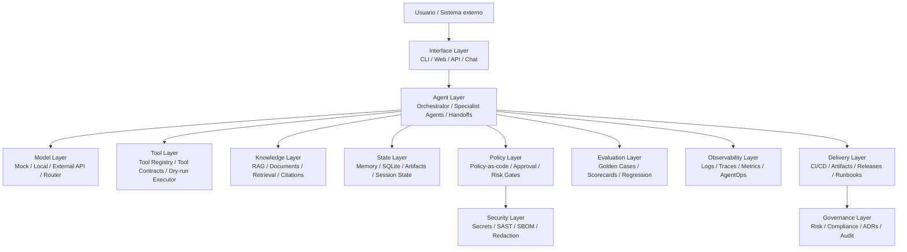
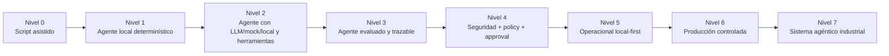

# DOC-AI-002 — Modelo de Ingeniería de Sistemas Agénticos Inteligentes

> **Ubicación canónica dentro del repositorio:**  
> `docs/engineering_model/01_modelo_ingenieria_sistemas_agenticos.md`

> **Estado:** `draft`  
> **Versión:** `0.1.0`  
> **Propósito:** documento rector principal de MIASI.  
> **Origen técnico:** AI_agents LAB-AI-001 a LAB-AI-080.  
> **Baseline de partida:** `local_first_operational_baseline` validado en LAB-AI-080.

---

## 1. Resumen ejecutivo

El **Modelo de Ingeniería de Sistemas Agénticos Inteligentes** —en adelante **MIASI**— es el marco rector del proyecto **AI_agents** para pasar de una ruta de capacitación basada en laboratorios a una práctica profesional de ingeniería de agentes de IA. Su finalidad es establecer reglas, contratos, controles, criterios de calidad y mecanismos de operación para diseñar, construir, evaluar, asegurar, desplegar y operar agentes de IA reales, orientados a producción y con trazabilidad industrial.

MIASI nace después de completar **80 laboratorios** del proyecto AI_agents, desde agentes mock sin LLM hasta un integrador final local-first con 12 capacidades en PASS. El resultado de LAB-AI-080 constituye una línea base operacional de capacitación, pero **no equivale a producción industrial completa**. MIASI formaliza esa distinción: un agente puede estar listo como baseline local-first y todavía requerir identidad real, IAM/RBAC, observabilidad remota, gestión de incidentes, secretos industriales, despliegue real y SLO/SLA para considerarse producción.

Este documento es **normativo**: no se limita a explicar conceptos. Define mínimos obligatorios, criterios de bloqueo, niveles de autonomía, arquitectura conceptual, estándares mínimos de agente/herramienta/evaluación/seguridad/observabilidad, criterios de readiness y relación con proyectos aplicados como **DevPilot Local**, **FreelanceOps Agent** y **MicroVenta Agent**.

MIASI se apoya en referencias de estado del arte: NIST AI RMF y GenAI Profile para gestión de riesgo, ISO/IEC 42001 para sistemas de gestión de IA, OWASP Top 10 for LLM Applications para seguridad específica de LLMs, OpenTelemetry GenAI para observabilidad, MCP para integración con herramientas y fuentes externas, NIST SSDF/SLSA/CycloneDX para secure SDLC y supply chain, y marcos documentales como arc42, C4 y Diátaxis.

---

## 2. Propósito del modelo

MIASI tiene cinco propósitos principales:

1. **Convertir aprendizaje en ingeniería repetible.** Los laboratorios AI_agents generaron capacidades aisladas y acumulativas; MIASI las transforma en un modelo reutilizable.
2. **Definir una línea base profesional.** Todo agente nuevo debe nacer con propósito, contrato, herramientas, permisos, evaluación, seguridad, trazabilidad, observabilidad y documentación.
3. **Distinguir prototipo, baseline y producción.** Un agente que pasa tests locales no está automáticamente listo para operar en producción.
4. **Orientar proyectos reales.** El modelo debe guiar sistemas aplicados como DevPilot Local, FreelanceOps Agent y MicroVenta Agent.
5. **Preparar automatización futura.** La documentación debe poder convertirse en comandos, validadores, formularios, plantillas y quality gates dentro de la plataforma Agent-assisted SDLC personal.

---

## 3. Alcance

MIASI cubre:

- agentes determinísticos, mock, locales, multi-modelo y con APIs externas controladas;
- agentes con herramientas, RAG, memoria, evaluación, trazas y seguridad;
- sistemas multiagente con handoffs, políticas y coordinación;
- agentes para repositorios, CI/CD, revisión, documentación y operación;
- integración con herramientas externas mediante APIs, MCP o conectores locales;
- operación local-first y transición hacia producción controlada;
- documentación docs-as-code, plantillas, checklists, ADRs y runbooks.

MIASI no cubre como objetivo inicial:

- certificación formal ISO/IEC 42001;
- cumplimiento legal completo para todos los países o industrias;
- despliegues cloud productivos totalmente automatizados;
- operación multi-tenant empresarial;
- reemplazo de herramientas industriales como SIEM, IAM, KMS, secret managers, SRE platforms o observabilidad SaaS;
- agentes autónomos sin límites humanos, presupuestales o de permisos.

---

## 4. Audiencia

| Audiencia | Uso esperado del documento |
|---|---|
| Arquitecto de sistemas agénticos | Diseñar arquitectura, límites, capas, contratos y decisiones ADR. |
| Desarrollador de agentes | Implementar agentes siguiendo Agent Card, Tool Card, ModelAdapter, evaluación y trazas. |
| Responsable de seguridad | Validar secretos, permisos, policy-as-code, human approval, SAST/SBOM y amenazas LLM. |
| Responsable de calidad/evaluación | Definir casos dorados, métricas, regresión, tool accuracy y readiness. |
| Responsable de operación | Preparar runbooks, monitoreo, alertas, incidentes, despliegue y rollback. |
| Usuario del futuro DevPilot Local | Aplicar MIASI como metodología ejecutable dentro de la plataforma SDLC. |

---

## 5. Principios rectores

Los principios siguientes son obligatorios salvo decisión ADR explícita.

| Principio | Regla normativa | Criterio de cumplimiento | Criterio de bloqueo |
|---|---|---|---|
| Local-first | Todo agente debe funcionar en modo local/mock antes de usar servicios externos. | Existe ruta sin API key y tests offline. | El agente falla si no hay API externa. |
| Multi-modelo | La lógica del agente no debe acoplarse a un proveedor LLM. | Usa `ModelAdapter` o contrato equivalente. | Código de dominio depende directamente de SDK/proveedor. |
| API keys opcionales | Ningún test base debe requerir secretos reales. | `.env.example` endurecido y pruebas herméticas. | Token real requerido para PASS local. |
| Dry-run por defecto | Toda acción con side effects debe iniciar en simulación. | CLI/API usa `dry_run=True` salvo `--execute`. | Escritura, borrado o llamada externa sin confirmación. |
| Human approval | Acciones críticas requieren revisión humana o política equivalente. | Existe approval workflow para riesgo alto/crítico. | Acción destructiva ejecutable sin aprobación. |
| Policy-as-code | Reglas de permisos deben ser declarativas y versionables. | Política en JSON/YAML/MD con tests. | Permisos embebidos y no auditables. |
| Trazabilidad | Todo run relevante debe emitir eventos/logs/trazas. | `run_id`, `agent_id`, tool calls y decisiones registradas. | Ejecución crítica sin evidencia. |
| Evaluación | Todo agente debe tener evaluación mínima antes de promoción. | Casos dorados, regresión y quality gates. | Promoción basada solo en prueba manual. |
| Seguridad desde diseño | Secret scanning, SAST/SBOM, output validation y permisos desde el inicio. | Security gates en CI/local. | Seguridad agregada al final o ausente. |
| Costo controlado | Proveedores externos requieren presupuesto, límites y trazabilidad. | Cost guard y límites de tokens/llamadas. | Llamadas ilimitadas o sin medición. |
| Documentación como activo | Todo agente productivo debe tener documentación versionada. | Agent Card, Tool Cards, Eval Plan, Runbook. | Agente sin documentación mínima. |

---

## 6. Definiciones normativas

### 6.1 Sistema agéntico

Sistema de software que combina uno o más agentes, modelos, herramientas, memoria/contexto, políticas, evaluación, trazabilidad y mecanismos de operación para cumplir objetivos bajo restricciones explícitas.

### 6.2 Agente

Componente que recibe una tarea, interpreta contexto, decide o recomienda pasos, puede invocar herramientas y produce una salida o acción bajo una política. Un agente no es simplemente un prompt; requiere contrato, límites, observabilidad y evaluación.

### 6.3 Workflow

Secuencia de pasos predefinida, determinística o semideterminística. Un workflow puede usar LLM, pero no necesariamente decide dinámicamente qué herramienta usar. Un agente puede contener workflows; no todo workflow es agente.

### 6.4 Copiloto

Asistente que recomienda o redacta, pero no ejecuta acciones críticas sin intervención humana. En MIASI, un copiloto suele ubicarse entre A0 y A2.

### 6.5 Herramienta

Función, comando, API, conector, operación de sistema o recurso externo invocable por un agente. Toda herramienta debe declarar entrada, salida, side effects, riesgo, permisos, timeout, idempotencia, trazas y soporte de dry-run.

### 6.6 Memoria

Estado persistente o semipersistente usado por el agente. Puede ser conversacional, episódica, semántica, relacional o de artefactos. La memoria no debe almacenar secretos ni datos sensibles sin política explícita.

### 6.7 RAG

Patrón de recuperación aumentada que consulta fuentes documentales o bases de conocimiento para aportar contexto trazable a una respuesta o decisión. En MIASI, RAG productivo requiere fuentes, estrategia de chunking, retrieval, grounding, citas y evaluación.

### 6.8 Guardrail

Control automático que valida entrada, salida, llamada de herramienta, riesgo, formato, seguridad o política. Un guardrail puede bloquear, corregir, degradar, escalar o solicitar revisión humana.

### 6.9 Policy gate

Decisión evaluable que permite, bloquea o exige aprobación antes de avanzar. Puede aplicarse a herramientas, entornos, modelos, costos, datos, ramas Git, despliegues o acciones con side effects.

### 6.10 Human approval

Punto de intervención humana explícita para aprobar, rechazar o modificar una acción sensible. Debe tener trazabilidad, separación de funciones, expiración y redacción de tokens.

### 6.11 AgentOps

Conjunto de prácticas para observar, evaluar, registrar, depurar y operar agentes: runs, trazas, métricas, costos, errores, decisiones, tool calls, calidad y regresión.

### 6.12 Production-ready local-first

Estado en el que el agente está listo como baseline operacional local: tests, evaluación, seguridad básica, trazas, documentación, dry-run, política y CI local/remoto sandbox. No implica operación industrial completa.

### 6.13 Producción industrial

Estado en el que el sistema opera con usuarios/datos reales, infraestructura real, identidad y permisos reales, observabilidad continua, incident management, SLO/SLA, despliegue controlado, auditoría, seguridad industrial y soporte operativo.

---

## 7. Taxonomía general de agentes

| Tipo de agente | Propósito | Riesgo típico | Ejemplo en AI_agents | Requisito mínimo MIASI |
|---|---|---:|---|---|
| `MockAgent` | Simular comportamiento sin LLM. | Bajo | LAB-KG-001-MOCK | Tests y trazas básicas. |
| `ToolAgent` | Invocar herramientas controladas. | Medio | LAB-AI-002, LAB-AI-020 | Tool Cards, dry-run, policy gate. |
| `RAGAgent` | Responder con fuentes recuperadas. | Medio | LAB-AI-005..016 | RAG Card, grounding, citas, eval. |
| `MemoryAgent` | Persistir estado útil. | Medio | LAB-AI-017 | Memory Card, política de retención. |
| `ReviewerAgent` | Revisar código, documentos o PR. | Medio | LAB-AI-023..030 | No modificar sin aprobación; reportes. |
| `ExecutorAgent` | Ejecutar pruebas/comandos/acciones. | Alto | LAB-AI-025, 030 | allowlist, timeout, sandbox, approval. |
| `SupervisorAgent` | Coordinar agentes especializados. | Medio/alto | LAB-AI-022 | Handoffs, roles, trazas. |
| `ConnectorAgent` | Integrar MCP/API/herramientas externas. | Alto | LAB-AI-021, 068..070 | permisos, auth, redacción, sandbox. |
| `SecurityAgent` | Evaluar secretos, SAST/SBOM y políticas. | Alto | LAB-AI-075..078 | reglas normativas, reportes, gates. |
| `OpsAgent` | Operar, observar o publicar artefactos. | Alto | LAB-AI-031..053, 071..074 | AgentOps, CI gates, idempotencia. |
| `ProductionAgent` | Operar en entorno productivo. | Crítico | Pendiente | IAM, SLO/SLA, monitoreo, incidentes. |

---

## 8. Niveles de autonomía

| Nivel | Nombre | Descripción | Puede ejecutar acciones | Controles requeridos |
|---|---|---|---:|---|
| A0 | Asistente pasivo | Solo explica o redacta. | No | Logging básico; disclaimer de límites. |
| A1 | Recomendador | Clasifica, sugiere, prioriza. | No | Criterios de scoring; evaluación. |
| A2 | Herramientas en dry-run | Puede planear tool calls sin side effects. | Simulado | Tool Cards; dry-run obligatorio; trazas. |
| A3 | Ejecutor controlado | Ejecuta acciones permitidas de bajo/medio riesgo. | Sí, limitado | Policy-as-code, allowlist, timeout, rollback si aplica. |
| A4 | Aprobación humana | Acciones sensibles requieren revisión. | Sí, tras aprobación | Human Approval Card; separación de funciones; auditoría. |
| A5 | Operacional local-first | Opera local/sandbox con CI, eval, seguridad y observabilidad. | Sí, sandbox | AgentOps, quality gates, runbook, CI/CD. |
| A6 | Producción controlada | Opera con usuarios/datos reales en entorno controlado. | Sí | IAM, secretos reales, SLO/SLA, monitoreo, incident response. |
| A7 | Sistema agéntico industrial | Multiagente, multiusuario, gobernado y auditado. | Sí, gobernado | Gobierno de IA, compliance, auditoría inmutable, red team, SRE. |

### 8.1 Matriz nivel de autonomía → controles requeridos

| Control | A0 | A1 | A2 | A3 | A4 | A5 | A6 | A7 |
|---|---:|---:|---:|---:|---:|---:|---:|---:|
| Agent Card | Opcional | Requerido | Requerido | Requerido | Requerido | Requerido | Requerido | Requerido |
| Tool Card | N/A | N/A | Requerido | Requerido | Requerido | Requerido | Requerido | Requerido |
| Dry-run | N/A | N/A | Obligatorio | Obligatorio para pruebas | Obligatorio antes de aprobación | Obligatorio en sandbox | Obligatorio en staging | Obligatorio para cambios críticos |
| Policy-as-code | Opcional | Recomendado | Requerido | Requerido | Requerido | Requerido | Requerido | Requerido |
| Human approval | N/A | Opcional | Opcional | Para alto riesgo | Requerido | Requerido | Requerido | Requerido con workflow formal |
| Evaluación offline | Opcional | Requerida | Requerida | Requerida | Requerida | Requerida | Requerida + continua | Requerida + continua + red team |
| Observabilidad | Básica | Básica | Trazas | Trazas + tool calls | Trazas + approvals | AgentOps | Observabilidad remota | Observabilidad + SIEM |
| Seguridad | Básica | Básica | Secret scan | SAST/SBOM | SAST/SBOM + approval | Gates CI | IAM/KMS/RBAC | Compliance formal |
| Runbook | No | No | Recomendado | Requerido | Requerido | Requerido | Requerido | Requerido |

---

## 9. Arquitectura conceptual

MIASI adopta una arquitectura por capas. Las capas no son obligatoriamente procesos separados; son responsabilidades que deben existir explícitamente.



### 9.1 Capas obligatorias por tipo de sistema

| Capa | Prototipo local | Baseline local-first | Producción industrial |
|---|---|---|---|
| Interface | CLI suficiente. | CLI + reportes + configuración. | API/Web/CLI con auth y UX operativa. |
| Agent | Agente simple. | Agente con contrato, roles, trazas. | Agentes versionados, gobernados y monitoreados. |
| Model | Mock/local. | Multi-modelo opcional con fallback. | Proveedores gestionados, SLAs, costos y privacidad. |
| Tool | Funciones locales. | Tool Registry + permisos + dry-run. | Sandbox, IAM, aprobación, rollback. |
| Knowledge | Documentos simples. | RAG evaluado con citas. | Knowledge governance, freshness, lineage. |
| State | JSON/SQLite. | Memoria persistente con política. | DB gestionada, backup, retención, privacidad. |
| Evaluation | Tests básicos. | Evals offline + regresión. | Evals continuas, monitoring, red teaming. |
| Security | Controles mínimos. | Secret scan, SAST/SBOM, policy. | IAM, KMS, SIEM, threat modeling, incident response. |
| Observability | Logs. | JSONL/OpenTelemetry local. | Tracing distribuido, dashboards, alertas. |
| Delivery | Manual. | CI local/remoto sandbox. | CI/CD real, protected branches, approvals. |
| Governance | Bitácora. | ADRs, risk register, checklists. | Sistema de gestión de IA y auditoría formal. |

---

## 10. Ciclo de vida de ingeniería

```mermaid
flowchart LR
    F0[0 Intake] --> F1[1 Clasificación de riesgo]
    F1 --> F2[2 Requerimientos]
    F2 --> F3[3 Diseño agentic]
    F3 --> F4[4 Diseño herramientas]
    F4 --> F5[5 Datos / RAG / memoria]
    F5 --> F6[6 Seguridad]
    F6 --> F7[7 Evaluación]
    F7 --> F8[8 Implementación]
    F8 --> F9[9 Observabilidad]
    F9 --> F10[10 CI/CD]
    F10 --> F11[11 Prueba controlada]
    F11 --> F12[12 Operación]
    F12 --> F13[13 Mejora continua]
```



| Fase | Salida obligatoria | Gate mínimo |
|---|---|---|
| Intake | Caso de uso, objetivo, usuario, alcance. | Caso de uso no ambiguo. |
| Riesgo | Risk Register inicial. | Riesgo alto requiere seguridad anticipada. |
| Requerimientos | Requisitos funcionales/no funcionales. | Criterios de aceptación. |
| Diseño agentic | Agent Card y arquitectura. | Nivel de autonomía definido. |
| Herramientas | Tool Cards. | Side effects y dry-run definidos. |
| Datos/RAG/memoria | RAG/Memory Card. | Fuentes y política de datos. |
| Seguridad | Threat model, policy, secret plan. | No hay secretos reales ni acciones críticas sin control. |
| Evaluación | Eval Plan. | Casos dorados y gates. |
| Implementación | Código, tests, artefactos. | Tests locales. |
| Observabilidad | Trace schema, logs, métricas. | `run_id` y eventos mínimos. |
| CI/CD | Pipeline, reportes, artefactos. | Quality gate reproducible. |
| Prueba controlada | Demo sandbox. | No producción directa. |
| Operación | Runbook, incident plan. | Soporte y rollback definidos. |
| Mejora continua | Métricas y backlog. | Retroalimentación trazable. |

---

## 11. Estándar mínimo de agente

Todo agente que supere estado experimental debe tener:

| Elemento | Obligatorio | Descripción |
|---|---:|---|
| Agent Card | Sí | Propósito, alcance, usuario, autonomía, riesgos y límites. |
| Contrato de entrada/salida | Sí | Esquemas esperados, errores y validación. |
| Modelo/proveedor desacoplado | Sí | `ModelAdapter` o equivalente. |
| Herramientas declaradas | Si usa tools | Tool Cards y Tool Registry. |
| Política de permisos | Sí | Allow/deny/approval por acción. |
| Dry-run | Si hay side effects | Simulación por defecto. |
| Evaluación | Sí | Casos dorados, regresión y score mínimo. |
| Trazabilidad | Sí | Logs/trazas con `run_id`. |
| Seguridad | Sí | Secret management, redaction, SAST/SBOM cuando aplique. |
| Documentación | Sí | README, runbook si opera, ADRs si toma decisiones estructurales. |
| Cost guard | Si usa API externa | Límites de tokens/llamadas/presupuesto. |
| Human approval | Si riesgo alto/crítico | Flujo de aprobación y auditoría. |

### 11.1 Regla de bloqueo

Un agente no puede pasar a operación controlada si incumple cualquiera de estas condiciones:

- no tiene propósito explícito;
- no define nivel de autonomía;
- usa herramientas con side effects sin dry-run;
- requiere secretos reales para pasar tests;
- no registra trazas;
- no tiene evaluación mínima;
- no tiene política de permisos;
- puede ejecutar acciones destructivas sin aprobación;
- no tiene documentación mínima.

---

## 12. Estándar mínimo de herramienta

Toda herramienta invocable por un agente debe declarar:

| Campo | Obligatorio | Ejemplo |
|---|---:|---|
| `name` | Sí | `read_file`, `run_pytest`, `create_pr_comment` |
| `description` | Sí | Qué hace y qué no hace. |
| `input_schema` | Sí | JSON Schema/Pydantic/dataclass. |
| `output_schema` | Sí | Resultado normalizado con `ok`, `error`, `metadata`. |
| `side_effects` | Sí | `none`, `filesystem_write`, `network`, `db_write`, `destructive`. |
| `risk_level` | Sí | `low`, `medium`, `high`, `critical`. |
| `dry_run_supported` | Sí | `true/false`. |
| `requires_approval` | Sí | Según política. |
| `timeout_seconds` | Sí | Límite duro. |
| `idempotent` | Sí | Si repetir la llamada duplica efectos. |
| `rollback_strategy` | Condicional | Requerida si hay escritura relevante. |
| `audit_fields` | Sí | Campos a registrar y campos a redactar. |
| `tests` | Sí | Tests unitarios/integración. |

### 12.1 Niveles de riesgo de herramientas

| Riesgo | Ejemplos | Control mínimo |
|---|---|---|
| Low | cálculo, lectura de archivo permitido, resumen local. | Logging y validación de entrada. |
| Medium | escritura en outputs, generación de reportes, consulta DB read-only. | Dry-run + policy. |
| High | escritura en repo, comentario PR/MR, llamada API externa. | Approval o allowlist + auditoría. |
| Critical | borrado, despliegue, pagos, credenciales, producción. | Bloqueado por defecto; aprobación fuerte; rollback. |

---

## 13. Estándar mínimo de evaluación

La evaluación de agentes no puede limitarse a “la respuesta se ve correcta”. Debe medir comportamiento, herramientas, grounding, seguridad y regresión.

| Dimensión | Métrica mínima | Evidencia |
|---|---|---|
| Task completion | La tarea fue completada según criterio. | Golden case con expected outcome. |
| Task adherence | El agente siguió restricciones. | Score o checklist. |
| Tool selection | Seleccionó herramienta correcta. | Tool call trace. |
| Tool input accuracy | Parámetros correctos. | Comparación schema/expected args. |
| Tool call success | La herramienta ejecutó sin error técnico. | Tool result. |
| Tool output utilization | Usó resultados correctamente. | Explicación/citas. |
| Groundedness | Respuesta soportada por evidencia. | Citas/chunks. |
| Safety | No violó política. | Policy gate. |
| Regression | No degradó casos previos. | Histórico de eval. |
| Cost/latency | Dentro de presupuesto. | Métricas de run. |

### 13.1 Gates de evaluación

| Estado | Condición |
|---|---|
| PASS | Cumple umbral mínimo sin hallazgos bloqueantes. |
| PASS_WITH_WARNINGS | Cumple, pero tiene riesgos o deuda técnica documentada. |
| FAIL | Incumple métrica crítica o política. |
| BLOCKED | Hay secreto, acción no permitida, riesgo crítico o evidencia insuficiente. |

---

## 14. Estándar mínimo de observabilidad

Todo run relevante debe emitir una traza mínima:

```json
{
  "run_id": "uuid",
  "agent_id": "string",
  "timestamp": "ISO-8601",
  "input_hash": "sha256",
  "model_provider": "mock|ollama|openai|gemini|mistral|hf|other",
  "model_name": "string",
  "tool_calls": [],
  "policy_decisions": [],
  "approval_events": [],
  "latency_ms": 0,
  "cost_estimate": 0.0,
  "status": "pass|fail|blocked",
  "artifacts": []
}
```

### 14.1 Eventos observables obligatorios

| Evento | Cuándo emitirlo |
|---|---|
| `agent.run.started` | Inicio de ejecución. |
| `model.request.created` | Antes de llamar modelo. |
| `model.response.received` | Respuesta del modelo. |
| `tool.call.proposed` | Cuando el agente propone herramienta. |
| `tool.call.started` | Antes de ejecutar herramienta. |
| `tool.call.completed` | Resultado de herramienta. |
| `policy.decision.created` | Resultado allow/block/approval. |
| `approval.requested` | Acción requiere humano. |
| `approval.resolved` | Humano aprueba/rechaza/expira. |
| `eval.completed` | Finaliza evaluación. |
| `agent.run.completed` | Fin de ejecución. |

---

## 15. Estándar mínimo de seguridad

MIASI adopta seguridad desde el diseño.

| Área | Control mínimo | Bloqueo si falta |
|---|---|---|
| Secret management | `.env.example`, redacción, scanner local, no tokens reales en tests. | Sí |
| SAST/SBOM | Inventario de dependencias y scanner básico. | Sí para A5+ |
| Prompt injection | Separación instrucciones/datos, allowlists y output validation. | Sí para herramientas externas/RAG. |
| Output handling | Validar salidas antes de ejecutar o publicar. | Sí si hay side effects. |
| Tool permissions | Tool Cards + policy-as-code. | Sí |
| Human approval | Acciones high/critical. | Sí |
| Data handling | Clasificación de datos y retención. | Sí si hay datos personales/sensibles. |
| Supply chain | Dependencias versionadas, SBOM, CI gates. | Sí para operación. |
| Cost abuse | Límites de tokens/llamadas. | Sí con APIs externas. |
| Logging seguro | Redacción de secretos y datos sensibles. | Sí |

---

## 16. Criterios de readiness

Un agente puede avanzar de prototipo a operación controlada si:

| Criterio | Requerido | Evidencia |
|---|---:|---|
| Propósito y alcance definidos | Sí | Agent Card. |
| Nivel de autonomía clasificado | Sí | Tabla A0-A7. |
| Herramientas inventariadas | Si aplica | Tool Cards. |
| Política de permisos | Sí | Policy Card / JSON/YAML. |
| Dry-run validado | Si hay side effects | Logs/trace. |
| Evaluación offline | Sí | Eval report. |
| Seguridad mínima | Sí | Secret/SAST/SBOM report. |
| Observabilidad mínima | Sí | Trace JSONL/OTel. |
| Documentación | Sí | README/runbook/ADR. |
| CI/CD | Para A5+ | Pipeline/gate. |
| Aprobación humana | Para high/critical | Approval report. |
| Riesgos aceptados | Sí | Risk Register. |

---

## 17. Criterios de bloqueo

Un agente debe bloquearse si:

- detecta secretos reales no redactados;
- requiere API key real para tests base;
- ejecuta acción destructiva sin confirmación;
- ignora política de permisos;
- carece de trazas;
- carece de evaluación mínima;
- usa herramientas externas sin allowlist;
- procesa datos sensibles sin política;
- supera límites de costo;
- falla gates de seguridad;
- produce salida no validada que se usa como comando, SQL, patch, despliegue o pago;
- opera sobre producción desde un entorno de laboratorio;
- no tiene rollback o contención para acciones críticas.

---

## 18. Baseline local-first vs producción industrial

| Dimensión | Baseline local-first | Producción industrial |
|---|---|---|
| Usuarios | Usuario técnico/proyecto propio. | Usuarios reales, roles, permisos, soporte. |
| Datos | Sintéticos, locales o controlados. | Datos reales con privacidad, retención y cumplimiento. |
| Modelos | Mock, local o API opcional. | Proveedores gestionados, SLA, privacidad, costos. |
| Secretos | `.env.example`, vault mock, no tokens en tests. | KMS/Vault real, rotación, RBAC, auditoría. |
| Seguridad | SAST/SBOM educativo, policy, approval. | Threat modeling formal, SIEM, red team, incident response. |
| Observabilidad | JSONL/OpenTelemetry local. | Tracing distribuido, dashboards, alertas, SLO/SLA. |
| CI/CD | Local/remoto sandbox. | Branch protection real, required checks, releases, rollback. |
| Aprobación | Simulada o local. | Workflow humano real, identidad, expiración, auditoría. |
| Gobernanza | ADRs, runbooks, checklists. | Sistema de gestión, auditoría formal, compliance. |
| Confiabilidad | Tests y evals offline. | Evals continuas, monitoreo, degradación controlada. |

---

## 19. Relación con laboratorios AI_agents

La matriz siguiente registra la capacidad de ingeniería consolidada por cada laboratorio. Su objetivo no es reemplazar el informe detallado, sino proveer trazabilidad normativa desde MIASI hacia el historial técnico del proyecto.

| Laboratorio | Título | Dominio MIASI | Capacidad de ingeniería consolidada |
|---|---|---|---|
| LAB-KG-001-MOCK | Agente mock sin LLM | Fundamentos, ModelAdapter y modelos locales | Separación agente/modelo/herramienta, rutas mock/local y evaluación básica de modelos. |
| LAB-AI-002 | Agente con ModelAdapter mock y tool calling estructurado | Fundamentos, ModelAdapter y modelos locales | Separación agente/modelo/herramienta, rutas mock/local y evaluación básica de modelos. |
| LAB-AI-003 | Primer agente con modelo local usando Ollama | Fundamentos, ModelAdapter y modelos locales | Separación agente/modelo/herramienta, rutas mock/local y evaluación básica de modelos. |
| LAB-AI-004 | Evaluación comparativa de modelos locales con Ollama | Fundamentos, ModelAdapter y modelos locales | Separación agente/modelo/herramienta, rutas mock/local y evaluación básica de modelos. |
| LAB-AI-005 | Agente con RAG lexical básico sobre documentos locales | RAG, embeddings, recuperación y conocimiento local | Diseño de knowledge layer, retrieval, grounding, citas, vector stores, cache e indexación incremental. |
| LAB-AI-006 | RAG generativo local con Ollama | RAG, embeddings, recuperación y conocimiento local | Diseño de knowledge layer, retrieval, grounding, citas, vector stores, cache e indexación incremental. |
| LAB-AI-007 | Evaluación de RAG: precisión, citas, cobertura y groundedness | RAG, embeddings, recuperación y conocimiento local | Diseño de knowledge layer, retrieval, grounding, citas, vector stores, cache e indexación incremental. |
| LAB-AI-008 | RAG multi-fuente local | RAG, embeddings, recuperación y conocimiento local | Diseño de knowledge layer, retrieval, grounding, citas, vector stores, cache e indexación incremental. |
| LAB-AI-009 | RAG multi-fuente con routing, filtros y reranking local | RAG, embeddings, recuperación y conocimiento local | Diseño de knowledge layer, retrieval, grounding, citas, vector stores, cache e indexación incremental. |
| LAB-AI-010 | RAG generativo multi-fuente con routing y groundedness | RAG, embeddings, recuperación y conocimiento local | Diseño de knowledge layer, retrieval, grounding, citas, vector stores, cache e indexación incremental. |
| LAB-AI-011 | Evaluación de RAG routed/generativo multi-fuente | RAG, embeddings, recuperación y conocimiento local | Diseño de knowledge layer, retrieval, grounding, citas, vector stores, cache e indexación incremental. |
| LAB-AI-012 | RAG semántico local con embeddings | RAG, embeddings, recuperación y conocimiento local | Diseño de knowledge layer, retrieval, grounding, citas, vector stores, cache e indexación incremental. |
| LAB-AI-013 | Embeddings neuronales locales con Ollama | RAG, embeddings, recuperación y conocimiento local | Diseño de knowledge layer, retrieval, grounding, citas, vector stores, cache e indexación incremental. |
| LAB-AI-014 | Vector store local con FAISS o Chroma | RAG, embeddings, recuperación y conocimiento local | Diseño de knowledge layer, retrieval, grounding, citas, vector stores, cache e indexación incremental. |
| LAB-AI-015 | RAG híbrido production-style | RAG, embeddings, recuperación y conocimiento local | Diseño de knowledge layer, retrieval, grounding, citas, vector stores, cache e indexación incremental. |
| LAB-AI-016 | Cache e indexación incremental | RAG, embeddings, recuperación y conocimiento local | Diseño de knowledge layer, retrieval, grounding, citas, vector stores, cache e indexación incremental. |
| LAB-AI-017 | Memoria persistente SQLite para agentes | Memoria, observabilidad, evaluación y seguridad inicial | Persistencia de estado, trazabilidad, scorecards, guardrails y políticas de acciones. |
| LAB-AI-018 | Observabilidad avanzada y trazas evaluables | Memoria, observabilidad, evaluación y seguridad inicial | Persistencia de estado, trazabilidad, scorecards, guardrails y políticas de acciones. |
| LAB-AI-019 | Evaluación avanzada de agentes | Memoria, observabilidad, evaluación y seguridad inicial | Persistencia de estado, trazabilidad, scorecards, guardrails y políticas de acciones. |
| LAB-AI-020 | Guardrails, políticas y seguridad de acciones | Memoria, observabilidad, evaluación y seguridad inicial | Persistencia de estado, trazabilidad, scorecards, guardrails y políticas de acciones. |
| LAB-AI-021 | MCP y conectores externos controlados | MCP y multiagentes | Handoffs controlados, conectores externos, permisos y coordinación entre agentes especializados. |
| LAB-AI-022 | Multiagentes y handoffs controlados | MCP y multiagentes | Handoffs controlados, conectores externos, permisos y coordinación entre agentes especializados. |
| LAB-AI-023 | Agentes aplicados a repositorios de software | Agentes para repositorios y revisión de código | Análisis de repos, patches revisables, diffs, PR simulados, integración Git y selección de pruebas por impacto. |
| LAB-AI-024 | Agentes de refactor seguro con patches revisables | Agentes para repositorios y revisión de código | Análisis de repos, patches revisables, diffs, PR simulados, integración Git y selección de pruebas por impacto. |
| LAB-AI-025 | Ejecución controlada de pruebas y validación de patches | Agentes para repositorios y revisión de código | Análisis de repos, patches revisables, diffs, PR simulados, integración Git y selección de pruebas por impacto. |
| LAB-AI-026 | Revisión de código multiagente con RAG, repositorio y memoria | Agentes para repositorios y revisión de código | Análisis de repos, patches revisables, diffs, PR simulados, integración Git y selección de pruebas por impacto. |
| LAB-AI-027 | Revisión de diffs y pull requests simulados | Agentes para repositorios y revisión de código | Análisis de repos, patches revisables, diffs, PR simulados, integración Git y selección de pruebas por impacto. |
| LAB-AI-028 | Integración Git local y revisión de ramas/diffs reales | Agentes para repositorios y revisión de código | Análisis de repos, patches revisables, diffs, PR simulados, integración Git y selección de pruebas por impacto. |
| LAB-AI-029 | Revisión Git avanzada con ramas base, staged changes y selección de pruebas | Agentes para repositorios y revisión de código | Análisis de repos, patches revisables, diffs, PR simulados, integración Git y selección de pruebas por impacto. |
| LAB-AI-030 | Ejecución selectiva de pruebas basada en impacto Git | Agentes para repositorios y revisión de código | Análisis de repos, patches revisables, diffs, PR simulados, integración Git y selección de pruebas por impacto. |
| LAB-AI-031 | AgentOps local para revisiones Git, pruebas y calidad | AgentOps, CI/CD, PR/MR y sandbox API | Evidencia operacional, quality gates, comentarios PR/MR, idempotencia, hardening y simulación de proveedores Git. |
| LAB-AI-032 | CI/CD local con quality gates sobre AgentOps | AgentOps, CI/CD, PR/MR y sandbox API | Evidencia operacional, quality gates, comentarios PR/MR, idempotencia, hardening y simulación de proveedores Git. |
| LAB-AI-033 | Integración GitHub/GitLab CI simulada o local workflow runner | AgentOps, CI/CD, PR/MR y sandbox API | Evidencia operacional, quality gates, comentarios PR/MR, idempotencia, hardening y simulación de proveedores Git. |
| LAB-AI-034 | CI/CD real con GitHub Actions/GitLab CI y artefactos de pipeline | AgentOps, CI/CD, PR/MR y sandbox API | Evidencia operacional, quality gates, comentarios PR/MR, idempotencia, hardening y simulación de proveedores Git. |
| LAB-AI-035 | Publicación y análisis de artefactos CI con histórico por commit | AgentOps, CI/CD, PR/MR y sandbox API | Evidencia operacional, quality gates, comentarios PR/MR, idempotencia, hardening y simulación de proveedores Git. |
| LAB-AI-036 | Comentarios automáticos de PR simulados desde artefactos CI | AgentOps, CI/CD, PR/MR y sandbox API | Evidencia operacional, quality gates, comentarios PR/MR, idempotencia, hardening y simulación de proveedores Git. |
| LAB-AI-037 | Publicación controlada de comentarios PR con adaptadores GitHub/GitLab | AgentOps, CI/CD, PR/MR y sandbox API | Evidencia operacional, quality gates, comentarios PR/MR, idempotencia, hardening y simulación de proveedores Git. |
| LAB-AI-038 | Actualización anti-duplicados y comentarios por línea/diff | AgentOps, CI/CD, PR/MR y sandbox API | Evidencia operacional, quality gates, comentarios PR/MR, idempotencia, hardening y simulación de proveedores Git. |
| LAB-AI-039 | Ejecución remota controlada de comentarios por línea con update idempotente real | AgentOps, CI/CD, PR/MR y sandbox API | Evidencia operacional, quality gates, comentarios PR/MR, idempotencia, hardening y simulación de proveedores Git. |
| LAB-AI-040 | Hardening industrial de integración PR/MR | AgentOps, CI/CD, PR/MR y sandbox API | Evidencia operacional, quality gates, comentarios PR/MR, idempotencia, hardening y simulación de proveedores Git. |
| LAB-AI-041 | Sandbox API local para simular GitHub/GitLab | AgentOps, CI/CD, PR/MR y sandbox API | Evidencia operacional, quality gates, comentarios PR/MR, idempotencia, hardening y simulación de proveedores Git. |
| LAB-AI-042 | Contratos de API y fixtures parametrizados para escenarios GitHub/GitLab | AgentOps, CI/CD, PR/MR y sandbox API | Evidencia operacional, quality gates, comentarios PR/MR, idempotencia, hardening y simulación de proveedores Git. |
| LAB-AI-043 | Matriz E2E contractual sobre sandbox local con escenarios parametrizados | Contract testing, JUnit/XML y pipeline de calidad | Contratos API, fixtures, matrices E2E, cobertura contractual, regresión y resúmenes PR/MR. |
| LAB-AI-044 | Salida JUnit/XML y quality gate CI para matriz contractual | Contract testing, JUnit/XML y pipeline de calidad | Contratos API, fixtures, matrices E2E, cobertura contractual, regresión y resúmenes PR/MR. |
| LAB-AI-045 | Integración de contract testing en GitHub Actions/GitLab CI con artefactos JUnit | Contract testing, JUnit/XML y pipeline de calidad | Contratos API, fixtures, matrices E2E, cobertura contractual, regresión y resúmenes PR/MR. |
| LAB-AI-046 | Cobertura contractual y dashboard histórico de calidad de contratos | Contract testing, JUnit/XML y pipeline de calidad | Contratos API, fixtures, matrices E2E, cobertura contractual, regresión y resúmenes PR/MR. |
| LAB-AI-047 | Quality gate de regresión contractual por histórico y cobertura mínima | Contract testing, JUnit/XML y pipeline de calidad | Contratos API, fixtures, matrices E2E, cobertura contractual, regresión y resúmenes PR/MR. |
| LAB-AI-048 | Integración del gate de regresión contractual en CI y comentario automático de PR/MR | Contract testing, JUnit/XML y pipeline de calidad | Contratos API, fixtures, matrices E2E, cobertura contractual, regresión y resúmenes PR/MR. |
| LAB-AI-049 | Publicación controlada del resumen contractual en PR/MR | Contract testing, JUnit/XML y pipeline de calidad | Contratos API, fixtures, matrices E2E, cobertura contractual, regresión y resúmenes PR/MR. |
| LAB-AI-050 | Sandbox E2E para publicación idempotente de resumen contractual en PR/MR | Contract testing, JUnit/XML y pipeline de calidad | Contratos API, fixtures, matrices E2E, cobertura contractual, regresión y resúmenes PR/MR. |
| LAB-AI-051 | JUnit/XML y quality gate CI para sandbox de publicación de resumen contractual | Contract testing, JUnit/XML y pipeline de calidad | Contratos API, fixtures, matrices E2E, cobertura contractual, regresión y resúmenes PR/MR. |
| LAB-AI-052 | Integración CI del sandbox de publicación contractual | Contract testing, JUnit/XML y pipeline de calidad | Contratos API, fixtures, matrices E2E, cobertura contractual, regresión y resúmenes PR/MR. |
| LAB-AI-053 | Resumen PR/MR consolidado del pipeline de calidad | Contract testing, JUnit/XML y pipeline de calidad | Contratos API, fixtures, matrices E2E, cobertura contractual, regresión y resúmenes PR/MR. |
| LAB-AI-054 | Gestión reproducible de dependencias con uv o pip-tools | Industrialización del entorno | Dependencias reproducibles, pre-commit, Ruff, type checking, devcontainers, Docker y Docker Compose local. |
| LAB-AI-055 | Pre-commit, Ruff y type checking local | Industrialización del entorno | Dependencias reproducibles, pre-commit, Ruff, type checking, devcontainers, Docker y Docker Compose local. |
| LAB-AI-056 | Dev Container reproducible para AI_agents | Industrialización del entorno | Dependencias reproducibles, pre-commit, Ruff, type checking, devcontainers, Docker y Docker Compose local. |
| LAB-AI-057 | Dockerización mínima del runtime de laboratorios | Industrialización del entorno | Dependencias reproducibles, pre-commit, Ruff, type checking, devcontainers, Docker y Docker Compose local. |
| LAB-AI-058 | Docker Compose local para agentes, Ollama y servicios auxiliares | Industrialización del entorno | Dependencias reproducibles, pre-commit, Ruff, type checking, devcontainers, Docker y Docker Compose local. |
| LAB-AI-059 | Contrato robusto de ModelAdapter multi-proveedor | Multi-modelo, APIs externas controladas y SDKs | Contrato robusto ModelAdapter, cost guards, routing, benchmark, tool calling normalizado y comparación con SDK externos. |
| LAB-AI-060 | OpenAIAdapter controlado con cost guard y dry-run | Multi-modelo, APIs externas controladas y SDKs | Contrato robusto ModelAdapter, cost guards, routing, benchmark, tool calling normalizado y comparación con SDK externos. |
| LAB-AI-061 | GeminiAdapter controlado | Multi-modelo, APIs externas controladas y SDKs | Contrato robusto ModelAdapter, cost guards, routing, benchmark, tool calling normalizado y comparación con SDK externos. |
| LAB-AI-062 | Mistral/HuggingFaceAdapter controlado | Multi-modelo, APIs externas controladas y SDKs | Contrato robusto ModelAdapter, cost guards, routing, benchmark, tool calling normalizado y comparación con SDK externos. |
| LAB-AI-063 | Router multi-modelo con fallback, presupuesto y trazabilidad | Multi-modelo, APIs externas controladas y SDKs | Contrato robusto ModelAdapter, cost guards, routing, benchmark, tool calling normalizado y comparación con SDK externos. |
| LAB-AI-064 | Benchmark multi-modelo local/API | Multi-modelo, APIs externas controladas y SDKs | Contrato robusto ModelAdapter, cost guards, routing, benchmark, tool calling normalizado y comparación con SDK externos. |
| LAB-AI-065 | Function/tool calling multi-proveedor normalizado | Multi-modelo, APIs externas controladas y SDKs | Contrato robusto ModelAdapter, cost guards, routing, benchmark, tool calling normalizado y comparación con SDK externos. |
| LAB-AI-066 | Responses API / Agents SDK Adapter experimental | Multi-modelo, APIs externas controladas y SDKs | Contrato robusto ModelAdapter, cost guards, routing, benchmark, tool calling normalizado y comparación con SDK externos. |
| LAB-AI-067 | Evaluación comparativa: framework propio vs SDK externo | Multi-modelo, APIs externas controladas y SDKs | Contrato robusto ModelAdapter, cost guards, routing, benchmark, tool calling normalizado y comparación con SDK externos. |
| LAB-AI-068 | MCP Client real con servidor externo controlado | MCP real y ejecución de herramientas | Cliente MCP real, transporte HTTP/streamable, autenticación simulada, permisos granulares y approval workflow. |
| LAB-AI-069 | MCP HTTP/Streamable controlado con autenticación simulada | MCP real y ejecución de herramientas | Cliente MCP real, transporte HTTP/streamable, autenticación simulada, permisos granulares y approval workflow. |
| LAB-AI-070 | MCP tool execution con permisos granulares y approval workflow | MCP real y ejecución de herramientas | Cliente MCP real, transporte HTTP/streamable, autenticación simulada, permisos granulares y approval workflow. |
| LAB-AI-071 | OpenTelemetry para agentes locales | Observabilidad industrial y exporters | OpenTelemetry local, histórico AgentOps, tendencias y exporters experimentales hacia plataformas externas. |
| LAB-AI-072 | AgentOps histórico en SQLite/PostgreSQL | Observabilidad industrial y exporters | OpenTelemetry local, histórico AgentOps, tendencias y exporters experimentales hacia plataformas externas. |
| LAB-AI-073 | Dashboard histórico de AgentOps con tendencias | Observabilidad industrial y exporters | OpenTelemetry local, histórico AgentOps, tendencias y exporters experimentales hacia plataformas externas. |
| LAB-AI-074 | Integración experimental con Phoenix/Langfuse/LangSmith | Observabilidad industrial y exporters | OpenTelemetry local, histórico AgentOps, tendencias y exporters experimentales hacia plataformas externas. |
| LAB-AI-075 | Secret management local e industrialización de `.env` | Seguridad industrial local-first | Secret management, SAST/SBOM, policy-as-code, human approval y controles previos a ejecución crítica. |
| LAB-AI-076 | SAST/SBOM/dependency scanning controlado | Seguridad industrial local-first | Secret management, SAST/SBOM, policy-as-code, human approval y controles previos a ejecución crítica. |
| LAB-AI-077 | Policy-as-code para agentes con acciones | Seguridad industrial local-first | Secret management, SAST/SBOM, policy-as-code, human approval y controles previos a ejecución crítica. |
| LAB-AI-078 | Human approval workflow avanzado | Seguridad industrial local-first | Secret management, SAST/SBOM, policy-as-code, human approval y controles previos a ejecución crítica. |
| LAB-AI-079 | CI remoto real contra repositorio sandbox GitHub/GitLab | CI remoto sandbox | Plantillas GitHub/GitLab, runbook, readiness remoto y seguridad de repositorios sandbox. |
| LAB-AI-080 | Proyecto final integrador: agente operacional production-ready local-first | Integración final | Baseline operacional local-first, matriz de capacidades, arquitectura final, runbook y criterios de transición. |

---

## 20. Relación con proyectos aplicados

### 20.1 DevPilot Local

**DevPilot Local** será la primera plataforma aplicada que implemente MIASI como agente SDLC personal. Su responsabilidad será convertir documentos, plantillas y checklists en flujos ejecutables.

| Componente MIASI | Uso en DevPilot Local |
|---|---|
| Agent Card | Crear definición formal de cada agente del proyecto. |
| Tool Card | Registrar herramientas permitidas, side effects y permisos. |
| Eval Card | Generar casos de evaluación, regresión y quality gates. |
| Policy Card | Decidir allow/block/approval para acciones. |
| Risk Register | Mantener riesgos por proyecto/agente. |
| ADR | Registrar decisiones arquitectónicas. |
| Runbook | Operar agentes y pipelines. |
| Production Checklist | Determinar readiness. |

### 20.2 FreelanceOps Agent

FreelanceOps Agent aplicará MIASI a la gestión de oportunidades, propuestas, mensajes, entregables y métricas freelance. Debe operar como copiloto o agente A1-A3 inicialmente, con herramientas en dry-run y aprobación humana para comunicaciones sensibles.

| Riesgo | Control MIASI |
|---|---|
| Enviar propuestas incorrectas | Human review obligatorio. |
| Violar términos de plataformas | No scraping no autorizado; entrada manual o APIs oficiales. |
| Mensajes spam/phishing | AntiScamAgent y policy gate. |
| Manejo de archivos de clientes | Data Handling Sheet y sandbox. |

### 20.3 MicroVenta Agent

MicroVenta Agent aplicará MIASI a ventas, inventario, clientes, pagos manuales/semiautomáticos, marketing y reportes. Debe clasificarse como sistema A4-A6 si maneja datos reales de clientes, pagos o inventario real.

| Riesgo | Control MIASI |
|---|---|
| Pagos | Integración mediante proveedor; no almacenar tarjetas. |
| Datos de clientes | Política de datos, consentimiento, retención. |
| Reportes financieros | Aclarar que es contabilidad operativa, no formal. |
| Publicaciones automáticas | Revisión humana antes de publicar. |

---

## 21. Roadmap de madurez



| Nivel | Descripción | Estado actual AI_agents |
|---|---|---|
| 0 | Scripts asistidos sin arquitectura. | Superado. |
| 1 | Agentes determinísticos locales. | Cubierto. |
| 2 | LLM local/API opcional y herramientas. | Cubierto. |
| 3 | Evaluación y trazas. | Cubierto. |
| 4 | Seguridad, policy y approval. | Cubierto como local-first. |
| 5 | Operacional local-first. | Alcanzado por LAB-AI-080. |
| 6 | Producción controlada. | Pendiente en fase aplicada. |
| 7 | Industrial completo. | Futuro. |

---

## 22. Riesgos y límites del modelo

| Riesgo | Descripción | Mitigación MIASI |
|---|---|---|
| Falsa sensación de producción | Confundir 680 tests locales con operación industrial. | Tabla baseline vs producción; readiness gates. |
| Sobreautomatización | Ejecutar acciones sin suficiente revisión. | Dry-run, policy-as-code, approval. |
| Dependencia de proveedor | Acoplar lógica a OpenAI/Gemini/etc. | ModelAdapter y ruta mock/local. |
| Prompt injection | Datos externos alteran intención o herramientas. | Separación contexto/instrucciones, tool allowlists. |
| Fuga de datos | Logs o reportes exponen secretos. | Redaction, secret management, policy. |
| Costos descontrolados | APIs externas sin límites. | Cost guard, budgets, trazas. |
| Evaluación débil | Pasar a operación sin pruebas de comportamiento. | Eval Cards, golden cases, regression gates. |
| Documentación obsoleta | Docs no reflejan implementación. | Docs-as-code, PR review, ADRs. |
| Tool misuse | Herramientas mal definidas o peligrosas. | Tool Cards, side effects, timeout, approval. |
| Supply chain | Dependencias vulnerables o no reproducibles. | SBOM, SAST, SLSA-inspired gates. |

---

## 23. Checklist de cumplimiento mínimo

| Ítem | Requerido | Estado esperado antes de operación controlada |
|---|---:|---|
| Agent Card creada | Sí | Completa y revisada. |
| Nivel de autonomía definido | Sí | A0-A7 asignado. |
| Tool Cards completas | Si aplica | Side effects y riesgos claros. |
| ModelAdapter desacoplado | Sí | No hay dependencia directa de proveedor. |
| Ruta mock/local | Sí | Tests pasan sin API key. |
| Dry-run por defecto | Sí | Acciones simulables. |
| Evaluación offline | Sí | Reporte PASS o PASS_WITH_WARNINGS. |
| Trazas | Sí | JSONL/OTel local. |
| Secret management | Sí | No secretos reales. |
| SAST/SBOM | Para A5+ | Reporte sin críticos bloqueantes. |
| Policy-as-code | Si hay acciones | allow/block/approval probado. |
| Human approval | Si high/critical | Flujo probado. |
| CI/CD | Para operación | Quality gates reproducibles. |
| Runbook | Para operación | Procedimientos definidos. |
| Risk Register | Sí | Riesgos aceptados o mitigados. |
| ADRs | Si hay decisiones estructurales | Registradas. |

---

## 24. Referencias

- [NIST AI RMF 1.0](https://www.nist.gov/itl/ai-risk-management-framework) — Marco voluntario para gestionar riesgos de IA e incorporar confianza en diseño, desarrollo, uso y evaluación.
- [NIST AI 600-1 GenAI Profile](https://www.nist.gov/publications/artificial-intelligence-risk-management-framework-generative-artificial-intelligence) — Perfil transversal para riesgos de IA generativa asociado al AI RMF.
- [ISO/IEC 42001:2023](https://www.iso.org/standard/42001) — Sistema de gestión de IA para establecer, implementar, mantener y mejorar gobernanza de IA.
- [OWASP Top 10 for LLM Applications 2025](https://owasp.org/www-project-top-10-for-large-language-model-applications/) — Riesgos críticos de aplicaciones LLM como prompt injection, manejo inseguro de salida, supply chain y fuga de información.
- [OpenAI Agents SDK](https://developers.openai.com/api/docs/guides/agents) — Primitivas de agentes, modelos/proveedores, tools, handoffs, guardrails, human review, tracing y observabilidad.
- [OpenAI Guardrails and human review](https://developers.openai.com/api/docs/guides/agents/guardrails-approvals) — Validaciones automáticas y revisión humana para pausar, aprobar o detener acciones sensibles.
- [LangGraph overview](https://docs.langchain.com/oss/python/langgraph/overview) — Runtime de orquestación para durable execution, streaming, human-in-the-loop y persistence.
- [LangGraph durable execution](https://docs.langchain.com/oss/python/langgraph/durable-execution) — Checkpoints y reanudación de procesos/workflows desde fronteras de ejecución.
- [Microsoft Foundry Agent Evaluators](https://learn.microsoft.com/en-us/azure/foundry/concepts/evaluation-evaluators/agent-evaluators) — Evaluadores de agentes: task completion, task adherence, intent resolution, tool selection, tool call accuracy y otros.
- [OpenTelemetry GenAI semantic conventions](https://opentelemetry.io/docs/specs/semconv/gen-ai/) — Convenciones para spans, eventos y métricas en sistemas GenAI y agentes.
- [OpenTelemetry GenAI agent spans](https://opentelemetry.io/docs/specs/semconv/gen-ai/gen-ai-agent-spans/) — Convenciones semánticas para llamadas de agentes GenAI.
- [Model Context Protocol specification](https://modelcontextprotocol.io/specification/2025-06-18) — Protocolo abierto para integrar aplicaciones LLM con datos y herramientas externas.
- [NIST SSDF SP 800-218](https://csrc.nist.gov/pubs/sp/800/218/final) — Marco de desarrollo seguro de software con prácticas integrables al SDLC.
- [SLSA](https://slsa.dev/) — Marco de seguridad para integridad de cadena de suministro de software.
- [CycloneDX](https://cyclonedx.org/) — Estándar full-stack Bill of Materials para transparencia y reducción de riesgo en supply chain.
- [arc42](https://arc42.org/) — Plantilla para documentación y comunicación de arquitecturas de software.
- [C4 Model](https://c4model.com/) — Modelo para visualizar arquitectura con niveles: contexto, contenedores, componentes y código.
- [Diátaxis](https://diataxis.fr/) — Marco para organizar documentación en tutoriales, how-to, referencia y explicación.

---

## 25. Changelog

| Versión | Fecha | Cambio | Autor |
|---|---|---|---|
| 0.1.0 | 2026-05-30 | Creación inicial del documento rector MIASI, incluyendo principios, taxonomía, autonomía, arquitectura conceptual, ciclo de vida, estándares mínimos, criterios de readiness/bloqueo, trazabilidad con LAB-AI-001 a LAB-AI-080 y relación con proyectos aplicados. | AI_agents |
