# DOC-AI-003 — Arquitectura de referencia para sistemas agénticos inteligentes

## 1. Resumen

Este documento define la **arquitectura de referencia MIASI** para construir sistemas agénticos inteligentes reales, reutilizables, evaluables, seguros, observables y orientados a producción. La arquitectura se deriva de la experiencia acumulada en **AI_agents LAB-AI-001 a LAB-AI-080**, pero no queda limitada a los laboratorios: su finalidad es servir como base de diseño para proyectos aplicados como **DevPilot Local**, **FreelanceOps Agent** y **MicroVenta Agent**.

La arquitectura adopta un enfoque **local-first, multi-modelo, seguro por diseño y docs-as-code**. Permite implementar un MVP sin servicios externos obligatorios, usando agentes determinísticos, modelos mock, modelos locales o adaptadores opcionales a APIs externas. También define la ruta para evolucionar hacia producción controlada mediante evaluación, policy-as-code, human approval, observabilidad, CI/CD, gestión de secretos, SBOM, trazabilidad y gobierno de riesgos.

Este documento no prescribe un único framework ni un único proveedor LLM. Define **capas, contratos, flujos, controles, patrones de despliegue y decisiones arquitectónicas** que deben cumplirse independientemente de si se usa OpenAI, Gemini, Mistral, Hugging Face, Ollama, LM Studio, LangGraph, OpenAI Agents SDK, MCP o implementaciones propias.

---

## 2. Objetivo de la arquitectura

El objetivo de esta arquitectura es proporcionar una referencia profesional para diseñar sistemas con:

- agentes de IA con diferentes niveles de autonomía;
- herramientas internas y externas con contratos explícitos;
- modelos intercambiables mediante `ModelAdapter`;
- RAG, memoria y estado persistente;
- evaluación automatizada y quality gates;
- trazas, logs, métricas y auditoría;
- controles de seguridad, permisos y aprobación humana;
- CI/CD, artefactos, runbooks y preparación operativa;
- documentación versionada y trazable.

La arquitectura debe cumplir cuatro propósitos prácticos:

| Propósito | Descripción | Evidencia esperada |
|---|---|---|
| Diseñar | Definir capas, contratos, datos, flujos y límites del sistema antes de codificar. | Diagramas C4/Mermaid, ADRs, Agent Cards, Tool Cards. |
| Implementar | Guiar la creación modular de agentes, herramientas, memoria, RAG, evaluación y seguridad. | Paquetes, interfaces, tests, policy configs. |
| Evaluar | Permitir medir si el agente cumple su tarea, usa herramientas correctamente y respeta políticas. | Eval reports, quality gates, matrices PASS/FAIL. |
| Operar | Producir trazas, reportes, runbooks, incident logs y evidencia de readiness. | JSONL traces, OpenTelemetry mapping, runbooks, reports. |

---

## 3. Principios arquitectónicos

Los principios siguientes son normativos para todo sistema que adopte MIASI.

| ID | Principio | Regla normativa | Justificación |
|---|---|---|---|
| PA-01 | Local-first | Todo sistema debe poder ejecutar una ruta mínima sin API externa obligatoria. | Reduce costo, dependencia, riesgo de disponibilidad y bloqueo por proveedor. |
| PA-02 | Multi-modelo | Todo agente con LLM debe depender de un `ModelAdapter`, no de un SDK único embebido en la lógica de dominio. | Permite usar mock, local model y APIs externas de forma intercambiable. |
| PA-03 | Dry-run por defecto | Toda herramienta con efectos secundarios debe soportar `dry_run=True` y activarlo por defecto. | Evita daño accidental en archivos, repositorios, datos, despliegues o plataformas. |
| PA-04 | Human approval | Toda acción destructiva, externa, costosa, sensible o irreversible debe requerir aprobación humana o política equivalente. | Controla autonomía y reduce riesgo operacional. |
| PA-05 | Policy-as-code | Las decisiones de permitir, bloquear o requerir aprobación deben expresarse como política versionable. | Evita decisiones implícitas y facilita auditoría. |
| PA-06 | Observabilidad obligatoria | Todo run relevante debe generar trazas, logs y eventos estructurados. | Permite depuración, evaluación, auditoría e incident response. |
| PA-07 | Evaluación antes de promoción | Ningún agente debe pasar a operación controlada sin evaluación offline mínima y quality gates. | Evita promover comportamiento no medido. |
| PA-08 | Seguridad desde el diseño | Secret management, SAST/SBOM, permisos, redacción y control de herramientas deben estar en la arquitectura inicial. | Reduce deuda de seguridad y exposición de datos. |
| PA-09 | RAG con grounding | Todo RAG que soporte decisiones o reportes debe conservar fuente, cita, score y trazabilidad. | Mejora verificabilidad y reduce alucinaciones no detectadas. |
| PA-10 | Documentación como activo | La documentación debe estar versionada, revisable y vinculada al código. | Permite gobernanza técnica y continuidad del proyecto. |

---

## 4. Drivers arquitectónicos

Los drivers son las fuerzas que justifican la forma de la arquitectura.

### 4.1 Drivers de negocio y proyecto

| Driver | Impacto arquitectónico |
|---|---|
| Formación avanzada en agentes IA | Requiere arquitectura explícita, modular y didáctica. |
| Transición a proyectos reales | Exige seguridad, evaluación, observabilidad y CI/CD desde el inicio. |
| Uso propio inicial | Permite MVP local-first antes de exponer usuarios externos. |
| Posible evolución a servicios profesionales | Requiere documentación, trazabilidad, evidencias y prácticas industriales. |
| Costos controlados | Debe existir ruta sin API y control presupuestal por proveedor. |

### 4.2 Drivers técnicos

| Driver | Decisión arquitectónica |
|---|---|
| Múltiples proveedores LLM | `ModelAdapter` obligatorio. |
| Herramientas con efectos | `ToolRegistry`, `ToolContract`, `PolicyEngine` y `DryRunExecutor`. |
| RAG y memoria | Separar Knowledge Layer de State/Memory Layer. |
| Evaluación recurrente | `EvalHarness` y artefactos de evaluación por agente. |
| Observabilidad | Trazas JSONL locales y mapeo futuro a OpenTelemetry GenAI. |
| CI/CD | Quality gates, workflows y reportes versionados. |
| Seguridad | Secret management, SAST/SBOM, policy-as-code, human approval. |

### 4.3 Drivers regulatorios y de gobernanza

| Driver | Referencia | Implicación |
|---|---|---|
| Gestión de riesgos IA | NIST AI RMF / GenAI Profile | Identificar, medir y gestionar riesgos de IA generativa. |
| Sistema de gestión de IA | ISO/IEC 42001 | Establecer controles, responsabilidades y mejora continua. |
| Seguridad LLM | OWASP LLM Top 10 | Mitigar prompt injection, data leakage, excessive agency y supply-chain risks. |
| Desarrollo seguro | NIST SSDF | Integrar prácticas de secure SDLC. |
| Supply chain | SLSA / CycloneDX | Versionar dependencias, SBOM y artefactos. |

---

## 5. Requisitos de calidad

Los requisitos de calidad son evaluables y deben traducirse a quality gates.

| Atributo | Requisito arquitectónico | Métrica/evidencia mínima | Gate |
|---|---|---|---|
| Seguridad | No exponer secretos ni ejecutar acciones críticas sin política. | Secret scan PASS, policy gates PASS, approval para acciones sensibles. | Bloqueante |
| Observabilidad | Cada ejecución debe dejar traza estructurada. | JSONL trace o mapping OTel; run_id; tool calls; decisiones. | Bloqueante en operación |
| Evaluabilidad | Cada agente debe tener casos de prueba y criterios PASS/FAIL. | Eval report JSON/MD; tests herméticos. | Bloqueante |
| Trazabilidad | Los outputs deben vincular input, agente, herramientas, modelo, política y artefactos. | Trace IDs, report IDs, artifact paths. | Bloqueante en producción |
| Mantenibilidad | Capas desacopladas y contratos explícitos. | Estructura modular, ADRs, interfaces. | Revisión técnica |
| Portabilidad multi-modelo | Cambiar proveedor no debe romper dominio. | `ModelAdapter`, mock tests, provider config. | Bloqueante para agentes LLM |
| Costo controlado | Los proveedores externos deben tener límites. | cost_budget, max_tokens, dry-run, API key opcional. | Bloqueante si usa API |
| Confiabilidad | Fallos de modelo/herramienta deben tener manejo explícito. | timeouts, retries, fallback, error taxonomy. | Revisión técnica |
| Extensibilidad | Agregar herramienta/agente/modelo no debe romper capas. | ToolRegistry, AgentCatalog, adapters. | Revisión técnica |
| Gobernanza | Decisiones, riesgos y controles deben estar documentados. | ADRs, Risk Register, Policy Cards. | Bloqueante para operación |

---

## 6. Vista C4 Nivel 1 — Contexto

La vista de contexto muestra el sistema agéntico como una caja principal, sus usuarios y sistemas externos. En MIASI, el sistema puede operar en modo local-only, con modelos locales o con APIs externas opcionales.

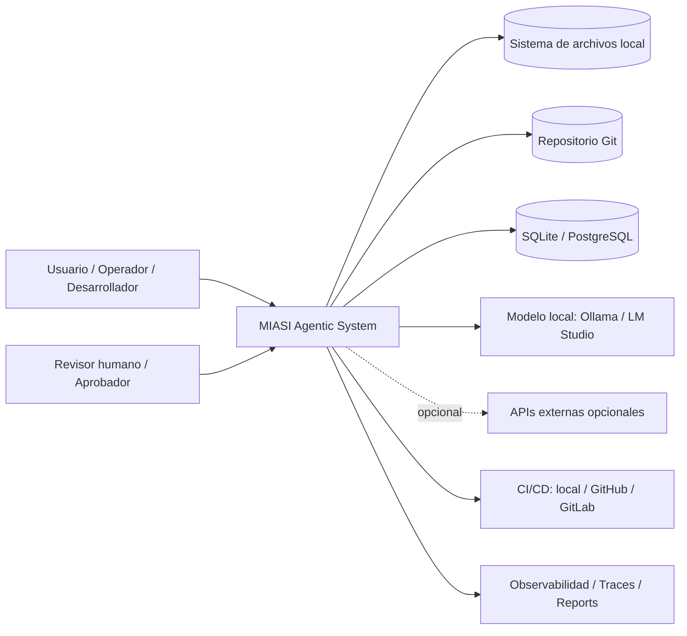

### 6.1 Actores

| Actor | Responsabilidad |
|---|---|
| Usuario / operador | Solicita tareas, revisa outputs y decide ejecución. |
| Revisor humano | Aprueba o rechaza acciones sensibles. |
| Desarrollador | Implementa agentes, herramientas, tests y políticas. |
| Sistema CI/CD | Ejecuta quality gates y publica artefactos. |
| Proveedor LLM opcional | Responde solicitudes de inferencia cuando la ruta externa está habilitada. |

### 6.2 Sistemas externos

| Sistema externo | Tipo de integración | Reglas |
|---|---|---|
| Sistema de archivos | Local tool | Dry-run por defecto en escritura. |
| Git | Local/remote tool | Branch sandbox, no push sin aprobación. |
| Base de datos | Local/transaccional | Migraciones controladas, backups, permisos mínimos. |
| Modelo local | Adapter | Sin costo externo, logging local. |
| API LLM externa | Adapter opcional | API key opcional, cost guard, rate limit, tracing. |
| MCP server | Connector/tool server | Allowlist, sandbox, permisos y auditoría. |
| CI/CD remoto | Delivery | Sandbox repo, tokens no embebidos, required checks. |

---

## 7. Vista C4 Nivel 2 — Contenedores

La vista de contenedores define las unidades desplegables o ejecutables del sistema.

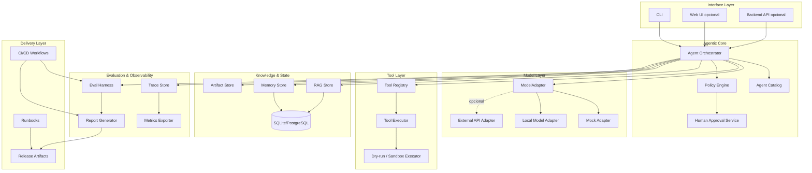

### 7.1 Contenedores principales

| Contenedor | Responsabilidad | Persistencia | Riesgo |
|---|---|---|---|
| CLI/Web/API | Interfaz de operación y administración. | No obligatoria. | Bajo/medio. |
| Agent Orchestrator | Coordina agentes, modelos, herramientas, políticas y resultados. | Traces, run state. | Alto. |
| Agent Catalog | Registra agentes, roles, capacidades y contratos. | Agent Cards. | Medio. |
| ModelAdapter | Abstrae proveedores LLM/mock/local/external. | Config y trazas. | Medio/alto si usa API externa. |
| ToolRegistry | Declara herramientas, schemas, permisos y side effects. | Tool Cards. | Alto. |
| Policy Engine | Decide allow/block/approval. | Policy configs. | Alto. |
| Human Approval Service | Gestiona solicitudes y decisiones humanas. | Approval queue. | Alto. |
| RAG Store | Indexa y recupera conocimiento. | Índices, documentos, citas. | Medio/alto. |
| Memory Store | Mantiene estado conversacional o persistente. | JSON/SQLite/PostgreSQL. | Medio. |
| Eval Harness | Ejecuta evaluaciones y quality gates. | Eval reports. | Medio. |
| Observability Store | Registra traces/logs/metrics. | JSONL/OTel/exporters. | Medio. |
| CI/CD Workflows | Automatiza tests, seguridad y publicación. | Workflows, artifacts. | Alto si remoto. |

---

## 8. Vista C4 Nivel 3 — Componentes

La vista de componentes define la estructura interna del **Agentic Core**.

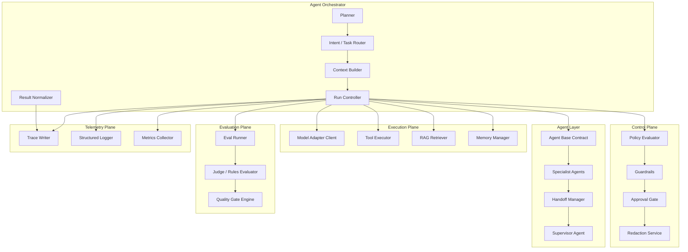

### 8.1 Componentes del Agentic Core

| Componente | Responsabilidad | Contrato mínimo |
|---|---|---|
| Planner | Descompone tareas y define plan de ejecución. | input, objetivo, restricciones, pasos, límites. |
| Task Router | Decide agente/herramienta/ruta. | task_type, confidence, selected_agent. |
| Context Builder | Construye contexto con memoria/RAG/política. | context_sources, citations, memory_refs. |
| Run Controller | Ejecuta ciclo principal y aplica límites. | run_id, max_steps, timeout, dry_run. |
| Result Normalizer | Estandariza respuestas y artefactos. | output_schema, status, errors, artifacts. |
| Policy Evaluator | Evalúa reglas de autorización. | action, subject, environment, decision. |
| Guardrails | Valida entrada, salida y tool behavior. | checks, violations, severity. |
| Approval Gate | Pausa o requiere revisión humana. | request_id, approver_role, decision. |
| Trace Writer | Registra eventos estructurados. | run_id, span_id, event_type. |
| Eval Runner | Ejecuta pruebas automatizadas. | eval_id, cases, metrics, pass/fail. |

---

## 9. Capas de referencia

La arquitectura MIASI se organiza en once capas. Cada capa debe tener contrato explícito, pruebas mínimas, trazabilidad y responsabilidades separadas.

| Capa | Responsabilidad | Entradas | Salidas | Artefactos |
|---|---|---|---|---|
| Interface Layer | Exponer CLI, Web, API o chat. | Requests, comandos, formularios. | Respuestas, reportes, tareas. | CLI docs, API spec. |
| Agent Layer | Orquestar agentes y roles. | TaskRequest, contexto, política. | AgentResult, ToolRequests. | Agent Cards. |
| Model Layer | Abstraer LLM/mock/local/API. | ModelRequest. | ModelResponse. | Model configs, traces. |
| Tool Layer | Ejecutar herramientas controladas. | ToolCall. | ToolResult. | Tool Cards, logs. |
| Knowledge Layer | Recuperar conocimiento externo/documental. | Query, filters. | RetrievedContext. | RAG indexes, citations. |
| State/Memory Layer | Persistir estado, memoria y sesiones. | Events, summaries. | MemoryContext. | SQLite/JSON/PostgreSQL. |
| Evaluation Layer | Medir comportamiento y regresiones. | Eval cases, outputs. | Scores, verdicts. | Eval reports. |
| Security Layer | Aplicar secretos, permisos, policy, approval. | ActionRequest. | Decision. | Policies, approvals. |
| Observability Layer | Registrar logs/traces/metrics. | Events. | Telemetry. | JSONL/OTel. |
| Delivery Layer | Construir, probar, empaquetar y desplegar. | Commits, configs. | Artifacts, releases. | CI workflows, runbooks. |
| Governance Layer | Gestionar riesgos, documentación y decisiones. | ADRs, risks, audits. | Compliance evidence. | Risk register, ADRs. |

---

## 10. Contratos entre capas

Los contratos evitan acoplamiento accidental y permiten evaluación automática.

### 10.1 `AgentRequest`

```yaml
agent_request:
  request_id: string
  user_id: string | null
  project_id: string
  task: string
  inputs: object
  constraints:
    dry_run: true
    max_steps: integer
    max_cost_usd: number
    allow_external_network: false
  context_refs:
    - type: memory | rag | file | issue | repo
      ref: string
  security:
    environment: local | test | ci | staging | production
    approval_required: boolean
```

### 10.2 `ToolCall`

```yaml
tool_call:
  tool_name: string
  args: object
  reason: string
  side_effects: none | read | write | external | destructive
  dry_run: true
  policy_decision_ref: string
  approval_ref: string | null
```

### 10.3 `ToolResult`

```yaml
tool_result:
  ok: boolean
  output: object | string | null
  error: string | null
  artifacts:
    - path: string
      type: json | markdown | csv | log | binary
  metadata:
    duration_ms: integer
    tool_version: string
```

### 10.4 `ModelRequest`

```yaml
model_request:
  provider: mock | local | openai | gemini | mistral | huggingface | other
  model: string
  messages: list
  tools: list
  response_format: json_schema | text | markdown
  max_tokens: integer
  temperature: number
  cost_guard:
    max_cost_usd: number
    estimate_before_call: boolean
```

### 10.5 `PolicyDecision`

```yaml
policy_decision:
  decision: allow | block | require_approval
  reasons:
    - string
  matched_rules:
    - string
  severity: low | medium | high | critical
  approval_required: boolean
```

### 10.6 `TraceEvent`

```yaml
trace_event:
  run_id: string
  span_id: string
  parent_span_id: string | null
  timestamp: string
  event_type: agent | model | tool | rag | memory | policy | eval | approval | error
  name: string
  attributes: object
```

---

## 11. Flujos principales

### 11.1 Flujo de conversación

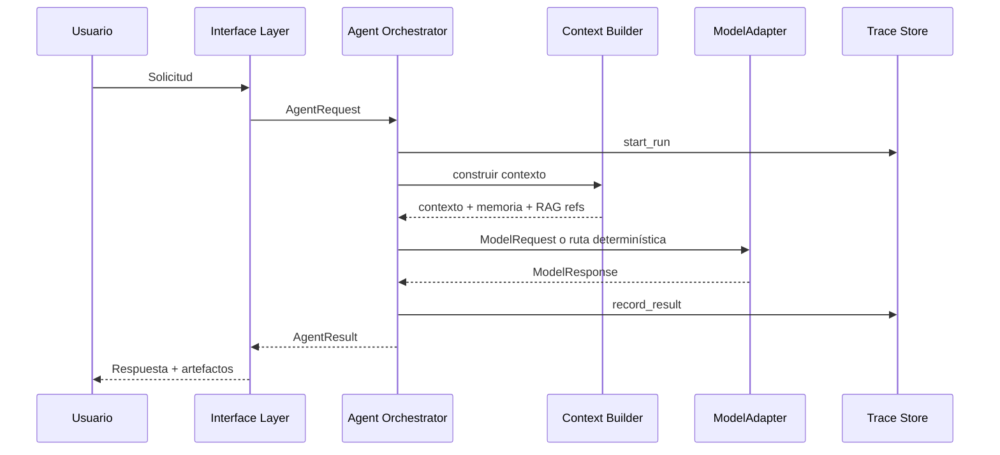

### 11.2 Flujo tool calling

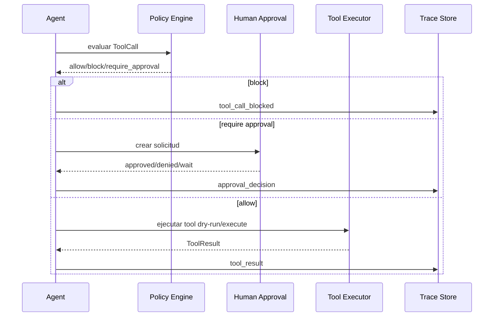

### 11.3 Flujo RAG

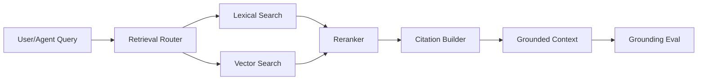

Reglas obligatorias del flujo RAG:

| Regla | Descripción |
|---|---|
| RAG-R01 | Todo chunk recuperado debe conservar fuente, ubicación y score. |
| RAG-R02 | Respuestas factuales derivadas de documentos deben poder citar evidencia. |
| RAG-R03 | El sistema debe distinguir entre evidencia, inferencia y recomendación. |
| RAG-R04 | La evaluación debe medir groundedness, cobertura y utilidad. |
| RAG-R05 | RAG no debe usarse como memoria indiscriminada. |

### 11.4 Flujo de memoria

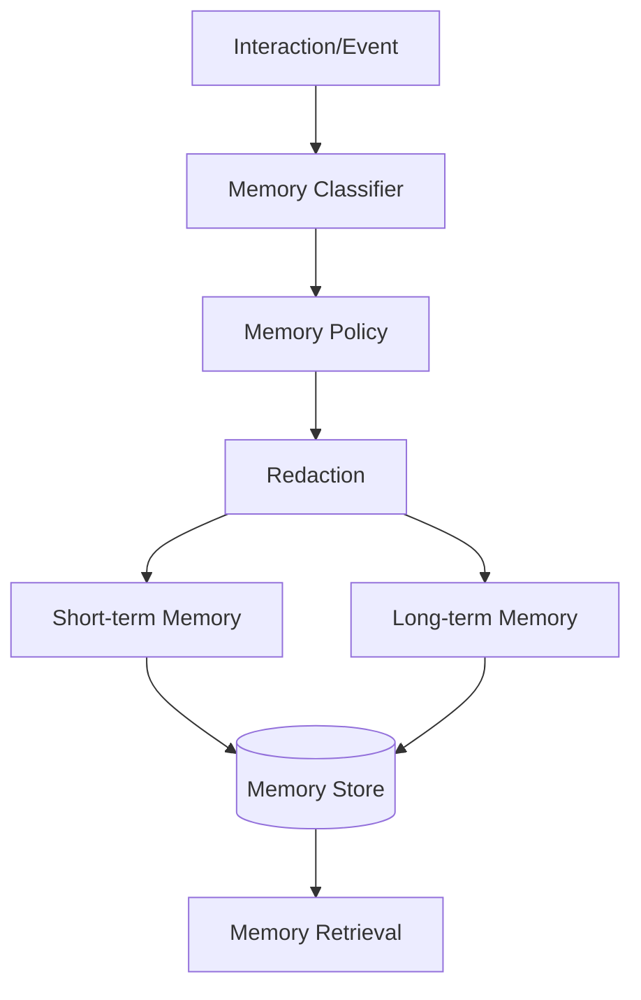

Reglas obligatorias:

| Regla | Descripción |
|---|---|
| MEM-R01 | No toda interacción debe persistirse. |
| MEM-R02 | La memoria debe tener política de retención. |
| MEM-R03 | Datos sensibles deben redactarse o excluirse. |
| MEM-R04 | La memoria usada en una decisión debe quedar trazada. |
| MEM-R05 | Debe existir mecanismo de olvido o invalidación cuando aplique. |

### 11.5 Flujo de evaluación

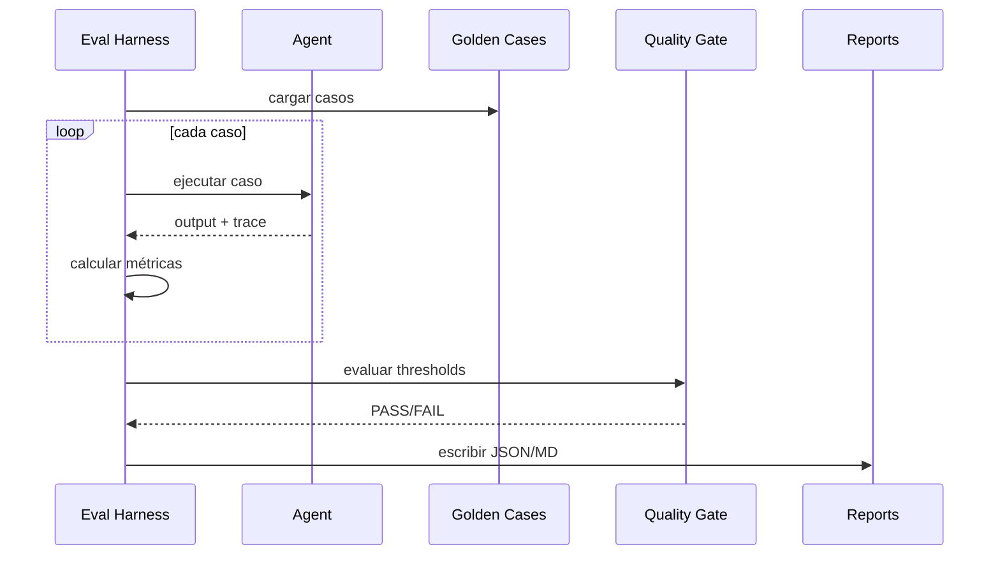

Métricas mínimas:

| Métrica | Aplica a | Descripción |
|---|---|---|
| task_completion | Todos los agentes | Cumplimiento de objetivo. |
| tool_selection | Agentes con herramientas | Selección correcta de herramienta. |
| tool_call_accuracy | Agentes con herramientas | Argumentos correctos. |
| groundedness | RAG | Respuesta respaldada por fuentes. |
| policy_compliance | Acciones | Respeto a permisos y bloqueos. |
| latency | Todos | Tiempo de respuesta. |
| cost | APIs externas | Costo estimado/real. |
| regression | Todos | No romper casos previos. |

### 11.6 Flujo de aprobación humana

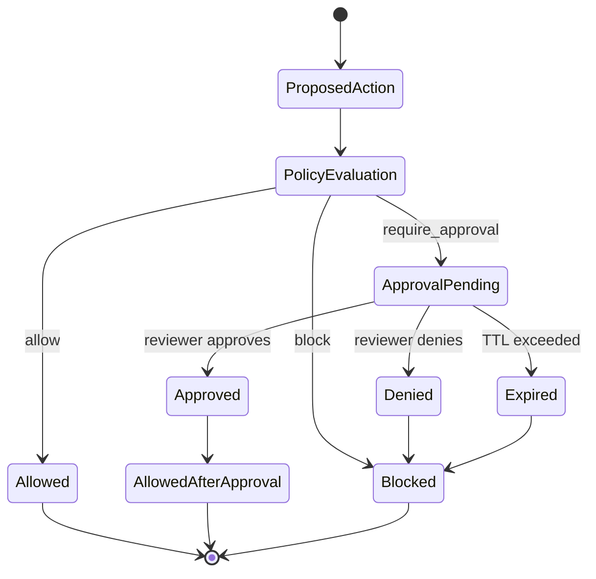

### 11.7 Flujo de trazabilidad

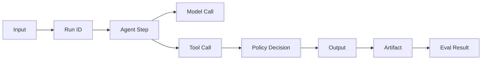

### 11.8 Flujo CI/CD

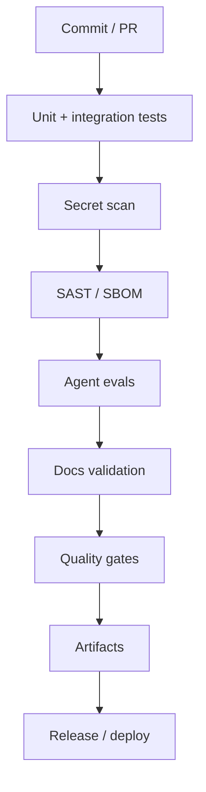

### 11.9 Flujo de incidente

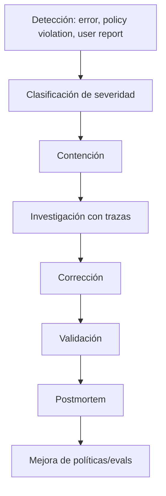

---

## 12. Patrones de despliegue

| Patrón | Descripción | Uso recomendado | Riesgos | Controles mínimos |
|---|---|---|---|---|
| Local-only | Todo corre en máquina local, sin red externa. | Laboratorios, MVP privado, herramientas propias. | Pérdida local, poca disponibilidad. | Backups, logs, tests. |
| Local + LLM externo opcional | Sistema local llama API externa solo si está configurada. | Tareas que requieren mejor razonamiento. | Costos, secretos, datos enviados. | Cost guard, redacción, API keys opcionales. |
| Local + modelo local | Usa Ollama/LM Studio u otro runtime local. | Privacidad, costo cero externo. | Recursos limitados, calidad variable. | Model benchmark, fallback. |
| Backend API | Agente expuesto por API propia. | Producto interno o multiusuario. | Auth, rate limits, seguridad. | AuthN/AuthZ, observabilidad, CI/CD. |
| Worker/event-driven | Tareas async, colas, jobs. | Procesos largos, evaluaciones, ETL. | Reintentos duplicados, side effects. | Idempotencia, queues, dedupe. |
| Producción controlada | Sistema usado con datos reales y operación formal. | Proyectos aplicados maduros. | Riesgo operacional real. | IAM, monitoreo, incident response, SLO/SLA. |

---

## 13. Diagrama Mermaid general

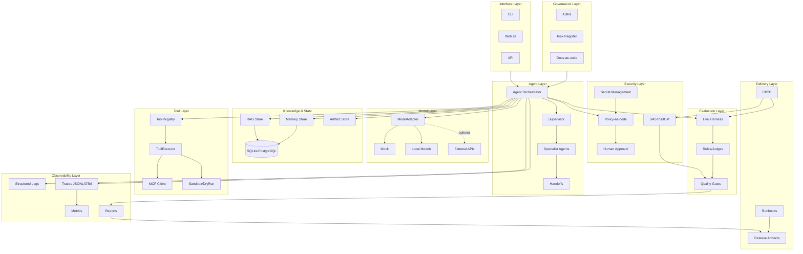

---

## 14. Matriz de decisiones arquitectónicas

| Decisión | Opción adoptada | Alternativas | Motivo | ADR sugerido |
|---|---|---|---|---|
| Formato documental | Markdown docs-as-code | Word/PDF manual | Versionable, revisable, automatizable. | ADR-0001, ADR-0002 |
| Diagramas | Mermaid + C4 | Imágenes manuales | Texto versionable y niveles de abstracción. | ADR-0003 |
| Arquitectura documental | Adaptación arc42 | Documento libre | Estructura profesional y reutilizable. | ADR-0005 |
| Modelos | ModelAdapter | SDK directo | Portabilidad multi-modelo. | ADR-0006 |
| Herramientas | ToolRegistry + ToolContract | Funciones sueltas | Seguridad, evaluación y trazabilidad. | ADR-0007 |
| Seguridad de acciones | Policy-as-code + approval | Validaciones ad hoc | Auditoría y control de autonomía. | ADR-0008 |
| Observabilidad | JSONL local + mapping OTel | Prints/logs sueltos | Trazabilidad y futura interoperabilidad. | ADR-0009 |
| RAG | Híbrido lexical/semantic opcional | Prompt-only | Grounding y recuperación verificable. | ADR-0010 |
| CI/CD | Quality gates incrementales | Ejecución manual | Reproducibilidad y confianza. | ADR-0011 |
| MCP | Conectores allowlisted | Integración libre | Reducir riesgo en tools externas. | ADR-0012 |

---

## 15. Riesgos arquitectónicos

| ID | Riesgo | Severidad | Impacto | Mitigación |
|---|---|---:|---|---|
| RA-01 | Acoplamiento a un proveedor LLM | Alta | Bloqueo técnico/costos. | ModelAdapter, tests mock/local. |
| RA-02 | Herramientas con efectos sin control | Crítica | Borrado, corrupción, exposición. | Dry-run, policy, approval. |
| RA-03 | Prompt injection | Alta | Exfiltración o acciones no deseadas. | Guardrails, aislamiento, input validation. |
| RA-04 | RAG sin grounding | Media/alta | Respuestas no verificables. | Citas, scores, evals. |
| RA-05 | Memoria contaminada | Alta | Decisiones incorrectas persistentes. | Memory policy, TTL, redaction. |
| RA-06 | Falta de observabilidad | Alta | Incidentes no diagnosticables. | Traces obligatorias. |
| RA-07 | Secretos expuestos | Crítica | Compromiso de cuentas/costos. | Secret management y scanning. |
| RA-08 | Dependencias vulnerables | Alta | Compromiso supply chain. | SAST/SBOM, pins, scanning. |
| RA-09 | Costos no controlados | Media/alta | Sobrecostos por API/modelo. | Cost guard, budgets, limits. |
| RA-10 | Producción prematura | Crítica | Daño operacional real. | Readiness gates y despliegue controlado. |

---

## 16. Relación con laboratorios AI_agents

La arquitectura consolida aprendizajes de los 80 laboratorios en capacidades de ingeniería.

| Bloque | Laboratorios | Capacidad arquitectónica consolidada |
|---|---|---|
| Fundamentos y agentes mock | LAB-AI-001 a LAB-AI-006 | Agent loop, tool calling manual, dry-run, contratos básicos. |
| RAG, embeddings y recuperación | LAB-AI-007 a LAB-AI-016 | Knowledge Layer, RAG Store, embeddings locales, vector store, cache. |
| Memoria y evaluación | LAB-AI-017 a LAB-AI-020 | Memory Store, Eval Harness, guardrails y seguridad inicial. |
| MCP y multiagentes | LAB-AI-021 a LAB-AI-030 | Tool integration, handoffs, multi-agent orchestration. |
| Repositorios y calidad | LAB-AI-031 a LAB-AI-050 | Repo analysis, CI/CD, contract testing, quality gates. |
| Industrialización | LAB-AI-051 a LAB-AI-074 | Publicación, APIs controladas, ModelAdapter avanzado, AgentOps, OTel. |
| Seguridad industrial | LAB-AI-075 a LAB-AI-078 | Secret management, SAST/SBOM, policy-as-code, human approval. |
| CI remoto e integración final | LAB-AI-079 a LAB-AI-080 | Remote sandbox CI, final readiness, baseline operacional local-first. |

### 16.1 Capacidades transversales heredadas

| Capacidad | Evidencia en la arquitectura |
|---|---|
| Modelos | Model Layer / ModelAdapter. |
| Herramientas | Tool Layer / ToolRegistry. |
| RAG | Knowledge Layer / RAG Store. |
| Memoria | State/Memory Layer. |
| Evaluación | Evaluation Layer / Eval Harness. |
| Observabilidad | Observability Layer. |
| Seguridad | Security Layer. |
| CI/CD | Delivery Layer. |
| Gobernanza | Governance Layer. |
| Documentación | Docs-as-code + ADRs. |

---

## 17. Aplicación a DevPilot Local

**DevPilot Local** será la primera implementación aplicada de esta arquitectura. Su objetivo es ayudar al usuario a gestionar un ciclo de vida de desarrollo de software con agentes.

### 17.1 Mapeo de arquitectura a DevPilot

| Capa MIASI | Implementación inicial en DevPilot Local |
|---|---|
| Interface Layer | CLI `devpilot` y eventualmente Web UI local. |
| Agent Layer | RequirementsAgent, ArchitectureAgent, CodeReviewAgent, TestPlannerAgent, SecurityAgent, ReleaseAgent. |
| Model Layer | MockModelAdapter, OllamaAdapter opcional, API adapters opcionales. |
| Tool Layer | Git tools, filesystem tools, pytest tool, markdown/report tools. |
| Knowledge Layer | Índice del repo, documentación, ADRs, issues, runbooks. |
| Memory Layer | SQLite local para proyectos, decisiones y runs. |
| Evaluation Layer | Tests, agent evals, regression cases. |
| Security Layer | Secret scan, SAST/SBOM, policy-as-code, approval. |
| Observability Layer | JSONL traces, reports, future OTel. |
| Delivery Layer | GitHub/GitLab workflows sandbox. |
| Governance Layer | ADRs, risk register, MIASI compliance. |

### 17.2 MVP recomendado para DevPilot

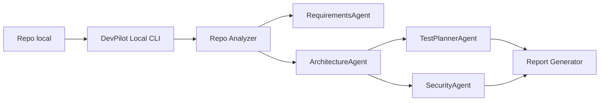

### 17.3 Casos de uso iniciales

| Caso de uso | Agentes involucrados | Outputs |
|---|---|---|
| Analizar repo | RepoAnalyzerAgent, ArchitectureAgent | mapa del repo, riesgos, módulos. |
| Crear historia técnica | RequirementsAgent | historia, criterios, tareas. |
| Revisar cambio | CodeReviewAgent, SecurityAgent | hallazgos, recomendaciones. |
| Ejecutar quality gate | TestPlannerAgent, EvalAgent | PASS/FAIL, reportes. |
| Preparar release | ReleaseAgent, DocumentationAgent | changelog, runbook, checklist. |

---

## 18. Tabla de datos persistidos

| Dato | Capa propietaria | Medio inicial | Sensibilidad | Retención sugerida |
|---|---|---|---|---|
| Agent Cards | Governance | Markdown/YAML | Baja/media | Permanente versionado. |
| Tool Cards | Tool/Governance | Markdown/YAML | Media | Permanente versionado. |
| Runs | Observability | JSONL/SQLite | Media | 90 días o por proyecto. |
| Tool calls | Observability | JSONL/SQLite | Media/alta | Según sensibilidad. |
| Model prompts/responses | Observability | JSONL opcional/redactado | Alta | Redactado, limitado. |
| Memory | State/Memory | SQLite/JSON | Media/alta | TTL por política. |
| RAG chunks | Knowledge | Files/vector store | Media | Según fuente. |
| Eval reports | Evaluation | JSON/Markdown | Baja/media | Permanente. |
| Approval decisions | Security | JSON/SQLite | Alta | Permanente/auditable. |
| Policies | Security/Governance | JSON/YAML | Media | Permanente versionado. |
| Secrets | Security | No versionado / vault real futuro | Crítica | No persistir en repo. |

---

## 19. Puntos de control de seguridad

| Punto de control | Capa | Momento | Bloqueante |
|---|---|---|---|
| Secret scan | Security/CI | Pre-commit/CI | Sí |
| Tool side-effect classification | Tool/Security | Registro de herramienta | Sí |
| Policy evaluation | Security | Antes de tool execution | Sí |
| Human approval | Security | Acciones críticas | Sí |
| RAG source validation | Knowledge/Security | Ingesta y respuesta | Sí en dominios críticos |
| Prompt injection check | Security | Entrada/RAG/tools | Sí si herramienta externa |
| Output validation | Security/Evaluation | Antes de devolver/ejecutar | Sí si output alimenta acción |
| SAST/SBOM | CI/Security | CI/CD | Sí para release |
| Cost guard | Model/Security | Antes de API externa | Sí |
| Audit trace | Observability | Durante run | Sí para operación |

---

## 20. Eventos observables

| Evento | Descripción | Atributos mínimos |
|---|---|---|
| `agent.run.started` | Inicio de ejecución. | run_id, agent_id, user_id, environment. |
| `agent.step.completed` | Paso de agente completado. | step_id, role, duration_ms, status. |
| `model.call.started` | Inicio de llamada a modelo. | provider, model, max_tokens, cost_guard. |
| `model.call.completed` | Fin de llamada a modelo. | tokens, latency, estimated_cost. |
| `tool.call.requested` | Herramienta solicitada. | tool_name, side_effects, dry_run. |
| `tool.call.completed` | Herramienta completada. | ok, duration, artifacts. |
| `policy.decision` | Decisión de política. | decision, severity, matched_rules. |
| `approval.requested` | Aprobación solicitada. | request_id, action, approver_role. |
| `approval.completed` | Aprobación finalizada. | decision, reviewer_role, ttl_status. |
| `rag.retrieval.completed` | Recuperación RAG. | query_id, sources, scores. |
| `memory.write` | Escritura de memoria. | memory_type, policy, redacted. |
| `eval.completed` | Evaluación completada. | eval_id, metrics, pass. |
| `incident.detected` | Incidente o anomalía. | severity, source, run_id. |

---

## 21. ADRs sugeridos

| ADR | Decisión | Prioridad |
|---|---|---|
| ADR-0006 | Adoptar `ModelAdapter` como frontera obligatoria de modelo. | Alta |
| ADR-0007 | Adoptar `ToolRegistry` y `ToolContract`. | Alta |
| ADR-0008 | Adoptar `PolicyEngine` para acciones. | Alta |
| ADR-0009 | Adoptar trazas JSONL y mapeo OpenTelemetry. | Alta |
| ADR-0010 | Adoptar arquitectura RAG híbrida opcional. | Media |
| ADR-0011 | Adoptar SQLite como persistencia local inicial. | Media |
| ADR-0012 | Adoptar MCP solo con allowlist y sandbox. | Alta |
| ADR-0013 | Separar baseline local-first de producción industrial. | Alta |
| ADR-0014 | Definir criterios de despliegue controlado. | Alta |

---

## 22. Arquitectura educativa vs baseline local-first vs producción industrial

| Dimensión | Arquitectura educativa | Baseline local-first | Producción industrial |
|---|---|---|---|
| Objetivo | Aprendizaje y pruebas. | Operación propia controlada. | Operación con usuarios/datos reales. |
| Modelos | Mock/local/API opcional. | ModelAdapter estable. | Proveedores gestionados, fallback, SLAs. |
| Seguridad | Guardrails básicos. | Secret scan, policy, approval. | IAM, RBAC, auditoría inmutable, compliance. |
| Observabilidad | Logs y trazas JSONL. | Tracing estructurado y reportes. | OTel/centralización, alertas, SLO/SLA. |
| Evaluación | Tests de laboratorio. | Eval harness y quality gates. | Evaluación continua y red teaming. |
| CI/CD | Local o sandbox. | Pipelines controlados. | Required checks, releases, rollback. |
| Datos | Sintéticos o locales. | Datos propios controlados. | Datos reales con políticas y privacidad. |
| Operación | Manual. | Runbooks y checklist. | On-call, incident response, postmortems. |

---

## 23. Criterios mínimos para adoptar esta arquitectura

Un proyecto puede declararse alineado con DOC-AI-003 solo si cumple:

- tiene capas separadas o justificación explícita para fusionarlas;
- usa `ModelAdapter` o ruta determinística sin LLM;
- declara herramientas mediante contrato;
- clasifica side effects;
- tiene `dry-run` por defecto para acciones con efectos;
- genera trazas estructuradas;
- tiene evaluación mínima;
- tiene política de secretos;
- tiene quality gates;
- documenta decisiones arquitectónicas;
- distingue claramente MVP, baseline local-first y producción industrial.

---

## 24. Referencias

- C4 Model. Official website. https://c4model.com/
- C4 Model — Diagrams. https://c4model.com/diagrams
- arc42 Template Overview. https://arc42.org/overview
- arc42 Documentation — Building Block View. https://docs.arc42.org/section-5/
- OpenAI Agents SDK. https://developers.openai.com/api/docs/guides/agents
- OpenAI Agents SDK — Guardrails and human review. https://developers.openai.com/api/docs/guides/agents/guardrails-approvals
- LangGraph Overview. https://docs.langchain.com/oss/python/langgraph/overview
- LangGraph Durable Execution. https://docs.langchain.com/oss/python/langgraph/durable-execution
- Model Context Protocol Specification. https://modelcontextprotocol.io/specification/2025-06-18
- MCP Tools. https://modelcontextprotocol.io/specification/2025-06-18/server/tools
- OpenTelemetry GenAI Semantic Conventions. https://opentelemetry.io/docs/specs/semconv/gen-ai/
- OpenTelemetry GenAI Agent Spans. https://opentelemetry.io/docs/specs/semconv/gen-ai/gen-ai-agent-spans/
- NIST AI RMF / GenAI Profile. https://www.nist.gov/itl/ai-risk-management-framework
- NIST AI 600-1 Generative AI Profile. https://www.nist.gov/publications/artificial-intelligence-risk-management-framework-generative-artificial-intelligence
- ISO/IEC 42001:2023. https://www.iso.org/standard/42001
- OWASP Top 10 for LLM Applications. https://owasp.org/www-project-top-10-for-large-language-model-applications/

---

## 25. Changelog

| Versión | Fecha | Cambio | Estado |
|---|---|---|---|
| 0.1.0 | 2026-05-30 | Versión inicial de arquitectura de referencia MIASI. | draft |
