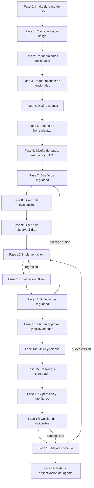

# DOC-AI-004 — Agentic SDLC: ciclo de vida industrial para agentes de IA

## 1. Resumen ejecutivo

Este documento define el **Agentic SDLC** de MIASI: un ciclo de vida completo para desarrollar, evaluar, asegurar, desplegar, operar, mejorar y retirar agentes de IA profesionales. Su propósito es convertir la experiencia acumulada en **AI_agents LAB-AI-001 a LAB-AI-080** en un proceso de ingeniería reproducible y auditable.

El Agentic SDLC no reemplaza el SDLC tradicional. Lo extiende para cubrir características propias de sistemas agénticos: razonamiento probabilístico, tool calling, autonomía graduada, RAG, memoria, gestión de contexto, evaluación de comportamiento, observabilidad de runs, políticas de permisos, human approval, gestión de costos y protección contra riesgos específicos de LLMs.

Este ciclo de vida está diseñado para tres contextos progresivos:

| Contexto | Propósito | Nivel esperado |
|---|---|---|
| Laboratorio educativo | Aprender y validar conceptos con bajo riesgo. | Prototipo controlado. |
| Baseline local-first | Ejecutar agentes localmente, con evaluación, trazas, seguridad y CI/CD controlado. | Operación local controlada. |
| Producción industrial | Operar con identidad real, infraestructura real, monitoreo continuo, SLO/SLA, auditoría, compliance y gestión de incidentes. | Producción gobernada. |

**Regla central:** ningún agente debe avanzar a ejecución real si no tiene propósito explícito, clasificación de riesgo, herramientas declaradas, evaluación mínima, trazabilidad, política de permisos, control de secretos, plan de observabilidad y criterios de rollback o contención.

## 2. Objetivo

Definir un ciclo de vida aplicable a cualquier agente real del ecosistema AI_agents, incluyendo **DevPilot Local**, **FreelanceOps Agent** y **MicroVenta Agent**. El proceso debe permitir:

- auditar el avance de un agente desde idea hasta operación;
- identificar artefactos obligatorios por fase;
- aplicar quality gates antes de cada promoción;
- integrar seguridad, evaluación, observabilidad y gobernanza desde el diseño;
- diferenciar prototipos, baseline local-first y producción industrial;
- convertir el proceso en flujos futuros de la plataforma **Agent-assisted SDLC personal**.

## 3. Fundamentos externos adoptados

MIASI adapta referencias externas, sin copiarlas ni declarar cumplimiento formal. Las adapta al contexto local-first, multi-modelo y production-oriented del proyecto.

| Referencia | Uso dentro del Agentic SDLC |
|---|---|
| NIST AI RMF / GenAI Profile | Clasificación de riesgos, trustworthiness, evaluación y gestión del ciclo de vida de IA generativa. |
| ISO/IEC 42001 | Gobierno, responsabilidades, mejora continua y sistema de gestión de IA. |
| NIST SSDF | Integración de prácticas de desarrollo seguro en cada fase del SDLC. |
| OWASP Top 10 for LLM Applications | Amenazas LLM: prompt injection, output handling inseguro, supply chain, data disclosure y otros. |
| OpenAI Agents SDK | Agentes con tools, handoffs, guardrails, tracing, human review y estado. |
| LangGraph | Durable execution, checkpoints, persistencia y human-in-the-loop. |
| Microsoft Foundry Agent Evaluators | Métricas de agentes: task completion, task adherence, intent resolution, tool selection y tool call accuracy. |
| OpenTelemetry GenAI | Convenciones para trazas, spans, eventos y métricas GenAI. |
| SLSA | Integridad de artefactos y supply chain. |
| CycloneDX | SBOM y Bill of Materials para reducir riesgo de dependencias y componentes. |

## 4. Principios normativos del Agentic SDLC

| ID | Principio | Regla normativa |
|---|---|---|
| ASDLCP-01 | Local-first | Todo agente debe tener una ruta funcional sin servicio externo obligatorio, salvo excepción documentada. |
| ASDLCP-02 | Multi-modelo | Todo agente con LLM debe integrarse mediante adaptadores, no mediante acoplamiento directo a un único proveedor. |
| ASDLCP-03 | Seguridad desde intake | La clasificación de riesgo ocurre antes del diseño técnico. |
| ASDLCP-04 | Herramientas gobernadas | Toda herramienta debe tener Tool Card, schema, side effects, permisos y dry-run si puede modificar estado. |
| ASDLCP-05 | Evaluación antes de ejecución | Todo agente debe tener Eval Plan antes de pasar a operación controlada. |
| ASDLCP-06 | Trazabilidad obligatoria | Todo run relevante debe generar eventos correlacionables. |
| ASDLCP-07 | Human approval | Acciones sensibles, externas, destructivas, costosas o irreversibles requieren aprobación o política equivalente. |
| ASDLCP-08 | Costo controlado | Todo uso de API externa debe tener presupuesto, límites y modo offline/mock. |
| ASDLCP-09 | CI/CD con seguridad | Tests, evals, secret scan, SAST/SBOM y quality gates deben integrarse al pipeline cuando el agente madure. |
| ASDLCP-10 | Retiro seguro | Todo agente debe poder desactivarse, revocar secretos y archivar evidencia. |

## 5. Diagrama Mermaid del ciclo de vida

## 6. Fases obligatorias del Agentic SDLC

### Fase 0 — Intake del caso de uso

**Propósito.** Capturar, delimitar y justificar el caso de uso antes de diseñar agentes o elegir modelos.

| Entradas |
|---|

| Idea inicial |

| Problema de negocio o técnico |

| Usuarios afectados |

| Contexto operativo |

| Restricciones conocidas |

| Actividades |
|---|

| Definir objetivo medible |

| Identificar stakeholders |

| Determinar si el problema requiere agente, workflow o software tradicional |

| Registrar hipótesis de valor |

| Definir límites explícitos de alcance |

| Salidas / artefactos |
|---|

| Use Case Intake |

| Problem Statement |

| Mapa de stakeholders |

| Decisión agente vs workflow |

| Responsables |
|---|

| Product Owner |

| AI Systems Engineer |

| Domain Owner |

| Quality gates |
|---|

| El caso de uso tiene objetivo medible |

| Existe criterio de éxito |

| Se declaró fuera de alcance |

| Se justificó por qué usar agente |

| Riesgos comunes |
|---|

| Automatizar por moda sin necesidad real |

| No identificar usuario final |

| Confundir agente con prompt |

| No delimitar side effects |

**Criterio PASS.** ['Caso de uso aprobado, valor esperado explícito y alcance limitado']

**Criterio de bloqueo.** ['No hay dueño del caso', 'No hay métrica de éxito', 'La acción propuesta es ilegal, insegura o fuera de política']

### Fase 1 — Clasificación de riesgo

**Propósito.** Determinar nivel de riesgo, autonomía permitida y controles mínimos antes del diseño técnico.

| Entradas |
|---|

| Use Case Intake |

| Datos involucrados |

| Herramientas previstas |

| Usuarios |

| Ambiente objetivo |

| Actividades |
|---|

| Clasificar sensibilidad de datos |

| Clasificar criticidad de acciones |

| Asignar nivel de autonomía A0-A7 |

| Definir controles obligatorios |

| Actualizar Risk Register |

| Salidas / artefactos |
|---|

| Risk Register |

| Autonomy Classification |

| Data Sensitivity Sheet |

| Control Baseline |

| Responsables |
|---|

| Security Engineer |

| AI Governance Owner |

| AI Systems Engineer |

| Quality gates |
|---|

| Nivel de riesgo asignado |

| Controles mínimos definidos |

| Autonomía máxima aprobada |

| Human approval definido si aplica |

| Riesgos comunes |
|---|

| Subestimar acciones destructivas |

| Ignorar datos personales |

| Permitir ejecución externa sin controles |

| No diferenciar local vs producción |

**Criterio PASS.** ['Riesgo clasificado y controles obligatorios documentados']

**Criterio de bloqueo.** ['Riesgo alto sin mitigación', 'Datos sensibles sin política', 'Acciones críticas sin approval']

### Fase 2 — Requerimientos funcionales

**Propósito.** Definir lo que el agente debe hacer, con criterios verificables y trazables.

| Entradas |
|---|

| Caso de uso aprobado |

| Stakeholders |

| Escenarios |

| Restricciones de negocio |

| Actividades |
|---|

| Escribir historias de usuario |

| Definir tareas del agente |

| Separar respuesta, recomendación y ejecución |

| Definir flujos principales y alternos |

| Salidas / artefactos |
|---|

| Functional Requirements |

| User Stories |

| Acceptance Criteria |

| Scope Matrix |

| Responsables |
|---|

| Product Owner |

| AI Systems Engineer |

| Domain Owner |

| Quality gates |
|---|

| Cada requerimiento es testeable |

| Cada acción tiene dueño |

| Cada salida esperada tiene formato |

| No hay promesas ambiguas |

| Riesgos comunes |
|---|

| Requerimientos tipo “que el agente entienda todo” |

| No separar lectura de escritura |

| No definir criterios de aceptación |

**Criterio PASS.** ['Requerimientos funcionales aprobados y rastreables a pruebas']

**Criterio de bloqueo.** ['Requerimientos no verificables o contradictorios']

### Fase 3 — Requerimientos no funcionales

**Propósito.** Definir atributos de calidad: seguridad, latencia, costo, privacidad, confiabilidad, evaluabilidad y operación.

| Entradas |
|---|

| Risk Register |

| Functional Requirements |

| Arquitectura objetivo preliminar |

| Actividades |
|---|

| Definir objetivos de calidad |

| Establecer restricciones de costo |

| Definir SLO/SLA si aplica |

| Definir retención de datos |

| Definir necesidades de observabilidad |

| Salidas / artefactos |
|---|

| NFR Specification |

| Cost Budget |

| Data Handling Sheet |

| Observability Requirements |

| Responsables |
|---|

| Architect |

| SRE/Operations |

| Security Engineer |

| Quality gates |
|---|

| NFR medibles |

| Límites de costo explícitos |

| Política de datos declarada |

| Observabilidad requerida |

| Riesgos comunes |
|---|

| No definir presupuesto de tokens/API |

| Ignorar latencia |

| No definir retención |

| No definir disponibilidad |

**Criterio PASS.** ['NFR aprobados y medibles']

**Criterio de bloqueo.** ['No hay restricciones de seguridad/costo para uso de APIs externas']

### Fase 4 — Diseño agentic

**Propósito.** Diseñar la arquitectura lógica del agente, sus roles, autonomía, memoria, herramientas y coordinación.

| Entradas |
|---|

| Functional Requirements |

| NFR |

| Risk Register |

| Actividades |
|---|

| Definir tipo de agente |

| Crear Agent Card |

| Definir orquestador y especialistas |

| Definir handoffs |

| Definir límites de autonomía |

| Definir estado y contexto |

| Salidas / artefactos |
|---|

| Agent Card |

| Agent Architecture Diagram |

| Handoff Map |

| Autonomy Contract |

| Responsables |
|---|

| AI Systems Architect |

| AI Engineer |

| Quality gates |
|---|

| Agent Card completa |

| Autonomía compatible con riesgo |

| Handoffs definidos |

| Fallbacks definidos |

| Riesgos comunes |
|---|

| Diseñar multiagentes sin necesidad |

| Dar autonomía excesiva |

| No definir fallback |

| No definir estado |

**Criterio PASS.** ['Diseño agentic revisado y aprobado']

**Criterio de bloqueo.** ['Agente ejecutor sin política ni trazas', 'Handoffs inseguros o no verificables']

### Fase 5 — Diseño de herramientas

**Propósito.** Diseñar tool contracts seguros, testeables y gobernados por política.

| Entradas |
|---|

| Agent Card |

| Acciones requeridas |

| Risk Register |

| Actividades |
|---|

| Crear Tool Cards |

| Definir schemas de entrada/salida |

| Clasificar side effects |

| Definir dry-run |

| Definir permisos |

| Definir idempotencia y rollback |

| Salidas / artefactos |
|---|

| Tool Card |

| Tool Registry Spec |

| Permission Matrix |

| Dry-run Contract |

| Responsables |
|---|

| Tool Engineer |

| Security Engineer |

| AI Engineer |

| Quality gates |
|---|

| Toda herramienta tiene schema |

| Side effects declarados |

| dry-run por defecto |

| Pruebas mínimas definidas |

| Riesgos comunes |
|---|

| Tool sin schema |

| Tool que escribe sin dry-run |

| Tool externa sin allowlist |

| Tool destructiva sin approval |

**Criterio PASS.** ['Herramientas aprobadas y registradas']

**Criterio de bloqueo.** ['Herramienta con credenciales embebidas o efectos no declarados']

### Fase 6 — Diseño de datos, memoria y RAG

**Propósito.** Definir qué datos entran al contexto, qué se recupera, qué se recuerda y cómo se evalúa el grounding.

| Entradas |
|---|

| Requerimientos |

| Data Handling Sheet |

| Fuentes documentales |

| Riesgo de datos |

| Actividades |
|---|

| Crear RAG Card |

| Crear Memory Card |

| Seleccionar lexical/vector/híbrido |

| Definir chunking |

| Definir política de citas |

| Definir retención y olvido |

| Salidas / artefactos |
|---|

| RAG Card |

| Memory Card |

| Knowledge Source Register |

| Grounding Policy |

| Responsables |
|---|

| Data Engineer |

| AI Engineer |

| Security Engineer |

| Quality gates |
|---|

| Fuentes autorizadas |

| Citas obligatorias si aplica |

| Memoria mínima necesaria |

| Evaluación de retrieval definida |

| Riesgos comunes |
|---|

| Meter todo al prompt |

| Recordar datos sensibles innecesarios |

| No citar fuentes |

| Confundir memoria con base transaccional |

**Criterio PASS.** ['Diseño de contexto aprobado y evaluable']

**Criterio de bloqueo.** ['Uso de datos sensibles sin autorización o sin política de retención']

### Fase 7 — Diseño de seguridad

**Propósito.** Diseñar controles contra fuga de secretos, prompt injection, herramientas inseguras, exfiltración y acciones no autorizadas.

| Entradas |
|---|

| Risk Register |

| Tool Cards |

| Data Handling Sheet |

| Agent Card |

| Actividades |
|---|

| Modelar amenazas |

| Definir guardrails |

| Definir secret management |

| Definir policy-as-code |

| Definir human approval |

| Definir sandboxing |

| Salidas / artefactos |
|---|

| Threat Model |

| Security Plan |

| Policy Card |

| Secret Policy |

| Approval Policy |

| Responsables |
|---|

| Security Engineer |

| AI Governance Owner |

| AI Systems Engineer |

| Quality gates |
|---|

| Amenazas modeladas |

| Políticas versionadas |

| Secret scan requerido |

| Approval para acciones críticas |

| Riesgos comunes |
|---|

| No considerar prompt injection |

| Guardar secretos en logs |

| Permitir tool injection |

| No validar outputs |

**Criterio PASS.** ['Diseño de seguridad aprobado']

**Criterio de bloqueo.** ['Secreto real expuesto', 'Acción crítica sin aprobación', 'Riesgo alto sin mitigación']

### Fase 8 — Diseño de evaluación

**Propósito.** Diseñar evaluación offline y quality gates antes de implementar o desplegar.

| Entradas |
|---|

| Functional Requirements |

| Agent Card |

| Tool Cards |

| RAG Card |

| Actividades |
|---|

| Definir Eval Plan |

| Definir golden cases |

| Definir métricas |

| Definir tool call accuracy |

| Definir regresión |

| Definir umbrales PASS/FAIL |

| Salidas / artefactos |
|---|

| Eval Plan |

| Golden Dataset |

| Evaluation Rubric |

| Regression Gate |

| Responsables |
|---|

| Evaluation Engineer |

| QA Engineer |

| AI Engineer |

| Quality gates |
|---|

| Métricas definidas |

| Casos offline disponibles |

| Gates configurables |

| Criterios de regresión |

| Riesgos comunes |
|---|

| Evaluar solo “si se ve bien” |

| No medir tool calls |

| No cubrir errores |

| No tener dataset de regresión |

**Criterio PASS.** ['Plan de evaluación aprobado']

**Criterio de bloqueo.** ['No existe forma objetiva de determinar PASS/FAIL']

### Fase 9 — Diseño de observabilidad

**Propósito.** Definir eventos, trazas, logs, métricas y auditoría desde el diseño.

| Entradas |
|---|

| Architecture Spec |

| Agent Card |

| Tool Cards |

| Eval Plan |

| Actividades |
|---|

| Definir trace schema |

| Definir eventos observables |

| Definir métricas de costo/latencia |

| Definir redacción de datos sensibles |

| Mapear a OpenTelemetry cuando aplique |

| Salidas / artefactos |
|---|

| Observability Plan |

| Trace Schema |

| Metric Catalog |

| Audit Event Catalog |

| Responsables |
|---|

| Observability Engineer |

| SRE/Operations |

| AI Engineer |

| Quality gates |
|---|

| Run_id definido |

| Eventos críticos trazados |

| PII/secrets redactados |

| Métricas mínimas definidas |

| Riesgos comunes |
|---|

| Logs sin correlación |

| Trazas con secretos |

| No medir tool latency/cost |

| No registrar policy decisions |

**Criterio PASS.** ['Plan de observabilidad aprobado']

**Criterio de bloqueo.** ['No hay trazabilidad para acciones con efecto']

### Fase 10 — Implementación

**Propósito.** Construir el agente y sus componentes siguiendo contratos, políticas y tests.

| Entradas |
|---|

| Agent Card |

| Tool Cards |

| Architecture Spec |

| Eval Plan |

| Security Plan |

| Actividades |
|---|

| Implementar agente |

| Implementar tools |

| Implementar ModelAdapter |

| Implementar memoria/RAG |

| Implementar trazas |

| Implementar policies |

| Escribir tests |

| Salidas / artefactos |
|---|

| Código fuente |

| Tests |

| Configuración |

| Documentación técnica |

| Artefactos de ejemplo |

| Responsables |
|---|

| AI Engineer |

| Software Engineer |

| QA Engineer |

| Quality gates |
|---|

| Tests unitarios pasan |

| dry-run por defecto |

| No dependencias externas obligatorias |

| No secretos reales |

| Riesgos comunes |
|---|

| Implementar sin tests |

| Acoplar a un proveedor |

| Romper contrato de herramientas |

| Escribir artefactos fuera de rutas permitidas |

**Criterio PASS.** ['Implementación funcional y testeada localmente']

**Criterio de bloqueo.** ['Falla seguridad básica, tests críticos o secret scanning']

### Fase 11 — Evaluación offline

**Propósito.** Ejecutar evaluaciones determinísticas y/o LLM-as-judge controladas sin depender de producción.

| Entradas |
|---|

| Código implementado |

| Eval Plan |

| Golden Dataset |

| Actividades |
|---|

| Ejecutar evals |

| Medir task completion |

| Medir tool selection/call accuracy |

| Medir grounding |

| Medir policy compliance |

| Registrar resultados |

| Salidas / artefactos |
|---|

| Eval Report JSON/MD |

| Regression Report |

| Failure Analysis |

| Responsables |
|---|

| Evaluation Engineer |

| AI Engineer |

| QA Engineer |

| Quality gates |
|---|

| Métricas sobre umbral |

| Errores analizados |

| Regresiones bloqueadas |

| Resultados versionados |

| Riesgos comunes |
|---|

| Aceptar resultados sin evidencia |

| No analizar fallos |

| Cambiar prompts sin regresión |

| No versionar dataset |

**Criterio PASS.** ['Evaluación offline en PASS']

**Criterio de bloqueo.** ['Task/tool/policy accuracy bajo umbral crítico']

### Fase 12 — Pruebas de seguridad

**Propósito.** Validar seguridad aplicada: secretos, SAST, SBOM, prompt injection, permisos y exfiltración.

| Entradas |
|---|

| Security Plan |

| Código |

| Tool Registry |

| Policies |

| Actividades |
|---|

| Secret scan |

| SAST/SBOM |

| Policy tests |

| Prompt injection tests |

| Output validation tests |

| Dependency review |

| Salidas / artefactos |
|---|

| Security Test Report |

| SBOM |

| SAST Report |

| Secret Scan Report |

| Responsables |
|---|

| Security Engineer |

| QA Engineer |

| AI Engineer |

| Quality gates |
|---|

| No secretos reales |

| Sin críticos abiertos |

| Policy tests pasan |

| Outputs validados |

| Riesgos comunes |
|---|

| Ignorar hallazgos críticos |

| No generar SBOM |

| No probar prompt injection |

| No validar tool permissions |

**Criterio PASS.** ['Pruebas de seguridad en PASS o con excepciones aprobadas']

**Criterio de bloqueo.** ['Secretos expuestos, críticos sin remediar, política bypassable']

### Fase 13 — Human approval y policy-as-code

**Propósito.** Asegurar que acciones sensibles pasen por política y aprobación humana antes de ejecución.

| Entradas |
|---|

| Policy Card |

| Tool Cards |

| Risk Register |

| Security Test Report |

| Actividades |
|---|

| Definir decisiones allow/block/require_approval |

| Crear matriz de acciones |

| Simular aprobaciones |

| Probar separación de funciones |

| Registrar audit trail |

| Salidas / artefactos |
|---|

| Policy Bundle |

| Decision Matrix |

| Human Approval Plan |

| Approval Audit Log |

| Responsables |
|---|

| Security Engineer |

| AI Governance Owner |

| Reviewer Humano |

| Quality gates |
|---|

| Acciones destructivas bloqueadas |

| Producción protegida |

| Approval token redactado |

| Separación de funciones aplicada |

| Riesgos comunes |
|---|

| Aprobaciones genéricas |

| Solicitante aprueba su propia acción |

| Approval sin expiración |

| Policy no versionada |

**Criterio PASS.** ['Policy y approval validados']

**Criterio de bloqueo.** ['Acción crítica ejecutable sin aprobación']

### Fase 14 — CI/CD y release

**Propósito.** Preparar promoción controlada con pruebas, artefactos, documentación, SBOM y release checklist.

| Entradas |
|---|

| Código aprobado |

| Eval Reports |

| Security Reports |

| Policies |

| Actividades |
|---|

| Configurar pipeline |

| Ejecutar tests |

| Publicar artefactos |

| Generar release notes |

| Verificar SBOM |

| Ejecutar readiness checklist |

| Salidas / artefactos |
|---|

| Release Checklist |

| CI Report |

| Artifacts |

| SBOM |

| Release Notes |

| Responsables |
|---|

| DevOps Engineer |

| Release Manager |

| QA Engineer |

| Quality gates |
|---|

| Pipeline en PASS |

| Artefactos reproducibles |

| Release checklist aprobado |

| Rollback plan definido |

| Riesgos comunes |
|---|

| Release manual sin evidencia |

| No ejecutar evals en CI |

| No validar seguridad |

| No conservar artefactos |

**Criterio PASS.** ['Release candidate aprobado']

**Criterio de bloqueo.** ['CI rojo, security gate fallido, artefactos sin trazabilidad']

### Fase 15 — Despliegue controlado

**Propósito.** Llevar el agente a un entorno controlado sin comprometer producción ni datos reales innecesarios.

| Entradas |
|---|

| Release candidate |

| Runbook |

| Deployment Card |

| Rollback Plan |

| Actividades |
|---|

| Preparar entorno |

| Validar configuración |

| Activar modo controlado |

| Ejecutar smoke tests |

| Monitorear trazas |

| Confirmar rollback |

| Salidas / artefactos |
|---|

| Deployment Record |

| Smoke Test Report |

| Rollback Plan |

| Environment Config |

| Responsables |
|---|

| SRE/Operations |

| DevOps Engineer |

| AI Engineer |

| Quality gates |
|---|

| Smoke tests pasan |

| Observabilidad activa |

| Rollback probado o documentado |

| Secrets fuera del repo |

| Riesgos comunes |
|---|

| Desplegar directo a producción |

| No tener rollback |

| No validar variables |

| Activar ejecución real sin policy |

**Criterio PASS.** ['Despliegue controlado exitoso']

**Criterio de bloqueo.** ['Sin rollback, sin observabilidad o con secretos expuestos']

### Fase 16 — Operación y monitoreo

**Propósito.** Operar el agente midiendo calidad, seguridad, costo, latencia, errores y comportamiento real.

| Entradas |
|---|

| Deployment Record |

| Observability Plan |

| Runbook |

| Actividades |
|---|

| Monitorear métricas |

| Revisar trazas |

| Auditar decisions |

| Medir costo |

| Revisar fallos |

| Ejecutar evals periódicas |

| Salidas / artefactos |
|---|

| Operational Dashboard |

| Run Logs |

| Cost Report |

| Quality Report |

| Responsables |
|---|

| SRE/Operations |

| AI Engineer |

| Product Owner |

| Quality gates |
|---|

| Métricas visibles |

| Alertas definidas |

| Costos bajo presupuesto |

| Incidentes registrados |

| Riesgos comunes |
|---|

| Operar sin logs |

| No revisar errores |

| No medir costo |

| No auditar acciones |

**Criterio PASS.** ['Operación estable y observable']

**Criterio de bloqueo.** ['Fallo recurrente no atendido, costo descontrolado o acción insegura']

### Fase 17 — Gestión de incidentes

**Propósito.** Responder a fallos, fugas, errores de herramienta, regresiones o comportamiento inseguro.

| Entradas |
|---|

| Alertas |

| Trazas |

| Reportes de usuario |

| Operational Dashboard |

| Actividades |
|---|

| Clasificar severidad |

| Contener impacto |

| Desactivar agente/tool si aplica |

| Recolectar evidencia |

| Corregir |

| Hacer postmortem |

| Salidas / artefactos |
|---|

| Incident Report |

| Postmortem |

| Remediation Plan |

| Lessons Learned |

| Responsables |
|---|

| Incident Commander |

| Security Engineer |

| AI Engineer |

| Product Owner |

| Quality gates |
|---|

| Incidente registrado |

| Contención ejecutada |

| Causa raíz analizada |

| Acciones preventivas definidas |

| Riesgos comunes |
|---|

| Borrar evidencia |

| No contener herramienta insegura |

| No informar al responsable |

| No actualizar tests |

**Criterio PASS.** ['Incidente cerrado con remediación verificable']

**Criterio de bloqueo.** ['Secreto filtrado sin rotación, daño sin contención o reincidencia sin fix']

### Fase 18 — Mejora continua

**Propósito.** Actualizar agentes, políticas, datasets, prompts, herramientas y documentación con control de regresión.

| Entradas |
|---|

| Operational Reports |

| Incident Reports |

| Eval Reports |

| Feedback |

| Actividades |
|---|

| Priorizar mejoras |

| Actualizar evals |

| Refactorizar |

| Recalibrar políticas |

| Actualizar docs |

| Ejecutar regresión |

| Salidas / artefactos |
|---|

| Improvement Backlog |

| Updated Evals |

| ADR |

| Changelog |

| Regression Report |

| Responsables |
|---|

| Product Owner |

| AI Engineer |

| Evaluation Engineer |

| Quality gates |
|---|

| Cambios trazados |

| Regresión en PASS |

| ADRs actualizados |

| Mejoras justificadas |

| Riesgos comunes |
|---|

| Cambiar prompts en caliente |

| No versionar evals |

| Optimizar sin métrica |

| Ignorar deuda técnica |

**Criterio PASS.** ['Mejora integrada sin regresiones']

**Criterio de bloqueo.** ['Cambio rompe quality gates o reduce seguridad']

### Fase 19 — Retiro o desactivación del agente

**Propósito.** Desactivar, archivar o reemplazar agentes de forma segura y auditable.

| Entradas |
|---|

| Decisión de retiro |

| Operational Reports |

| Risk Register |

| Actividades |
|---|

| Notificar usuarios |

| Desactivar herramientas |

| Archivar artefactos |

| Exportar datos permitidos |

| Revocar secretos |

| Actualizar documentación |

| Salidas / artefactos |
|---|

| Decommission Plan |

| Archive Record |

| Secret Revocation Record |

| Final Report |

| Responsables |
|---|

| Product Owner |

| SRE/Operations |

| Security Engineer |

| Quality gates |
|---|

| Secrets revocados |

| Datos tratados según política |

| Artefactos archivados |

| Usuarios informados |

| Riesgos comunes |
|---|

| Dejar credenciales activas |

| Eliminar evidencia sin archivo |

| No migrar dependencias |

| No documentar retiro |

**Criterio PASS.** ['Agente retirado sin riesgo residual relevante']

**Criterio de bloqueo.** ['Credenciales activas, datos huérfanos o dependencia crítica no migrada']

## 7. Artefactos obligatorios del Agentic SDLC

| Artefacto | Propósito | Fase primaria | Obligatorio cuando |
|---|---|---|---|

| Agent Card | Define identidad, propósito, autonomía, herramientas, límites, riesgos y owner del agente. | Fase 4 | Todo agente no trivial |

| Tool Card | Contrato de herramienta, schema, side effects, dry-run, permisos, pruebas y rollback. | Fase 5 | Toda herramienta |

| Model Card | Proveedor, adapter, costos, límites, fallback, riesgos y política de uso. | Fases 4, 10 | Todo agente con LLM |

| RAG Card | Fuentes, chunking, retrieval, citas, grounding, freshness y evaluación. | Fase 6 | Agentes con conocimiento documental |

| Memory Card | Tipo de memoria, retención, olvido, sensibilidad y pruebas. | Fase 6 | Agentes con estado/memoria |

| Eval Plan | Métricas, datasets, casos, umbrales y regresión. | Fase 8 | Todo agente operacional |

| Risk Register | Riesgos, severidad, controles, owner, estado y evidencia. | Fases 1, 7, 17 | Todo proyecto |

| Threat Model | Amenazas, vectores, mitigaciones y controles. | Fase 7 | Agentes con herramientas, datos o APIs |

| Policy Card | Reglas allow/block/approval, ambientes, roles, herramientas y excepciones. | Fase 13 | Agentes con acciones |

| Human Approval Plan | Flujo de aprobación, roles, TTL, separación de funciones y audit trail. | Fase 13 | Acciones críticas |

| Observability Plan | Trazas, logs, métricas, eventos, correlación y redacción. | Fase 9 | Todo agente operacional |

| Release Checklist | Condiciones para promover artefactos. | Fase 14 | Todo release |

| Runbook | Operación, troubleshooting, rollback, incidentes y soporte. | Fases 15, 16 | Todo despliegue controlado |

| Incident Report | Registro, impacto, causa raíz, contención y acciones correctivas. | Fase 17 | Todo incidente |

## 8. Matriz fase → artefacto

| Fase | Artefactos mínimos | Artefactos condicionales |
|---|---|---|

| 0. Intake del caso de uso | Use Case Intake, Problem Statement | Stakeholder Map |

| 1. Clasificación de riesgo | Risk Register, Autonomy Classification | Data Sensitivity Sheet |

| 2. Requerimientos funcionales | Functional Requirements, Acceptance Criteria | Scope Matrix |

| 3. Requerimientos no funcionales | NFR Specification, Cost Budget | Data Handling Sheet |

| 4. Diseño agentic | Agent Card | Handoff Map, Autonomy Contract |

| 5. Diseño de herramientas | Tool Card, Tool Registry Spec | Rollback Plan |

| 6. Diseño de datos, memoria y RAG | RAG Card / Memory Card cuando aplique | Knowledge Source Register |

| 7. Diseño de seguridad | Threat Model, Security Plan, Policy Card | Secret Policy, Approval Policy |

| 8. Diseño de evaluación | Eval Plan, Golden Dataset | LLM-as-judge Rubric |

| 9. Diseño de observabilidad | Observability Plan, Trace Schema | OpenTelemetry Mapping |

| 10. Implementación | Código, tests, configuración | Demo artifacts |

| 11. Evaluación offline | Eval Report | Failure Analysis |

| 12. Pruebas de seguridad | Security Test Report, SBOM | Exception Register |

| 13. Human approval y policy-as-code | Policy Bundle, Decision Matrix | Approval Audit Log |

| 14. CI/CD y release | Release Checklist, CI Report | Provenance/SLSA evidence |

| 15. Despliegue controlado | Deployment Record, Smoke Test Report | Rollback Evidence |

| 16. Operación y monitoreo | Operational Dashboard, Run Logs | Cost Report |

| 17. Gestión de incidentes | Incident Report, Postmortem | Customer/User Notice |

| 18. Mejora continua | Improvement Backlog, Regression Report | ADR |

| 19. Retiro o desactivación del agente | Decommission Plan, Archive Record | Secret Revocation Record |

## 9. Matriz fase → quality gate

| Fase | Gate principal | Evidencia requerida | Resultado esperado |
|---|---|---|---|

| 0. Intake del caso de uso | Use case viable | Use Case Intake | PASS, FAIL o BLOCKED documentado |

| 1. Clasificación de riesgo | Riesgo clasificado | Risk Register | PASS, FAIL o BLOCKED documentado |

| 2. Requerimientos funcionales | Requerimientos testeables | Acceptance Criteria | PASS, FAIL o BLOCKED documentado |

| 3. Requerimientos no funcionales | NFR medibles | NFR Spec | PASS, FAIL o BLOCKED documentado |

| 4. Diseño agentic | Agent Card aprobada | Agent Card | PASS, FAIL o BLOCKED documentado |

| 5. Diseño de herramientas | Tool contracts aprobados | Tool Cards | PASS, FAIL o BLOCKED documentado |

| 6. Diseño de datos, memoria y RAG | Contexto y memoria aprobados | RAG/Memory Cards | PASS, FAIL o BLOCKED documentado |

| 7. Diseño de seguridad | Threat model y security plan aprobados | Threat Model | PASS, FAIL o BLOCKED documentado |

| 8. Diseño de evaluación | Eval plan aprobado | Eval Plan | PASS, FAIL o BLOCKED documentado |

| 9. Diseño de observabilidad | Observability plan aprobado | Trace Schema | PASS, FAIL o BLOCKED documentado |

| 10. Implementación | Tests unitarios PASS | pytest / unit tests | PASS, FAIL o BLOCKED documentado |

| 11. Evaluación offline | Evals offline PASS | Eval Report | PASS, FAIL o BLOCKED documentado |

| 12. Pruebas de seguridad | Security gates PASS | Secret/SAST/SBOM reports | PASS, FAIL o BLOCKED documentado |

| 13. Human approval y policy-as-code | Policy/approval PASS | Decision Matrix | PASS, FAIL o BLOCKED documentado |

| 14. CI/CD y release | Release candidate PASS | CI Report | PASS, FAIL o BLOCKED documentado |

| 15. Despliegue controlado | Smoke test PASS | Deployment Record | PASS, FAIL o BLOCKED documentado |

| 16. Operación y monitoreo | Operación observable | Dashboard/logs | PASS, FAIL o BLOCKED documentado |

| 17. Gestión de incidentes | Incidente cerrado | Postmortem | PASS, FAIL o BLOCKED documentado |

| 18. Mejora continua | Regresión PASS | Regression Report | PASS, FAIL o BLOCKED documentado |

| 19. Retiro o desactivación del agente | Retiro seguro | Archive Record | PASS, FAIL o BLOCKED documentado |

## 10. Matriz fase → laboratorio AI_agents relacionado

| Fase | Laboratorios base | Capacidades heredadas |
|---|---|---|

| 0. Intake del caso de uso | LAB-AI-001..002 | agente vs workflow, ruta local-first |

| 1. Clasificación de riesgo | LAB-AI-020, 075..078 | riesgo, seguridad, autonomía |

| 2. Requerimientos funcionales | LAB-AI-031..050 | requisitos, trazabilidad, repo analysis |

| 3. Requerimientos no funcionales | LAB-AI-061..074, 080 | quality attributes, costo, operación |

| 4. Diseño agentic | LAB-AI-001..012, 022..023 | orquestación, multiagentes, autonomía |

| 5. Diseño de herramientas | LAB-AI-003..006, 020, 077 | tool calling, permisos, dry-run |

| 6. Diseño de datos, memoria y RAG | LAB-AI-007..018 | RAG, embeddings, vector stores, memoria |

| 7. Diseño de seguridad | LAB-AI-020, 075..078 | guardrails, secretos, SAST/SBOM, policy |

| 8. Diseño de evaluación | LAB-AI-019, 033..050, 080 | eval harness, quality gates |

| 9. Diseño de observabilidad | LAB-AI-018, 071..074, 080 | trazas JSONL, OpenTelemetry local, AgentOps |

| 10. Implementación | LAB-AI-001..080 | implementación modular y tests |

| 11. Evaluación offline | LAB-AI-019, 033..050 | evaluación offline y regresión |

| 12. Pruebas de seguridad | LAB-AI-075..076 | secret management, supply chain security |

| 13. Human approval y policy-as-code | LAB-AI-077..078 | policy-as-code y approval workflow |

| 14. CI/CD y release | LAB-AI-045..053, 079 | CI/CD, release, artefactos |

| 15. Despliegue controlado | LAB-AI-079..080 | CI remoto sandbox y readiness |

| 16. Operación y monitoreo | LAB-AI-071..074, 080 | observabilidad operacional |

| 17. Gestión de incidentes | LAB-AI-071..080 | incidentes, trazas, reportes |

| 18. Mejora continua | LAB-AI-019, 071..080 | mejora continua, evals, dashboards |

| 19. Retiro o desactivación del agente | LAB-AI-080 | baseline final y retiro controlado |

## 11. Matriz fase → automatización futura en DevPilot Local

| Fase | Automatización futura | Comando candidato | Nivel de automatización recomendado |
|---|---|---|---|

| 0. Intake del caso de uso | Formulario de intake y recomendación agente/workflow | `devpilot intake` | semiautomático |

| 1. Clasificación de riesgo | Risk scoring y autonomía sugerida | `devpilot classify-risk` | semiautomático con revisión |

| 2. Requerimientos funcionales | Generación de historias y criterios | `devpilot requirements` | asistido |

| 3. Requerimientos no funcionales | NFR checklist y presupuesto | `devpilot nfr` | asistido |

| 4. Diseño agentic | Generación Agent Card | `devpilot new-agent` | asistido |

| 5. Diseño de herramientas | Registro Tool Card y matriz permisos | `devpilot register-tool` | asistido + validación |

| 6. Diseño de datos, memoria y RAG | RAG/Memory design assistant | `devpilot design-context` | asistido |

| 7. Diseño de seguridad | Threat model y policy draft | `devpilot security-plan` | asistido + revisión |

| 8. Diseño de evaluación | Eval Plan y golden cases | `devpilot eval-plan` | asistido |

| 9. Diseño de observabilidad | Trace schema y métricas | `devpilot observability-plan` | asistido |

| 10. Implementación | Scaffold de agente y tests | `devpilot scaffold` | semiautomático |

| 11. Evaluación offline | Runner de evals offline | `devpilot run-evals` | automático |

| 12. Pruebas de seguridad | Security gates | `devpilot security-check` | automático |

| 13. Human approval y policy-as-code | Policy/approval validation | `devpilot policy-check` | automático + humano |

| 14. CI/CD y release | Release checklist | `devpilot release-check` | automático |

| 15. Despliegue controlado | Deployment checklist | `devpilot deploy-check` | semiautomático |

| 16. Operación y monitoreo | Operational report | `devpilot ops-report` | automático |

| 17. Gestión de incidentes | Incident report template | `devpilot incident` | asistido |

| 18. Mejora continua | Improvement backlog | `devpilot improvement-plan` | asistido |

| 19. Retiro o desactivación del agente | Decommission checklist | `devpilot decommission` | semiautomático |

## 12. Controles mínimos por nivel de autonomía

| Nivel | Descripción | Controles mínimos antes de operar |
|---|---|---|

| A0 | Asistente pasivo | Disclaimer, límites de uso, no tools, no memoria persistente sensible. |

| A1 | Recomendador | Eval básica, trazas, criterios de grounding si usa documentos. |

| A2 | Agente con herramientas en dry-run | Tool Cards, dry-run obligatorio, policy gate, tests de herramientas. |

| A3 | Ejecutor controlado | Policy-as-code, approval para acciones críticas, rollback, logs estructurados. |

| A4 | Agente con aprobación humana | Human Approval Plan, separación de funciones, audit trail, TTL de aprobaciones. |

| A5 | Agente operacional local-first | Eval suite, security gates, observabilidad, CI/CD local, runbook, incident plan. |

| A6 | Agente desplegado en producción controlada | SLO/SLA, IAM/RBAC, secret manager real, monitoreo, CI remoto protegido, rollback probado. |

| A7 | Sistema agéntico industrial | Gobernanza formal, auditoría inmutable, compliance, SRE, incident management, supply chain assurance. |

## 13. Relación con proyectos aplicados

### 13.1 DevPilot Local

DevPilot Local debe implementar este SDLC como producto: intake, risk classification, Agent Cards, Tool Cards, evals, security checks, CI/CD, runbooks e incident reports. Sus comandos futuros deben operar sobre los artefactos definidos aquí.

### 13.2 FreelanceOps Agent

FreelanceOps Agent debe usar este SDLC para controlar automatizaciones relacionadas con oportunidades, propuestas, mensajes, plantillas de entrega, análisis de riesgo de clientes y protección contra plataformas o solicitudes sospechosas. Sus primeras versiones deben limitarse a asistencia y generación de borradores, no ejecución automática en plataformas.

### 13.3 MicroVenta Agent

MicroVenta Agent debe aplicar el SDLC con especial rigor en datos de clientes, pagos, inventario, reportes financieros operativos, integración manual o semiautomática de pagos y separación clara entre contabilidad operativa y contabilidad formal.

## 14. Criterios de promoción entre etapas

| Promoción | Condición mínima | Evidencia |
|---|---|---|

| Idea → Diseño | Intake aprobado y riesgo clasificado | Use Case Intake + Risk Register |

| Diseño → Implementación | Agent Card, Tool Cards y Eval Plan aprobados | Artefactos en docs o config |

| Implementación → Evaluación | Tests unitarios PASS | pytest / reportes |

| Evaluación → Seguridad | Evals offline PASS | Eval Report |

| Seguridad → Release | No críticos abiertos | Security Reports |

| Release → Despliegue controlado | CI PASS y runbook disponible | CI Report + Runbook |

| Despliegue → Operación | Smoke tests y observabilidad PASS | Smoke Test Report + traces |

| Operación → Mejora | Métricas y feedback disponibles | Operational Report |

| Operación → Retiro | Plan de desactivación aprobado | Decommission Plan |

## 15. Anti-patrones bloqueantes

| Anti-patrón | Por qué bloquea | Fase donde debe detectarse |
|---|---|---|
| “Prompt = agente” | No hay arquitectura, herramientas, evaluación ni operación. | 0, 4 |
| Tool sin dry-run | Riesgo de efectos secundarios no controlados. | 5, 10 |
| LLM externo obligatorio sin fallback | Viola local-first y control de costo. | 3, 4, 10 |
| Memoria persistente sin política | Riesgo de retención indebida de datos. | 6, 7 |
| RAG sin evaluación de grounding | Riesgo de respuestas no sustentadas. | 6, 8, 11 |
| Acción crítica sin human approval | Riesgo operacional y de seguridad. | 7, 13 |
| Logs con secretos o datos sensibles | Riesgo de fuga de información. | 9, 12, 16 |
| Release sin evals ni security gates | No hay evidencia de calidad ni seguridad. | 14 |
| Producción sin runbook | No hay operación ni recuperación. | 15, 16 |
| Incidente sin postmortem | No hay aprendizaje ni prevención. | 17 |

## 16. Uso como proceso auditable

Para auditar un agente, el revisor debe poder responder:

1. ¿Cuál es el caso de uso y quién lo aprobó?
2. ¿Cuál es el nivel de riesgo y autonomía?
3. ¿Qué herramientas usa y qué side effects tienen?
4. ¿Qué datos consulta, recuerda o genera?
5. ¿Cómo se evalúa su comportamiento?
6. ¿Cómo se detectan regresiones?
7. ¿Qué acciones requieren aprobación humana?
8. ¿Dónde quedan las trazas y reportes?
9. ¿Cómo se despliega, opera y revierte?
10. ¿Cómo se desactiva de forma segura?

Si alguna de estas preguntas no puede responderse con artefactos versionados, el agente no debe avanzar a operación controlada.

## 17. Criterios de aceptación del documento

Este documento se considera aceptable en estado `draft` si:

- cubre las 20 fases obligatorias de 0 a 19;
- cada fase tiene propósito, entradas, actividades, salidas, responsables, gates, riesgos, PASS y bloqueo;
- incluye artefactos obligatorios;
- incluye matrices fase → artefacto, fase → gate, fase → laboratorio, fase → automatización;
- permite auditar un agente real;
- se integra con DevPilot Local como flujo automatizable;
- distingue laboratorio, baseline local-first y producción industrial.

Para pasar a `reviewed`, deberá ser contrastado contra un primer caso aplicado real: **DevPilot Local MVP**.

## 18. Referencias

- **NIST AI RMF / Generative AI Profile**. Gestión de riesgos de IA generativa y trustworthiness durante diseño, desarrollo, uso y evaluación.. URL: https://www.nist.gov/publications/artificial-intelligence-risk-management-framework-generative-artificial-intelligence

- **ISO/IEC 42001:2023**. Sistema de gestión de IA, riesgos, oportunidades, gobernanza y mejora continua.. URL: https://www.iso.org/standard/42001

- **NIST SSDF SP 800-218**. Prácticas de desarrollo seguro integrables al SDLC.. URL: https://csrc.nist.gov/pubs/sp/800/218/final

- **OWASP Top 10 for LLM Applications**. Riesgos específicos de aplicaciones LLM: prompt injection, output handling, supply chain y otros.. URL: https://owasp.org/www-project-top-10-for-large-language-model-applications/

- **OpenAI Agents SDK — Agents**. Agentes como aplicaciones que planifican, llaman herramientas, colaboran entre especialistas y mantienen estado.. URL: https://developers.openai.com/api/docs/guides/agents

- **OpenAI Agents SDK — Guardrails and Human Review**. Guardrails y revisión humana para decidir cuándo continuar, pausar o detener una ejecución.. URL: https://developers.openai.com/api/docs/guides/agents/guardrails-approvals

- **OpenAI Agents SDK — Tracing**. Trazas de LLM generations, tool calls, handoffs, guardrails y eventos personalizados.. URL: https://openai.github.io/openai-agents-python/tracing/

- **LangGraph Durable Execution**. Checkpoints y reanudación de workflows agénticos.. URL: https://docs.langchain.com/oss/python/langgraph/durable-execution

- **LangGraph Human-in-the-loop**. Pausar tool calls sensibles y esperar aprobación humana basada en política.. URL: https://docs.langchain.com/oss/python/langchain/human-in-the-loop

- **Microsoft Foundry Agent Evaluators**. Evaluadores de task completion, task adherence, intent resolution, tool call accuracy y tool selection.. URL: https://learn.microsoft.com/en-us/azure/foundry/concepts/evaluation-evaluators/agent-evaluators

- **OpenTelemetry GenAI Semantic Conventions**. Convenciones para spans, eventos y métricas de sistemas GenAI.. URL: https://opentelemetry.io/docs/specs/semconv/gen-ai/

- **OpenTelemetry GenAI Agent Spans**. Convenciones para llamadas de agentes y frameworks GenAI.. URL: https://opentelemetry.io/docs/specs/semconv/gen-ai/gen-ai-agent-spans/

- **SLSA**. Framework y checklist para proteger integridad de artefactos e infraestructura de la cadena de suministro.. URL: https://slsa.dev/

- **CycloneDX**. Estándar full-stack Bill of Materials para reducción de riesgo en supply chain.. URL: https://cyclonedx.org/

## 19. Changelog

| Versión | Fecha | Cambio | Estado |
|---|---|---|---|

| 0.1.0 | 2026-05-30 | Creación inicial de DOC-AI-004 con ciclo de vida de 20 fases, artefactos, matrices y gates. | draft |
