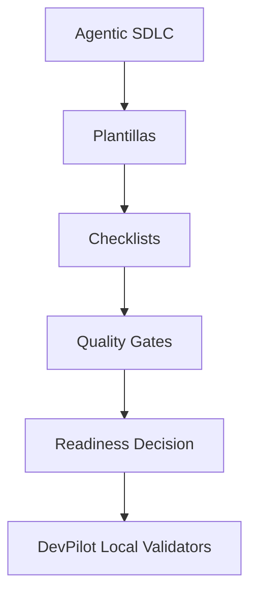

# DOC-AI-006 — Plantillas operativas, checklists y controles de producción para agentes IA

## 1. Resumen

DOC-AI-006 convierte MIASI en artefactos operativos reutilizables. Su propósito es que cada proyecto agéntico real —DevPilot Local, FreelanceOps Agent y MicroVenta Agent— pueda documentar, evaluar, auditar y promover agentes mediante plantillas y checklists consistentes.

Estas plantillas no son documentación decorativa. Son contratos de ingeniería que deben poder evolucionar hacia formularios, validadores y comandos CLI dentro de DevPilot Local.

## 2. Principio rector

```text
Sin plantilla completa no hay contrato.
Sin checklist aprobado no hay promoción.
Sin evidencia verificable no hay PASS.
```

## 3. Plantillas creadas

| Archivo | Uso principal | Gate asociado |
| --- | --- | --- |
| templates/agent_card.md | Contrato operativo del agente | agent_contract_complete |
| templates/tool_card.md | Contrato de herramienta, schema y side effects | tool_safety_pass |
| templates/model_card.md | Proveedor, modelo, costos y política de datos | model_route_controlled |
| templates/rag_card.md | Corpus, retrieval, citas y grounding | rag_grounding_pass |
| templates/memory_card.md | Persistencia, retención y privacidad | memory_safety_pass |
| templates/eval_card.md | Métricas, datasets y regresión | eval_readiness_pass |
| templates/policy_card.md | Decisiones allow/block/approval | policy_as_code_pass |
| templates/human_approval_card.md | Aprobación humana y separación de funciones | human_approval_pass |
| templates/observability_card.md | Trazas, logs, métricas y retención | observability_pass |
| templates/deployment_card.md | Despliegue, rollback y monitoreo | deployment_ready |
| templates/incident_report.md | Incidentes, RCA y acciones correctivas | incident_managed |
| templates/adr_template.md | Decisiones arquitectónicas | adr_required |
| templates/runbook_template.md | Operación y soporte | runbook_ready |
| templates/risk_register.md | Riesgos y mitigaciones | risk_review_pass |
| templates/threat_model.md | Amenazas y mitigaciones | threat_model_pass |
| templates/cost_budget.md | Presupuesto de costo IA | cost_guard_pass |
| templates/data_handling_sheet.md | Tratamiento de datos | data_policy_pass |
| templates/production_readiness_checklist.md | Go/no-go operacional | production_readiness_pass |

## 4. Checklists creados

| Archivo | Momento de uso | Bloquea promoción si falla |
| --- | --- | --- |
| checklists/checklist_agent_design.md | Diseño agentic | Sí |
| checklists/checklist_tool_safety.md | Diseño/implementación de herramientas | Sí |
| checklists/checklist_rag_grounding.md | Diseño y evaluación RAG | Sí |
| checklists/checklist_memory_safety.md | Diseño de memoria | Sí |
| checklists/checklist_eval_readiness.md | Evaluación offline y CI | Sí |
| checklists/checklist_security_readiness.md | Seguridad y pre-release | Sí |
| checklists/checklist_observability_readiness.md | Operación y monitoreo | Sí |
| checklists/checklist_human_approval.md | Acciones críticas | Sí |
| checklists/checklist_ci_cd.md | Release y pipelines | Sí |
| checklists/checklist_pre_production.md | Antes de producción controlada | Sí |
| checklists/checklist_post_deployment.md | Después del despliegue | Sí |

## 5. Relación con Agentic SDLC



## 6. Relación con DevPilot Local

DevPilot Local debe poder usar estas plantillas para generar comandos como:

```bash
devpilot new-agent --template agent_card
devpilot register-tool --template tool_card
devpilot validate-agent-card
devpilot run-checklist checklist_security_readiness
devpilot readiness-check --release v0.1.0
```

## 7. Criterios de aceptación DOC-AI-006

- Todas las plantillas tienen frontmatter YAML.
- Todas las plantillas incluyen propósito, cuándo usarla, campos obligatorios, opcionales, ejemplo, criterios de revisión y rechazo.
- Todos los checklists contienen ítem, descripción, obligatoriedad, evidencia, responsable, PASS, FAIL y referencia.
- Los criterios de bloqueo son explícitos.
- Los artefactos son compatibles con revisión manual, PR y automatización futura.
- Ninguna plantilla depende de un proveedor LLM único.
- Las rutas sin API, modelos locales y APIs controladas siguen soportadas.

## 8. Referencias base

- OpenAI Agents SDK — Agents, tools, handoffs, guardrails, tracing and human review. https://developers.openai.com/api/docs/guides/agents
- LangGraph durable execution, persistence and human-in-the-loop. https://docs.langchain.com/oss/python/langgraph/durable-execution
- Model Context Protocol Specification — resources, prompts and tools. https://modelcontextprotocol.io/specification/2025-06-18
- OpenTelemetry Semantic Conventions for GenAI systems and agents. https://opentelemetry.io/docs/specs/semconv/gen-ai/
- Microsoft Foundry Agent Evaluators. https://learn.microsoft.com/en-us/azure/foundry/concepts/evaluation-evaluators/agent-evaluators
- OWASP Top 10 for LLM Applications. https://owasp.org/www-project-top-10-for-large-language-model-applications/
- NIST AI Risk Management Framework. https://www.nist.gov/itl/ai-risk-management-framework
- NIST SSDF SP 800-218. https://csrc.nist.gov/pubs/sp/800/218/final
- SLSA — Supply-chain Levels for Software Artifacts. https://slsa.dev/
- CycloneDX Software Bill of Materials. https://cyclonedx.org/

## 9. Changelog

| Versión | Fecha | Cambio | Autor |
|---|---|---|---|
| 0.1.0 | 2026-05-31 | Creación de plantillas, checklists y controles de producción. | AI_agents |
