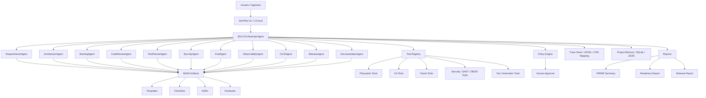
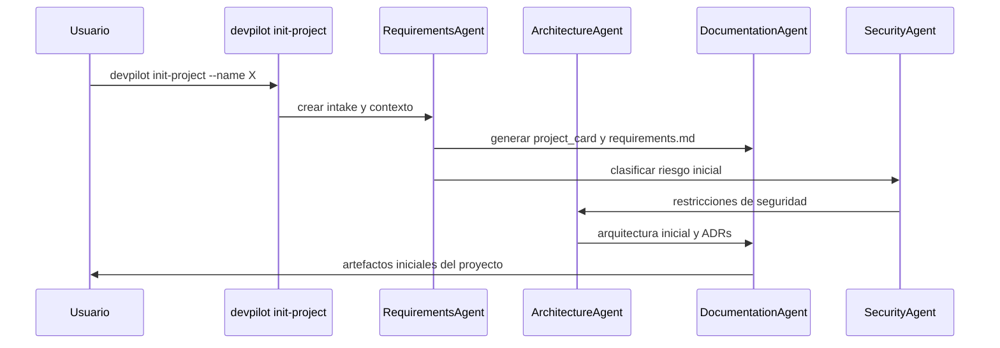

# DOC-AI-007 — Integración de MIASI con DevPilot Local / Agent-assisted SDLC personal

## 1. Resumen ejecutivo

Este documento define cómo la futura plataforma **DevPilot Local**, concebida como una plataforma **agent-assisted SDLC personal**, debe aplicar, validar y automatizar el **Modelo de Ingeniería de Sistemas Agénticos Inteligentes — MIASI**.

MIASI no debe entenderse como documentación decorativa. En el modelo operativo propuesto, MIASI funciona como **estándar ejecutable progresivo**: primero guía el trabajo humano mediante documentos, plantillas y checklists; luego se convierte en reglas verificables por DevPilot Local mediante validadores, comandos CLI, quality gates, trazas, reportes y flujos de aprobación.

La relación fundamental es:

```text
MIASI define el estándar.
DevPilot Local aplica el estándar.
Los agentes SDLC ejecutan tareas asistidas.
Los quality gates validan cumplimiento.
Las trazas y reportes dejan evidencia auditable.
```

DevPilot Local será el primer proyecto aplicado después de la ruta **AI_agents LAB-AI-001..LAB-AI-080**. Su función será ayudar a gestionar el ciclo completo de desarrollo de software con agentes: requerimientos, arquitectura, backlog, implementación, revisión, pruebas, seguridad, evaluación, CI/CD, documentación, release y operación.

## 2. Objetivo del documento

Definir una arquitectura de integración entre MIASI y DevPilot Local que permita:

1. Usar las plantillas MIASI como insumos formales de trabajo.
2. Convertir checklists en validadores automatizables.
3. Asociar cada agente SDLC con artefactos, herramientas, permisos y gates.
4. Trazar cada decisión importante mediante ADRs, logs y reportes.
5. Mantener local-first, multi-modelo, dry-run por defecto y API keys opcionales.
6. Preparar una ruta de implementación incremental para el MVP de DevPilot Local.
7. Evitar que DevPilot Local sea solo un “chat con prompts”, convirtiéndolo en una plataforma de ingeniería asistida por agentes.

## 3. Alcance

Este documento cubre:

- visión de integración;
- roles de agentes de la plataforma;
- relación entre agentes y plantillas MIASI;
- flujos operativos principales;
- comandos futuros de DevPilot Local;
- modelo de datos inicial;
- artefactos generados;
- quality gates;
- seguridad;
- observabilidad;
- roadmap MVP.

No cubre todavía:

- implementación de código de DevPilot Local;
- UI final;
- elección definitiva de framework web;
- integración real con GitHub/GitLab APIs;
- agentes con autonomía plena;
- ejecución destructiva sin aprobación;
- despliegue productivo multiusuario.

## 4. Principios de integración

| Principio | Regla normativa | Implicación en DevPilot Local |
|---|---|---|
| MIASI como fuente de verdad | Toda capacidad SDLC debe mapearse a un documento, plantilla o checklist MIASI. | Ningún agente nuevo se registra sin `Agent Card`. |
| Docs-as-code | Los artefactos se versionan en Git y se revisan por PR. | DevPilot debe poder crear, validar y actualizar Markdown/YAML/JSON. |
| Local-first | La plataforma debe operar sin red externa por defecto. | Primer MVP debe funcionar con mock/local tools. |
| Multi-modelo | Ningún agente debe depender de un único proveedor LLM. | Uso de `ModelAdapter` y perfiles mock/local/API. |
| Dry-run por defecto | Toda acción con side effects debe simularse primero. | Comandos de escritura requieren `--execute` o aprobación. |
| Policy-as-code | Permisos y acciones críticas se deciden por política. | `Policy Card` y gates determinan allow/block/review. |
| Human approval | Acciones críticas requieren revisión humana. | DevPilot debe pausar antes de ejecutar cambios sensibles. |
| Evaluación obligatoria | Todo agente debe tener eval mínima. | `Eval Card`, datasets y reportes son obligatorios. |
| Observabilidad | Toda ejecución relevante debe emitir trazas. | Cada comando debe generar `run_id`, eventos y reportes. |
| Seguridad desde diseño | Secretos, herramientas, RAG, memoria y CI/CD deben evaluarse. | SecurityAgent debe bloquear violaciones críticas. |

## 5. Arquitectura de integración

DevPilot Local se concibe como una plataforma local-first compuesta por:

- interfaz CLI inicial;
- núcleo de orquestación SDLC;
- catálogo de agentes especializados;
- registro de herramientas;
- repositorio de artefactos MIASI;
- memoria/proyecto local;
- evaluadores y quality gates;
- trazas y reportes;
- capa de policy-as-code y human approval.

### 5.1 Diagrama Mermaid de integración



### 5.2 Componentes de alto nivel

| Componente | Responsabilidad | Artefactos MIASI usados | Salida principal |
|---|---|---|---|
| `SDLCOrchestratorAgent` | Coordina el flujo completo SDLC asistido. | Agent Card, Policy Card, Runbook. | Plan de ejecución y trazas. |
| `AgentCatalog` | Registra agentes disponibles y sus contratos. | Agent Card. | Catálogo validado. |
| `ToolRegistry` | Registra herramientas y permisos. | Tool Card, checklist de tool safety. | Herramientas permitidas/bloqueadas. |
| `ProjectWorkspace` | Representa un repo/proyecto local. | Data Handling Sheet, Risk Register. | Contexto del proyecto. |
| `EvaluationHarness` | Ejecuta pruebas y evals. | Eval Card. | Reporte de evaluación. |
| `PolicyEngine` | Decide allow/block/review. | Policy Card. | Decisión de política. |
| `ApprovalQueue` | Gestiona aprobaciones humanas. | Human Approval Card. | Decisión humana auditable. |
| `TraceStore` | Persiste eventos de ejecución. | Observability Card. | JSONL / OTel mapping. |
| `ReportGenerator` | Genera reportes de ingeniería. | Runbook, ADR, readiness checklist. | Markdown/JSON. |

## 6. Roles de la plataforma

### 6.1 `RequirementsAgent`

**Propósito:** transformar ideas, conversaciones, bugs, necesidades o instrucciones en requerimientos formales, historias de usuario, criterios de aceptación y restricciones.

**Usa:**

- `agent_card.md`;
- `risk_register.md`;
- `data_handling_sheet.md`;
- `production_readiness_checklist.md`.

**Produce:**

- `requirements.md`;
- `user_stories.md`;
- `acceptance_criteria.md`;
- riesgos iniciales;
- preguntas abiertas.

**Gates:**

- no avanzar si el objetivo es ambiguo;
- no avanzar si hay datos sensibles sin clasificación;
- no avanzar si el caso de uso implica acciones críticas sin policy.

### 6.2 `ArchitectureAgent`

**Propósito:** diseñar arquitectura de solución, componentes, límites, dependencias, decisiones y trade-offs.

**Usa:**

- `adr_template.md`;
- `threat_model.md`;
- `deployment_card.md`;
- DOC-AI-003 — Arquitectura de referencia.

**Produce:**

- `architecture.md`;
- diagramas Mermaid/C4;
- ADRs;
- matriz de riesgos arquitectónicos;
- estrategia de despliegue.

**Gates:**

- no aprobar arquitectura sin capa de seguridad;
- no aprobar arquitectura sin observabilidad;
- no aprobar arquitectura que dependa obligatoriamente de un único proveedor LLM.

### 6.3 `BacklogAgent`

**Propósito:** convertir requerimientos y arquitectura en épicas, historias, tareas, criterios de aceptación y orden de implementación.

**Usa:**

- `agent_card.md`;
- `risk_register.md`;
- `production_readiness_checklist.md`.

**Produce:**

- `backlog.md`;
- `sprint_plan.md`;
- `task_breakdown.json`;
- matriz de prioridad.

**Gates:**

- no crear tareas sin criterio de aceptación;
- no crear tareas con acciones destructivas sin safety gate;
- no mezclar deuda técnica crítica con features sin visibilidad.

### 6.4 `CodeReviewAgent`

**Propósito:** revisar cambios de código, detectar riesgos, explicar diffs, proponer refactors y generar resúmenes técnicos.

**Usa:**

- `tool_card.md`;
- `eval_card.md`;
- `risk_register.md`;
- `checklist_agent_design.md`;
- `checklist_security_readiness.md`.

**Produce:**

- `code_review_report.md`;
- `change_summary.md`;
- hallazgos por severidad;
- propuesta de commit/PR summary.

**Gates:**

- bloquear si detecta secretos;
- bloquear si tests fallan;
- requerir aprobación si se modifican archivos críticos.

### 6.5 `TestPlannerAgent`

**Propósito:** diseñar y ejecutar estrategia de pruebas para cambios de software y agentes.

**Usa:**

- `eval_card.md`;
- `checklist_eval_readiness.md`;
- DOC-AI-004 — Agentic SDLC.

**Produce:**

- `test_plan.md`;
- comandos `pytest` sugeridos;
- casos mínimos;
- matriz de regresión.

**Gates:**

- no aprobar sin pruebas mínimas;
- no aprobar agentes sin eval offline;
- no aprobar RAG sin pruebas de grounding.

### 6.6 `SecurityAgent`

**Propósito:** ejecutar análisis de seguridad local: secretos, herramientas, permisos, side effects, SAST/SBOM, policy-as-code y human approval.

**Usa:**

- `threat_model.md`;
- `policy_card.md`;
- `human_approval_card.md`;
- `checklist_security_readiness.md`;
- `checklist_tool_safety.md`.

**Produce:**

- `security_report.md`;
- `threat_model.md` actualizado;
- decisiones allow/block/review;
- acciones de remediación.

**Gates:**

- bloquear secretos reales;
- bloquear herramientas destructivas sin aprobación;
- bloquear producción sin readiness;
- bloquear salida que exponga datos sensibles.

### 6.7 `EvalAgent`

**Propósito:** gestionar evaluación de agentes, herramientas, RAG, memoria, policy y regresión.

**Usa:**

- `eval_card.md`;
- `checklist_eval_readiness.md`;
- estándares de evaluación de DOC-AI-005.

**Produce:**

- `eval_report.json`;
- `eval_report.md`;
- matriz de métricas;
- resultados PASS/FAIL.

**Gates:**

- no aprobar sin dataset o casos mínimos;
- bloquear regresiones críticas;
- exigir trazabilidad de tool calls.

### 6.8 `ObservabilityAgent`

**Propósito:** validar que los agentes emitan trazas, logs, métricas y eventos suficientes para auditoría y depuración.

**Usa:**

- `observability_card.md`;
- `checklist_observability_readiness.md`.

**Produce:**

- `observability_plan.md`;
- `trace_schema.json`;
- `run_summary.json`;
- mapeo OTel opcional.

**Gates:**

- bloquear ejecución crítica sin `run_id`;
- bloquear herramientas sin eventos de llamada/resultado;
- bloquear flujos sin registro de policy decision.

### 6.9 `CICDAgent`

**Propósito:** generar, validar y explicar pipelines locales/remotos, quality gates y publicación de artefactos.

**Usa:**

- `deployment_card.md`;
- `production_readiness_checklist.md`;
- `checklist_ci_cd.md`.

**Produce:**

- workflows GitHub/GitLab;
- `ci_report.md`;
- matriz de checks;
- checklist de release.

**Gates:**

- bloquear pipeline sin tests;
- bloquear pipeline con tokens embebidos;
- bloquear publicación sin artefactos y reportes.

### 6.10 `ReleaseAgent`

**Propósito:** preparar releases controlados con changelog, versión, artefactos, rollback y runbook.

**Usa:**

- `deployment_card.md`;
- `runbook_template.md`;
- `production_readiness_checklist.md`.

**Produce:**

- `release_notes.md`;
- `release_checklist.md`;
- `rollback_plan.md`;
- `runbook.md`.

**Gates:**

- bloquear release sin rollback;
- bloquear release sin seguridad validada;
- bloquear release sin observabilidad mínima.

### 6.11 `DocumentationAgent`

**Propósito:** mantener documentación técnica, ADRs, runbooks, glosarios, guías y reportes alineados con MIASI.

**Usa:**

- todas las plantillas MIASI;
- `adr_template.md`;
- `runbook_template.md`;
- Diátaxis como clasificación documental.

**Produce:**

- README actualizado;
- ADRs;
- documentación de arquitectura;
- documentación de operación;
- informes de trazabilidad.

**Gates:**

- bloquear feature sin documentación mínima;
- bloquear agente sin Agent Card;
- bloquear herramienta sin Tool Card.

## 7. Cómo cada agente usa las plantillas MIASI

| Agente SDLC | Agent Card | Tool Card | Eval Card | Risk Register | ADR | Runbook | Production Checklist |
|---|---:|---:|---:|---:|---:|---:|---:|
| RequirementsAgent | Sí | No | Parcial | Sí | Parcial | No | Parcial |
| ArchitectureAgent | Sí | Parcial | Parcial | Sí | Sí | Parcial | Sí |
| BacklogAgent | Sí | No | Parcial | Sí | No | No | Parcial |
| CodeReviewAgent | Sí | Sí | Sí | Sí | Parcial | No | Sí |
| TestPlannerAgent | Sí | Parcial | Sí | Parcial | No | No | Sí |
| SecurityAgent | Sí | Sí | Sí | Sí | Sí | Parcial | Sí |
| EvalAgent | Sí | Parcial | Sí | Sí | No | No | Sí |
| ObservabilityAgent | Sí | Parcial | Sí | Sí | Sí | Sí | Sí |
| CICDAgent | Sí | Sí | Sí | Sí | Sí | Sí | Sí |
| ReleaseAgent | Sí | Sí | Sí | Sí | Sí | Sí | Sí |
| DocumentationAgent | Sí | Parcial | Parcial | Parcial | Sí | Sí | Sí |

## 8. Flujos operativos principales

### 8.1 Crear nuevo proyecto



**Artefactos generados:**

- `project_card.md`;
- `requirements.md`;
- `risk_register.md`;
- `architecture.md`;
- `adrs/ADR-0001-project-scope.md`;
- `devpilot_project.json`.

**Gate de bloqueo:** no se crea proyecto si no hay propósito, propietario, alcance y clasificación inicial de riesgo.

### 8.2 Crear nuevo agente

```text
Usuario → devpilot new-agent → Agent Card → Tool scope → Eval Card → Policy Card → Agent catalog
```

**Artefactos generados:**

- `agents/<agent_name>/agent_card.md`;
- `agents/<agent_name>/eval_card.md`;
- `agents/<agent_name>/policy_card.md`;
- entrada en `agent_catalog.json`.

**Gate de bloqueo:** agente sin propósito explícito, autonomía declarada y criterios de evaluación no puede registrarse.

### 8.3 Registrar herramienta

```text
Usuario → devpilot register-tool → Tool Card → risk level → side effects → dry-run contract → policy rule
```

**Artefactos generados:**

- `tools/<tool_name>/tool_card.md`;
- entrada en `tool_registry.json`;
- política asociada en `policy_rules.json`.

**Gate de bloqueo:** herramienta con side effects y sin dry-run queda bloqueada.

### 8.4 Evaluar agente

```text
devpilot run-evals → EvalAgent → test cases → tool call validation → report → readiness status
```

**Artefactos generados:**

- `outputs/evals/<agent>/eval_report.json`;
- `outputs/reports/<agent>/eval_report.md`;
- `outputs/traces/<agent>/eval_trace.jsonl`.

**Gate de bloqueo:** métricas críticas bajo umbral o regresión no aceptada.

### 8.5 Revisar seguridad

```text
devpilot check-security → Secret scan + Tool safety + SAST/SBOM + Policy + Human approval check
```

**Artefactos generados:**

- `outputs/security/security_report.json`;
- `outputs/security/security_report.md`;
- `risk_register.md` actualizado.

**Gate de bloqueo:** secreto real, herramienta crítica sin aprobación, producción sin policy o dependencia crítica sin evaluación.

### 8.6 Preparar release

```text
devpilot release-plan → tests → security → evals → docs → CI → release notes → rollback plan
```

**Artefactos generados:**

- `release_notes.md`;
- `release_checklist.md`;
- `rollback_plan.md`;
- `deployment_card.md`;
- `runbook.md`.

**Gate de bloqueo:** no hay release sin rollback plan, CI verde y security PASS.

### 8.7 Generar documentación

```text
devpilot generate-docs → DocumentationAgent → README + ADR + architecture + runbook + checklists
```

**Gate de bloqueo:** documentación mínima ausente en cambios de arquitectura, seguridad o operación.

### 8.8 Validar readiness

```text
devpilot readiness-check → gates → matrix → final verdict
```

**Artefactos generados:**

- `readiness_matrix.json`;
- `readiness_report.md`;
- `production_readiness_checklist.md` actualizado.

**Estados posibles:**

- `not_ready`;
- `prototype_ready`;
- `local_first_operational_baseline`;
- `controlled_production_ready`;
- `production_ready_with_conditions`.

## 9. Comandos futuros de DevPilot Local

| Comando | Propósito | Artefactos generados | Gate principal |
|---|---|---|---|
| `devpilot init-project` | Inicializar proyecto bajo MIASI. | Project card, requirements, risk register, ADR inicial. | Alcance y propietario definidos. |
| `devpilot new-agent` | Crear nuevo agente. | Agent Card, Eval Card, Policy Card. | Autonomía, propósito y eval definidos. |
| `devpilot validate-agent` | Validar contrato de agente. | Validation report. | Agent Card completa. |
| `devpilot register-tool` | Registrar herramienta. | Tool Card, Tool Registry, policy rule. | Side effects y dry-run definidos. |
| `devpilot run-evals` | Ejecutar evaluación. | Eval report JSON/MD, traces. | Métricas críticas sobre umbral. |
| `devpilot check-security` | Revisar seguridad. | Security report, risk register update. | Secretos, tools y policy en PASS. |
| `devpilot generate-adr` | Registrar decisión. | ADR Markdown. | Decisión con contexto/consecuencia. |
| `devpilot generate-runbook` | Crear runbook. | Runbook Markdown. | Operación, rollback e incidentes cubiertos. |
| `devpilot readiness-check` | Evaluar readiness. | Readiness matrix/report. | Gates por nivel de autonomía. |

### 9.1 Contrato CLI mínimo propuesto

```bash
devpilot init-project --name <name> --kind <library|app|agent-system> --profile local-first

devpilot new-agent --name <agent> --autonomy A2 --risk medium --dry-run-default true

devpilot register-tool --name <tool> --risk low|medium|high|critical --side-effects none|filesystem|network|database|deployment

devpilot run-evals --agent <agent> --suite offline --write-report

devpilot check-security --scope repo --write-report

devpilot readiness-check --target local-first-baseline --write-report
```

## 10. Modelo de datos inicial

DevPilot Local debe empezar con almacenamiento local en JSON/SQLite. No debe requerir base de datos externa en el MVP.

### 10.1 Entidades principales

| Entidad | Propósito | Persistencia inicial | Evolución posible |
|---|---|---|---|
| `Project` | Proyecto administrado por DevPilot. | JSON/SQLite. | PostgreSQL. |
| `AgentDefinition` | Contrato formal de agente. | Markdown + JSON index. | Tabla `agents`. |
| `ToolDefinition` | Contrato formal de herramienta. | Markdown + JSON registry. | Tabla `tools`. |
| `EvalSuite` | Conjunto de evaluaciones. | JSON/YAML. | Tabla `eval_suites`. |
| `PolicyRule` | Regla de allow/block/review. | JSON. | Policy engine dedicado. |
| `Run` | Ejecución de agente/comando. | JSONL/SQLite. | OpenTelemetry collector. |
| `Artifact` | Reporte/documento generado. | Filesystem. | Artifact store. |
| `Risk` | Riesgo registrado. | Markdown/JSON. | Risk DB. |
| `ApprovalRequest` | Solicitud de aprobación. | JSON/SQLite. | Workflow engine. |
| `ADR` | Decisión arquitectónica. | Markdown. | ADR index. |

### 10.2 Esquema JSON inicial de proyecto

```json
{
  "project_id": "devpilot-local",
  "name": "DevPilot Local",
  "profile": "local-first",
  "owner": "AI_agents",
  "risk_level": "medium",
  "default_model_route": "mock_or_local",
  "dry_run_default": true,
  "api_keys_required": false,
  "agents": [],
  "tools": [],
  "eval_suites": [],
  "policies": [],
  "artifacts": [],
  "created_at": "2026-05-30T00:00:00Z"
}
```

## 11. Artefactos generados por DevPilot Local

| Categoría | Ruta sugerida | Descripción |
|---|---|---|
| Proyecto | `docs/devpilot/project_card.md` | Identidad y alcance del proyecto. |
| Requerimientos | `docs/devpilot/requirements.md` | Requerimientos funcionales y no funcionales. |
| Arquitectura | `docs/devpilot/architecture.md` | Vista técnica y decisiones. |
| ADRs | `docs/devpilot/adrs/` | Decisiones arquitectónicas. |
| Agentes | `docs/devpilot/agents/` | Agent Cards y eval cards. |
| Herramientas | `docs/devpilot/tools/` | Tool Cards y permisos. |
| Riesgos | `docs/devpilot/risk_register.md` | Riesgos y mitigaciones. |
| Evaluaciones | `outputs/evals/devpilot/` | Resultados de evaluación. |
| Seguridad | `outputs/security/devpilot/` | Secret scan, SAST/SBOM, policy. |
| Observabilidad | `outputs/traces/devpilot/` | JSONL traces y mapeo OTel. |
| Reportes | `outputs/reports/devpilot/` | Reportes Markdown. |
| Releases | `docs/devpilot/releases/` | Release notes y rollback. |
| Runbooks | `docs/devpilot/runbooks/` | Operación e incidentes. |

## 12. Quality gates

| Quality gate | Documento fuente | Evidencia requerida | Resultado FAIL |
|---|---|---|---|
| Agent contract complete | Agent Card / DOC-AI-005 | Agent Card con propósito, autonomía, tools, evals. | No se registra agente. |
| Tool safety complete | Tool Card / checklist tool safety | Side effects, dry-run, permisos, rollback. | Tool bloqueada. |
| Eval readiness | Eval Card / checklist eval readiness | Dataset o casos mínimos, métricas y umbrales. | No se promueve agente. |
| Security readiness | Threat Model / security checklist | Secret scan, SAST/SBOM, policy. | Ejecución bloqueada. |
| RAG grounding | RAG Card / checklist RAG | Fuentes, citas, métricas retrieval. | RAG no aprobado. |
| Memory safety | Memory Card / checklist memory | TTL, retención, datos sensibles. | Memoria persistente bloqueada. |
| Human approval | Human Approval Card | Flujo, roles, TTL, separación de funciones. | Acción crítica bloqueada. |
| Observability readiness | Observability Card | Run ID, tool calls, spans/eventos, errores. | No se ejecuta en modo controlado. |
| CI/CD readiness | Deployment Card / checklist CI/CD | Tests, seguridad, artefactos, rollback. | Release bloqueado. |
| Production readiness | Production Checklist | Gates completos, runbook, incident plan. | No pasar a producción. |

## 13. Seguridad

DevPilot Local debe heredar los controles de LAB-AI-075 a LAB-AI-079 y formalizarlos como parte de la plataforma:

| Control | Regla |
|---|---|
| Secret management | No se permite secreto real en repo, logs, reportes o trazas. |
| Tool permissions | Toda herramienta declara side effects, riesgo y modo dry-run. |
| Policy-as-code | Toda acción sensible se decide por política. |
| Human approval | Acciones críticas requieren aprobación humana. |
| Repo safety | Operar por defecto sobre ramas sandbox o copias. |
| Output safety | Salidas se validan antes de escribir archivos críticos. |
| Dependency safety | SAST/SBOM local obligatorio antes de release. |
| Prompt injection defense | Herramientas y RAG deben validar entradas y fuentes. |
| Data handling | Datos sensibles requieren clasificación y retención definida. |

### 13.1 Acciones bloqueadas por defecto

```text
rm -rf / borrados recursivos
sobrescritura de archivos críticos
ejecución shell no allowlisted
push a rama protegida
publicación de release sin CI PASS
llamadas externas sin aprobación
uso de API key no registrada
modificación de política sin ADR
```

## 14. Observabilidad

DevPilot Local debe emitir eventos observables desde el MVP.

| Evento | Campos mínimos | Uso |
|---|---|---|
| `devpilot.run.started` | `run_id`, `command`, `project_id`, `profile` | Inicio de ejecución. |
| `devpilot.agent.invoked` | `agent_id`, `run_id`, `input_hash` | Invocación de agente. |
| `devpilot.tool.requested` | `tool`, `args_hash`, `risk_level` | Auditoría previa. |
| `devpilot.tool.completed` | `tool`, `ok`, `duration_ms` | Resultado de herramienta. |
| `devpilot.policy.decision` | `decision`, `rule_id`, `reason` | Seguridad y cumplimiento. |
| `devpilot.approval.requested` | `approval_id`, `risk`, `ttl` | Aprobación humana. |
| `devpilot.eval.completed` | `suite`, `score`, `passed` | Evaluación. |
| `devpilot.gate.failed` | `gate`, `severity`, `reason` | Bloqueo operativo. |
| `devpilot.artifact.written` | `path`, `type`, `hash` | Trazabilidad documental. |
| `devpilot.run.completed` | `run_id`, `passed`, `duration_ms` | Cierre de ejecución. |

### 14.1 Ejemplo de evento JSONL

```json
{"event": "devpilot.policy.decision", "run_id": "run_20260530_001", "agent_id": "SecurityAgent", "decision": "require_approval", "rule_id": "write_sensitive_file", "severity": "high", "reason": "La acción modifica un archivo crítico", "timestamp": "2026-05-30T00:00:00Z"}
```

## 15. Roadmap MVP

### Sprint 0 — Preparación del repositorio

| Resultado | Entregables |
|---|---|
| Base documental DevPilot | `docs/devpilot/`, project card, ADR inicial. |
| Contratos mínimos | Agent Card, Tool Card, Eval Card. |
| CLI skeleton | `devpilot --help`, estructura de comandos. |

### Sprint 1 — Núcleo local-first

| Resultado | Entregables |
|---|---|
| Workspace local | Project loader, artifact writer, trace writer. |
| Agente orquestador mock | `SDLCOrchestratorAgent`. |
| Primeros comandos | `init-project`, `new-agent`, `validate-agent`. |

### Sprint 2 — Herramientas y seguridad

| Resultado | Entregables |
|---|---|
| Tool Registry | Registro de herramientas y permisos. |
| Security checks | secret scan, tool safety, policy. |
| Comandos | `register-tool`, `check-security`. |

### Sprint 3 — Evaluación y reportes

| Resultado | Entregables |
|---|---|
| Eval harness inicial | casos offline, reportes JSON/MD. |
| Report generator | PR summary, readiness report. |
| Comandos | `run-evals`, `readiness-check`. |

### Sprint 4 — CI/CD y release local

| Resultado | Entregables |
|---|---|
| CI templates | GitHub/GitLab sandbox. |
| Release workflow | release notes, rollback, runbook. |
| Comandos | `generate-runbook`, release plan inicial. |

### Sprint 5 — Primer caso aplicado

| Resultado | Entregables |
|---|---|
| DevPilot usado sobre sí mismo | dogfooding. |
| Caso real | preparar FreelanceOps Agent o Codemation module. |
| Auditoría | informe de gaps y roadmap siguiente. |

## 16. Automatización futura por fases

| Fase | Automatización | Prioridad |
|---|---|---:|
| Manual asistida | Generar plantillas y reportes desde CLI. | Alta |
| Validadores locales | Validar Agent Card, Tool Card, Eval Card. | Alta |
| Gates determinísticos | Allow/block/review por política. | Alta |
| Agentes mock/local | Orquestación sin API externa. | Alta |
| Modelos locales | Ollama/LM Studio para generación asistida. | Media |
| APIs externas | OpenAI/Gemini/Mistral opcional con cost guard. | Media |
| CI remoto sandbox | GitHub/GitLab controlado. | Media |
| Producción controlada | despliegue y operación real. | Posterior |

## 17. Relación con referencias externas

DevPilot Local debe alinearse con el estado actual de ingeniería de agentes sin casarse con un proveedor único:

- **OpenAI Agents SDK** aporta conceptos de agentes, tools, handoffs, guardrails, human review, tracing, state y observability.
- **LangGraph** aporta durable execution, persistence, checkpoints y human-in-the-loop para flujos pausables y recuperables.
- **MCP** aporta un contrato estándar para exponer tools, prompts y resources a aplicaciones LLM.
- **OpenTelemetry GenAI** aporta semántica común de spans, eventos y métricas para agentes.
- **Microsoft Foundry Agent Evaluators** aporta categorías útiles de evaluación de agentes, tool calls y task completion.
- **OWASP LLM Top 10** aporta riesgos específicos de aplicaciones LLM que DevPilot debe comprobar.
- **NIST AI RMF / GenAI Profile** aporta gestión de riesgo y trustworthiness.
- **NIST SSDF, SLSA y CycloneDX** aportan base para secure SDLC, supply chain y SBOM.

## 18. Criterios de aceptación de integración

DevPilot Local aplica MIASI correctamente cuando:

- puede crear proyecto con estructura documental mínima;
- puede crear agente con Agent Card y Eval Card;
- puede registrar herramienta con Tool Card y policy;
- puede ejecutar validaciones sin API externa;
- puede producir trazas JSONL;
- puede emitir reportes JSON/Markdown;
- puede bloquear acciones inseguras;
- puede pedir aprobación humana para acciones críticas;
- puede generar ADRs y runbooks;
- puede calcular readiness;
- puede integrarse con CI/CD local o sandbox;
- puede mantener separación entre laboratorio, baseline local-first y producción industrial.

## 19. Criterios de bloqueo

La integración debe bloquearse si:

- DevPilot requiere API externa para iniciar;
- un agente se registra sin Agent Card;
- una herramienta se registra sin Tool Card;
- una herramienta con side effects no soporta dry-run;
- un agente no tiene eval mínima;
- una acción crítica no pasa por policy-as-code;
- una acción crítica no tiene ruta de aprobación humana;
- no se generan trazas;
- se escriben secretos en reportes;
- se publican artefactos sin CI/security/eval PASS;
- se trata el baseline local-first como producción industrial completa.

## 20. Conclusión

DevPilot Local debe ser la primera implementación aplicada de MIASI. Su valor no será simplemente “ayudar a programar”, sino convertir el ciclo de vida de desarrollo en un proceso asistido, auditable y gobernado por agentes.

La meta del MVP no es competir con IDEs agentic comerciales. La meta es construir una plataforma propia que haga cumplir los estándares de AI_agents en tus proyectos reales:

```text
MIASI → estándar operativo
DevPilot Local → motor de aplicación del estándar
Agentes SDLC → especialistas de ejecución
Quality gates → control de promoción
Trazas/reportes → evidencia auditable
```

## 21. Changelog

| Versión | Fecha | Cambio | Autor |
|---|---|---|---|
| 0.1.0 | 2026-05-30 | Versión inicial de integración MIASI ↔ DevPilot Local. | AI_agents |
