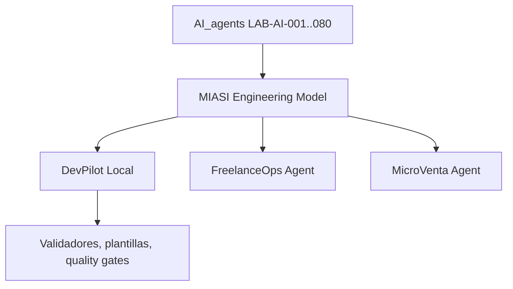

# MIASI — Modelo de Ingeniería de Sistemas Agénticos Inteligentes

## 1. Propósito

Esta carpeta contiene el sistema documental rector del proyecto **AI_agents** para pasar de una ruta de capacitación basada en laboratorios a una práctica de ingeniería profesional orientada a sistemas agénticos reales. El objetivo no es producir documentación decorativa, sino establecer un marco operativo que guíe el diseño, implementación, evaluación, seguridad, despliegue y operación de agentes de IA con criterios de producción.

El punto de partida técnico es el baseline obtenido al finalizar **LAB-AI-080**:

- `local_first_operational_baseline`;
- 12 capacidades en PASS;
- suite completa con 680 pruebas en PASS;
- integración de modelos, herramientas, RAG, memoria, evaluación, observabilidad, seguridad, CI/CD y documentación;
- separación entre laboratorio, baseline local-first y producción industrial.

## 2.1 Alcance de MIASI frente a ingeniería de software general

MIASI cubre la ingeniería de **sistemas agénticos inteligentes**: agentes, LLMs, ModelAdapter, herramientas, RAG, memoria, evaluación, seguridad específica de LLM/agentic systems, observabilidad de agentes, policy-as-code, human approval y DevPilot Local.

MIASI no sustituye por sí solo un modelo completo de ingeniería profesional de software. Para construir aplicaciones generales de producción debe complementarse con documentación de producto, requerimientos, arquitectura general, UX, API, datos, seguridad de aplicación, testing, DevOps, operación y mantenimiento. La guía superior queda descrita en `reference/software_engineering_documentation_stack.md`.

## 2. Principios de organización documental

MIASI se organiza bajo tres enfoques complementarios:

1. **Docs-as-code**: todo documento debe vivir en Git, tener versión, estado, responsable, historial de cambios y revisión por pull request.
2. **Diátaxis**: la documentación se separa en tutoriales, guías how-to, referencia técnica y explicaciones para evitar mezclar aprendizaje, operación, norma y teoría.
3. **Arquitectura documentada**: arc42 inspira la estructura de documentación arquitectónica, mientras C4 define niveles de visualización desde contexto hasta componentes.
4. **Normativa aplicable**: toda regla técnica debe poder rastrearse hacia un documento MIASI, un laboratorio AI_agents, una fuente externa o una decisión ADR.
5. **Operación verificable**: toda recomendación de producción debe tener artefacto, evidencia, checklist o quality gate asociado.

## 3. Estructura real de carpetas

```text
docs/engineering_model/
  README.md
  00_manifesto.md
  01_modelo_ingenieria_sistemas_agenticos.md
  02_arquitectura_referencia.md
  03_agentic_sdlc.md
  04_estandares_tecnicos_transversales.md
  05_plantillas_checklists_controles.md
  06_integracion_devpilot_local.md
  07_auditoria_miasi.md
  08_remediacion_post_auditoria_miasi.md
  09_auditoria_final_miasi.md
  templates/
  checklists/
  adrs/
  reference/
  schemas/
  how_to/
  explanations/
  tutorials/
```

## 4. Índice maestro de documentos existentes

| ID | Documento | Archivo | Tipo Diátaxis | Estado | Función |
|---|---|---|---|---|---|
| DOC-AI-001 | Estructura documental y manifiesto | `README.md`, `00_manifesto.md`, `adrs/*` | Referencia / ADR | approved | Define organización docs-as-code, estados, versionado y ADRs iniciales. |
| DOC-AI-002 | Modelo de Ingeniería de Sistemas Agénticos Inteligentes | `01_modelo_ingenieria_sistemas_agenticos.md` | Referencia normativa | approved | Documento rector MIASI. |
| DOC-AI-003 | Arquitectura de referencia | `02_arquitectura_referencia.md` | Referencia técnica | approved | Define capas, componentes, flujos, contratos y patrones de despliegue. |
| DOC-AI-004 | Agentic SDLC | `03_agentic_sdlc.md` | How-to / referencia | approved | Define el ciclo de vida industrial de 20 fases. |
| DOC-AI-005 | Estándares técnicos transversales | `04_estandares_tecnicos_transversales.md` | Referencia técnica | approved | Consolida estándares de agentes, modelos, tools, RAG, memoria, evals, seguridad, CI/CD e integración. |
| DOC-AI-006 | Plantillas, checklists y controles | `05_plantillas_checklists_controles.md`, `templates/*`, `checklists/*` | Plantillas / checklists | approved | Entrega formatos operativos reutilizables. |
| DOC-AI-007 | Integración con DevPilot Local | `06_integracion_devpilot_local.md` | How-to / arquitectura aplicada | approved | Define cómo DevPilot aplicará y automatizará MIASI. |
| DOC-AI-008 | Auditoría MIASI | `07_auditoria_miasi.md` | Auditoría | approved | Evalúa completitud, coherencia y trazabilidad de MIASI. |
| DOC-AI-009 | Auditoría final y decisión de promoción | `09_auditoria_final_miasi.md`, `reference/final_promotion_decision.md` | Auditoría / Referencia | reviewed | Declara MIASI v0.3.0 como estándar profesional de trabajo para iniciar DevPilot Local. |
| PATCH-MIASI | Remediación post-auditoría | `08_remediacion_post_auditoria_miasi.md`, `reference/*`, `schemas/*` | Referencia / control | approved | Cierra brechas prioritarias detectadas por DOC-AI-008. |
| DOC-AI-010 | Auditoría final de promoción MIASI v1.0.0 | `10_auditoria_final_promocion_miasi_v1.md` | Auditoría / decisión | approved | Promueve MIASI a estándar profesional interno aprobado para sistemas agénticos inteligentes. |
| SW-STACK | Stack documental de ingeniería profesional de software | `reference/software_engineering_documentation_stack.md` | Referencia | approved | Aclara que MIASI es una extensión especializada y define la documentación superior para software completo. |

## 5. Documentos planificados consolidados

Algunos documentos planificados inicialmente como archivos independientes fueron consolidados en documentos más amplios para evitar dispersión. Esta tabla evita duplicidad documental.

| Documento planificado original | Estado actual | Ubicación vigente |
|---|---|---|
| `04_taxonomia_agentes.md` | Consolidado | `01_modelo_ingenieria_sistemas_agenticos.md` |
| `05_patrones_arquitectonicos.md` | Parcialmente consolidado | `02_arquitectura_referencia.md`, pendiente de ampliación futura si DevPilot lo exige. |
| `06_model_adapter_multi_modelo.md` | Consolidado | `04_estandares_tecnicos_transversales.md` |
| `07_tool_calling_permisos.md` | Consolidado | `04_estandares_tecnicos_transversales.md` |
| `08_rag_memoria_contexto.md` | Consolidado | `04_estandares_tecnicos_transversales.md` |
| `09_evaluacion_quality_gates.md` | Consolidado | `03_agentic_sdlc.md`, `04_estandares_tecnicos_transversales.md` |
| `10_observabilidad_agentops.md` | Consolidado | `04_estandares_tecnicos_transversales.md`, `reference/taxonomia_incidentes_slo_sla.md` |
| `11_seguridad_guardrails_human_approval.md` | Consolidado | `04_estandares_tecnicos_transversales.md`, `reference/control_catalog.md` |
| `12_mcp_integraciones.md` | Consolidado | `04_estandares_tecnicos_transversales.md` |
| `13_ci_cd_operacion.md` | Consolidado | `03_agentic_sdlc.md`, `04_estandares_tecnicos_transversales.md`, `reference/supply_chain_provenance_roadmap.md` |
| `14_gobernanza_riesgo_compliance.md` | Consolidado | `01_modelo_ingenieria_sistemas_agenticos.md`, `reference/privacy_data_governance.md`, `reference/politica_referencias.md` |

## 6. Documentos de referencia agregados por remediación

| Archivo | Propósito | Hallazgo mitigado |
|---|---|---|
| `reference/glosario_normativo.md` | Define términos normativos únicos. | H-004 |
| `reference/politica_referencias.md` | Normaliza citas, fecha de consulta, tipo de fuente y criticidad. | H-003 |
| `reference/control_catalog.md` | Catálogo de controles con IDs `MIASI-*`. | H-012 |
| `reference/privacy_data_governance.md` | Política transversal de privacidad y gobierno de datos. | H-008 |
| `reference/contrato_cli_devpilot.md` | Contratos iniciales de comandos DevPilot. | H-006 |
| `reference/modelo_logico_devpilot.md` | Entidades persistentes y relaciones iniciales. | H-015 |
| `reference/taxonomia_incidentes_slo_sla.md` | Severidades, escalamiento, SLO/SLA y playbooks mínimos. | H-009, H-010 |
| `reference/supply_chain_provenance_roadmap.md` | Roadmap de provenance, firma y attestations. | H-011 |
| `reference/validacion_diagramas_mermaid.md` | Política de validación de diagramas. | H-005 |
| `reference/lab_traceability_annex.md` | Anexo LAB → evidencia → documento. | H-016 |
| `schemas/*` | JSON Schemas educativos para validación futura. | H-007 |
| `checklists/waiver_exception_policy.md` | Política de waiver/excepción. | H-013 |

## 7. Plantillas operativas

```text
templates/agent_card.md
templates/tool_card.md
templates/model_card.md
templates/rag_card.md
templates/memory_card.md
templates/eval_card.md
templates/policy_card.md
templates/human_approval_card.md
templates/observability_card.md
templates/deployment_card.md
templates/incident_report.md
templates/adr_template.md
templates/runbook_template.md
templates/risk_register.md
templates/threat_model.md
templates/cost_budget.md
templates/data_handling_sheet.md
templates/production_readiness_checklist.md
```

## 8. Checklists

```text
checklists/checklist_agent_design.md
checklists/checklist_tool_safety.md
checklists/checklist_rag_grounding.md
checklists/checklist_memory_safety.md
checklists/checklist_eval_readiness.md
checklists/checklist_security_readiness.md
checklists/checklist_observability_readiness.md
checklists/checklist_human_approval.md
checklists/checklist_ci_cd.md
checklists/checklist_pre_production.md
checklists/checklist_post_deployment.md
checklists/waiver_exception_policy.md
```

## 9. Convención de frontmatter YAML

Todo documento debe iniciar con:

```yaml
title: "Título del documento"
version: "0.1.0"
status: "draft"
owner: "AI_agents"
scope: "engineering-model | applied-project | standard | template"
updated: "YYYY-MM-DD"
doc_type: "tutorial | how-to | reference | explanation | adr | template | checklist | schema"
audience:
  - "rol objetivo"
related_labs:
  - "LAB-AI-001"
related_projects:
  - "DevPilot Local"
references:
  - "referencia externa o interna"
```

## 10. Estados documentales

| Estado | Significado | Puede guiar implementación | Puede usarse como gate |
|---|---|---:|---:|
| `draft` | Documento inicial en elaboración. | Sí, con cautela. | No. |
| `reviewed` | Revisado técnica y editorialmente. | Sí. | Parcialmente. |
| `approved` | Aprobado como estándar del proyecto. | Sí. | Sí. |
| `deprecated` | Sustituido por una versión posterior. | No, salvo contexto histórico. | No. |

## 11. Versionado SemVer documental

| Cambio | Incremento | Ejemplo |
|---|---|---|
| Corrección menor de redacción | PATCH | 0.1.0 → 0.1.1 |
| Nueva sección compatible | MINOR | 0.1.0 → 0.2.0 |
| Cambio normativo incompatible | MAJOR | 0.9.0 → 1.0.0 |

## 12. Trazabilidad con AI_agents

Cada documento debe declarar:

- laboratorios relacionados;
- decisiones heredadas;
- capacidades reutilizadas;
- brechas pendientes;
- relación con DevPilot Local, FreelanceOps Agent o MicroVenta Agent.

| Capacidad | Laboratorios base | Documento MIASI |
|---|---|---|
| Agentes básicos, tools, ModelAdapter | LAB-AI-001..012 | DOC-AI-002, DOC-AI-005 |
| RAG, embeddings, memoria, evaluación | LAB-AI-013..030 | DOC-AI-003, DOC-AI-004, DOC-AI-005 |
| Repos, CI/CD, AgentOps, calidad | LAB-AI-031..050 | DOC-AI-003, DOC-AI-004, DOC-AI-005 |
| Industrialización y observabilidad | LAB-AI-051..074 | DOC-AI-003, DOC-AI-005, DOC-AI-007 |
| Secret management | LAB-AI-075 | DOC-AI-005, `reference/control_catalog.md` |
| SAST/SBOM | LAB-AI-076 | DOC-AI-005, `reference/supply_chain_provenance_roadmap.md` |
| Policy-as-code | LAB-AI-077 | DOC-AI-005, `reference/control_catalog.md` |
| Human approval | LAB-AI-078 | DOC-AI-004, DOC-AI-005 |
| CI remoto sandbox | LAB-AI-079 | DOC-AI-003, DOC-AI-004, DOC-AI-007 |
| Integrador final | LAB-AI-080 | DOC-AI-002, DOC-AI-008 |

## 13. Relación con proyectos aplicados

MIASI será el estándar rector. **DevPilot Local** será la primera plataforma que lo implemente y automatice parcialmente.



## 14. Política de referencias

La política detallada vive en `reference/politica_referencias.md`. Toda afirmación normativa que dependa de un estándar externo debe citar fuente primaria cuando sea posible. Las referencias deben declarar tipo de fuente, fecha de consulta y criticidad.

## 15. Criterios mínimos de calidad documental

Un documento MIASI es aceptable solo si:

- tiene frontmatter válido;
- tiene propósito, alcance y audiencia;
- distingue laboratorio, baseline local-first y producción industrial;
- incluye criterios de cumplimiento;
- incluye criterios de bloqueo cuando aplique;
- declara relación con AI_agents;
- declara relación con proyectos aplicados;
- usa referencias externas verificables cuando haga afirmaciones basadas en estado del arte;
- puede ser revisado por pull request;
- puede convertirse en PDF/HTML sin perder estructura.

## 16. Criterios de rechazo

Un documento debe rechazarse si:

- no tiene criterios accionables;
- depende de un proveedor LLM único;
- omite seguridad u observabilidad en decisiones críticas;
- confunde baseline local-first con producción industrial;
- recomienda acciones destructivas sin aprobación humana;
- omite trazabilidad con laboratorios o proyectos aplicados;
- no diferencia explicación, guía operativa, referencia y plantilla.

## 17. Referencias externas base

- ISO/IEC 42001:2023 — Artificial intelligence management systems. https://www.iso.org/standard/42001
- NIST AI Risk Management Framework. https://www.nist.gov/itl/ai-risk-management-framework
- NIST AI 600-1 — Generative AI Profile. https://www.nist.gov/publications/artificial-intelligence-risk-management-framework-generative-artificial-intelligence
- OWASP Top 10 for Large Language Model Applications. https://owasp.org/www-project-top-10-for-large-language-model-applications/
- OpenTelemetry Semantic conventions for generative AI systems. https://opentelemetry.io/docs/specs/semconv/gen-ai/
- Model Context Protocol Specification. https://modelcontextprotocol.io/specification/2025-06-18
- OpenAI Agents SDK — Agents, handoffs, guardrails and human review. https://developers.openai.com/api/docs/guides/agents
- LangGraph durable execution and persistence. https://docs.langchain.com/oss/python/langgraph/durable-execution
- Microsoft Foundry Agent Evaluators. https://learn.microsoft.com/en-us/azure/foundry/concepts/evaluation-evaluators/agent-evaluators
- arc42 Architecture Documentation. https://arc42.org/
- C4 Model. https://c4model.com/
- Diátaxis documentation framework. https://diataxis.fr/
- NIST SP 800-218 Secure Software Development Framework. https://csrc.nist.gov/pubs/sp/800/218/final
- SLSA — Supply-chain Levels for Software Artifacts. https://slsa.dev/
- OWASP CycloneDX. https://cyclonedx.org/

## 18. Estado actual

- Estado global recomendado: `draft avanzado`.
- Veredicto posterior a DOC-AI-008: `aprobado con ajustes`.
- Estado posterior a remediación: **apto para iniciar diseño de DevPilot Local en modo MVP**, manteniendo revisión antes de promover MIASI a `reviewed`.


## Estado de promoción documental

Después de la auditoría final `DOC-AI-009`, MIASI queda en:

```text
Estado: reviewed
Baseline: MIASI v0.3.0
Uso: estándar profesional de trabajo para iniciar DevPilot Local
```

La promoción a `approved` v1.0 queda condicionada a validación práctica durante el MVP de DevPilot Local.

