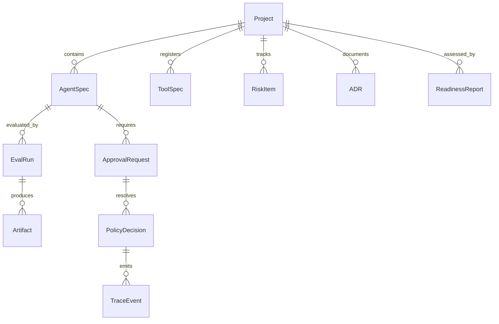

# Modelo lógico inicial de DevPilot Local

## 1. Propósito

Definir entidades persistentes mínimas para implementar DevPilot Local sin improvisar el modelo de datos.

## 2. Entidades

| Entidad | Propósito | Campos mínimos |
|---|---|---|
| `Project` | Proyecto gestionado por DevPilot. | `id`, `name`, `path`, `profile`, `created_at`, `status` |
| `AgentSpec` | Definición de agente. | `id`, `project_id`, `name`, `autonomy_level`, `agent_card_path`, `status` |
| `ToolSpec` | Herramienta registrada. | `id`, `project_id`, `name`, `risk_level`, `side_effects`, `tool_card_path` |
| `EvalRun` | Ejecución de evaluación. | `id`, `agent_id`, `dataset`, `passed`, `metrics`, `artifact_path` |
| `PolicyDecision` | Decisión allow/block/approval. | `id`, `run_id`, `action`, `decision`, `reasons`, `timestamp` |
| `ApprovalRequest` | Solicitud de aprobación humana. | `id`, `requested_by`, `reviewer`, `status`, `expires_at` |
| `TraceEvent` | Evento observable. | `id`, `run_id`, `event_type`, `payload_redacted`, `timestamp` |
| `Artifact` | Archivo producido. | `id`, `run_id`, `path`, `kind`, `hash`, `created_at` |
| `RiskItem` | Riesgo identificado. | `id`, `project_id`, `severity`, `description`, `mitigation`, `status` |
| `ADR` | Decisión arquitectónica. | `id`, `project_id`, `title`, `status`, `path` |
| `ReadinessReport` | Reporte de readiness. | `id`, `project_id`, `target_level`, `passed`, `gates` |

## 3. Relaciones principales

## 4. Persistencia recomendada por fase

| Fase | Persistencia |
|---|---|
| MVP local | SQLite + JSONL |
| Beta personal | SQLite + artefactos versionados |
| Producción controlada | PostgreSQL + object storage + backups |
| Industrial | PostgreSQL HA + audit log inmutable + SIEM |

## 5. Criterios de bloqueo

- No persistir decisiones de policy.
- No persistir approval requests.
- No registrar hash o ruta de artefactos críticos.
- Mezclar datos reales y fixtures sin clasificación.
