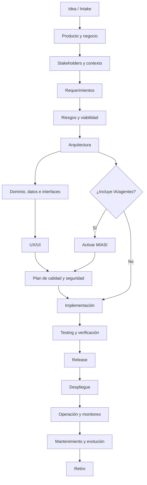
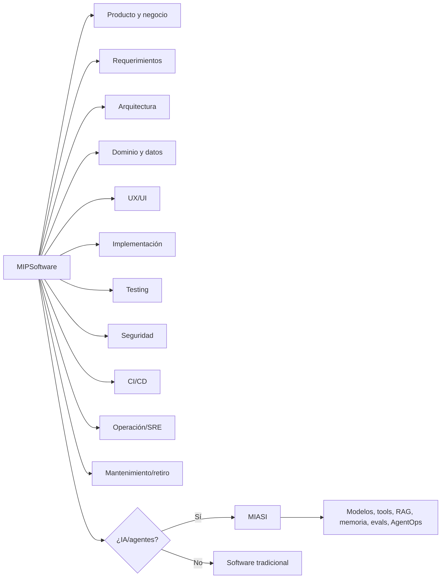

# MIPSoftware — Modelo de Ingeniería Profesional de Software

## 1. Resumen ejecutivo

**MIPSoftware** es el estándar general de ingeniería profesional de software del emprendimiento. Su función es establecer cómo se conciben, justifican, diseñan, construyen, prueban, aseguran, despliegan, operan, mantienen y retiran aplicaciones de software reales.

MIPSoftware no es una metodología rígida ni un framework de código. Es un **modelo normativo, auditable y accionable** para gobernar el ciclo de vida completo del software, independientemente del stack tecnológico, proveedor cloud, lenguaje, framework o tipo de producto.

El modelo se apoya en referencias reconocidas del ciclo de vida de software y sistemas, ingeniería de requerimientos, calidad, testing, desarrollo seguro, arquitectura, documentación y supply chain. Su objetivo no es reemplazar estándares externos, sino convertirlos en un estándar interno práctico, proporcionado y aplicable a proyectos reales.

**MIASI — Modelo de Ingeniería de Sistemas Agénticos Inteligentes** queda integrado como una extensión especializada obligatoria cuando un sistema incorpora IA, agentes, LLMs, RAG, memoria, tool calling, automatización inteligente o comportamiento adaptativo. Por tanto:

```text
MIPSoftware gobierna cualquier aplicación profesional de software.
MIASI se activa cuando la aplicación incluye capacidades inteligentes/agénticas.
```

## 2. Propósito

El propósito de MIPSoftware es proporcionar un estándar profesional para:

1. transformar una idea en un producto de software justificable;
2. documentar problema, valor, usuarios, alcance y restricciones;
3. especificar requerimientos verificables;
4. diseñar arquitectura, dominio, datos, interfaces y UX/UI antes de implementar;
5. implementar con calidad, seguridad y trazabilidad;
6. probar y verificar el producto con criterios explícitos;
7. desplegar de forma controlada, repetible y auditable;
8. operar con observabilidad, SLO/SLA, gestión de incidentes y runbooks;
9. gestionar deuda técnica, evolución, mantenimiento y retiro;
10. activar MIASI cuando el sistema incluya inteligencia artificial o agentes.

## 3. Alcance

MIPSoftware cubre el ciclo completo de aplicaciones de software, incluyendo:

- productos web, móviles, backend, desktop, CLI y plataformas internas;
- sistemas transaccionales;
- APIs y servicios;
- productos con datos persistentes;
- herramientas internas de automatización;
- sistemas con integraciones externas;
- sistemas con o sin IA;
- sistemas local-first, cloud o híbridos;
- MVPs profesionales y productos orientados a producción.

### 3.1 Fuera de alcance

MIPSoftware no pretende ser:

- una certificación ISO;
- un sustituto de auditorías legales, financieras o regulatorias formales;
- una metodología única de gestión de proyectos;
- un stack tecnológico obligatorio;
- una herramienta de generación automática de código;
- un reemplazo de MIASI para sistemas inteligentes.

## 4. Audiencia

| Audiencia | Uso del modelo |
|---|---|
| Fundadores / dirección técnica | Decidir qué proyectos pasan de idea a ejecución. |
| Product owner / analista | Documentar problema, valor, alcance, usuarios y requerimientos. |
| Arquitecto de software | Diseñar arquitectura, decisiones ADR, atributos de calidad y riesgos. |
| Desarrollador | Implementar conforme a contratos, calidad, pruebas y seguridad. |
| QA / tester | Definir estrategia de pruebas, casos, regresión y quality gates. |
| Security reviewer | Aplicar controles de seguridad, privacidad y supply chain. |
| DevOps / SRE | Definir CI/CD, despliegue, observabilidad, operación y runbooks. |
| Equipo MIASI / agentes IA | Activar extensión inteligente cuando el producto incorpore agentes o LLMs. |
| DevPilot Local | Automatizar creación, validación y auditoría de artefactos MIPSoftware. |

## 5. Principios rectores

| Principio | Regla normativa | Criterio PASS | Criterio FAIL |
|---|---|---|---|
| Software engineering first | Todo proyecto se trata como sistema de ingeniería, no como improvisación de código. | Existe ciclo de vida, artefactos y gates. | Se empieza a programar sin problema, alcance ni arquitectura. |
| Documentación como activo | La documentación vive en Git, tiene versión, estado y propietario. | Documentos con frontmatter, trazabilidad y revisión. | Documentos sueltos, sin control ni actualización. |
| Arquitectura antes de implementación | Toda aplicación no trivial debe tener arquitectura mínima. | C4/arc42/ADR disponibles. | Módulos, datos o APIs se implementan sin diseño. |
| Seguridad desde el diseño | Seguridad y privacidad se diseñan desde requerimientos. | Threat model y controles mínimos. | Seguridad se deja para el final. |
| Calidad verificable | Cada requerimiento relevante debe poder probarse. | Requerimientos con criterios de aceptación y pruebas. | No hay estrategia de testing ni quality gates. |
| Trazabilidad | Debe rastrearse idea → requerimiento → diseño → prueba → release. | Matriz o enlaces de trazabilidad. | Cambios sin origen ni evidencia. |
| Automatización progresiva | Todo control repetible debe poder automatizarse con DevPilot Local. | Artefactos estructurados y schemas futuros. | Documentación no estructurada imposible de validar. |
| DevOps/SRE-ready | El producto debe diseñarse para despliegue, operación y monitoreo. | Runbook, CI/CD, logs, métricas. | Se entrega software sin operación. |
| AI-ready mediante MIASI | Si hay IA/agentes, MIASI es obligatorio. | Agent Card, Eval Plan, guardrails, trazas. | IA agregada sin controles. |
| Independencia razonable de proveedor | El modelo no exige nube, API ni herramienta paga. | Alternativas local/cloud/híbridas. | Diseño atado sin justificación a proveedor único. |
| Producción como objetivo | Producción se diseña desde el inicio, aunque el MVP sea incremental. | Criterios de production readiness. | Producción se trata como “subirlo y ya”. |

## 6. Definiciones normativas

| Término | Definición MIPSoftware |
|---|---|
| Software product | Producto de software con propósito, usuarios, valor, ciclo de vida, soporte y evolución. |
| Software system | Conjunto de componentes software, datos, interfaces, operaciones, personas y procesos que entregan una capacidad. |
| Application | Sistema ejecutable orientado a usuarios o procesos específicos. |
| Platform | Base extensible que soporta múltiples productos, módulos, usuarios, flujos o integraciones. |
| Module | Unidad funcional cohesiva dentro de un sistema, con responsabilidad delimitada. |
| Service | Componente que expone capacidades por API, eventos, cola, CLI o interfaz programática. |
| Component | Bloque técnico o lógico que colabora dentro de una arquitectura. |
| API | Contrato formal para invocar capacidades del sistema, incluyendo entradas, salidas, errores, seguridad y versionado. |
| Domain model | Representación de entidades, reglas, invariantes, procesos y conceptos del negocio. |
| Requirement | Declaración verificable de necesidad, restricción o capacidad esperada del sistema. |
| Quality attribute | Propiedad medible del sistema: seguridad, rendimiento, mantenibilidad, confiabilidad, usabilidad, portabilidad, etc. |
| Technical debt | Decisión técnica subóptima aceptada temporalmente y registrada con impacto, riesgo y plan de pago. |
| Release | Versión empaquetada y trazable del software, lista para instalación, despliegue o uso. |
| Operation | Actividades para ejecutar, monitorear, soportar y mantener el sistema en un entorno real. |
| Incident | Evento no planificado que degrada, interrumpe o compromete el servicio, seguridad, datos o experiencia. |
| Retirement | Proceso controlado de desactivación, migración, archivo o eliminación de un sistema o componente. |

## 7. Ciclo de vida general

MIPSoftware define un ciclo de vida completo, adaptable a proyectos pequeños o complejos:



### 7.1 Regla de avance

Un proyecto no debe avanzar a implementación si no existe evidencia mínima de:

- problema y propósito;
- alcance;
- requerimientos iniciales;
- arquitectura mínima;
- riesgos principales;
- estrategia de pruebas;
- controles de seguridad proporcionales;
- decisión sobre si MIASI aplica o no.

## 8. Dominios del modelo

| Dominio | Propósito | Artefactos mínimos | Gate principal |
|---|---|---|---|
| Producto y negocio | Justificar el producto y su valor. | Product Vision, Business Case, MVP Scope. | Problema y valor claros. |
| Stakeholders | Identificar usuarios, actores, restricciones y responsabilidades. | Stakeholder Map, User Personas. | Usuarios y responsables identificados. |
| Requerimientos | Definir capacidades y restricciones verificables. | Requirements Spec, User Stories, Acceptance Criteria. | Requerimientos testeables. |
| Arquitectura | Definir estructura, decisiones y atributos de calidad. | Architecture Doc, C4, ADRs. | Arquitectura mínima aprobada. |
| Dominio | Modelar negocio, reglas e invariantes. | Domain Model, Use Cases, Business Rules. | Reglas críticas explícitas. |
| Datos | Modelar datos, persistencia, retención y privacidad. | Data Model, Data Dictionary, Migration Plan. | Datos sensibles clasificados. |
| Interfaces | Definir APIs, eventos, integraciones y errores. | API Contract, Event Contract, Integration Contract. | Contratos versionables. |
| UX/UI | Diseñar experiencia, flujos, pantallas y accesibilidad. | User Journey, Screen Spec, Accessibility Checklist. | Flujos principales validados. |
| Implementación | Construir software conforme a estándares. | Código, revisión, convenciones. | Build reproducible. |
| Testing | Verificar funcionalidad, regresión, seguridad y calidad. | Test Strategy, Test Plan, Test Reports. | Quality gate aprobado. |
| Seguridad | Gestionar amenazas, privacidad y desarrollo seguro. | Threat Model, Security Requirements, Vulnerability Register. | Riesgos críticos mitigados. |
| CI/CD | Automatizar integración, pruebas, releases y despliegue. | Pipeline, Release Plan, Rollback Plan. | Release trazable. |
| Observabilidad | Medir, diagnosticar y auditar el sistema. | Logs, Metrics, Traces, Dashboards, Runbooks. | Operabilidad mínima. |
| Operación | Soportar el producto en uso real. | Runbook, Incident Process, SLO/SLA. | Soporte y recuperación definidos. |
| Mantenimiento | Gestionar evolución, deuda técnica y cambios. | Maintenance Plan, Technical Debt Register. | Deuda crítica visible. |
| Retiro | Desactivar sistemas sin daño a usuarios/datos. | Retirement Plan, Data Archive Plan. | Retiro controlado. |
| Extensión MIASI | Gobernar capacidades inteligentes/agénticas. | Agent Card, Tool Card, Eval Plan, Policy Card. | Riesgos IA controlados. |

## 9. Niveles de madurez

| Nivel | Nombre | Descripción | Uso permitido |
|---|---|---|---|
| M0 | Informal | Código o idea sin proceso documentado. | Exploración personal, no proyecto formal. |
| M1 | Documentado | Existe propósito, alcance y estructura básica. | Prototipo controlado. |
| M2 | Repetible | Se siguen plantillas y checklists mínimos. | MVP interno. |
| M3 | Evaluable | Hay pruebas, gates, trazabilidad y reportes. | MVP serio / piloto. |
| M4 | Automatizable | Artefactos estructurados pueden validarse por herramientas. | Preproducción. |
| M5 | Production-ready | Cumple seguridad, calidad, operación, CI/CD y runbooks. | Producción controlada. |
| M6 | Industrial | Cumple operación sostenida, auditoría, SLO/SLA, supply chain y mejora continua. | Producción industrial. |

### 9.1 Madurez mínima recomendada por tipo de proyecto

| Tipo de proyecto | Nivel mínimo antes de usarlo en serio |
|---|---:|
| Script exploratorio | M1 |
| Herramienta interna local | M2 |
| MVP con usuarios reales | M3 |
| Producto con datos persistentes | M4 |
| Producto con pagos/datos sensibles | M5 |
| Plataforma crítica o multiusuario | M5–M6 |
| Sistema con IA/agentes | M3 + MIASI mínimo A3; producción: M5 + MIASI A5/A6 |

## 10. Criterios mínimos para iniciar código

Antes de iniciar implementación de una funcionalidad o producto no trivial, deben existir:

| Criterio | Evidencia mínima | Bloquea si falta |
|---|---|---:|
| Problema definido | Product Vision / Problem Statement | Sí |
| Alcance inicial | MVP Scope / Out of Scope | Sí |
| Usuarios o actores | Stakeholder Map / Personas | Sí |
| Requerimientos iniciales | Requirements Spec / User Stories | Sí |
| Criterios de aceptación | Acceptance Criteria | Sí |
| Arquitectura mínima | C4 Context + Container o Architecture Note | Sí |
| Modelo de dominio mínimo | Entidades, reglas, casos de uso | Sí para sistemas transaccionales |
| Datos sensibles identificados | Data Classification | Sí si hay datos personales/sensibles |
| Estrategia de pruebas | Test Strategy mínima | Sí |
| Riesgos iniciales | Risk Register | Sí |
| Seguridad mínima | Threat Model ligero | Sí para sistemas con datos, red o usuarios |
| Decisión MIASI | `miasi_required: true/false` justificado | Sí |

## 11. Criterios mínimos para pasar a producción

| Área | Criterio production-ready | Bloquea producción si falla |
|---|---|---:|
| Requerimientos | Requerimientos críticos implementados y verificados. | Sí |
| Arquitectura | Decisiones relevantes documentadas. | Sí |
| Datos | Backups, migraciones y retención definidos. | Sí si hay persistencia |
| Seguridad | Threat model, secret management, auth, input validation, dependency scan. | Sí |
| Testing | Unit/integration/e2e/regression según criticidad. | Sí |
| CI/CD | Pipeline reproducible con quality gates. | Sí |
| Observabilidad | Logs, métricas, trazas o auditoría mínima. | Sí |
| Operación | Runbook y proceso de incidentes. | Sí |
| Release | Versión, changelog, rollback plan. | Sí |
| Supply chain | Dependencias inventariadas y SBOM según criticidad. | Sí para producción formal |
| MIASI | Si aplica, Agent Card, Eval Plan, policy, human approval, trazas. | Sí |

## 12. Prototipo vs MVP vs producto production-ready

| Dimensión | Prototipo | MVP | Producto production-ready |
|---|---|---|---|
| Objetivo | Validar idea o viabilidad técnica. | Entregar valor mínimo usable. | Operar con usuarios reales sostenidamente. |
| Usuarios | Internos o prueba. | Primeros usuarios controlados. | Usuarios reales / clientes. |
| Documentación | Ligera. | Suficiente para entender y mantener. | Completa, versionada y auditable. |
| Arquitectura | Puede ser exploratoria. | Debe tener estructura mínima. | Debe soportar evolución y operación. |
| Testing | Pruebas mínimas o manuales. | Pruebas críticas automatizadas. | Estrategia integral de pruebas. |
| Seguridad | Básica. | Riesgos principales mitigados. | Security by design y gates. |
| Observabilidad | Logs simples. | Logs y reportes básicos. | Logs, métricas, trazas, alertas/runbooks. |
| CI/CD | Opcional. | Recomendado. | Obligatorio. |
| Operación | No formal. | Manual documentada. | SRE-ready / runbooks / incidentes. |
| MIASI | Solo si prueba IA. | Obligatorio si hay IA real. | Obligatorio si hay IA/agentes en producción. |

## 13. Relación con estándares externos

| Estándar / referencia | Rol dentro de MIPSoftware | Dominio principal |
|---|---|---|
| ISO/IEC/IEEE 12207 | Base de procesos de ciclo de vida de software. | Ciclo de vida, operación, mantenimiento, retiro. |
| ISO/IEC/IEEE 15288 | Base de ciclo de vida de sistemas. | Sistemas, stakeholders, operación, retiro. |
| ISO/IEC/IEEE 29148 | Ingeniería de requerimientos. | Requerimientos, trazabilidad, validación. |
| ISO/IEC 25010 | Modelo de calidad de producto. | Calidad, atributos, no funcionales. |
| ISO/IEC/IEEE 29119 | Testing de software. | Estrategia de pruebas, procesos, documentación de testing. |
| SWEBOK | Cuerpo de conocimiento de ingeniería de software. | Dominios profesionales de software. |
| SEBoK | Cuerpo de conocimiento de ingeniería de sistemas. | Pensamiento sistémico y sistemas complejos. |
| NIST SSDF | Desarrollo seguro. | Seguridad y secure SDLC. |
| OWASP SAMM | Madurez de seguridad. | Programa de seguridad de software. |
| OWASP ASVS | Verificación técnica de seguridad. | Seguridad web/API. |
| SLSA | Integridad de cadena de suministro. | Supply chain, provenance. |
| CycloneDX | SBOM y Bill of Materials. | Dependencias y supply chain. |
| arc42 | Documentación de arquitectura. | Arquitectura. |
| C4 Model | Visualización arquitectónica. | Contexto, contenedores, componentes. |
| Diátaxis | Organización documental. | Tutoriales, how-to, referencia, explicación. |
| MIASI | Extensión especializada para IA/agentes. | Sistemas inteligentes. |

## 14. Relación con MIASI

MIASI se activa cuando el sistema incluye una o más de estas condiciones:

| Condición | MIASI obligatorio | Evidencia requerida |
|---|---:|---|
| LLM local o externo | Sí | Model Card, ModelAdapter config, cost guard. |
| Agente con herramientas | Sí | Agent Card, Tool Card, policy-as-code. |
| RAG | Sí | RAG Card, fuentes, evaluación de grounding. |
| Memoria conversacional/persistente | Sí | Memory Card, retención, privacidad. |
| Automatización inteligente | Sí | Risk Register, human approval si hay side effects. |
| Generación de contenido asistida por IA | Sí | Eval Plan, revisión humana, política de outputs. |
| Decisiones asistidas por IA | Sí | Evaluación, auditoría, explicabilidad proporcional. |
| Sistema tradicional sin IA | No | Justificación `miasi_required: false`. |

### 14.1 Regla de integración

Un proyecto que activa MIASI debe cumplir simultáneamente:

```text
MIPSoftware baseline + MIASI extension
```

No se permite usar MIASI como sustituto de requerimientos, arquitectura, testing, seguridad general, CI/CD u operación. MIASI solo gobierna la dimensión inteligente/agéntica.

## 15. Diagrama general del modelo



## 16. Checklist de cumplimiento mínimo

| Ítem | Obligatorio | PASS | FAIL |
|---|---:|---|---|
| Product Vision existe | Sí | Problema y valor claros. | No se sabe qué se construye ni para quién. |
| Alcance definido | Sí | MVP y fuera de alcance definidos. | Alcance abierto/infinito. |
| Stakeholders identificados | Sí | Usuarios y responsables definidos. | No hay actores claros. |
| Requerimientos verificables | Sí | Requisitos con aceptación. | Requisitos ambiguos. |
| Arquitectura mínima | Sí | C4/ADR disponibles. | Diseño implícito. |
| Modelo de datos/dominio | Según sistema | Entidades y reglas claras. | Datos improvisados. |
| Seguridad mínima | Sí | Threat model proporcional. | Riesgos ignorados. |
| Testing definido | Sí | Estrategia y pruebas críticas. | Solo pruebas manuales ad hoc. |
| CI/CD definido | Para MVP serio | Pipeline básico. | Builds manuales no reproducibles. |
| Operación definida | Para producción | Runbook y monitoreo. | Sin soporte ni recuperación. |
| MIASI evaluado | Sí | `miasi_required` justificado. | Se usa IA sin extensión MIASI. |

## 17. Criterios de bloqueo

Un proyecto debe bloquear avance a implementación o producción si se cumple cualquiera de estas condiciones:

1. No existe problema o usuario definido.
2. No existe alcance inicial.
3. Los requerimientos críticos no son verificables.
4. No existe arquitectura mínima para un sistema no trivial.
5. Se manejan datos sensibles sin clasificación ni política.
6. Se exponen secretos en código, documentación o CI/CD.
7. No hay estrategia mínima de pruebas.
8. No hay rollback para release productivo.
9. No hay runbook para sistema productivo.
10. Se usa IA/agentes sin activar MIASI.
11. Se integran pagos, clientes o datos personales sin threat model.
12. Se despliega a producción sin quality gates.

## 18. Preparación para DevPilot Local

MIPSoftware debe diseñarse para que **DevPilot Local** pueda automatizar progresivamente:

| Futuro comando | Validación esperada |
|---|---|
| `devpilot init-project` | Crea estructura documental del proyecto. |
| `devpilot check-pre-code` | Verifica criterios mínimos antes de implementar. |
| `devpilot validate-requirements` | Revisa claridad, trazabilidad y aceptación. |
| `devpilot validate-architecture` | Verifica C4, ADRs y atributos de calidad. |
| `devpilot check-security` | Ejecuta checklist y gates de seguridad. |
| `devpilot run-quality-gates` | Ejecuta pruebas, linters, SAST/SBOM y reportes. |
| `devpilot readiness-check` | Decide si el proyecto puede pasar a release/producción. |
| `devpilot miasi-check` | Decide si debe activarse MIASI y valida sus artefactos. |

## 19. Referencias

- ISO/IEC/IEEE 12207 — Systems and software engineering — Software life cycle processes. https://www.iso.org/standard/63712.html
- ISO/IEC/IEEE 15288 — Systems and software engineering — System life cycle processes. https://www.iso.org/standard/63711.html
- ISO/IEC/IEEE 29148 — Systems and software engineering — Life cycle processes — Requirements engineering. https://www.iso.org/standard/72089.html
- ISO/IEC 25010 — Systems and software Quality Requirements and Evaluation. https://iso25000.com/index.php/en/iso-25000-standards/iso-25010
- ISO/IEC/IEEE 29119 — Software Testing. https://softwaretestingstandard.org/
- SWEBOK — Guide to the Software Engineering Body of Knowledge. https://www.computer.org/education/bodies-of-knowledge/software-engineering
- SEBoK — Systems Engineering Body of Knowledge. https://sebokwiki.org/
- NIST SSDF SP 800-218. https://csrc.nist.gov/pubs/sp/800/218/final
- OWASP SAMM. https://owasp.org/www-project-samm/
- OWASP ASVS. https://owasp.org/www-project-application-security-verification-standard/
- SLSA. https://slsa.dev/
- CycloneDX. https://cyclonedx.org/
- arc42. https://arc42.org/
- C4 Model. https://c4model.com/
- Diátaxis. https://diataxis.fr/
- MIASI v1.0.0 — Modelo de Ingeniería de Sistemas Agénticos Inteligentes.

## 20. Changelog

| Versión | Fecha | Cambio | Autor |
|---|---|---|---|
| 0.1.0 | 2026-05-31 | Creación inicial del documento rector MIPSoftware. | AI_agents / MIPSoftware |
