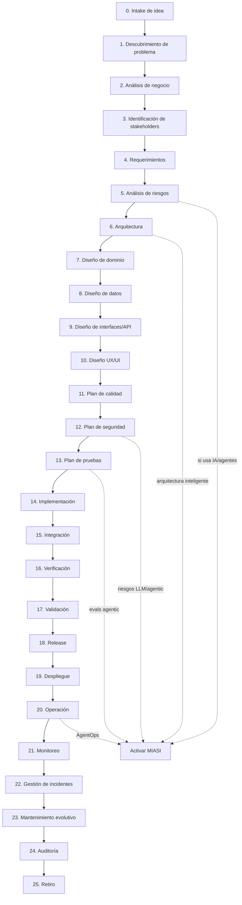

# MIPS-DOC-003 — Ciclo de vida profesional de software

## 1. Resumen ejecutivo

Este documento define el **ciclo de vida profesional de software de MIPSoftware**, desde el intake de una idea hasta el retiro controlado del sistema. Su propósito es convertir el desarrollo de software en un proceso **operacional, auditable, trazable y orientado a producción**, evitando que los proyectos comiencen directamente “picando código” sin suficiente claridad de negocio, requerimientos, arquitectura, calidad, seguridad, operación y sostenibilidad.

El ciclo se apoya en estándares de referencia para ciclo de vida de software y sistemas, ingeniería de requerimientos, calidad, pruebas y desarrollo seguro. En particular, toma como base conceptual **ISO/IEC/IEEE 12207**, **ISO/IEC/IEEE 15288**, **ISO/IEC/IEEE 29148**, **ISO/IEC 25010**, **ISO/IEC/IEEE 29119** y **NIST SSDF SP 800-218**.

La regla principal es:

```text
Ningún proyecto no trivial debe pasar a implementación sin evidencia mínima de:
problema, valor, stakeholders, requerimientos, riesgos, arquitectura, calidad,
seguridad, pruebas, operación esperada y decisión formal sobre si MIASI aplica.
```

Cuando el software incluya IA, agentes, LLMs, RAG, memoria, tool calling, automatización inteligente o sistemas adaptativos, este ciclo se extiende obligatoriamente con **MIASI — Modelo de Ingeniería de Sistemas Agénticos Inteligentes**.

---

## 2. Objetivo

Definir un ciclo de vida común para construir software real con criterio profesional, desde la idea hasta el retiro, estableciendo para cada fase:

- propósito;
- entradas;
- actividades;
- salidas;
- responsables;
- artefactos;
- quality gates;
- riesgos;
- criterios PASS;
- criterios FAIL;
- criterios de bloqueo;
- relación con MIASI cuando aplique.

Este ciclo debe poder ser utilizado manualmente por un equipo humano y, posteriormente, automatizado o asistido por **DevPilot Local**.

---

## 3. Alcance

Este ciclo aplica a:

- aplicaciones web;
- aplicaciones móviles;
- APIs;
- plataformas internas;
- sistemas transaccionales;
- sistemas de datos;
- herramientas CLI;
- automatizaciones;
- productos SaaS;
- software local-first;
- sistemas híbridos local/cloud;
- sistemas con agentes IA, cuando se active MIASI.

No prescribe un framework único, lenguaje, proveedor cloud, metodología ágil específica ni herramienta de gestión obligatoria. MIPSoftware define el **proceso de ingeniería**, no el stack.

---

## 4. Principios operativos del ciclo de vida

| Principio | Regla normativa | Implicación práctica |
|---|---|---|
| Software engineering first | El código no es el primer artefacto de un proyecto serio. | Antes de implementar debe existir evidencia mínima de producto, requerimientos, arquitectura, riesgos y calidad. |
| Trazabilidad integral | Toda decisión relevante debe poder rastrearse. | Requerimientos, ADRs, pruebas, releases, incidentes y cambios deben conectarse. |
| Calidad verificable | La calidad debe medirse, no declararse. | Cada fase produce quality gates y evidencias PASS/FAIL. |
| Seguridad desde el diseño | La seguridad no se agrega al final. | Threat model, controles, secretos, privacidad y SAST/SBOM aparecen antes del release. |
| Operación desde el diseño | Un sistema no está listo si no puede operarse. | Logs, métricas, runbooks, incidentes y rollback son parte del ciclo. |
| Retiro planificado | Todo sistema tiene vida útil y fin de vida. | Debe existir política de mantenimiento, deprecación y retiro. |
| MIASI como extensión | La IA no se improvisa dentro del software. | Todo componente inteligente activa evaluación, seguridad, trazas y controles MIASI. |

---

## 5. Diagrama Mermaid del ciclo



---

## 6. Fases del ciclo de vida

### Fase 0 — Intake de idea

| Campo | Descripción |
|---|---|
| Propósito | Registrar una idea de software de forma mínima, evitando que se convierta prematuramente en implementación. |
| Entradas | Idea, dolor observado, oportunidad, solicitud de cliente, necesidad interna, hipótesis de producto. |
| Actividades | Capturar problema preliminar, usuario objetivo, valor esperado, restricciones iniciales, urgencia, tipo de sistema y posible presencia de IA. |
| Salidas | `idea_intake.md`, clasificación preliminar, decisión de continuar/descartar/pausar. |
| Responsables | Product owner, líder técnico, arquitecto, sponsor. |
| Artefactos | Idea intake, registro de hipótesis, decisión preliminar. |
| Quality gates | La idea tiene problema tentativo, usuario tentativo, valor tentativo y dueño. |
| Riesgos | Empezar por solución; confundir deseo con necesidad; ignorar restricciones. |
| PASS | La idea tiene dueño, problema inicial, beneficiario y criterio de siguiente análisis. |
| FAIL | La idea es solo una tecnología deseada sin problema ni usuario. |
| Bloqueo | No se permite crear backlog ni código sin intake aprobado. |
| MIASI | Marcar `miasi_candidate=true` si aparece IA, agentes, LLM, RAG, automatización inteligente o decisión asistida. |

### Fase 1 — Descubrimiento de problema

| Campo | Descripción |
|---|---|
| Propósito | Confirmar que existe un problema real, relevante y suficientemente acotado. |
| Entradas | Idea intake, entrevistas, observaciones, datos operativos, quejas, flujos manuales actuales. |
| Actividades | Redactar problem statement, identificar causa raíz, frecuencia, impacto, usuarios afectados y alternativas existentes. |
| Salidas | `problem_statement.md`, mapa de dolores, hipótesis de solución. |
| Responsables | Product owner, analista, UX researcher, arquitecto. |
| Artefactos | Problem statement, discovery notes, mapa causa/impacto. |
| Quality gates | Problema verificable, usuario claro, impacto observable y alcance inicial. |
| Riesgos | Resolver síntomas; construir para un usuario imaginario; sobredimensionar el problema. |
| PASS | El problema puede describirse sin mencionar todavía la solución técnica. |
| FAIL | El problema solo se justifica por entusiasmo tecnológico. |
| Bloqueo | No pasar a negocio sin problema validado mínimamente. |
| MIASI | Si el problema implica decisiones automatizadas, soporte inteligente o análisis generativo, registrar riesgo IA preliminar. |

### Fase 2 — Análisis de negocio

| Campo | Descripción |
|---|---|
| Propósito | Determinar si el proyecto tiene valor, viabilidad y prioridad. |
| Entradas | Problem statement, usuarios, costos estimados, restricciones, objetivos del emprendimiento. |
| Actividades | Definir propuesta de valor, caso de negocio, beneficios, costos, métricas de éxito, MVP y criterios de no inversión. |
| Salidas | `business_case.md`, `product_vision.md`, `mvp_scope.md`. |
| Responsables | Product owner, sponsor, líder técnico, finanzas si aplica. |
| Artefactos | Business case, product vision, success metrics, MVP scope. |
| Quality gates | Valor explícito, métricas medibles, alcance MVP y límites. |
| Riesgos | Alcance tipo “todo para todos”; ignorar costos de operación; no definir éxito. |
| PASS | Existe decisión explícita de continuar y con qué alcance. |
| FAIL | No hay retorno esperado, métrica o prioridad. |
| Bloqueo | No se aprueba requerimientos sin alcance MVP inicial. |
| MIASI | Si el valor depende de IA, agregar costo de modelos, evaluación, seguridad y observabilidad agentic al caso de negocio. |

### Fase 3 — Identificación de stakeholders

| Campo | Descripción |
|---|---|
| Propósito | Identificar personas, roles, sistemas y entidades afectadas por el software. |
| Entradas | Product vision, business case, contexto organizacional, usuarios potenciales. |
| Actividades | Construir stakeholder map, actores, permisos, responsabilidades, conflictos y canales de validación. |
| Salidas | `stakeholder_map.md`, matriz RACI inicial, lista de actores. |
| Responsables | Product owner, analista, líder técnico. |
| Artefactos | Stakeholder map, actor catalog, RACI. |
| Quality gates | Stakeholders clave identificados y forma de validación definida. |
| Riesgos | No incluir usuarios reales; no identificar operadores, soporte o responsables de datos. |
| PASS | Cada actor crítico tiene interés, responsabilidad y expectativa documentada. |
| FAIL | Solo se documenta al “usuario final” de manera genérica. |
| Bloqueo | No avanzar a requerimientos sin actores principales. |
| MIASI | Identificar quién aprueba acciones de agentes, quién revisa outputs IA y quién responde por incidentes. |

### Fase 4 — Requerimientos

| Campo | Descripción |
|---|---|
| Propósito | Convertir necesidades en requerimientos verificables y trazables. |
| Entradas | Product vision, stakeholders, problem statement, MVP scope, restricciones. |
| Actividades | Definir requerimientos funcionales, no funcionales, reglas de negocio, restricciones, historias, casos de uso y aceptación. |
| Salidas | `requirements_specification.md`, backlog inicial, matriz de trazabilidad. |
| Responsables | Analista, product owner, arquitecto, QA. |
| Artefactos | Requirements spec, user stories, use cases, acceptance criteria, traceability matrix. |
| Quality gates | Requerimientos claros, verificables, priorizados y trazables a valor. |
| Riesgos | Requerimientos ambiguos; NFRs ausentes; criterios de aceptación débiles. |
| PASS | Cada requerimiento crítico tiene criterio de aceptación y prioridad. |
| FAIL | Requerimientos vagos como “rápido”, “seguro” o “fácil” sin métrica. |
| Bloqueo | No diseñar arquitectura final sin requerimientos críticos y NFRs mínimos. |
| MIASI | Agregar requerimientos de evaluación agentic, grounding, explicabilidad, seguridad LLM, costo y human approval cuando aplique. |

### Fase 5 — Análisis de riesgos

| Campo | Descripción |
|---|---|
| Propósito | Identificar, clasificar y mitigar riesgos técnicos, de producto, seguridad, datos, operación y negocio. |
| Entradas | Requerimientos, stakeholders, arquitectura preliminar, datos, integraciones, restricciones. |
| Actividades | Construir risk register, clasificar severidad/probabilidad, definir mitigaciones, owners y gates. |
| Salidas | `risk_register.md`, matriz de riesgos, decisión sobre MIASI. |
| Responsables | Arquitecto, security lead, product owner, QA, operaciones. |
| Artefactos | Risk register, threat model preliminar, risk decision log. |
| Quality gates | Riesgos críticos identificados y con mitigación o aceptación formal. |
| Riesgos | Ignorar datos personales; subestimar integraciones; no evaluar dependencia de proveedores. |
| PASS | Riesgos altos tienen mitigación, responsable y criterio de seguimiento. |
| FAIL | No se documentan riesgos o todos se califican como bajos sin evidencia. |
| Bloqueo | Riesgo crítico sin mitigación ni aceptación formal bloquea implementación. |
| MIASI | Si hay IA/agentes, activar Agent Card, Eval Card, Tool Card, policy-as-code y threat model LLM/agentic. |

### Fase 6 — Arquitectura

| Campo | Descripción |
|---|---|
| Propósito | Definir la estructura del sistema, sus componentes, decisiones, restricciones y atributos de calidad. |
| Entradas | Requerimientos, riesgos, NFRs, stakeholders, datos, integraciones. |
| Actividades | Crear C4, vistas, decisiones ADR, patrones, despliegue, seguridad, observabilidad y trade-offs. |
| Salidas | `architecture_document.md`, diagramas C4, ADRs, architecture risk log. |
| Responsables | Arquitecto, tech lead, security, DevOps, QA. |
| Artefactos | Architecture doc, C4 context/container/component, ADRs. |
| Quality gates | Arquitectura cubre requerimientos críticos, NFRs, riesgos, datos, seguridad y operación. |
| Riesgos | Arquitectura implícita; overengineering; no documentar decisiones; ignorar operación. |
| PASS | Decisiones clave están justificadas y conectadas a atributos de calidad. |
| FAIL | Solo hay diagrama informal sin decisiones ni trade-offs. |
| Bloqueo | No implementar componentes críticos sin arquitectura mínima aprobada. |
| MIASI | Si hay agentes, integrar arquitectura MIASI: ModelAdapter, ToolRegistry, memoria, RAG, evals, observabilidad, policy gates. |

### Fase 7 — Diseño de dominio

| Campo | Descripción |
|---|---|
| Propósito | Modelar reglas, entidades, casos de uso e invariantes del negocio. |
| Entradas | Requerimientos funcionales, reglas de negocio, stakeholders, arquitectura. |
| Actividades | Identificar entidades, agregados, servicios de dominio, casos de uso, invariantes y transacciones críticas. |
| Salidas | `domain_model.md`, catálogo de reglas, casos de uso de dominio. |
| Responsables | Tech lead, analista, domain expert, backend developer. |
| Artefactos | Domain model, business rules, use case catalog. |
| Quality gates | Reglas críticas documentadas y conectadas a pruebas. |
| Riesgos | CRUD sin dominio; reglas escondidas en UI; inconsistencias transaccionales. |
| PASS | Cada regla crítica tiene dueño, descripción y prueba esperada. |
| FAIL | El dominio solo se expresa como tablas o pantallas. |
| Bloqueo | No implementar reglas críticas sin especificación verificable. |
| MIASI | Si agentes toman decisiones de dominio, definir límites, outputs permitidos, revisión humana y explicabilidad. |

### Fase 8 — Diseño de datos

| Campo | Descripción |
|---|---|
| Propósito | Definir modelo conceptual, lógico y físico de datos, privacidad, retención y migraciones. |
| Entradas | Dominio, requerimientos, compliance, integraciones, reportes. |
| Actividades | Diseñar entidades de datos, relaciones, índices, migraciones, diccionario, clasificación, retención y backups. |
| Salidas | `data_model.md`, `data_dictionary.md`, plan de migración, política de datos. |
| Responsables | Backend, DBA/data engineer, security/privacy, arquitecto. |
| Artefactos | ERD, data dictionary, migration plan, data governance notes. |
| Quality gates | Datos críticos modelados, clasificados y con política de protección. |
| Riesgos | Datos sensibles sin clasificación; migraciones irreversibles; ausencia de backup. |
| PASS | Datos persistentes tienen owner, clasificación y estrategia de migración. |
| FAIL | Base de datos creada ad hoc sin modelo ni migraciones. |
| Bloqueo | No persistir datos personales sin política de tratamiento y protección. |
| MIASI | Memoria y datasets para agentes deben tener retención, minimización, redacción y controles de entrenamiento/uso. |

### Fase 9 — Diseño de interfaces/API

| Campo | Descripción |
|---|---|
| Propósito | Definir contratos entre clientes, servicios, eventos e integraciones. |
| Entradas | Dominio, datos, arquitectura, casos de uso, integraciones. |
| Actividades | Especificar endpoints, DTOs, errores, autenticación, versionado, eventos, webhooks e idempotencia. |
| Salidas | `api_contract.md`, `event_contract.md`, `integration_contract.md`. |
| Responsables | Backend, frontend, arquitecto, integradores, QA. |
| Artefactos | OpenAPI/contratos, event schema, integration spec. |
| Quality gates | Contratos versionados, errores definidos, seguridad e idempotencia en operaciones críticas. |
| Riesgos | Contratos implícitos; breaking changes; errores inconsistentes. |
| PASS | API/evento crítico tiene contrato revisable antes de implementación. |
| FAIL | Frontend y backend se coordinan solo por código informal. |
| Bloqueo | No publicar API sin contrato y estrategia de versionado. |
| MIASI | Herramientas de agentes que consumen APIs deben tener Tool Card, permisos, dry-run y schemas de entrada/salida. |

### Fase 10 — Diseño UX/UI

| Campo | Descripción |
|---|---|
| Propósito | Diseñar experiencia, flujos, pantallas, estados y accesibilidad. |
| Entradas | Requerimientos, stakeholders, casos de uso, restricciones de dispositivo. |
| Actividades | Definir journeys, wireframes, navegación, estados vacíos, errores, formularios, accesibilidad y microcopy. |
| Salidas | `user_journey.md`, `screen_spec.md`, wireframes, design system mínimo. |
| Responsables | UX/UI, product owner, frontend, QA. |
| Artefactos | User journeys, screen specs, accessibility checklist. |
| Quality gates | Flujos críticos diseñados, validaciones y errores contemplados. |
| Riesgos | UI antes de problema; formularios sin validación; accesibilidad ignorada. |
| PASS | Flujo principal puede recorrerse desde inicio hasta resultado con estados alternos. |
| FAIL | Solo hay mockups visuales sin reglas, estados ni errores. |
| Bloqueo | No implementar pantallas críticas sin especificación de flujo y validación. |
| MIASI | Interfaces con IA deben declarar límites, incertidumbre, revisión humana, historial y explicación de acciones. |

### Fase 11 — Plan de calidad

| Campo | Descripción |
|---|---|
| Propósito | Definir atributos de calidad, métricas, umbrales y estrategia de aseguramiento. |
| Entradas | NFRs, arquitectura, riesgos, requerimientos, operación esperada. |
| Actividades | Mapear ISO 25010, definir métricas, quality gates, estándares de código, cobertura y criterios release. |
| Salidas | `quality_plan.md`, quality gate policy, métricas objetivo. |
| Responsables | QA lead, tech lead, arquitecto, DevOps. |
| Artefactos | Quality model, gate policy, code standards. |
| Quality gates | Atributos de calidad medibles y asociados a pruebas o evidencia. |
| Riesgos | Calidad declarativa sin medición; calidad solo como testing tardío. |
| PASS | Cada atributo crítico tiene métrica o evidencia de evaluación. |
| FAIL | No hay definición de calidad más allá de “funciona”. |
| Bloqueo | No pasar a release sin quality gate definido. |
| MIASI | Agregar métricas agentic: task completion, tool accuracy, groundedness, policy compliance, costo y latencia. |

### Fase 12 — Plan de seguridad

| Campo | Descripción |
|---|---|
| Propósito | Definir controles de seguridad, privacidad, amenazas y verificación antes de construir. |
| Entradas | Arquitectura, datos, APIs, riesgos, compliance, operación. |
| Actividades | Threat model, security requirements, clasificación de datos, secretos, SAST/SBOM, auth, logs seguros. |
| Salidas | `security_plan.md`, `threat_model.md`, `privacy_assessment.md`. |
| Responsables | Security, arquitecto, backend, DevOps, product owner. |
| Artefactos | Threat model, security checklist, privacy assessment. |
| Quality gates | Controles mínimos definidos para datos, APIs, secretos y dependencias. |
| Riesgos | Seguridad al final; credenciales en repo; datos personales sin control. |
| PASS | Amenazas críticas tienen control, test y owner. |
| FAIL | No existe threat model ni política de secretos. |
| Bloqueo | Datos sensibles o pagos sin controles bloquean implementación/release. |
| MIASI | Aplicar OWASP LLM/MIASI: prompt injection, data exfiltration, tool misuse, redacción, human approval y evals de seguridad. |

### Fase 13 — Plan de pruebas

| Campo | Descripción |
|---|---|
| Propósito | Definir cómo se verificará y validará el sistema antes de release. |
| Entradas | Requerimientos, arquitectura, dominio, APIs, calidad, seguridad. |
| Actividades | Diseñar estrategia unit/integration/contract/e2e/regression/security/performance/accessibility/data. |
| Salidas | `test_strategy.md`, `test_plan.md`, matriz requerimiento → prueba. |
| Responsables | QA, developers, security, DevOps, product owner. |
| Artefactos | Test plan, test cases, coverage policy, regression suite. |
| Quality gates | Requerimientos críticos tienen pruebas; tipos de prueba definidos por riesgo. |
| Riesgos | Tests solo felices; ausencia de regresión; pruebas no trazables. |
| PASS | Existe matriz de trazabilidad entre requerimientos críticos y pruebas. |
| FAIL | Testing se limita a ejecución manual informal. |
| Bloqueo | No iniciar release sin pruebas mínimas y criterios de aceptación. |
| MIASI | Crear Eval Plan: datasets, casos adversarios, tool call accuracy, groundedness, policy compliance y evaluación offline. |

### Fase 14 — Implementación

| Campo | Descripción |
|---|---|
| Propósito | Construir software siguiendo arquitectura, contratos, estándares y pruebas. |
| Entradas | Requerimientos aprobados, arquitectura, dominio, datos, APIs, plan de pruebas, plan de seguridad. |
| Actividades | Programar, revisar, hacer commits, ejecutar tests, aplicar linters, documentar decisiones y actualizar trazabilidad. |
| Salidas | Código, pruebas, documentación técnica, commits, PR/MR. |
| Responsables | Developers, tech lead, QA, security según alcance. |
| Artefactos | Código fuente, tests, PR/MR, changelog técnico. |
| Quality gates | Build pasa, tests mínimos, code review, SAST/secrets básicos. |
| Riesgos | Divergir de arquitectura; no actualizar docs; deuda técnica invisible. |
| PASS | Código implementa requerimientos trazables y pasa gates locales. |
| FAIL | Código sin tests, sin revisión o con desviación no documentada. |
| Bloqueo | No merge si rompe tests, expone secretos o evita controles. |
| MIASI | Cambios en agentes requieren Agent Card, Tool Card, Eval Card y trazas actualizadas. |

### Fase 15 — Integración

| Campo | Descripción |
|---|---|
| Propósito | Integrar componentes, servicios, datos, APIs y dependencias en un flujo coherente. |
| Entradas | Componentes implementados, contratos, pruebas, ambientes. |
| Actividades | Integrar módulos, ejecutar pruebas de integración/contrato, validar migraciones y compatibilidad. |
| Salidas | Build integrado, reporte de integración, fallos corregidos. |
| Responsables | Developers, QA, DevOps, tech lead. |
| Artefactos | Integration report, contract test report, migration validation. |
| Quality gates | Contratos respetados, migraciones aplican, flujos críticos integrados. |
| Riesgos | “Funciona en mi máquina”; contratos rotos; orden incorrecto de migraciones. |
| PASS | Integración pasa en ambiente controlado reproducible. |
| FAIL | Integración depende de pasos manuales no documentados. |
| Bloqueo | No validar release si integración falla. |
| MIASI | Integrar agentes con herramientas reales solo con policy-as-code, dry-run y aprobación cuando aplique. |

### Fase 16 — Verificación

| Campo | Descripción |
|---|---|
| Propósito | Comprobar que el sistema construido cumple la especificación. |
| Entradas | Build integrado, requerimientos, test plan, criterios de aceptación. |
| Actividades | Ejecutar tests, revisar cobertura, defectos, seguridad, performance y cumplimiento técnico. |
| Salidas | Verification report, defect log, quality gate report. |
| Responsables | QA, developers, security, DevOps. |
| Artefactos | Test reports, coverage, SAST/SBOM, defect reports. |
| Quality gates | Pruebas críticas pasan, defectos bloqueantes resueltos o aceptados formalmente. |
| Riesgos | Confundir verificación con validación de valor; ignorar falsos positivos. |
| PASS | El sistema cumple especificaciones verificables. |
| FAIL | Falla requerimiento crítico o security gate. |
| Bloqueo | No validar con usuarios si verificación crítica falla. |
| MIASI | Evaluar agentes offline: datasets, regresión, tool accuracy, groundedness, seguridad y límites. |

### Fase 17 — Validación

| Campo | Descripción |
|---|---|
| Propósito | Confirmar que el sistema satisface la necesidad real del usuario/negocio. |
| Entradas | Build verificado, usuarios/stakeholders, escenarios reales, MVP scope. |
| Actividades | UAT, demos, pruebas de aceptación, revisión de métricas de valor, feedback y decisión go/no-go. |
| Salidas | Validation report, UAT sign-off, backlog de ajustes. |
| Responsables | Product owner, usuarios clave, QA, tech lead. |
| Artefactos | UAT report, acceptance evidence, feedback log. |
| Quality gates | Stakeholders aceptan flujos críticos o documentan condiciones. |
| Riesgos | Validar solo con equipo técnico; ignorar usuarios reales; aceptar por presión. |
| PASS | Usuarios/stakeholders validan que el sistema resuelve el caso crítico. |
| FAIL | El sistema funciona técnicamente pero no resuelve el problema. |
| Bloqueo | No release si validación crítica falla. |
| MIASI | Validar outputs IA con humanos, umbrales de aceptación, errores tolerables y comunicación de incertidumbre. |

### Fase 18 — Release

| Campo | Descripción |
|---|---|
| Propósito | Preparar una versión controlada, trazable y reversible. |
| Entradas | Verificación, validación, changelog, riesgos residuales, artefactos. |
| Actividades | Versionar, crear release notes, generar SBOM si aplica, preparar rollback, aprobar go/no-go. |
| Salidas | Release candidate, release notes, rollback plan, go/no-go record. |
| Responsables | Release manager, tech lead, DevOps, QA, security. |
| Artefactos | Release plan, release notes, SBOM, deployment checklist. |
| Quality gates | Versión identificada, artefactos reproducibles, rollback definido, gates aprobados. |
| Riesgos | Release informal; sin rollback; artefactos no trazables. |
| PASS | Release candidate tiene evidencia completa y aprobación. |
| FAIL | No se sabe qué versión se despliega ni cómo revertir. |
| Bloqueo | No desplegar sin rollback y checklist mínimo. |
| MIASI | Incluir model/version config, eval report, policy report, cost guard y human approval para acciones críticas. |

### Fase 19 — Despliegue

| Campo | Descripción |
|---|---|
| Propósito | Llevar la versión a un ambiente objetivo de forma controlada. |
| Entradas | Release candidate, deployment plan, credenciales, infraestructura, checklist. |
| Actividades | Ejecutar despliegue, migraciones, smoke tests, verificación post-deploy y rollback si falla. |
| Salidas | Deployment report, ambiente actualizado, estado post-deploy. |
| Responsables | DevOps, release manager, tech lead, QA. |
| Artefactos | Deployment log, smoke test report, environment record. |
| Quality gates | Despliegue reproducible, smoke tests pasan, monitoreo activo. |
| Riesgos | Despliegue manual no repetible; migraciones destructivas; secretos mal configurados. |
| PASS | Sistema queda desplegado y verificado en ambiente objetivo. |
| FAIL | Deploy falla o queda en estado inconsistente. |
| Bloqueo | No abrir a usuarios si smoke tests o seguridad fallan. |
| MIASI | Agentes en producción requieren límites, trazas, monitoreo, controles de costo y fallback. |

### Fase 20 — Operación

| Campo | Descripción |
|---|---|
| Propósito | Mantener el sistema funcionando bajo condiciones reales. |
| Entradas | Sistema desplegado, runbook, monitoreo, soporte, SLO/SLA. |
| Actividades | Operar, atender solicitudes, revisar salud, ejecutar tareas recurrentes, gestionar accesos y backups. |
| Salidas | Operational logs, runbook actualizado, reportes de salud. |
| Responsables | Operaciones/SRE, soporte, tech lead, product owner. |
| Artefactos | Runbook, operational dashboard, access log, backup evidence. |
| Quality gates | Runbook vigente, logs disponibles, soporte y escalamiento definidos. |
| Riesgos | Nadie sabe operar el sistema; dependencia de una persona; backups no probados. |
| PASS | Sistema es operable con documentación y monitoreo suficiente. |
| FAIL | Operación depende de conocimiento tribal. |
| Bloqueo | No considerar productivo un sistema sin runbook y soporte. |
| MIASI | AgentOps: trazas de agente, tool calls, decisiones, costos, errores, approvals y drift de comportamiento. |

### Fase 21 — Monitoreo

| Campo | Descripción |
|---|---|
| Propósito | Observar salud, rendimiento, errores, seguridad, experiencia y costos. |
| Entradas | Sistema operativo, métricas, logs, trazas, SLOs, alertas. |
| Actividades | Revisar dashboards, alertas, anomalías, latencia, disponibilidad, costos y errores. |
| Salidas | Monitoring report, alert records, observability backlog. |
| Responsables | SRE/DevOps, tech lead, security, product owner. |
| Artefactos | Observability plan, dashboards, alerts, SLO report. |
| Quality gates | Métricas clave visibles, alertas accionables, logs seguros. |
| Riesgos | Alert fatigue; métricas sin acción; logging de datos sensibles. |
| PASS | El equipo puede detectar y diagnosticar fallos relevantes. |
| FAIL | Fallos críticos solo se detectan por quejas de usuarios. |
| Bloqueo | No escalar tráfico si no hay monitoreo suficiente. |
| MIASI | Medir task completion, policy violations, model/tool latency, token/cost, hallucination reports y safety events. |

### Fase 22 — Gestión de incidentes

| Campo | Descripción |
|---|---|
| Propósito | Responder, contener, resolver y aprender de incidentes. |
| Entradas | Alertas, reportes de usuarios, logs, trazas, errores, eventos de seguridad. |
| Actividades | Clasificar severidad, asignar responsable, contener, comunicar, resolver, documentar y hacer postmortem. |
| Salidas | `incident_report.md`, postmortem, acciones correctivas. |
| Responsables | Incident commander, SRE/DevOps, tech lead, security, product owner. |
| Artefactos | Incident report, timeline, RCA, corrective actions. |
| Quality gates | Incidente clasificado, mitigado, documentado y con acciones preventivas. |
| Riesgos | Culpar personas; no aprender; ocultar incidentes; no comunicar. |
| PASS | Incidente resuelto con causa raíz y acciones de prevención. |
| FAIL | Se “arregla” sin evidencia ni seguimiento. |
| Bloqueo | Incidentes críticos repetidos bloquean releases hasta mitigación. |
| MIASI | Incidentes de IA incluyen outputs incorrectos, acciones indebidas, fuga de datos, uso de herramienta no autorizado o costo anómalo. |

### Fase 23 — Mantenimiento evolutivo

| Campo | Descripción |
|---|---|
| Propósito | Evolucionar el sistema controlando deuda técnica, cambios y compatibilidad. |
| Entradas | Feedback, incidentes, métricas, roadmap, deuda técnica, cambios regulatorios. |
| Actividades | Priorizar mejoras, refactorizar, actualizar dependencias, gestionar versiones y compatibilidad. |
| Salidas | Maintenance plan, technical debt register, evolution backlog. |
| Responsables | Product owner, tech lead, developers, QA, security. |
| Artefactos | Technical debt register, refactoring plan, maintenance log. |
| Quality gates | Deuda técnica visible, cambios trazables, regresión cubierta. |
| Riesgos | Crecimiento sin refactor; dependencias obsoletas; breaking changes no comunicados. |
| PASS | La evolución mantiene calidad y compatibilidad según política. |
| FAIL | Cambios rompen funcionalidades sin detección. |
| Bloqueo | No agregar features sobre deuda crítica sin plan. |
| MIASI | Re-evaluar agentes ante cambios de prompts, modelos, herramientas, memoria, corpus RAG o políticas. |

### Fase 24 — Auditoría

| Campo | Descripción |
|---|---|
| Propósito | Revisar cumplimiento del modelo, trazabilidad, calidad, seguridad y operación. |
| Entradas | Documentos, código, reportes, incidents, releases, métricas, evidencias. |
| Actividades | Auditar brechas, cumplimiento, excepciones, riesgos residuales y readiness. |
| Salidas | Audit report, findings, remediation plan, promotion decision. |
| Responsables | Auditor interno, arquitecto, security, QA, product owner. |
| Artefactos | Audit report, coverage matrix, findings table. |
| Quality gates | Hallazgos críticos mitigados o bloqueados; hallazgos medios con plan. |
| Riesgos | Auditoría decorativa; no cerrar hallazgos; no medir evidencia. |
| PASS | Auditoría produce decisión sustentada y acciones trazables. |
| FAIL | Auditoría solo declara “todo bien” sin evidencia. |
| Bloqueo | Hallazgos críticos de seguridad, datos o operación bloquean producción/release. |
| MIASI | Auditar Agent Cards, evals, traces, tool calls, approvals, prompt risks, RAG grounding y costos. |

### Fase 25 — Retiro

| Campo | Descripción |
|---|---|
| Propósito | Desactivar o reemplazar el sistema protegiendo usuarios, datos, cumplimiento y continuidad. |
| Entradas | Decisión de retiro, uso actual, datos, integraciones, contratos, dependencias. |
| Actividades | Plan de sunset, comunicación, migración, archivado, eliminación segura, revocación de accesos y cierre operacional. |
| Salidas | `retirement_plan.md`, archive record, data disposal evidence. |
| Responsables | Product owner, tech lead, security, legal/compliance si aplica, operaciones. |
| Artefactos | Retirement plan, deprecation notice, migration plan, disposal report. |
| Quality gates | Usuarios informados, datos tratados, accesos revocados, integraciones cerradas. |
| Riesgos | Datos huérfanos; integraciones activas; usuarios sin transición; incumplimiento de retención. |
| PASS | Sistema retirado sin pérdida de datos requerida ni impacto no gestionado. |
| FAIL | Se apaga el sistema sin plan de datos, usuarios o integraciones. |
| Bloqueo | No retirar si hay obligaciones de retención, clientes activos o dependencias sin migración. |
| MIASI | Retirar agentes implica desactivar herramientas, borrar/archivar memoria, invalidar claves, preservar auditoría y documentar modelos/corpus usados. |

---

## 7. Matriz fase → artefacto

| Fase | Artefactos mínimos |
|---:|---|
| 0 | `idea_intake.md`, decisión preliminar |
| 1 | `problem_statement.md`, discovery notes |
| 2 | `product_vision.md`, `business_case.md`, `mvp_scope.md` |
| 3 | `stakeholder_map.md`, RACI inicial |
| 4 | `requirements_specification.md`, backlog, traceability matrix |
| 5 | `risk_register.md`, threat model preliminar |
| 6 | `architecture_document.md`, C4, ADRs |
| 7 | `domain_model.md`, business rules |
| 8 | `data_model.md`, `data_dictionary.md`, migration plan |
| 9 | `api_contract.md`, `event_contract.md`, integration spec |
| 10 | `user_journey.md`, `screen_spec.md`, accessibility checklist |
| 11 | `quality_plan.md`, quality gate policy |
| 12 | `security_plan.md`, `threat_model.md`, `privacy_assessment.md` |
| 13 | `test_strategy.md`, test plan, test matrix |
| 14 | Código, tests, PR/MR, code review |
| 15 | Integration report, contract test report |
| 16 | Verification report, defect log, SAST/SBOM reports |
| 17 | UAT report, validation report, acceptance evidence |
| 18 | Release plan, release notes, rollback plan, SBOM |
| 19 | Deployment log, smoke test report |
| 20 | Runbook, operational dashboard, backup evidence |
| 21 | Monitoring report, alert records, SLO report |
| 22 | Incident report, postmortem, corrective actions |
| 23 | Maintenance plan, technical debt register |
| 24 | Audit report, findings, remediation plan |
| 25 | Retirement plan, deprecation notice, data disposal evidence |

---

## 8. Matriz fase → responsable

| Fase | Responsable primario | Responsables de apoyo |
|---:|---|---|
| 0 | Product owner | Sponsor, líder técnico |
| 1 | Product owner / UX researcher | Analista, arquitecto |
| 2 | Product owner | Sponsor, líder técnico |
| 3 | Analista | Product owner, arquitectura |
| 4 | Analista / Product owner | QA, arquitectura, seguridad |
| 5 | Arquitecto | Security, product owner, QA |
| 6 | Arquitecto | Tech lead, DevOps, security |
| 7 | Tech lead | Domain expert, backend |
| 8 | Backend / data engineer | Security, DBA, arquitecto |
| 9 | Backend / arquitecto | Frontend, QA, integradores |
| 10 | UX/UI | Product owner, frontend, QA |
| 11 | QA lead | Tech lead, arquitectura |
| 12 | Security lead | Arquitecto, DevOps, backend |
| 13 | QA lead | Developers, security, product owner |
| 14 | Developers | Tech lead, QA |
| 15 | Tech lead | Developers, QA, DevOps |
| 16 | QA lead | Developers, security, DevOps |
| 17 | Product owner | Usuarios, QA, tech lead |
| 18 | Release manager | QA, DevOps, security |
| 19 | DevOps | Release manager, tech lead, QA |
| 20 | Operaciones/SRE | Soporte, product owner |
| 21 | SRE/DevOps | Security, tech lead |
| 22 | Incident commander | SRE, security, product owner |
| 23 | Product owner / tech lead | Developers, QA, security |
| 24 | Auditor interno | Arquitecto, QA, security |
| 25 | Product owner | Tech lead, security, operaciones |

---

## 9. Matriz fase → quality gate

| Fase | Quality gate principal | Bloquea si... |
|---:|---|---|
| 0 | Idea tiene owner, problema y usuario tentativo | No hay problema ni dueño |
| 1 | Problema validado mínimamente | Solo hay solución tecnológica |
| 2 | Caso de negocio y MVP definidos | No hay valor ni métrica |
| 3 | Stakeholders críticos identificados | No hay actores responsables |
| 4 | Requerimientos verificables y trazables | No hay aceptación medible |
| 5 | Riesgos altos con mitigación | Riesgo crítico sin owner |
| 6 | Arquitectura mínima aprobada | Decisiones críticas implícitas |
| 7 | Reglas de dominio especificadas | Reglas críticas ambiguas |
| 8 | Datos modelados y clasificados | Datos sensibles sin política |
| 9 | Contratos versionados | API/eventos implícitos |
| 10 | Flujos críticos diseñados | Pantallas sin estados ni errores |
| 11 | Atributos de calidad medibles | Calidad no verificable |
| 12 | Controles de seguridad definidos | Secreto/dato/amenaza sin control |
| 13 | Estrategia de pruebas trazable | Requerimientos críticos sin prueba |
| 14 | Build y tests locales pasan | Código rompe gates básicos |
| 15 | Integración reproducible | Contratos o migraciones fallan |
| 16 | Verificación técnica aprobada | Falla prueba crítica |
| 17 | Validación de usuario/negocio | No resuelve necesidad real |
| 18 | Release candidate aprobado | Sin rollback o versión |
| 19 | Deploy verificado | Smoke tests fallan |
| 20 | Operabilidad mínima | Sin runbook/logs/backup |
| 21 | Observabilidad accionable | Fallos no detectables |
| 22 | Incidente cerrado con aprendizaje | Sin RCA ni acción correctiva |
| 23 | Deuda y evolución controladas | Deuda crítica ignorada |
| 24 | Auditoría con hallazgos gestionados | Críticos abiertos |
| 25 | Retiro seguro y comunicado | Datos/usuarios/integraciones sin plan |

---

## 10. Matriz fase → estándar externo

| Fase | Estándares de referencia principales |
|---:|---|
| 0–3 | ISO/IEC/IEEE 15288, ISO/IEC/IEEE 12207 |
| 4 | ISO/IEC/IEEE 29148 |
| 5 | ISO/IEC/IEEE 15288, NIST SSDF, ISO/IEC 25010 |
| 6 | ISO/IEC/IEEE 12207, ISO/IEC 25010 |
| 7–9 | ISO/IEC/IEEE 12207, ISO/IEC/IEEE 29148 |
| 10 | ISO/IEC 25010, accesibilidad según estándares aplicables del proyecto |
| 11 | ISO/IEC 25010 |
| 12 | NIST SSDF, prácticas OWASP cuando aplique |
| 13 | ISO/IEC/IEEE 29119 |
| 14–15 | ISO/IEC/IEEE 12207, NIST SSDF |
| 16–17 | ISO/IEC/IEEE 29119, ISO/IEC 25010 |
| 18–19 | ISO/IEC/IEEE 12207, NIST SSDF, SLSA/CycloneDX si aplica |
| 20–22 | ISO/IEC/IEEE 12207, ISO/IEC/IEEE 15288 |
| 23–25 | ISO/IEC/IEEE 12207, ISO/IEC/IEEE 15288 |

---

## 11. Matriz fase → automatización futura en DevPilot Local

| Fase | Automatización futura DevPilot Local |
|---:|---|
| 0 | `devpilot init-idea` para crear intake de idea. |
| 1 | `devpilot discover-problem` para problem statement asistido. |
| 2 | `devpilot business-case` para visión, métricas y MVP. |
| 3 | `devpilot stakeholders` para mapa de actores y RACI. |
| 4 | `devpilot requirements` para historias, casos de uso y criterios. |
| 5 | `devpilot risk-register` para matriz de riesgos. |
| 6 | `devpilot architecture` para C4/ADR base. |
| 7 | `devpilot domain-model` para entidades, reglas e invariantes. |
| 8 | `devpilot data-model` para diccionario, migraciones y clasificación. |
| 9 | `devpilot api-contract` para contratos OpenAPI/eventos. |
| 10 | `devpilot ux-spec` para flujos y screen specs. |
| 11 | `devpilot quality-plan` para atributos y gates. |
| 12 | `devpilot security-plan` para threat model y controles. |
| 13 | `devpilot test-plan` para matriz requerimiento-prueba. |
| 14 | `devpilot implement-check` para gates pre-merge. |
| 15 | `devpilot integration-check` para contratos/migraciones. |
| 16 | `devpilot verify` para reportes técnicos. |
| 17 | `devpilot validate` para UAT y aceptación. |
| 18 | `devpilot release` para release notes, SBOM y rollback. |
| 19 | `devpilot deploy-check` para checklist y smoke tests. |
| 20 | `devpilot runbook` para operación. |
| 21 | `devpilot observability-check` para logs/métricas/trazas. |
| 22 | `devpilot incident` para incidente/postmortem. |
| 23 | `devpilot maintenance` para deuda y evolución. |
| 24 | `devpilot audit` para cobertura y hallazgos. |
| 25 | `devpilot retire` para retiro seguro. |

---

## 12. Documentos mínimos antes de escribir código

Para un proyecto no trivial, antes de iniciar implementación debe existir al menos:

| Documento | Estado mínimo | Bloquea código si falta |
|---|---:|---:|
| `idea_intake.md` | reviewed | Sí |
| `problem_statement.md` | reviewed | Sí |
| `product_vision.md` | reviewed | Sí |
| `mvp_scope.md` | reviewed | Sí |
| `stakeholder_map.md` | draft/reviewed | Sí si hay stakeholders externos |
| `requirements_specification.md` | reviewed parcial | Sí |
| `acceptance_criteria.md` o equivalente | reviewed parcial | Sí |
| `risk_register.md` | draft/reviewed | Sí si hay riesgos altos |
| `architecture_document.md` | draft/reviewed | Sí para sistemas no triviales |
| `test_strategy.md` | draft | Sí para módulos críticos |
| `security_plan.md` | draft | Sí si maneja datos sensibles, usuarios, pagos o integraciones |
| Decisión `MIASI applies?` | explícita | Sí |

Regla:

```text
Si el proyecto activa MIASI, tampoco debe iniciarse implementación del componente inteligente
sin Agent Card, Tool Card, Eval Plan, Policy Card y risk register agentic mínimos.
```

---

## 13. Criterios operacionales de promoción entre fases

| Promoción | Requisito mínimo |
|---|---|
| Idea → Discovery | Idea registrada, owner y problema tentativo. |
| Discovery → Business | Problema descrito sin depender de la solución. |
| Business → Requirements | Valor, MVP y métrica de éxito definidos. |
| Requirements → Architecture | Requerimientos críticos y NFRs mínimos definidos. |
| Architecture → Implementation | Arquitectura mínima, riesgos y plan de pruebas listos. |
| Implementation → Integration | Build local y tests básicos pasan. |
| Integration → Verification | Integración reproducible en ambiente controlado. |
| Verification → Validation | Pruebas críticas pasan. |
| Validation → Release | Aceptación de stakeholders y riesgos residuales aprobados. |
| Release → Deployment | Rollback, versión y checklist listos. |
| Deployment → Operation | Smoke tests, logs y runbook listos. |
| Operation → Maintenance | Monitoreo y feedback operativo activos. |
| Maintenance → Retirement | Plan de retiro, datos y usuarios gestionados. |

---

## 14. Anti-patrones bloqueantes

| Anti-patrón | Impacto | Acción |
|---|---|---|
| Empezar por stack o framework | Solución sin problema | Volver a Fase 1 |
| Requerimientos sin aceptación | No verificable | Bloquear backlog crítico |
| Arquitectura implícita | Deuda técnica temprana | Crear arquitectura mínima |
| Datos sensibles sin política | Riesgo legal/seguridad | Bloquear persistencia |
| API sin contrato | Integración frágil | Crear contrato |
| Testing manual informal | Release no confiable | Crear test strategy |
| Sin rollback | Riesgo operativo | Bloquear despliegue |
| Sin runbook | Operación tribal | Bloquear producción |
| IA sin MIASI | Riesgo agentic no gestionado | Activar extensión MIASI |

---

## 15. Relación con MIASI

MIASI se activa durante cualquier fase si aparece al menos una de estas condiciones:

| Condición | Fases donde suele detectarse | Documentos MIASI mínimos |
|---|---|---|
| Uso de LLM local o externo | 2, 4, 5, 6 | Model Card, Eval Card, Cost Budget |
| Agente con herramientas | 4, 5, 6, 9, 12 | Agent Card, Tool Card, Policy Card |
| RAG | 4, 6, 8, 11, 13 | RAG Card, Eval Card, Data Handling Sheet |
| Memoria persistente | 6, 8, 12, 20 | Memory Card, Privacy/Data Governance |
| Automatización con side effects | 5, 6, 12, 18, 20 | Human Approval Card, Policy Card, Runbook |
| Decisiones asistidas por IA | 2, 4, 5, 17 | Risk Register, Eval Plan, Human Review Plan |

---

## 16. Changelog

| Versión | Fecha | Cambio |
|---|---:|---|
| 0.1.0 | 2026-05-31 | Creación inicial del ciclo de vida profesional de software MIPSoftware. |

---

## 17. Referencias

- ISO/IEC/IEEE 12207 — Systems and software engineering — Software life cycle processes. https://www.iso.org/standard/63712.html
- ISO/IEC/IEEE 15288 — Systems and software engineering — System life cycle processes. https://www.iso.org/standard/63711.html
- ISO/IEC/IEEE 29148 — Systems and software engineering — Life cycle processes — Requirements engineering. https://www.iso.org/standard/72089.html
- ISO/IEC 25010 — Systems and software engineering — Systems and software Quality Requirements and Evaluation. https://www.iso.org/standard/35733.html
- ISO/IEC/IEEE 29119 — Software and systems engineering — Software testing. https://standards.ieee.org/ieee/29119-1/10779/
- NIST SSDF SP 800-218 — Secure Software Development Framework. https://csrc.nist.gov/pubs/sp/800/218/final
