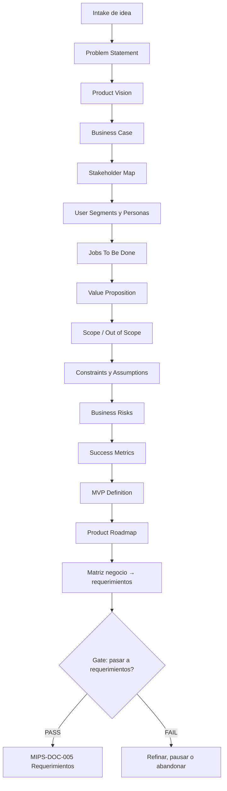

# MIPS-DOC-004 — Ingeniería de producto, negocio y stakeholders

## 1. Resumen ejecutivo

Este documento define el estándar de **ingeniería de producto, negocio y stakeholders** de MIPSoftware. Su propósito es impedir que el emprendimiento construya software técnicamente correcto pero desconectado de un problema real, de un usuario identificable, de una oportunidad viable o de restricciones verificables.

MIPS-DOC-004 opera como la entrada formal al ciclo de vida profesional de software. Antes de avanzar a ingeniería de requerimientos, arquitectura o implementación, todo proyecto no trivial debe demostrar evidencia mínima de:

- problema u oportunidad;
- propuesta de valor;
- segmento de usuarios/clientes;
- stakeholders y responsabilidades;
- alcance y exclusiones;
- restricciones;
- riesgos de negocio;
- definición de MVP;
- métricas de éxito;
- trazabilidad negocio → requerimientos.

La regla normativa es:

> **No se debe construir software profesional sin una hipótesis de valor explícita, un usuario identificable, un alcance controlado y criterios claros para continuar, pausar o abandonar el proyecto.**

## 2. Propósito

Definir cómo se documenta, valida y gobierna la dimensión de producto y negocio de cualquier aplicación desarrollada bajo MIPSoftware.

El documento responde:

- ¿Qué problema se intenta resolver?
- ¿Para quién se resuelve?
- ¿Por qué vale la pena construirlo?
- ¿Qué queda dentro y fuera del alcance?
- ¿Qué restricciones condicionan el diseño?
- ¿Cómo se medirá el éxito?
- ¿Qué evidencia permite pasar a requerimientos?
- ¿Cuándo debe pausarse o abandonarse la iniciativa?

## 3. Alcance

Aplica a:

- aplicaciones web;
- aplicaciones móviles;
- APIs;
- plataformas internas;
- sistemas de información;
- automatizaciones;
- productos SaaS;
- herramientas internas;
- sistemas con módulos inteligentes o agénticos.

Cuando el producto incluya IA, agentes, LLMs, RAG, memoria, tool calling o automatización inteligente, este documento se aplica junto con **MIASI**.

## 4. Principios normativos

| Principio | Regla |
|---|---|
| Problema antes de solución | Ningún proyecto debe comenzar por stack, framework o interfaz sin problema documentado. |
| Usuario antes de feature | Toda capacidad debe relacionarse con un usuario, actor, rol o proceso. |
| Valor antes de automatización | Automatizar un proceso débil no lo convierte en producto viable. |
| Alcance explícito | Todo MVP debe declarar qué incluye y qué excluye. |
| Métricas desde el inicio | Todo producto debe tener métricas de éxito, aprendizaje o abandono. |
| Riesgo visible | Los riesgos de negocio deben registrarse antes de comprometer arquitectura. |
| Trazabilidad | Toda épica o requerimiento relevante debe rastrearse hacia un objetivo de negocio. |
| Decisión formal | El paso a requerimientos debe aprobarse con evidencia, no por intuición. |

## 5. Modelo de flujo producto → requerimientos



## 6. Artefactos obligatorios

| Artefacto | Archivo plantilla | Obligatorio | Momento de uso |
|---|---|---:|---|
| Product Vision | `templates/product_vision.md` | Sí | Antes de requerimientos |
| Business Case | `templates/business_case.md` | Sí | Antes de priorizar inversión/esfuerzo |
| Stakeholder Map | `templates/stakeholder_map.md` | Sí | Antes de entrevistas/requerimientos |
| User Personas | `templates/user_personas.md` | Condicional | Obligatorio para productos con usuarios finales |
| MVP Scope | `templates/mvp_scope.md` | Sí | Antes de backlog inicial |
| Product Roadmap | `templates/product_roadmap.md` | Sí | Antes de planificación por releases |

## 7. Product Vision

### 7.1 Propósito

La visión de producto explica por qué existe el producto, para quién se construye, qué necesidad resuelve, qué lo hace valioso y qué impacto se espera producir.

### 7.2 Campos mínimos

| Campo | Descripción | Criterio PASS |
|---|---|---|
| Visión | Cambio positivo esperado | Es concreta y verificable |
| Target group | Usuarios/clientes principales | Segmento identificable |
| Necesidades | Dolor, beneficio o tarea a resolver | Priorizadas |
| Producto | Capacidades esenciales | No es una lista inflada de features |
| Business goals | Objetivos de negocio/aprendizaje | Medibles o validables |

### 7.3 Criterios de bloqueo

Bloquear avance si:

- la visión es genérica;
- no hay usuario o cliente identificable;
- el problema es una suposición no validada;
- el producto se define solo como “una app de X”;
- no hay objetivo de negocio, aprendizaje o impacto.

## 8. Problem Statement

### 8.1 Propósito

El Problem Statement describe el problema real, su contexto, quién lo sufre, qué consecuencia genera y por qué resolverlo ahora.

### 8.2 Estructura mínima

| Elemento | Pregunta |
|---|---|
| Contexto | ¿Dónde ocurre el problema? |
| Actor afectado | ¿Quién lo sufre? |
| Dolor | ¿Qué dificultad o costo genera? |
| Evidencia | ¿Qué datos, entrevistas o señales lo soportan? |
| Impacto | ¿Qué pasa si no se resuelve? |
| Urgencia | ¿Por qué ahora? |

### 8.3 Criterios de abandono temprano

Un proyecto debe pausarse o abandonarse si:

- el problema no puede explicarse sin mencionar la solución;
- ningún usuario lo reconoce como problema;
- el costo de resolverlo supera el valor esperado;
- la oportunidad depende de restricciones legales, técnicas o comerciales no controlables;
- no hay forma razonable de validar la hipótesis con un MVP.

## 9. Business Case

### 9.1 Propósito

El Business Case justifica si vale la pena invertir tiempo, presupuesto y esfuerzo en el producto.

### 9.2 Componentes

| Componente | Descripción |
|---|---|
| Oportunidad | Qué valor se puede crear o capturar |
| Beneficiarios | Quién recibe valor |
| Costos | Desarrollo, operación, soporte, modelos, infraestructura |
| Beneficios | Ingresos, ahorro, eficiencia, aprendizaje, portafolio |
| Riesgos | Mercado, técnica, operación, legal, seguridad |
| Alternativas | No hacer, comprar, integrar, automatizar parcialmente |
| Decisión | continuar, explorar, pausar, abandonar |

### 9.3 Criterios PASS

- Existe una razón económica, operativa, estratégica o de aprendizaje.
- Se reconocen alternativas distintas a construir software.
- Los costos y riesgos no se ocultan.
- La decisión está explícita.

## 10. Value Proposition

### 10.1 Propósito

Definir qué valor entrega el producto a cada segmento y cómo alivia dolores o genera ganancias relevantes.

### 10.2 Campos mínimos

| Campo | Descripción |
|---|---|
| Segmento | Usuario/cliente objetivo |
| Job | Tarea funcional, social o emocional |
| Pains | Obstáculos, costos o riesgos |
| Gains | Beneficios esperados |
| Producto/servicio | Qué se ofrece |
| Pain relievers | Cómo reduce dolores |
| Gain creators | Cómo crea beneficios |
| Diferenciación | Por qué elegir esta solución |

## 11. Stakeholder Map

### 11.1 Propósito

Identificar actores, intereses, poder de decisión, riesgos, necesidades de comunicación y responsabilidades.

### 11.2 Tipos de stakeholders

| Tipo | Ejemplos |
|---|---|
| Usuarios finales | Operadores, clientes, estudiantes, vendedores |
| Compradores | Dueño del negocio, sponsor, cliente contratante |
| Operadores | Soporte, administración, analistas |
| Reguladores | Entidades legales, cumplimiento, auditoría |
| Técnicos | Dev, QA, DevOps, seguridad |
| Afectados indirectos | Clientes de clientes, proveedores, terceros |

### 11.3 Criterios de bloqueo

Bloquear si:

- no se identifica quién decide;
- no se identifica quién usa;
- no se identifica quién opera;
- no se identifican stakeholders afectados por datos personales, pagos o seguridad;
- se omite un actor crítico para aprobación o uso.

## 12. User Segments

Segmentar usuarios permite evitar “software para todos”. Cada segmento debe tener necesidades, contexto, restricciones y prioridad.

| Segmento | Necesidad | Prioridad | Evidencia | Riesgo |
|---|---|---:|---|---|
| Segmento primario | Dolor principal | Alta | Entrevista/dato/señal | Suposición no validada |
| Segmento secundario | Necesidad complementaria | Media | Observación | Puede inflar alcance |

## 13. Personas

Las personas son representaciones operativas de usuarios. No deben ser perfiles decorativos; deben informar decisiones de producto, UX, permisos, lenguaje, soporte y prioridades.

Cada persona debe incluir:

- nombre representativo;
- rol;
- contexto;
- objetivos;
- frustraciones;
- nivel técnico;
- dispositivos/canales;
- restricciones;
- escenarios de uso;
- métricas de éxito.

## 14. Jobs To Be Done

JTBD permite describir por qué un usuario “contrata” un producto para lograr progreso en una circunstancia concreta.

Formato recomendado:

```text
Cuando [situación/contexto], quiero [progreso/tarea], para poder [resultado esperado].
```

Se deben identificar dimensiones:

| Dimensión | Descripción |
|---|---|
| Funcional | Qué tarea necesita completar |
| Social | Cómo quiere ser percibido o interactuar |
| Emocional | Qué ansiedad, confianza o alivio busca |

## 15. Scope / Out of Scope

### 15.1 Propósito

Controlar alcance para evitar que el MVP se convierta en ERP, plataforma genérica o producto sobredimensionado.

### 15.2 Estructura mínima

| Categoría | Incluido | Excluido | Decisión |
|---|---|---|---|
| Funcional | Capacidades del MVP | Capacidades futuras | Mantener foco |
| Técnico | Stack permitido | Stack descartado | Evitar complejidad |
| Operativo | Procesos soportados | Procesos manuales | Reducir riesgo |
| IA/Agentes | Uso inteligente incluido | Autonomía no permitida | Activar MIASI si aplica |

## 16. Constraints

Las restricciones condicionan el diseño y deben documentarse antes de arquitectura.

| Tipo | Ejemplos |
|---|---|
| Técnicas | lenguaje, framework, infraestructura, dispositivo |
| Económicas | presupuesto, costo de APIs, hosting |
| Legales | privacidad, datos personales, facturación, pagos |
| Operativas | disponibilidad, soporte, horarios |
| Organizacionales | equipo, habilidades, tiempo |
| Seguridad | roles, secretos, autenticación |
| Integración | APIs externas, proveedores, formatos |

## 17. Assumptions

Toda suposición relevante debe registrarse como hipótesis verificable.

| Hipótesis | Tipo | Validación | Fecha límite | Decisión |
|---|---|---|---|---|
| Los usuarios necesitan registrar ventas desde móvil | Usuario | Entrevistas / prototipo | TBD | Pendiente |

## 18. Business Risks

| Riesgo | Categoría | Probabilidad | Impacto | Mitigación | Señal de alerta |
|---|---|---:|---:|---|---|
| Nadie paga por el producto | Mercado | Media | Alta | Validar disposición de pago | Usuarios quieren gratis |
| Alcance crece sin control | Producto | Alta | Alta | Scope freeze por MVP | Más módulos antes de validar |
| Dependencia de API externa | Técnica | Media | Media | Ruta manual/local | Cambios de proveedor |
| Datos sensibles mal manejados | Legal/seguridad | Media | Alta | Privacy by design | Datos sin clasificación |

## 19. Success Metrics

Las métricas deben medir valor, aprendizaje o eficiencia.

| Tipo | Ejemplos |
|---|---|
| Producto | activación, retención, uso recurrente |
| Negocio | ingresos, conversión, margen, costo de adquisición |
| Operación | tiempo ahorrado, errores reducidos |
| Calidad | defectos, performance, disponibilidad |
| Aprendizaje | hipótesis validadas, entrevistas, experimentos |
| IA/Agentes | task completion, tool accuracy, cost per task, approval rate |

## 20. MVP Definition

### 20.1 Regla normativa

El MVP no es la primera versión pobre del producto. Es el menor experimento funcional que permite aprender si el problema, usuario, valor y solución tienen sentido.

### 20.2 Campos mínimos

| Campo | Descripción |
|---|---|
| Hipótesis principal | Qué se quiere validar |
| Usuarios objetivo | Quién usará el MVP |
| Capacidades incluidas | Qué se construye |
| Capacidades excluidas | Qué queda fuera |
| Métricas | Cómo se evalúa |
| Duración | Ventana de prueba |
| Criterios de éxito | Cuándo continuar |
| Criterios de pausa | Cuándo revisar |
| Criterios de abandono | Cuándo detener |

## 21. Product Roadmap

El roadmap organiza aprendizaje y entregas por horizontes, no promesas rígidas.

| Horizonte | Objetivo | Entregables | Métricas | Riesgos |
|---|---|---|---|---|
| MVP | Validar hipótesis crítica | Flujo mínimo usable | Uso/feedback | Alcance inflado |
| Beta | Validar operación | Seguridad, roles, reportes | Retención/defectos | Soporte |
| Producción controlada | Operar con usuarios reales | CI/CD, observabilidad, soporte | SLO/errores | Escalabilidad |
| Evolución | Ampliar capacidades | Integraciones, agentes | ROI/costos | Complejidad |

## 22. Matriz de trazabilidad negocio → requerimientos

| Objetivo de negocio | Métrica | Usuario/segmento | Necesidad/JTBD | Feature candidata | Requerimiento futuro | Prioridad | Evidencia |
|---|---|---|---|---|---|---:|---|
| Reducir tiempo de registro de ventas | Tiempo por venta | Vendedor | Registrar venta rápido | Registro simple | REQ-F-001 | Alta | Entrevista |

Regla: ningún requerimiento prioritario debe existir sin trazabilidad hacia objetivo, necesidad o riesgo.

## 23. Gate: pasar a requerimientos

### 23.1 Checklist mínimo

| Ítem | Obligatorio | PASS | FAIL |
|---|---:|---|---|
| Problema documentado | Sí | Dolor claro y actor identificado | Solución sin problema |
| Visión de producto | Sí | Incluye target, necesidad, valor y objetivo | Genérica |
| Stakeholders | Sí | Decisor, usuario y operador identificados | Actores críticos ausentes |
| MVP definido | Sí | Hipótesis y alcance controlado | Lista inflada de features |
| Métricas de éxito | Sí | Medibles o verificables | Métricas vagas |
| Riesgos de negocio | Sí | Registrados y mitigados | Ignorados |
| Scope / out of scope | Sí | Exclusiones explícitas | Todo queda abierto |
| Decisión MIASI | Sí | Aplica/no aplica justificado | No evaluado |

### 23.2 Decisiones posibles

| Decisión | Condición |
|---|---|
| Continuar a requerimientos | Gate completo y riesgos aceptables |
| Refinar | Hay problema prometedor pero evidencia insuficiente |
| Pausar | Existen dependencias, restricciones o incertidumbre alta |
| Abandonar | No hay problema relevante, usuario, valor o viabilidad mínima |

## 24. Criterios de abandono o pausa

Debe recomendarse pausa o abandono si ocurre alguna condición:

- no se identifica usuario real;
- no se identifica decisor o sponsor;
- no existe problema con impacto verificable;
- el MVP mínimo sigue siendo demasiado costoso;
- la solución requiere capacidades técnicas fuera de alcance;
- depende de datos, APIs o permisos no disponibles;
- tiene riesgos legales o de seguridad no mitigables;
- el producto no puede diferenciarse ni generar aprendizaje útil;
- existe alternativa manual, SaaS o proceso externo más razonable.

## 25. Relación con MIASI

MIASI se activa cuando el producto incluya:

- IA generativa;
- agentes autónomos o semiautónomos;
- RAG;
- memoria persistente;
- tool calling;
- clasificación, recomendación o decisiones asistidas por IA;
- generación automática de contenido;
- automatización con impacto operativo;
- análisis de documentos o repositorios con agentes.

| Señal | Acción |
|---|---|
| El producto usa LLM | Crear Agent Card / Model Card |
| El producto ejecuta herramientas | Crear Tool Card / Policy Card |
| El producto usa RAG | Crear RAG Card / Eval Plan |
| El producto guarda memoria | Crear Memory Card / Data Handling |
| El producto toma acciones críticas | Human Approval Plan |

## 26. Relación con estándares externos

| Fuente | Uso en este documento |
|---|---|
| ISO/IEC/IEEE 12207 | Enmarca el ciclo de vida de software y transición a requerimientos/desarrollo |
| ISO/IEC/IEEE 29148 | Soporta trazabilidad negocio → requerimientos y calidad de requerimientos |
| Product Vision Board | Estructura visión, target, necesidades, producto y objetivos |
| Business Model Canvas | Permite evaluar modelo de negocio y viabilidad |
| Value Proposition Canvas | Conecta jobs, pains, gains y propuesta de valor |
| Jobs To Be Done | Profundiza motivaciones funcionales, sociales y emocionales |
| Lean Startup / MVP | Valida aprendizaje con mínima construcción razonable |

## 27. Plantillas asociadas

- `templates/product_vision.md`
- `templates/business_case.md`
- `templates/stakeholder_map.md`
- `templates/user_personas.md`
- `templates/mvp_scope.md`
- `templates/product_roadmap.md`

## 28. Changelog

| Versión | Fecha | Cambio |
|---|---|---|
| 0.1.0 | 2026-05-31 | Creación inicial de MIPS-DOC-004 |
