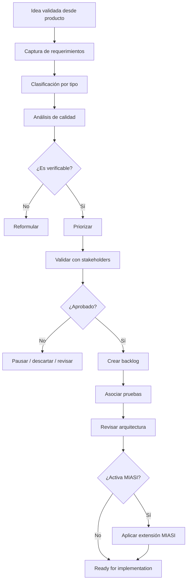

# MIPS-DOC-005 — Ingeniería profesional de requerimientos

## 1. Resumen ejecutivo

Este documento define el estándar de **ingeniería profesional de requerimientos** de MIPSoftware. Su propósito es convertir una idea validada desde producto y negocio en un conjunto de requerimientos claros, analizables, trazables, priorizados, verificables y aptos para alimentar arquitectura, backlog, diseño, pruebas, seguridad, operación y, cuando aplique, la extensión MIASI.

La regla central de este documento es normativa:

> Ningún requerimiento puede aprobarse si no tiene criterio de aceptación, trazabilidad hacia una necesidad de negocio o usuario, prioridad explícita, responsable de validación y evidencia de que puede verificarse mediante revisión, prueba, demostración, análisis o inspección.

Este estándar se apoya principalmente en ISO/IEC/IEEE 29148, que define procesos y productos de ingeniería de requerimientos para sistemas y software a lo largo del ciclo de vida. Se integra con ISO/IEC/IEEE 12207 y 15288 para ubicar requerimientos dentro del ciclo de vida general, con ISO/IEC 25010 para atributos de calidad y con ISO/IEC/IEEE 29119 para conectar requerimientos con pruebas.

---

## 2. Propósito

MIPS-DOC-005 establece cómo capturar, analizar, especificar, validar, priorizar, versionar y trazar requerimientos en proyectos reales de software.

Sus objetivos son:

1. Evitar construir software a partir de ideas ambiguas.
2. Convertir problemas, oportunidades y objetivos de negocio en requerimientos verificables.
3. Separar requerimientos de negocio, usuario, sistema, funcionales, no funcionales, restricciones, interfaces, datos, seguridad y operación.
4. Garantizar que todo requerimiento tenga criterio de aceptación y mecanismo de verificación.
5. Mantener trazabilidad desde negocio hasta backlog, arquitectura, pruebas y release.
6. Definir cuándo un requerimiento activa MIASI.
7. Establecer criterios PASS/FAIL/BLOCK para aprobar requerimientos antes de implementación.

---

## 3. Alcance

Este estándar aplica a:

- aplicaciones web;
- aplicaciones móviles;
- APIs;
- plataformas;
- sistemas internos;
- productos SaaS;
- sistemas transaccionales;
- automatizaciones;
- sistemas con IA o agentes;
- módulos experimentales que puedan evolucionar a producto;
- proyectos freelance o internos con intención de entrega profesional.

No reemplaza la ingeniería de producto de MIPS-DOC-004. La complementa. MIPS-DOC-004 decide **si vale la pena construir**. MIPS-DOC-005 define **qué debe construirse y cómo se comprueba que fue construido correctamente**.

---

## 4. Principios normativos

| Principio | Norma |
|---|---|
| Claridad | Todo requerimiento debe entenderse sin depender de conversación oral no registrada. |
| Verificabilidad | Todo requerimiento debe poder verificarse mediante prueba, inspección, análisis, demostración o revisión. |
| Trazabilidad | Todo requerimiento debe conectar con necesidad, stakeholder, riesgo, prueba y release. |
| Priorización explícita | Ningún requerimiento entra al backlog sin prioridad. |
| Medición de NFR | Todo requerimiento no funcional debe tener métrica, umbral y contexto. |
| Control de cambios | Todo cambio de requerimiento debe registrar motivo, impacto y aprobación. |
| Seguridad desde requerimientos | Seguridad, privacidad y operación no son tareas posteriores; deben aparecer como requerimientos. |
| Activación MIASI | Si el sistema usa IA, agentes, LLMs, RAG o automatización inteligente, deben generarse requerimientos MIASI. |

---

## 5. Tipos de requerimientos

### 5.1 Requerimientos de negocio

Describen objetivos, resultados esperados, restricciones comerciales, métricas de éxito y valor para la organización o emprendimiento.

**Ejemplo:**

```text
BR-001: El sistema debe permitir registrar ventas diarias para que el microemprendedor pueda estimar ingresos semanales con una desviación máxima del 5% respecto a los registros manuales validados.
```

### 5.2 Requerimientos de usuario

Expresan necesidades desde la perspectiva del usuario, rol o persona.

**Ejemplo:**

```text
UR-001: Como vendedor, quiero registrar una venta en menos de 60 segundos para no interrumpir la atención al cliente.
```

### 5.3 Requerimientos de sistema

Definen capacidades que el sistema debe proporcionar para satisfacer requerimientos de negocio o usuario.

**Ejemplo:**

```text
SR-001: El sistema debe crear una orden con productos, cantidades, cliente opcional, método de pago y estado inicial pendiente.
```

### 5.4 Requerimientos funcionales

Describen comportamientos observables del sistema.

**Ejemplo:**

```text
FR-001: El sistema debe permitir crear, editar, desactivar y consultar productos del catálogo.
```

### 5.5 Requerimientos no funcionales

Describen atributos de calidad. Deben ser medibles.

**Mala formulación:**

```text
NFR-001: El sistema debe ser rápido.
```

**Formulación aceptable:**

```text
NFR-001: El endpoint GET /products debe responder en menos de 300 ms para el percentil 95 con hasta 10.000 productos y 20 usuarios concurrentes en ambiente staging.
```

### 5.6 Restricciones

Condiciones impuestas al diseño, tecnología, operación, regulación o entorno.

```text
CON-001: El MVP debe funcionar sin dependencia obligatoria de proveedores cloud pagos.
```

### 5.7 Requerimientos de interfaces

Definen interacción con usuarios, APIs, sistemas externos, dispositivos o servicios.

```text
IR-001: La API de órdenes debe exponer endpoints REST versionados bajo /api/v1/orders.
```

### 5.8 Requerimientos de datos

Definen entidades, atributos, integridad, retención, clasificación y gobernanza de datos.

```text
DR-001: Todo cliente debe tener identificador único interno y estado de consentimiento de tratamiento de datos cuando aplique.
```

### 5.9 Requerimientos de seguridad

Definen controles de autenticación, autorización, secretos, validación, auditoría, privacidad y protección frente a amenazas.

```text
SEC-001: Toda acción de eliminación lógica debe registrarse con usuario, timestamp, entidad afectada y motivo.
```

### 5.10 Requerimientos de operación

Definen despliegue, observabilidad, soporte, backup, restauración, monitoreo y gestión de incidentes.

```text
OPS-001: El sistema debe emitir logs estructurados para creación, actualización y cancelación de órdenes.
```

---

## 6. Estructura de un buen requerimiento

Todo requerimiento formal debe incluir como mínimo:

| Campo | Obligatorio | Descripción |
|---|---:|---|
| ID | Sí | Identificador único estable. |
| Tipo | Sí | BR, UR, SR, FR, NFR, CON, IR, DR, SEC, OPS. |
| Título | Sí | Nombre corto. |
| Descripción | Sí | Conducta, necesidad o restricción. |
| Fuente | Sí | Stakeholder, documento, ley, decisión, hallazgo o riesgo. |
| Justificación | Sí | Por qué existe. |
| Prioridad | Sí | Must, Should, Could, Won't o escala equivalente. |
| Criterios de aceptación | Sí | Condiciones verificables. |
| Método de verificación | Sí | Test, inspección, análisis, demostración o revisión. |
| Dependencias | Sí | Requerimientos, sistemas, datos o decisiones relacionadas. |
| Riesgos | Sí | Riesgo si se implementa mal o no se implementa. |
| Estado | Sí | proposed, analyzed, approved, implemented, verified, deprecated. |
| Owner | Sí | Responsable de validación. |
| Trazabilidad | Sí | Conexión con objetivo, backlog, prueba, arquitectura y release. |

---

## 7. Atributos de calidad de un requerimiento

Un requerimiento aprobado debe ser:

| Atributo | Criterio práctico |
|---|---|
| Necesario | Responde a un objetivo, riesgo o necesidad real. |
| Claro | No permite múltiples interpretaciones razonables. |
| Atómico | No mezcla varias necesidades independientes. |
| Factible | Puede implementarse con restricciones conocidas. |
| Verificable | Puede comprobarse objetivamente. |
| Trazable | Tiene fuente, destino y relación con pruebas. |
| Consistente | No contradice otros requerimientos o decisiones. |
| Priorizado | Tiene urgencia y valor explícitos. |
| Medible | Especialmente en NFR y operación. |
| Versionado | Tiene historial de cambios. |

---

## 8. Historias de usuario

Las historias de usuario son una forma operativa de expresar necesidades desde la perspectiva del usuario. No sustituyen todos los requerimientos, pero son útiles para backlog.

Formato recomendado:

```text
Como [rol], quiero [capacidad], para [beneficio verificable].
```

Cada historia debe incluir:

- ID;
- rol;
- necesidad;
- beneficio;
- criterios de aceptación;
- dependencias;
- prioridad;
- riesgos;
- pruebas asociadas;
- definición de terminado.

**Regla:** una historia sin criterios de aceptación no está lista para implementación.

---

## 9. Casos de uso

Los casos de uso documentan interacciones completas entre actor y sistema.

Estructura mínima:

- ID;
- nombre;
- actor primario;
- actores secundarios;
- precondiciones;
- disparador;
- flujo principal;
- flujos alternos;
- excepciones;
- postcondiciones;
- reglas de negocio;
- requerimientos relacionados;
- pruebas derivadas.

Los casos de uso se recomiendan para procesos complejos, transaccionales o regulados.

---

## 10. Criterios de aceptación

Todo requerimiento funcional o historia debe tener criterios de aceptación. Se permiten dos formatos:

### 10.1 Formato checklist

```markdown
- [ ] Dado un producto activo, cuando el usuario registra una venta, entonces el inventario disminuye en la cantidad vendida.
- [ ] Si el inventario disponible es menor a la cantidad solicitada, el sistema bloquea la venta y muestra error validable.
```

### 10.2 Formato Given / When / Then

```gherkin
Given un producto activo con inventario 5
When el vendedor registra una venta de 2 unidades
Then el inventario disponible debe quedar en 3
And la venta debe quedar asociada al producto vendido
```

---

## 11. Reglas de negocio

Una regla de negocio define una política, restricción o cálculo propio del dominio. No debe esconderse dentro de código sin documentación.

Campos mínimos:

- ID;
- regla;
- tipo: restricción, derivación, cálculo, validación, autorización, proceso;
- fuente;
- ejemplos;
- excepciones;
- impacto en requerimientos;
- pruebas asociadas.

**Ejemplo:**

```text
RULE-001: Una venta no puede confirmarse si algún producto no tiene inventario suficiente, salvo que el modo de preventa esté habilitado explícitamente para ese producto.
```

---

## 12. Matriz de trazabilidad

La trazabilidad conecta negocio, requerimientos, diseño, pruebas y release.

| Objetivo | Requerimiento | Historia / Caso de uso | Arquitectura | Prueba | Release | Estado |
|---|---|---|---|---|---|---|
| OBJ-001 | FR-001 | US-001 | ADR-002 | TEST-001 | v0.1.0 | planned |

La matriz debe responder:

1. ¿Por qué existe este requerimiento?
2. ¿Quién lo pidió o validó?
3. ¿Qué parte del diseño lo implementa?
4. ¿Qué prueba lo verifica?
5. ¿En qué release se entrega?
6. ¿Qué riesgo cubre?

---

## 13. Priorización

Se permite usar MoSCoW, WSJF simplificado o una matriz valor/esfuerzo/riesgo.

### 13.1 MoSCoW

| Prioridad | Uso |
|---|---|
| Must | Sin esto el MVP no cumple su propósito. |
| Should | Importante, pero puede esperar si hay restricciones. |
| Could | Deseable si hay capacidad. |
| Won't for now | Fuera de alcance por ahora. |

### 13.2 Criterio MIPSoftware

Un requerimiento `Must` debe tener:

- justificación de negocio;
- criterio de aceptación;
- prueba mínima;
- owner;
- trazabilidad;
- riesgo si no se entrega.

---

## 14. Gestión de cambios

Todo cambio en requerimientos debe registrar:

- ID de cambio;
- requerimiento afectado;
- motivo;
- solicitante;
- impacto en alcance;
- impacto en arquitectura;
- impacto en datos;
- impacto en seguridad;
- impacto en pruebas;
- impacto en costo/tiempo;
- decisión: aceptar, rechazar, diferir;
- aprobador;
- fecha.

**Criterio de bloqueo:** cambios que afecten seguridad, privacidad, pagos, datos críticos, IA/agentes o despliegue no pueden aprobarse sin análisis de impacto.

---

## 15. Validación con stakeholders

Un requerimiento solo puede pasar a `approved` si:

- el stakeholder responsable lo entiende;
- acepta el criterio de aceptación;
- acepta prioridad y alcance;
- acepta exclusiones;
- hay evidencia de validación.

Métodos aceptados:

- reunión registrada;
- comentario en issue;
- aprobación de documento;
- prueba de prototipo;
- demo;
- validación por usuario experto;
- aprobación de PO/Product Owner.

---

## 16. Relación con backlog

El backlog implementable deriva de requerimientos aprobados. No debe ser una lista aislada de tareas técnicas.

Regla:

```text
Objetivo de negocio → Requerimiento → Historia/Caso de uso → Tarea → Prueba → Release
```

Una tarea técnica sin requerimiento relacionado puede existir solo si corresponde a deuda técnica, infraestructura, seguridad, observabilidad o mantenimiento, y debe estar justificada.

---

## 17. Relación con pruebas

Cada requerimiento debe tener estrategia de verificación.

| Tipo de requerimiento | Verificación recomendada |
|---|---|
| Funcional | Unit, integration, e2e, demo. |
| No funcional | Performance, load, security, accessibility, reliability. |
| Seguridad | Security tests, threat model review, SAST/DAST, manual review. |
| Datos | Data validation, migration tests, integrity checks. |
| Operación | Observability checks, runbook tests, backup/restore tests. |
| IA/agentes | Eval suite, tool-call accuracy, RAG grounding, policy gates, MIASI. |

**Regla:** un requerimiento crítico sin prueba asociada no puede pasar a release.

---

## 18. Relación con arquitectura

Los requerimientos alimentan decisiones arquitectónicas. Un requerimiento puede requerir:

- nueva vista C4;
- ADR;
- cambio de modelo de datos;
- nuevo contrato API;
- nuevo control de seguridad;
- nueva política operacional;
- nueva evaluación MIASI.

Si un requerimiento afecta atributos de calidad —seguridad, rendimiento, disponibilidad, mantenibilidad, escalabilidad, interoperabilidad— debe revisarse con arquitectura.

---

## 19. Activación de MIASI

MIASI se activa si un requerimiento incluye cualquiera de estos elementos:

| Señal | Acción obligatoria |
|---|---|
| LLM o modelo IA | Crear Model Card / Agent Card. |
| Agente con herramientas | Crear Tool Card y Policy Card. |
| RAG | Crear RAG Card y evaluación de grounding. |
| Memoria | Crear Memory Card y política de retención. |
| Acción con side effects | Activar dry-run, policy-as-code y human approval. |
| Generación automática de contenido | Activar evaluación de calidad, seguridad y revisión humana. |
| Decisiones asistidas | Documentar riesgo, límites y responsabilidad humana. |

---

## 20. Flujo de requerimientos



---

## 21. Matriz tipo de requerimiento → artefacto

| Tipo | Artefacto principal | Artefacto complementario |
|---|---|---|
| Negocio | Business Case | Product Vision |
| Usuario | User Story | Persona / JTBD |
| Sistema | Requirements Specification | Architecture Document |
| Funcional | Use Case / User Story | Acceptance Criteria |
| No funcional | Quality Attribute Scenario | Test Plan |
| Restricción | Constraint Log | ADR |
| Interface | API Contract | Integration Contract |
| Datos | Data Model | Data Dictionary |
| Seguridad | Threat Model | Security Requirements |
| Operación | Runbook | Observability Plan |
| IA/agentes | MIASI Agent Card | Eval Card / Policy Card |

---

## 22. Matriz requerimiento → quality gate

| Gate | Pregunta | PASS | FAIL/BLOCK |
|---|---|---|---|
| Claridad | ¿Se entiende sin explicación oral? | Redacción inequívoca. | Ambigüedad o términos vagos. |
| Valor | ¿Conecta con problema o stakeholder? | Tiene fuente y justificación. | No se sabe por qué existe. |
| Verificación | ¿Puede probarse? | Tiene método de verificación. | No tiene prueba posible. |
| Aceptación | ¿Tiene criterios? | Criterios concretos. | Sin criterios de aceptación. |
| Prioridad | ¿Está priorizado? | Prioridad y razón. | Prioridad ausente. |
| Trazabilidad | ¿Está conectado? | Objetivo, prueba, diseño, release. | Requerimiento aislado. |
| NFR | ¿Es medible? | Métrica, umbral y contexto. | “Rápido”, “seguro”, “usable” sin medición. |
| Seguridad | ¿Tiene impacto? | Evaluado o descartado explícitamente. | Ignorado. |
| MIASI | ¿Aplica IA/agentes? | Decisión registrada. | IA/agentes sin controles MIASI. |

---

## 23. Estados de requerimiento

| Estado | Descripción |
|---|---|
| proposed | Capturado, no analizado. |
| analyzing | En análisis de calidad, alcance, riesgo y trazabilidad. |
| refined | Reformulado y listo para validación. |
| approved | Aprobado por stakeholder responsable. |
| ready_for_backlog | Tiene criterios de aceptación, prioridad y trazabilidad. |
| implemented | Implementado en código. |
| verified | Verificado mediante pruebas o revisión. |
| released | Entregado en release. |
| deprecated | Reemplazado o retirado. |
| rejected | Descartado con justificación. |

---

## 24. Criterios PASS/FAIL/BLOCK

### PASS

Un requerimiento pasa si:

- tiene ID único;
- tiene tipo correcto;
- tiene fuente;
- tiene justificación;
- es claro;
- es verificable;
- tiene prioridad;
- tiene criterios de aceptación;
- tiene owner;
- tiene método de verificación;
- tiene trazabilidad mínima;
- tiene evaluación de seguridad/operación cuando aplica;
- tiene decisión MIASI cuando aplica.

### FAIL

Un requerimiento falla si:

- es ambiguo;
- mezcla múltiples requerimientos;
- no tiene prioridad;
- no tiene criterios de aceptación;
- no tiene fuente;
- no tiene verificación definida;
- no tiene relación con negocio, usuario o riesgo.

### BLOCK

Un requerimiento bloquea avance si:

- afecta seguridad, privacidad, pagos o datos críticos sin análisis;
- activa IA/agentes sin aplicar MIASI;
- es un NFR no medible;
- contradice una restricción aprobada;
- implica cambio de arquitectura sin ADR;
- pretende pasar a implementación sin validación de stakeholder;
- requiere datos personales sin política de tratamiento.

---

## 25. Documentos mínimos antes de backlog implementable

Antes de crear backlog implementable deben existir:

| Documento | Obligatorio |
|---|---:|
| Product Vision | Sí |
| Problem Statement | Sí |
| Business Case proporcional | Sí |
| Stakeholder Map | Sí |
| Requirements Specification | Sí |
| User Stories o Use Cases | Sí |
| Acceptance Criteria | Sí |
| Business Rules | Si aplica |
| Traceability Matrix | Sí |
| Risk Register | Sí |
| MIASI decision | Sí |

---

## 26. Preparación para DevPilot Local

DevPilot Local podrá automatizar este estándar mediante comandos futuros:

| Comando futuro | Acción |
|---|---|
| `devpilot requirements init` | Crea specification base. |
| `devpilot requirements add` | Agrega requerimiento con campos obligatorios. |
| `devpilot requirements validate` | Ejecuta quality gates. |
| `devpilot requirements trace` | Actualiza matriz de trazabilidad. |
| `devpilot requirements backlog` | Genera historias/tareas desde requerimientos aprobados. |
| `devpilot requirements test-map` | Mapea requerimientos a pruebas. |
| `devpilot requirements miasi-check` | Detecta activación MIASI. |

---

## 27. Relación con estándares externos

| Estándar | Aplicación en MIPS-DOC-005 |
|---|---|
| ISO/IEC/IEEE 29148 | Base principal para procesos, productos, construcción de buenos requerimientos y atributos. |
| ISO/IEC/IEEE 12207 | Ubica requerimientos dentro del ciclo de vida de software. |
| ISO/IEC/IEEE 15288 | Conecta requerimientos de software con sistema mayor. |
| ISO/IEC 25010 | Base para atributos de calidad y NFR medibles. |
| ISO/IEC/IEEE 29119 | Conecta requerimientos con pruebas y verificación. |
| NIST SSDF | Requerimientos de seguridad desde diseño y desarrollo seguro. |
| MIASI | Extensión obligatoria para requerimientos con IA/agentes. |

---

## 28. Changelog

| Versión | Fecha | Cambio |
|---|---|---|
| 0.1.0 | 2026-05-31 | Creación inicial de MIPS-DOC-005. |
