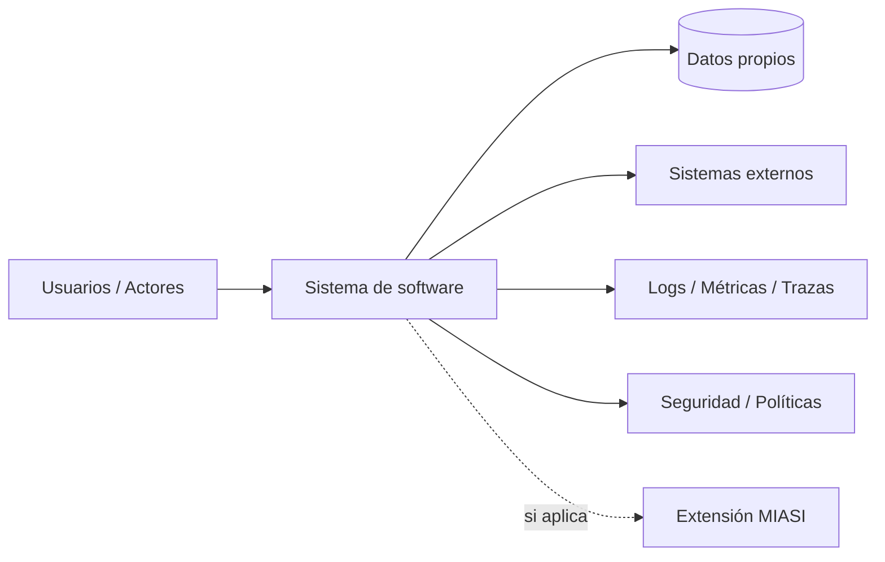
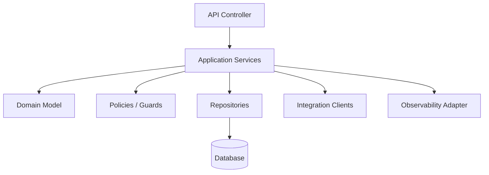
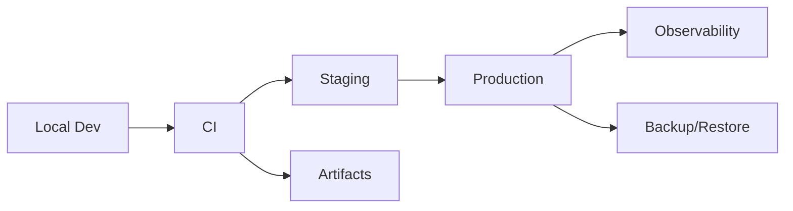

# MIPS-DOC-006 — Arquitectura profesional de software

## 1. Resumen ejecutivo

Este documento define el estándar arquitectónico de **MIPSoftware** para cualquier aplicación desarrollada dentro del emprendimiento. Su propósito es evitar que el diseño técnico surja accidentalmente durante la codificación y asegurar que cada sistema cuente con una arquitectura mínima, trazable, justificable, verificable y alineada con atributos de calidad.

La arquitectura en MIPSoftware no es solo un diagrama. Es el conjunto de decisiones estructurales, restricciones, trade-offs, patrones, contratos, vistas y riesgos que condicionan la implementación, las pruebas, la seguridad, la operación, la mantenibilidad y la evolución de un sistema.

Este estándar adopta:

- **arc42** como estructura de documentación arquitectónica;
- **C4 Model** como lenguaje visual principal para contexto, contenedores, componentes y, cuando aporte valor, código;
- **ISO/IEC 25010** como referencia para atributos de calidad;
- **SEBoK** como referencia general de pensamiento sistémico y arquitectura dentro de ingeniería de sistemas;
- **MIASI** como extensión obligatoria cuando el sistema incorpore IA, agentes, LLMs, RAG, memoria, tool calling o automatización inteligente.

## 2. Objetivo

Definir un estándar aplicable para especificar, revisar y aprobar la arquitectura de software de cualquier aplicación del emprendimiento antes de pasar a implementación significativa.

El estándar debe permitir:

- describir el contexto del sistema;
- justificar decisiones arquitectónicas;
- mapear atributos de calidad;
- documentar restricciones;
- seleccionar patrones adecuados;
- definir vistas de datos, seguridad, despliegue, observabilidad y operación;
- registrar riesgos y deuda técnica arquitectónica;
- activar MIASI cuando el sistema incluya capacidades inteligentes;
- preparar automatización futura en DevPilot Local.

## 3. Regla normativa central

> Toda aplicación no trivial debe tener una arquitectura mínima antes de iniciar implementación significativa. Toda decisión arquitectónica relevante debe registrarse mediante ADR. Toda arquitectura debe mapear explícitamente atributos de calidad, riesgos y restricciones.

## 4. Alcance

Este estándar aplica a:

- aplicaciones web;
- APIs backend;
- aplicaciones móviles;
- CLIs;
- servicios internos;
- plataformas SaaS;
- sistemas batch;
- integraciones;
- sistemas event-driven;
- sistemas agent-assisted;
- sistemas con IA o agentes mediante extensión MIASI.

No obliga a usar un patrón único ni una tecnología específica. El objetivo es **decidir explícitamente**, no imponer un stack.

## 5. Drivers arquitectónicos

Los drivers arquitectónicos son las fuerzas que justifican el diseño. Deben registrarse antes de elegir patrón, framework, base de datos o infraestructura.

| Driver | Pregunta guía | Evidencia requerida | Bloquea arquitectura si falta |
|---|---|---|---:|
| Objetivo de negocio | ¿Qué resultado de negocio debe soportar la arquitectura? | Product Vision / Business Case | Sí |
| Volumen esperado | ¿Cuántos usuarios, solicitudes, registros o eventos se esperan? | Supuestos cuantificados | Sí si afecta escalabilidad |
| Criticidad | ¿Qué ocurre si el sistema falla? | Clasificación de impacto | Sí |
| Datos | ¿Qué datos se almacenan, procesan o exponen? | Modelo de datos preliminar | Sí |
| Seguridad | ¿Qué activos deben protegerse? | Threat model inicial | Sí |
| Integraciones | ¿Qué sistemas externos intervienen? | Contratos/API/eventos | Sí |
| Operación | ¿Quién opera, monitorea y responde incidentes? | Runbook preliminar | Sí para producción |
| Evolución | ¿Qué cambios futuros son probables? | Roadmap / supuestos | No, pero debe registrarse |
| Inteligencia/IA | ¿Hay agentes, LLMs, RAG o automatización inteligente? | Decisión MIASI | Sí si aplica |

## 6. Atributos de calidad

Toda arquitectura debe mapear atributos de calidad. Como base se usan categorías compatibles con ISO/IEC 25010.

| Atributo | Definición operativa en MIPSoftware | Ejemplo de métrica | Evidencia arquitectónica |
|---|---|---|---|
| Functional suitability | El sistema cubre las funciones necesarias del dominio. | % casos de uso cubiertos | Casos de uso / componentes |
| Performance efficiency | El sistema responde dentro de umbrales definidos. | p95 latency, throughput | Vista de despliegue / capacidad |
| Compatibility | El sistema convive e interoperara con otros. | contratos API/eventos cumplidos | Vista de integración |
| Usability | El sistema puede ser usado por su audiencia. | tasa de éxito en flujo | UX/UI y journey |
| Reliability | El sistema continúa operando bajo fallas esperadas. | uptime, error rate | resiliencia, backups |
| Security | El sistema protege datos, accesos y operaciones. | controles ASVS / threat model | vista de seguridad |
| Maintainability | El sistema puede modificarse con bajo riesgo. | acoplamiento, cobertura, modularidad | componentes / límites |
| Portability | El sistema puede moverse entre entornos razonables. | pasos de despliegue reproducibles | vista de deployment |
| Operability | El sistema puede monitorearse y operarse. | logs, métricas, runbooks | vista operacional |

Regla: ningún atributo crítico debe quedar como frase genérica. Debe tener métrica, umbral o mecanismo verificable.

## 7. Restricciones

Las restricciones limitan decisiones. Deben documentarse antes de diseñar.

| Tipo de restricción | Ejemplos | Cómo documentarla |
|---|---|---|
| Técnica | lenguaje, framework, base de datos, SO | Architecture Document / ADR |
| Organizacional | equipo pequeño, presupuesto, experiencia | Business Case / Architecture Document |
| Operativa | local-first, sin nube inicial, bajo costo | Deployment View / Runbook |
| Seguridad | no almacenar secretos, PII, roles | Threat Model / Security View |
| Legal/compliance | privacidad, retención, auditoría | Data Governance / Risk Register |
| Tiempo | MVP en pocas semanas | Roadmap / Scope |
| IA/agentes | API keys opcionales, dry-run, human approval | MIASI Extension |

## 8. Contexto arquitectónico

Todo sistema debe responder:

- ¿Quién usa el sistema?
- ¿Qué problema resuelve?
- ¿Con qué sistemas se comunica?
- ¿Qué datos intercambia?
- ¿Qué límites tiene?
- ¿Qué queda fuera del sistema?
- ¿Qué parte, si existe, se considera inteligente o agéntica?

### 8.1 Diagrama contextual mínimo



## 9. C4 Nivel 1 — Contexto

El C4 Nivel 1 describe el sistema como una caja negra dentro de su entorno.

Debe incluir:

- usuarios y roles;
- sistemas externos;
- canales de interacción;
- flujos principales;
- fronteras del sistema;
- supuestos de seguridad;
- activación MIASI si aplica.

| Elemento | Obligatorio | Evidencia |
|---|---:|---|
| Sistema principal | Sí | Nombre y propósito |
| Personas/usuarios | Sí | Stakeholder map / personas |
| Sistemas externos | Si existen | Contratos o supuestos |
| Flujos de alto nivel | Sí | Diagrama y descripción |
| Límites/out of scope | Sí | Scope document |
| Datos sensibles | Si existen | Data classification |

## 10. C4 Nivel 2 — Contenedores

El C4 Nivel 2 muestra aplicaciones, servicios, bases de datos, colas, CLIs, workers, frontends y otros contenedores ejecutables o persistentes.

| Contenedor | Responsabilidad | Tecnología candidata | Datos | Riesgos | Observabilidad |
|---|---|---|---|---|---|
| Frontend | Interacción usuario | Web/móvil/CLI | sesión, estado UI | XSS, UX deficiente | eventos UI |
| Backend API | Reglas de aplicación | REST/GraphQL/FastAPI/NestJS/etc. | transacciones | auth, validaciones | logs, métricas |
| DB | Persistencia | PostgreSQL/SQLite/etc. | datos del dominio | pérdida, corrupción | backups, métricas |
| Worker | Tareas asíncronas | cola/jobs | eventos | duplicidad, retries | trazas, DLQ |
| Agent Runtime | Agentes/IA si aplica | local/API/modelos | prompts, trazas | prompt injection | AgentOps |

Regla: todo contenedor debe tener responsabilidad única suficientemente clara y una razón para existir.

## 11. C4 Nivel 3 — Componentes

El C4 Nivel 3 describe componentes internos de un contenedor.

Ejemplo para backend modular:



Cada componente debe documentar:

- responsabilidad;
- entradas;
- salidas;
- dependencias;
- errores esperados;
- contratos;
- pruebas mínimas;
- riesgos;
- ownership.

## 12. C4 Nivel 4 — Código

El nivel 4 solo se exige cuando aporta valor. No debe usarse para documentar todo el código.

Debe usarse cuando:

- hay lógica crítica;
- hay reglas de dominio complejas;
- hay seguridad sensible;
- hay algoritmos relevantes;
- hay interacción con IA/agentes;
- hay un componente reusable o framework interno.

Puede omitirse cuando el componente es trivial o cuando el diagrama se vuelve más costoso que útil.

## 13. Decisiones arquitectónicas ADR

Toda decisión relevante debe registrarse en un ADR.

Ejemplos de decisiones que requieren ADR:

- elegir arquitectura monolítica modular vs microservicios;
- elegir base de datos;
- elegir framework backend/frontend;
- decidir local-first, cloud o híbrido;
- introducir cola/eventos;
- introducir IA/agentes;
- permitir ejecución automática o solo dry-run;
- usar proveedor externo crítico;
- cambiar un patrón arquitectónico existente.

### 13.1 Estructura mínima de ADR

```text
Título
Estado
Contexto
Decisión
Alternativas consideradas
Consecuencias positivas
Consecuencias negativas
Riesgos
Relación con calidad
Relación con seguridad
Relación con MIASI, si aplica
Fecha
Responsable
```

## 14. Patrones arquitectónicos permitidos

MIPSoftware no impone un único patrón. Exige que el patrón sea explícito y justificado.

### 14.1 Monolito modular

| Cuándo usar | Cuándo no usar | Riesgos | Controles |
|---|---|---|---|
| MVPs, equipos pequeños, dominio cohesivo | equipos distribuidos con escalado independiente real | degradar a big ball of mud | módulos explícitos, pruebas, límites internos |

### 14.2 Layered architecture

| Cuándo usar | Cuándo no usar | Riesgos | Controles |
|---|---|---|---|
| CRUD, aplicaciones administrativas, reglas simples | dominios complejos con alta variabilidad | lógica de negocio en controllers | capas claras, servicios, repositorios |

### 14.3 Clean architecture

| Cuándo usar | Cuándo no usar | Riesgos | Controles |
|---|---|---|---|
| lógica de negocio importante, testabilidad alta | prototipos pequeños con bajo riesgo | sobreingeniería | límites de dependencias, casos de uso |

### 14.4 Hexagonal architecture

| Cuándo usar | Cuándo no usar | Riesgos | Controles |
|---|---|---|---|
| múltiples adaptadores externos, necesidad de independencia | apps simples sin integraciones | exceso de abstracción | ports/adapters justificados |

### 14.5 Microservices

| Cuándo usar | Cuándo no usar | Riesgos | Controles |
|---|---|---|---|
| equipos/servicios autónomos, escalado independiente, bounded contexts maduros | MVPs, equipos pequeños, dominio incierto | complejidad operacional | observabilidad, contratos, CI/CD, ownership |

### 14.6 Event-driven

| Cuándo usar | Cuándo no usar | Riesgos | Controles |
|---|---|---|---|
| procesos asíncronos, integración desacoplada, auditoría de eventos | flujos simples síncronos | duplicidad, orden, consistencia eventual | idempotencia, DLQ, trazas |

### 14.7 Serverless

| Cuándo usar | Cuándo no usar | Riesgos | Controles |
|---|---|---|---|
| cargas variables, tareas event-driven, bajo ops inicial | control fino de runtime o latencia estable crítica | vendor lock-in, cold starts | ADR, métricas, límites de costos |

### 14.8 Agent-assisted architecture

Se activa cuando el sistema incluye agentes, copilotos, tool calling, LLMs, RAG, memoria o automatización inteligente.

Debe cumplir además MIASI:

- Agent Card;
- Tool Card;
- ModelAdapter;
- Eval Plan;
- Policy Card;
- trazas AgentOps;
- dry-run por defecto para side effects;
- human approval para acciones críticas;
- guardrails y seguridad LLM.

## 15. Vista de datos

La arquitectura debe indicar:

- entidades principales;
- bases de datos;
- ownership de datos;
- datos sensibles;
- retención;
- auditoría;
- backups;
- consistencia;
- migraciones;
- integración con modelo de dominio;
- data lineage cuando aplique.

| Dato | Owner | Persistencia | Sensibilidad | Retención | Backup | Auditoría |
|---|---|---|---|---|---|---|
| Usuario | Auth/User module | DB principal | PII | definida | obligatorio | obligatorio |
| Evento de auditoría | Audit module | append-only/log | alto | definida | obligatorio | obligatorio |
| Prompt/trace IA | Agent runtime | trace store | potencialmente sensible | limitada | según política | obligatorio si MIASI |

## 16. Vista de despliegue

Debe documentar:

- entornos: local, dev, staging, prod;
- contenedores o procesos;
- infraestructura;
- secretos;
- variables de entorno;
- configuración;
- rollback;
- migraciones;
- acceso operacional;
- dependencia cloud/local;
- estrategia local-first/híbrida/cloud.



## 17. Vista de seguridad

Debe incluir:

- activos protegidos;
- fronteras de confianza;
- autenticación;
- autorización;
- gestión de secretos;
- validación de entradas;
- protección de salidas;
- auditoría;
- threat model;
- controles OWASP/ASVS cuando aplique;
- controles MIASI cuando haya IA/agentes.

| Control | Evidencia | Bloquea producción si falta |
|---|---|---:|
| AuthN/AuthZ definido | Security model | Sí |
| Secret management | Política/env/vault | Sí |
| Threat model mínimo | Threat model | Sí para sistemas con datos sensibles |
| SAST/dependency scan | Reporte CI | Sí según criticidad |
| Human approval | Policy MIASI | Sí si hay acciones críticas agentic |

## 18. Vista de observabilidad

Debe especificar:

- logs;
- métricas;
- trazas;
- auditoría;
- correlación por request_id/run_id;
- eventos de negocio;
- eventos de seguridad;
- dashboards;
- alertas;
- SLO/SLA si aplica;
- trazas AgentOps si MIASI aplica.

| Evento observable | Fuente | Uso | Retención |
|---|---|---|---|
| request_received | API | debugging / métricas | definida |
| domain_event_created | dominio | auditoría funcional | definida |
| security_decision | política | seguridad | alta |
| agent_tool_call | agente | AgentOps | limitada/sensible |
| deployment_completed | CI/CD | trazabilidad release | definida |

## 19. Vista de operación

Debe cubrir:

- cómo se inicia el sistema;
- cómo se detiene;
- cómo se despliega;
- cómo se revierte;
- cómo se diagnostica;
- cómo se restauran datos;
- cómo se atienden incidentes;
- qué tareas son manuales;
- qué tareas están automatizadas;
- qué permisos se requieren.

Todo sistema productivo debe tener runbook operacional mínimo.

## 20. Deuda técnica arquitectónica

La deuda arquitectónica debe registrarse explícitamente.

| Deuda | Impacto | Riesgo | Fecha límite | Mitigación | Responsable |
|---|---|---|---|---|---|
| DB compartida entre módulos | acoplamiento | medio | sprint N | separar ownership | architecture owner |
| falta de colas | pérdida de resiliencia | medio | después MVP | introducir worker | backend lead |
| sin AgentOps persistente | baja trazabilidad IA | alto si MIASI | antes piloto | activar trazas | AI lead |

Regla: deuda aceptada sin responsable y fecha de revisión no es deuda gestionada; es riesgo oculto.

## 21. Arquitectura mínima antes de implementación

Antes de implementar un proyecto no trivial deben existir al menos:

| Artefacto | Obligatorio | Bloquea código si falta |
|---|---:|---:|
| Product Vision resumida | Sí | Sí |
| Requerimientos iniciales | Sí | Sí |
| Diagrama C4 Contexto | Sí | Sí |
| Diagrama C4 Contenedores | Sí | Sí para más de un contenedor |
| Atributos de calidad | Sí | Sí |
| Restricciones | Sí | Sí |
| Decisiones ADR iniciales | Si hay decisiones relevantes | Sí |
| Vista de datos | Si persiste datos | Sí |
| Vista de seguridad | Si hay usuarios/datos/API | Sí |
| Vista de despliegue | Sí | Sí |
| Vista de observabilidad | Sí para MVP serio | Sí para producción |
| Decisión MIASI | Sí | Sí |

## 22. Quality gates arquitectónicos

| Gate | PASS | FAIL | BLOCK |
|---|---|---|---|
| Contexto | sistema, usuarios y externos identificados | actores ambiguos | sin contexto |
| Contenedores | responsabilidades claras | contenedores mezclan responsabilidades | no existe vista de ejecución |
| Componentes | límites internos razonables | alta ambigüedad | lógica crítica sin dueño |
| Calidad | atributos medibles | atributos genéricos | atributos críticos ausentes |
| Seguridad | controles base definidos | controles parciales | datos sensibles sin threat model |
| Datos | ownership y persistencia definidos | entidades ambiguas | datos críticos sin política |
| Operación | despliegue y rollback descritos | operación manual ambigua | sin rollback productivo |
| MIASI | activación evaluada | activación dudosa | IA/agentes sin controles MIASI |

## 23. Relación con MIASI

MIASI se activa si la arquitectura incluye:

- LLMs;
- agentes;
- RAG;
- memoria;
- tool calling;
- automatización inteligente;
- decisiones asistidas por IA;
- generación automática con impacto externo;
- acciones con side effects decididas o sugeridas por modelos.

Cuando MIASI aplica, la arquitectura debe extenderse con:

| Elemento MIASI | Evidencia requerida |
|---|---|
| Agent Layer | Agent Cards |
| Model Layer | ModelAdapter / Model Card |
| Tool Layer | Tool Cards / Tool Registry |
| Knowledge Layer | RAG Card / fuentes |
| Memory Layer | Memory Card / retención |
| Evaluation Layer | Eval Plan / agent evals |
| Security Layer | Policy Card / guardrails |
| Human Approval | Approval Plan |
| Observability | AgentOps traces |

## 24. Automatización futura en DevPilot Local

DevPilot Local deberá poder automatizar parcialmente:

| Comando futuro | Función |
|---|---|
| `devpilot architecture init` | Crear esqueleto de arquitectura. |
| `devpilot architecture c4` | Generar/validar vistas C4. |
| `devpilot adr new` | Crear ADR desde plantilla. |
| `devpilot architecture check` | Validar gates arquitectónicos. |
| `devpilot architecture risks` | Crear/actualizar architecture risk log. |
| `devpilot miasi check` | Determinar si aplica MIASI. |
| `devpilot readiness-check` | Validar readiness integral. |

## 25. Criterios de aceptación del documento de arquitectura

Una arquitectura se considera aceptable si:

- tiene contexto y alcance claros;
- identifica usuarios y sistemas externos;
- define contenedores y responsabilidades;
- define componentes críticos;
- mapea atributos de calidad;
- registra restricciones;
- documenta decisiones mediante ADR;
- incluye vistas de datos, seguridad, despliegue, observabilidad y operación;
- identifica deuda técnica arquitectónica;
- evalúa activación de MIASI;
- tiene quality gates verificables.

## 26. Criterios de bloqueo

La arquitectura bloquea avance si:

- no existe contexto del sistema;
- no hay requerimientos mínimos trazables;
- no se conocen datos persistidos;
- no se documentan riesgos críticos;
- no hay estrategia de seguridad para datos sensibles;
- no hay decisión sobre despliegue;
- no hay rollback para producción;
- se elige microservicios sin justificación operacional;
- se incluye IA/agentes sin MIASI;
- no hay ADR para decisiones estructurales importantes.

## 27. Referencias

- arc42 — Architecture documentation and communication template. https://arc42.org/
- C4 Model — Context, Container, Component and Code diagrams. https://c4model.com/
- ISO/IEC 25010 — Systems and software engineering quality model. https://www.iso.org/standard/35733.html
- SEBoK — Systems Engineering Body of Knowledge. https://sebokwiki.org/
- ISO/IEC/IEEE 12207 — Software life cycle processes.
- ISO/IEC/IEEE 29148 — Requirements engineering.
- MIASI v1.0.0 — Modelo de Ingeniería de Sistemas Agénticos Inteligentes.

## 28. Changelog

| Versión | Fecha | Cambio | Responsable |
|---|---:|---|---|
| 0.1.0 | 2026-05-31 | Creación inicial del estándar arquitectónico MIPSoftware. | AI_agents / MIPSoftware |
