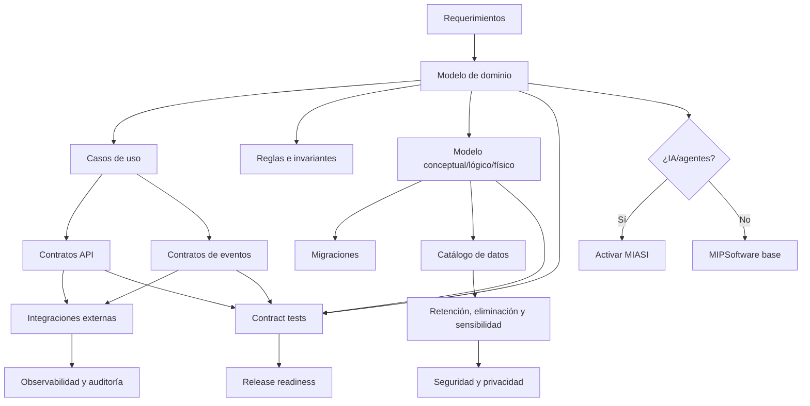

# MIPS-DOC-007 — Modelo de dominio, datos e integraciones

## 1. Resumen ejecutivo

Este documento define el estándar de MIPSoftware para modelar **dominio, datos, persistencia, APIs, eventos e integraciones**. Su propósito es evitar que los sistemas se implementen como colecciones accidentales de tablas, endpoints y funciones sin reglas de negocio explícitas, sin contratos verificables y sin gobierno de datos.

La regla central es:

```text
Ningún módulo transaccional debe implementarse sin modelo de dominio.
Ninguna API debe publicarse sin contrato.
Todo dato sensible debe tener política de manejo, retención, eliminación y auditoría.
```

El estándar aplica a sistemas web, móviles, APIs, plataformas internas, sistemas batch, integraciones B2B, sistemas event-driven, microservicios, monolitos modulares y sistemas inteligentes. Cuando un módulo incorpore agentes IA, LLMs, RAG, memoria, tool calling, automatización inteligente o decisiones asistidas por IA, este documento activa además los controles de **MIASI**.

## 2. Objetivo

Definir cómo se deben especificar, revisar, aprobar y mantener:

- el modelo de dominio;
- entidades, agregados, invariantes y reglas de negocio;
- casos de uso del dominio;
- modelos conceptual, lógico y físico de datos;
- migraciones;
- catálogo y diccionario de datos;
- políticas de retención y eliminación;
- contratos API;
- contratos de eventos;
- versionado de API;
- manejo de errores;
- integraciones externas;
- webhooks;
- idempotencia;
- auditoría de cambios.

## 3. Alcance

Este estándar aplica a todo proyecto que persista datos, exponga interfaces, consuma APIs externas, publique eventos, reciba webhooks, sincronice información con terceros o contenga reglas de negocio significativas.

Quedan incluidos:

| Área | Incluido | Evidencia mínima |
|---|---|---|
| Dominio | Entidades, agregados, reglas, invariantes, casos de uso | `domain_model.md` |
| Datos | Modelo conceptual, lógico, físico, catálogo, diccionario | `data_model.md`, `data_dictionary.md` |
| Persistencia | Tablas, índices, constraints, migraciones, seed data | `migration_plan.md` |
| API | Endpoints, schemas, errores, auth, versionado | `api_contract.md` u OpenAPI |
| Eventos | Tipos de eventos, payload, ordering, consumidores | `event_contract.md` |
| Integraciones | Sistemas externos, SLA, credenciales, fallbacks | `integration_contract.md` |
| Webhooks | Emisores, receptores, reintentos, firma, idempotencia | sección de contrato API/integración |
| Auditoría | Cambios relevantes, actor, tiempo, before/after | política de audit log |

## 4. Principios normativos

| Principio | Regla operativa | Criterio de revisión |
|---|---|---|
| Dominio antes que base de datos | Las tablas no son el modelo de negocio. | Debe existir modelo de dominio previo al modelo físico. |
| Contratos antes que integración | Ninguna API/evento/webhook se publica sin contrato. | Debe existir especificación revisable. |
| Datos con dueño | Todo dato persistido debe tener propietario funcional/técnico. | El catálogo de datos debe declarar `owner`. |
| Sensibilidad explícita | Todo dato debe clasificarse por sensibilidad. | El diccionario debe incluir clasificación. |
| Compatibilidad controlada | Cambios breaking deben versionarse y aprobarse. | Debe existir política de versionado. |
| Idempotencia en operaciones críticas | Reintentos no deben duplicar efectos de negocio. | Operaciones de escritura críticas deben declarar estrategia. |
| Auditoría proporcional | Cambios relevantes deben ser trazables. | Debe existir audit log para entidades críticas. |
| Retención y eliminación | Los datos no se conservan indefinidamente por defecto. | Debe existir política de retención. |
| Integración defensiva | Todo sistema externo puede fallar. | Deben existir timeouts, retries, fallback y observabilidad. |
| MIASI cuando aplique | IA/agents/RAG/memoria activan controles especializados. | Debe existir decisión explícita de activación MIASI. |

## 5. Relación con el ciclo de vida MIPSoftware

| Fase MIPSoftware | Rol de este documento | Artefactos esperados |
|---|---|---|
| 4. Requerimientos | Identifica datos, reglas, interfaces y restricciones. | Requerimientos de datos/interfaz. |
| 6. Arquitectura | Define límites de módulos, servicios, APIs y persistencia. | Vista de datos e integración. |
| 7. Diseño de dominio | Formaliza entidades, agregados y casos de uso. | `domain_model.md` |
| 8. Diseño de datos | Define modelos conceptual/lógico/físico. | `data_model.md`, `data_dictionary.md` |
| 9. Diseño interfaces/API | Define contratos HTTP/eventos/webhooks. | `api_contract.md`, `event_contract.md` |
| 14. Implementación | Implementa dominio, repositorios, migraciones y contratos. | Código + migraciones + tests. |
| 16. Verificación | Valida invariantes, contratos, datos y migraciones. | Tests de dominio, contrato y datos. |
| 20. Operación | Monitorea integraciones, errores, datos y auditoría. | Dashboards, logs, métricas. |
| 23. Mantenimiento | Gestiona evolución de modelo/API/datos. | ADRs, migraciones, changelog. |

## 6. Modelo de dominio

El modelo de dominio describe el lenguaje, conceptos, reglas y comportamientos esenciales del negocio. No debe confundirse con el modelo de datos físico ni con una lista de pantallas.

Debe incluir:

- contexto del dominio;
- bounded contexts o módulos funcionales;
- entidades;
- value objects;
- agregados;
- servicios de dominio;
- casos de uso;
- reglas de negocio;
- invariantes;
- eventos de dominio;
- errores de dominio;
- glosario del dominio.

### 6.1 Criterios mínimos del modelo de dominio

| Elemento | Obligatorio | Criterio PASS | Criterio FAIL |
|---|---:|---|---|
| Glosario de dominio | Sí | Términos clave definidos sin ambigüedad. | El equipo usa palabras distintas para el mismo concepto. |
| Entidades | Sí | Identidad, atributos y ciclo de vida definidos. | Solo existen tablas sin significado de negocio. |
| Reglas de negocio | Sí | Cada regla tiene condición, acción y excepción. | Reglas embebidas solo en código sin documentación. |
| Invariantes | Sí | Estados inválidos están prohibidos explícitamente. | El sistema puede persistir estados imposibles. |
| Casos de uso | Sí | Actor, precondición, flujo y resultado definidos. | Los endpoints reemplazan los casos de uso. |
| Eventos de dominio | Si aplica | Evento, causa, payload y consumidores definidos. | Se publican eventos sin semántica de negocio. |

## 7. Entidades

Una entidad representa un concepto con identidad estable durante el tiempo. Las entidades no se definen solo por sus campos, sino por su identidad, ciclo de vida, reglas e invariantes.

Cada entidad debe declarar:

```yaml
entity: "Order"
identity: "order_id"
responsibility: "Representar una intención de compra confirmable"
lifecycle_states:
  - draft
  - confirmed
  - paid
  - cancelled
invariants:
  - "Una orden confirmada debe tener al menos una línea."
  - "Una orden pagada no puede cambiar el total sin ajuste formal."
sensitive_fields:
  - "customer_email"
auditable_changes:
  - "status"
  - "total_amount"
```

## 8. Agregados

Un agregado agrupa entidades y value objects que deben tratarse como una unidad de consistencia. Un agregado tiene una raíz responsable de proteger invariantes.

| Criterio | Regla |
|---|---|
| Raíz explícita | Todo agregado debe tener `aggregate_root`. |
| Límite transaccional | Una transacción no debe modificar múltiples agregados salvo justificación. |
| Invariantes protegidas | La raíz debe impedir estados inválidos. |
| Tamaño controlado | Agregados demasiado grandes generan acoplamiento y bloqueos. |
| Eventos de salida | Cambios significativos pueden emitir eventos de dominio. |

Ejemplo:

```yaml
aggregate: "OrderAggregate"
root: "Order"
entities:
  - "Order"
  - "OrderLine"
value_objects:
  - "Money"
  - "Address"
invariants:
  - "total = sum(order_lines.subtotal)"
  - "confirmed orders cannot be empty"
transaction_boundary: "single_order"
domain_events:
  - "OrderConfirmed"
  - "OrderCancelled"
```

## 9. Casos de uso

Un caso de uso representa una intención funcional completa. Debe describirse antes de implementar endpoints, componentes UI o comandos.

Estructura mínima:

```yaml
use_case_id: "UC-ORDER-001"
name: "Confirmar orden"
primary_actor: "Vendedor"
goal: "Confirmar una orden con productos válidos e inventario disponible"
preconditions:
  - "La orden existe en estado draft"
  - "La orden tiene al menos una línea"
main_flow:
  - "Validar líneas"
  - "Calcular total"
  - "Reservar inventario"
  - "Cambiar estado a confirmed"
postconditions:
  - "Orden confirmada"
  - "Inventario reservado"
exceptions:
  - code: "INSUFFICIENT_STOCK"
    behavior: "No confirmar orden y reportar productos insuficientes"
```

## 10. Reglas de negocio

Las reglas de negocio deben ser explícitas, versionables y trazables hacia requerimientos o decisiones.

| Campo | Descripción |
|---|---|
| ID | Identificador estable de la regla. |
| Nombre | Nombre corto. |
| Descripción | Qué restricción o cálculo impone. |
| Fuente | Requerimiento, stakeholder, regulación, decisión. |
| Prioridad | Crítica, alta, media, baja. |
| Validación | Cómo se prueba. |
| Excepciones | Casos permitidos. |
| Owner | Responsable funcional. |

Regla mínima:

```yaml
rule_id: "BR-ORDER-001"
name: "Orden confirmada requiere líneas"
statement: "Una orden no puede confirmarse si no contiene al menos una línea válida."
source: "REQ-ORDER-002"
validation: "unit_test + use_case_test"
owner: "Product Owner"
```

## 11. Invariantes

Una invariante describe una condición que siempre debe cumplirse para mantener consistencia del dominio.

Ejemplos:

| Dominio | Invariante |
|---|---|
| Ventas | Una venta pagada debe tener total mayor que cero. |
| Inventario | El stock disponible no puede ser negativo sin ajuste aprobado. |
| Usuarios | Un usuario activo debe tener identidad verificable. |
| Pagos | Un pago confirmado no puede registrarse dos veces para la misma orden. |
| Agentes IA | Una acción destructiva propuesta por agente requiere policy gate y aprobación humana. |

Las invariantes críticas deben cubrirse con tests automatizados.

## 12. Modelo conceptual de datos

El modelo conceptual describe información de negocio sin detalles técnicos de implementación. Responde: qué datos existen, qué significan y cómo se relacionan.

Debe incluir:

- entidades de información;
- relaciones;
- cardinalidades;
- definiciones;
- sensibilidad;
- dueños funcionales;
- restricciones de negocio;
- dependencias externas.

## 13. Modelo lógico de datos

El modelo lógico convierte el modelo conceptual en estructuras independientes de motor específico, por ejemplo tablas lógicas, documentos, índices lógicos o colecciones.

Debe definir:

- tablas/colecciones lógicas;
- claves primarias;
- claves foráneas;
- constraints;
- normalización/desnormalización justificada;
- índices lógicos;
- reglas de integridad;
- soft delete/hard delete;
- auditoría.

## 14. Modelo físico de datos

El modelo físico define cómo se implementan los datos en una tecnología concreta.

Debe incluir:

| Elemento | Obligatorio | Ejemplo |
|---|---:|---|
| Motor | Sí | PostgreSQL, SQLite, MongoDB, Redis. |
| Schema | Sí | `public`, `sales`, `auth`. |
| Tablas/colecciones | Sí | `orders`, `order_lines`. |
| Tipos | Sí | `uuid`, `numeric(12,2)`, `jsonb`. |
| Índices | Sí | `idx_orders_customer_id`. |
| Constraints | Sí | `not null`, `unique`, `check`. |
| Migraciones | Sí | `202606010001_create_orders.sql`. |
| Estrategia backup | Si persistente | snapshot, dump, PITR si aplica. |

## 15. Migraciones

Toda modificación estructural de datos debe realizarse mediante migraciones versionadas.

### 15.1 Política de migración

| Regla | Obligatoria |
|---|---:|
| Toda migración debe tener ID único. | Sí |
| Toda migración debe indicar si es reversible. | Sí |
| Toda migración destructiva requiere aprobación. | Sí |
| Toda migración en producción requiere backup o rollback plan. | Sí |
| Toda migración debe tener prueba en entorno no productivo. | Sí |
| Toda migración que cambia contrato API/evento debe actualizar documentación. | Sí |

### 15.2 Tipos de migración

| Tipo | Riesgo | Requiere aprobación |
|---|---:|---:|
| Crear tabla/campo opcional | Bajo | No necesariamente |
| Agregar índice | Medio | Según tamaño/impacto |
| Cambiar tipo de dato | Alto | Sí |
| Eliminar columna/tabla | Crítico | Sí |
| Migrar datos sensibles | Crítico | Sí |
| Cambiar clave primaria | Crítico | Sí |

## 16. Catálogo de datos

El catálogo de datos es el inventario gobernado de datos del sistema.

Campos mínimos:

| Campo | Descripción |
|---|---|
| `data_asset_id` | Identificador del activo de datos. |
| `name` | Nombre del dato/tabla/colección/campo. |
| `description` | Significado funcional. |
| `owner` | Responsable funcional/técnico. |
| `source` | Origen del dato. |
| `classification` | Público, interno, confidencial, sensible, regulado. |
| `retention` | Tiempo de conservación. |
| `deletion_policy` | Regla de eliminación. |
| `quality_rules` | Reglas de completitud, formato, unicidad, consistencia. |
| `lineage` | Origen y transformaciones relevantes. |

## 17. Retención y eliminación

Todo dato persistido debe tener una política explícita de conservación y eliminación.

| Tipo de dato | Retención sugerida | Eliminación | Observación |
|---|---:|---|---|
| Logs técnicos | 30–180 días | Automática | Según necesidad operacional. |
| Auditoría crítica | 1–5 años | Controlada | Según obligación contractual/legal. |
| Datos personales | Mínima necesaria | Borrado/anonymización | Requiere política de privacidad. |
| Datos de prueba | Corto plazo | Automática | No usar datos reales si no es necesario. |
| Datos de agentes/memoria | Según MIASI | Revisión y expiración | Evitar memoria indefinida. |

## 18. Contratos API

Toda API debe tener contrato antes de publicarse. Para HTTP APIs, el formato recomendado es OpenAPI cuando el proyecto lo amerite.

Contrato mínimo:

```yaml
api_name: "Sales API"
version: "v1"
base_url: "/api/v1"
auth: "bearer_token"
endpoints:
  - method: "POST"
    path: "/orders"
    operation_id: "createOrder"
    request_schema: "CreateOrderRequest"
    response_schema: "OrderResponse"
    errors:
      - "VALIDATION_ERROR"
      - "INSUFFICIENT_STOCK"
idempotency:
  required_for:
    - "POST /orders"
```

### 18.1 Contrato mínimo por endpoint

| Campo | Obligatorio |
|---|---:|
| Método HTTP | Sí |
| Ruta | Sí |
| Propósito | Sí |
| Autenticación/autorización | Sí |
| Request schema | Sí |
| Response schema | Sí |
| Errores | Sí |
| Validaciones | Sí |
| Idempotencia | Si escritura/reintento |
| Rate limits | Si público/externo |
| Versionado | Sí |
| Observabilidad | Sí |

## 19. Contratos de eventos

Un evento representa algo que ocurrió y puede ser consumido por otros componentes.

Contrato mínimo:

```yaml
event_type: "order.confirmed"
version: "1.0"
producer: "sales-service"
consumers:
  - "inventory-service"
  - "notification-service"
schema:
  order_id: "uuid"
  customer_id: "uuid"
  confirmed_at: "datetime"
delivery: "at_least_once"
ordering: "per_order"
idempotency_key: "event_id"
```

### 19.1 Reglas para eventos

| Regla | Criterio |
|---|---|
| Nombre semántico | Debe describir algo ocurrido, no una orden imperativa. |
| Versionado | Cambios incompatibles requieren nueva versión. |
| Idempotencia | Consumidores deben tolerar duplicados si hay `at_least_once`. |
| Observabilidad | Todo evento debe tener trace/correlation id cuando aplique. |
| Compatibilidad | No eliminar campos usados por consumidores sin deprecación. |

## 20. Versionado de API

El versionado debe proteger consumidores y evitar cambios incompatibles silenciosos.

| Cambio | ¿Breaking? | Acción requerida |
|---|---:|---|
| Agregar campo opcional de respuesta | No | Documentar. |
| Agregar endpoint | No | Documentar. |
| Cambiar tipo de campo | Sí | Nueva versión. |
| Eliminar campo | Sí | Deprecación + nueva versión. |
| Cambiar semántica de error | Sí | Nueva versión o aviso formal. |
| Cambiar auth | Sí | Plan de migración. |

## 21. Manejo de errores

Los errores deben ser consistentes, seguros y accionables.

Formato recomendado:

```json
{
  "error": {
    "code": "INSUFFICIENT_STOCK",
    "message": "No hay stock suficiente para confirmar la orden.",
    "correlation_id": "corr_123",
    "details": [
      {"field": "product_id", "issue": "stock_available_lt_requested"}
    ]
  }
}
```

Reglas:

- no exponer secretos;
- no exponer stack traces en producción;
- usar códigos estables;
- incluir `correlation_id`;
- diferenciar error de validación, negocio, autorización, integración y sistema;
- documentar errores en el contrato API.

## 22. Integraciones externas

Toda integración debe documentar:

| Campo | Obligatorio |
|---|---:|
| Sistema externo | Sí |
| Propósito | Sí |
| Owner interno | Sí |
| Owner externo/contacto | Si existe |
| Tipo de integración | API, webhook, batch, archivo, evento, SDK |
| Autenticación | Sí |
| Secret management | Sí |
| Rate limits | Si aplica |
| Timeouts | Sí |
| Retries | Sí |
| Fallback | Sí |
| SLA/dependencia | Si aplica |
| Datos compartidos | Sí |
| Clasificación de datos | Sí |
| Riesgos | Sí |
| Pruebas contractuales | Sí |

## 23. Webhooks

Los webhooks requieren tratamiento especial porque son llamadas entrantes de sistemas externos.

Reglas mínimas:

| Regla | Obligatoria |
|---|---:|
| Validar firma o autenticidad | Sí |
| Registrar evento recibido | Sí |
| Usar idempotency key | Sí |
| Responder rápido y procesar async si es costoso | Recomendado |
| No confiar en orden de llegada | Sí |
| Manejar reintentos | Sí |
| Validar schema | Sí |
| No exponer endpoints sin protección | Sí |

## 24. Idempotencia

La idempotencia evita duplicar efectos cuando una operación se reintenta.

Debe aplicarse especialmente a:

- creación de órdenes;
- pagos;
- confirmaciones;
- webhooks;
- eventos `at_least_once`;
- comandos de agentes con side effects;
- migraciones de datos;
- integraciones externas.

Formato mínimo:

```yaml
idempotency:
  strategy: "client_generated_key"
  key_header: "Idempotency-Key"
  storage: "idempotency_keys"
  ttl: "24h"
  duplicate_behavior: "return_original_result"
```

## 25. Auditoría de cambios

Todo cambio relevante en datos de negocio debe ser auditable.

Campos mínimos:

| Campo | Descripción |
|---|---|
| `audit_id` | Identificador del evento de auditoría. |
| `entity_type` | Tipo de entidad modificada. |
| `entity_id` | Identidad afectada. |
| `actor_type` | Usuario, sistema, agente, job. |
| `actor_id` | Identificador del actor. |
| `action` | Crear, actualizar, eliminar, aprobar, rechazar. |
| `timestamp` | Fecha/hora. |
| `before` | Estado anterior, si aplica y es seguro. |
| `after` | Estado posterior, si aplica y es seguro. |
| `correlation_id` | Trazabilidad entre request/evento/proceso. |
| `reason` | Justificación funcional cuando aplique. |

## 26. Activación de MIASI

MIASI se activa en este dominio si existe cualquiera de los siguientes casos:

| Caso | Activación MIASI | Control adicional |
|---|---:|---|
| Agente modifica datos | Sí | Tool Card + policy-as-code + human approval si crítico. |
| LLM genera datos persistidos | Sí | Validación, trazabilidad, evaluación y revisión humana si aplica. |
| RAG consulta datos internos | Sí | RAG Card + clasificación de datos + grounding. |
| Memoria almacena datos de usuario | Sí | Memory Card + retención + eliminación. |
| Agente llama API externa | Sí | Tool Contract + integración + cost guard + auditoría. |
| Agente procesa webhooks/eventos | Sí | Observabilidad + idempotencia + policy gate. |

## 27. Diagrama Mermaid general



## 28. Matriz artefacto → quality gate

| Artefacto | Quality gate | Bloquea implementación si falta |
|---|---|---:|
| `domain_model.md` | Entidades, reglas e invariantes revisadas. | Sí, para módulos transaccionales. |
| `data_model.md` | Modelo conceptual/lógico/físico coherente. | Sí, si hay persistencia. |
| `data_dictionary.md` | Datos sensibles clasificados. | Sí, si hay datos sensibles. |
| `api_contract.md` | Schemas, errores, auth y versionado definidos. | Sí, si hay API pública/interna. |
| `event_contract.md` | Payload, versionado, entrega e idempotencia definidos. | Sí, si hay eventos. |
| `integration_contract.md` | Timeouts, retries, secretos y datos compartidos definidos. | Sí, si hay integración externa. |
| `migration_plan.md` | Migraciones reversibles o rollback plan. | Sí, si cambia persistencia. |

## 29. Matriz de riesgos

| Riesgo | Impacto | Mitigación |
|---|---|---|
| Modelo de datos diseñado antes del dominio | Alto | Exigir `domain_model.md`. |
| API publicada sin contrato | Alto | Bloquear release sin `api_contract.md`. |
| Eventos sin versionado | Alto | Usar `event_contract.md`. |
| Webhook duplicado procesa dos veces | Crítico | Idempotency key obligatoria. |
| Dato sensible sin clasificación | Crítico | Catálogo de datos obligatorio. |
| Migración destructiva sin rollback | Crítico | Approval + backup + plan. |
| Integración externa falla sin fallback | Alto | Timeouts, retries, circuit breaker si aplica. |
| LLM persiste dato incorrecto | Alto | Activar MIASI + validación. |

## 30. Criterios PASS/FAIL/BLOCK

### PASS

Un diseño de dominio/datos/integración pasa si:

- las entidades principales están definidas;
- las reglas críticas están documentadas;
- las invariantes críticas tienen pruebas previstas;
- el modelo conceptual, lógico y físico son consistentes;
- los datos sensibles están clasificados;
- las APIs tienen contrato;
- los eventos tienen contrato;
- las integraciones tienen estrategia de error y retry;
- las migraciones tienen plan;
- MIASI se activa cuando aplica.

### FAIL

El diseño falla si:

- existen ambigüedades relevantes en entidades o reglas;
- hay campos persistidos sin significado funcional;
- hay endpoints sin schema de request/response;
- hay errores no documentados;
- existen integraciones sin owner;
- no hay trazabilidad hacia requerimientos.

### BLOCK

Se bloquea implementación o release si:

- hay dato sensible sin política de manejo;
- hay API pública sin contrato;
- hay migración destructiva sin aprobación y rollback;
- hay operación de pago/orden/webhook sin idempotencia;
- hay evento consumido por terceros sin versionado;
- un agente IA puede modificar datos sin MIASI, policy gate y trazabilidad.

## 31. Documentos mínimos antes de implementar

| Tipo de módulo | Documentos mínimos |
|---|---|
| Módulo transaccional | `domain_model.md`, `data_model.md`, `data_dictionary.md`, `migration_plan.md` |
| API interna | `api_contract.md`, modelo de errores, auth, tests de contrato |
| API pública | API contract formal, versionado, rate limits, seguridad, changelog |
| Event-driven | `event_contract.md`, ordering, delivery, idempotencia |
| Integración externa | `integration_contract.md`, secretos, timeouts, retries, fallback |
| Webhook | API/event contract, validación firma, idempotencia, auditoría |
| Sistema con IA | Documentos anteriores + MIASI aplicable |

## 32. Referencias

- OpenAPI Specification: https://spec.openapis.org/
- CloudEvents Specification: https://cloudevents.io/
- Martin Fowler — Domain-Driven Design: https://martinfowler.com/bliki/DomainDrivenDesign.html
- Martin Fowler — DDD Aggregate: https://martinfowler.com/bliki/DDD_Aggregate.html
- ISO 8000 — Data quality: https://www.iso.org/standard/62392.html
- ISO/IEC/IEEE 12207: https://www.iso.org/standard/63712.html
- ISO/IEC/IEEE 29148: https://www.iso.org/standard/72089.html
- MIPSoftware — MIPS-DOC-002 y MIPS-DOC-003
- MIASI v1.0.0 — extensión especializada para sistemas inteligentes/agénticos

## 33. Changelog

| Versión | Fecha | Cambio |
|---|---:|---|
| 0.1.0 | 2026-05-31 | Primera versión del estándar de dominio, datos e integraciones. |
