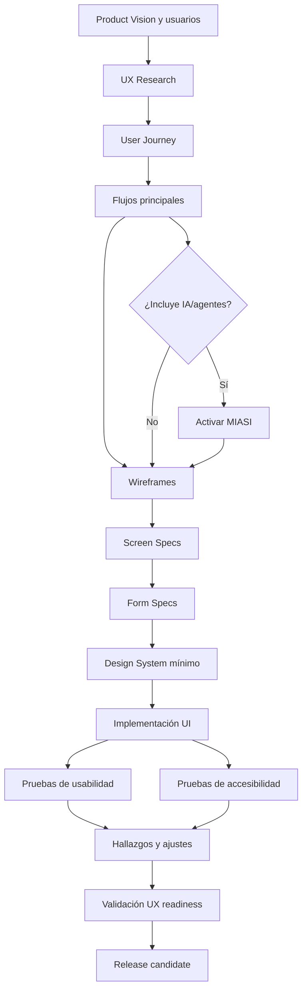

# MIPS-DOC-008 — UX/UI, accesibilidad y experiencia de usuario

## 1. Resumen ejecutivo

Este documento define el estándar de MIPSoftware para diseñar **experiencia de usuario, interfaz, accesibilidad, navegación, formularios, microcopy, pruebas de usabilidad y métricas UX** en aplicaciones profesionales.

La regla central es:

```text
Toda funcionalidad visible debe tener flujo de usuario.
Todo formulario debe tener validación y manejo de error.
Toda aplicación debe considerar accesibilidad básica desde el diseño.
```

Este estándar aplica a aplicaciones web, móviles, dashboards, plataformas internas, portales administrativos, APIs con consola visual, interfaces CLI con interacción humana, sistemas híbridos y productos con agentes IA. Cuando la interfaz incorpore agentes, respuestas generativas, copilotos, automatización inteligente o decisiones asistidas por IA, se activa además **MIASI** para controlar transparencia, límites, trazabilidad, evaluación, human approval y seguridad agentic.

## 2. Objetivo

Definir cómo se deben diseñar, revisar, probar y aprobar:

- principios UX;
- user journeys;
- flujos principales;
- wireframes;
- navegación;
- estados de pantalla;
- manejo de errores;
- formularios;
- accesibilidad;
- responsive design;
- design system mínimo;
- componentes;
- microcopy;
- pruebas de usabilidad;
- métricas UX.

## 3. Alcance

Este estándar aplica a toda funcionalidad que tenga interacción humana directa o indirecta.

| Área | Incluido | Evidencia mínima |
|---|---|---|
| UX research | Objetivos, usuarios, contexto, hallazgos | `ux_research.md` |
| Journey | Tareas, etapas, puntos de dolor, oportunidades | `user_journey.md` |
| Pantallas | Estados, contenido, acciones, validaciones | `screen_spec.md` |
| Formularios | Campos, reglas, errores, accesibilidad | `form_spec.md` |
| Accesibilidad | Criterios WCAG mínimos, teclado, contraste, etiquetas | `accessibility_checklist.md` |
| Sistema visual | Tokens, componentes, estados, patrones | `design_system.md` |
| Usabilidad | Escenarios, tareas, métricas, hallazgos | reporte de prueba de usabilidad |
| MIASI | UX de agentes, transparencia, revisión humana | Agent Card / Policy Card cuando aplique |

## 4. Principios UX normativos

| Principio | Regla operativa | Criterio PASS | Criterio FAIL |
|---|---|---|---|
| Usuario antes que interfaz | Diseñar desde tareas y contexto de uso, no desde pantallas aisladas. | Hay journey y tareas principales. | Pantallas creadas sin flujo ni usuario definido. |
| Claridad | Cada pantalla debe comunicar qué está pasando y qué puede hacer el usuario. | Hay título, objetivo, acción primaria y feedback. | La pantalla depende de explicación externa. |
| Consistencia | Acciones, textos, componentes y patrones deben repetirse de forma predecible. | Los componentes siguen un design system mínimo. | Cada pantalla resuelve lo mismo de forma distinta. |
| Prevención de errores | El diseño debe reducir errores antes de corregirlos. | Hay validaciones, defaults seguros y confirmaciones. | Errores frecuentes se dejan al usuario. |
| Recuperación | Todo error debe indicar causa, consecuencia y acción correctiva. | Mensajes específicos y accionables. | Mensajes genéricos como "error" o "falló". |
| Accesibilidad desde el diseño | No se agrega accesibilidad como parche final. | Se valida teclado, contraste, etiquetas, foco y mensajes. | Solo se prueba visualmente con mouse. |
| Responsive by default | Las pantallas deben especificar comportamiento en tamaños relevantes. | Hay reglas para móvil/tablet/escritorio. | El diseño solo funciona en un tamaño. |
| Mínima carga cognitiva | Evitar saturación, jerga y pasos innecesarios. | Las tareas críticas tienen flujo directo. | El usuario debe recordar información o interpretar código interno. |
| Trazabilidad | Todo flujo se conecta con requerimientos, pruebas y métricas. | Hay trazabilidad UX → requerimiento → test. | UX se maneja como artefacto decorativo. |
| Transparencia agentic | Si hay IA, el usuario debe saber cuándo interactúa con IA y qué puede hacer. | Hay límites, explicación y revisión humana cuando aplica. | La IA opera de forma opaca o confusa. |

## 5. User journeys

Un user journey describe cómo un usuario logra un objetivo a través de etapas, canales, decisiones, emociones, restricciones y puntos de dolor.

Debe incluir:

- usuario/persona;
- objetivo;
- contexto;
- trigger;
- etapas;
- acciones del usuario;
- puntos de contacto;
- puntos de dolor;
- riesgos;
- oportunidades;
- métricas;
- relación con requerimientos;
- relación con pantallas o módulos.

### 5.1 Criterios mínimos

| Elemento | Obligatorio | PASS | FAIL |
|---|---:|---|---|
| Persona/segmento | Sí | Usuario definido y conectado al problema. | Journey genérico sin usuario. |
| Objetivo | Sí | Resultado esperado claro. | Lista de pantallas sin resultado. |
| Etapas | Sí | Secuencia entendible y verificable. | Flujo incompleto o no secuencial. |
| Dolor/riesgo | Sí | Problemas reales documentados. | Solo describe camino feliz. |
| Métricas | Sí | Hay forma de saber si mejora. | No hay indicador de éxito. |

## 6. Flujos principales

Todo flujo principal debe especificarse antes de implementar pantallas relevantes. Un flujo principal describe una tarea completa que genera valor.

Ejemplos:

- registro e inicio de sesión;
- creación de producto;
- registro de venta;
- generación de reporte;
- pago manual o semiautomático;
- creación de requerimiento;
- revisión de pull request;
- aprobación humana de acción agentic;
- recuperación ante error.

### 6.1 Estructura mínima de un flujo

```yaml
flow_id: "FLOW-001"
name: "Registrar venta"
primary_actor: "Vendedor"
preconditions:
  - "El usuario está autenticado."
  - "Existe al menos un producto activo."
main_path:
  - "Abrir módulo de ventas."
  - "Seleccionar productos."
  - "Confirmar cantidades."
  - "Registrar método de pago."
  - "Confirmar venta."
alternate_paths:
  - "Producto sin inventario suficiente."
  - "Pago pendiente."
errors:
  - "No se puede guardar venta por falla de red."
success_criteria:
  - "Venta creada."
  - "Inventario actualizado."
  - "Auditoría registrada."
ux_metrics:
  - "task_completion_rate"
  - "time_on_task"
```

## 7. Wireframes

Un wireframe es una especificación estructural de pantalla. No debe confundirse con diseño visual final.

Debe definir:

- propósito de la pantalla;
- jerarquía de información;
- acciones primarias/secundarias;
- navegación;
- estados;
- mensajes;
- restricciones;
- contenido dinámico;
- comportamiento responsive;
- accesibilidad relevante.

### 7.1 Criterios de wireframe aprobado

| Criterio | PASS | BLOCK |
|---|---|---|
| Propósito claro | La pantalla tiene una tarea dominante. | Pantalla mezcla tareas sin prioridad. |
| Acción primaria | Hay CTA principal inequívoco. | Usuario no sabe qué hacer. |
| Estados | Loading, empty, error, success documentados. | Solo hay estado ideal. |
| Accesibilidad | Foco, etiquetas y semántica considerados. | Todo depende de color, mouse o posición visual. |
| Responsive | Se declara adaptación por breakpoint. | Pantalla solo diseñada para escritorio. |

## 8. Diseño de navegación

La navegación debe ayudar al usuario a ubicarse, moverse y recuperarse. No debe ser una acumulación de menús.

Debe documentar:

- arquitectura de información;
- menú principal;
- navegación secundaria;
- breadcrumbs cuando aplique;
- búsqueda;
- filtros;
- ordenamiento;
- rutas protegidas;
- rutas por rol;
- estados de sesión;
- deep links;
- errores de navegación.

### 8.1 Reglas de navegación

| Regla | Aplicación |
|---|---|
| Menos es más | Evitar menús con opciones no accionables. |
| Rol explícito | Cada opción debe declarar roles autorizados. |
| Estado persistente | El usuario debe saber dónde está. |
| Recuperación | Debe haber forma de volver sin perder trabajo crítico. |
| Seguridad | No exponer rutas sensibles solo ocultándolas en UI. |

## 9. Estados de pantalla

Toda pantalla relevante debe especificar sus estados.

| Estado | Pregunta que responde | Evidencia |
|---|---|---|
| Initial | ¿Qué ve el usuario antes de cargar datos? | Skeleton, placeholder o carga. |
| Loading | ¿Cómo sabe que el sistema trabaja? | Indicador no bloqueante cuando sea posible. |
| Empty | ¿Qué ocurre si no hay datos? | Mensaje + acción sugerida. |
| Partial | ¿Qué pasa si falta parte de la información? | Degradación controlada. |
| Error | ¿Qué falló y cómo se corrige? | Mensaje específico y acción. |
| Success | ¿Cómo confirma que terminó? | Feedback visible y registro. |
| Disabled | ¿Por qué una acción no está disponible? | Motivo o ayuda contextual. |
| Permission denied | ¿Qué rol/permisos faltan? | Mensaje seguro sin filtrar información sensible. |

## 10. Manejo de errores

Los errores deben diseñarse como parte del producto, no como excepción técnica.

Un mensaje de error profesional debe:

- identificar qué ocurrió;
- explicar el impacto en lenguaje del usuario;
- indicar cómo resolverlo;
- preservar datos ingresados cuando sea seguro;
- registrar detalles técnicos en logs, no en pantalla;
- evitar exponer secretos, stack traces o información sensible.

### 10.1 Taxonomía de errores de UI

| Tipo | Ejemplo | Tratamiento |
|---|---|---|
| Validación | Campo obligatorio faltante | Mensaje junto al campo + resumen si aplica. |
| Permiso | Usuario no autorizado | Explicación mínima + ruta segura. |
| Negocio | Inventario insuficiente | Explicar restricción y alternativa. |
| Red | Timeout | Reintento o guardado local si aplica. |
| Servidor | Error 5xx | Mensaje general + correlación técnica en log. |
| Integración | Pago externo no disponible | Estado pendiente + acción manual. |
| IA/agentic | Respuesta no verificable | Bloquear ejecución y pedir revisión humana. |

## 11. Formularios

Todo formulario debe tener especificación funcional, visual, de validación y accesibilidad.

Debe declarar:

- propósito;
- campos;
- tipo de dato;
- obligatoriedad;
- validación;
- formato;
- ayuda;
- defaults;
- máscara cuando aplique;
- manejo de errores;
- comportamiento de envío;
- prevención de doble envío;
- idempotencia si genera efectos;
- conservación de datos;
- accesibilidad.

### 11.1 Reglas obligatorias para formularios

| Regla | PASS | BLOCK |
|---|---|---|
| Etiquetas visibles | Todo campo tiene label asociado. | Placeholder usado como único label. |
| Validación clara | Mensajes específicos por campo. | Mensaje genérico sin ubicación. |
| Error recuperable | El usuario puede corregir sin perder datos. | Se borra formulario tras error. |
| Accesibilidad | Error anunciado y relacionado con el campo. | Error solo por color o ícono. |
| Seguridad | No se muestran detalles internos. | Stack trace o secretos en UI. |
| Idempotencia | Acciones críticas evitan duplicados. | Doble click crea registros duplicados. |

## 12. Accesibilidad

La accesibilidad mínima de MIPSoftware se basa en cuatro principios: contenido perceptible, operación posible, comprensión de la interfaz y robustez técnica.

### 12.1 Requisitos mínimos de accesibilidad

| Área | Requisito mínimo | Evidencia |
|---|---|---|
| Teclado | Funcionalidad principal operable sin mouse. | Prueba de navegación por teclado. |
| Foco | Foco visible y orden lógico. | Capturas o checklist. |
| Contraste | Texto e indicadores cumplen contraste mínimo definido. | Revisión de colores/tokens. |
| Semántica | Botones, links, encabezados y formularios con semántica correcta. | Inspección HTML/componentes. |
| Labels | Inputs con etiquetas asociadas. | Checklist de formularios. |
| Errores | Mensajes textuales específicos y recuperables. | Test de validación. |
| Alternativas | Imágenes informativas con alternativa. | Revisión de contenido. |
| Movimiento | Animaciones no bloquean ni confunden. | Revisión UX. |
| Responsive | Contenido usable en tamaños definidos. | Pruebas por viewport. |

### 12.2 Criterio de conformidad interna

Para MVPs internos, MIPSoftware exige accesibilidad básica documentada. Para productos externos, el objetivo mínimo recomendado es **WCAG 2.2 nivel AA**, salvo excepción justificada y registrada.

## 13. Responsive design

Toda aplicación con interfaz visual debe declarar breakpoints y reglas de adaptación.

| Dimensión | Requisito |
|---|---|
| Mobile | Tareas críticas deben seguir siendo ejecutables. |
| Tablet | Layout debe evitar scroll horizontal innecesario. |
| Desktop | Aprovechar espacio sin saturar información. |
| Touch | Targets interactivos deben ser suficientemente grandes. |
| Densidad | Tablas deben tener versión responsive o alternativa. |
| Navegación | Menús deben adaptarse sin ocultar funciones críticas. |

## 14. Design system mínimo

Un design system mínimo no requiere una librería compleja. Debe definir patrones reutilizables suficientes para garantizar consistencia.

Debe incluir:

- tokens de color;
- tipografía;
- espaciado;
- radios;
- sombras;
- iconografía;
- botones;
- inputs;
- selects;
- modales;
- tablas;
- tarjetas;
- alertas;
- badges;
- navegación;
- estados;
- mensajes de error;
- patrones de confirmación;
- reglas de accesibilidad.

### 14.1 Componentes mínimos

| Componente | Estados obligatorios |
|---|---|
| Button | default, hover, focus, disabled, loading, destructive |
| Input | empty, filled, focus, disabled, invalid, help |
| Select | closed, open, selected, invalid, disabled |
| Modal | open, close, confirm, cancel, destructive |
| Table | loading, empty, filtered, paginated, error |
| Alert | info, success, warning, error |
| Toast | success, warning, error, undo cuando aplique |
| Card | default, selected, empty, error |
| Navigation item | active, inactive, disabled, permission denied |

## 15. Componentes

Cada componente reutilizable debe tener contrato.

```yaml
component: "PrimaryButton"
purpose: "Ejecutar la acción principal de una pantalla o formulario."
props:
  label: "string"
  disabled: "boolean"
  loading: "boolean"
  variant: "primary | secondary | destructive"
states:
  - default
  - focus
  - disabled
  - loading
  - destructive
accessibility:
  keyboard: true
  aria_required: "cuando el texto visible no sea suficiente"
quality_gates:
  - "Tiene estado focus visible."
  - "No depende solo del color."
```

## 16. Microcopy

El microcopy incluye textos breves que guían acciones: labels, ayudas, botones, confirmaciones, errores y mensajes de estado.

Reglas:

| Regla | Aplicación |
|---|---|
| Lenguaje del usuario | Evitar nombres internos de tablas, servicios o excepciones. |
| Acción clara | Botones deben indicar resultado: "Guardar venta", no solo "OK". |
| Mensaje específico | Explicar qué falta y cómo corregirlo. |
| Tono consistente | Profesional, directo, no culpabilizante. |
| Riesgo explícito | Acciones destructivas deben explicar consecuencia. |
| IA transparente | Si el contenido fue sugerido por IA, indicarlo cuando sea relevante. |

## 17. Pruebas de usabilidad

Las pruebas de usabilidad verifican si usuarios representativos pueden completar tareas relevantes con efectividad, eficiencia y satisfacción razonables.

### 17.1 Tipos de prueba

| Tipo | Cuándo usar | Evidencia |
|---|---|---|
| Revisión heurística | Antes de prueba con usuarios. | Lista de hallazgos. |
| Test moderado | Flujos críticos o complejos. | Notas, grabación si aplica, hallazgos. |
| Test no moderado | Validación rápida de tareas. | Métricas de tarea. |
| Prueba de accesibilidad | Antes de release externo. | Checklist + hallazgos. |
| Prueba de contenido | Microcopy, comprensión, errores. | Ajustes de texto. |
| Prueba agentic | Si hay IA conversacional o copiloto. | Eval MIASI + revisión humana. |

### 17.2 Métricas mínimas

| Métrica | Uso |
|---|---|
| Task completion rate | Porcentaje de usuarios que completan la tarea. |
| Time on task | Tiempo necesario para completar una tarea. |
| Error rate | Errores cometidos por flujo. |
| Help requests | Veces que el usuario necesita ayuda externa. |
| Abandonment rate | Usuarios que no terminan el flujo. |
| Satisfaction score | Percepción cualitativa/cuantitativa. |
| Accessibility defects | Defectos por teclado, foco, contraste, semántica o error. |

## 18. Métricas UX

MIPSoftware exige métricas proporcionales al nivel de madurez del producto.

| Nivel | Métricas mínimas |
|---|---|
| Prototipo | Comprensión de flujo, feedback cualitativo, errores evidentes. |
| MVP | Completion rate, error rate, tiempo en tarea, abandono. |
| Production-ready | Métricas anteriores + cohortes, funnels, accesibilidad, performance percibida. |
| Industrial | Observabilidad UX, experimentación controlada, alertas de degradación, segmentación. |

## 19. Relación con arquitectura, requerimientos y pruebas

| Artefacto UX/UI | Requerimientos | Arquitectura | Pruebas |
|---|---|---|---|
| Journey | Requerimientos de usuario | Contexto y canales | Validación de flujo |
| Wireframe | Requerimientos funcionales | Restricciones de interfaz | Revisión heurística |
| Screen spec | Criterios de aceptación | Componentes frontend | Tests E2E |
| Form spec | Reglas de negocio/datos | API + validaciones | Tests de validación |
| Accessibility checklist | NFR accesibilidad | Componentes + HTML | Pruebas a11y |
| Design system | Consistencia | Frontend architecture | Visual regression |

## 20. Activación de MIASI

MIASI se activa si la experiencia incluye:

| Condición | Control MIASI requerido |
|---|---|
| Chatbot o copiloto | Agent Card, Eval Card, Observability Card. |
| Generación de contenido | Human review, redacción, política de publicación. |
| Acciones con herramientas | Tool Card, Policy Card, dry-run, approval si hay efectos. |
| Recomendaciones IA | Evaluación, explicación, límites y fallback. |
| Memoria o personalización | Memory Card, privacidad, retención y eliminación. |
| RAG | RAG Card, citas, groundedness, manejo de fuentes. |
| Automatización de acciones | Human Approval Card y trazas. |

Regla:

```text
La interfaz no debe presentar una capacidad IA como infalible.
Debe mostrar límites, permitir revisión humana y registrar decisiones críticas.
```

## 21. Diagrama Mermaid del flujo UX/UI



## 22. Matriz artefacto → quality gate

| Artefacto | Quality gate | Criterio PASS | Criterio BLOCK |
|---|---|---|---|
| `ux_research.md` | Usuario y problema validados | Hay evidencia mínima de usuario/contexto. | Producto definido solo desde suposiciones internas. |
| `user_journey.md` | Flujo trazable | Journey conectado a requerimientos. | Pantallas sin tarea ni objetivo. |
| `screen_spec.md` | Pantallas implementables | Estados y acciones definidos. | Falta error/loading/empty. |
| `form_spec.md` | Formularios verificables | Campos, validaciones y errores definidos. | Formulario sin validación ni accesibilidad. |
| `accessibility_checklist.md` | Accesibilidad mínima | Teclado, foco, labels y contraste revisados. | Flujo crítico inaccesible. |
| `design_system.md` | Consistencia visual | Tokens y componentes básicos definidos. | Componentes duplicados e inconsistentes. |

## 23. Criterios PASS / FAIL / BLOCK

### PASS

Un diseño UX/UI puede pasar a implementación cuando:

- existe flujo de usuario para la funcionalidad visible;
- pantallas principales tienen estados definidos;
- formularios tienen validación y manejo de errores;
- se consideró accesibilidad básica;
- se definió navegación por rol cuando aplica;
- hay trazabilidad con requerimientos;
- hay criterios de prueba;
- MIASI fue activado si hay IA/agentes.

### FAIL

Debe volver a diseño si:

- faltan estados relevantes;
- los errores no son accionables;
- el flujo depende de explicación verbal;
- el diseño no contempla móvil si el producto lo requiere;
- las métricas UX no están definidas.

### BLOCK

Debe bloquearse implementación o release si:

- un flujo crítico no puede completarse;
- un formulario crítico pierde datos ante error;
- una acción destructiva no tiene confirmación;
- una interfaz muestra datos sensibles sin control;
- la accesibilidad básica de tareas críticas es inexistente;
- una capacidad IA ejecuta acciones sin transparencia, control o aprobación.

## 24. Documentos mínimos antes de implementación visible

Para cualquier funcionalidad visible no trivial deben existir:

```text
user_journey.md o flujo equivalente
screen_spec.md
form_spec.md si hay captura de datos
accessibility_checklist.md
criterios de aceptación vinculados
pruebas UX/UI previstas
```

Para productos con IA/agentes, además:

```text
Agent Card
Tool Card si hay acciones
Eval Card
Policy Card
Human Approval Card si hay efectos relevantes
Observability Card
```

## 25. Riesgos comunes

| Riesgo | Impacto | Mitigación |
|---|---|---|
| Diseñar por pantallas, no por tareas | Producto confuso. | Journey antes de wireframe. |
| Accesibilidad tardía | Alto costo de corrección. | Checklist desde diseño. |
| Formularios sin recuperación | Pérdida de datos y frustración. | Validación y persistencia segura. |
| Componentes inconsistentes | Deuda UI. | Design system mínimo. |
| IA opaca | Riesgo de confianza y seguridad. | Transparencia, límites y MIASI. |
| Métricas ausentes | No se sabe si mejora. | Definir métricas por flujo. |

## 26. Referencias

- ISO 9241-210 — Human-centred design for interactive systems: https://www.iso.org/standard/77520.html
- W3C WCAG 2.2: https://www.w3.org/TR/WCAG22/
- W3C WAI — WCAG Overview: https://www.w3.org/WAI/standards-guidelines/wcag/
- W3C WAI — Forms Tutorial: https://www.w3.org/WAI/tutorials/forms/
- W3C WAI — User Notifications in Forms: https://www.w3.org/WAI/tutorials/forms/notifications/
- Nielsen Norman Group — 10 Usability Heuristics: https://www.nngroup.com/articles/ten-usability-heuristics/
- ISO/IEC 25010 — Systems and software quality models: https://www.iso.org/standard/35733.html
- MIASI v1.0.0 — Modelo de Ingeniería de Sistemas Agénticos Inteligentes.

## 27. Changelog

| Versión | Fecha | Cambio | Estado |
|---|---:|---|---|
| 0.1.0 | 2026-05-31 | Creación inicial del estándar UX/UI, accesibilidad y experiencia de usuario. | draft |
