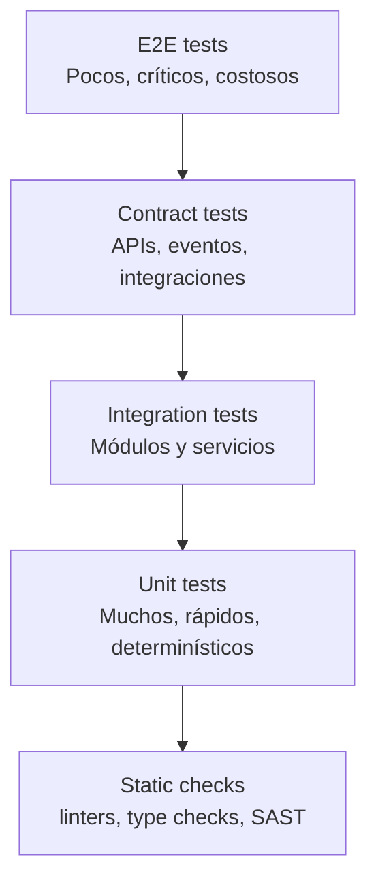
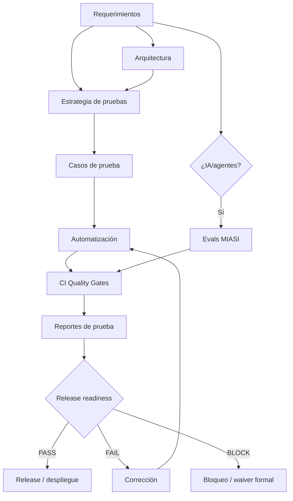

# MIPS-DOC-009 — Calidad, testing y verificación

## 1. Resumen ejecutivo

Este documento define el estándar de MIPSoftware para **calidad, testing, verificación, defect management y release readiness** en aplicaciones profesionales. Su propósito es asegurar que el software construido por el emprendimiento sea verificable, mantenible, seguro, usable, observable y apto para operar según el nivel de criticidad del producto.

La regla central es:

```text
Ningún release debe salir sin quality gate.
Todo requerimiento crítico debe tener prueba.
Todo bug crítico debe tener prueba de regresión.
```

Este estándar aplica a software web, móvil, backend, APIs, plataformas internas, herramientas CLI, automatizaciones, servicios de datos y sistemas con agentes IA. Cuando una funcionalidad involucra LLMs, agentes, RAG, memoria, herramientas inteligentes, decisiones automatizadas o generación de contenido, se activa además **MIASI** para cubrir evaluación agentic, tool call accuracy, groundedness, policy compliance, trazas y human approval cuando corresponda.

## 2. Objetivo

Definir cómo se planifica, implementa, ejecuta, mide, audita y mejora la calidad del software mediante:

- modelo de calidad;
- atributos de calidad;
- estrategia de pruebas;
- pirámide de testing;
- unit tests;
- integration tests;
- contract tests;
- E2E tests;
- regression tests;
- security tests;
- performance tests;
- accessibility tests;
- data tests;
- agentic tests cuando aplique mediante MIASI;
- test data management;
- coverage;
- quality gates;
- defect management;
- test reports;
- release readiness.

## 3. Alcance

| Área | Incluido | Evidencia mínima |
|---|---|---|
| Calidad de producto | Atributos, métricas, umbrales y riesgos | `test_strategy.md`, quality model por proyecto |
| Pruebas funcionales | Unit, integration, contract, E2E y regression | suite automatizada + reportes |
| Pruebas no funcionales | Performance, security, accessibility, reliability | planes y resultados por release |
| Datos | Datos de prueba, fixtures, migraciones, validación | data test plan / fixtures / dataset policy |
| Seguridad | SAST, dependency scan, pruebas manuales o automatizadas | security test report |
| Accesibilidad | Validación WCAG mínima, teclado, formularios, errores | accessibility test report |
| Agentes IA | Evaluación MIASI, tool calls, grounding, policy gates | Eval Card / Agent Card / trace report |
| Release readiness | Evidencia consolidada para aprobar o bloquear release | `release_test_report.md` |

## 4. Modelo de calidad

MIPSoftware adopta un modelo de calidad inspirado en ISO/IEC 25010. Todo producto debe definir qué atributos son relevantes y cómo se evaluarán.

| Atributo | Pregunta de calidad | Evidencia mínima | Ejemplo de métrica |
|---|---|---|---|
| Adecuación funcional | ¿El sistema cumple lo que debe hacer? | pruebas funcionales y aceptación | % requerimientos críticos cubiertos |
| Eficiencia de desempeño | ¿Responde dentro de umbrales aceptables? | performance tests | p95 latency, throughput |
| Compatibilidad | ¿Convive con otros sistemas o plataformas? | integration/contract tests | número de contratos compatibles |
| Usabilidad | ¿El usuario puede completar tareas de forma efectiva? | usability/accessibility tests | task success rate |
| Fiabilidad | ¿Se comporta correctamente ante fallos? | resilience tests | error rate, recovery time |
| Seguridad | ¿Protege datos, acceso y operación? | security tests | vulnerabilidades críticas abiertas |
| Mantenibilidad | ¿Se puede cambiar sin romperlo? | coverage, static checks, arquitectura | complejidad, duplicación, deuda |
| Portabilidad | ¿Puede moverse entre entornos razonables? | deploy tests | entornos soportados |
| Trazabilidad | ¿Se puede demostrar qué se probó y por qué? | traceability matrix | req → test → release |

## 5. Atributos de calidad por nivel de criticidad

| Nivel | Tipo de sistema | Atributos obligatorios | Gate mínimo |
|---|---|---|---|
| Q0 | Script experimental | Correctitud básica, reproducibilidad | ejecución manual documentada |
| Q1 | Herramienta interna | Funcionalidad, mantenibilidad, regresión | unit/integration mínimos |
| Q2 | MVP con usuarios | Funcionalidad, usabilidad, seguridad básica, observabilidad | suite automatizada + smoke release |
| Q3 | Producto operativo | Seguridad, performance, accesibilidad, confiabilidad, monitoreo | quality gate CI + release report |
| Q4 | Sistema crítico | Resilience, auditoría, continuidad, compliance | gates formales + revisión humana |
| Q5 | Sistema inteligente/agéntico | Todo lo anterior + evaluación MIASI | agentic evals + policy gates |

## 6. Estrategia de pruebas

La estrategia de pruebas debe responder:

1. qué riesgos se van a mitigar;
2. qué tipos de pruebas se ejecutarán;
3. qué capas serán cubiertas;
4. qué pruebas serán automatizadas;
5. qué pruebas serán manuales;
6. qué datos de prueba se usarán;
7. qué métricas se aceptarán;
8. qué condiciones bloquean el release;
9. qué relación existe entre requerimientos, pruebas y defectos;
10. si MIASI se activa para pruebas agentic.

### 6.1 Regla de trazabilidad

```text
Todo requerimiento crítico debe tener al menos una prueba asociada.
Toda prueba crítica debe apuntar a un requerimiento, riesgo, bug o decisión arquitectónica.
Todo defecto crítico corregido debe crear o actualizar una prueba de regresión.
```

## 7. Pirámide de testing



La pirámide no debe interpretarse como dogma rígido. Un sistema de datos, integración o agentes puede requerir matrices adicionales: data tests, evals agentic, security scans y contract tests con mayor peso.

## 8. Unit tests

| Elemento | Regla |
|---|---|
| Propósito | Validar unidades pequeñas de lógica de negocio o transformación. |
| Deben cubrir | reglas puras, validadores, cálculos, mappers, servicios de dominio. |
| No deben depender de | red externa, base de datos real, credenciales, tiempo no controlado. |
| PASS | son rápidos, determinísticos y ejecutables en CI. |
| FAIL | requieren servicios externos o son frágiles por orden/tiempo. |
| Bloqueo | bug crítico sin prueba unitaria o equivalente. |

## 9. Integration tests

Validan colaboración entre módulos internos, persistencia, servicios y adaptadores controlados.

| Requisito | Criterio |
|---|---|
| Ambiente | local/test, no producción |
| Datos | fixtures controlados, reseteables |
| Observabilidad | logs suficientes para diagnosticar fallos |
| Bloqueo | integración crítica sin prueba o con estado externo no controlado |

## 10. Contract tests

Los contract tests son obligatorios cuando existen APIs, eventos, webhooks, SDKs, integraciones entre servicios o consumidores externos.

| Contrato | Evidencia | Gate |
|---|---|---|
| API REST | OpenAPI + tests de endpoint | no romper contrato versionado |
| Evento | Event contract + schema | no publicar evento incompatible |
| Webhook | payload + retry/idempotencia | no aceptar payload no validado |
| Integración externa | mock/sandbox contract | no depender de producción externa |

## 11. E2E tests

Los E2E tests deben cubrir flujos críticos de negocio, no todos los detalles de UI.

Ejemplos:

- crear cuenta;
- iniciar sesión;
- completar compra;
- registrar venta;
- generar reporte;
- publicar release;
- ejecutar flujo agentic con aprobación humana cuando aplique.

Criterio de bloqueo: un flujo crítico de negocio falla y no existe workaround aprobado.

## 12. Regression tests

Toda corrección de defecto crítico o alto debe dejar evidencia de regresión.

| Severidad del bug | Prueba requerida |
|---|---|
| Crítico | prueba automatizada obligatoria antes de cerrar |
| Alto | prueba automatizada o justificación documentada |
| Medio | prueba recomendada según riesgo |
| Bajo | prueba opcional, salvo repetición frecuente |

## 13. Security tests

Los security tests se coordinan con el estándar de seguridad de MIPSoftware y deben incluir al menos:

- secret scan;
- dependency scanning;
- SAST;
- validación de auth/authz;
- validación de inputs;
- pruebas de permisos;
- pruebas de manejo seguro de errores;
- pruebas de logging seguro;
- pruebas de datos sensibles;
- pruebas agentic/LLM cuando MIASI aplica.

Criterio de bloqueo: vulnerabilidad crítica o exposición de secreto sin remediación o excepción aprobada.

## 14. Performance tests

Todo sistema con usuarios reales o SLAs debe definir umbrales de rendimiento.

| Métrica | Ejemplo de umbral | Uso |
|---|---:|---|
| Latencia p95 | < 500 ms en endpoint crítico | APIs |
| Tiempo de carga | < 3 s en pantalla principal | frontend |
| Throughput | N requests/s | backend |
| Tiempo batch | < ventana operativa | jobs |
| Uso de memoria | bajo límite definido | servicios |
| Costo por operación | bajo presupuesto | sistemas IA/API |

## 15. Accessibility tests

Toda interfaz de usuario debe validar accesibilidad básica:

- navegación por teclado;
- contraste;
- etiquetas en formularios;
- mensajes de error identificables;
- foco visible;
- semántica HTML;
- textos alternativos cuando aplique;
- responsive design.

Criterio de bloqueo: flujo crítico inaccesible por teclado o errores de formulario imposibles de entender.

## 16. Data tests

Aplican cuando el sistema procesa, migra, transforma, consolida o reporta datos.

| Tipo | Ejemplo | Gate |
|---|---|---|
| Schema tests | columnas, tipos, constraints | no romper modelo de datos |
| Data quality | nulos, duplicados, rangos | umbrales definidos |
| Migration tests | upgrade/downgrade o rollback | no pérdida de datos |
| Report tests | totales, agregados, filtros | consistencia con fuente |
| Privacy tests | datos sensibles anonimizados | no usar PII real sin control |

## 17. Agentic tests cuando aplica MIASI

Se activa MIASI cuando una funcionalidad usa IA, agentes, LLMs, RAG, memoria, tool calling, generación automática, decisiones asistidas o automatización inteligente.

| Dimensión MIASI | Qué se prueba | Evidencia |
|---|---|---|
| Task completion | si el agente resuelve la tarea | eval report |
| Tool selection | si escoge la herramienta correcta | trace + eval |
| Tool call accuracy | si llama la herramienta con parámetros válidos | trace/eventos |
| Groundedness | si responde con soporte documental cuando hay RAG | citas + verificación |
| Policy compliance | si respeta permisos, dry-run y human approval | policy report |
| Safety | si bloquea datos sensibles o acciones peligrosas | safety eval |
| Cost guard | si respeta presupuesto | cost report |
| Regression agentic | si cambios no degradan comportamiento | benchmark eval |

## 18. Test data management

| Regla | Criterio |
|---|---|
| No usar datos productivos sin control | Todo dataset sensible debe anonimizarse o sintetizarse. |
| Versionar datasets críticos | Los fixtures deben tener versión o hash. |
| Datos reproducibles | Las pruebas deben poder repetirse. |
| Separar ambientes | test/staging/prod no comparten credenciales ni datos reales sin autorización. |
| Datos agentic | prompts, documentos RAG y memorias de prueba deben ser controlados. |

## 19. Coverage

Coverage es señal, no garantía. Se usa como indicador complementario, nunca como sustituto de pruebas significativas.

| Área | Métrica sugerida | Criterio |
|---|---:|---|
| Dominio crítico | alto | debe cubrir reglas de negocio |
| Servicios | medio/alto | debe cubrir caminos principales y errores |
| UI | selectivo | priorizar flujos críticos |
| Integraciones | contrato | cubrir compatibilidad |
| Agentes IA | eval coverage | cubrir intents, tools, errores y policy gates |

## 20. Quality gates

| Gate | Evidencia requerida | Bloquea release si... |
|---|---|---|
| Requirements coverage | matriz req → test | requerimiento crítico sin prueba |
| Unit/integration | reporte CI | fallos en rama de release |
| Contract | contratos versionados | breaking change no aprobado |
| Regression | suite de regresión | bug crítico reaparece |
| Security | SAST/SBOM/secrets | secreto o vulnerabilidad crítica |
| Performance | reporte umbrales | umbral crítico incumplido |
| Accessibility | checklist/reporte | flujo crítico inaccesible |
| Agentic | eval MIASI | agente viola política o falla tarea crítica |
| Release readiness | release test report | falta evidencia mínima |

## 21. Defect management

Todo defecto debe tener:

- identificador;
- severidad;
- prioridad;
- ambiente;
- pasos para reproducir;
- resultado esperado;
- resultado obtenido;
- evidencia;
- componente afectado;
- requerimiento relacionado;
- decisión de corrección;
- prueba de regresión si aplica.

| Severidad | Definición | Política |
|---|---|---|
| Critical | caída, pérdida de datos, riesgo de seguridad, bloqueo total | bloquea release |
| High | flujo crítico degradado sin workaround adecuado | requiere corrección o waiver |
| Medium | flujo no crítico afectado | puede planificarse |
| Low | defecto menor visual o documental | no bloquea salvo acumulación |

## 22. Test reports

Todo reporte de pruebas debe incluir:

- versión/build;
- alcance;
- ambiente;
- fecha;
- responsable;
- resumen ejecutivo;
- pruebas ejecutadas;
- pruebas omitidas;
- resultados;
- defectos abiertos;
- riesgos residuales;
- decisión PASS/FAIL/BLOCK;
- recomendaciones.

## 23. Release readiness

Un release está listo solo si:

| Criterio | PASS |
|---|---|
| Requerimientos críticos | cubiertos por pruebas y aceptados |
| Pruebas automatizadas | pasan en CI |
| Defectos críticos | cero abiertos sin waiver |
| Seguridad | sin secretos ni vulnerabilidades críticas abiertas |
| Performance | umbrales críticos cumplidos |
| Accesibilidad | flujos principales validados |
| Datos/migraciones | rollback o plan de recuperación existe |
| Observabilidad | logs/métricas mínimas disponibles |
| Documentación | release notes y runbook actualizados |
| MIASI | evals/policy/human approval pasan cuando aplica |

## 24. Diagrama del flujo de calidad



## 25. Matriz tipo de prueba → propósito → evidencia

| Tipo | Propósito | Evidencia |
|---|---|---|
| Unit | Correctitud de unidades pequeñas | test report / coverage |
| Integration | Colaboración entre módulos | integration report |
| Contract | Compatibilidad entre servicios | contract report |
| E2E | Flujo crítico completo | E2E evidence |
| Regression | Evitar reaparición de defectos | regression report |
| Security | Validar controles de seguridad | security report |
| Performance | Validar umbrales de rendimiento | performance report |
| Accessibility | Validar experiencia accesible | accessibility report |
| Data | Validar calidad y migraciones | data test report |
| Agentic | Validar comportamiento de agentes IA | MIASI eval report |

## 26. Matriz requerimiento → prueba → release

| Elemento | Debe trazar hacia | Bloquea si falta |
|---|---|---|
| Requerimiento crítico | test case + acceptance criteria | Sí |
| Regla de negocio | unit/integration test | Sí si es crítica |
| API contract | contract test | Sí |
| Bug crítico | regression test | Sí |
| Riesgo de seguridad | security test | Sí si es alto/crítico |
| Atributo performance | performance test | Sí si tiene SLA/SLO |
| Flujo UX crítico | E2E/usability/accessibility test | Sí |
| Función agentic | Eval Card + policy test | Sí si MIASI aplica |

## 27. Matriz de estándares externos

| Fuente | Uso en MIPSoftware |
|---|---|
| ISO/IEC 25010 | Modelo de calidad y atributos de producto. |
| ISO/IEC/IEEE 29119 | Conceptos, procesos, documentación y técnicas de testing. |
| SWEBOK | Knowledge areas de calidad, testing, mantenimiento e ingeniería profesional. |
| NIST SSDF | Prácticas de desarrollo seguro y gates de seguridad. |
| OWASP ASVS | Verificación técnica de controles de seguridad web/API. |
| WCAG | Accesibilidad de interfaces. |
| MIASI | Evaluación agentic cuando hay IA/agentes. |

## 28. Plantillas asociadas

Este estándar crea las siguientes plantillas:

| Plantilla | Uso |
|---|---|
| `test_strategy.md` | Estrategia de calidad y pruebas por proyecto. |
| `test_plan.md` | Plan de ejecución por release, módulo o ciclo. |
| `test_case.md` | Caso de prueba individual trazable. |
| `defect_report.md` | Registro formal de defecto. |
| `quality_gate_report.md` | Resultado consolidado de gates. |
| `release_test_report.md` | Evidencia final para decidir release. |

## 29. Criterios PASS/FAIL/BLOCK

| Resultado | Significado |
|---|---|
| PASS | Evidencia completa, pruebas ejecutadas, riesgos aceptables. |
| FAIL | Evidencia insuficiente o pruebas fallidas no críticas; requiere corrección. |
| BLOCK | Riesgo crítico, pruebas críticas fallidas, defecto crítico, secreto expuesto o release no verificable. |

## 30. Criterios de bloqueo

Un release o fase debe bloquearse si ocurre cualquiera de los siguientes casos:

- requerimiento crítico sin prueba;
- pruebas críticas fallan;
- bug crítico sin corrección ni waiver;
- vulnerabilidad crítica abierta;
- secreto expuesto;
- contrato API roto sin versionado;
- migración sin plan de rollback o recuperación;
- datos sensibles reales usados sin autorización;
- flujo crítico inaccesible;
- performance bajo umbral crítico;
- agente IA viola policy gate MIASI;
- no existe reporte de release readiness.

## 31. Relación con DevPilot Local

DevPilot Local podrá automatizar este estándar mediante comandos futuros:

| Comando futuro | Acción |
|---|---|
| `devpilot test-strategy` | Generar estrategia de pruebas desde requerimientos y arquitectura. |
| `devpilot generate-test-plan` | Crear plan de pruebas por release. |
| `devpilot generate-test-cases` | Proponer casos trazables. |
| `devpilot run-quality-gates` | Ejecutar y consolidar gates. |
| `devpilot register-defect` | Crear defecto con evidencia. |
| `devpilot release-readiness` | Generar reporte final de release. |
| `devpilot run-agentic-evals` | Ejecutar evaluaciones MIASI cuando aplique. |

## 32. Changelog

| Versión | Fecha | Cambio |
|---|---|---|
| 0.1.0 | 2026-05-31 | Creación inicial del estándar de calidad, testing y verificación. |
