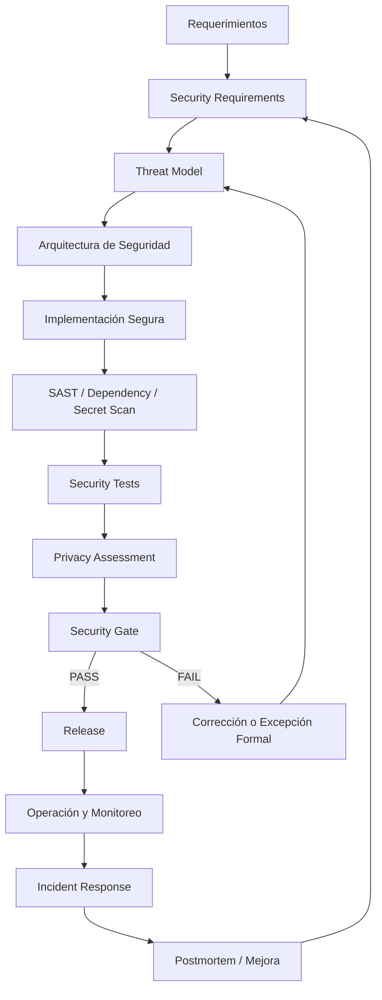

# MIPS-DOC-010 — Seguridad, privacidad y compliance

## 1. Resumen ejecutivo

Este documento define el estándar de **seguridad, privacidad y compliance** de MIPSoftware. Su propósito es asegurar que todo sistema profesional sea diseñado, construido, probado, desplegado y operado con controles de seguridad proporcionales al riesgo, protección explícita de datos personales y evidencia verificable antes de cada release.

La seguridad no se trata como una actividad tardía ni como una revisión final. En MIPSoftware, la seguridad es un dominio transversal que debe aparecer desde producto, requerimientos, arquitectura, datos, UX/UI, implementación, pruebas, CI/CD, despliegue, operación, incidentes y mantenimiento.

Regla principal:

```text
Todo sistema debe tener threat model mínimo.
Todo secreto debe gestionarse fuera del código.
Todo dato personal debe tener política de tratamiento.
Todo release debe pasar seguridad mínima.
```

Cuando el sistema incluye IA, agentes, LLMs, RAG, memoria, tool calling o automatización inteligente, se activa además **MIASI**, con controles específicos para prompt injection, data exfiltration, tool misuse, model output validation, policy-as-code, human approval, trazas y evaluación agentic.

---

## 2. Objetivo

Definir un estándar práctico y verificable para:

- incorporar **security by design**;
- identificar amenazas mediante **threat modeling**;
- definir controles de autenticación y autorización;
- proteger secretos;
- validar entradas y salidas;
- proteger sesiones;
- clasificar y gobernar datos;
- proteger datos personales;
- aplicar SAST, DAST, dependency scanning y SBOM;
- integrar seguridad en CI/CD;
- gestionar vulnerabilidades;
- responder incidentes;
- evaluar impactos de privacidad;
- activar MIASI cuando existan riesgos LLM/agentic.

---

## 3. Alcance

Este estándar aplica a:

- aplicaciones web;
- APIs;
- aplicaciones móviles;
- sistemas backend;
- plataformas internas;
- herramientas CLI con acceso a archivos, repositorios o datos;
- servicios con persistencia;
- integraciones con terceros;
- sistemas con autenticación;
- sistemas que procesen datos personales o sensibles;
- sistemas con componentes IA o agentes mediante MIASI.

No reemplaza una certificación formal ISO/IEC 27001, una auditoría legal, una evaluación de cumplimiento regulatorio específica ni una prueba de penetración profesional. Sí define el mínimo interno para trabajar con criterio industrial.

---

## 4. Fuentes y alineación normativa

| Fuente | Uso dentro de MIPSoftware |
|---|---|
| NIST SSDF SP 800-218 | Base para integrar prácticas de desarrollo seguro dentro del SDLC. |
| OWASP SAMM | Modelo de madurez para construir y evolucionar un programa de seguridad de software. |
| OWASP ASVS | Base de verificación técnica para controles de seguridad de aplicaciones web y APIs. |
| OWASP Top 10 | Conciencia mínima de riesgos críticos en aplicaciones web. |
| ISO/IEC 27001 | Referencia de gestión de seguridad de la información cuando se requiera ISMS formal. |
| MIASI | Extensión obligatoria para riesgos IA/LLM/agénticos. |

---

## 5. Principios normativos

| Principio | Regla MIPSoftware | Evidencia mínima |
|---|---|---|
| Security by design | La seguridad debe diseñarse antes de implementar. | Threat model, security requirements, arquitectura de seguridad. |
| Least privilege | Todo usuario, servicio, token y herramienta debe tener permisos mínimos. | Matriz de permisos, roles, scopes. |
| Secure by default | Configuraciones inseguras no deben ser el default. | Checklist de hardening y configuración. |
| Defense in depth | No depender de un único control. | Controles por capas: entrada, sesión, auth, datos, logs, red, CI/CD. |
| Privacy by design | Los datos personales deben clasificarse, minimizarse y protegerse. | Privacy assessment y data handling. |
| Shift-left security | Seguridad desde requerimientos, arquitectura y CI. | SAST, dependency scanning, secret scanning, pruebas. |
| Auditability | Las decisiones críticas deben dejar evidencia. | Logs seguros, reportes, excepciones y aprobaciones. |
| Human approval | Acciones de alto riesgo requieren revisión humana. | Security exception, approval record, policy gate. |
| AI-aware security | Sistemas inteligentes requieren controles MIASI. | Agent Card, Tool Card, Policy Card, Eval Card, trazas. |

---

## 6. Security by design

### 6.1 Propósito

Garantizar que las decisiones de seguridad se tomen durante el diseño y no solo después de implementar.

### 6.2 Actividades mínimas

- Definir activos a proteger.
- Definir límites de confianza.
- Identificar roles y permisos.
- Identificar datos sensibles.
- Identificar superficies de ataque.
- Definir controles de entrada, salida, autenticación, autorización y auditoría.
- Definir security gates del pipeline.
- Documentar excepciones.

### 6.3 Criterios PASS

| Criterio | PASS |
|---|---|
| Activos críticos identificados | Existen en el threat model. |
| Límites de confianza definidos | Están en arquitectura o diagrama de contexto. |
| Datos sensibles clasificados | Están en data dictionary o data handling sheet. |
| Riesgos de alto impacto | Tienen mitigación, aceptación formal o bloqueo. |

### 6.4 Criterios de bloqueo

- No se conoce qué datos sensibles procesa el sistema.
- No hay modelo de permisos para roles críticos.
- No hay threat model para sistema expuesto a usuarios externos.
- Hay secretos embebidos en código, logs o documentación.

---

## 7. Threat modeling

### 7.1 Estándar mínimo

Todo sistema no trivial debe tener un threat model mínimo antes de implementación significativa.

Debe incluir:

- activos;
- actores legítimos;
- actores adversarios;
- límites de confianza;
- flujos de datos;
- amenazas;
- impacto;
- probabilidad;
- mitigaciones;
- riesgo residual;
- owner;
- estado.

### 7.2 Amenazas mínimas a considerar

| Categoría | Ejemplos |
|---|---|
| Identidad | robo de cuenta, fuerza bruta, sesión secuestrada. |
| Acceso | escalamiento de privilegios, IDOR, bypass de autorización. |
| Datos | exposición, modificación no autorizada, eliminación indebida. |
| Entrada | injection, payload malicioso, archivos peligrosos. |
| Salida | XSS, filtración por respuesta, información sensible. |
| Configuración | debug activo, CORS inseguro, permisos amplios. |
| Dependencias | vulnerabilidades, paquetes maliciosos. |
| CI/CD | secretos expuestos, runners inseguros, artefactos manipulados. |
| Operación | logs con datos sensibles, alertas ausentes, backup no probado. |
| IA/agentes | prompt injection, tool misuse, data exfiltration, acciones sin aprobación. |

---

## 8. AuthN/AuthZ

### 8.1 Autenticación

Todo sistema con usuarios debe definir:

- mecanismo de autenticación;
- política de contraseñas o autenticación externa;
- recuperación de cuenta;
- expiración de sesión/token;
- protección contra fuerza bruta;
- MFA cuando el riesgo lo exija.

### 8.2 Autorización

Todo sistema con roles debe definir:

- matriz rol → permiso;
- permisos por recurso;
- permisos por acción;
- reglas de ownership;
- separación de funciones cuando exista riesgo;
- controles server-side, no solo frontend.

### 8.3 Criterios de bloqueo

- Endpoints críticos sin autorización server-side.
- Roles administrativos sin trazabilidad.
- Acceso a recursos por ID sin validar ownership.
- Permisos definidos solo en UI.

---

## 9. Gestión de secretos

### 9.1 Reglas obligatorias

- Ningún secreto debe estar en código fuente.
- Ningún secreto debe aparecer en logs, reportes, trazas o screenshots.
- `.env.example` debe contener nombres de variables, no valores reales.
- `.env`, `.env.dev`, `.env.prod` y equivalentes no deben versionarse.
- Los secretos deben rotarse si se sospecha exposición.
- Todo pipeline debe evitar imprimir secretos.

### 9.2 Tipos de secretos

| Tipo | Ejemplo | Política |
|---|---|---|
| API key | proveedor externo | env/secret manager; nunca hardcoded. |
| Token CI/CD | deploy token | mínimo privilegio; rotación. |
| DB password | credencial de base de datos | secreto por ambiente. |
| JWT secret | firma de token | alta entropía; rotación controlada. |
| Webhook secret | verificación de firma | validación obligatoria. |

### 9.3 Activación MIASI

Si un agente lee, redacta, valida o usa secretos, deben aplicarse controles de LAB-AI-075/MIASI: redaction, secret scan, dry-run, trazas seguras y policy gate.

---

## 10. Validación de input

Toda entrada externa debe validarse antes de procesarse.

| Entrada | Validación mínima |
|---|---|
| JSON/API | schema, tipos, límites, campos permitidos. |
| Formularios | required, formato, longitud, rango. |
| Archivos | tipo, tamaño, extensión, contenido, antivirus si aplica. |
| Query params | whitelist, tipos, paginación segura. |
| Webhooks | firma, timestamp, replay protection. |
| Prompts IA | sanitización contextual, límites, policy gate. |

Criterios de bloqueo:

- Inputs usados directamente en SQL, shell, eval, template o filesystem.
- Archivos subidos sin validación.
- Webhooks sin verificación de firma.

---

## 11. Output encoding

Toda salida hacia navegador, API, logs, reportes o archivos debe tratarse según contexto.

| Contexto | Control |
|---|---|
| HTML | escaping/encoding. |
| JSON | serialización segura. |
| CSV | prevención de CSV injection. |
| Logs | redacción de secretos/datos sensibles. |
| Markdown generado | sanitización si será renderizado. |
| Respuestas IA | validación estructurada y filtros de seguridad. |

---

## 12. Manejo de sesiones

Los sistemas con sesión o tokens deben documentar:

- duración de sesión;
- refresh token si aplica;
- invalidación;
- logout;
- protección CSRF cuando aplique;
- cookies `HttpOnly`, `Secure`, `SameSite` cuando aplique;
- revocación por incidente.

Bloquea release si:

- sesiones no expiran;
- tokens se guardan de forma insegura;
- endpoints críticos aceptan tokens sin validar firma/expiración;
- no existe logout en sistemas con datos sensibles.

---

## 13. Protección de datos personales

### 13.1 Política mínima

Todo dato personal debe tener:

- finalidad;
- base de tratamiento o justificación interna;
- clasificación;
- owner;
- ubicación;
- periodo de retención;
- regla de eliminación;
- controles de acceso;
- política de logs;
- política de exportación.

### 13.2 Clasificación de datos

| Nivel | Descripción | Ejemplos | Control mínimo |
|---|---|---|---|
| Public | Información pública. | documentación pública. | integridad. |
| Internal | Información interna. | backlog, issues internos. | acceso autenticado. |
| Confidential | Información sensible del negocio. | ventas, costos, clientes. | RBAC, logs, backups. |
| Restricted | Alto impacto o datos personales críticos. | credenciales, tokens, PII sensible. | cifrado, mínimo privilegio, aprobación. |

---

## 14. Logging seguro

Los logs deben servir para operación y auditoría sin exponer información sensible.

No debe registrarse:

- contraseñas;
- tokens;
- API keys;
- secretos;
- documentos personales completos;
- payloads sensibles completos;
- prompts con datos confidenciales sin redacción;
- respuestas IA con datos sensibles si no hay política.

Eventos mínimos:

| Evento | Evidencia |
|---|---|
| Login exitoso/fallido | user_id, timestamp, IP parcial/redactada. |
| Cambio de permisos | actor, target, permiso, motivo. |
| Acción crítica | actor, acción, recurso, resultado. |
| Error de seguridad | tipo, severidad, request_id. |
| Excepción aprobada | owner, expiración, justificación. |

---

## 15. SAST

Todo repositorio productivo debe ejecutar análisis estático proporcional al stack.

Debe cubrir:

- patrones inseguros;
- uso de APIs peligrosas;
- hardcoded secrets;
- errores de configuración;
- vulnerabilidades comunes;
- reglas específicas del lenguaje.

PASS mínimo:

- sin hallazgos críticos abiertos;
- hallazgos altos con fix o excepción formal;
- reporte versionado o artefacto CI.

---

## 16. DAST

DAST aplica a aplicaciones web/API expuestas.

Debe cubrir:

- rutas públicas;
- autenticación básica;
- errores de configuración;
- headers de seguridad;
- endpoints críticos;
- formularios principales.

No reemplaza pruebas manuales ni pentest profesional en sistemas críticos.

---

## 17. Dependency scanning

Todo proyecto con dependencias externas debe ejecutar escaneo de dependencias.

Debe controlar:

- vulnerabilidades conocidas;
- paquetes abandonados;
- licencias incompatibles cuando aplique;
- versiones pinneadas;
- lockfiles;
- actualizaciones críticas.

Bloquea release si hay vulnerabilidad crítica explotable sin mitigación.

---

## 18. SBOM

Los proyectos destinados a producción deben poder generar o conservar un SBOM cuando el riesgo o cliente lo requiera.

Debe incluir:

- componentes;
- versiones;
- proveedor/origen;
- hashes cuando aplique;
- licencias;
- relación con artefactos release.

---

## 19. Secure CI/CD

El pipeline debe protegerse como superficie crítica.

Controles mínimos:

- secretos no impresos;
- permisos mínimos del token CI;
- jobs separados por ambiente;
- approvals para producción;
- quality gates obligatorios;
- artefactos trazables;
- branch protection cuando aplique;
- dependency scanning y SAST;
- generación de reportes.

---

## 20. Security gates

| Gate | Momento | Bloquea si |
|---|---|---|
| Threat model gate | Antes de implementación | No hay threat model para sistema con datos sensibles. |
| Secrets gate | CI | Hay secretos reales en repo/logs. |
| SAST gate | CI | Hay hallazgos críticos sin excepción. |
| Dependency gate | CI | Hay CVE crítica explotable sin mitigación. |
| AuthZ gate | Pre-release | Endpoints críticos carecen de control server-side. |
| Privacy gate | Pre-release | Datos personales sin política. |
| MIASI gate | Pre-release IA | Agente con herramientas sin policy/human approval cuando aplica. |
| Release gate | Release | No hay evidencia de pruebas y seguridad mínimas. |

---

## 21. Incident response

Todo sistema productivo debe tener un procedimiento mínimo de incidente.

Debe incluir:

- severidades;
- responsables;
- canal de reporte;
- contención;
- erradicación;
- recuperación;
- comunicación;
- postmortem;
- acciones preventivas.

### 21.1 Severidades sugeridas

| Severidad | Ejemplo | Tiempo objetivo inicial |
|---|---|---|
| SEV-1 | fuga de secretos, caída total, exposición masiva de datos | respuesta inmediata. |
| SEV-2 | función crítica degradada, vulnerabilidad alta explotable | respuesta prioritaria. |
| SEV-3 | bug de seguridad menor, exposición limitada | plan de corrección. |
| SEV-4 | hallazgo informativo | backlog. |

---

## 22. Vulnerability management

Toda vulnerabilidad debe registrarse con:

- ID;
- fuente;
- severidad;
- componente afectado;
- impacto;
- exploitabilidad;
- owner;
- fecha de detección;
- fecha objetivo;
- estado;
- evidencia de cierre.

Estados permitidos:

```text
open
triaged
in_progress
mitigated
accepted_risk
false_positive
closed
```

---

## 23. Privacy Impact Assessment

Debe realizarse cuando:

- se recolectan datos personales;
- se procesan datos de clientes;
- se integran terceros con datos personales;
- se usan datos para IA, análisis o automatización;
- se agregan capacidades de exportación;
- se cambia la finalidad de uso.

Debe responder:

- qué datos se recolectan;
- por qué;
- durante cuánto tiempo;
- quién accede;
- dónde se guardan;
- cómo se eliminan;
- qué riesgos existen;
- qué controles los mitigan.

---

## 24. Extensión MIASI para riesgos LLM/agentic

MIASI se activa si el sistema incluye:

- LLM local o externo;
- agente con herramientas;
- RAG;
- memoria;
- generación automática de contenido;
- decisiones asistidas;
- tool calling;
- integración MCP;
- acciones sobre archivos, APIs, repositorios, bases de datos o CI/CD.

### 24.1 Riesgos específicos

| Riesgo | Control MIASI |
|---|---|
| Prompt injection | input policy, RAG isolation, eval adversarial. |
| Data exfiltration | redaction, access policy, output filters. |
| Tool misuse | Tool Card, policy-as-code, dry-run. |
| Acción destructiva | human approval, rollback, sandbox. |
| Hallucinated action | structured output, tool validation, eval. |
| Memory poisoning | memory policy, provenance, expiration. |
| Secret leakage | secret scanning, redaction, no logs. |
| Over-automation | autonomy level, approval gate, monitoring. |

---

## 25. Diagrama Mermaid — flujo de seguridad



---

## 26. Matriz control → artefacto → evidencia

| Control | Artefacto | Evidencia |
|---|---|---|
| Threat modeling | `threat_model.md` | amenazas, mitigaciones, riesgo residual. |
| Requisitos de seguridad | `security_requirements.md` | requisitos verificables y trazables. |
| Privacidad | `privacy_assessment.md` | datos, finalidad, retención, eliminación. |
| Vulnerabilidades | `vulnerability_register.md` | estado, severidad, owner, cierre. |
| Pruebas de seguridad | `security_test_plan.md` | casos, resultados, hallazgos. |
| Excepciones | `security_exception.md` | justificación, expiración, aprobador. |
| CI/CD seguro | pipeline report | SAST, dependency, secret scan, gates. |
| MIASI | Agent/Tool/Policy/Eval Cards | evaluación, trazas, approvals. |

---

## 27. Plantillas creadas por este documento

| Plantilla | Propósito |
|---|---|
| `threat_model.md` | Identificar amenazas, mitigaciones y riesgo residual. |
| `security_requirements.md` | Definir requisitos verificables de seguridad. |
| `privacy_assessment.md` | Evaluar datos personales, finalidad, retención y riesgos. |
| `vulnerability_register.md` | Gestionar vulnerabilidades hasta cierre o aceptación formal. |
| `security_test_plan.md` | Planificar pruebas de seguridad. |
| `security_exception.md` | Registrar excepciones temporales y aprobadas. |

---

## 28. Criterios PASS/FAIL/BLOCK

### PASS

- Existe threat model proporcional al riesgo.
- No hay secretos en código o logs.
- Datos personales clasificados y con política.
- SAST/dependency scan sin críticos abiertos.
- Security tests mínimos ejecutados.
- Vulnerabilidades altas tienen plan o excepción aprobada.
- MIASI activado cuando aplica.

### FAIL

- Faltan controles menores no críticos.
- Hay hallazgos medios sin priorización.
- Faltan pruebas de seguridad en rutas no críticas.
- Falta evidencia documental secundaria.

### BLOCK

- Secretos reales expuestos.
- Datos personales sin política de tratamiento.
- AuthZ ausente en endpoints críticos.
- Vulnerabilidad crítica explotable sin mitigación.
- Agente con herramientas críticas sin dry-run/policy/human approval.
- Release sin security gate.

---

## 29. Relación con DevPilot Local

DevPilot Local deberá poder automatizar:

| Comando futuro | Función |
|---|---|
| `devpilot security threat-model` | Crear o validar threat model. |
| `devpilot security scan-secrets` | Detectar secretos. |
| `devpilot security sast` | Ejecutar o registrar SAST. |
| `devpilot security dependencies` | Escaneo de dependencias. |
| `devpilot security privacy-check` | Validar privacy assessment. |
| `devpilot security gate` | Evaluar PASS/FAIL/BLOCK. |
| `devpilot security exception` | Registrar excepción formal. |
| `devpilot miasi check` | Activar controles IA/agénticos cuando aplique. |

---

## 30. Checklist mínimo de seguridad antes de release

| Ítem | Obligatorio | PASS |
|---|---:|---|
| Threat model actualizado | Sí | Amenazas principales documentadas. |
| Secret scanning | Sí | Sin secretos reales. |
| SAST | Sí | Sin críticos abiertos. |
| Dependency scanning | Sí | Sin críticos explotables. |
| AuthN/AuthZ probado | Sí | Endpoints críticos protegidos. |
| Datos personales clasificados | Si aplica | Política y retención definidas. |
| Logs seguros | Sí | Sin datos sensibles indebidos. |
| Security tests | Sí | Evidencia de ejecución. |
| SBOM | Según riesgo | Generado o justificado. |
| MIASI | Si aplica | Agent/Tool/Policy/Eval Cards presentes. |

---

## 31. Changelog

| Versión | Fecha | Cambio |
|---|---|---|
| 0.1.0 | 2026-05-31 | Creación inicial del estándar de seguridad, privacidad y compliance de MIPSoftware. |

---

## 32. Referencias

- NIST SP 800-218 — Secure Software Development Framework.
- OWASP SAMM — Software Assurance Maturity Model.
- OWASP ASVS — Application Security Verification Standard.
- OWASP Top 10 — Web Application Security Risks.
- ISO/IEC 27001 — Information Security Management Systems.
- MIASI v1.0.0 — Modelo de Ingeniería de Sistemas Agénticos Inteligentes.
