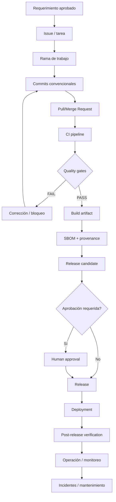
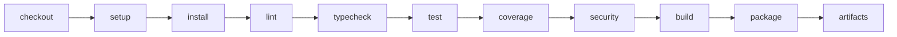

# MIPS-DOC-011 — DevOps, CI/CD, release y supply chain

## 1. Resumen ejecutivo

Este documento define el estándar de **DevOps, CI/CD, release y supply chain** de **MIPSoftware**. Su propósito es establecer cómo se versiona, integra, verifica, empaqueta, libera, despliega, audita y rastrea el software producido por el emprendimiento.

La regla central es:

```text
Ningún despliegue debe depender solo de pasos manuales no documentados.
Todo release debe tener versión, evidencia de calidad, plan de rollback y trazabilidad.
Todo artefacto debe ser reproducible, identificable, auditable y asociado a su fuente.
```

Este estándar complementa:

- `08_calidad_testing_verificacion.md`, porque ningún pipeline debe liberar software que no haya pasado quality gates.
- `09_seguridad_privacidad_compliance.md`, porque la cadena de suministro debe incluir controles de secretos, dependencias, SBOM, escaneo, provenance y release seguro.
- MIASI, cuando el producto incluye IA, agentes, LLMs, RAG, memoria, tool calling, modelos locales/API o automatización inteligente.

## 2. Objetivo

Definir un estándar operacional para:

1. estrategia de ramas;
2. convenciones de commits;
3. flujo de pull request / merge request;
4. integración continua;
5. entrega/despliegue continuo;
6. quality gates;
7. gestión de artefactos;
8. versionado;
9. release notes;
10. rollback;
11. ambientes;
12. secretos en CI/CD;
13. SBOM;
14. provenance;
15. firma;
16. dependencias;
17. container scanning;
18. deployment checklist;
19. release checklist;
20. verificación post-release.

## 3. Alcance

Este estándar aplica a todos los proyectos del emprendimiento, independientemente de si son:

- aplicaciones web;
- APIs;
- aplicaciones móviles;
- CLIs;
- librerías;
- servicios backend;
- automatizaciones;
- plataformas internas;
- sistemas con IA/agentes.

No obliga a usar un proveedor específico. Debe poder aplicarse en:

```text
local-only
GitHub Actions
GitLab CI/CD
runners propios
pipeline manual controlado
pipeline híbrido
entornos cloud
entornos on-premise
```

## 4. Relación con estándares y referencias

| Referencia | Uso dentro de MIPSoftware |
|---|---|
| ISO/IEC/IEEE 12207 | Ubica DevOps, release, operación, mantenimiento y retiro dentro del ciclo de vida de software. |
| NIST SSDF | Base para integrar prácticas de desarrollo seguro dentro de pipelines y releases. |
| SLSA | Base para mejorar integridad de build, provenance y resistencia ante manipulación de supply chain. |
| CycloneDX | Formato de referencia para SBOM y otros Bill of Materials. |
| Semantic Versioning | Convención recomendada para versionado de releases y APIs cuando aplique. |
| Conventional Commits | Convención recomendada para commits trazables y automatizables. |
| GitHub Actions | Ejemplo de proveedor CI/CD basado en workflows YAML. |
| GitLab CI/CD | Ejemplo de proveedor CI/CD basado en `.gitlab-ci.yml`. |
| MIASI | Extensión obligatoria cuando el pipeline libere agentes, modelos, prompts, policies, RAG indexes o artefactos inteligentes. |

## 5. Principios normativos

| Principio | Regla normativa |
|---|---|
| Automatización verificable | Todo paso repetitivo debe automatizarse o documentarse con checklist ejecutable. |
| Reproducibilidad | Todo artefacto liberado debe poder vincularse a commit, build, ambiente y pipeline. |
| Seguridad integrada | Secret scanning, dependency scanning, SAST/SBOM y policy gates deben ejecutarse antes del release. |
| Separación de ambientes | Local, dev, staging y prod no deben compartir secretos, bases de datos ni permisos críticos. |
| Menor privilegio | Runners, tokens y jobs deben tener permisos mínimos. |
| Evidencia auditable | Todo release debe producir reportes de tests, seguridad, artefactos y deployment. |
| Rollback obligatorio | Todo despliegue productivo debe tener estrategia de reversión o mitigación. |
| Trazabilidad end-to-end | Requerimiento → commit → PR/MR → pipeline → artefacto → release → despliegue → operación. |
| Human approval proporcional | Cambios críticos, producción y acciones destructivas requieren aprobación humana documentada. |
| AI-ready mediante MIASI | Si el release contiene componentes inteligentes, se activan gates MIASI. |

## 6. Modelo conceptual del flujo DevOps



## 7. Branching strategy

### 7.1 Propósito

Definir cómo se crean, protegen, integran y eliminan ramas para evitar cambios no auditables, conflictos innecesarios y releases improvisados.

### 7.2 Estrategia base recomendada

Para proyectos pequeños y medianos del emprendimiento, la estrategia por defecto será **trunk-based simplificada con ramas cortas**, porque reduce divergencia y favorece integración continua.

```text
main
  rama protegida
  siempre desplegable o release-ready

develop / dev
  opcional según complejidad

feature/<scope>-<short-name>
fix/<scope>-<short-name>
hotfix/<scope>-<short-name>
release/<version>
experiment/<short-name>
```

### 7.3 Reglas mínimas

| Regla | Obligatoria | Criterio PASS |
|---|---:|---|
| `main` protegida | Sí | No acepta push directo en proyectos productivos. |
| Ramas cortas | Sí | Rama activa tiene alcance claro y vida limitada. |
| Nombres convencionales | Sí | Usa prefijos `feature/`, `fix/`, `hotfix/`, `release/`. |
| PR/MR obligatorio | Sí para main | Todo cambio relevante entra por revisión. |
| CI obligatorio | Sí | No se fusiona si el pipeline requerido falla. |

### 7.4 Criterios de bloqueo

Bloquear merge si:

- hay secretos detectados;
- fallan pruebas críticas;
- falla security gate;
- falta review requerida;
- hay conflicto sin resolver;
- no existe trazabilidad hacia tarea/requerimiento;
- se intenta desplegar desde una rama no autorizada.

## 8. Commit standards

### 8.1 Propósito

Hacer que la historia de cambios sea legible, auditable y automatizable.

### 8.2 Convención recomendada

Se adopta una variante compatible con **Conventional Commits**:

```text
<type>(<scope>): <summary>

<body optional>

<footer optional>
```

Tipos base:

```text
feat      nueva capacidad
fix       corrección
refactor  cambio interno sin alterar comportamiento esperado
test      pruebas
docs      documentación
chore     mantenimiento
ci        pipeline/build/release
sec       seguridad
perf      rendimiento
revert    reversión
```

Ejemplos:

```text
feat(inventory): add low stock alert policy
fix(auth): reject expired refresh tokens
test(api): add contract tests for order creation
sec(ci): add dependency scanning gate
ci(release): publish sbom artifact
```

### 8.3 Criterios PASS

- El commit expresa intención.
- El scope identifica módulo o dominio.
- Cambios breaking usan `BREAKING CHANGE:` en footer.
- El commit puede alimentar changelog o release notes.

## 9. Pull request / merge request workflow

### 9.1 Propósito

Asegurar revisión técnica, calidad, seguridad y trazabilidad antes de integrar cambios.

### 9.2 Requisitos mínimos de PR/MR

| Campo | Obligatorio | Evidencia |
|---|---:|---|
| Descripción del cambio | Sí | Resumen técnico y funcional. |
| Issue/requerimiento relacionado | Sí | ID o enlace interno. |
| Tipo de cambio | Sí | feature/fix/refactor/security/docs/ci. |
| Pruebas ejecutadas | Sí | Comando + resultado. |
| Impacto arquitectónico | Condicional | ADR si cambia una decisión relevante. |
| Impacto de seguridad | Sí | Checklist de seguridad. |
| Impacto de datos | Condicional | Migración o data impact note. |
| Activación MIASI | Condicional | Eval/Agent/Tool/Policy card si aplica. |
| Rollback | Condicional | Plan si afecta producción. |

### 9.3 Gates mínimos de PR/MR

```text
lint/typecheck/test/security/dependency-scan/secret-scan/build/docs-check
```

## 10. CI pipeline

### 10.1 Propósito

Detectar errores temprano, verificar calidad y producir evidencia antes de fusionar o liberar.

### 10.2 Stages mínimos



### 10.3 Jobs mínimos recomendados

| Job | Propósito | Bloquea release |
|---|---|---:|
| lint | Estilo y errores estáticos simples | Sí |
| typecheck | Tipado estático cuando aplique | Sí |
| unit tests | Verificación de unidades | Sí |
| integration tests | Verificación de interacción entre módulos | Según criticidad |
| contract tests | APIs/eventos/contratos | Sí si hay contratos publicados |
| security scan | SAST/secret scan/dependency scan | Sí |
| build | Compilación/empaquetado | Sí |
| docs check | Documentación mínima | Según proyecto |
| artifact publish | Publicación de artefactos | Sí en release |

### 10.4 Activación MIASI en CI

Si el proyecto incluye IA/agentes, CI debe agregar:

```text
agent contract validation
tool card validation
prompt/policy checks
agent evals offline
RAG grounding checks
memory safety tests
model adapter tests
cost guard tests
trace schema validation
```

## 11. CD pipeline

### 11.1 Propósito

Promover artefactos entre ambientes con trazabilidad, control y rollback.

### 11.2 Regla base

CI produce artefactos. CD despliega **artefactos ya construidos**, no reconstruye de forma opaca.

### 11.3 Flujo mínimo

```text
build artifact
  ↓
release candidate
  ↓
deploy dev
  ↓
smoke tests
  ↓
deploy staging
  ↓
acceptance/security checks
  ↓
approval
  ↓
deploy prod
  ↓
post-release verification
```

### 11.4 Criterios de bloqueo

Bloquear CD si:

- artefacto no está versionado;
- falta SBOM cuando aplica;
- no hay evidencia de tests;
- no hay rollback;
- falta aprobación para producción;
- se usan secretos no autorizados;
- el ambiente destino no coincide con la rama/release;
- hay incidente activo relacionado;
- el release contiene componentes IA sin evaluación MIASI vigente.

## 12. Quality gates

### 12.1 Quality gate mínimo para PR/MR

| Gate | PASS | FAIL/BLOCK |
|---|---|---|
| Build | Compila/empaqueta | Build roto |
| Unit tests | Pasan pruebas unitarias | Fallos críticos |
| Lint/typecheck | Sin errores bloqueantes | Errores bloqueantes |
| Secret scan | Sin secretos reales | Secreto detectado |
| Dependency scan | Sin vulnerabilidades críticas no aceptadas | Crítica/alta sin waiver |
| Contract tests | Contratos respetados | Breaking change no autorizado |
| Docs | Docs críticas actualizadas | Cambio sin documentación requerida |
| MIASI evals | Evals PASS si aplica | Agente sin eval/policy/trazas |

### 12.2 Quality gate mínimo para release

| Gate | Evidencia requerida |
|---|---|
| Release plan | `release_plan.md` completo. |
| Version | Versión SemVer o política equivalente. |
| Test report | `release_test_report.md`. |
| Security gate | Reporte de seguridad. |
| SBOM | SBOM generado si hay dependencias empaquetadas. |
| Provenance | Evidencia de origen/build. |
| Rollback | `rollback_plan.md`. |
| Deployment checklist | Checklist completado. |
| Post-release verification | Plan de smoke/health checks. |

## 13. Artifact management

### 13.1 Propósito

Garantizar que todo artefacto producido sea identificable, recuperable, verificable y asociado a su fuente.

### 13.2 Tipos de artefacto

```text
binary/package
container image
frontend bundle
mobile build
CLI distribution
library package
migration bundle
OpenAPI spec
event schema
SBOM
provenance statement
release notes
test report
security report
agent policy/eval report
```

### 13.3 Metadatos mínimos

| Campo | Obligatorio |
|---|---:|
| artifact_id | Sí |
| name | Sí |
| type | Sí |
| version | Sí |
| commit_sha | Sí |
| build_id | Sí |
| pipeline_id | Sí |
| environment_target | Condicional |
| checksum | Recomendado |
| signature | Recomendado/obligatorio en producción crítica |
| sbom_path | Condicional |
| provenance_path | Condicional |

## 14. Versioning

### 14.1 Regla base

Usar **Semantic Versioning** cuando el producto tenga releases, APIs, paquetes o consumidores externos.

```text
MAJOR.MINOR.PATCH
```

Interpretación normativa:

| Cambio | Versión |
|---|---|
| Breaking change | MAJOR |
| Nueva funcionalidad compatible | MINOR |
| Fix compatible | PATCH |
| Pre-release | `-alpha`, `-beta`, `-rc` |

### 14.2 Versionado de APIs

Una API publicada debe declarar estrategia de versionado:

```text
path versioning: /v1/orders
header versioning
media type versioning
calendar versioning
```

No se debe introducir breaking change sin:

- aviso;
- changelog;
- migración;
- periodo de compatibilidad o justificación.

## 15. Release notes

### 15.1 Propósito

Comunicar qué cambió, por qué, qué impacto tiene y cómo revertir o migrar.

### 15.2 Estructura mínima

```text
versión
fecha
resumen
features
fixes
security
breaking changes
migrations
known issues
rollback
artefactos
evidencia de quality gates
```

### 15.3 Criterios de bloqueo

Bloquear release si:

- hay breaking change no documentado;
- hay migración sin instrucciones;
- hay fix crítico sin prueba de regresión;
- hay cambio de seguridad sin evidencia de validación;
- hay cambio IA/agente sin reporte MIASI.

## 16. Rollback

### 16.1 Propósito

Reducir el impacto de despliegues fallidos.

### 16.2 Tipos de rollback

| Tipo | Uso |
|---|---|
| Redeploy versión anterior | Apps stateless o con artefacto versionado. |
| Feature flag off | Funcionalidad aislada. |
| Rollback de migración | Solo si la migración es reversible. |
| Forward fix | Cuando revertir es más riesgoso. |
| Data repair | Cuando el error afectó datos. |
| Kill switch | Funciones críticas o IA/agentes. |

### 16.3 Reglas

- Toda migración debe indicar si es reversible.
- Todo despliegue productivo debe tener punto de recuperación.
- Todo rollback debe registrarse como incidente o evento operacional.

## 17. Environment strategy

### 17.1 Ambientes estándar

| Ambiente | Propósito | Datos | Acceso |
|---|---|---|---|
| local | Desarrollo individual | Sintéticos/locales | Desarrollador |
| dev | Integración temprana | Sintéticos o anonimizados | Equipo técnico |
| staging | Simulación productiva | Anonimizados/semillas controladas | Equipo + validadores |
| prod | Operación real | Reales | Acceso restringido |

### 17.2 Reglas críticas

- Producción no comparte credenciales con otros ambientes.
- Staging debe parecerse a producción sin exponer datos reales innecesarios.
- Local no debe requerir secretos productivos.
- Los agentes IA en ambientes no productivos deben operar con datos sintéticos o anonimizados por defecto.

## 18. Secrets in CI/CD

### 18.1 Reglas

| Regla | Obligatoria |
|---|---:|
| No secretos en código | Sí |
| No secretos en logs | Sí |
| No secretos en artefactos | Sí |
| Uso de secret store del proveedor o mecanismo local seguro | Sí |
| Redacción en reportes | Sí |
| Rotación ante exposición | Sí |
| Permisos mínimos por job | Sí |

### 18.2 Criterios de bloqueo

Bloquear pipeline si:

- se detecta patrón de secreto real;
- el secreto se imprime en logs;
- un job tiene permisos excesivos injustificados;
- una variable productiva se usa fuera de producción;
- un agente o script intenta exfiltrar configuración sensible.

## 19. SBOM

### 19.1 Propósito

Mantener inventario de componentes, dependencias y relaciones para análisis de vulnerabilidades, licencias y riesgo de supply chain.

### 19.2 Reglas mínimas

- Generar SBOM en releases con dependencias empaquetadas.
- Preferir formato estándar como CycloneDX.
- Asociar SBOM a versión, commit y artefacto.
- Publicar SBOM como artefacto interno o adjunto de release.
- Usar SBOM para escaneo y auditoría.

### 19.3 Campos mínimos del SBOM operacional

```text
project name
version
component list
component version
licenses
hashes when available
dependency relationships
vulnerability references when available
generation tool
generation timestamp
```

## 20. Provenance

### 20.1 Propósito

Registrar cómo, dónde, con qué inputs y por quién fue construido un artefacto.

### 20.2 Evidencia mínima

```text
source repository
commit SHA
branch/tag
workflow/pipeline ID
builder/runner
build command
inputs principales
artifacts outputs
timestamp
identity/service account
```

### 20.3 Niveles internos MIPSoftware

| Nivel | Descripción |
|---|---|
| P0 | Sin provenance formal. Solo uso experimental. |
| P1 | Build scriptado y commit asociado. |
| P2 | Provenance generada por CI. |
| P3 | Provenance firmada o verificable. |
| P4 | Build hermético/reproducible según criticidad. |

## 21. Signing

### 21.1 Propósito

Aumentar confianza sobre artefactos, contenedores, releases y provenance.

### 21.2 Regla progresiva

- En prototipos: checksum mínimo recomendado.
- En MVP interno: checksum + release artifact metadata.
- En producción: firma de artefactos/contenedores cuando haya distribución externa o criticidad alta.
- En sistemas regulados/críticos: firma + provenance verificable + política de custodia de claves.

## 22. Dependency management

### 22.1 Reglas

| Regla | Criterio PASS |
|---|---|
| Lockfile | Existe cuando el ecosistema lo soporta. |
| Versiones controladas | No hay dependencias flotantes críticas. |
| Actualización periódica | Hay política de revisión. |
| Vulnerability scanning | Ejecutado en CI o release. |
| Licencias | Riesgos de licencia identificados. |
| Dependencias no usadas | Se eliminan o justifican. |

### 22.2 Criterios de bloqueo

Bloquear release si:

- vulnerabilidad crítica sin mitigación/waiver;
- dependencia no confiable en ruta crítica;
- paquete abandonado sin plan;
- conflicto de licencia severo;
- lockfile inconsistente.

## 23. Container scanning

### 23.1 Aplica cuando

- el producto se empaqueta como imagen contenedor;
- se despliega en Kubernetes, Docker, serverless container o registry;
- se distribuyen imágenes a clientes o ambientes compartidos.

### 23.2 Controles mínimos

```text
base image identificada
imagen mínima razonable
sin secretos en capas
usuario no root cuando aplique
escaneo de vulnerabilidades
etiquetado por versión y commit
SBOM de imagen
firma cuando aplique
```

## 24. Deployment checklist

Todo despliegue debe responder:

| Pregunta | Obligatoria |
|---|---:|
| ¿Qué versión se despliega? | Sí |
| ¿Qué artefacto se despliega? | Sí |
| ¿Qué ambiente recibe el cambio? | Sí |
| ¿Qué migraciones ejecuta? | Condicional |
| ¿Qué secretos requiere? | Condicional |
| ¿Qué checks pasaron? | Sí |
| ¿Cuál es el rollback? | Sí |
| ¿Quién aprueba? | Condicional |
| ¿Qué monitoreo se revisará? | Sí |
| ¿Qué smoke tests se ejecutarán? | Sí |

## 25. Release checklist

Antes de liberar:

- versión definida;
- changelog/release notes;
- PR/MR aprobado;
- CI verde;
- pruebas críticas PASS;
- security gate PASS;
- SBOM/provenance cuando aplica;
- artefactos publicados;
- rollback documentado;
- migraciones revisadas;
- documentación actualizada;
- MIASI gates PASS si aplica;
- aprobación humana si aplica.

## 26. Post-release verification

### 26.1 Propósito

Confirmar que el release funciona en el ambiente destino.

### 26.2 Verificaciones mínimas

```text
health check
smoke tests
logs de arranque
métricas básicas
errores 4xx/5xx
latencia básica
funcionalidad crítica
migraciones completadas
jobs programados
alertas activas
```

### 26.3 Para sistemas con MIASI

Agregar:

```text
agent smoke test
tool call dry-run/execute según ambiente
policy gate verification
RAG index integrity
memory store health
model adapter health
cost guard active
trace emission
redaction active
```

## 27. Matriz control → evidencia → bloqueo

| Control | Evidencia | Bloquea PR | Bloquea release | Bloquea prod |
|---|---|---:|---:|---:|
| Branch protection | Config o política documentada | Sí | Sí | Sí |
| Commit convention | Historial/PR | No | No | No |
| CI pipeline | Reporte CI | Sí | Sí | Sí |
| Quality gate | `quality_gate_report.md` | Sí | Sí | Sí |
| Security gate | Reporte seguridad | Sí si crítico | Sí | Sí |
| SBOM | Archivo SBOM | No | Sí si aplica | Sí si aplica |
| Provenance | Build metadata | No | Sí si aplica | Sí si aplica |
| Release notes | `release_plan.md` | No | Sí | Sí |
| Rollback plan | `rollback_plan.md` | No | Sí | Sí |
| Post-release check | Reporte smoke/health | No | No | Sí |
| MIASI evals | Eval report | Sí si aplica | Sí si aplica | Sí si aplica |

## 28. Criterios PASS / FAIL / BLOCK

### PASS

Un release está listo cuando:

- versión definida;
- artefacto construido por pipeline o proceso documentado;
- CI PASS;
- quality gates PASS;
- security gates PASS;
- release notes completas;
- rollback definido;
- SBOM/provenance generado cuando aplica;
- post-release verification plan listo;
- MIASI gates PASS si aplica.

### FAIL

El release falla si:

- hay pruebas fallidas no justificadas;
- falta evidencia crítica;
- la documentación de release está incompleta;
- la estrategia de rollback es insuficiente;
- hay inconsistencias de versión.

### BLOCK

El release se bloquea si:

- secreto real expuesto;
- vulnerabilidad crítica sin mitigación;
- artefacto no trazable;
- producción sin aprobación requerida;
- migración destructiva sin backup/rollback;
- contenedor con riesgo crítico sin waiver;
- componente IA/agente sin evaluación MIASI requerida;
- dependencia crítica sin origen confiable.

## 29. Plantillas asociadas

Este documento introduce las siguientes plantillas:

```text
templates/ci_cd_strategy.md
templates/release_plan.md
templates/rollback_plan.md
templates/deployment_checklist.md
templates/sbom_policy.md
templates/supply_chain_report.md
```

## 30. Preparación para DevPilot Local

DevPilot Local podrá automatizar este estándar con comandos futuros:

```bash
devpilot ci init
devpilot ci validate
devpilot release plan
devpilot release check
devpilot sbom generate
devpilot provenance inspect
devpilot deployment checklist
devpilot post-release verify
devpilot miasi release-gate
```

### 30.1 Validaciones futuras

| Comando | Validación |
|---|---|
| `devpilot ci validate` | Verifica que el pipeline tenga stages mínimos. |
| `devpilot release check` | Valida release notes, tests, security gate, SBOM y rollback. |
| `devpilot sbom generate` | Genera o verifica SBOM según ecosistema. |
| `devpilot provenance inspect` | Verifica trazabilidad de artefacto. |
| `devpilot miasi release-gate` | Ejecuta gates agentic si aplica IA/agentes. |

## 31. Referencias

- ISO/IEC/IEEE 12207 — Systems and software engineering — Software life cycle processes.
- NIST SP 800-218 — Secure Software Development Framework.
- SLSA — Supply-chain Levels for Software Artifacts.
- CycloneDX — Bill of Materials standard.
- Semantic Versioning 2.0.0.
- Conventional Commits 1.0.0.
- GitHub Actions workflow syntax.
- GitLab CI/CD pipeline documentation.
- MIASI v1.0.0 — Modelo de Ingeniería de Sistemas Agénticos Inteligentes.

## 32. Changelog

| Versión | Fecha | Cambio |
|---|---|---|
| 0.1.0 | 2026-05-31 | Versión inicial de MIPS-DOC-011. |
