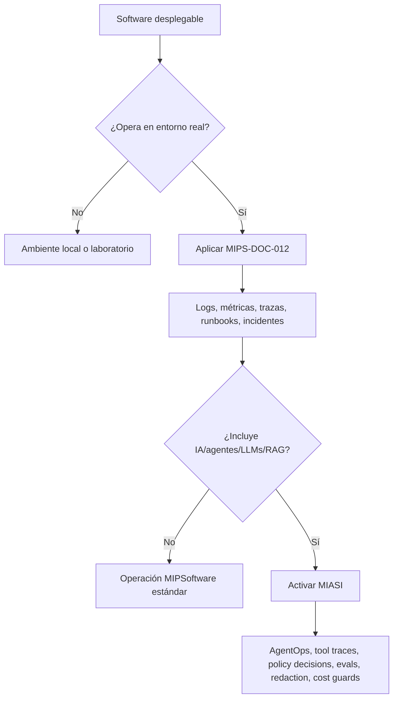
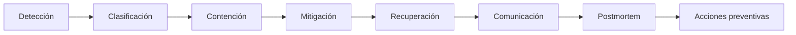

# MIPS-DOC-012 — Observabilidad, operación, SRE e incidentes

## 1. Resumen ejecutivo

Este documento define el estándar operativo de MIPSoftware para llevar software a producción y mantenerlo de forma confiable, observable, recuperable y auditable. Su propósito es impedir que un sistema se considere productivo únicamente porque fue desplegado: un sistema productivo debe tener señales de observabilidad, runbooks, responsables, planes de respuesta, backup/restore si maneja datos persistentes, criterios de SLO/SLA cuando aplique y mecanismos de aprendizaje posterior a incidentes.

La regla central es:

```text
Ningún sistema productivo debe operar sin logs, métricas y runbook.
Todo incidente debe producir aprendizaje.
Todo sistema con datos persistentes debe tener backup y restore probado.
```

Este estándar aplica a aplicaciones web, APIs, servicios backend, workers, pipelines de datos, aplicaciones móviles, automatizaciones internas, plataformas agent-assisted y sistemas con IA. Cuando el sistema incorpora agentes, LLMs, RAG, memoria, tool calling, modelos externos/locales o automatización inteligente, se activa además MIASI para observabilidad agentic, trazas de agentes, tool calls, evaluación, redacción de datos sensibles, control de costos y aprobación humana cuando corresponda.

## 2. Objetivo

Definir cómo se debe operar software profesional en producción mediante:

- logging estructurado;
- métricas operativas y de negocio;
- tracing distribuido;
- audit logs;
- dashboards;
- alertas accionables;
- SLI/SLO/SLA;
- error budgets;
- runbooks;
- incident response;
- on-call cuando aplique;
- backup/restore;
- disaster recovery;
- capacity planning;
- performance monitoring;
- cost monitoring;
- postmortems.

## 3. Alcance

Este estándar cubre la operación de sistemas desde el momento en que están listos para despliegue controlado hasta su mantenimiento en producción. Incluye operación local, staging, producción controlada, producción real, operación híbrida y operación cloud. No prescribe un proveedor específico de monitoreo ni obliga a usar servicios pagos.

## 4. Principios operativos

| Principio | Regla normativa | Evidencia mínima |
|---|---|---|
| Observabilidad por diseño | La observabilidad se diseña antes del despliegue, no después del primer incidente. | `observability_plan.md` |
| Tres señales mínimas | Todo sistema productivo debe exponer logs, métricas y trazas cuando aplique. | Dashboard o reporte de instrumentación |
| Operación con runbook | Todo sistema productivo debe poder operarse mediante instrucciones documentadas. | `runbook.md` |
| Incidentes sin culpa | Los incidentes se analizan como fallos del sistema, proceso o diseño, no como culpabilidad individual. | `postmortem.md` |
| Recuperabilidad | Todo sistema con datos persistentes debe tener backup y restore probado. | `backup_restore_plan.md` |
| SLO antes que intuición | La confiabilidad se expresa mediante SLIs, SLOs y políticas de error budget cuando aplique. | `slo_sla.md` |
| Alertas accionables | Una alerta debe indicar impacto, severidad, acción sugerida y responsable. | Catálogo de alertas |
| Auditoría proporcional | Acciones críticas y cambios relevantes deben quedar auditados. | Audit log |
| Cost awareness | Los costos operativos deben monitorearse cuando existan recursos variables o servicios externos. | Cost report |
| MIASI para IA | Sistemas con agentes deben registrar trazas agentic, tool calls, políticas y evaluaciones. | AgentOps trace / Eval report |

## 5. Relación con MIPSoftware y MIASI

MIPSoftware gobierna la operación general de cualquier sistema. MIASI se activa cuando el sistema introduce comportamiento inteligente, agéntico o probabilístico.



## 6. Logging

### 6.1 Propósito

Registrar eventos relevantes del sistema de forma estructurada, consultable, segura y útil para diagnóstico, auditoría y análisis operativo.

### 6.2 Reglas

- Los logs deben ser estructurados preferiblemente en JSON o formato equivalente.
- Todo log debe incluir al menos timestamp, nivel, servicio, ambiente, mensaje y correlación cuando aplique.
- Los logs no deben exponer secretos, tokens, claves, contraseñas ni datos personales innecesarios.
- Los errores deben incluir contexto técnico suficiente para diagnosticar, sin revelar información sensible.
- Los logs de negocio, seguridad y auditoría deben separarse lógicamente.

### 6.3 Campos mínimos

| Campo | Obligatorio | Descripción |
|---|---:|---|
| `timestamp` | Sí | Fecha/hora del evento. |
| `level` | Sí | `debug`, `info`, `warning`, `error`, `critical`. |
| `service` | Sí | Servicio, módulo o componente. |
| `environment` | Sí | `local`, `dev`, `staging`, `prod`. |
| `event_name` | Sí | Nombre estable del evento. |
| `message` | Sí | Descripción humana breve. |
| `correlation_id` | Condicional | ID de correlación de solicitud/transacción. |
| `user_id` | Condicional | Solo si es necesario y permitido. |
| `error_code` | Condicional | Código de error normalizado. |
| `trace_id` | Condicional | Relación con tracing distribuido. |

## 7. Metrics

### 7.1 Propósito

Medir el comportamiento del sistema para detectar degradación, capacidad insuficiente, errores, saturación y tendencias de negocio.

### 7.2 Categorías mínimas

| Categoría | Ejemplos | Uso |
|---|---|---|
| Disponibilidad | uptime, health check success | SLI/SLO |
| Latencia | p50, p95, p99 | Performance y experiencia |
| Errores | error rate, failed requests | Alertas y SLO |
| Saturación | CPU, RAM, DB connections, queue depth | Capacity planning |
| Tráfico | requests/sec, jobs/min | Demanda |
| Negocio | ventas, registros, órdenes, conversiones | Monitoreo producto |
| Costo | tokens, API calls, infraestructura | Cost monitoring |
| IA/agentes | tool calls, eval pass rate, model latency | MIASI |

## 8. Tracing

### 8.1 Propósito

Representar el recorrido completo de una solicitud o tarea a través de componentes, servicios, bases de datos, colas, APIs externas o agentes.

### 8.2 Reglas

- Todo flujo crítico distribuido debe tener `trace_id`.
- Los spans deben incluir operación, duración, estado y errores.
- Las trazas deben correlacionarse con logs y métricas.
- Las llamadas externas deben quedar registradas con proveedor, latencia, estado y retry policy.
- En sistemas agénticos, cada paso del agente, tool call, policy decision y evaluación debe representarse como evento o span equivalente.

## 9. Audit logs

### 9.1 Propósito

Registrar acciones relevantes para responsabilidad, cumplimiento, trazabilidad y análisis posterior.

### 9.2 Eventos auditables mínimos

| Evento | Ejemplo | Retención sugerida |
|---|---|---:|
| Autenticación | login, logout, failed login | 90 días o más |
| Autorización | acceso denegado, cambio de rol | 180 días o más |
| Cambios críticos | creación/eliminación de recurso | Según dominio |
| Cambios de configuración | secrets, policies, feature flags | Según riesgo |
| Cambios de datos sensibles | exportación, eliminación, actualización | Según regulación |
| Acciones de agente IA | tool call, aprobación, ejecución | Según MIASI |

## 10. Dashboards

### 10.1 Propósito

Dar visibilidad operacional a salud, confiabilidad, errores, capacidad, costos y negocio.

### 10.2 Dashboards mínimos

| Dashboard | Audiencia | Contenido mínimo |
|---|---|---|
| Salud del sistema | Dev/Ops | disponibilidad, errores, latencia, saturación |
| Release monitoring | Dev/Ops | versión, despliegues, errores post-release |
| Seguridad | Tech lead / security | eventos críticos, fallos auth, vulnerabilidades |
| Producto | Product owner | uso, conversiones, flujos críticos |
| Costos | Tech lead / negocio | consumo infraestructura, APIs, modelos |
| AgentOps | MIASI | tool calls, modelo, tokens, evals, policy gates |

## 11. Alerts

### 11.1 Propósito

Detectar condiciones que requieren acción humana o automatizada.

### 11.2 Reglas

- Una alerta debe ser accionable.
- No deben existir alertas críticas sin runbook asociado.
- La alerta debe indicar severidad, impacto, posible causa, dashboard y acción sugerida.
- Las alertas ruidosas deben corregirse o degradarse.
- Las alertas de seguridad y datos sensibles deben tener prioridad especial.

### 11.3 Severidades sugeridas

| Severidad | Descripción | Tiempo objetivo de respuesta |
|---|---|---:|
| SEV-1 | Caída total, pérdida de datos, incidente de seguridad crítico | inmediato |
| SEV-2 | Degradación grave o funcionalidad crítica afectada | < 1 hora |
| SEV-3 | Degradación parcial o bug relevante | < 1 día |
| SEV-4 | Problema menor o mejora operativa | backlog |

## 12. SLI, SLO y SLA

### 12.1 Definiciones normativas

| Concepto | Definición | Ejemplo |
|---|---|---|
| SLI | Indicador medido de nivel de servicio. | porcentaje de requests exitosos |
| SLO | Objetivo interno sobre un SLI. | 99.5% de requests exitosos al mes |
| SLA | Compromiso contractual o formal con usuario/cliente. | 99% disponibilidad mensual con compensación |

### 12.2 Reglas

- No todo sistema inicial necesita SLA formal, pero todo sistema productivo debe tener al menos SLIs operativos.
- Si el sistema afecta usuarios reales, debe tener SLOs mínimos.
- El SLA solo debe declararse si la organización puede medirlo y cumplirlo.
- Los SLOs deben estar conectados con alertas, dashboards y error budget.

## 13. Error budgets

### 13.1 Propósito

Balancear velocidad de cambio y confiabilidad. Un error budget representa el margen aceptado de incumplimiento del SLO.

### 13.2 Política mínima

| Estado del error budget | Decisión recomendada |
|---|---|
| Budget saludable | Se permiten cambios normales. |
| Budget en riesgo | Reducir cambios riesgosos y priorizar estabilidad. |
| Budget agotado | Congelar releases no críticos y priorizar confiabilidad. |

## 14. Runbooks

### 14.1 Propósito

Documentar cómo operar, diagnosticar y recuperar el sistema.

### 14.2 Contenido mínimo

- descripción del sistema;
- responsables;
- ambientes;
- dependencias;
- comandos de diagnóstico;
- dashboards;
- alertas asociadas;
- procedimientos de recuperación;
- rollback;
- backup/restore;
- escalamiento;
- contactos;
- riesgos;
- relación con MIASI si aplica.

## 15. Incident response

### 15.1 Fases



### 15.2 Reglas

- Todo incidente debe tener severidad, responsable, línea de tiempo y estado.
- Los incidentes SEV-1/SEV-2 requieren postmortem.
- La comunicación debe ser proporcional al impacto.
- Los incidentes de seguridad o datos sensibles deben activar MIPS-DOC-010.
- Los incidentes agentic deben activar MIASI.

## 16. On-call model

El modelo on-call solo aplica cuando existe producción real, usuarios afectados y necesidad de respuesta fuera del horario normal. Para proyectos iniciales, puede existir un modelo liviano de responsable operativo.

| Nivel | Uso recomendado |
|---|---|
| Sin on-call | Prototipos, laboratorios, apps internas no críticas. |
| Responsable operativo | MVP con usuarios limitados. |
| On-call liviano | Producción controlada. |
| On-call formal | Producción crítica o clientes externos. |

## 17. Backup, restore y disaster recovery

### 17.1 Reglas

- Todo sistema con datos persistentes debe tener backup.
- Todo backup crítico debe tener restore probado.
- Los backups deben protegerse contra pérdida, corrupción y acceso no autorizado.
- Los sistemas críticos deben definir RPO y RTO.
- El plan de disaster recovery debe ser proporcional al impacto del sistema.

### 17.2 RPO/RTO

| Concepto | Definición |
|---|---|
| RPO | Pérdida máxima aceptable de datos medida en tiempo. |
| RTO | Tiempo máximo aceptable para recuperar el servicio. |

## 18. Capacity planning

### 18.1 Propósito

Asegurar que el sistema puede soportar demanda actual y crecimiento esperado.

### 18.2 Señales mínimas

- CPU/memoria;
- almacenamiento;
- conexiones de base de datos;
- latencia;
- throughput;
- cola de trabajos;
- límites de terceros;
- costos variables;
- consumo de modelo/API cuando aplica MIASI.

## 19. Performance monitoring

El monitoreo de performance debe cubrir latencia, throughput, saturación y degradación por release. Para flujos críticos, se deben definir umbrales por percentiles, no solo promedios.

| Métrica | Umbral ejemplo | Acción |
|---|---:|---|
| p95 latency | > 800 ms | analizar release, DB, red o saturación |
| error rate | > 2% | investigar incidente |
| queue age | > 5 min | escalar worker o reducir carga |
| DB connections | > 80% | revisar pool/capacidad |

## 20. Cost monitoring

### 20.1 Propósito

Evitar que el sistema crezca en costo sin visibilidad.

### 20.2 Métricas sugeridas

- costo por ambiente;
- costo por usuario;
- costo por transacción;
- costo por job;
- costo por modelo/API;
- costo por almacenamiento;
- costo por observabilidad;
- costo por integración externa.

## 21. Postmortems

### 21.1 Propósito

Convertir incidentes en aprendizaje organizacional y acciones preventivas.

### 21.2 Reglas

- Deben ser sin culpa individual.
- Deben incluir línea de tiempo factual.
- Deben identificar causas contribuyentes.
- Deben generar acciones con responsable y fecha.
- Deben alimentar backlog técnico, seguridad, pruebas o arquitectura.

## 22. Matriz control → evidencia → bloqueo

| Control | Evidencia mínima | Bloquea producción si falta |
|---|---|---:|
| Logging estructurado | logs con campos mínimos | Sí |
| Métricas básicas | métricas de disponibilidad, errores, latencia | Sí |
| Runbook | `runbook.md` | Sí |
| Alertas críticas | catálogo de alertas + runbook | Sí para producción externa |
| Backup/restore | plan y prueba de restore | Sí si hay datos persistentes |
| Incident response | `incident_report.md` + proceso | Sí para producción externa |
| SLO/SLI | `slo_sla.md` | Sí para servicios con usuarios reales |
| Dashboards | dashboard o reporte equivalente | Sí para sistemas críticos |
| Postmortem | plantilla y proceso | No inicial, sí tras incidentes SEV-1/2 |
| AgentOps | trazas y evals MIASI | Sí si hay agentes IA productivos |

## 23. Relación con el ciclo de vida MIPSoftware

| Fase MIPSoftware | Relación con este documento |
|---|---|
| 12 Plan de seguridad | Logging seguro, audit logs, incidentes de seguridad. |
| 14 Implementación | Instrumentación desde código. |
| 16 Verificación | Pruebas de observabilidad, backup/restore y runbooks. |
| 18 Release | Release readiness operacional. |
| 19 Despliegue | Post-deployment verification. |
| 20 Operación | Uso principal del estándar. |
| 21 Monitoreo | Métricas, alertas, dashboards, tracing. |
| 22 Gestión de incidentes | Incident response y postmortems. |
| 23 Mantenimiento evolutivo | Acciones preventivas, capacity planning, performance tuning. |
| 24 Auditoría | Evidencia operacional y audit logs. |
| 25 Retiro | Backups finales, exportación, eliminación y archivo. |

## 24. Activación MIASI

MIASI se activa cuando el sistema incluye:

- agentes IA;
- LLMs;
- RAG;
- memoria persistente o conversacional;
- tool calling;
- automatización inteligente;
- decisiones asistidas por IA;
- generación automática de contenido;
- integración con modelos locales o APIs externas.

En ese caso, además de observabilidad general, se deben registrar:

| Señal MIASI | Evidencia |
|---|---|
| Modelo/proveedor | ModelAdapter trace |
| Tool calls | tool name, input redacted, output, status |
| Policy decisions | allow/deny/approval_required |
| Human approval | approval request / decision |
| RAG | fuentes, chunks, grounding |
| Memoria | lectura/escritura, scope, redacción |
| Costos | tokens, llamadas, latencia, proveedor |
| Evaluación | task completion, tool accuracy, groundedness |
| Seguridad | prompt injection signals, data exfiltration guards |

## 25. Plantillas asociadas

Este documento crea y usa las siguientes plantillas:

```text
templates/observability_plan.md
templates/runbook.md
templates/incident_report.md
templates/postmortem.md
templates/slo_sla.md
templates/backup_restore_plan.md
templates/operational_readiness_review.md
```

## 26. Criterios PASS / FAIL / BLOCK

### PASS

- Existe plan de observabilidad.
- Existe runbook.
- El sistema emite logs mínimos.
- El sistema expone métricas mínimas o equivalente verificable.
- Los flujos críticos tienen estrategia de tracing cuando aplica.
- Los datos persistentes tienen backup/restore.
- Existe proceso de incident response.
- Existen criterios SLI/SLO para producción con usuarios reales.
- MIASI se activa si hay IA/agentes.

### FAIL

- Hay logs, pero no son útiles para diagnóstico.
- Hay dashboards, pero no tienen umbrales ni responsables.
- Hay backups, pero restore no está probado.
- Hay alertas, pero no son accionables.
- Hay incidentes, pero no producen acciones preventivas.

### BLOCK

- Producción sin logs.
- Producción sin runbook.
- Sistema con datos persistentes sin backup.
- Se procesan datos sensibles sin audit logs.
- Servicio con usuarios reales sin monitoreo mínimo.
- Sistema agentic productivo sin trazas MIASI ni evaluación mínima.

## 27. Referencias

- Google SRE Book — Service Level Objectives: https://sre.google/sre-book/service-level-objectives/
- Google SRE Workbook — Postmortem Culture: https://sre.google/workbook/postmortem-culture/
- OpenTelemetry Documentation: https://opentelemetry.io/docs/
- OpenTelemetry Logs Specification: https://opentelemetry.io/docs/specs/otel/logs/
- NIST SP 800-34 Rev. 1 — Contingency Planning Guide for Federal Information Systems: https://csrc.nist.gov/pubs/sp/800/34/r1/upd1/final
- ISO/IEC/IEEE 12207 — Software life cycle processes: https://www.iso.org/standard/90219.html
- MIASI v1.0.0 — Modelo de Ingeniería de Sistemas Agénticos Inteligentes.

## 28. Changelog

| Versión | Fecha | Cambio |
|---|---:|---|
| 0.1.0 | 2026-05-31 | Creación inicial del estándar de observabilidad, operación, SRE e incidentes. |
