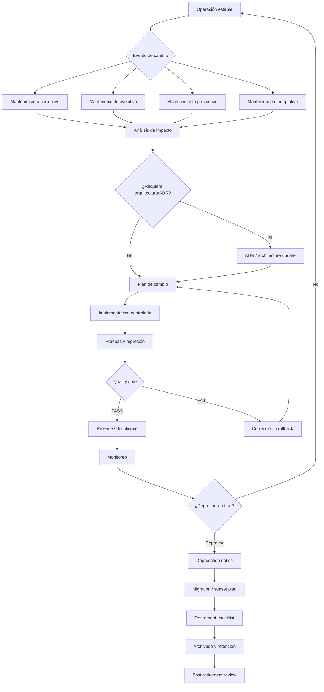

# MIPS-DOC-013 — Mantenimiento, evolución, deuda técnica y retiro

## 1. Resumen ejecutivo

Este documento define el estándar MIPSoftware para gestionar el ciclo posterior al primer release de una aplicación profesional: mantenimiento correctivo, evolutivo, preventivo y adaptativo; deuda técnica; refactoring; deprecación; soporte de versiones; migraciones; plan de sunset; retiro; comunicación con usuarios; archivado y retención por cumplimiento.

El objetivo es evitar que el software se deteriore después del primer despliegue. En MIPSoftware, un sistema no se considera profesional solo porque fue construido y desplegado: debe poder mantenerse, evolucionar, auditarse, migrarse, retirarse y proteger a usuarios y datos durante todo su ciclo de vida.

Regla central:

```text
Todo sistema debe tener política de mantenimiento.
Toda deuda técnica crítica debe registrarse.
Todo retiro debe proteger datos, usuarios, contratos, cumplimiento y trazabilidad histórica.
```

## 2. Objetivo

Definir cómo se gestiona el ciclo posterior al primer release de una aplicación real, incluyendo:

- corrección de defectos;
- evolución funcional;
- adaptación tecnológica o regulatoria;
- prevención de degradación;
- gestión explícita de deuda técnica;
- refactoring controlado;
- deprecación de funcionalidades, APIs y versiones;
- migraciones técnicas y de datos;
- retiro seguro de sistemas, módulos o servicios;
- conservación de evidencia y cumplimiento.

## 3. Alcance

Este estándar aplica a:

- aplicaciones web, móviles, CLI, APIs y servicios backend;
- sistemas internos y productos externos;
- sistemas monolíticos, modulares, event-driven, serverless o distribuidos;
- sistemas con datos persistentes;
- sistemas con integraciones externas;
- sistemas con usuarios reales;
- sistemas con IA o agentes, mediante activación de MIASI.

Fuera de alcance:

- soporte contractual legal detallado;
- contabilidad formal de costos de soporte;
- certificaciones regulatorias específicas;
- operación ITIL completa;
- gestión comercial de garantías y SLA contractuales complejos.

## 4. Principios normativos

| Principio | Regla MIPSoftware | Criterio de cumplimiento |
|---|---|---|
| Mantenimiento explícito | Todo sistema debe tener plan de mantenimiento. | Existe `maintenance_plan.md`. |
| Deuda visible | La deuda técnica no debe quedar implícita en conversaciones o comentarios dispersos. | Existe `technical_debt_register.md`. |
| Refactoring gobernado | Refactorizar no debe ser una excusa para cambios funcionales no trazados. | Existe `refactoring_plan.md` para cambios relevantes. |
| Deprecación responsable | No se elimina una funcionalidad usada sin aviso, transición y rollback/alternativa. | Existe `deprecation_notice.md`. |
| Migración segura | Toda migración debe tener plan, validación, backup y rollback. | Existe plan de migración y evidencia de prueba. |
| Retiro seguro | Retirar no significa borrar sin control. | Existe `retirement_plan.md`. |
| Datos protegidos | Todo retiro debe preservar, exportar, anonimizar o eliminar datos según política. | Existe decisión documentada de retención/eliminación. |
| Usuarios informados | Cambios disruptivos deben comunicarse con antelación razonable. | Existe plan de comunicación. |
| Evidencia auditada | Cambios críticos deben dejar trazabilidad. | Hay logs, reportes, issues, releases o ADRs. |
| MIASI activado | Si el sistema tiene IA/agentes, mantenimiento incluye modelos, prompts, políticas y evaluaciones. | Se activan controles MIASI. |

## 5. Tipos de mantenimiento

### 5.1 Mantenimiento correctivo

**Propósito:** corregir defectos, fallos, errores de datos o comportamientos no conformes.

**Activadores típicos:** bugs reportados, incidentes, fallos de monitoreo, defectos encontrados en regresión, errores de seguridad.

**Artefactos mínimos:**

- defect report;
- issue/ticket;
- prueba de regresión;
- changelog/release note;
- evidencia de verificación.

**Criterio PASS:** el defecto queda corregido, probado, trazado y sin introducir regresiones críticas.

**Criterio BLOCK:** no existe reproducción, no existe prueba de regresión para defecto crítico o el fix rompe un quality gate.

### 5.2 Mantenimiento evolutivo

**Propósito:** incorporar nuevas funcionalidades, mejoras de producto o cambios de comportamiento solicitados por usuarios o negocio.

**Activadores típicos:** roadmap, feedback, nuevas necesidades, mejora de conversión, nuevos módulos, oportunidades de mercado.

**Artefactos mínimos:**

- requerimiento o historia aprobada;
- análisis de impacto;
- actualización de arquitectura si aplica;
- pruebas nuevas;
- release note.

**Criterio PASS:** la evolución está trazada hacia valor de negocio, tiene criterios de aceptación y no degrada calidad crítica.

**Criterio BLOCK:** se implementan funcionalidades sin requerimiento, sin impacto analizado o sin pruebas.

### 5.3 Mantenimiento preventivo

**Propósito:** reducir riesgo futuro mediante actualización, limpieza, refactoring, hardening, mejora de tests, reducción de deuda o renovación de dependencias.

**Activadores típicos:** dependencia obsoleta, deuda técnica creciente, baja cobertura, complejidad elevada, riesgo de seguridad, degradación de performance.

**Artefactos mínimos:**

- technical debt register;
- refactoring plan;
- risk log;
- pruebas de regresión;
- evidencia de mejora.

**Criterio PASS:** el trabajo preventivo reduce riesgo medible sin romper comportamiento observable.

**Criterio BLOCK:** refactoring masivo sin tests, sin rollback o sin criterio de finalización.

### 5.4 Mantenimiento adaptativo

**Propósito:** adaptar el sistema a cambios del entorno: sistemas operativos, navegadores, APIs externas, legislación, infraestructura, proveedores, formatos o reglas de negocio externas.

**Activadores típicos:** API externa cambia, proveedor de pagos cambia, nueva norma, dependencia deja de soportarse, migración de hosting, cambio de versión de base de datos.

**Artefactos mínimos:**

- análisis de cambio externo;
- plan de adaptación;
- pruebas de compatibilidad;
- plan de transición;
- comunicación si afecta usuarios.

**Criterio PASS:** el sistema sigue operando correctamente bajo el nuevo entorno o dependencia.

**Criterio BLOCK:** adaptación sin pruebas de integración o sin plan de rollback.

## 6. Technical Debt Register

La deuda técnica es cualquier decisión técnica, omisión, workaround o limitación que reduce mantenibilidad, evolutividad, confiabilidad, seguridad o velocidad futura.

Toda deuda técnica relevante debe registrarse con:

- ID;
- descripción;
- origen;
- módulo afectado;
- tipo de deuda;
- severidad;
- impacto;
- riesgo;
- costo estimado de no corregir;
- fecha objetivo;
- responsable;
- estrategia de remediación;
- relación con issues, ADRs o quality gates.

### 6.1 Tipos de deuda técnica

| Tipo | Descripción | Ejemplo |
|---|---|---|
| Arquitectónica | Afecta estructura, dependencias o modularidad. | Capa de dominio acoplada a framework. |
| Código | Afecta legibilidad, duplicación o complejidad. | Función extensa sin separación de responsabilidades. |
| Testing | Falta de pruebas o pruebas frágiles. | Bug crítico sin prueba de regresión. |
| Seguridad | Riesgo de exposición o control débil. | Secretos manuales sin rotación. |
| Datos | Modelo inconsistente o migraciones débiles. | Campo usado con múltiples significados. |
| Operación | Falta de logs, alertas, runbooks o backup. | Servicio sin métrica de errores. |
| Documentación | Conocimiento crítico no documentado. | API sin contrato actualizado. |
| IA/agentes | Prompts, evals, policies o modelos no gobernados. | Agente sin Eval Card ni trazas. |

### 6.2 Severidades

| Severidad | Definición | Acción requerida |
|---|---|---|
| Critical | Puede causar caída, pérdida de datos, vulnerabilidad grave o bloqueo de evolución. | Remediación prioritaria o bloqueo de release. |
| High | Riesgo alto de regresión, inseguridad, degradación o costo creciente. | Plan de remediación con fecha. |
| Medium | Impacta mantenimiento o calidad, pero no bloquea release. | Registrar y priorizar. |
| Low | Mejora deseable o deuda menor. | Agrupar en mantenimiento preventivo. |

## 7. Refactoring policy

El refactoring es una modificación interna orientada a mejorar estructura, mantenibilidad o calidad sin cambiar comportamiento externo esperado.

### 7.1 Reglas

- Todo refactoring relevante debe tener objetivo explícito.
- No debe mezclarse con cambios funcionales sin trazabilidad separada.
- Debe contar con pruebas de regresión proporcionales al riesgo.
- Debe tener estrategia de rollback si afecta módulos críticos.
- Debe actualizar documentación si cambia arquitectura, contratos o flujos.

### 7.2 Tipos de refactoring

| Tipo | Ejemplo | Evidencia mínima |
|---|---|---|
| Local | Extraer función, renombrar clases, simplificar condicionales. | Tests existentes pasan. |
| Modular | Separar módulos, reducir acoplamiento. | Arquitectura actualizada y tests de integración. |
| Arquitectónico | Cambiar capas, bounded contexts, servicios. | ADR, plan, pruebas, rollback. |
| Datos | Normalizar modelo, limpiar migraciones. | Backup, migración probada, validación de datos. |
| Agentic/MIASI | Cambiar prompt, tool policy, memoria o evals. | Eval run, trazas, approval si aplica. |

## 8. Deprecation policy

La deprecación es la declaración formal de que una funcionalidad, API, versión, módulo o integración dejará de recomendarse y eventualmente será retirada.

### 8.1 Reglas

- Toda deprecación debe tener motivo.
- Debe identificar usuarios, clientes, integraciones o módulos afectados.
- Debe incluir fecha de inicio, periodo de transición y fecha objetivo de retiro.
- Debe ofrecer alternativa o ruta de migración cuando sea posible.
- Debe tener comunicación clara.
- Debe tener rollback o plan de contingencia si afecta operación.

### 8.2 Objetos de deprecación

| Objeto | Ejemplo | Evidencia requerida |
|---|---|---|
| API | Endpoint `/v1/orders` reemplazado por `/v2/orders`. | Contrato API, changelog, aviso. |
| UI | Pantalla antigua de reportes. | Comunicación y flujo alternativo. |
| Modelo de datos | Campo obsoleto. | Migración y data dictionary actualizado. |
| Integración | Proveedor externo reemplazado. | Integration contract actualizado. |
| Agente IA | Herramienta o prompt obsoleto. | Agent/Tool/Policy Card actualizado. |

## 9. Version support policy

Toda aplicación debe definir qué versiones se soportan, durante cuánto tiempo y bajo qué condiciones.

| Tipo de versión | Soporte esperado | Regla |
|---|---|---|
| Experimental | Bajo o nulo | No usar en producción. |
| MVP | Limitado | Cambios breaking permitidos con aviso. |
| Stable | Formal | Correcciones y soporte según política. |
| LTS | Extendido | Solo para productos con usuarios reales o contratos. |
| Deprecated | Transición | Recibe correcciones críticas hasta fecha límite. |
| Retired | Ninguno | No debe recibir tráfico ni datos nuevos. |

## 10. Migration policy

Una migración es cualquier cambio que mueve datos, usuarios, configuración, infraestructura, versión, proveedor o comportamiento hacia un nuevo estado.

### 10.1 Migraciones cubiertas

- migración de base de datos;
- migración de API;
- migración de proveedor;
- migración de infraestructura;
- migración de autenticación;
- migración de archivos;
- migración de agentes/modelos/prompts cuando aplique MIASI.

### 10.2 Requisitos mínimos

Toda migración relevante debe tener:

- alcance;
- inventario afectado;
- backup previo;
- script o procedimiento versionado;
- prueba en entorno no productivo;
- validación post-migración;
- rollback o estrategia de compensación;
- comunicación si afecta usuarios.

## 11. Data migration

Toda migración de datos debe proteger consistencia, completitud, privacidad y auditabilidad.

| Control | Descripción | Criterio PASS |
|---|---|---|
| Backup previo | Copia recuperable antes de migrar. | Backup restaurable probado o validado. |
| Conteos de control | Comparación antes/después. | Conteos explicables y sin pérdida no justificada. |
| Checksums o validaciones | Validación de integridad. | Diferencias justificadas. |
| Dry-run | Simulación cuando sea posible. | Resultado revisado. |
| Rollback | Reversión o compensación. | Plan probado o documentado. |
| Datos sensibles | Tratamiento conforme a política. | No se exponen secretos ni datos personales. |

## 12. Sunset plan

Un sunset plan define cómo se desactiva gradualmente un producto, módulo, API, integración o versión.

Debe incluir:

- razón del sunset;
- alcance;
- usuarios afectados;
- cronograma;
- estrategia de comunicación;
- alternativa o ruta de migración;
- freeze de nuevas funcionalidades;
- tratamiento de datos;
- retiro de accesos;
- archivado;
- verificación final.

## 13. Retirement checklist

Antes de retirar un sistema, se debe verificar:

| Ítem | Obligatorio | Evidencia requerida | Criterio PASS |
|---|---:|---|---|
| Usuarios informados | Sí | Mensaje, release note o aviso | No quedan usuarios activos sin aviso. |
| Datos tratados | Sí | Exportación, retención o eliminación | Política aplicada. |
| Backups definidos | Sí | Backup final o decisión de no retener | Evidencia registrada. |
| Integraciones desconectadas | Sí | Lista de webhooks/APIs/cron jobs | Sin llamadas activas inesperadas. |
| Secretos revocados | Sí | Registro de revocación | Sin credenciales activas innecesarias. |
| DNS/rutas desactivadas | Si aplica | Checklist infra | Sin tráfico residual no controlado. |
| Artefactos archivados | Sí | Paquete documental | Trazabilidad preservada. |
| Cumplimiento revisado | Si aplica | Retention record | Sin obligación pendiente. |
| Post-retirement review | Sí | Reporte final | Aprendizajes registrados. |

## 14. User communication

La comunicación de mantenimiento, deprecación, migración o retiro debe ser proporcional al impacto.

### 14.1 Tipos de comunicación

| Tipo | Uso | Contenido mínimo |
|---|---|---|
| Changelog | Cambios menores o técnicos. | Qué cambió, fecha, impacto. |
| Release note | Releases visibles. | Cambios, fixes, riesgos, acción requerida. |
| Deprecation notice | Funcionalidad o API en salida. | Motivo, fechas, alternativa. |
| Migration notice | Usuarios deben actuar. | Pasos, fechas, soporte. |
| Incident notice | Fallo o afectación. | Impacto, estado, mitigación. |
| Retirement notice | Sistema o módulo se retira. | Fechas, datos, soporte, alternativas. |

### 14.2 Reglas de microcopy operacional

- Debe ser clara, específica y accionable.
- No debe ocultar impacto relevante.
- Debe incluir fechas cuando haya cambio de disponibilidad.
- Debe indicar si el usuario debe hacer algo.
- Debe evitar lenguaje ambiguo como “próximamente” sin ventana temporal.

## 15. Archiving

El archivado preserva evidencia necesaria para auditoría, aprendizaje, soporte y cumplimiento.

Debe incluir, según aplique:

- código fuente final;
- tag/release final;
- documentación;
- ADRs;
- contratos API/eventos;
- migraciones;
- backups o decisión de eliminación;
- incidentes relevantes;
- postmortems;
- security exceptions cerradas;
- reportes de calidad;
- SBOM/provenance;
- Agent/Tool/Eval Cards si aplica MIASI.

## 16. Compliance retention

La retención por cumplimiento define qué se conserva, por cuánto tiempo y por qué motivo.

| Tipo de evidencia | Ejemplo | Regla |
|---|---|---|
| Legal/contractual | Contratos, términos de servicio | Según obligación aplicable. |
| Seguridad | incidentes, vulnerabilidades, excepciones | Retención mínima definida por política. |
| Datos personales | registros de tratamiento, eliminación | Minimización y retención limitada. |
| Auditoría técnica | releases, ADRs, logs críticos | Retener lo necesario para trazabilidad. |
| IA/agentes | evals, trazas, policies, modelos usados | Retener según riesgo y criticidad. |

## 17. Activación de MIASI

MIASI se activa durante mantenimiento, evolución o retiro cuando el sistema incluye:

- agentes IA;
- LLMs;
- RAG;
- memoria persistente;
- tool calling;
- modelos locales o externos;
- generación automática de contenido;
- decisiones asistidas por IA;
- automatización inteligente con efectos sobre datos, usuarios, archivos, APIs o despliegues.

### 17.1 Controles MIASI mínimos

| Situación | Control MIASI requerido |
|---|---|
| Cambio de prompt o modelo | Eval Card, Model Card, changelog, regresión agentic. |
| Cambio de herramienta | Tool Card, Policy Card, pruebas, dry-run. |
| Cambio de memoria | Memory Card, privacidad, retención, tests. |
| Cambio RAG | RAG Card, evaluación de grounding, citas. |
| Cambio con side effects | Human approval, policy-as-code, trazas. |
| Retiro de agente | plan de retiro, archivado de policies/evals/trazas. |

## 18. Diagrama de ciclo de mantenimiento y retiro



## 19. Matriz artefacto → quality gate

| Artefacto | Quality gate | Criterio PASS | Criterio BLOCK |
|---|---|---|---|
| `maintenance_plan.md` | Maintenance readiness | Tipos de mantenimiento y responsables definidos. | No hay política de mantenimiento. |
| `technical_debt_register.md` | Debt visibility | Deuda crítica registrada y priorizada. | Deuda crítica oculta o sin dueño. |
| `refactoring_plan.md` | Safe refactoring | Objetivo, alcance, pruebas y rollback definidos. | Refactoring crítico sin pruebas. |
| `deprecation_notice.md` | Responsible deprecation | Fechas, impacto y alternativa definidos. | Se elimina funcionalidad usada sin aviso. |
| `retirement_plan.md` | Safe retirement | Datos, usuarios, integraciones y archivado cubiertos. | Retiro con riesgo de pérdida de datos o usuarios sin aviso. |

## 20. Matriz de riesgos

| Riesgo | Impacto | Mitigación | Bloqueo |
|---|---|---|---|
| Deuda crítica no registrada | Fallos, lentitud, inseguridad | Register + priorización | Sí, si afecta release crítico. |
| Refactoring sin pruebas | Regresiones | Regression suite | Sí. |
| Deprecación sin comunicación | Usuarios afectados | Notice + roadmap | Sí, si hay usuarios reales. |
| Migración sin backup | Pérdida de datos | Backup + restore test | Sí. |
| Retiro sin política de datos | Riesgo legal/privacidad | Retention/deletion plan | Sí. |
| Agente IA mantenido sin evals | Drift, errores, acciones inseguras | MIASI Eval/Policy Cards | Sí, si tiene side effects. |

## 21. Criterios PASS/FAIL/BLOCK

### PASS

Un proyecto cumple este estándar cuando:

- tiene plan de mantenimiento;
- registra deuda técnica crítica;
- separa mantenimiento correctivo/evolutivo/preventivo/adaptativo;
- exige pruebas de regresión para bugs críticos;
- define política de soporte de versiones;
- documenta deprecaciones relevantes;
- tiene política de migración y rollback;
- protege datos durante migración y retiro;
- conserva evidencia necesaria;
- activa MIASI cuando aplica.

### FAIL

Un proyecto falla este estándar cuando:

- corrige errores sin trazabilidad;
- acumula deuda crítica sin registro;
- mezcla refactoring con cambios funcionales sin control;
- no comunica cambios disruptivos;
- carece de plan de soporte o retiro.

### BLOCK

Un release, migración o retiro debe bloquearse si:

- existe riesgo alto de pérdida de datos;
- no hay backup cuando hay datos persistentes;
- se retira funcionalidad usada sin aviso ni alternativa;
- se detecta vulnerabilidad crítica no aceptada formalmente;
- se modifica un agente IA con side effects sin evaluación/policy/human approval cuando aplique;
- no existe rollback o estrategia de compensación para cambio crítico.

## 22. Relación con DevPilot Local

DevPilot Local debe poder automatizar progresivamente:

| Comando futuro | Uso |
|---|---|
| `devpilot debt register` | Crear o actualizar deuda técnica. |
| `devpilot maintenance plan` | Generar plan de mantenimiento. |
| `devpilot refactor plan` | Crear plan de refactoring con riesgos y pruebas. |
| `devpilot deprecate` | Generar deprecation notice. |
| `devpilot migration check` | Validar plan de migración. |
| `devpilot retirement-check` | Ejecutar checklist de retiro. |
| `devpilot miasi-maintenance-check` | Validar controles MIASI para sistemas inteligentes. |

## 23. Documentos mínimos para ciclo posterior al release

Antes de considerar un sistema como mantenible, deben existir al menos:

```text
maintenance_plan.md
technical_debt_register.md
runbook.md
backup_restore_plan.md, si maneja datos persistentes
release_plan.md
rollback_plan.md
incident_report.md, si ya tuvo incidentes
retirement_plan.md, cuando exista fecha o intención de retiro
```

Si el sistema incluye IA/agentes, además:

```text
Agent Card
Tool Card
Eval Card
Policy Card
Observability Card
Cost Budget
Data Handling Sheet
```

## 24. Referencias

- ISO/IEC/IEEE 12207 — Software life cycle processes: https://www.iso.org/standard/90219.html
- ISO/IEC/IEEE 14764 — Software maintenance process guidance: https://www.iso.org/obp/ui/en/
- ISO/IEC 25010 — Software product quality model: https://iso25000.com/index.php/en/iso-25000-standards/iso-25010
- SEBoK — Life cycle stages: https://sebokwiki.org/wiki/Life_Cycle_Stages
- NIST SSDF SP 800-218 — Secure Software Development Framework: https://csrc.nist.gov/pubs/sp/800/218/final
- MIASI v1.0.0 — Modelo de Ingeniería de Sistemas Agénticos Inteligentes.

## 25. Changelog

| Versión | Fecha | Cambio |
|---|---|---|
| 0.1.0 | 2026-05-31 | Creación inicial de MIPS-DOC-013. |
