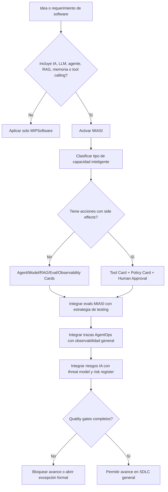

# MIPS-DOC-014 — Integración formal de MIASI como extensión inteligente de MIPSoftware

## 1. Resumen ejecutivo

Este documento define **cuándo y cómo se activa MIASI — Modelo de Ingeniería de Sistemas Agénticos Inteligentes — dentro de MIPSoftware**.

MIPSoftware es el estándar general para construir software profesional. MIASI no lo reemplaza. MIASI se activa como **extensión especializada obligatoria** cuando una aplicación incorpora capacidades inteligentes como LLMs, agentes, RAG, memoria, tool calling, automatización inteligente, decisiones asistidas por IA, generación automática de contenido o acciones ejecutadas mediante herramientas.

La regla normativa principal es:

```text
Toda aplicación profesional con IA debe cumplir MIPSoftware y MIASI.
MIPSoftware gobierna el ciclo de vida general del software.
MIASI gobierna la parte inteligente, agéntica, evaluativa, trazable y riesgosa del sistema.
```

Este documento permite auditar si un proyecto necesita extensión MIASI, qué documentos MIASI son obligatorios, qué controles se integran con los quality gates generales, cómo se conectan evaluaciones agentic con testing general, cómo se incorporan trazas AgentOps a la observabilidad, cómo se gestionan costos de modelos y cuándo una acción inteligente requiere aprobación humana.

---

## 2. Propósito

El propósito de este estándar es evitar dos errores frecuentes:

1. **Tratar un sistema con IA como software convencional**, ignorando riesgos de prompts, modelos, herramientas, RAG, memoria, costos, trazabilidad, seguridad de LLMs y comportamiento no determinista.
2. **Tratar MIASI como sustituto del SDLC general**, omitiendo producto, negocio, requerimientos, arquitectura, dominio, datos, UX/UI, testing, seguridad, CI/CD, operación, mantenimiento y retiro.

La integración correcta es:

```text
MIPSoftware = estándar raíz del ciclo de vida de software.
MIASI = extensión obligatoria para componentes inteligentes o agénticos.
```

---

## 3. Alcance

Este documento aplica a cualquier proyecto que incluya uno o más de los siguientes elementos:

- uso de LLMs mediante API, modelo local, mock model o proveedor externo;
- agentes con herramientas;
- RAG;
- memoria conversacional o persistente;
- tool calling;
- automatización inteligente;
- decisiones asistidas por IA;
- generación automática de texto, código, imágenes, reportes, mensajes o acciones;
- ejecución de acciones sobre archivos, bases de datos, APIs, CI/CD, repositorios, documentos, clientes o sistemas externos;
- evaluación de respuestas, herramientas o resultados mediante modelos;
- orquestación multiagente;
- integración MCP, API tools o conectores inteligentes.

No aplica a funcionalidades puramente determinísticas sin IA, salvo que interactúen con un componente inteligente.

---

## 4. Principio de subordinación y especialización

MIASI es un módulo especializado dentro de MIPSoftware. No tiene autoridad para saltarse controles generales.

| Regla | Interpretación |
|---|---|
| MIPSoftware gobierna el producto completo | Todo proyecto sigue producto, requerimientos, arquitectura, calidad, seguridad, CI/CD, operación y mantenimiento. |
| MIASI gobierna capacidades inteligentes | Todo componente con IA activa Agent Card, Tool Card, Eval Card, Policy Card, trazas, seguridad LLM y controles de autonomía. |
| MIASI no reemplaza pruebas generales | Las agentic evals complementan, no sustituyen, unit/integration/contract/E2E/security/performance tests. |
| MIASI no autoriza acciones críticas | Las acciones con side effects siguen política, permisos, dry-run y human approval. |
| MIASI no elimina responsabilidad humana | Las decisiones críticas se revisan, aprueban y auditan. |

---

## 5. Cuándo se activa MIASI

MIASI se activa de forma obligatoria cuando existe al menos un disparador de la siguiente tabla.

| Disparador | Ejemplo | Activación MIASI | Control mínimo |
|---|---|---:|---|
| LLMs | Generador de respuestas, clasificador, copiloto | Sí | Model Card, Eval Card, cost guard, trazas. |
| Agentes | Agente que planifica y llama herramientas | Sí | Agent Card, Tool Cards, Policy Card, evals, trazas. |
| RAG | Respuestas con documentos, citas o recuperación | Sí | RAG Card, grounding eval, citation checks. |
| Memoria | Preferencias, contexto persistente, historial | Sí | Memory Card, política de retención, privacidad. |
| Tool calling | Llamadas a APIs, filesystem, DB, CI/CD | Sí | Tool Card, side effects, dry-run, approval si aplica. |
| Automatización inteligente | Flujo que decide y actúa con IA | Sí | Policy-as-code, traceability, rollback cuando aplique. |
| Decisiones asistidas por IA | Recomendación de aprobación, scoring, riesgo | Sí | Explainability mínima, validación humana según riesgo. |
| Generación automática de contenido | Propuestas, emails, blogs, reportes, código | Sí | Output review, redaction, provenance, quality checks. |
| Acciones con herramientas | Crear archivo, enviar mensaje, ejecutar pipeline | Sí | Human approval, audit log, idempotencia, rollback si aplica. |

### 5.1 Regla de activación por incertidumbre

Cuando exista duda razonable sobre si MIASI aplica, se debe aplicar esta regla:

```text
Si una función usa IA para interpretar, generar, decidir, recomendar, recuperar contexto,
recordar información o ejecutar herramientas, MIASI aplica.
```

---

## 6. Qué documentos MIASI son obligatorios

La obligatoriedad depende del tipo de componente inteligente.

| Tipo de componente | Documentos MIASI obligatorios | Documentos MIPSoftware relacionados |
|---|---|---|
| LLM simple sin herramientas | Model Card, Eval Card, Observability Card, Cost Budget | Requerimientos, Testing, Seguridad, Operación |
| RAG | RAG Card, Eval Card, Data Handling Sheet, Observability Card | Datos, Requerimientos, Testing, Seguridad |
| Agente con herramientas read-only | Agent Card, Tool Card, Policy Card, Eval Card, Trace Plan | Arquitectura, API, Testing, Seguridad |
| Agente con acciones write | Agent Card, Tool Card, Policy Card, Human Approval Card, Runbook | Seguridad, CI/CD, Operación, Incidentes |
| Multiagente | Agent Cards, Handoff Contract, Eval Plan, Observability Plan | Arquitectura, Testing, Operación |
| Memoria persistente | Memory Card, Data Handling Sheet, Privacy Assessment | Datos, Seguridad, Operación |
| Generación de contenido | Agent/Model Card, Output Review Policy, Eval Card | UX/UI, Requerimientos, Seguridad |
| Automatización CI/CD inteligente | Tool Card, Policy Card, Human Approval Plan, Release Checklist | DevOps, Supply Chain, Seguridad |
| Sistema productivo con IA | Production Readiness Checklist MIASI completo | Todos los dominios MIPSoftware |

---

## 7. Integración Agentic SDLC con SDLC general

El SDLC general de MIPSoftware contiene las fases del ciclo de vida del software. MIASI introduce actividades adicionales en las fases donde aparece inteligencia artificial.

| Fase MIPSoftware | Activación MIASI | Resultado integrado |
|---|---|---|
| Intake de idea | Determinar si existe IA, agente, RAG o tool calling | Decisión `miasi_required: true/false`. |
| Descubrimiento de problema | Identificar si la IA es necesaria o solo decorativa | Justificación de uso de IA. |
| Requerimientos | Definir comportamiento inteligente y límites | Requerimientos agentic medibles. |
| Riesgos | Clasificar riesgo IA, autonomía, datos y herramientas | Risk Register con sección IA. |
| Arquitectura | Incluir Agent Layer, Model Layer, Tool Layer, RAG/Memory | Vista de arquitectura agéntica. |
| Diseño de datos | Identificar fuentes RAG, memoria y datos sensibles | Data Handling Sheet + RAG/Memory Cards. |
| Plan de calidad | Añadir agentic evals | Eval Plan integrado. |
| Plan de seguridad | Añadir OWASP LLM, prompt injection, tool abuse | Threat Model extendido. |
| Implementación | Crear agentes, adapters, tools y policies | Componentes MIASI versionados. |
| Verificación | Ejecutar evals, tool-call checks y safety tests | Quality gate combinado. |
| Release | Validar cards, trazas, costos, approvals | Release readiness extendido. |
| Operación | Monitorear AgentOps, costos, tool calls, fallos | Observabilidad GenAI integrada. |
| Mantenimiento | Reevaluar modelos, prompts, policies, memoria | Regression evals agentic. |
| Retiro | Eliminar memoria, datos vectoriales, credenciales y tools | Retirement con cleanup inteligente. |

---

## 8. Flujo Mermaid de activación MIASI



---

## 9. Matriz MIPSoftware → MIASI

| Dominio MIPSoftware | Documento MIPSoftware | Extensión MIASI | Evidencia esperada |
|---|---|---|---|
| Producto y negocio | `03_producto_negocio_stakeholders.md` | Justificación de IA y valor real | Hipótesis de valor IA, usuario, riesgo. |
| Requerimientos | `04_ingenieria_requerimientos.md` | Requerimientos agentic y NFRs de IA | Comportamiento esperado, límites, aceptación. |
| Arquitectura | `05_arquitectura_software.md` | Arquitectura agentic | Agent/Model/Tool/RAG/Memory Layers. |
| Dominio/datos/API | `06_dominio_datos_integraciones.md` | RAG, memoria, APIs y tools | Data Handling, Tool Cards, API contracts. |
| UX/UI | `07_ux_ui_accesibilidad.md` | Copilotos, explicación, revisión humana | Flujos de revisión, errores, confianza. |
| Calidad/testing | `08_calidad_testing_verificacion.md` | Agentic evals | Eval datasets, tool-call accuracy, groundedness. |
| Seguridad/compliance | `09_seguridad_privacidad_compliance.md` | OWASP LLM, prompt injection, data exfiltration | Threat model extendido. |
| DevOps/release | `10_devops_ci_cd_supply_chain.md` | Evals en CI, model/prompt provenance | Evals, SBOM, policy gates. |
| Operación/SRE | `11_observabilidad_operacion_sre.md` | AgentOps, GenAI traces, cost monitoring | Traces, model metrics, tool-call logs. |
| Mantenimiento/retiro | `12_mantenimiento_evolucion_retiro.md` | Re-evals, memory cleanup, model updates | Regression evals, retention, retirement. |

---

## 10. Matriz tipo de sistema → documentos MIASI obligatorios

| Tipo de sistema | MIASI obligatorio | Documentos mínimos |
|---|---:|---|
| CRUD tradicional sin IA | No | MIPSoftware general. |
| App con asistente conversacional sin herramientas | Sí | Model Card, Eval Card, Observability Card. |
| App con generación de contenido | Sí | Model Card, Eval Card, Output Review Policy, Cost Budget. |
| App con RAG documental | Sí | RAG Card, Data Handling Sheet, Eval Card, Citation Checks. |
| App con memoria de usuario | Sí | Memory Card, Privacy Assessment, Retention Policy. |
| App con agente read-only | Sí | Agent Card, Tool Cards, Policy Card, Eval Card. |
| App con agente write/executor | Sí | Agent Card, Tool Cards, Human Approval Card, Runbook, Incident Plan. |
| Plataforma multiagente | Sí | Agent Catalog, Handoff Contracts, Eval Plan, Observability Plan. |
| Automatización de CI/CD con IA | Sí | Tool Cards, Policy Cards, Approval Plan, Release Gate. |
| Sistema productivo con IA y datos personales | Sí crítico | MIASI completo + privacidad + auditoría + operación. |

---

## 11. Matriz riesgo IA → controles MIASI

| Riesgo IA | Ejemplo | Control MIASI | Quality gate asociado |
|---|---|---|---|
| Prompt injection | Usuario induce al agente a ignorar política | Input guardrails, prompt hardening, eval adversarial | Security gate |
| Insecure output handling | Salida LLM usada como SQL/comando sin validar | Output validation, schema enforcement | Tool gate |
| Data exfiltration | RAG/memoria filtra datos sensibles | Redaction, data classification, access policy | Privacy gate |
| Tool misuse | Agente llama herramienta incorrecta | Tool Card, allowlist, tool-call accuracy eval | Tool gate |
| Cost overrun | Llamadas excesivas a modelo externo | Cost Budget, quotas, timeouts, circuit breaker | Cost gate |
| Hallucination | Respuesta sin evidencia | Groundedness eval, citation checks | RAG/eval gate |
| Memory contamination | Memoria guarda datos incorrectos o sensibles | Memory policy, review, retention | Memory gate |
| Autonomía excesiva | Agente ejecuta cambios sin aprobación | Human Approval, dry-run default | Approval gate |
| Model drift | Cambios de modelo degradan comportamiento | Regression evals, model pinning | Release gate |
| Supply chain IA | Modelo/tool/conector no confiable | Provider review, SBOM, provenance | Supply-chain gate |
| Unsafe content generation | Contenido no apto, incorrecto o riesgoso | Output policy, review, safety eval | Content gate |
| Observability gap | No se sabe qué hizo el agente | Trace schema, audit log, run_id | Observability gate |

---

## 12. Integración de quality gates MIASI con quality gates generales

Los quality gates de MIASI se integran dentro de los quality gates generales de MIPSoftware.

| Gate general | Gate MIASI integrado | Bloquea si... |
|---|---|---|
| Requirements Ready | Requerimientos agentic claros | No hay criterios de aceptación verificables para comportamiento IA. |
| Architecture Ready | Arquitectura agentic documentada | No existen capas Model/Tool/RAG/Memory cuando aplican. |
| Security Ready | OWASP LLM + policy-as-code | Hay tools sin permisos, secretos expuestos o riesgo prompt injection no tratado. |
| Testing Ready | Agentic evals | No hay dataset/evals para el comportamiento inteligente crítico. |
| Release Ready | Evals + cost + approvals | Faltan evals, trazas, cost guard o approval para acciones críticas. |
| Operational Ready | AgentOps + observabilidad GenAI | No hay logs/traces/tool-call records/model usage. |
| Retirement Ready | Cleanup de memoria/modelos/vectorstores | No hay plan para borrar memoria, embeddings, logs sensibles o credenciales. |

---

## 13. Integración de trazas AgentOps con observabilidad general

Todo sistema productivo con MIASI debe registrar eventos mínimos en la observabilidad general.

| Evento AgentOps | Debe registrarse en | Campos mínimos |
|---|---|---|
| Agent run started | traces/logs | `run_id`, `agent_id`, `user_intent`, `timestamp`. |
| Model call | traces/metrics | `provider`, `model`, `latency`, `tokens`, `cost_estimate`. |
| Tool call | traces/audit logs | `tool_name`, `args_redacted`, `side_effect`, `result_status`. |
| RAG retrieval | traces/logs | `query_hash`, `source_ids`, `scores`, `citations`. |
| Memory read/write | audit logs | `memory_scope`, `operation`, `retention_class`. |
| Policy decision | audit logs | `policy_id`, `decision`, `reason`, `risk_level`. |
| Human approval | audit logs | `approval_id`, `approver`, `decision`, `timestamp`. |
| Eval result | reports/metrics | `eval_suite`, `score`, `threshold`, `pass`. |
| Cost warning | metrics/alerts | `budget_id`, `current_cost`, `limit`, `action`. |
| Incident | incident system | `severity`, `impact`, `root_cause`, `mitigation`. |

OpenTelemetry GenAI debe ser la referencia para estandarizar atributos, spans, eventos y métricas cuando se implemente instrumentación real.

---

## 14. Integración de seguridad LLM con seguridad de software

La seguridad tradicional cubre autenticación, autorización, sesiones, input validation, secrets, CI/CD y vulnerabilidades. MIASI agrega riesgos específicos de IA.

| Seguridad general | Extensión MIASI |
|---|---|
| Input validation | Prompt injection testing y prompt boundary control. |
| Output encoding | Validación de salida LLM antes de usarla como comando, SQL o payload. |
| AuthN/AuthZ | Tool permissions por usuario, rol, agente y contexto. |
| Secret management | Redacción en prompts, traces, evals y logs. |
| Dependency scanning | Revisión de SDKs, modelos, conectores, tools y servidores MCP. |
| Audit logs | Registro de tool calls, policy decisions y human approvals. |
| Threat modeling | Escenarios LLM: data exfiltration, tool abuse, prompt injection, model DoS. |
| Incident response | Playbooks para comportamiento incorrecto del agente o fuga de contexto. |

---

## 15. Integración de evaluaciones agentic con testing general

Las evaluaciones MIASI complementan la estrategia de testing.

| Testing general | Evaluación MIASI relacionada |
|---|---|
| Unit tests | Tests de funciones determinísticas del agente/tool. |
| Integration tests | Tool execution, adapters, memory, vectorstore, RAG pipeline. |
| Contract tests | Schemas de tool input/output, API contracts, MCP contracts. |
| E2E tests | Task completion y flujos agentic completos. |
| Regression tests | Golden datasets y eval suites por versión. |
| Security tests | Prompt injection, insecure output, data exfiltration. |
| Performance tests | Latencia de modelo, retrieval, tool calls, colas. |
| Accessibility tests | UX de copilotos, mensajes de error, control humano. |
| Data tests | RAG source quality, metadata, retention, privacy. |
| Release tests | Eval summary y readiness antes de producción. |

### 15.1 Métricas mínimas MIASI

| Métrica | Uso |
|---|---|
| Task completion | Verifica si el agente completa la tarea. |
| Task adherence | Verifica si sigue instrucciones y restricciones. |
| Intent resolution | Verifica si comprende la intención del usuario. |
| Tool selection | Verifica si elige la herramienta correcta. |
| Tool call accuracy | Verifica si invoca la herramienta correctamente. |
| Groundedness | Verifica si la respuesta se apoya en fuentes. |
| Citation correctness | Verifica si las citas corresponden al contenido. |
| Policy compliance | Verifica si respeta reglas de seguridad. |
| Cost compliance | Verifica si opera dentro del presupuesto. |

---

## 16. Manejo de costos de modelos

Todo componente MIASI con modelos externos o modelos locales costosos debe declarar presupuesto.

| Elemento | Requisito |
|---|---|
| Provider | Declarar proveedor: mock, local, API externa. |
| Modelo | Declarar modelo, versión y fallback. |
| Cost Budget | Definir costo máximo por ejecución, día, usuario o proyecto. |
| Token/usage tracking | Registrar tokens, llamadas, latencia y costo estimado. |
| Circuit breaker | Cortar ejecución si se supera límite. |
| Dry-run | Mantener modo simulado cuando sea posible. |
| Local fallback | Definir alternativa mock/local si el proveedor externo falla o encarece. |
| Approval | Requerir aprobación para ejecuciones de alto costo. |

---

## 17. Gestión de aprobaciones humanas

Se requiere aprobación humana cuando una acción inteligente pueda producir impacto relevante.

| Acción | Aprobación requerida | Evidencia |
|---|---:|---|
| Borrar archivos o datos | Sí | Approval record + backup. |
| Modificar base de datos productiva | Sí | Migration/rollback + approver. |
| Enviar mensajes externos | Sí | Draft + revisión humana. |
| Ejecutar deployment | Sí, salvo pipeline aprobado | Release plan + CI evidence. |
| Cambiar política de seguridad | Sí | ADR + security approval. |
| Modificar memoria persistente sensible | Sí | Data handling + audit log. |
| Publicar contenido generado por IA | Revisión humana | Output review record. |
| Llamar herramienta costosa | Según umbral | Cost approval. |
| Ejecutar tool con side effects | Según riesgo | Human Approval Card. |

---

## 18. Documentación del riesgo específico IA

Todo proyecto con MIASI debe registrar riesgos IA en el risk register general.

| Campo | Descripción |
|---|---|
| `risk_id` | Identificador único del riesgo. |
| `ai_capability` | LLM, RAG, memoria, tool calling, agente, multiagente. |
| `failure_mode` | Qué puede fallar. |
| `impact` | Impacto técnico, operativo, legal, económico o reputacional. |
| `likelihood` | Probabilidad estimada. |
| `severity` | Baja, media, alta, crítica. |
| `control` | Control MIASI aplicable. |
| `evidence` | Artefacto que demuestra el control. |
| `owner` | Responsable. |
| `status` | Open, mitigated, accepted, blocked, closed. |

---

## 19. Criterios PASS/FAIL/BLOCK

### 19.1 PASS

Un proyecto con IA puede avanzar si:

- MIASI fue activado formalmente;
- existen documentos MIASI mínimos según tipo de sistema;
- los requerimientos inteligentes tienen criterios de aceptación;
- hay arquitectura agentic cuando aplica;
- las herramientas tienen contratos, permisos, side effects y tests;
- las evaluaciones agentic pasan umbrales definidos;
- existe threat model extendido para IA;
- los costos están acotados;
- las trazas están definidas;
- las acciones críticas tienen human approval;
- el release incluye readiness MIASI.

### 19.2 FAIL

El proyecto debe devolverse a refinamiento si:

- se usa IA sin justificar valor;
- faltan criterios de aceptación de comportamiento inteligente;
- no existen evals para flujos críticos;
- faltan trazas para tool calls;
- los costos no están estimados;
- el RAG no tiene fuentes ni criterios de grounding;
- la memoria no tiene política de retención.

### 19.3 BLOCK

El avance debe bloquearse si:

- el agente puede ejecutar acciones críticas sin aprobación;
- hay secretos en prompts, logs, trazas o reportes;
- una salida LLM se ejecuta como comando, SQL o payload sin validación;
- se usan datos personales sin política de tratamiento;
- una herramienta con side effects no declara rollback o mitigación;
- el sistema con IA no tiene evals mínimas;
- no hay plan de incidentes para comportamiento inseguro del agente;
- se pretende reemplazar controles generales de MIPSoftware con MIASI.

---

## 20. Checklist de auditoría para activar MIASI

| Pregunta | PASS esperado |
|---|---|
| ¿El sistema usa LLM, RAG, agente, memoria, tool calling o generación automática? | Si sí, MIASI activado. |
| ¿Está documentado por qué se usa IA? | Hipótesis de valor y alcance. |
| ¿Existen Agent/Model/RAG/Memory/Tool Cards según aplique? | Documentos presentes. |
| ¿Hay evals para comportamiento crítico? | Eval Plan + resultados. |
| ¿Las herramientas tienen permisos y side effects documentados? | Tool Cards completas. |
| ¿Las acciones críticas requieren aprobación humana? | Human Approval Plan. |
| ¿Existen trazas AgentOps? | Trace schema + run_id. |
| ¿Hay cost guard? | Cost Budget y límites. |
| ¿La seguridad LLM está integrada al threat model? | Riesgos IA registrados. |
| ¿El release incluye readiness MIASI? | Checklist completado. |

---

## 21. Relación con DevPilot Local

DevPilot Local deberá implementar esta integración como validadores y comandos:

| Comando futuro | Función |
|---|---|
| `devpilot detect-miasi` | Analizar requerimientos/arquitectura y decidir si MIASI aplica. |
| `devpilot miasi-checklist` | Generar checklist MIASI según tipo de sistema. |
| `devpilot validate-agent-card` | Validar Agent Card. |
| `devpilot validate-tool-card` | Validar Tool Cards y side effects. |
| `devpilot run-agentic-evals` | Ejecutar evals MIASI. |
| `devpilot check-ai-security` | Revisar riesgos OWASP LLM y policy-as-code. |
| `devpilot trace-readiness` | Verificar campos mínimos de observabilidad agentic. |
| `devpilot cost-readiness` | Validar presupuestos y límites de modelo. |
| `devpilot readiness-check --miasi` | Consolidar PASS/FAIL/BLOCK para IA. |

---

## 22. Antipatrones

| Antipatrón | Riesgo |
|---|---|
| “Solo es un prompt” | Oculta riesgos de seguridad, calidad y operación. |
| “El LLM decide” | Traslada responsabilidad a un componente no determinista. |
| “No necesitamos tests porque se ve bien” | Hace imposible detectar regresiones. |
| “El agente puede ejecutar todo” | Riesgo de acciones destructivas o costosas. |
| “RAG equivale a verdad” | Puede recuperar fuentes incorrectas o mal citadas. |
| “La memoria mejora todo” | Puede contaminar contexto y almacenar datos sensibles. |
| “Luego agregamos trazas” | Impide auditar incidentes tempranos. |
| “MIASI reemplaza arquitectura general” | Fragmenta el SDLC y degrada calidad del sistema completo. |

---

## 23. Referencias

- NIST AI RMF / Generative AI Profile — gestión de riesgos de IA generativa.
- ISO/IEC 42001 — sistema de gestión de IA.
- OWASP Top 10 for LLM Applications — riesgos de seguridad LLM.
- OpenAI Agents SDK — agentes, tools, handoffs, guardrails, human review, state y observability.
- LangGraph — durable execution, persistence y human-in-the-loop.
- Microsoft Foundry Agent Evaluators — task completion, task adherence, intent resolution, tool selection, tool call accuracy.
- OpenTelemetry GenAI Semantic Conventions — trazas, eventos y métricas para GenAI y agentes.
- MCP Specification — integración con herramientas, recursos y prompts.
- MIASI v1.0.0 — Modelo de Ingeniería de Sistemas Agénticos Inteligentes.
- MIPSoftware MIPS-DOC-001 a MIPS-DOC-013.

---

## 24. Changelog

| Versión | Fecha | Cambio |
|---|---:|---|
| 0.1.0 | 2026-05-31 | Creación inicial de la integración formal MIASI ↔ MIPSoftware. |
