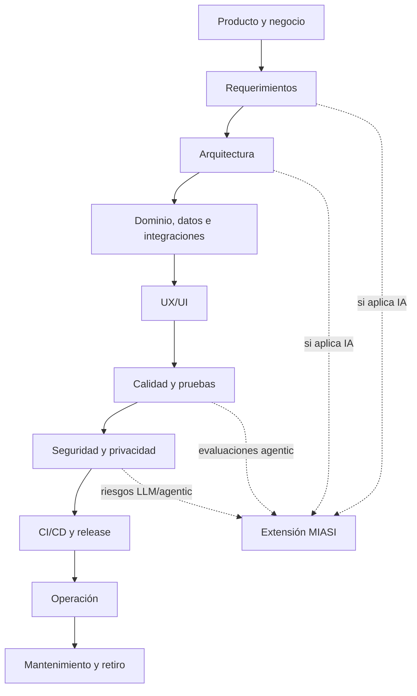

# MIPS-DOC-015 — Plantillas, checklists y schemas operativos de MIPSoftware

## 1. Resumen ejecutivo

Este documento consolida los activos operativos reutilizables de **MIPSoftware — Modelo de Ingeniería Profesional de Software**: plantillas, checklists y schemas. Su finalidad es convertir el estándar documental en instrumentos concretos que puedan usarse manualmente durante la ejecución de proyectos reales y, posteriormente, automatizarse mediante **DevPilot Local**.

MIPS-DOC-015 no introduce un nuevo proceso de ciclo de vida. Toma los dominios definidos en MIPS-DOC-001 a MIPS-DOC-014 y los operacionaliza en artefactos verificables. Cada plantilla define qué información debe existir, cada checklist define cómo verificar readiness o cumplimiento, y cada schema JSON establece una primera base para validadores automáticos.

## 2. Propósito

Definir un paquete mínimo de activos operativos para que un proyecto de software pueda avanzar de forma profesional desde visión de producto hasta producción y operación. Estos activos deben permitir:

- documentar decisiones y evidencias de ingeniería;
- revisar formalmente si un proyecto está listo para pasar de una fase a otra;
- reducir improvisación antes de implementar;
- mantener trazabilidad entre negocio, requerimientos, arquitectura, pruebas, seguridad, release y operación;
- activar MIASI cuando el sistema incorpore IA, agentes, LLMs, RAG, memoria, tool calling o automatización inteligente;
- preparar automatización futura con DevPilot Local.

## 3. Alcance

Este documento cubre tres grupos de activos:

1. **Plantillas operativas** en `docs/software_engineering_model/templates/`.
2. **Checklists de readiness y cumplimiento** en `docs/software_engineering_model/checklists/`.
3. **Schemas JSON iniciales** en `docs/software_engineering_model/schemas/`.

No sustituye los documentos rectores de MIPSoftware. Los complementa con instrumentos prácticos y auditables.

## 4. Principio rector

> Todo proyecto profesional debe producir evidencia revisable. Si una decisión, requisito, riesgo, contrato, prueba, release o excepción no deja evidencia, no puede tratarse como cumplida.
  
## 5. Relación con el ciclo de vida



## 6. Plantillas operativas requeridas

| Plantilla | Propósito | Fase principal | Gate asociado |
|---|---|---|---|
| `product_vision.md` | Formalizar visión, problema, usuarios y valor. | Producto | Product Discovery Gate |
| `business_case.md` | Justificar viabilidad, costos, beneficios y riesgos. | Negocio | Business Viability Gate |
| `stakeholder_map.md` | Identificar actores, responsabilidades e influencia. | Stakeholders | Stakeholder Alignment Gate |
| `requirements_specification.md` | Especificar requerimientos verificables. | Requerimientos | Requirements Ready Gate |
| `user_story.md` | Convertir necesidades en backlog accionable. | Requerimientos | Backlog Ready Gate |
| `use_case.md` | Describir interacción actor-sistema. | Requerimientos | Functional Design Gate |
| `acceptance_criteria.md` | Definir condiciones verificables de aceptación. | Requerimientos/testing | Acceptance Gate |
| `architecture_document.md` | Documentar arquitectura mínima. | Arquitectura | Architecture Ready Gate |
| `adr_template.md` | Registrar decisiones arquitectónicas. | Arquitectura | Decision Traceability Gate |
| `domain_model.md` | Documentar entidades, reglas, agregados e invariantes. | Dominio | Domain Model Gate |
| `data_model.md` | Definir modelos conceptual, lógico y físico de datos. | Datos | Data Design Gate |
| `api_contract.md` | Definir contrato de API. | Integraciones | API Contract Gate |
| `ux_screen_spec.md` | Especificar pantalla, estados y comportamiento. | UX/UI | UX Readiness Gate |
| `test_strategy.md` | Definir estrategia global de calidad y pruebas. | Calidad | Test Strategy Gate |
| `test_case.md` | Documentar caso de prueba verificable. | Testing | Test Coverage Gate |
| `security_threat_model.md` | Modelar amenazas y controles. | Seguridad | Security Design Gate |
| `privacy_assessment.md` | Evaluar tratamiento de datos personales. | Privacidad | Privacy Gate |
| `ci_cd_strategy.md` | Definir estrategia de automatización y pipelines. | DevOps | CI/CD Gate |
| `release_plan.md` | Preparar release, evidencias y rollback. | Release | Release Readiness Gate |
| `deployment_checklist.md` | Verificar despliegue. | Deployment | Deployment Gate |
| `runbook.md` | Documentar operación y soporte. | Operación | Operational Readiness Gate |
| `incident_report.md` | Registrar incidente. | Operación | Incident Learning Gate |
| `postmortem.md` | Convertir incidente en aprendizaje. | Operación | Postmortem Gate |
| `maintenance_plan.md` | Definir mantenimiento posterior al release. | Mantenimiento | Maintenance Gate |
| `retirement_plan.md` | Planificar retiro seguro. | Retiro | Retirement Gate |

## 7. Checklists requeridos

| Checklist | Propósito | Momento de uso |
|---|---|---|
| `checklist_pre_code.md` | Bloquear implementación prematura. | Antes de programar |
| `checklist_requirements_ready.md` | Confirmar requerimientos listos. | Antes de backlog definitivo |
| `checklist_architecture_ready.md` | Confirmar arquitectura mínima. | Antes de implementación significativa |
| `checklist_security_ready.md` | Verificar seguridad mínima. | Antes de release |
| `checklist_testing_ready.md` | Verificar estrategia y cobertura de pruebas. | Antes de release |
| `checklist_release_ready.md` | Confirmar release preparado. | Antes de publicar versión |
| `checklist_production_ready.md` | Confirmar readiness productivo. | Antes de producción |
| `checklist_operational_ready.md` | Verificar operación, runbook y monitoreo. | Antes de operación real |
| `checklist_miasi_required.md` | Determinar si se activa MIASI. | En discovery, arquitectura y seguridad |

## 8. Schemas iniciales

Los schemas en `docs/software_engineering_model/schemas/` son una primera versión para automatización futura. Se basan en JSON Schema como lenguaje declarativo para describir estructura, restricciones y tipos de documentos JSON.

| Schema | Valida | Uso futuro en DevPilot Local |
|---|---|---|
| `product_vision.schema.json` | Visión de producto | `devpilot validate-product` |
| `requirement.schema.json` | Requerimiento individual | `devpilot validate-requirement` |
| `adr.schema.json` | ADR | `devpilot validate-adr` |
| `api_contract.schema.json` | Contrato API | `devpilot validate-api-contract` |
| `test_case.schema.json` | Caso de prueba | `devpilot validate-test-case` |
| `security_threat_model.schema.json` | Threat model | `devpilot validate-threat-model` |
| `release_plan.schema.json` | Plan de release | `devpilot validate-release` |
| `production_readiness.schema.json` | Checklist producción | `devpilot readiness-check` |

## 9. Criterios generales PASS/FAIL/BLOCK

| Resultado | Definición | Consecuencia |
|---|---|---|
| PASS | El artefacto contiene campos obligatorios, evidencia suficiente y criterios verificables. | Puede avanzar al siguiente gate. |
| FAIL | El artefacto está incompleto, ambiguo o no verificable. | Debe corregirse antes de avanzar. |
| BLOCK | Existe riesgo crítico o ausencia de evidencia mínima. | Se bloquea avance hasta decisión formal. |

## 10. Reglas de bloqueo transversales

Un proyecto debe bloquear avance si ocurre cualquiera de estas condiciones:

- no existe visión de producto para una iniciativa no trivial;
- no hay requerimientos verificables para funcionalidades críticas;
- no hay arquitectura mínima antes de implementación significativa;
- no hay threat model mínimo para sistemas con datos sensibles o exposición externa;
- no hay estrategia de pruebas para un release;
- no hay rollback para despliegue productivo;
- no hay runbook para operación productiva;
- no hay evaluación MIASI cuando el sistema usa IA, agentes o LLMs;
- se tratan datos personales sin política de privacidad o clasificación;
- se intenta publicar una API sin contrato.

## 11. Automatización futura en DevPilot Local

MIPS-DOC-015 deja los artefactos preparados para comandos como:

```bash
devpilot validate-template docs/software_engineering_model/templates/product_vision.md
devpilot validate-schema docs/software_engineering_model/schemas/product_vision.schema.json
devpilot readiness-check --project ./my-project
devpilot check-miasi-required --project ./my-project
devpilot generate-release-report --project ./my-project
```

## 12. Relación con MIASI

MIASI se activa cuando un proyecto incluye IA, agentes, LLMs, RAG, memoria, tool calling, decisiones asistidas por IA, generación automática de contenido o acciones con herramientas. En esos casos, los artefactos generales de MIPSoftware deben complementarse con Agent Card, Tool Card, Eval Card, Policy Card, Human Approval Card, Observability Card y demás activos MIASI.

## 13. Referencias

- ISO/IEC/IEEE 12207 — Software life cycle processes.
- ISO/IEC/IEEE 29148 — Requirements engineering.
- ISO/IEC 25010 — Systems and software quality models.
- NIST SP 800-218 — Secure Software Development Framework.
- OWASP ASVS — Application Security Verification Standard.
- JSON Schema — Specification and documentation.

## 14. Changelog

| Versión | Fecha | Cambio |
|---|---|---|
| 0.1.0 | 2026-05-31 | Creación inicial de MIPS-DOC-015. |
