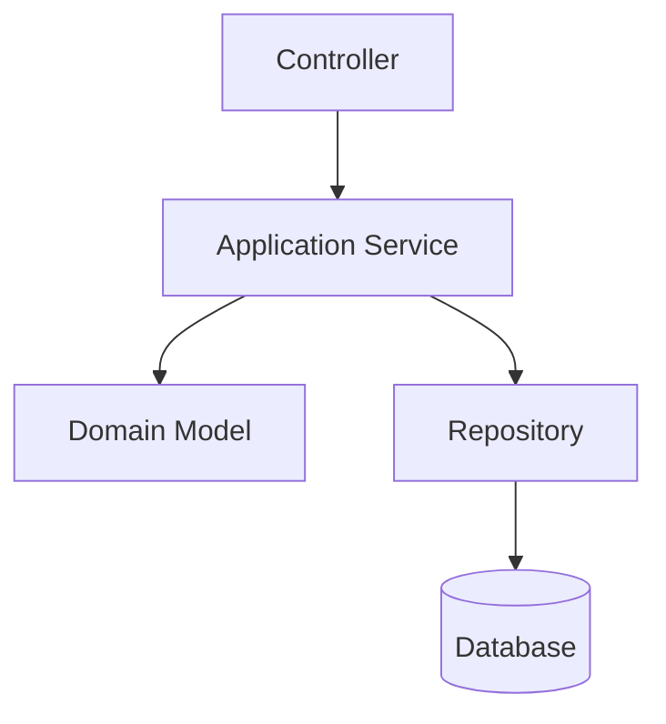

# C4 Nivel 3 — Componentes: [Contenedor]

## Propósito

Describir componentes internos relevantes de un contenedor.

## Componentes

| Componente | Responsabilidad | Entrada | Salida | Dependencias | Pruebas |
|---|---|---|---|---|---|
| Controller/API |  |  |  |  |  |
| Application Service |  |  |  |  |  |
| Domain Model |  |  |  |  |  |
| Repository |  |  |  |  |  |

## Diagrama Mermaid

## Riesgos internos

| Riesgo | Componente | Mitigación |
|---|---|---|
|  |  |  |

## Criterios de revisión

- [ ] Responsabilidades claras.
- [ ] Dependencias razonables.
- [ ] Lógica de dominio ubicada correctamente.
- [ ] Pruebas mínimas definidas.
