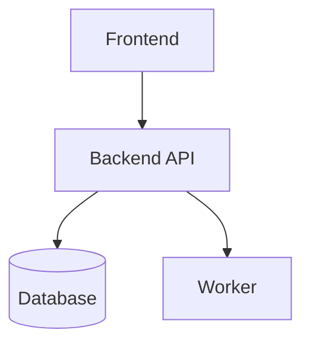

# C4 Nivel 2 — Contenedores: [Nombre del sistema]

## Propósito

Describir las aplicaciones, servicios, bases de datos, workers y otros contenedores ejecutables/persistentes.

## Contenedores

| Contenedor | Responsabilidad | Tecnología | Datos | Riesgos | Observabilidad |
|---|---|---|---|---|---|
| Frontend |  |  |  |  |  |
| Backend API |  |  |  |  |  |
| Database |  |  |  |  |  |
| Worker |  |  |  |  |  |

## Diagrama Mermaid

## Contratos entre contenedores

| Origen | Destino | Protocolo | Contrato | Error handling |
|---|---|---|---|---|
|  |  | REST/Event/SQL |  |  |

## Criterios de revisión

- [ ] Cada contenedor tiene responsabilidad clara.
- [ ] No hay contenedor sin razón de existir.
- [ ] Contratos principales definidos.
- [ ] Datos y seguridad considerados.
