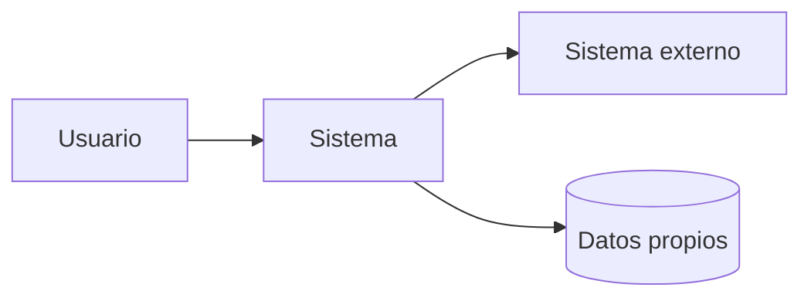

# C4 Nivel 1 — Contexto: [Nombre del sistema]

## Propósito

Mostrar el sistema como caja negra dentro de su entorno.

## Personas y sistemas externos

| Elemento | Tipo | Relación con el sistema | Datos intercambiados |
|---|---|---|---|
| Usuario final | persona | usa |  |
| Sistema externo | sistema | integra |  |

## Diagrama Mermaid

## Límites

- Dentro del sistema:
- Fuera del sistema:

## Riesgos de contexto

| Riesgo | Impacto | Mitigación |
|---|---|---|
|  |  |  |

## Criterios de revisión

- [ ] Personas identificadas.
- [ ] Sistemas externos identificados.
- [ ] Límites explícitos.
- [ ] Datos sensibles identificados.
- [ ] MIASI evaluado si hay IA/agentes.
