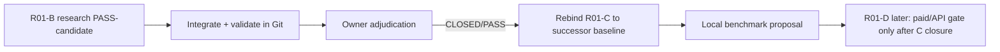

# R01-B action plan

## Phase 1 — Integrate B only

1. Verify repo343 SHA and Git commit exactly.
2. Verify R01-A owner adjudication `CLOSED/PASS`.
3. Create/reuse feature branch `feat/devpl-gsdlc-r01-b-auth-terms-data` from `316f616263a74916e9a35ce1596f70e86952ebaa`.
4. Plan and dry-run the exact 18-path delta.
5. Materialize 17 R01-B files plus additive Source Registry entries.
6. Run semantic source/decision audit, A↔B consistency and no-go preservation.
7. Run Docs Governance, Project State, TCR v1/v2, focal tests and Test Impact.
8. Exact stage, blob/hash verification, `git diff --cached --check`.
9. Commit, push feature, ff-only promote canonical, build successor baseline.
10. Package Windows evidence and stop at `PASS-CANDIDATE/PENDING-OWNER-ADJUDICATION`.

## Phase 2 — Owner adjudication

Owner verifies the evidence package, source-ledger disclosure and successor baseline. Only owner adjudication may set R01-B to `CLOSED/PASS` and authorize R01-C.

## Phase 3 — R01-C (not implemented here)

After B is independently `CLOSED/PASS`, rebind the R01-C prompt to the actual successor baseline. R01-C may propose only controlled local benchmark routes already classified `allowed`: Ollama localhost and LM Studio localhost. Any model download still requires explicit owner approval and an exact model/license/hardware proposal.

No R01-C/D/E execution occurs in this package.
